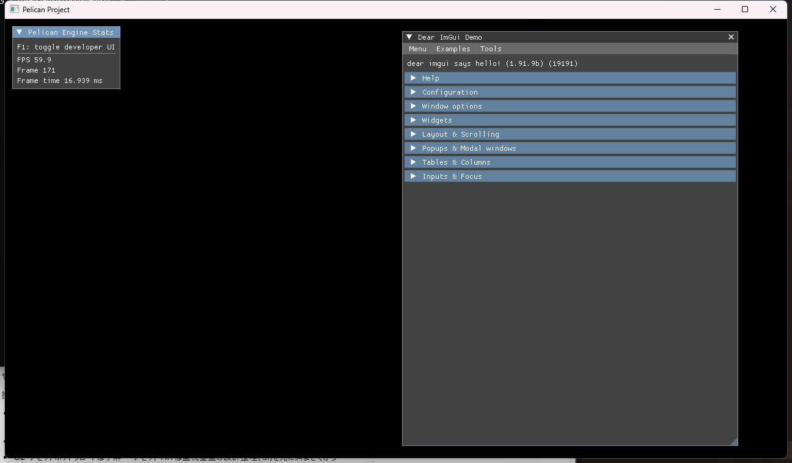

# WP85 実装レポート: ImGui 導入

日付: 2026-07-12 / 対象: `agent/wp85-imgui`

## 結果

Dear ImGui 1.91.9b を commit `f5befd2d29e66809cd1110a152e375a7f1981f06` に固定し、公式 GLFW / Vulkan backend とともに専用 `pelican_imgui` CMake target へ隔離した。通常の windowed player だけが context、backend、入力 hook、`imgui_pass` を生成する。`PELICAN_WITH_IMGUI` の既定値は ON、`dist-config` の導出値は OFF。

## build 隔離

- `PELICAN_WITH_IMGUI=OFF` では `src/core/imgui` と upstream `imgui*.cpp` / backend を target source に追加しない。
- OFF 独立 build で configure と `pelican_player` build に成功した。
- OFF build の `pelican_core.vcxproj` source path、ImGui object/library/font artifact、`dumpbin /symbols pelican_core.lib` を検査し、いずれも 0 件だった。
- WP40 の `run_build_units_smoke.cmake` に IMGUI 単独 OFF build と source/artifact/symbol 検査を追加した。
- `pelican_cli dist-config` は `set(PELICAN_WITH_IMGUI OFF CACHE BOOL "" FORCE)` を常に出力する。

## runtime / input 隔離

- runtime gate は `headless` / `rpc` / input replay / golden の各 driver で false になり、ImGui module を取得せず、ツール callback を呼ばず、graph に `imgui_pass` を追加しない。
- 隔離テストでは4 driver それぞれについて、公開 callback 呼出 0 回、入力消費 mask 不変、frame plan に `imgui_pass` なしを固定した。
- Window が key / mouse button / cursor / scroll / character の GLFW callback を単独所有する。公式 GLFW backend は `install_callbacks=false` で初期化し、backend callback と自前 forward の二重配信を作らない。
- Window の ordered `InputEvent` は InputState に一度だけ格納され、frame freeze 後に ImGui adapter が同じ列を読む。ImGui の `WantCaptureKeyboard` / `WantCaptureMouse` を Actions freeze 前に consumption mask へ反映する。
- 優先順は `raw -> ImGui -> pelican.ui -> gameplay`。テストでは ImGui が keyboard、pelican.ui が pointer を消費した後の gameplay snapshot が両方を観測しないことを確認した。
- F1 toggle は GLFW key state の直接参照ではなく、engine 内部の `pelican.input_actions` map (`kbd:f1`) で評価する。

## 描画

- interactive 構成だけ、canonical `__anchor_imgui` の直後かつ `output_transform` の前に load/store overlay の `imgui_pass` を挿入する。
- pass は canonical `display[dL]` target 上で dynamic rendering を行い、既存 display 内容へ linear blend する。
- multi-viewport と docking は v1 で OFF。固定した upstream mainline build は両機能を有効化しない。
- デモウィンドウと `Pelican Engine Stats` (FPS、frame index、frame time) を初期表示する。F1 で両方を toggle する。

## platform / device loss 対応

- clipboard と IME の platform hook は公式 GLFW backend 初期化を利用できる。
- OS cursor shape の ImGui 駆動は v1 では無効。Window の cursor ownership を維持するため `NoMouseCursorChange` とした。
- **device loss の自動復旧は未対応**。現状の engine は device-loss recovery lifecycle を持たず、ImGui Vulkan pipeline、descriptor pool、font texture の再生成経路もない。device 再生成を導入する WP では `ImGui_ImplVulkan_Shutdown` 後に backend を再初期化する必要がある。swapchain resize は display format が不変のため現行 backend を継続利用できる。

## 検証

環境: Visual Studio 2022 / Debug、NVIDIA GeForce RTX 5080、driver 591.86、Vulkan API 1.4.325。configure では指定された Python 3.12.13 を `Python3_EXECUTABLE` に設定した。

- full Debug build: 成功。
- CTest 直列: 267 件中 failure 0。既存の Windows symlink 権限条件による PathResolver 1 件のみ SKIP。WP85 テストの SKIP は 0。
- WP85 focused: 隔離、canonical frame-plan 配置、入力優先順の3件すべて成功。
- golden image: 20 case を検出し、全 case 一致、SKIP 0。
- WP74 byte-exact baseline hash: 20 case 全一致。
- headless player: 生成した最小 project、1 frame、64x64、終了コード 0。dump/log に `imgui_pass` と `ImGuiSystem` はともに 0 件。
- OFF player: 同じ最小 projectの headless 1 frame、終了コード 0。
- windowed player: 同じ最小 projectで 8.22 秒後も main loop 生存、stderr 0 byte。上のスクリーンショット取得後に PID を明示停止した。`imgui.ini` は生成しない。
- `git diff --check`: 成功。
- 終了時に `pelican_player` / CMake / shader compiler の残留 process なし。
