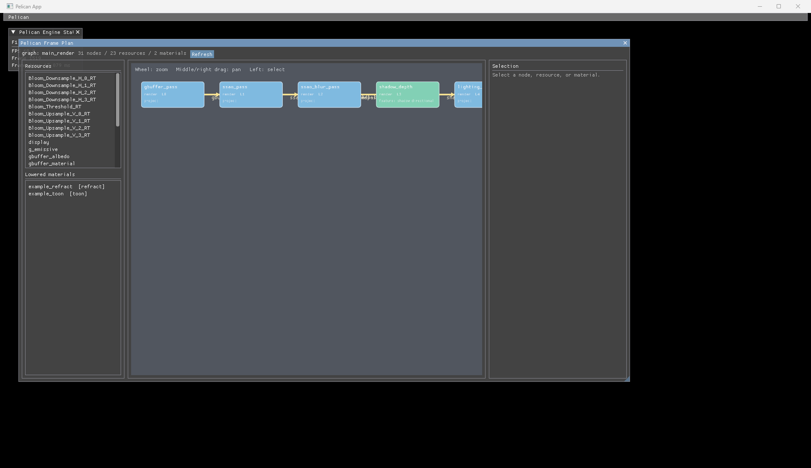
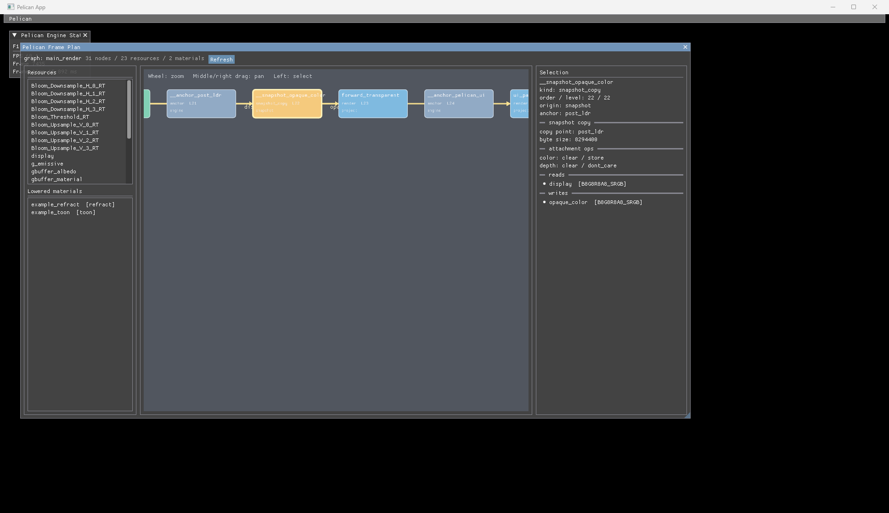
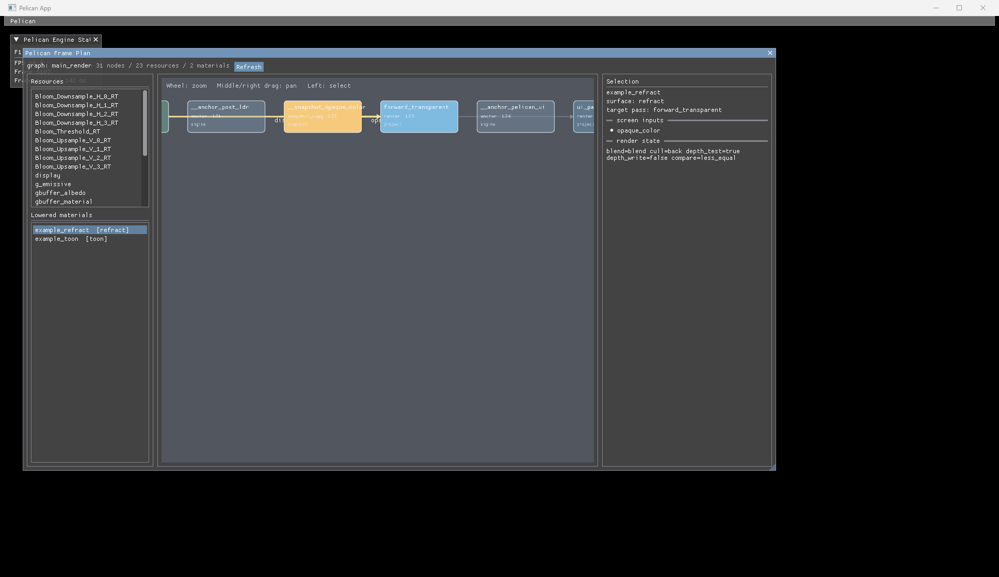

# WP86 実装レポート: Plan viewer

日付: 2026-07-12 / 対象: `agent/wp86-plan-viewer`

## 結果

実行中の `pelican.frame_plan` version 1 を ImDrawList だけで左から右へ可視化する
`Pelican Frame Plan` を実装した。F1 で既存 developer UI 全体を表示し、上部の
`Pelican` メニューから viewer、frame stats、Dear ImGui demo を個別に開閉できる。

## データ境界

- ノード、実行順、level、read/write、barrier、snapshot の `snapshot_after` と
  `byte_size` は `Renderer::currentFramePlanJson()`、すなわち
  `get_frame_plan` / `--dump-frame-plan` と同じ JSON だけから構築する。
- format、format_class、load/store、feature 由来、canonical anchor は、実行時と
  同じ `ProjectBasicConfig`、`PathResolver`、`composeRenderFeatureConfig`、
  `resolveRenderTargetFormatClassesV2` をツール層で再評価して表示注釈にする。
  注釈は plan の node/barrier を追加・削除・並べ替えできない。
- `.material.json` は project root からファイル名順に収集し、正規の
  `parseSurfaceFormat`、`parseMaterialFormatJson`、`lowerMaterial` を通す。
  surface stem、screen_inputs、target_pass、render_state は lowering 結果だけを
  表示する。
- renderer 内部構造への参照と engine core の const accessor 追加はともに 0 件。

## 表示と操作

- level を X、同一 level 内の plan order を Y に使う決定的な層状 layout。
- raster、compute、feature、engine 常設、snapshot_copy を色分けする。
- barrier を resource 名付きの向き付き Bézier edge と矢印で描く。resource 選択時は
  reader/writer と該当 edge を強調する。
- node 選択では I/O と解決済み format、color/depth load/store、feature、anchor を
  詳細表示する。snapshot_copy はコピー点と byte size も表示する。
- lowered material 選択では surface、screen_inputs、target_pass、render_state を
  詳細表示し、screen input edge、snapshot node、target pass を強調する。
- mouse wheel zoom、middle/right drag pan、left click select。外部 node graph
  library は追加していない。

## 隔離

- `planviewer.cpp` は `PELICAN_WITH_IMGUI` 条件内の `pelican_imgui` object target
  だけに所属する。
- viewer の生成・draw は既存 `invokeImGuiRuntimeCallback` 内の `ImGuiSystem` から
  だけ到達する。このため golden、input replay、headless、RPC は callback 0 回の
  既存契約をそのまま維持する。
- 独立 OFF tree で `pelican_player` を build し、`pelican_core.vcxproj` の
  `src/core/imgui` / `planviewer` source hit 0、`build/src` 配下の viewer/ImGui
  artifact hit 0、headless plan の `imgui_pass` hit 0 を確認した。

## 検証

環境: Visual Studio 2022 / Debug、NVIDIA GeForce RTX 5080、Vulkan SDK 1.4.309。
configure は指定の Python 3.12.13 を `Python3_EXECUTABLE` に設定し、Qt のない
環境なので `SKIP_DEVSTUDIO=ON` とした。

- full Debug build: 成功。
- CTest 直列: 275 件中 failure 0。Windows symlink 権限条件 1 件のみ SKIP。
- WP86 focused: public frame-plan projection と不正 schema 拒否の 2 件とも成功。
- golden image: 21 case の件数 REQUIRE を維持、63 assertions、failure 0、SKIP 0。
- OFF smoke: configure、`pelican_player` build、最小 project の headless 1 frame、
  `--dump-frame-plan` がすべて成功。
- example 検証: tracked example は大容量 model asset が worktree にないため、同じ
  rendering config / material / surface を asset-free scene へコピーして使用した。
  HDR ON/OFF、shadow_directional、既存 bloom、opaque_color snapshot、
  forward_transparent を含む plan をそれぞれ headless で実行した。上の 3 枚は HDR
  ON plan (31 nodes / 23 resources / 2 lowered materials)。windowed player は 8 秒後も
  main loop 生存、validation/fatal hit 0、stderr 0 byte。撮影後 PID を明示停止した。
- `git diff --check`: 成功。
- 終了時の `pelican_player` / CMake 残留 process: 0。

## engine core 変更

なし。変更は ImGui ツール層、ツール専用テスト、CMake 登録、本文書と画像だけ。
