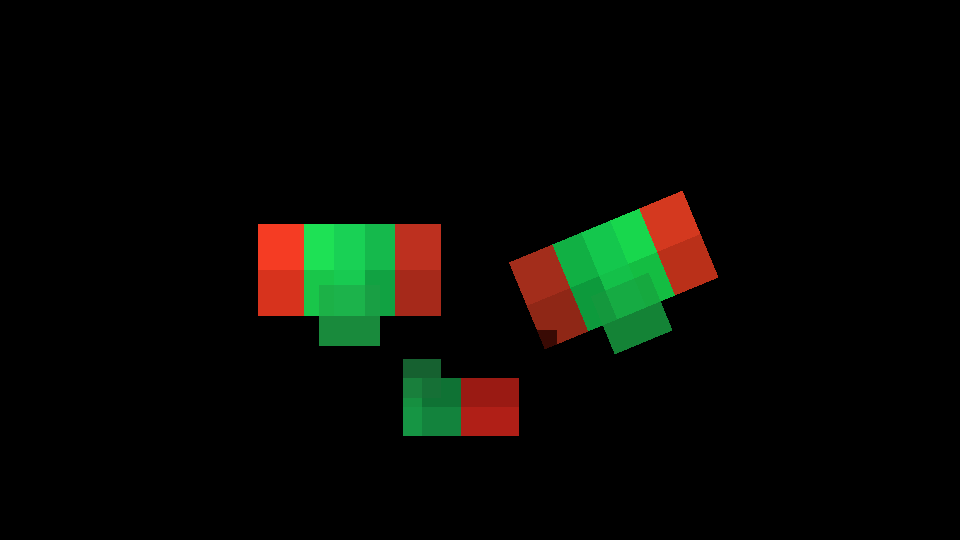

# WP104 完了レポート — 2D S2D-0b GPU world quad パス

日付: 2026-07-13
ブランチ: `agent/wp104-s2d0b`

## 1. 結論

WP103 の `SpriteCommand` / `SpriteFrame` / `SpriteChunk` を変更せず、ECS の
`sprite_view` から world-space quad を抽出し、既存 chunk の uint16 index 列を
GPU vertex/index buffer へ送る sprite consumer を実装した。

描画は opt-in の `engine://features/sprite.json` で有効になる。固定 shader は
FrameUBO の camera view/projection を使い、XY 平面・+Z 法線の quad、pivot、flip、
tint、回転/親子 Transform、`y_axis` / `full` billboard を描画側で展開する。
texture は sRGB view により linear decode され、shader は linear straight-alpha を
出力する。blend 値は UI と同じ SrcAlpha / OneMinusSrcAlpha、alpha は
One / OneMinusSrcAlpha である。

## 2. パス位置と depth 契約

canonical anchor 列に `sprite` を `post_main` の直前として追加した。sprite feature
有効かつ可視 command がある場合だけ、この anchor で直前の scene color と、先行する
3D pass の depth attachment を引き継いで描画する。既存 pass の全順序は維持される。

`sprite_depth` の execution trace 抜粋:

```text
lighting_pass (order 2)
  -> __anchor_sprite (order 3)
       color=display, depth=offscreen_depth
       depth_test=true, depth_write=false, blend=straight_alpha
  -> __anchor_post_main (order 4)
```

`sprite_depth` golden では opaque 3D が背面 sprite を遮蔽し、前面 sprite は表示される。
仕様 §4 どおり sprite は depth を書かないため、後続 draw の occluder にはならない。
3D 半透明との相互ソート、交差する大きな回転 quad、alpha-cutout/depth prepass は対象外の
ままである。

## 3. ECS と GPU データ経路

1. `SpriteViewRenderSystem` は `EntityId + TransformComponent + SpriteViewComponent`
   を LocalTransform 適用後に走査する。
2. asset 宣言の sampler と atlas fragment を解決し、world matrix、pivot、UV/flip、
   linear tint、layer、sort 値、billboard、bounds を既存 `SpriteCommand` に格納する。
3. 既存 `buildFrame()` を呼び、cull → total sort → 16384 以下の既存 chunk を得る。
4. `SpriteRenderer` は command を4頂点へ展開しつつ `SpriteChunk.indices` をそのまま連結し、
   contiguous batch key ごとに indexed draw を発行する。

WP103 の `src/core/userpublic/sprite/spriteworld.{hpp,cpp}` には変更を加えていない。

## 4. atlas ownership — 3構成 fixture

golden 内で module 初期化状態と allocation 数を検査した。

| 構成 | fixture | UI runtime | sprite runtime | shared atlas | 結果 |
|---|---|---:|---:|---:|---|
| UI 無効 + sprite のみ | `sprite_ortho_atlas` ほか | 無 | 有 | 有 | UI module/GPU は未初期化、sprite が単独で page upload |
| UI のみ | `ui_u1` | 有 | 無 | 有 | SpriteScene/SpriteRenderer は未初期化、3 pages (white + red + blue) |
| UI + sprite | `sprite_ownership` | 有 | 有 | 有 | 同じ atlas page stable name を再利用し、2 pages (white + shared page) |

UI の `QuadVertexPx`、UI pipeline、UI pass、draw order は変更していない。

## 5. golden 一覧

VAT 有効時の件数 REQUIRE を 24 → 29、無効時を 23 → 28 に、新規5件分だけ更新した。
既存 golden PNG は git 上で byte 不変であり、既存 WP73 RGBA8 SHA-256 も全件一致した。

| case | 検証内容 | RGBA8 SHA-256 |
|---|---|---|
| `sprite_ortho_atlas` | orthographic、複数 layer、flip、tint、straight alpha | `9503245a0161a939de15c2414db2d336e761822fa6cff8136e4148f58f1f782e` |
| `sprite_depth` | opaque 3D との前後関係、depth test ON/write OFF | `157c1aa22f0d3fa5de7f683557b15c9f6e9da6d4e3c7817779325a77b1f11744` |
| `sprite_multi_atlas` | atlas page 0/1 の切替と batch bind | `33d31fff94bcddeadc5f1f9bd40b67c14b8a37280d02e4f77d5b2f31a9f4672e` |
| `sprite_parent` | 親回転 + 子 local transform | `ab57b926c87895c5e556ffd0599870525f2ba66805c0d1d9886ba0ebf86fdd9d` |
| `sprite_ownership` | UI と sprite の同時描画・shared page allocation | `2a59e02d0f80df3c48f28f18e721fb495063809357bb434cad8ffc0580ac62f8` |

## 6. demo と screenshot

自己完結 project を `projects/sprite_demo` に追加した。atlas、scene、rendering config、
shader を project 内に持ち、layer、flip、tint、回転を表示する。



実行例:

```powershell
build/src/player/Debug/pelican_player.exe --project projects/sprite_demo --camera "0,0,4,0,0,0,45"
```

## 7. 検証記録

1. configure
   - `cmake . -B build -DSKIP_DEVSTUDIO=ON -DPython3_EXECUTABLE=C:\Users\enjoy\AppData\Roaming\uv\python\cpython-3.12.13-windows-x86_64-none\python.exe`
   - 成功。Visual Studio 17 2022 / Debug、`PELICAN_WITH_VAT=ON`。
2. full build
   - `cmake --build build --config Debug --parallel 8`
   - 成功。
3. all CTest
   - `ctest --test-dir build -C Debug --output-on-failure --parallel 4`
   - 352 / 352 pass。既存の platform 条件付き symlink case 1件は skip。
4. golden verbose
   - `ctest --test-dir build -C Debug -R "^golden image cases match expected output$" -V`
   - 29 cases、126 assertions、golden 内部 SKIP marker 0、update marker 0。
5. player
   - headless 960×540 を2 frame描画し、上記 screenshot を取得。
   - windowed player を同 demo で 8.161 秒監視。早期終了なし、fatal/error なしを確認後停止。
6. hygiene
   - `git diff --check` clean。

## 8. 逸脱・残件

仕様からの逸脱、判断待ち、未解決質問はない。strict pixel-perfect、ppu/zoom policy、
billboard policy fixture、flipbook dogfood は設計どおり S2D-1 の範囲に残す。
