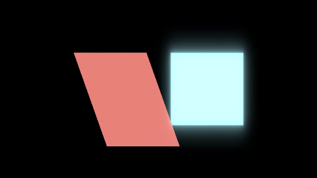

# WP123b 完了レポート — VRM-S1b per-instance expression/application sink

日付: 2026-07-17
ブランチ: `agent/wp123b-vrms1b`

## 結論

WP123 の再スコープを完了した。VRM 1.0 expression 入力を instance ごとに
snapshot し、binary / override / bind weight と expression lookAt を解決して、
morph は WP121 weight frame、base color / emission / texture transform は WP122b
の `(instance, source material index)` absolute override へ同一 frame revision で
publish する。

凍結済み `animation/abi_v1.hpp` は無変更である。公開面は別ヘッダー
`animation/vrm_application_v1.hpp` の versioned additive service とし、engine 内部
だけの特権経路は設けていない。bone lookAt と firstPerson は確定判断どおり S1c
のままであり、本 WP へ混入していない。

## 実装したデータフロー

1. `SetExpressionInputDescV1` の入力を instance identity / generation と
   `input_revision` で保持する。
2. `parameter_snapshot` で immutable な `ExpressionInputSnapshot` を作る。
3. `world_post_process` priority 100 で expression lookAt を `lookLeft` /
   `lookRight` / `lookUp` / `lookDown` へ写す。
4. priority 200 で binary、mouth / blink / lookAt override、morph bind、material
   bind を `ResolvedExpressionFrame` へ解決する。
5. `commit` で既存 WP121 `publishMorphWeightFrame` と WP122b
   `publishMaterialInstanceAbsoluteOverride` だけを呼ぶ。application 側では sink
   の計算や GPU storage を再実装していない。
6. morph と複数 material absolute override は
   `publishVrmApplicationTransaction` で全成功または rollback とした。

material 値は model generation に属する immutable な
`SourceMaterialInitialValueTable` を Base として、仕様式をそのまま適用する。

`Resolved = Base + Σ((Target - Base) × expressionWeight)`

texture offset / scale も同じ式であり、rotation は初期値を保持する。morph は
全 weight を 0 から開始して bind 寄与を加算する。入力は `[0, 1]` に clamp し、
binary は `weight >= 0.5` を 1、それ未満を 0 とする。

## 公開 application service

公開ヘッダー: `src/core/userpublic/animation/vrm_application_v1.hpp`

| 公開要素 | 用途 |
|---|---|
| `getApplicationServiceV1` | service version 1 の additive negotiation |
| `ApplicationServiceV1` | capability と関数 table |
| `SetExpressionInputDescV1` | expression weight、lookAt yaw/pitch、revision の入力 |
| `SnapshotExpressionInputDescV1` | frame revision 固定 snapshot |
| `EvaluateExpressionLookAtDescV1` | expression type lookAt 評価 |
| `ResolveExpressionFrameDescV1` | bind 解決と件数の取得 |
| `QueryResolvedExpressionWeightDescV1` | 解決済み weight の照会 |
| `GetApplicationDiagnosticDescV1` | machine-testable diagnostic の照会 |
| `PublishApplicationFrameDescV1` | WP121 / WP122b への atomic publish |
| `DiscardApplicationFrameDescV1` | 未 publish frame の破棄 |
| `ApplicationFrameHandle` | generation 付き opaque frame handle |

capability bits は snapshot、expression lookAt、morph publish、material publish、
phase evaluator、diagnostics の 6 項である。descriptor は全て `struct_size`、
`version`、reserved-zero 規律に従う。第三者 DLL
`pelican_vrm_application_public_evaluator` はこの公開ヘッダーと public instance
handle だけを使用し、`pelican_core` も内部ヘッダーも link / include しない。

## phase 契約

標準 evaluator は engine owner で、公開 `AnimationServiceV1::register_phase` のみを
使って登録する。game DLL hot reload で標準 phase が失われないよう caller owner
には属させていない。animation runtime reset の registration generation が変わった
場合だけ再登録する。

| 処理 | 公開 phase | priority | registration identity |
|---|---|---:|---:|
| input snapshot | `parameter_snapshot` | 0 | `0x56524d4150500001` |
| expression lookAt | `world_post_process` | 100 | `0x56524d4150500002` |
| expression resolve | `world_post_process` | 200 | `0x56524d4150500003` |
| application commit | `commit` | 200 | `0x56524d4150500004` |

同一 key の collision は登録失敗として返し、途中まで登録した phase は undo する。
既存 clip / graph evaluator のコードと意味論は変更していない。

## MToon color bind 方針

`color`、`emissionColor`、texture transform は実装した。次の MToon 系 type は
bind 単位で output から除外し、expression 名、source material index、type、bind
ordinal を診断として残す。

- `shadeColor`
- `matcapColor`
- `rimColor`
- `outlineColor`

ログと公開診断の code は
`VRM_EXPRESSION_UNSUPPORTED_MATERIAL_COLOR_TYPE` /
`ApplicationDiagnosticCodeV1::unsupported_material_color_type` で固定した。同一
instance generation / expression / material / type / bind ordinal では WARN を一度
だけ出す。VRM 1.0 fixture は 4 種を同時に含み、全ての名前と 4 diagnostics を検査
する。

## §4.5 gate 対応

| §4.5 / 再スコープ gate | 実証 |
|---|---|
| 二体で別 expression | `vrm_expression_on` は左 `happy=0.25`、右 `happy=1.0`。morph current と material absolute override が異なることを render 前に assertion |
| 同 frame revision | 両 body の morph / material current revision がともに `123` |
| expression on/off golden | `test/golden/vrm_expression_on` と `vrm_expression_off` を追加 |
| public phase | 上表の 4 callback を public `register_phase` だけで実行 |
| 第三者 DLL | public service table から set → snapshot → lookAt → resolve → diagnostic → publish を実行 |
| MToon WARN fixture | shade / matcap / rim / outline の名前、公開 code、bind 除外を検査 |
| WP121 morph sink | DLL / golden とも既存 morph weight frame の revision / value を検査 |
| WP122b material/UV sink | source material 0 の absolute base / emission / UV と revision を検査 |
| N/N-1 / reset | publish は WP121 / WP122b の既存 temporal storage と reset / discontinuity flag を使用 |
| expression lookAt | yaw 正を left、負を right、pitch 正を down、負を up とし、range map、zero input max を unit test |
| bone lookAt / firstPerson | S1c 対象として未実装 |

## 検証結果

configure は指定どおり実行した。

```text
cmake -S . -B build -DSKIP_DEVSTUDIO=ON -DPython3_EXECUTABLE=C:\Users\enjoy\AppData\Roaming\uv\python\cpython-3.12.13-windows-x86_64-none\python.exe
```

| gate | 結果 |
|---|---|
| Debug full build | 成功 |
| `pelican_test_vrmapplication_test` | 2 cases / 43 assertions、failure 0 |
| full CTest | 463 / 463 PASS、361.85 秒 |
| golden verbose `ctest -R golden -V` | 5 / 5 PASS、95.70 秒、`GOLDEN_SKIP_MATCHES=0` |
| image golden 登録数 | VAT ON 48、VAT OFF 47。`test/golden` directory 実数 48 |
| RGBA8 hash / renderer trace | 新規 2 cases を追加して再採取、全一致 |
| windowed player | 8.46 秒生存、`LOG_ERROR` / `fatal` 0 |

full CTest の集計には既存の Windows symlink 作成権限依存テスト 1 件が
`Skipped` と表示されるが、失敗ではなく WP123 / golden の skip でもない。golden
単独 verbose の skip marker は 0 である。

## player 手動確認

再現手順:

```text
build\test\Debug\pelican_test_vrm_expression_preview_writer.exe build\test_artifacts\wp123_vrm_preview
build\src\player\Debug\pelican_player.exe --project build\test_artifacts\wp123_vrm_preview --game-logic build\test\Debug\pelican_wp90_fixture_v1.dll --camera 0,0,3.2,0,0,0,45
```

1. 左の `VrmExpressionPreview` が約 4.19 秒周期で `happy` を 0→1→0 と変え、
   morph で上辺が右へ変形し、base color / emission が青系から赤系へ変化する。
2. 右の `VrmExpressionReference` は初期 morph / 初期 material のままである。
3. preview の gaze は yaw を往復し、expression lookAt weight が同じ phase pipeline
   で更新される。
4. ログに `WP123 VRM expression preview connected` と 4 種の名前入り WARN が
   一度ずつ出る。8 秒後も window は生存し、error は 0 であった。

60 frame / 60 fps 時点の確認画像（左: expression on、右: reference）:



## 非回帰・境界

- `src/core/userpublic/animation/abi_v1.hpp` の diff は 0。
- `src/core/ecs` は無変更。
- renderer の shared material template は不変であり、source material initial metadata
  も immutable shared ownership のまま instance application へ渡す。
- unsupported bind は silent drop せず、公開診断と named WARN を残す。
- bone pose staging、firstPerson visibility、constraint priority 300 は S1c の責務で
  あり、今回の expression sink から明示的に分離した。
