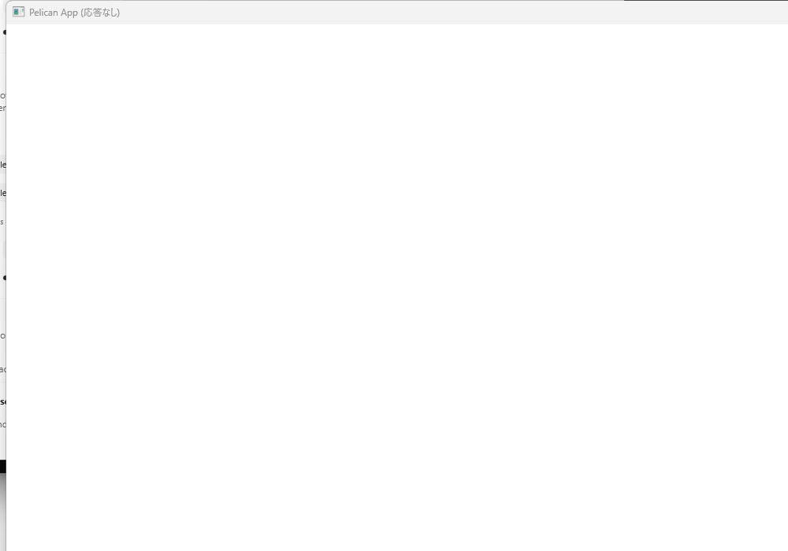

# WP136 Meta XR Simulator スモーク報告

- 実施日: 2026-07-17 (Asia/Tokyo)
- 対象: `agent/wp136-xrsim` / base `15e6fbd1f6fa85714d3ee433b0305527e49ec4fa`
- 参照: `docs/implementation_plan.md` WP136、`docs/design_reviews/2026-07-17_wp133_report.md` §8、`docs/design_reviews/2026-07-17_wp125_report.md`
- 結論: Meta XR Simulator v201.0 はログインなしで取得でき、Pelican は `--xr on` で Simulator の `FOCUSED` まで到達した。ただし最初の XR フレーム直後に ImGui のフレームライフサイクル assert で停止するため、ミラー正常描画、focus loss/regain、`shouldRender == false`、10 分安定性は未達である。WP136 の指示どおりエンジンコードは修正していない。

## 1. 配布経路の調査結果

| 経路 | 調査結果 | 判定 |
|---|---|---|
| Meta 公式 Windows standalone | [公式ダウンロードページ](https://developers.meta.com/horizon/downloads/package/meta-xr-simulator-windows/) は v201.0（2026-04-28 更新）を掲載。ページが参照する CDN の `meta_xr_simulator_v201.0.msi` はログインなしで HTTP 200、286,486,528 bytes を取得できた | 採用 |
| Meta 公式 npm | `https://npm.developer.oculus.com/` の `com.meta.xr.simulator` は匿名参照でき、最新版は 81.0.1 | 非採用。Meta は [旧パッケージページ](https://developers.meta.com/horizon/downloads/package/meta-xr-simulator/) で v83 以降 deprecated、standalone へ移行済みと明記 |
| public npm | 同名の別系統パッケージが存在するため、公式 Meta registry 以外は使用しない | 非採用 |
| NuGet | nuget.org v3 search API で `Meta XR Simulator` は `totalHits=0` | 配布なし |
| Unity / Unreal | 現行ページは standalone を共通ランタイムとして案内する。Unity の旧 project package は deprecated。v201.0 の既知問題には一部 Unreal scene の crash が記載されている | Pelican native OpenXR の導入元には使わない |

取得物の検証結果:

- ファイル: `meta_xr_simulator_v201.0.msi`
- SHA-256: `34C2FADDF857FBEB57C1AE08A8906A015BF8E87F4C21B3BE2B0C74A400E94810`
- Authenticode: `Valid`
- 署名者: `Meta Platforms, Inc.`
- 発行者: `DigiCert Trusted G4 Code Signing RSA4096 SHA384 2021 CA1`
- MSI 内の実行ファイル: file version `201.0.0.25.633`

### Monado の Windows 代替評価

[Monado 公式サイト](https://monado.freedesktop.org/) は Windows を開発対象とし、Windows では主に simulated HMD/controller が利用できる一方、既存 HMD の Direct Mode は依然大きな制約としている。また [Getting Started](https://monado.freedesktop.org/getting-started.html) は汎用 prebuilt binary がなく、Windows port は進行中と記載している。オープンソースで調査可能という利点はあるが、Windows の即時導入性、配布物、Meta 相当の操作 UI の点で今回の代替にはならない。将来 Pelican を runtime 非依存で検証する別 WP では候補になる。

## 2. インストール結果とユーザー向け手順

### この環境での結果

通常の全ユーザー MSI install は管理者権限がないため失敗した。ログの主要行は次のとおり。

```text
Product: MetaXRSimulator -- Error 1925. You do not have sufficient privileges to complete this installation for all users of the machine.
MainEngineThread is returning 1603
```

実ランタイム試験を継続するため、Windows Installer の administrative image を一時ディレクトリへ展開した。これはシステム install ではない。

```powershell
msiexec /a meta_xr_simulator_v201.0.msi `
  TARGETDIR="$env:TEMP\pelican2-wp136-xrsim\admin-image" /qn
```

結果は exit 0、`Product: MetaXRSimulator -- Installation completed successfully.`。展開された `meta_openxr_simulator.json` と `SIMULATOR.dll` を `XR_RUNTIME_JSON` でプロセス単位に選択し、v201.0 UI と runtime の接続に成功した。

### 推奨する通常インストール

1. [Meta XR Simulator (Windows)](https://developers.meta.com/horizon/downloads/package/meta-xr-simulator-windows/) から v201.0 MSI を取得し、プロパティのデジタル署名が `Meta Platforms, Inc.` / `Valid` であることを確認する。
2. MSI を管理者として実行する。既定の配置先は `C:\Program Files\MetaXRSimulator\v201.0`。
3. `MetaXRSimulator.exe` を起動する。
4. system-wide に切り替える場合は UI 左上の toggle を有効にする。Meta の [native getting started](https://developers.meta.com/horizon/documentation/native/xrsim-getting-started/) によれば、これは `HKLM\SOFTWARE\Khronos\OpenXR\1\ActiveRuntime` を変更し、無効化時に以前の runtime を復元する。
5. Pelican の単体試験では system-wide 切替を避け、次のプロセス単位指定を推奨する。

```powershell
$sim = 'C:\Program Files\MetaXRSimulator\v201.0'
$env:XR_RUNTIME_JSON = Join-Path $sim 'meta_openxr_simulator.json'
.\build-wp136\src\player\Debug\pelican_player.exe `
  --project projects\example --xr on
Remove-Item Env:XR_RUNTIME_JSON
```

system-wide toggle を使った場合は試験後に UI で無効化する。復元されない場合は、管理者 PowerShell で同梱スクリプトを実行する。

```powershell
powershell.exe -NoProfile -ExecutionPolicy Bypass `
  -File 'C:\Program Files\MetaXRSimulator\v201.0\deactivate_simulator.ps1' `
  -MessageTime 0
```

## 3. ビルド環境と結果

| 項目 | 値 |
|---|---|
| OS | Windows 11 Pro 10.0.26200 |
| GPU / driver | NVIDIA GeForce RTX 5080 / 591.86 |
| Vulkan SDK | 1.4.309.0（runtime log の physical-device API は 1.4.325.0） |
| CMake / generator | 4.3.3 / Visual Studio 17 2022 |
| Python | 3.12.13、指定された uv CPython path |
| OpenXR SDK | configure 出力 1.1.61 |
| Simulator | 201.0.0.25.633 |

指定された構成で configure と Debug full build は成功した。

```powershell
cmake -S . -B build-wp136 `
  -DSKIP_DEVSTUDIO=ON `
  -DPython3_EXECUTABLE=C:\Users\enjoy\AppData\Roaming\uv\python\cpython-3.12.13-windows-x86_64-none\python.exe
cmake --build build-wp136 --config Debug --parallel 6
```

- configure: exit 0
- Debug full build: exit 0、約 190.7 秒
- 切り分け用 Release `pelican_player` build: exit 0、約 106.1 秒
- tests / CTest / golden は実行せず、test・golden・engine source は変更していない

`projects/example` の checkout には manifest 対象 asset の一部しかなかったため、実行時だけ sibling checkout の同一 example asset store を `.pelican/local.json` で参照した。manifest 検証は 1 store / 26 matched / 0 warning / 0 error。上書きと生成 cache は試験後に削除した。

## 4. 実ランタイム試験

実行コマンド:

```powershell
$env:XR_RUNTIME_JSON = '<temporary administrative image>\meta_openxr_simulator.json'
.\build-wp136\src\player\Debug\pelican_player.exe `
  --project projects\example --xr on
```

### セッション遷移と reference space

Meta runtime log で次を確認した。

```text
00007.197  UNKNOWN -> IDLE
00007.197  ReferenceSpace VIEW created
00007.348  ReferenceSpace STAGE created
00007.408  IDLE -> READY
00007.470  READY -> SYNCHRONIZED
00007.598  SYNCHRONIZED -> VISIBLE
00007.599  VISIBLE -> FOCUSED
```

よって activation、Vulkan graphics binding、`STAGE` 選択、`FOCUSED` 到達までは成功した。runtime は `XR_EXT_local_floor` も列挙したが、このセッションで実際に作成された床基準 space は `STAGE` だった。

`get_status.xr` は取得できなかった。実装上 `get_status` は stdio RPC handler にのみ存在するが、`--rpc` は `--headless` 必須で、WP125 の activation policy は `--xr on` と RPC/headless を非互換にしている。また現在の `xr` JSON は reference-space 情報のみで view configuration を含まない。view configuration は runtime log にも出力されなかった。このため WP136 が求める live `get_status.xr` と view configuration の証跡は現 CLI から到達不能である。

### WP133 §8.2 / §8.4 対応結果

| 項目 | 結果 | 証跡 / 理由 |
|---|---|---|
| `--xr on` で READY→SYNCHRONIZED→VISIBLE→FOCUSED | PASS | 上記 Meta runtime log |
| reference space | PARTIAL | VIEW と STAGE の作成を log で確認。`get_status.xr` は到達不能 |
| view configuration | NOT OBSERVABLE | status schema と log の双方に値なし |
| XR graph への切替 | PARTIAL | XR session と `XrCompositionTarget` 初期化後、最初の XR frame で停止 |
| focus loss / regain | NOT RUN | FOCUSED 直後の assert で操作前に停止 |
| `shouldRender == false` / zero layer | NOT RUN | 同上 |
| mirror 左目・非 XR image 混入なし | FAIL | window は白一色で応答なし。正常 frame を確認できず |
| resize / minimize / mirror stall | NOT RUN | 同上 |
| flat→XR→flat、TAA/history/velocity/UI 除外 | NOT RUN | 最初の XR frame を越えられず |
| 10 分安定性 | FAIL | 有効な frame は FOCUSED 直後に停止。Debug process は停止ダイアログのまま約 4 分 54 秒後に強制終了したが、これは安定稼働ではない |

失敗時の mirror 証跡（1000×700、白画面と `Pelican App (応答なし)` のみを切り出し。デスクトップの他情報は含めていない）:



Release でも再試験した。`UNKNOWN → IDLE → READY → SYNCHRONIZED → VISIBLE → FOCUSED` までは再現し、FOCUSED の約 10 ms 後に STAGE space が破棄され、約 25 ms 後に session exit となった。Debug assert のためだけに止まる現象ではない。

## 5. 検出した問題

### WP136-XRSIM-1: XR graph で ImGui frame が閉じず、最初の XR frame 直後に停止する

- 重要度: blocker
- 再現率: Debug 1/1、Release は明示 assert なしで 2/2 が FOCUSED 直後に終了
- 再現手順:
  1. Meta XR Simulator v201.0 を起動する。
  2. `XR_RUNTIME_JSON` を Simulator runtime JSON に設定する。
  3. Debug `pelican_player.exe --project projects\example --xr on` を実行する。
- 実ログ:

```text
Assertion failed: (g.FrameCount == 0 || g.FrameCountEnded == g.FrameCount) &&
"Forgot to call Render() or EndFrame() at the end of the previous frame?",
...\imgui.cpp, line 10227
```

- 原因予測:
  - `src/core/appflow/framephase.cpp:97-100` は XR を除外せず毎 interactive frame で `routeInputAndBeginFrame()` を呼ぶ。
  - `src/core/imgui/imguisystem.cpp:244-247` は `ImGui::NewFrame()` と `frame_started=true` を行い、同ファイル `281-292` の `render()` だけが `ImGui::Render()` と `frame_started=false` を行う。
  - `src/core/renderingpass/renderingpassconfigregistration.cpp:149-154` は rendering-pass suffix が空の通常 graph にだけ ImGui pass を追加する。XR graph は `#xr` suffix なので pass がない。
  - `src/core/imgui/imguiruntime.cpp:9-10` の enable gate は headless/RPC/replay/golden のみ除外し、XR を除外しない。
  - したがって XR input phase で始めた ImGui frame に、対応する XR graph の render/end が存在しない。
- この WP では修正しない。別 WP で「XR 中は begin しない」か「mirror 専用 ImGui pass で必ず閉じる」かを設計判断する必要がある。

### WP136-XRSIM-2: Meta runtime 接続時に timeline semaphore の Vulkan validation error

- 重要度: high（XRSIM-1 より前に発生するが、session は FOCUSED まで進む）
- 実ログ:

```text
VUID-VkSemaphoreTypeCreateInfo-timelineSemaphore-03252
vkCreateSemaphore(): ... VK_SEMAPHORE_TYPE_TIMELINE, but timelineSemaphore feature was not enabled.
```

- 原因予測: `src/core/vkcore/core.cpp:295-305` の device feature chain は Vulkan 1.1 と dynamic rendering を有効化するが `timelineSemaphore` は有効化しない。一方 Meta v201 の Vulkan rendering layer が Pelican の device 上で timeline semaphore を作成している。Pelican 側が runtime 要件を取り込むべきか、Meta runtime 側の feature check 不足かは未確定であり、所有権を別 WP で切り分ける必要がある。
- この WP では device feature chain を変更しない。

### WP136-XRSIM-3: XR 実行中の `get_status.xr` / view configuration が観測不能

- 重要度: medium（テスト容易性）
- `src/core/communication/rpcserver.cpp` に `get_status.xr` はあるが、RPC/headless と XR activation policy が相互排他。
- schema は `active`、reference-space/floor 項目だけで view configuration、session state、`shouldRender` を含まない。
- 次 WP への質問: windowed XR に非 headless の観測 transport を許可するか、通常 log/diagnostic snapshot に同じ状態を公開するか。WP136 §3 の自動化条件をどの interface で満たすか決定が必要。

### 補足: Simulator の ADB warning

約 6 秒ごとに `Failed to enumerate devices, adb cannot be reached` が出る。今回は物理デバイス data forwarding を使用しておらず、session state 遷移には影響しなかったため Pelican issue には分類しない。

## 6. 終了時の runtime 復元状態

試験前の system-wide runtime は次だった。

```text
C:\Program Files\Virtual Desktop Streamer\OpenXR\virtualdesktop-openxr.json
```

Simulator UI の activation により 64-bit `ActiveRuntime` が一時 administrative image を指し、`PreviousActiveRuntime` には上記 Virtual Desktop path が正しく保存された。UI は disabled に戻したが、同梱 deactivation script の UAC が承認されなかったため、文書作成時点では HKLM の復元が保留である。32-bit runtime は Virtual Desktop のまま。管理者 PowerShell で次を 1 回実行すれば、保存済み値を復元して `PreviousActiveRuntime` も削除する。

```powershell
powershell.exe -NoProfile -ExecutionPolicy Bypass `
  -File "$env:TEMP\pelican2-wp136-xrsim\admin-image\PFiles\MetaXRSimulator\v201.0\deactivate_simulator.ps1" `
  -MessageTime 0
```

確認コマンド:

```powershell
Get-ItemProperty 'HKLM:\SOFTWARE\Khronos\OpenXR\1' |
  Select-Object ActiveRuntime, PreviousActiveRuntime
```

期待値は `ActiveRuntime = C:\Program Files\Virtual Desktop Streamer\OpenXR\virtualdesktop-openxr.json`、`PreviousActiveRuntime` なし。

## 7. 判定

WP136 の report-only 成果物、匿名取得可否、導入手順、代替 runtime 評価、実 Simulator 接続、session transition、reference-space log、mirror 失敗証跡、問題再現情報は揃った。WP133 §8.2 / §8.4 の完走は `WP136-XRSIM-1` により blocker。エンジン修正、test、golden 更新は行わず、修正と再スモークは別 WP とする。
