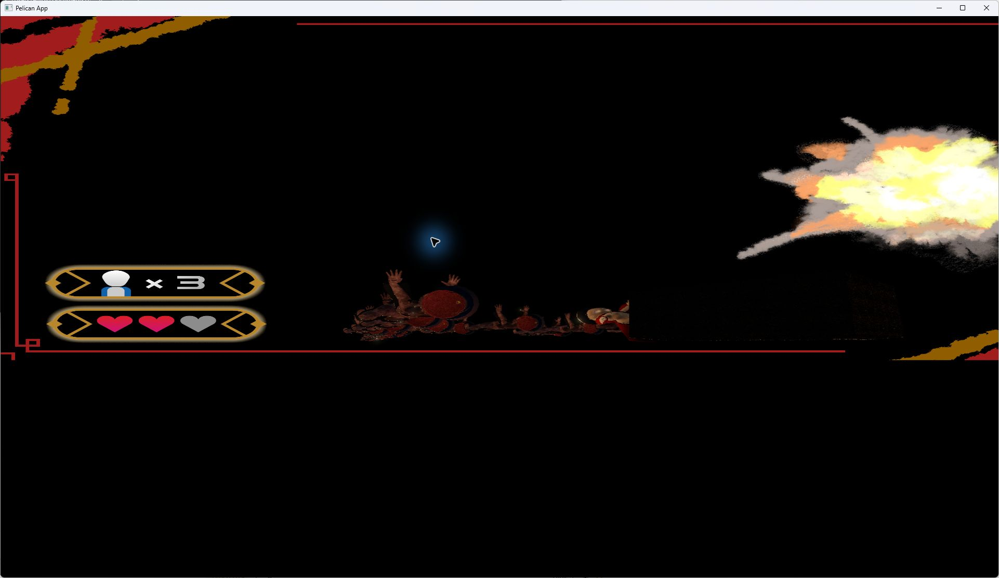

# WP138 — Meta XR Simulator blocker 修正レポート

日付: 2026-07-17

ブランチ: `agent/wp138-xrsimfix`

開始 commit: `28c0745`

## 1. 結論

WP136 で実機検出された ImGui frame 不整合、Vulkan timeline semaphore 未有効化、
OpenXR 状態の観測不足を修正した。Meta XR Simulator v201.0 で `FOCUSED`、
`shouldRender=true`、連続 1000 XR frame、desktop mirror 1000/1000 present、
3 分超の連続運転、Vulkan validation error 0 を確認した。

実機で追加検出した mirror source/intermediate の extent 不一致も修正した。
canonical `display` は flat presentation extent に固定されるため、
`__xr_mirror_left` も同じ fixed extent を保持し、XR 推奨眼サイズへの resize で
copy contract が壊れないようにした。

Simulator v201.0 の Headset OFF/ON と複数 session hand-off は session state を
`FOCUSED` のまま保持し、focus-loss event を発行しなかった。この runtime 制約だけは
Simulator 上で `FOCUSED -> VISIBLE -> FOCUSED` を再現できていない。エンジン側の
focus loss/regain 契約は headless fake で固定した。

## 2. 実装

### 2.1 XRSIM-1 — XR 中の ImGui runtime gate

- `isImGuiRuntimeEnabled` に `!xr_active` を追加した。headless、replay と同じ中央 gate を使い、
  XR v1 graph では engine ImGui module/callback を開始しない。
- gate が logical-frame 境界で閉じた場合、既に開始済みの frame は
  `ImGuiSystem::endFrameIfStarted()` で閉じる。ImGui pass のない XR graph へ frame を
  持ち越さない。
- isolation fixture に XR active ケースを追加した。flat player では従来どおり ImGui menu、
  Engine Stats、Frame Plan viewer が表示されることを 8 秒超の window run で確認した。

### 2.2 XRSIM-2 — timeline semaphore

- runtime-selected physical device に `VkPhysicalDeviceVulkan12Features` を照会する。
- `timelineSemaphore` 対応 GPU では flat/XR の別なく logical-device create chain で常時有効化する。
- `--xr on` で非対応の場合は次の名前付き bootstrap error にする。

```text
runtime-selected physical device lacks Vulkan feature timelineSemaphore required by OpenXR
```

### 2.3 XRSIM-3 — diagnostics / status

次を一行の `OpenXR diagnostic` として状態変化時だけ記録する。

- session state transition
- view configuration (`PRIMARY_STEREO`)
- reference space (`STAGE` / fallback)
- `shouldRender` transition

`get_status.xr` に既存の floor fields を保ったまま、次を additive に追加した。

```json
{
  "session_state": "FOCUSED",
  "view_configuration": "PRIMARY_STEREO",
  "should_render": true
}
```

inactive schema は同じ 3 field を `null` として返す。fake fixture は active/inactive schema、
`shouldRender=false -> true`、zero-layer end、`VISIBLE -> FOCUSED` の input eligibility 復帰を検証する。

### 2.4 mirror extent と進捗診断

- `__xr_mirror_left` の fixed extent を canonical `display` metadata から継承する。
- source/destination mismatch error は format と双方の extent を含む。
- runtime gate の証跡として mirror の first frame、first present、1000 XR frame を一度だけ記録する。
- synthetic stereo regression は flat display と異なる per-eye extent を使い、resize 後も
  mirror/display extent が一致することを検証する。

## 3. Meta XR Simulator 再取得

公式配布ページ: [Meta XR Simulator (Windows)](https://developers.meta.com/horizon/downloads/package/meta-xr-simulator-windows/)

| 項目 | 値 |
|---|---|
| version | `201.0` (`201.0.0.25.633`) |
| file | `meta_xr_simulator_v201.0.msi` |
| size | `286,486,528 bytes` |
| SHA-256 | `34C2FADDF857FBEB57C1AE08A8906A015BF8E87F4C21B3BE2B0C74A400E94810` |
| CDN binary id | `35566427739669503` |
| admin image | `%TEMP%/pelican2-wp138-xrsim/admin-image` |
| runtime JSON | `PFiles/MetaXRSimulator/v201.0/meta_openxr_simulator.json` |

MSI は公式ページの current binary URI から再ダウンロードし、byte size と SHA-256 を照合後、
`msiexec /a ... TARGETDIR=... /qn` で admin image を再展開した。player には子プロセス環境の
`XR_RUNTIME_JSON` だけを指定した。system-wide OpenXR runtime 設定は変更していない。

## 4. Simulator gate

### 4.1 session / shouldRender / reference space

```text
OpenXR diagnostic: event=configuration transition=initial session_state=UNKNOWN view_configuration=PRIMARY_STEREO reference_space=STAGE shouldRender=unknown
OpenXR diagnostic: event=session_state transition=UNKNOWN->IDLE ...
OpenXR diagnostic: event=session_state transition=IDLE->READY ...
OpenXR diagnostic: event=shouldRender transition=unknown->false session_state=READY ...
OpenXR diagnostic: event=session_state transition=READY->SYNCHRONIZED ...
OpenXR diagnostic: event=session_state transition=SYNCHRONIZED->VISIBLE ...
OpenXR diagnostic: event=session_state transition=VISIBLE->FOCUSED ...
OpenXR diagnostic: event=shouldRender transition=false->true session_state=FOCUSED ...
```

startup の `shouldRender=false` frame は engine update を一回行い、fake protocol fixture で
zero-layer `xrEndFrame` を確認した。`STAGE` space と `PRIMARY_STEREO` は初回 diagnostic と
以後の transition 行で維持された。

### 4.2 1000 frame / mirror

```text
OpenXR mirror diagnostic: milestone=first_frame attempts=1 presented=1 dropped=0 failures=0
OpenXR mirror diagnostic: milestone=first_present attempts=1 presented=1 dropped=0 failures=0
OpenXR mirror diagnostic: milestone=1000_xr_frames attempts=1000 presented=1000 dropped=0 failures=0
```

1000 attempts は `shouldRender=true` の二眼 logical frame 完了後にだけ加算される。
mirror は 1000/1000 present、drop 0、failure 0 だった。



画像: 1922x1112 JPEG、105,332 bytes

SHA-256: `727B2F98C914DEC0DBDC9EA2F299772178C6CE56B34E28C562EF566292E9A421`

### 4.3 focus loss/regain

Simulator v201.0 で次を試した。

1. Inputs の Headset toggle を OFF -> ON（UI 上の復元も確認）
2. 第2 XR client を起動して session hand-off を要求

Headset toggle は tracking/input availability だけを変更し、session state は `FOCUSED` のままだった。
また v201.0 は両 client を `FOCUSED` として通知した。従って Simulator gate の
focus-loss event 再現だけは **runtime limitation / 未確認** とする。コード契約は fake event の
`FOCUSED -> VISIBLE` で session running を保ったまま input を無効化し、続く `FOCUSED` で
再有効化する fixture が PASS している。

### 4.4 連続運転

- Debug player を `--project projects/example --xr on` で 190.5 秒連続運転した。
- process は responding、VUID / validation error / Pelican fatal error / assertion は 0。
- 別の instrumented run でも 1000 frame 到達まで同じ error signal は 0。
- ImGui assertion、timeline semaphore VUID、mirror extent fatal error は再発しなかった。

## 5. build / test gate

configure:

```powershell
cmake -S . -B build-wp138 -DSKIP_DEVSTUDIO=ON -DPython3_EXECUTABLE=C:\Users\enjoy\AppData\Roaming\uv\python\cpython-3.12.13-windows-x86_64-none\python.exe
```

`CMakeCache.txt` は `PELICAN_WITH_OPENXR=ON`、`PELICAN_WITH_VAT=ON` を確認した。

| gate | 結果 |
|---|---|
| Debug full build | PASS |
| full CTest | **509 / 509 PASS**、failure 0 |
| suite-level skip | PathResolver symlink 権限依存 1 件のみ（既知、WP138 外） |
| golden verbose | **5 / 5 PASS**、SKIP marker 0 |
| image golden | VAT ON **49 / 49**、287 assertions PASS |
| final RGBA8 baseline | 94 assertions PASS、expected image/hash 差分 0 |
| OpenXR single-OFF smoke | PASS |
| flat player 8 秒 + ImGui | PASS |
| Simulator 1000 XR frame | PASS、1000 presented / 0 dropped / 0 failures |
| Simulator 3 分 | PASS、190.5 秒、validation error 0 |
| Simulator focus loss/regain | v201.0 では event 非発行。fake fixture PASS |

goal memo は golden baseline を VAT ON 48 / OFF 47 と記載していたが、開始 commit `28c0745` の
実ソースは VAT ON 49 / OFF 48 を要求し、fixture directory も 49 件だった。WP138 はこの開始時
baseline を維持し、expected asset は変更していない。

## 6. スコープ

- project schema、game ABI、flat render graph、golden expected asset は変更していない。
- system-wide OpenXR runtime、Meta XR Simulator persistent runtime toggle は変更していない。
- Simulator v201.0 の focus event 非発行は engine code で偽装せず、runtime limitation として残した。
