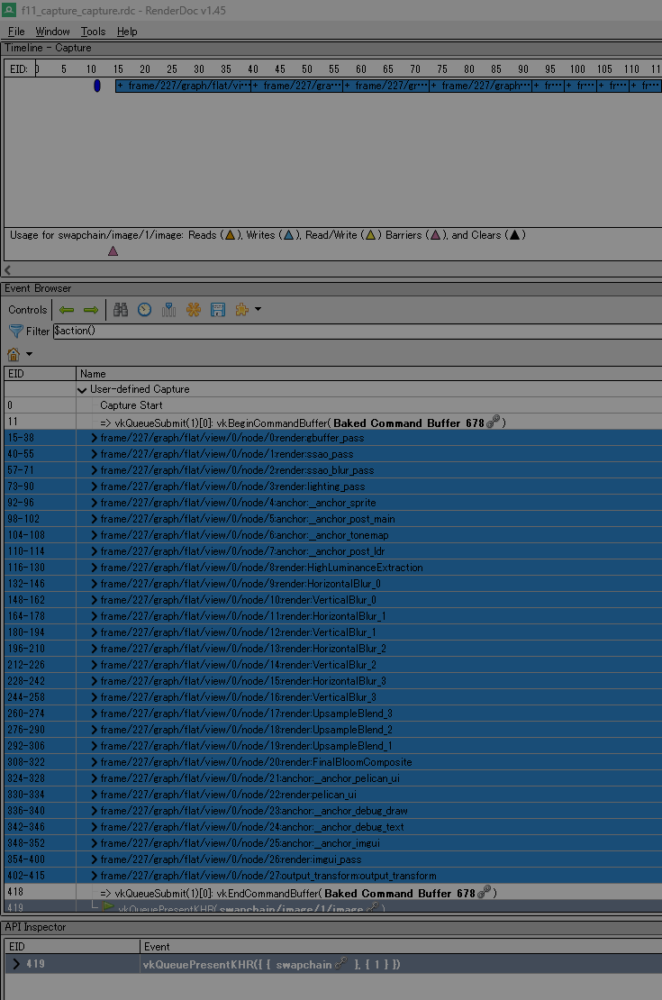

# WP140 実装レポート — D-P1a RenderDoc in-app capture (flat/headless)

## 1. 結果

注入済み `renderdoc.dll` だけを受動検出する RenderDoc in-application API
連携を実装した。通常起動では DLL をロードせず、F11 は no-op、RPC は
`renderdoc_not_injected` を返し、既存描画 byte を変更しない。注入起動では
flat window の F11 と headless RPC `capture_gpu` の両方から、明示した一回の
render 境界を非空 `.rdc` として取得できた。

RenderDoc Event Browser では WP139 の正規 label
`frame/<logical-frame>/graph/<flat|xr>/view/<index>/node/<ordinal>:<kind>:<name>`
が plan 順で読めた。



## 2. 受動接続と build 境界

- `PELICAN_WITH_RENDERDOC` は開発 build で既定 ON、dist config では常に OFF。
- Windows の接続は `GetModuleHandleA("renderdoc.dll")` と
  `GetProcAddress("RENDERDOC_GetAPI")` だけで行う。`LoadLibrary`、import
  library、通常 Vulkan layer 化は使用しない。
- `RenderDocCapture` は Renderer/Vulkan instance より前に解決する。外部の
  RenderDoc launch/inject が process 起動時に hook を導入済みであることが前提。
- RenderDoc 自身の capture key を `SetCaptureKeys(nullptr, 0)` で無効化し、
  F11 の所有者を Pelican に一本化した。
- Vulkan device parameter は vendored header の
  `RENDERDOC_DEVICEPOINTER_FROM_VKINSTANCE` で dispatch-table pointer に変換する。
- OFF build は stub だけを compile し、実装 source、vendored header、integration
  object を build metadata/artifact に残さない。

同梱物は `renderdoc_app.h` 一枚だけである。

| 項目 | 値 |
|---|---|
| upstream tag | `v1.45` |
| pinned commit | `2fc0bc04cb95499635f63986a55bc6f67849dd9f` |
| header SHA-256 | `b7005e7dc34c3635046868bbd76d81b9b055aede0f56daa0bd39fedee0639ffb` |
| license | MIT。header 冒頭の全文を保持 |
| binary/import library | 同梱・link ともになし |

## 3. capture 状態機械

| state | 意味 | 許可する次の遷移 |
|---|---|---|
| `unavailable` | build OFF、未注入、API symbol/version 不一致 | なし。要求を名前付き error で拒否 |
| `idle` | 注入済み、要求待ち | `request(F11|rpc)` → `armed` |
| `armed` | owner と事前 capture count を固定 | render 境界で `capturing`。再要求は requester/owner/state 入り `capture_busy` |
| `capturing` | `StartFrameCapture` 成功後、render を一回だけ実行中 | render 完了 → `completing` |
| `completing` | `EndFrameCapture` と capture/path 検証中 | 成功 → `idle`、失敗 → `failed` |
| `failed` | reason を保持した terminal failure | 後続の新要求で整合性を再検査して `armed`、または再び `failed` |

`IsFrameCapturing` と engine state の不一致、二重要求、shutdown 中要求、XR
要求を deterministic に拒否する。XR は v1 境界外なので
`capture_xr_unsupported` とし、flat fallback した `--xr auto` headless RPC は
既存契約どおり flat として扱う。

失敗 reason は少なくとも未注入、build OFF、API version/symbol、busy、state
mismatch、start、render、end、capture count、path lookup、missing/empty file、
shutdown、XR を分離した。RPC は application error `-32010` と
`data.reason/state/source` を返す。

## 4. F11 と RPC の frame 境界

F11 は入力 snapshot の一回の push から次の flat logical frame を arm し、
`renderer.render()` 一回だけを明示 `StartFrameCapture/EndFrameCapture` で囲む。
開始前に失敗した場合だけ通常 render へ戻し、render 後の end/path failure では
二重 render しない。

`capture_gpu` は要求が受理されてから pending transform を flush し、既存
`render_frame` と同じ

```text
seq_player.update(engine_time.now())
renderer.render()
```

を一回だけ実行する。`EngineTime` と frame index は進めない。要求前後の
`GetNumCaptures` がちょうど一つ増えたことを確認し、その実 index に対して
`GetCapture` を length/path の二段で呼ぶ。応答 path は template ではなく、
存在する非空 regular file の canonical absolute path である。

## 5. RenderDoc 実機 gate

導入した RenderDoc は winget package `BaldurKarlsson.RenderDoc` 1.45.0、
`renderdoccmd x64 v1.45` である。Vulkan layer は
`renderdoccmd vulkanlayer --explain` で correctly registered を確認した。注入時に
in-app API 1.7.0 を取得した。

| 経路 | 実測結果 |
|---|---|
| headless RPC | `capture_index=0`, `frame=0`, `timestamp=1784289653`。canonical path `build/test_artifacts/wp140/rpc_capture_capture.rdc`、90,509 bytes |
| flat F11 | log 上 `armed` → `complete`。`capture_index=0`, `frame=227`。`build/test_artifacts/wp140/f11_capture_capture.rdc`、1,806,452 bytes |
| replay-open | `renderdoccmd replay -l 1` が exit 0。QRenderDoc v1.45 でも load、status は `No problems detected` |
| label 木 | `frame/227/graph/flat/view/0/node/0:render:gbuffer_pass` から node 27 の output transform まで plan 順に表示。上の screenshot に保存 |
| 注入 status | `renderdoc=idle`, `diagnostics.renderdoc.api_version=1.7.0`, debug-utils/3 capability は全て true |
| 未注入 status | `renderdoc=absent`, reason `renderdoc_not_injected`。`capture_gpu` は `-32010`、通常描画へ副作用なし |

`.rdc` と詳細 log は build artifact であり commit 対象外、label screenshot だけを
レビュー証跡として commit した。

## 6. test と回帰 gate

configure は次を指定した。

```text
-DSKIP_DEVSTUDIO=ON
-DPython3_EXECUTABLE=C:\Users\enjoy\AppData\Roaming\uv\python\cpython-3.12.13-windows-x86_64-none\python.exe
```

| gate | 結果 |
|---|---|
| configure + Debug 全 target build | PASS |
| fake RenderDoc table unit | 4 test cases / 59 assertions PASS。全 state、busy 名、XR/shutdown、不整合回復、start/end/count/path/file/render failure を検査 |
| RenderDoc OFF smoke | PASS。実装 source/header/object 不在を metadata と artifact で検査 |
| Golden verbose (`ctest -R golden -V`) | 5 / 5 PASS、SKIP 0。image case 287 assertions、final RGBA8 labels OFF/ON hash 236 assertions |
| Golden case 数 | VAT ON 49 / OFF 48 の REQUIRE を維持。`golden_image_test.cpp` と `test/golden/` の差分なし |
| 全 CTest | 516 selected / failure 0、163.18 秒、GPU 65件。既知の Windows symlink 権限依存 1件のみ SKIP |
| 未注入 RPC | `rpc_headless_player` PASS。status absent と名前付き `capture_gpu` error を二回決定性比較 |
| 通常 player | `projects/animgraph_demo --gpu-labels` が 8 秒後も稼働、Validation Error/VUID 0。手動停止 |
| hygiene | `git diff --check` PASS、player の import table に RenderDoc symbol/DLL なし |

WP141 が同時に既存 Golden の固定 OS temp 名を使用していたため、最終 Golden/
CTest は `TEMP/TMP=build/test_artifacts/wp140/...` に隔離した。これは test source・
fixture を変更せず、並走 worktree 間の一時ファイル排他を守るための実行時設定で
ある。

## 7. 文書化

`adding_features.md` に RenderDoc launch/inject、F11、headless RPC、label 確認、
禁止事項と失敗 reason の recipe を追加した。Getting Started、tools/RPC manual、
source guide、dist config の記述も `capture_gpu` と status/build 境界へ更新した。
