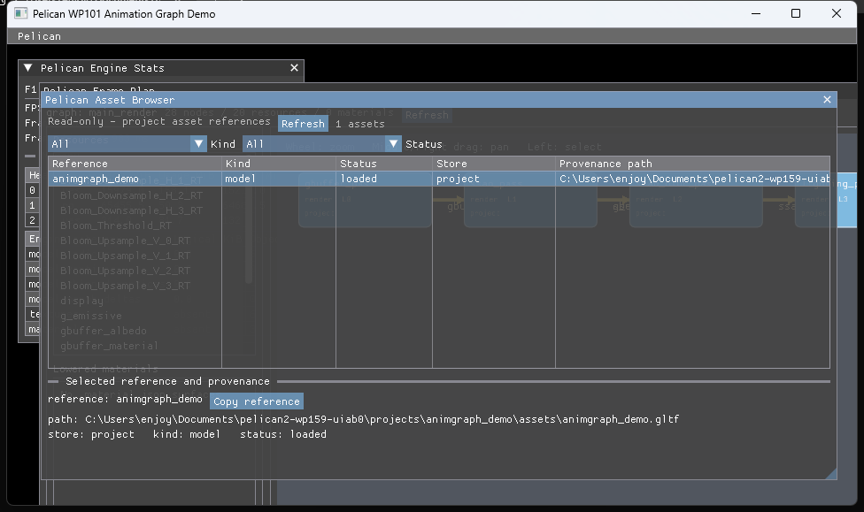

# WP159 UI-AB0 完了レポート

- 実施日: 2026-07-18
- ブランチ: `agent/wp159-uiab0`
- 対象: ImGui 読み取り専用 Asset Browser

## 結論

既存の ImGui デバッグ UI に、プロジェクト資産を閲覧する読み取り専用の Asset Browser を追加した。UI は `EditorCommandService` の型付き `listAssets` クエリだけを使用し、ECS、SceneLoader、LightContainer、PhysWorld へ直接アクセスしない。資産の編集機能は持たず、参照 ID のクリップボードコピーと、provenance path / store / kind / load status の確認に限定している。

## 実装内容

- 既存の `Pelican` メニューへ `Asset Browser` トグルを追加した。
- 既存の F1 によるデバッグ UI 全体の表示切り替えを維持した。
- Reference、Kind、Status、Store、Provenance path を表形式で表示する。
- kind と status の絞り込み、再取得、選択資産の詳細表示、Reference のコピーを提供する。
- プロジェクト設定と `PathResolver` から資産スナップショットを構築する処理を communication 層へ閉じ込め、ImGui 層には型付き `EditorCommandService` だけを渡す。
- パネル callback、query、edit enqueue の呼び出し回数を検証できる trace を追加した。編集 API は公開せず、`edit_enqueue_calls` は常に 0 である。

## Adapter 等価性

fake `EditorCommandService` に対し、RPC adapter と UI adapter の双方から同一の `{ "store": "project" }` クエリを実行した。

- 正常系: シリアライズ済み結果が完全一致
- 異常系: 注入した `InvalidParams` のエラーコードが一致
- UI 経路: query のみが記録され、edit enqueue は 0

これにより、RPC と UI が別の資産探索ロジックを持たず、同じ型付きサービス契約を通ることをテストで固定した。

## Deterministic gate

headless、RPC、input replay、golden、XR の各構成では、Asset Browser の panel callback、query、edit enqueue、provider の各回数がすべて 0 であることを確認した。interactive 構成だけが panel callback 1、query 1、edit enqueue 0 となる。

| 構成 | panel callback | query | edit enqueue | provider |
|---|---:|---:|---:|---:|
| headless | 0 | 0 | 0 | 0 |
| RPC | 0 | 0 | 0 | 0 |
| input replay | 0 | 0 | 0 | 0 |
| golden | 0 | 0 | 0 | 0 |
| XR | 0 | 0 | 0 | 0 |
| interactive | 1 | 1 | 0 | 1 |

## 変更境界

`editorcommandservice.{hpp,cpp}`、`rpcserver`、loader、scene、ECS、behavior、schema header には変更を加えていない。Asset Browser からこれらへの直接参照もない。

## 検証結果

- 指定オプションによる configure: 成功
  - `-DSKIP_DEVSTUDIO=ON`
  - `-DPython3_EXECUTABLE=C:\Users\enjoy\AppData\Roaming\uv\python\cpython-3.12.13-windows-x86_64-none\python.exe`
- Debug フルビルド: 成功
- Asset Browser 単体テスト: 2 cases / 39 assertions、全成功
- EditorCommandService 回帰テスト: 4 cases / 51 assertions、全成功
- ImGui isolation 回帰テスト: 3 cases / 54 assertions、全成功
- フル `ctest`: 587 / 587 成功、失敗 0
  - 既存の環境依存 PathResolver symlink escape だけが条件付き skip
  - WP159 テストの skip は 0
- golden verbose: 1 case / 238 assertions、成功、skip 0
- golden inventory と negative fixture: 成功
- 期待 PNG / hash: tracked diff 0
- `animgraph_demo` の windowed player を 8 秒実行: 生存、stderr 0、fatal / validation / asset query error 0、残留プロセス 0
- `git diff --check`: 成功

初回の並列ビルドでは Windows の中間成果物競合が発生したため、最終確認は直列のフルビルドで行い、成功を確認した。

## 未解決事項

なし。
