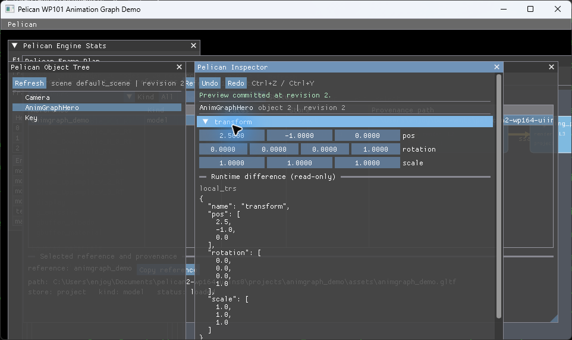
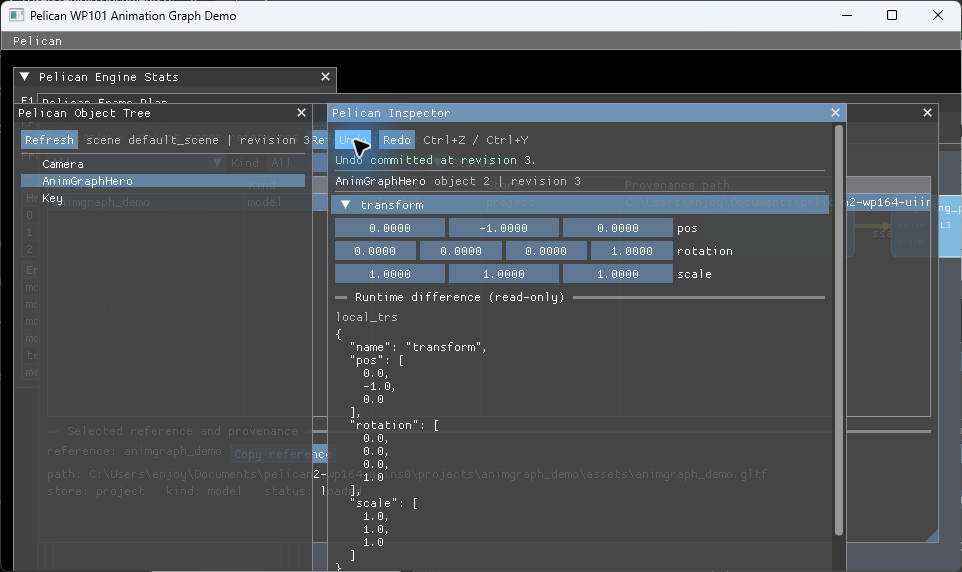

# WP164 UI-INS0 完了報告

- 実施日: 2026-07-18
- ブランチ: `agent/wp164-uiins0`
- 基準 commit: `91f1155`
- 結果: **完了**

## 結論

Object Tree と schema 駆動 Inspector を ImGui overlay に追加し、production の
`EditorCommandService` を通じた編集、preview、Undo/Redo、stale 応答、runtime 差分表示までを
実装した。着手前監査で判明した enum label 欠落と interactive service の read-only composition
という 2 blocker は、今回許可された additive schema 拡張と共有 production factory により解消した。

Inspector の widget 選択には component 名を使用していない。公開 query の schema type と metadata
だけから描画計画を作るため、新規 component も schema を宣言すれば Inspector 側の専用分岐なしで表示・編集できる。

## Blocker の解消

### 1. enum label の query 公開

- `StructFieldSchema` に宣言順を保持する `enum_values` と `enum_value_count` を additive に追加した。
- `structFields()` と `materializeStructField()` の両方で label を所有 schema へ引き継ぐ。
- `EditorCommandService::schemaFieldJson()` は enum field にだけ `"enum": [...]` を出力する。
- 既存 field の意味、EventPayload の enum 非対応 policy、既存 fixture は変更していない。
- 同一 query の 2 回実行が byte 一致し、label 順も宣言順のままであることを test で固定した。

### 2. interactive editable service の共有 composition

- `src/core/communication/editorruntimefactory.{hpp,cpp}` を追加し、runtime query、projection、preview、
  gate、asset/runtime query、commit hook の production composition を共有 factory に移した。
- `rpcserver.cpp` は同 factory を消費する構造へ移し、既存 RPC/editor protocol の挙動は変更していない。
- `ImGuiSystem` も同じ factory から service を取得するため、interactive overlay が RPC と同じ編集経路を使う。

## UI と編集ライフサイクル

- Object Tree は scene query の parent/children を再帰表示し、選択 object を Inspector に渡す。
- Inspector は `int` / `float` の drag、`bool` の checkbox、enum の combo、string input、
  vec3 / quat の複数列入力を schema type だけで選ぶ。
- readonly component は raw JSON と codec reason を表示し、編集 control を出さない。
- runtime 値が authored 値と異なる場合は read-only 差分を表示する。runtime shape が
  `local_trs` / `world_trs` を持つ場合は両方を明示する。
- 通常編集は enqueue → poll を通す。stale 応答時は応答に含まれる current authored component と
  revision を UI state に反映し、古い optimistic 値を残さない。
- drag は preview open → update → commit とし、更新中は最新値を coalesce する。Esc は abort する。
  `method_unavailable` を返す service/field は direct edit に fallback する。
- Undo/Redo button と `Ctrl+Z` / `Ctrl+Y` を追加した。undo conflict は人が読めるメッセージで表示する。
- deterministic / replay / golden driver では Inspector callback、query、enqueue を実行しない gate を維持した。

## Test

| 検証 | 結果 |
|---|---|
| fresh configure (`SKIP_DEVSTUDIO=ON`, Python 3.12 指定) | PASS |
| `cmake --build build --config Debug -- /m:2` | PASS |
| `pelican_test_inspector_test.exe` | 4 cases / 115 assertions PASS |
| `ctest --test-dir build -C Debug --output-on-failure` | 628 / 628 PASS |
| `pelican_test_golden_image_test.exe --success --reporter compact` | 16 cases / 1190 assertions PASS、`GOLDEN_SKIP_MATCHES=0` |
| golden inventory / tracked bytes | 差分なし |

新規 test は次を固定する。

- enum label の宣言順、非 enum field での `enum` 不在、query byte 決定性。
- component 名を変更しても同一 schema から同一 widget plan が生成されること。
- production と同型の独立 fake service を RPC adapter と Inspector adapter から駆動し、query、edit、
  stale、undo、preview update/commit、`method_unavailable` が同じ結果になること。
- stale 応答の current authored value/revision が UI state に適用されること。
- deterministic driver で callback/query/enqueue がすべて 0 回であること。

全 ctest のうち既存の PathResolver symlink escape test だけは Windows permission 依存の既知条件で
skip されたが、CTest 上の failure は 0 である。golden の console verbose reporter では Catch2
TextFlow の既知 assertion に当たったため、同じ `--success` 条件を compact reporter で再実行して
全 assertion と skip 0 を確認した。

## 実プレイヤー確認

`pelican_player --project projects/animgraph_demo --xr off` を windowed で起動した。
184 秒継続して応答し、要求の 8 秒 alive 条件を満たした。

1. Object Tree で `AnimGraphHero` を選択。
2. Inspector で transform `pos.x` を `0.0` から `2.5` へ変更。
3. preview commit が revision 2 として表示され、authored/runtime 表示も `2.5` へ更新。
4. Undo button で revision 3 へ進み、`pos.x` が `0.0` に復元。

### 証跡

編集 commit:

Undo 復元:

## 境界確認

変更は additive schema、communication の共有 factory とその RPC 消費移行、ImGui panel、test、
本報告と証跡画像に限定した。`editorjournal`、`editorprojectiontransaction`、adapter、loader、scene、
ECS、behavior、registerer、golden file は変更していない。
