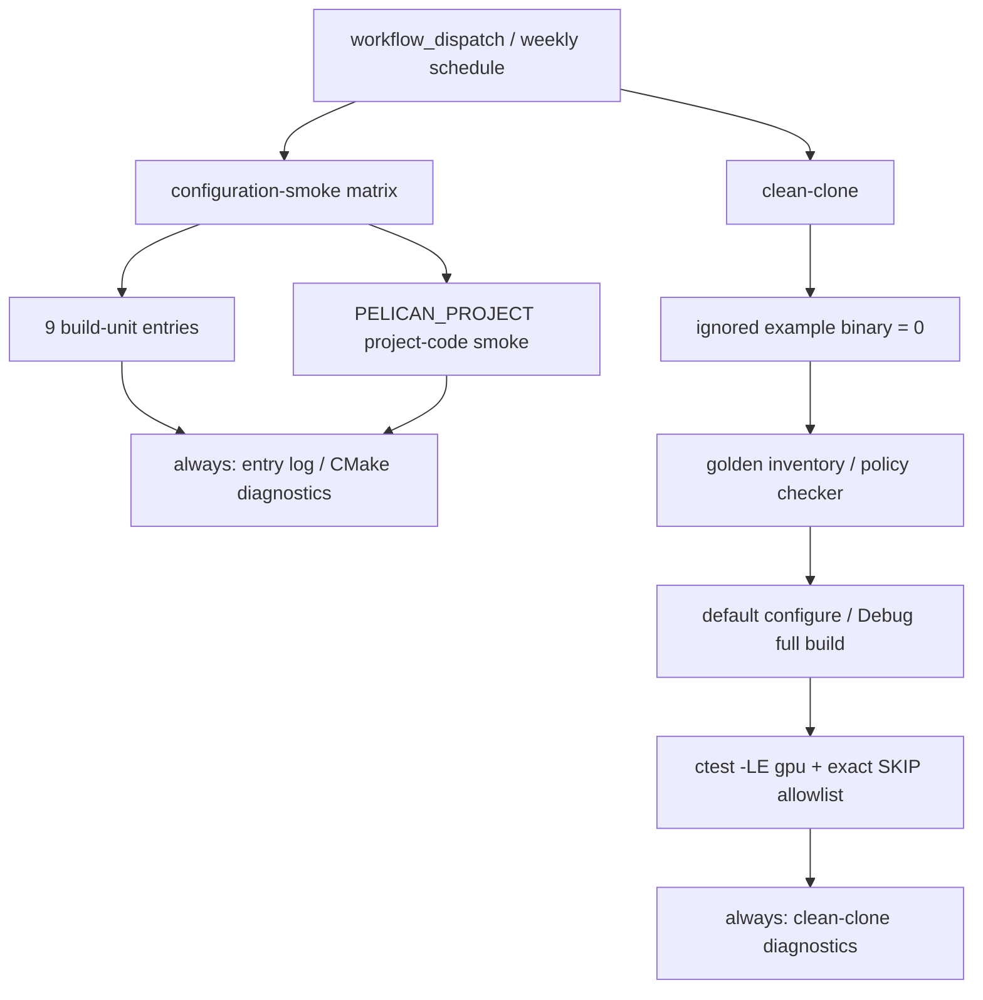

# WP165 CI1 実施レポート

## 1. 完了状態

WP165 の構成 matrix、project-code smoke、clean-clone gate、heavy example
asset 台帳を実装し、ローカル受け入れを完了した。再開前に blocker だった
`PELICAN_WITH_PHYSICS=OFF` のリンク不成立は、許可された `src/core/phys`
内の OFF 専用 `PhysWorld` stub で解消した。default ON build は従来の
`physworld.cpp` だけをコンパイルし、stub を一切含まない。

GitHub 上の `workflow_dispatch` / schedule 実 run は、この commit を Claude が
push した後に確認する。workflow に自動 retry は設けていない。

## 2. workflow 構成



- trigger は `workflow_dispatch` と毎週土曜 16:17 UTC（日曜 01:17 JST）のみ。
  push / pull request の CI0 を遅くしない。
- matrix は AUDIO / VAT / EXR / RPC / SEQPLAYER / IMGUI / PHYSICS /
  OPENXR / RENDERDOC の9 build-unitと project-code の10 entryで、
  `fail-fast: false`、最大3並列とした。
- 各 entry は独立 checkout / build treeを使い、成功 treeだけ任意削除する。
  失敗 tree、smoke log、CMake診断は14日 artifactへ残す。
- clean-clone は ignored heavy asset 0件を確認してから、CI0 と同じ
  golden inventory、policy checker、`ctest -LE gpu`、exact SKIP allowlistを使う。
- action revision、Vulkan SDK、Python は CI0 と同じ pinを使う。runner固有または
  ローカル固有の Python pathは workflow / CMake scriptへ保存していない。

## 3. PHYSICS OFF 不良の発見と修正

### 3.1 発見した source graph

最初のローカル matrix で、`PELICAN_WITH_PHYSICS=OFF` の full buildが次の
4 symbolを解決できず、playerと複数 testのリンクに失敗した。

- `PhysWorld::snapshotPrepared()`
- `PhysWorld::prepareBindings(...)` の2 overload
- `PhysWorld::publishPrepared(...)`

原因は次の構成だった。

```text
PELICAN_WITH_PHYSICS=OFF
  ├─ src/core/phys/physworld.cpp を除外
  ├─ src/core/phys/physicsservice_stub.cpp のみ追加
  └─ src/core/loader/editorprojectionadapters.cpp は常時追加
       └─ SceneObjectProjectionAdapter / ColliderProjectionAdapter が PhysWorld を参照
```

RPCも同時にOFFにして consumerを隠す方法は、単一 unitだけをOFFにする matrixの
保証にならないため採用しなかった。

### 3.2 OFF stub の契約

`src/core/phys/physworld_stub.cpp` を `PELICAN_WITH_PHYSICS=OFF` のときだけ
`pelican_core` に追加した。機能が利用できるように見せないため、契約を次に固定した。

- query / collect は空 vectorまたは `std::nullopt` を返す。
- `bindCollider` と非空 `prepareBindings` / `buildPhysColliders` は
  `PELICAN_WITH_PHYSICS=OFF: PhysWorld collider binding is unavailable` を含む
  `std::runtime_error` を送出する。つまり bind は no-opではなく明示エラーを選んだ。
- empty prepared stateは editor projection の no-collider transactionを通す。
  publish / clearは空状態を維持し、debug drawは no-opである。
- public physics ABIは既存 `physicsservice_stub.cpp` のとおり `Status::unavailable` を返す。

default ON clean buildの `pelican_core.vcxproj` には `physworld.cpp` があり、
`physworld_stub.cpp` は0件だった。既存 ON 実装・provider・生成物の選択に変更はない。

## 4. 実装範囲

- `.github/workflows/configuration-smoke.yml`
  - 9 build-unit entry、project-code entry、clean-clone job
  - exact SKIP policy、失敗 artifact、retryなし
- `test/run_build_units_smoke.cmake`
  - 9 unitを `PELICAN_BUILD_UNIT_SMOKE_ONLY` で単独選択可能にした。
  - Pythonを引数または `PATH` から解決し、成功 build treeの任意削除を追加した。
  - EXR fixtureを現行 UI v1 feature / atlas / sprite schemaへ更新した。
- `test/run_project_code_smoke.cmake`
  - 解決済み Python executableを内側の configureへ転送した。
- `test/CMakeLists.txt`
  - RPC `get_status` projectionも含む `xrsession_test` は RPC実装がある構成だけ登録する。
    default ON の登録・test source・test内容は不変である。
- `src/core/phys/CMakeLists.txt` / `physworld_stub.cpp`
  - v2 goalで許可された PHYSICS OFF 専用の最小 unavailable/no-collider stub。
- docs
  - `docs/ci.md` に CI1 の運用、ローカル再現、artifact / SKIP / retry規律を追記した。
  - `docs/example_assets.md` に22 binary（81,153,913 bytes）の SHA-256、取得手順、
    provenance / license状態、再配布規則を記録し、docs indexと example READMEから結んだ。

実 binary、Git LFS、golden、既存 test sourceは追加・変更していない。

## 5. ローカル検証

Python 3.12.13、MSVC 19.44、CMake 4.3.3、Vulkan SDK 1.4.309.0、
`SKIP_DEVSTUDIO=ON` を使用した。ローカル資源競合を避け、最終 buildは
workflowと同じ `CMAKE_BUILD_PARALLEL_LEVEL=4` で行った。

### 5.1 構成 matrix

| entry | 結果 | 確認内容 |
|---|---|---|
| AUDIO OFF | PASS | GameContext APIが明示 disabled error |
| VAT OFF | PASS | CLI / asset loadが明示 disabled error |
| EXR OFF | PASS | UI atlasの EXR参照が明示 disabled error |
| RPC OFF | PASS | RPC CLIが明示 disabled error、RPC依存 test未登録 |
| SEQPLAYER OFF | PASS | transform sequence CLIが明示 disabled error |
| IMGUI OFF | PASS | source / object / library / font metadata isolation |
| PHYSICS provider-only | PASS | built-in/Jolt不在、serviceとprovider DLL e2e |
| PHYSICS OFF | PASS | full link、ABI unavailable probe、collider入力の明示error、headless起動 |
| PHYSICS Jolt | PASS | built-in source 0、Jolt sourceあり、service 9 cases / 175 assertions、provider DLL e2e |
| OPENXR OFF | PASS | source/runtime isolation、`--xr on` の明示 disabled error（353.7秒） |
| RENDERDOC OFF | PASS | source / object / library / metadata isolation（363.2秒） |
| project-code | PASS | project DLL有効 build、tracked fixtureのみで3 frame描画、PNG 1,211 bytes（496.1秒） |

前半6 unitと provider-onlyは再開前の独立 tree検証結果を引き継ぎ、blocker解消後に
PHYSICS OFF / Jolt、OPENXR、RENDERDOC、project-codeまで完走した。

### 5.2 clean-clone / 既定構成

| gate | 結果 |
|---|---|
| ignored `projects/example/assets` | 0件 |
| manifest / 台帳 | 26 entries、binary 22件、81,153,913 bytesで一致 |
| CI policy unit tests | 10/10 PASS |
| golden inventory | PASS |
| default ON clean configure / Debug full build | PASS |
| clean-clone CPU gate | 540/540 PASS。allowlist済み PathResolver symlink skip 1件、unexpected skip 0 |
| 全 CTest（直列） | 628/628 PASS。上記既存 skip 1件のみ |
| golden verbose | 7/7 PASS、golden内 SKIP 0 |
| final RGBA8 baseline | 235 assertions PASS |
| image golden | 238 assertions PASS |
| tracked golden byte | 対象151 fileすべて index blobと worktree hash一致 |
| 通常 player | `pelican_cli project init` の自己完結 projectで8秒後も生存、stderr 0 byte、fatal / validation 0、PID停止 |

診断として全CTestを4並列で先に実行した際、resource lockを持たない
`rpc_scene_flow_headless_player` が同時GPU testによる `VK_EXT_memory_budget` usage変動を
二回実行差として検出し、627/628になった。当該 testの単独実行はPASSし、正規の
全CTest直列 runは628/628 PASSした。CI1 clean-cloneはGPU testを除外する一次実行で
540/540 PASSしており、retryで赤を上書きする workflowにはしていない。

## 6. 完了時境界

- default ON の source graph、全CTest、golden byte、通常 playerに回帰なし。
- `src/` の変更は v2 goalで許可された `src/core/phys` の OFF stubとそのCMake配線のみ。
- heavy example binaryは commitせず、出所またはライセンス未記録の byteは再配布不可とした。
- GitHub実 runの確認は push後に行う。ローカルで代替した、または推測した結果はない。
