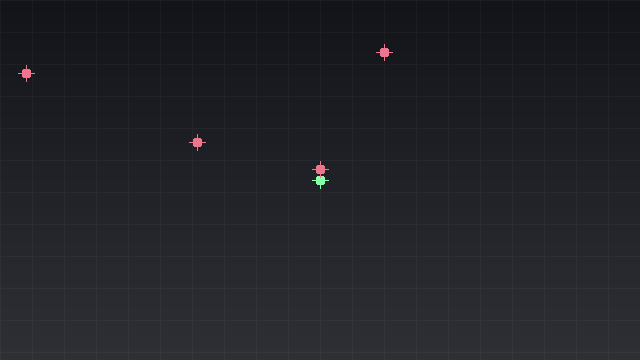

# WP172 PREVIEW0 完了レポート

日付: 2026-07-18
対象ブランチ: `agent/wp172-preview0`

## 結論

`eval_preview` と `render_preview` を、live scene への apply/revert ではなく、immutable な base document から作る request-local `PreparedProjection` 上に実装した。両 RPC は WP161 の `can_preview` gate を受付時と実行直前の 2 回読む。成功、schema error、prepare/query fault、gate close のいずれでも shared state の before/after exact snapshot を比較し、不一致なら `state_changed` で失敗する。

`render_preview` は flat/XR の `RenderingPassId`、`selectGraphVariant()`、`renderLogicalFrame()` を再利用していない。module graph freeze 前に feature compose/validate した第三の data program `preview` を保持し、module lookup を持たない executor が request-local capture RT/layout/frame uniform/temporal/timing だけを生成する。swapchain terminal は program 内で `preview_capture` に置換されるため、present または XR mirror への経路はない。

## 実装面

### eval_preview

- `eval_preview {overrides[], queries[]}` は base の `rawJson()` を複製し、stable authoring object ID と component slot で複数 override を適用する。
- registered component codec の decode/canonical encode と `AuthoringSceneDocument::stage()` の document validation を通した後、未公開の `PreparedProjection` を作る。この型には publish/commit/rollback API がない。
- request-local evaluation adapter は component canonical/runtime-derived value、parent-child の descendant world closure、prepared collider の明示 span に対する raycast/overlap、prepared camera の view/projection/VP を返す。
- codec/adapter のない component/query は `method_unavailable`。入力形状違反は `schema_violation`。prepare/query の途中例外では request object の破棄だけが行われる。
- production audit は authored semantic bytes、SceneRevision、runtime component 値と entity identity、Light、Phys binding/identity、renderer handles/history/epoch、previous model/palette、camera、DeletionQueue、RenderTiming、behavior/event、EngineTime、reload generation を一つの canonical snapshot にする。

主な実装: `src/core/loader/editorpreviewprojection.*`、`src/core/communication/editorpreviewservice.*`。

### render_preview graph と capture

- `Renderer` 構築時、flat graph 登録後かつ module freeze 前に `precompilePreviewGraph()` を実行する。
- feature envelope は既存 composer を通す。projection jitter、TAA、velocity/motion vector、history、UI、mirror/present を持つ feature は envelope 全体で除外し、`excluded_feature_names` に残す。
- base config に直書きされ、feature 単位で除外できない history/velocity/UI 等は、起動時に graph 名・pass 名を含む診断で拒否する。
- canonical swapchain output は request-local `preview_capture` identity へ置換する。program generation は canonical composed config の安定 hash で、JSON の正確整数範囲内に収める。
- capture schema は `width`/`height` (1..2048)、`pixel_encoding` (`png`/`rgba8_srgb`)、camera identity または explicit camera、exact graph generation、`max_bytes` (1..16 MiB) を要求する。未知 field、stale generation、camera/projective range 違反は `capture_schema_violation`。予測 byte 数が上限を超える要求は executor 呼出し前に `capture_too_large`。
- OpenXR active 中は executor 呼出し前に `xr_active_unsupported` を返し、payload に `method` と `reason=xr_active` を含める。
- timing は `preview_request_id:<n>` namespace を持ち、shared timing ring には publish しない。応答は実行 pass 列と下記 inventory も返す。

主な実装: `src/core/renderingpass/previewgraph.*`、`src/core/vkcore/previewexecutor.*`、`src/core/vkcore/renderer_config.*`。

## §1-6-2 renderer state inventory 1:1

| # | 規定の state | 実装分類 | 実装上の扱い |
|---:|---|---|---|
| 1 | `DeletionQueue(logical epoch)` | explicitly suppressed | executor から module lookup と `beginFrame()` の経路を除去。production audit と control fixture で epoch/pending を exact 比較。 |
| 2 | `shared FrameResources(beginLogicalFrame / slot select / uniform update)` | request-local | EngineTime の read-only copy から request-local frame uniform を構築。shared slot 選択・uniform update は呼ばない。 |
| 3 | `RenderTiming allocator/pending/published; shared ring` | request-local; shared ring suppressed | `preview_request_id` namespace の local timing JSON のみ。allocator/pending/published/ring は audit し、shared publish は `false`。 |
| 4 | `RenderTargetContainer history` | explicitly suppressed | shared RT container を executor の dependency に持たせず、capture pixel buffer を request 内で所有。history read/write は常に 0。 |
| 5 | `PolygonInstanceContainer previous state` | explicitly suppressed | `commitFrameHistory()` / temporal advance を呼ばない。previous palette/model と advance count を audit/control 比較。 |
| 6 | `Renderer flat/xr histories+last snapshots+reset/observed revision` | explicitly suppressed | `previewIsolationStateJson()` で全 matrix/value を exact audit。executor は `Renderer` を参照しない。 |
| 7 | `camera history/snapshot` | explicitly suppressed | camera は prepared document から派生し、live `Camera` を更新しない。live camera snapshot は production audit のみ。 |
| 8 | `internal_render_extent/resize/RT rebind` | explicitly suppressed | capture extent は request field。`consumeExtentChanged()`、resize、RT rebind に到達しない。renderer internal extent は audit。 |
| 9 | `layout tracker` | request-local | local transition `undefined->capture_attachment->transfer_src` のみを記録。shared tracker は dependency 外。 |
| 10 | `EngineTime/frame index` | read-only | `now/dt/frame_index` を一度 copy。advance/setTime はない。before/after audit も行う。 |
| 11 | `flat/xr graph/selectGraphVariant` | explicitly suppressed | 第三の `PreviewGraphProgram` を使用。既存 enum/flat/XR IDs/`selectGraphVariant()` は変更せず、control で双方を比較。 |
| 12 | `swapchain/XR mirror/present` | explicitly suppressed | composed program の `swapchain` を `preview_capture` に置換。executor に swapchain/mirror/present dependency はない。 |

## control 比較の証明

`WP172 preview insertion leaves the next flat and XR normal capture identical` は同じ initial sentinel state から次の二経路を flat と XR それぞれで実行する。

1. preview なしで normal frame を一回進め、normal capture bytes と post-state を保存する。
2. `render_preview` を挿入し、shared state が initial と exact equality であることを確認後、同じ normal frame を進める。

比較対象は flat/XR history、last snapshot/reset/observed revision/epoch、previous palette/model、DeletionQueue logical epoch/pending、RenderTiming allocator/pending/published/ring、camera、behavior/event、EngineTime、reload、authored bytes/revision/journal/ECS/Light/Phys を含む。両 variant で post-state と次 normal capture の `dump()` bytes が preview なし run と一致した。

## typed service / RPC

- `EditorPreviewService` が typed core。`EditorCommandService` と `EditorCommandRpcAdapter` は同じ結果/error をそのまま公開する。
- JSON-RPC methods は `eval_preview` / `render_preview`。error data の canonical `code` は `schema_violation`、`method_unavailable`、`gate_closed`、`xr_active_unsupported`、`capture_schema_violation`、`capture_too_large`、`state_changed`。
- `tools/pelican_rpc.py` の `eval_preview()` / `render_preview()` は結果を変換しない thin pass-through。
- 最終 build の実 player + `projects/sprite_demo` で `scene_tree -> eval_preview -> render_preview` を通し、graph generation `3529780000126488`、`preview_request_id:1`、inventory 12 行、640x360 PNG 922,098 bytes を得た。

## capture

以下は上記の実 RPC で、Floor の prepared transform override を live publish せずに 640x360 PNG として得た capture である。

## 検証結果

| gate | command | result |
|---|---|---|
| fresh configure | `cmake -S . -B build-wp172 -DSKIP_DEVSTUDIO=ON -DPython3_EXECUTABLE=...cpython-3.12.13...python.exe` | PASS |
| focused | `ctest --test-dir build-wp172 -C Debug -R "WP172\|editorpreview" --output-on-failure` | PASS (7/7、追加 explicit-camera case 反映後に再実行) |
| full build | `cmake --build build-wp172 --config Debug --parallel 6` | PASS |
| full ctest | `ctest --test-dir build-wp172 -C Debug --output-on-failure` | PASS (660 件、failure 0、488.11 秒。非 golden の Windows symlink 条件 1 件だけ既存 SKIP) |
| golden verbose | `ctest --test-dir build-wp172 -C Debug -R golden -V` | PASS (8/8、SKIP 0、119.5 秒、追跡済み golden bytes 差分なし) |
| player | `projects/sprite_demo` の windowed player を 8 秒継続 | PASS (8 秒時点で稼働中であることを確認して停止) |

既存 flat/XR graph、`selectGraphVariant()`、`renderLogicalFrame()`、editor journal/transaction 本体、appflow/teardown、`.github` は変更していない。
