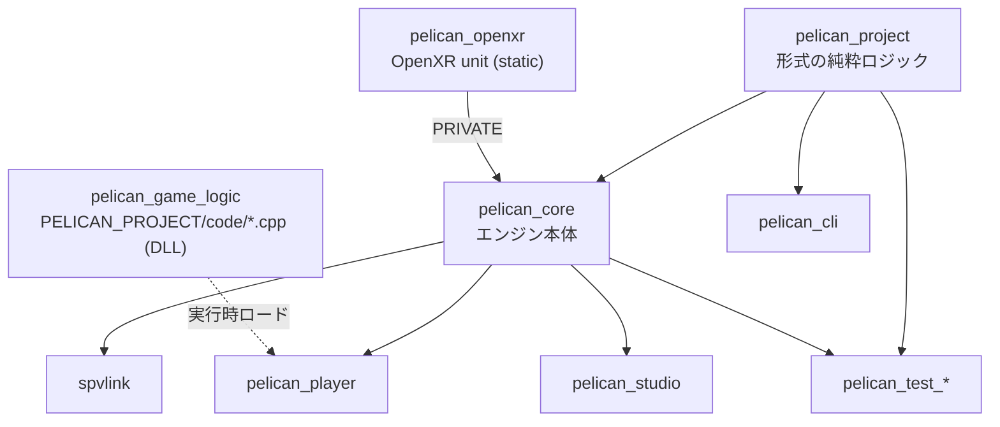

# 第1章 全体構造とビルド

[索引へ戻る](README.md)

## 1.1 リポジトリを先に四つへ分ける

Pelican2のコードは、最初から個々のクラスを読むより、次の四領域として捉えると理解しやすくなります。

| 領域 | 役割 | 主な入口 |
|---|---|---|
| 実行ファイル | 引数を読み、ライブラリを起動する | [`src/player/main.cpp`](../../src/player/main.cpp#L434)、[`src/devcli/main.cpp`](../../src/devcli/main.cpp#L12)、[`src/devstudio/main.cpp`](../../src/devstudio/main.cpp#L5)、[`src/spvlink/main.cpp`](../../src/spvlink/main.cpp#L1)（オフラインSPIR-VリンカCLI、[`spvlink.hpp`](../../src/core/shader/spvlink.hpp)を使用） |
| 純粋ロジック | JSONやテキスト形式のパース・検証・合成。Vulkan不要 | [`src/project/CMakeLists.txt`](../../src/project/CMakeLists.txt#L1) |
| エンジン本体 | ECS、入力、scene、描画、音声、物理、保存、RPC | [`src/core/CMakeLists.txt`](../../src/core/CMakeLists.txt#L1) |
| ゲーム/検証 | プロジェクト固有コード、fixture、単体・結合・golden test | [`projects/example/code/playercontrol.cpp`](../../projects/example/code/playercontrol.cpp#L1)、[`test/CMakeLists.txt`](../../test/CMakeLists.txt#L10) |

この分離で最も重要なのは `pelican_project` です。[`src/project/CMakeLists.txt`](../../src/project/CMakeLists.txt#L1) を見ると、依存は主に `nlohmann_json` とハッシュ用の `picosha2` だけです。scene形式、render feature合成、material/surface形式、JSON-RPCエンベロープ、import/assets manifestをGPUなしで扱えます。

一方の `pelican_core` は [`src/core/CMakeLists.txt`](../../src/core/CMakeLists.txt#L1) で全サブシステムを一つのライブラリへ集約します。現在は細かいCMakeターゲットへ分割する構成ではなく、各サブディレクトリの `target_sources(pelican_core ...)` が同じターゲットへ実装を追加します。

## 1.2 CMakeターゲットの関係



### `pelican_project`

宣言は [`src/project/CMakeLists.txt`](../../src/project/CMakeLists.txt#L1) です。交換形式を扱うコードをまとめ、playerだけでなくCLIやテストからも再利用します。

### `pelican_core`

宣言は [`src/core/CMakeLists.txt`](../../src/core/CMakeLists.txt#L1) です。公開includeディレクトリに [`src/core/userpublic`](../../src/core/userpublic) と [`src/core`](../../src/core) を追加します。ビルド後は `userpublic`、`ecs`、`handle.hpp`、`physquery.hpp` の公開ヘッダを `dist*/lib/include` へコピーします（[ヘッダ配布処理](../../src/core/CMakeLists.txt#L126)）。

### `pelican_player`

[`src/player/CMakeLists.txt`](../../src/player/CMakeLists.txt#L1) が `pelican_core` と `argparse` をリンクします。`-DPELICAN_PROJECT=<dir>` が指定されると、プロジェクトの `code/CMakeLists.txt` をincludeし、[`pelican_game_sources()`](../../src/player/CMakeLists.txt#L58) でゲームの `.cpp` を**SHAREDライブラリ `pelican_game_logic`** へ追加します（[`add_library(pelican_game_logic SHARED ...)`](../../src/player/CMakeLists.txt#L73)、WP110系列）。

playerは `ENABLE_EXPORTS` と `/WHOLEARCHIVE:pelican_core` でSDKシンボルをexportし（[同 L2-L13](../../src/player/CMakeLists.txt#L2)）、game DLLはplayerのimport libへリンクします（[`pelican_configure_game_logic_target()`](../../src/player/CMakeLists.txt#L30)、`PELICAN_GAME_DLL=1` define）。実行時ロードは [`gamelogicreload.cpp`](../../src/core/gamelogic/gamelogicreload.cpp#L122) の `LoadLibraryW`/`dlopen` で行い、起動時初期化は [`initializeConfiguredGameLogic()`](../../src/core/gamelogic/gamelogicreload.cpp#L463)、ABI契約は [`gamelogic.hpp`](../../src/core/userpublic/gamelogic.hpp#L8)（`gameLogicAbiVersion = 1`）です。

ゲームSystemの静的自動登録はDLLロード時に走り、[`RegistrationOwner`](../../src/core/userpublic/details/reload/registrationowner.hpp#L11) 単位で [`unregisterGameSystems()`](../../src/core/userpublic/details/system/registerer.hpp#L142) により登録解除できます。これが実行中ホットリロードの基盤です。

### `pelican_openxr`

[`src/core/openxr/CMakeLists.txt`](../../src/core/openxr/CMakeLists.txt#L1) が作る独立のstaticライブラリで、OpenXRのdiscovery/session/action/composition/mirrorを担います。`pelican_core` へPRIVATEにリンクされます（[同 L28](../../src/core/openxr/CMakeLists.txt#L28)）。

### `spvlink`

`PELICAN_WITH_SPIRV_LINK=ON`時に
[`src/spvlink/CMakeLists.txt`](../../src/spvlink/CMakeLists.txt#L2) が作るオフラインSPIR-VリンカCLI（実行ファイル名 `pelican-spv-link`）です。[`src/core/shader/spvlink.hpp`](../../src/core/shader/spvlink.hpp) の実装を使います。

### `pelican_cli`

[`src/devcli/CMakeLists.txt`](../../src/devcli/CMakeLists.txt#L1) が作る配布支援CLIです。サブコマンドは `assets`、`bake-camera`、`import`、`dist-config`、`project`、`dump-lowered-material`、`vrm` の7種です（[`src/devcli/main.cpp`](../../src/devcli/main.cpp#L12) の分岐と [usage文字列](../../src/devcli/main.cpp#L35)）。Vulkan実行時全体ではなく `pelican_project` と必要な純粋処理を中心にリンクします。

### `pelican_studio`

[`src/devstudio/CMakeLists.txt`](../../src/devstudio/CMakeLists.txt#L1) が作るQtアプリです。現状は最小のQML画面とテスト用ViewModelが中心です。エンジン本体の完成度と同じ前提で読まないようにします（[第7章](07_tools_rpc_tests.md)）。

## 1.3 `src/core` の責務地図

| ディレクトリ | 責務 | 中心となる型/関数 |
|---|---|---|
| [`animation/`](../../src/core/animation) | アニメーション評価フェーズ、VRM application service | [`AnimationService`](../../src/core/animation/animationservice.hpp)、[`vrmapplication.hpp`](../../src/core/animation/vrmapplication.hpp) |
| [`appflow/`](../../src/core/appflow) | 時刻、フレームフェーズ、loop、終了処理 | [`Loop`](../../src/core/appflow/loop.hpp#L7)、[`EngineTime`](../../src/core/appflow/enginetime.hpp#L10) |
| [`gamelogic/`](../../src/core/gamelogic) | game DLLのロード・ホットリロード | [`gamelogicreload.hpp`](../../src/core/gamelogic/gamelogicreload.hpp) |
| [`geomhelper/`](../../src/core/geomhelper) | 幾何ヘルパ（header only） | [`geomhelper.hpp`](../../src/core/geomhelper/geomhelper.hpp) |
| [`imgui/`](../../src/core/imgui) | 開発者UI（ImGui runtime、frame plan viewer） | [`ImGuiSystem`](../../src/core/imgui/imguisystem.hpp#L22)、[`planviewer.hpp`](../../src/core/imgui/planviewer.hpp) |
| [`openxr/`](../../src/core/openxr) | OpenXR discovery/session/action/composition/mirror（独立static lib） | [`OpenXr::SessionRuntime`](../../src/core/openxr/openxrsession.hpp#L134) |
| [`ui/`](../../src/core/ui) | 2D UI（document/layout/atlas/bitmapfont/input routing） | [`ui::UiModule`](../../src/core/ui/module.hpp#L30) |
| [`watch/`](../../src/core/watch) | FileWatcher、ContentDigest、reload gate/queue/transaction/service | [`watch::ReloadService`](../../src/core/watch/reloadservice.hpp#L95) |
| [`loader/`](../../src/core/loader) | 設定、パス、scene、画像、埋め込み資源 | [`ProjectBasicConfig`](../../src/core/loader/basicconfig.hpp#L54)、[`PathResolver`](../../src/core/loader/pathresolver.hpp#L58) |
| [`ecs/`](../../src/core/ecs) | 内部ECSのファサード、Componentメタデータ、組み込みSystem | [`ECSCore`](../../src/core/ecs/core.hpp#L13)、[`ComponentInfoManager`](../../src/core/ecs/componentinfo.hpp#L37) |
| [`userpublic/`](../../src/core/userpublic) | ゲームコード向け公開APIとECS実体テンプレート | [`GameContext`](../../src/core/userpublic/gamecontext.hpp#L22)、[`GameObjects`](../../src/core/userpublic/gameobjects.hpp#L20) |
| [`os/`](../../src/core/os) | GLFW window、生入力、Action map | [`InputStateCore`](../../src/core/os/inputstate.hpp#L206)、[`InputActionMap`](../../src/core/os/actionmap.hpp#L64) |
| [`renderingpass/`](../../src/core/renderingpass) | 描画宣言のパース、検証、frame graph、compute task、RT | [`PassDefinition`](../../src/core/renderingpass/renderingpass.hpp#L373)、[`FramePlan`](../../src/core/renderingpass/frameplanner.hpp#L153) |
| [`renderer/`](../../src/core/renderer) | material/fullscreen/UI/debug/shadowの実描画。frameresources / projectionjitter / temporal / sprite* / velocitypasscontainer / shadowdepthpasscontainer / atlasassetresource が追加 | [`MaterialRenderer`](../../src/core/renderer/materialrender.hpp#L39)、[`Camera`](../../src/core/renderer/camera.hpp#L17) |
| [`vkcore/`](../../src/core/vkcore) | Vulkan instance/device、FrameTarget、command、layout、renderer編成 | [`VulkanManageCore`](../../src/core/vkcore/core.hpp#L45)、[`IFrameTarget`](../../src/core/vkcore/frametarget.hpp#L254) |
| [`shader/`](../../src/core/shader) | compile、SPIR-V reflection、module、pipeline cache/hot reload | [`ShaderLibrary`](../../src/core/shader/shaderlibrary.hpp#L113)、[`PipelineFactory`](../../src/core/shader/pipelinefactory.hpp#L135) |
| [`model/`](../../src/core/model) | glTF/VATロードと頂点バッファ | [`GltfLoader`](../../src/core/model/gltf.hpp#L24)、[`VertBufContainer`](../../src/core/model/vertbufcontainer.hpp#L33) |
| [`material/`](../../src/core/material) | texture/material/pipeline/descriptor | [`MaterialContainer`](../../src/core/material/materialcontainer.hpp#L70) |
| [`asset/`](../../src/core/asset) | asset JSONからmodel templateを登録 | [`ModelAssetContainer`](../../src/core/asset/model.hpp#L21) |
| [`fullscreenpass/`](../../src/core/fullscreenpass) | fullscreen pipelineと入力descriptor | [`FullscreenPassContainer`](../../src/core/fullscreenpass/fullscreenpasscontainer.hpp#L18) |
| [`light/`](../../src/core/light) | scene lightとlight UBO | [`LightContainer`](../../src/core/light/lightcontainer.hpp#L25) |
| [`phys/`](../../src/core/phys) | CPU幾何クエリとscene binding | [`PhysWorld`](../../src/core/phys/physworld.hpp#L38)、[`phys::Shape`](../../src/core/phys/physquery.hpp#L41) |
| [`audio/`](../../src/core/audio) | WAV decode、miniaudio backend、voice/bus | [`Audio`](../../src/core/audio/audio.hpp#L23) |
| [`persistence/`](../../src/core/persistence) | settings/save slot、原子的書き換え | [`Persistence`](../../src/core/persistence/persistence.hpp#L28) |
| [`playback/`](../../src/core/playback) | transform sequenceとVAT再生 | [`SeqPlayer`](../../src/core/playback/seqplayer.hpp#L50)、[`VatPlayer`](../../src/core/playback/vatplayer.hpp#L11) |
| [`communication/`](../../src/core/communication) | stdio JSON-RPCと編集RPC一式（コマンド、journal、preview、asset query、windowed host） | [`RpcServer`](../../src/core/communication/rpcserver.hpp#L39)、[`EditorCommandService`](../../src/core/communication/editorcommandservice.hpp)、[`EditorJournal`](../../src/core/communication/editorjournal.hpp) |
| [`renderdoc/`](../../src/core/renderdoc) | RenderDoc in-application captureの受動統合（RenderDoc自体のロードはしない） | [`RenderDocCapture`](../../src/core/renderdoc/renderdoccapture.hpp#L66)、[`renderDocDevicePointerFromVulkanInstance()`](../../src/core/renderdoc/renderdoccapture.hpp#L98) |

トップレベルの単ファイルにも重要なものがあります: [`xractivation.hpp`](../../src/core/xractivation.hpp)（XR起動可否の決定）、[`parallel_prepare.hpp`](../../src/core/parallel_prepare.hpp)（順序保証付き並列prepare）。

`src/core` の外には、pinしたベンダーヘッダだけを置く [`src/third_party/`](../../src/third_party) があります。現在の内容は [`src/third_party/renderdoc/renderdoc_app.h`](../../src/third_party/renderdoc/renderdoc_app.h)（RenderDoc v1.45 のin-application APIヘッダ）と、その出所・SHA-256・ライセンスを記録した [`README.md`](../../src/third_party/renderdoc/README.md) だけです。RenderDocのバイナリやimport libはリンクも配布もしません。

### 2026-07-17以降に増えた主なディレクトリ・ファイル

責務地図の粒度では見えにくいものの、読解上の入口になるものをまとめます。

| 場所 | 内容 |
|---|---|
| [`ecs/archetypemigration.hpp`](../../src/core/ecs/archetypemigration.hpp#L118) | 失敗しても原子的なarchetype移行と entity mutation のトークン（[第4章](04_ecs_deep_dive.md)） |
| [`gamelogic/behaviorarena.hpp`](../../src/core/gamelogic/behaviorarena.hpp#L109) | オブジェクトbehaviorのアタッチメントarena。ECS Componentではない別の所有者 |
| [`imgui/inspector.hpp`](../../src/core/imgui/inspector.hpp#L105) / [`imgui/assetbrowser.hpp`](../../src/core/imgui/assetbrowser.hpp#L36) | schema駆動inspectorパネルと読み取り専用asset browserパネル |
| [`loader/authoringscenedocument.hpp`](../../src/core/loader/authoringscenedocument.hpp#L81) | `AuthoringSceneDocument` / `AuthoringSceneDocumentStage`（[第3章](03_project_and_loading.md)） |
| [`loader/componentcodec.hpp`](../../src/core/loader/componentcodec.hpp#L96) | component codecの五点セット。componentのJSON受理仕様の正 |
| [`loader/editorprojectiontransaction.hpp`](../../src/core/loader/editorprojectiontransaction.hpp#L20) | 編集のprepare/publish transactionと8種のadapter kind |
| [`loader/vrmadecoder.hpp`](../../src/core/loader/vrmadecoder.hpp#L25) / [`model/vrmaanimation.hpp`](../../src/core/model/vrmaanimation.hpp#L87) / [`animation/vrmaretarget.hpp`](../../src/core/animation/vrmaretarget.hpp#L124) | `.vrma` decode → 型付きチャンネル → versioned retarget profile |
| [`renderingpass/previewgraph.hpp`](../../src/core/renderingpass/previewgraph.hpp#L15) | 第3のグラフプログラム（preview variant） |
| [`vkcore/previewexecutor.hpp`](../../src/core/vkcore/previewexecutor.hpp#L61) | previewの隔離実行とキャプチャ |
| [`vkcore/debugutils.hpp`](../../src/core/vkcore/debugutils.hpp#L41) | `VK_EXT_debug_utils` の選択、オブジェクト名、コマンドラベル |
| [`vkcore/memorydiagnostics.hpp`](../../src/core/vkcore/memorydiagnostics.hpp#L41) | driver heap / engine categoryのメモリ診断スナップショット |
| [`vkcore/deferredcallback.hpp`](../../src/core/vkcore/deferredcallback.hpp#L15) | `DeferredCallbackLifetime`（lease + `closeAndWait()`） |
| [`userpublic/behavior.hpp`](../../src/core/userpublic/behavior.hpp#L59) + [`details/behavior/`](../../src/core/userpublic/details/behavior) | Behavior公開APIと [`PELICAN_REGISTER_BEHAVIOR`](../../src/core/userpublic/details/behavior/registerer.hpp#L319) の自動登録 |
| [`userpublic/details/schema/`](../../src/core/userpublic/details/schema) | [`StructFieldSchema`](../../src/core/userpublic/details/schema/structfieldschema.hpp#L46)、[`structFields()`](../../src/core/userpublic/details/schema/structfieldschema.hpp#L445)、JSON codec |
| [`src/devcli/processrunner.hpp`](../../src/devcli/processrunner.hpp#L34) | プロセスグループkill付きの子プロセス実行 |

## 1.4 依存方向

理想化すると、依存は次の方向です。

```text
ゲームコード → userpublic → coreの各サービス → vkcore/外部ライブラリ
                     ↘
                      project（純粋パース・検証）
```

実装上は、`GET_MODULE()` を使うサービスロケータが多いため、C++のコンストラクタ引数だけを見ても依存が全部は分かりません。たとえば [`Renderer::Renderer()`](../../src/core/vkcore/renderer.cpp#L2708) は一行ですが、そこから設定、Vulkan、render target、shader、pipelineなどが遅延生成されます。

新しい描画コードでは依存を明示する `XxxDependencies` 構造体が増えています。例は [`RenderPassExecutorDependencies`](../../src/core/vkcore/render_pass_executor.hpp#L16)、[`RenderPassDispatchDependencies`](../../src/core/vkcore/render_pass_dispatch.hpp#L27)、[`RenderingPassConfigRegistrationDependencies`](../../src/core/renderingpass/renderingpassconfigregistration.hpp#L63) です。これはグローバル取得を局所化し、純粋テストをしやすくする境界です。

## 1.5 Pelicanでいう「インターフェース」の種類

Pelicanは継承ベースのinterfaceを多用しません。実際には次の六形式があります。

| 形式 | 例 | 目的 |
|---|---|---|
| 仮想基底 | [`IFrameTarget`](../../src/core/vkcore/frametarget.hpp#L254)、[`ILogicalFrameTarget`](../../src/core/vkcore/renderer.hpp#L40) | windowed/headless/XRの実装差し替え |
| 依存構造体 | [`MaterialRendererDependencies`](../../src/core/renderer/materialrender.hpp#L22) | 呼び出しに必要な協力オブジェクトを明示 |
| Concept/duck typing | [`HasBatchProcess`](../../src/core/userpublic/details/ecs/coretemplate.hpp#L77)、[`HasGameSystemUpdate`](../../src/core/userpublic/details/system/registerer.hpp#L38) | メソッド形だけをcompile時に要求 |
| `std::variant` | [`PassInfo`](../../src/core/renderingpass/renderingpass.hpp#L291)、[`phys::Shape`](../../src/core/phys/physquery.hpp#L41) | 閉じた型集合を安全に分岐 |
| 関数コールバック | [`RenderFeatureComposeDependencies`](../../src/project/featurecompose.hpp#L14)、[`RpcServer::MethodHandler`](../../src/core/communication/rpcserver.hpp#L41) | I/Oやdispatchだけを注入 |
| サービスロケータ | [`DECLARE_MODULE` / `GET_MODULE`](../../src/core/container.hpp#L15) | プロセス内の共有モジュールを遅延生成 |

型の設計を読むときは「基底クラスがないからinterfaceがない」と判断せず、依存構造体・Concept・variant・コールバックも契約として読みます。

## 1.6 ビルド機能フラグ

トップレベルの定義は [`CMakeLists.txt`](../../CMakeLists.txt#L20) です。

| フラグ | ON時 | OFF時の動作 |
|---|---|---|
| `PELICAN_RUNTIME_SHADER_COMPILER` | Vulkan SDK版shadercでGLSLを実行時コンパイル、feature合成可 | shadercをリンクせず、source shader/feature利用時に明示エラー |
| `PELICAN_WITH_AUDIO` | miniaudioと`Audio`実装をリンク | `GameContext`音声APIが`BuildFeatureDisabledError` |
| `PELICAN_WITH_VAT` | VAT parser/player、VAT shaderをリンク | GLBにVAT extrasがあれば明示エラー、playerはstub |
| `PELICAN_WITH_EXR` | tinyexrでEXRロード | EXR指定時に明示エラー |
| `PELICAN_WITH_RPC` | stdio RPC server | [`rpcserver_stub.cpp`](../../src/core/communication/rpcserver_stub.cpp#L1) |
| `PELICAN_WITH_SEQPLAYER` | transform sequence parser/player | [`seqplayer_stub.cpp`](../../src/core/playback/seqplayer_stub.cpp#L1) |
| `PELICAN_WITH_IMGUI` | 開発者UI（ImGui）をリンク | imguiモジュールなし |
| `PELICAN_WITH_PHYSICS` | 物理クエリサービスとcollider world | [`physicsservice_stub.cpp`](../../src/core/phys/physicsservice_stub.cpp)、sceneにcolliderがあると明示エラー（[`scene.cpp`](../../src/core/loader/scene.cpp#L300)） |
| `PELICAN_WITH_OPENXR` | private OpenXR unit（`pelican_openxr`）をリンク | `--xr` 指定時に明示エラー |
| `PELICAN_WITH_RENDERDOC` | **既に注入済みの**RenderDoc APIを受動利用（F11キャプチャ、`capture_gpu` RPC） | [`renderdoccapture_stub.cpp`](../../src/core/renderdoc/renderdoccapture_stub.cpp) をリンクし、`RenderDocCapture` は常に `unavailable`（理由 `renderdoc_build_disabled`）。キャプチャ要求は理由付きで拒否 |
| `PELICAN_ENABLE_ASAN` | ASan用compile/link option | 追加なし |

物理providerの選択だけは `option()` ではなく `cmake_dependent_option()` で、`PELICAN_WITH_PHYSICS` がONのときにだけ現れます（[`CMakeLists.txt#L32-L45`](../../CMakeLists.txt#L32)）。

| フラグ | 既定 | ON時 |
|---|---|---|
| `PELICAN_WITH_JOLT_PHYSICS` | OFF | optionalのJolt query providerを使う |
| `PELICAN_WITH_BUILTIN_PHYSICS` | ON | Pelican内蔵のsphere/box/capsule query providerを使う |

両方ONならJoltを優先し、内蔵providerは強制的にOFFへ戻されます（[同 L46-L50](../../CMakeLists.txt#L46)）。この2つだけはPUBLICではなく [`src/core/CMakeLists.txt#L17-L19`](../../src/core/CMakeLists.txt#L17) のPRIVATE compile definitionです。

機能OFF時にヘッダのAPI形状を消すのではなく、できる限り同じ入口を保ち、明示的な「このバイナリでは無効」エラーへ寄せています。共通例外は [`BuildFeatureDisabledError`](../../src/core/build_features.hpp#L20) です。

実装の差し替え方は、サブディレクトリのCMakeが `.cpp` を選ぶ形です。たとえば [`src/core/renderdoc/CMakeLists.txt`](../../src/core/renderdoc/CMakeLists.txt) は `PELICAN_WITH_RENDERDOC` により `renderdoccapture.cpp` か `renderdoccapture_stub.cpp` のどちらかだけを `pelican_core` へ追加します。フラグ自体は [`src/core/CMakeLists.txt`](../../src/core/CMakeLists.txt#L15) でPUBLICなcompile definitionとしても公開されるため、他のサブシステムからも `#if PELICAN_WITH_RENDERDOC` で参照できます。

## 1.7 主な外部ライブラリ

| ライブラリ | 使用箇所 |
|---|---|
| Vulkan-Hpp / VMA-Hpp | GPU APIとメモリ管理（[`VulkanManageCore`](../../src/core/vkcore/core.cpp#L650)） |
| GLFW | window、入力、surface（[`Window`](../../src/core/os/window.hpp#L17)） |
| GLM | 行列・quaternion・vectorの内部演算 |
| nlohmann/json | project/scene/rendering/RPC/保存など全JSON |
| shaderc | GLSLからSPIR-V（[`ShaderCompiler`](../../src/core/shader/shadercompiler.hpp#L39)）。runtime compiler ON時だけVulkan SDK版をリンクし、暗黙のFetchContent fallbackは行わない |
| SPIRV-Reflect | descriptor/push constant/vertex input抽出（[`reflect()`](../../src/core/shader/shaderreflection.hpp#L60)） |
| tinygltf | glTF/GLB/VRMロード（[`GltfLoader`](../../src/core/model/gltf.cpp#L2150)） |
| stb / tinyexr | PNG等とEXRの画像ロード |
| miniaudio | 音声backend |
| OpenXR SDK | loader + headers（[`CMakeLists.txt`](../../CMakeLists.txt#L246)、`PELICAN_WITH_OPENXR` 時） |
| JoltPhysics | optionalの物理provider（[`CMakeLists.txt`](../../CMakeLists.txt#L394)、`PELICAN_WITH_JOLT_PHYSICS` 時） |
| SPIRV-Tools | experimental SPIR-V linking（`PELICAN_WITH_SPIRV_LINK=ON`時だけ取得、[`CMakeLists.txt`](../../CMakeLists.txt#L180)） |
| Dear ImGui | 開発者UI（`PELICAN_WITH_IMGUI` 時） |
| picosha2 | SHA-256。`pelican_project` の形式ハッシュに加え、`pelican_core` でもscene snapshot digestやVRMA content hashに使います（[`src/core/CMakeLists.txt`](../../src/core/CMakeLists.txt#L99) で PRIVATE リンク） |
| RenderDoc in-application API | ヘッダのみvendor同梱（[`src/third_party/renderdoc/renderdoc_app.h`](../../src/third_party/renderdoc/renderdoc_app.h)）。外部取得もバイナリリンクもしません |
| quill | ログ |
| Catch2 | 単体テスト |
| Qt6/QML | Pelican Studio |

外部依存のバージョンはトップレベル [`CMakeLists.txt`](../../CMakeLists.txt#L40) に固定されています。picosha2はもともと「純粋層だけの依存」でしたが、現在は `pelican_core` からも使われる点に注意してください。

## 1.8 読解用のビルド

通常ビルド:

```powershell
cmake . -B build -DCMAKE_PREFIX_PATH=C:/Qt/6.x/msvc2022_64
cmake --build build
ctest --test-dir build
```

エンジン本体だけを読みたい場合はStudioを外せます。

```powershell
cmake . -B build -DSKIP_DEVSTUDIO=ON
cmake --build build
```

テストとテスト専用toolingも外す場合は、標準CMakeオプションを使います。

```powershell
cmake . -B build -DSKIP_DEVSTUDIO=ON -DBUILD_TESTING=OFF
cmake --build build
```

この構成はPythonを探索しません。`BUILD_TESTING=ON`でも
`PELICAN_PYTHON_TESTS=OFF`が既定で、C++/CMakeテストだけを登録します。
手元でPython 3がある場合だけ追加するには`AUTO`、完全なgateを要求するCIは
`PELICAN_PYTHON_TESTS=ON`を使います。OpenXR SDKのchecked-in生成済みsourceを
使う通常構成も、上流CMakeの任意Python探索を局所的に無効化します。

experimental SPIR-V linkerも通常build graphから分離されており、
`PELICAN_WITH_SPIRV_LINK=OFF`が既定です。ON時だけpinned SPIRV-Toolsと
`pelican-spv-link` CLIを構成し、実行時の`PELICAN_SPV_LINK=experimental`を有効にできます。

ゲームコードをplayerへ組み込む場合:

```powershell
cmake . -B build -DSKIP_DEVSTUDIO=ON -DPELICAN_PROJECT=projects/example
cmake --build build --target pelican_player
```

`projects/example/code/CMakeLists.txt` から [`pelican_game_sources(playercontrol.cpp)`](../../projects/example/code/CMakeLists.txt#L1) が呼ばれます。登録マクロの挙動を追うには、この「ソースが `pelican_game_logic` DLLへ入り、playerが実行時にロードする」という点が重要です。ビルド済みDLLを別パスから読ませたい場合は起動オプション `--game-logic` を指定します。

`PELICAN_PROJECT` に指定できるプロジェクトは [`projects/`](../../projects) 直下にあります。

| プロジェクト | 用途 |
|---|---|
| [`projects/example`](../../projects/example) | 標準の検証プロジェクト |
| [`projects/animgraph_demo`](../../projects/animgraph_demo) | アニメーショングラフのデモ |
| [`projects/sprite_demo`](../../projects/sprite_demo) | 2Dスプライトのデモ |
| [`projects/vrm_xr_demo`](../../projects/vrm_xr_demo) | VRM + XRのデモ |

## 1.9 CIとビルド構成の検証 ✅実装済み

ビルド構成が壊れていないかは、2本のGitHub Actionsワークフローで見ています。役割が違うので、変更の種類で読み分けます。

| ワークフロー | 起動条件 | 見ているもの |
|---|---|---|
| [`.github/workflows/cpu-gate.yml`](../../.github/workflows/cpu-gate.yml) | 毎PR + ブランチpush | 既定構成でconfigure/build、GPU不要のCTestを厳密なSKIPポリシー付きで実行 |
| [`.github/workflows/configuration-smoke.yml`](../../.github/workflows/configuration-smoke.yml) | 週次（`cron: "17 16 * * 6"`）と `workflow_dispatch` のみ | 機能フラグOFFビルドと、クリーンcloneからの通し確認 |

CPU gateは、ビルドの前にCIポリシー自体を検証する2ステップを持ちます。

- `python -B -m unittest discover -s test/ci -p "test_*.py"` — [`test/ci/`](../../test/ci) のポリシーチェッカ（[`test_golden_inventory.py`](../../test/ci/test_golden_inventory.py)、[`test_contract_boundary_gate.py`](../../test/ci/test_contract_boundary_gate.py)、[`test_skip_policy.py`](../../test/ci/test_skip_policy.py)）
- `python -B test/golden_inventory.py --repo-root .` — golden testの台帳と実体の突き合わせ

本体のCTestは [`test/ci/run_cpu_gate.py`](../../test/ci/run_cpu_gate.py) が実行し、SKIPしてよいテストを [`test/ci/cpu_skip_allowlist.txt`](../../test/ci/cpu_skip_allowlist.txt) と厳密に照合します。

configuration smokeは2つのjobからなります。

- **機能フラグOFFのmatrix**: `PELICAN_WITH_AUDIO` / `VAT` / `EXR` / `RPC` / `SEQPLAYER` / `IMGUI` / `PHYSICS`（provider variantを含む）/ `OPENXR` / `RENDERDOC` を1つずつOFFにしたビルドと、`PELICAN_PROJECT` を使うproject-code smoke。ドライバは [`test/run_build_units_smoke.cmake`](../../test/run_build_units_smoke.cmake) と [`test/run_project_code_smoke.cmake`](../../test/run_project_code_smoke.cmake) です。build-unit側はC++ probeを残して`PELICAN_PYTHON_TESTS=OFF`、project-code側は`BUILD_TESTING=OFF`で、どちらも`CMAKE_DISABLE_FIND_PACKAGE_Python3=TRUE`によりPython探索の再混入を検出します。`fail-fast: false` で、自動リトライはありません。
- **clean-clone job**: 新規checkoutに重いexample assetが混ざっていないことを確認したうえで、ポリシーチェッカ → golden inventory → configure → build → `run_cpu_gate.py` を順に流します。

> **設計決定:** 機能フラグOFFビルドはPRゲートに入れず週次にしています。ビルド構成の組み合わせ爆発をPRの待ち時間へ持ち込まず、それでも「OFFビルドが静かに壊れたまま放置される」状態は防ぐ、という配分です。CIの運用ルールは [`docs/ci.md`](../ci.md) が正です。

## 1.10 命名とファイルの読み方

- 型は `CamelCase`、関数は `lowerCamelCase` が中心です。
- module型は `DECLARE_MODULE(Name)` で宣言されます。
- `*Container` はGPU/実行時resourceの所有・ID変換を担うことが多いです。
- `*Definition` はパース後の宣言データ、`Compiled*` はGPU/実行IDが付いた実行可能データです。
- `*Resolver` は名前や参照文字列をruntime ID/metadataへ変換します。
- `*Dependencies` は明示的な協力オブジェクト束です。
- `*_stub.cpp` は機能OFFビルドの代替実装です。
- `src/project` の関数は、可能な限り入力値を受け取って値を返す純粋な形です。

次章では、これらが実際にどの順で生成・呼び出し・破棄されるかを追います。
