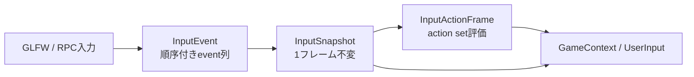

# 第5章 ゲームAPIとサービス

[索引へ戻る](README.md) / [前章](04_ecs_deep_dive.md)

## 5.1 `GameContext`は公開ファサード

ゲームSystemが直接`GET_MODULE()`へ依存しなくて済むよう、[`GameContext`](../../src/core/userpublic/gamecontext.hpp#L22) が主要サービスを薄く包みます。

| API群 | 委譲先 | 実装へジャンプ |
|---|---|---|
| Action入力（`actionPose()`含む） | `Actions` / `InputActionsRuntime` | [`gamecontext.cpp#L25`](../../src/core/userpublic/gamecontext.cpp#L25) |
| 時刻（`frameIndex()`含む） | `EngineTime` | [`#L53`](../../src/core/userpublic/gamecontext.cpp#L53) |
| ログ | quill logger | [`#L65`](../../src/core/userpublic/gamecontext.cpp#L65) |
| object/transform | `GameObjects` | [`#L77`](../../src/core/userpublic/gamecontext.cpp#L77) |
| sprite（`createSpriteObject`/`spriteView`/`setSpriteView`/`setSpriteTexture`） | `GameObjects` / sprite runtime | [`#L86`](../../src/core/userpublic/gamecontext.cpp#L86) |
| light（`setDirectionalLightDirection`/`setDirectionalLightIntensity`/`setPointLightPosition`/`setSpotLightDirection`） | `LightContainer` | [`#L132`](../../src/core/userpublic/gamecontext.cpp#L132) |
| physics query（`raycastAll`/`raycastClosest(filter)`/`overlapAllHits`/`shapeCastAll`/`shapeCastClosest` + [`phys::QueryFilter`](../../src/core/phys/physquery.hpp#L76)） | physics service | [`#L151`](../../src/core/userpublic/gamecontext.cpp#L151) |
| camera | `Camera` | [`#L241`](../../src/core/userpublic/gamecontext.cpp#L241) |
| 乱数（`setSeed`/`seed()`） | `DeterministicRng` | [`#L245`](../../src/core/userpublic/gamecontext.cpp#L245) |
| audio | `Audio`またはfeature disabled error | [`#L265`](../../src/core/userpublic/gamecontext.cpp#L265) |
| scene遷移 | `SceneLoader::requestLoad` | [`#L301`](../../src/core/userpublic/gamecontext.cpp#L301) |
| debug text | `DebugText` | [`#L309`](../../src/core/userpublic/gamecontext.cpp#L309) |
| event | event registry | [`gamecontext.hpp#L89`](../../src/core/userpublic/gamecontext.hpp#L89) |
| settings/save | `Persistence` | [`gamecontext.cpp#L313`](../../src/core/userpublic/gamecontext.cpp#L313) |

class全体が [`PELICAN_API`](../../src/core/userpublic/export.hpp) でexport修飾されています。game DLL境界を越えて使われるためです。

`GameContext`自体は状態を持ちません。各フレームでstack上に作られ、moduleへ到達する窓口として使われます。そのためSystemが`GameContext*`を保存する意味はありません。

### ライト操作API ✅実装済み（WP142 / LIGHT0）

[`gamecontext.hpp#L50-L53`](../../src/core/userpublic/gamecontext.hpp#L50) の4本は、scene定義済みライトを**名前で引いて**更新します。いずれも `[[nodiscard]] bool` を返し、その名前のライトが無ければ`false`です。委譲先は [`LightContainer`](../../src/core/light/lightcontainer.hpp) の同名setterです。

```cpp
[[nodiscard]] bool setDirectionalLightDirection(std::string_view name, vec3 direction) const;
[[nodiscard]] bool setDirectionalLightIntensity(std::string_view name, float intensity) const;
[[nodiscard]] bool setPointLightPosition(std::string_view name, vec3 position) const;
[[nodiscard]] bool setSpotLightDirection(std::string_view name, vec3 direction) const;
```

> **設計決定:** engine側でライト名（`"KeyLight"`など）を特別扱いしてアニメーションさせる旧挙動は廃止しました。`LightContainer::updateAnimation()`と原本ライト配列は削除済みで、ライトの時間変化は**ユーザー空間の責務**です。実例は [`projects/example/code/playercontrol.cpp`](../../projects/example/code/playercontrol.cpp) の`updateLightAnimation()`です。詳細は[第9章](09_black_magic_and_gotchas.md)を参照してください。

## 5.2 ゲームSystemの形

最小のSystemは次のduck-typed classです。

```cpp
class PlayerSystem {
public:
    void update(Pelican::GameContext& ctx) {
        // 毎フレーム処理
    }
};

PELICAN_REGISTER_SYSTEM(PlayerSystem, 100);
```

実例は [`projects/example/code/playercontrol.cpp`](../../projects/example/code/playercontrol.cpp#L8) です。継承もvirtual関数も不要で、[`HasGameSystemUpdate`](../../src/core/userpublic/details/system/registerer.hpp#L38) Conceptが`void update(GameContext&)`の存在を検出します。`PELICAN_REGISTER_SYSTEM`の定義は [registerer.hpp#L173](../../src/core/userpublic/details/system/registerer.hpp#L173)（IMPLは [L155](../../src/core/userpublic/details/system/registerer.hpp#L155)）です。

registryの各登録には [`RegistrationOwner`](../../src/core/userpublic/details/system/registerer.hpp#L33)（engine / game DLL）が付き、game logic reload時にはowner単位で [`unregisterGameSystems()`](../../src/core/userpublic/details/system/registerer.hpp#L142) されます。登録は [`RegistrationToken`](../../src/core/userpublic/details/reload/registrationowner.hpp#L26) を返し、`PELICAN_REGISTER_SYSTEM_IMPL`が生成する静的objectがそれを保持します。個別解除は [`unregisterGameSystem(token)`](../../src/core/userpublic/details/system/registerer.hpp#L141) です。

### instanceの寿命

[`gameSystemInstance<System>()`](../../src/core/userpublic/details/system/registerer.hpp#L53) は関数ローカルstaticのSystem instanceを返します。System objectは毎フレーム作り直されず、メンバ状態を保持できます。

これは`FastModuleContainer`管理ではないため、module cleanupでresetされません。通常プロセスでは問題になりませんが、同一プロセス内でruntimeを作り直すテストやtoolではSystemメンバのreset条件を自分で設計する必要があります。加えて、DLL reloadでは新DLLのfunction-local staticが新規インスタンスになるため、旧状態は引き継がれません。組み込みcamera controllerはframe index逆行と設定signature変更を検知してstateをresetします（[`resetIfNeeded()`](../../src/core/userpublic/cameracontrollersystem.cpp#L171)）。

### 実行順

registry実体は [`getGameSystemRegisterer()`](../../src/core/userpublic/details/system/registerer.cpp#L28) のstaticです。毎回copyして、次でsortします（[`sortGameSystemRegistrations()`](../../src/core/userpublic/details/system/registerer.cpp#L33)）。

1. `order`昇順
2. 同じorderなら登録時の型名文字列昇順

従ってtranslation unitの静的初期化順には依存せず、最終実行順は決定的です。組み込み [`BuiltinCameraControllerSystem`](../../src/core/userpublic/cameracontrollersystem.cpp#L324) はorder 10000なので、通常のゲームSystemの後に動きます。

## 5.3 event handlerを持つSystem

Systemはupdateに加え、登録済みevent型ごとに次を実装できます。

```cpp
void onEvent(const MyEvent& event, Pelican::GameContext& ctx);
```

[`HasGameSystemEvent`](../../src/core/userpublic/details/system/registerer.hpp#L43) がcompile時に検出します。updateを持たずevent handlerだけのSystemも登録できます。

第三のフックとして [`HasGameSystemQueuedEvent`](../../src/core/userpublic/details/system/registerer.hpp#L48)（`void dispatchQueuedEvent(const QueuedEvent&, GameContext&)`）が加わりました。型ごとのcatalogを経由せず`QueuedEvent`をそのまま受け取る口で、engine内では`BehaviorSystem`だけが使います（§5.13）。これにより「updateもevent handlerも無いSystemは登録error」の条件が`!has_queued_event && event_handlers.empty()`へ緩和されています（[registerer.hpp#L106-L110](../../src/core/userpublic/details/system/registerer.hpp#L106)）。

どのevent型に対して`onEvent`があるかを列挙する仕組みが、このコードベースで特に「黒魔術」に見える部分です。概要は以下です。

1. `PELICAN_REGISTER_EVENT(Event)`が`__COUNTER__`番号付きのcatalog関数を宣言。
2. `PELICAN_REGISTER_SYSTEM(System, order)`が自分の`__COUNTER__`までの番号を`integer_sequence`で走査。
3. そのtranslation unitから見えるcatalog entryについて、`HasGameSystemEvent<System, Event>`を判定。
4. 該当する型だけtype-erased（型消去 — 型ごとに違う処理を、元の型を見せない共通の関数ポインタ1種類へまとめる手法。ここでは`void (*)(const void*, GameContext&)`一種類に潰し、型ごとに生成された関数の内側で、compile時に確定しているEvent型へ`static_cast`し直します。登録時に併せて保存する`std::type_index`は呼ぶ相手を選ぶための照合用で、cast自体には使いません）なdispatch関数をregistryへ保存。

マクロ展開の詳細と制約は[第9章](09_black_magic_and_gotchas.md)で扱います。

## 5.4 Event bus

### event型の契約

登録マクロは [`PELICAN_REGISTER_EVENT`](../../src/core/userpublic/details/event/registerer.hpp#L257)（IMPLは [L242](../../src/core/userpublic/details/event/registerer.hpp#L242)）です。型は次を満たす必要があります。

- object型
- pointerでない
- copy construct可能

RPCの`inject_event`からpayloadを構築するには、さらにdefault construct可能で、[`ISerializable<Event, JsonArchiveLoader>`](../../src/core/userpublic/serialize/serialize.hpp#L10)、つまり`event.ref(archive)`が必要です。

event型は宣言的な **payload schema**（EventPayloadSchema v1、[`payloadschema.hpp`](../../src/core/userpublic/details/event/payloadschema.hpp)、[registerer.hpp#L50](../../src/core/userpublic/details/event/registerer.hpp#L50)）を持てます。compile-time検証のfixtureは [`test/fixtures/event_payload_schema/`](../../test/fixtures/event_payload_schema) です。宣言に`structFields`を使う場合は`eventPayloadPolicy`が必須で、全フィールドが`required(...)`かつ`bool`/enum不可という制約が掛かります（§5.14）。

### runtime表現

[`QueuedEvent`](../../src/core/userpublic/details/event/registerer.hpp#L29) は次を持ちます。

- `std::type_index`
- namespaceを外した表示名
- `shared_ptr<const void>` payload
- 発行元の [`RegistrationOwner`](../../src/core/userpublic/details/event/registerer.hpp#L33)

payloadを値copyしてshared ownershipへ変換するため、emit元のstack objectが消えても次フレームまで安全です。dispatch時に登録済み関数が元のEvent型へcastします。`owner`が付いたことで、game DLL reload時に「消えたownerのqueued event」を選別できます。

teardown経路では [`drainPendingEventsForTeardown()`](../../src/core/userpublic/details/event/registerer.hpp#L221) が [`EventQueueDrainResult{pending, frozen}`](../../src/core/userpublic/details/event/registerer.hpp#L36) を返し、[第2章](02_runtime_lifecycle.md)のteardown段階から呼ばれます。

### 名前と重複

[`__registerEvent()`](../../src/core/userpublic/details/event/registerer.cpp#L238) は [`eventDisplayName()`](../../src/core/userpublic/details/event/registerer.cpp#L20) で最後の`::`以前を除去します（正規化は [registerer.cpp#L241](../../src/core/userpublic/details/event/registerer.cpp#L241)）。`Game::Damage`はRPC上`Damage`として見えます。戻り値は`RegistrationToken`です。

- 同じ名前・同じ型の再登録はno-op
- 同名・別型はerror
- 同型・別名もerror

engine event の [`SceneLoaded`](../../src/core/userpublic/events.hpp#L10)、
[`OverlapEnter` / `OverlapExit`](../../src/core/userpublic/events.hpp#L18) は
namespace可視性の都合で二度マクロ登録されていますが、同名・同型なので
idempotentです。Overlap event は full `EntityId {index,generation}` を
`self` / `other` に保持します。

### queue境界

eventは`pending_events`へ入り、フレーム先頭で`deliver_now_events`へswapし、emit順に配送されます（自由関数 [`freezePendingEventsForFrame()`](../../src/core/userpublic/details/event/registerer.cpp#L444)、メンバは [L405](../../src/core/userpublic/details/event/registerer.cpp#L405)）。System側はorder/name順です。従って配送順は次です。

```text
event emit順
  × 各eventについてSystem order/name順
```

payload が `shared_ptr<const void>` である理由(`make_shared<Event>` が作った control block は `~Event` を呼ぶ手続きを内部に焼き付けたまま `shared_ptr<const void>` へ暗黙変換されるので、静的型が `const void` になっても破棄だけは元の型のデストラクタで行われる — だから game DLL 側で定義された型でも安全に捨てられます)と、teardown で payload を drain してから DLL をアンロードしなければならない順序は、[第9章](09_black_magic_and_gotchas.md) §9.3「event 名と RPC payload」で扱います。

## 5.5 入力の四層



### L1: OS入力

[`Window`](../../src/core/os/window.hpp#L15) がGLFW callbackを`InputEvent`へ変換します。RPCの`inject_input`も同じ`InputState.queueEvents()`へ合流するため、下流は入力源を区別しません。

XRセッション中は **XR action backend** もこの層に入ります。`syncActions()`の結果を`internal::setInputActionBackendFrame()`と`queuePoseSamples()`でInputStateへ流し込みます（[loop.cpp#L501-L503](../../src/core/appflow/loop.cpp#L501)）。また [`InputSequenceRuntime`](../../src/core/os/inputsequence.hpp#L45) によるrecord/replayが、この層のevent queue境界に挿入されます。

### L2: 順序付きInputEvent

[`InputStateCore::queueEvent()`](../../src/core/os/inputstate.cpp#L335) がプロセス内単調増加`event_seq`を付けます。記録済みsequenceを注入する場合は単調性を検証し、勝手に番号を付け替えません。

eventはbutton、cursor move、axis deltaの三種です（[`InputEvent`](../../src/core/os/inputstate.hpp#L86)）。

> 🧩 **難所 — リプレイ番号の平行移動**([`InputSequenceRuntime::prepareFrame()`](../../src/core/os/inputsequence.cpp#L425))
>
> **何をする所か**: 記録ファイルの 1 フレーム分の `InputEvent` 列を、実行中の `InputState` の event queue へ注入します。上の「勝手に番号を付け替えません」の裏側で、**番号を合わせているのはこちら側**です。
>
> **素朴に読むと**: [`queueEvent()`](../../src/core/os/inputstate.cpp#L335) は注入された `event_seq` が `next_event_seq` 未満なら `recorded input event sequence is not monotonic` を投げます。記録ファイルの生の番号は 0 始まりなので、再生を始める頃には既に window event で `next_event_seq` が進んでおり、そのまま流すと開始と同時に例外です。そこで再生側が「現在の `nextEventSequence()` − 記録の先頭 event の番号」を**最初の非空フレームで一度だけ**求め、以後は全 event に同じ値を足して**平行移動**します。毎フレーム引き直したくなりますが、そうすると記録中の `event_seq` の**間隔**(同フレーム内の前後だけでなく、フレームを跨いだ差)が潰れ、記録の相対順序が保存されません。オーバーフロー検査を `event_seq + offset` で書けないのも読み解きが要ります — 足した瞬間に `std::uint64_t` が巻いて検査自体が無意味になるので、`unassigned_sequence - 1 - offset` を右辺に置く「足す前に足せるか調べる」定石になっています。`unassigned_sequence`(= `uint64` の最大値)は「番号未割り当て」を表す番兵値(sentinel — 取り得ない値を 1 つ予約して「値なし」を表す手法)で、`queueEvent()` 側にも `event_seq == unassigned_sequence - 1` なら `next_event_seq` を番兵へ固定して以後の自動採番を止める枝があり、この上限検査と対になっています。
>
> **骨子**:
> ```text
> 最初の非空フレームだけ:
>   offset = next > events.front().event_seq ? next - events.front().event_seq : 0
> 各 event: event_seq > unassigned_sequence - 1 - offset → throw  ← 足す前に検査
>           event_seq += offset                                   ← 間隔はそのまま
> ```
>
> **手がかり**: `startReplay()` / `stopReplay()` がどちらも `replay_sequence_offset.reset()` するので、offset は 1 回の replay に閉じています(`std::optional` の空が「まだ決めていない」印)。空フレームでは `queueEvents()` ごと飛ばすため、先頭が空だと offset の決定は最初に event が現れたフレームまで遅れます。テストは [`inputsequence_test.cpp#L55`](../../test/inputsequence_test.cpp#L55) の "replay reconstructs held and released snapshots through InputState" と、単調性違反を弾く側の [#L41](../../test/inputsequence_test.cpp#L41)。
>
> **不変条件**: offset は replay 開始後 1 回だけ決め、以後変えない(記録の相対順序と間隔が保存されます)。オーバーフロー検査は必ず加算の**前**に、引き算の形で行う。`queueEvent()` の単調性検査を緩めて「注入側で番号を付け替える」設計へ寄せない。

### L3: InputSnapshot

[`beginFrame()`](../../src/core/os/inputstate.cpp#L373) がpending列を一回処理し、down/pushed/released、mouse position、mouse deltaを生成します。

- 同一フレーム内のdown→upもevent順からedgeを導出。
- mouse cursor差分とinjectされたaxis deltaを加算。
- snapshotはtrivially copyable/standard layout（前者は「memcpyで丸ごと複製・保存してよい型」、後者は「メンバの並びがC構造体と同じで先頭アドレスから素直に読める型」を指すC++の型カテゴリ名です）で、記録・再生しやすい値型。

[`FrameInput`](../../src/core/os/inputstate.hpp#L173) はsnapshotに加え、そのフレームのordered event `span`を貸し出します。spanのownerは`InputStateCore`です。次の`beginFrame()`まで保持するとdebug assertになります（[`FrameInputBorrowState`](../../src/core/os/inputstate.hpp#L162)、コメントは [inputstate.hpp#L172](../../src/core/os/inputstate.hpp#L172)）。

### L4: Action map

[`parseInputActionsJson()`](../../src/core/os/actionmap.cpp#L695) が`pelican.input_actions` v1を読みます。現対応bindingはkeyboard key、mouse delta axis、WASD/arrows composite、gamepad（[`gamepad_button` / `gamepad_axis1` / `gamepad_axis2`](../../src/core/os/actionmap.cpp#L24)）などです。プロファイルは `input/profiles/*.json` から選べます（起動オプション`--input-profile`、RPC `set_input_profile`）。

action set stackの実体は`std::vector<std::string>`（set名の列）で、[`Actions::pushActionSet` / `popActionSet`](../../src/core/userpublic/userinput.hpp#L150) が`push_back` / `pop_back`する本物のLIFOです（実体は [`InputActionsRuntime::pushSet()`](../../src/core/userpublic/userinput.cpp#L192)）。[`evaluateInputActions()`](../../src/core/os/actionmap.cpp#L836) はこのvectorを`rbegin()`→`rend()`、つまり**末尾要素から先頭要素へ**走査します。最後にpushしたsetが最初に評価される＝高優先、ということです。上位setが使ったcontrolを`ConsumedControls`へ記録し、下位setでは同じkey/axisを無視します。

Action結果はbuttonのpressed/released/held、axis1、axis2、poseです。`pose`型は実装済みで（WP130/132）、[`InputActionFrame::pose()`](../../src/core/os/actionmap.cpp#L683) は`poses` mapから返し、未サンプルならdefaultの`ActionPose`を返します。XR pose providerがない環境（flat）ではpose sampleが来ないため常にdefaultです。

> 🧩 **難所 — 消費は set 単位で効く**([`evaluateInputActions()`](../../src/core/os/actionmap.cpp#L836))
>
> **何をする所か**: action set stack を高優先から走査し、各 action の binding を評価します。使われた key / mouse axis / gamepad control を記録して、下位 set が同じ control を二重に読まないようにします。
>
> **素朴に読むと**: `ConsumedControls` が `consumed` / `consumed_by_set` / `consumed_by_action` と 3 つあり、なぜ 3 段要るのかがコードからは読めません。鍵は **binding の評価が参照するのは常に `consumed` だけ**という点です(`readBinding(resolved, snapshot, consumed, action.type)`)。`consumed_by_action` は action を抜けるときに `consumed_by_set` へ、`consumed_by_set` は set を抜けるときに `consumed` へ、と**一段遅れて**合流します。つまり同じ set の中では、どの action も互いの入力を奪えません。おかげで JSON の `actions` 配列を並べ替えても結果が変わらず、決定性が宣言順に依存しません。`consumed_by_action.merge(...)` を `consumed.merge(...)` へ 1 行内側で書き換えると「同じ set の先頭 action が W を食う」挙動になり、順序依存が静かに入ります。その代償として、同一 action に複数 binding があるときは互いを見ないまま [`mergeSample()`](../../src/core/os/actionmap.cpp#L392) で**加算**され、`clampAxis()` で [-1,1] へ丸められます。WASD とスティックを同時に倒して 2.0 が 1.0 に飽和するのは仕様であって取りこぼしではありません。`released` も `any_release && !held` と**全 binding を見た後で**決めるので、どれかを離しても他が押されていれば立ちません。
>
> **骨子**:
> ```text
> stack を rbegin→rend(最後に push した set が最初 = 高優先)
>   set ごと  : consumed_by_set = {}
>     action ごと: consumed_by_action = {}
>       binding ごと: readBinding(..., consumed, ...)  ← 見るのは常に consumed だけ
>                     consumed_by_action へ記録
>     released = any_release && !held
>     consumed_by_set.merge(consumed_by_action)   ← action を抜けてから
>   consumed.merge(consumed_by_set)               ← set を抜けてから
> ```
>
> **手がかり**: fixture では `jump`(gameplay)と `confirm`(menu)が両方 `kbd:space` です([gameplay_menu.json](../../test/fixtures/input_actions/valid/gameplay_menu.json) / [keyboard.json](../../test/fixtures/input_actions/valid/keyboard.json))。stack が `{"gameplay","menu"}` のとき menu が先に評価されて Space を消費するので、`confirm.held` が真・`jump.held` が偽になります([inputactions_test.cpp#L161](../../test/inputactions_test.cpp#L161))。`pose` 型 action はループ先頭で `continue` するため一切消費しません(pose は別経路の `frame_input.pose_samples` から入ります)。`ConsumedControls::merge()` は全フィールドの論理和なので、記録は増える一方で消えません。
>
> **不変条件**: 2 つの `merge` の位置を内側へ動かさない(同一 set 内は互いに非干渉 = 宣言順非依存)。`readBinding()` へ渡すのは `consumed` だけに保つ。同一 action の複数 binding は加算 + clamp であり、先勝ちにしない。`released` は全 binding を見終わってから決める。

### raw inputとAction消費は別

`InputConsumptionMask`はAction用snapshotのkey/mouseだけをzero化します。公開 [`UserInput`](../../src/core/userpublic/userinput.cpp#L165) が読む元snapshotは変更しません。UIなどがActionだけを抑止しつつ、diagnosticがraw inputを見られる構造です。

## 5.6 Camera

[`Camera`](../../src/core/renderer/camera.hpp#L16) は次を一つのmoduleで管理します。

- 現在のpos/dir/up
- perspective/orthographic projection
- scene内の名前付きcamera定義
- active camera名
- optional orbit/follow/fly controller定義

加えて [`discontinuityRevision()`](../../src/core/renderer/camera.hpp#L104) と [`getProjectionSpec()`](../../src/core/renderer/camera.hpp#L109) を公開します。前者はrendererのtemporal reset（[renderer.cpp#L1285-L1292](../../src/core/vkcore/renderer.cpp#L1285)）、後者はXR eye projectionの入力（[loop.cpp#L499](../../src/core/appflow/loop.cpp#L499)）です。

### scene cameraロード

[`Camera::loadSceneCameras()`](../../src/core/renderer/camera.cpp#L645) はscene JSONを再正規化し、`camera` componentを持つobjectを抽出します。最初のcameraを初期表示へ使い、名前付きcameraはmapへ保存します。

`GameContext::setCamera(name)`は [`Camera::setActiveCamera()`](../../src/core/renderer/camera.cpp#L716) を呼び、以後そのcameraのpose/projectionをactiveにします。

このとき`bool active_scene_camera_locked`（[camera.hpp#L77](../../src/core/renderer/camera.hpp#L77)）が`true`になります。特別なlock機構ではなくただのフラグで、[`Camera::setPos()` / `setDir()`](../../src/core/renderer/camera.cpp#L659) がこのフラグを見て先頭で早期returnし、何も書き換えません。つまりtransform componentからcameraを駆動するECSの [`CameraSystem`](../../src/core/ecs/predefined/camerasystem.cpp#L13) が効かなくなり、scene camera側のposeが勝ちます。フラグは次のscene camera読み込み（[`prepareSceneCameras()`](../../src/core/renderer/camera.cpp#L562)）と`resetToConfigDefaults()`で`false`へ戻ります。なお組み込みcamera controllerは`setPos/setDir`ではなく [`applyControllerPose()`](../../src/core/renderer/camera.cpp#L708) を通るため、このフラグの影響を受けません。

### controller

[`BuiltinCameraControllerSystem`](../../src/core/userpublic/cameracontrollersystem.cpp#L283) がゲームSystemとして毎フレーム処理します。

- orbit: target周りのyaw/pitch/distance
- follow: target + offsetからlook-at
- fly: `move`/`look` Actionで自由移動
- damping: `1 - exp(-damping * dt)`でframe rateに依存しにくい補間

controllerは名前bindingからtarget transformを毎回resolveし、scene遷移・entity削除を検知できます。

> 🧩 **難所 — 基底は +Z を向く**([`rotationFromPose()`](../../src/core/userpublic/cameracontrollersystem.cpp#L136))
>
> **何をする所か**: controller が作った `CameraPose`(pos / dir / up)を、scene object の transform へ書き戻すための四元数へ変換します。直交化してから `glm::quat_cast`(回転行列から四元数を復元する glm の関数)へ渡す 4 行です。
>
> **素朴に読むと**: `right = cross(pose.up, dir)` の順が `glm::lookAt` の慣習と逆で、しかも `up` を `cross(dir, right)` で作り直しています。前提は **このエンジンのカメラは +Z が前**であること — [`directionFromYawPitch()`](../../src/core/userpublic/cameracontrollersystem.cpp#L88) は yaw=pitch=0 で `(0,0,1)` を返し、`yawFromDirection()` は `atan2(x, z)`、`pitchFromDirection()` は `asin(y)`、ECS 側の [`CameraSystem`](../../src/core/ecs/predefined/camerasystem.cpp#L13) も `rotation * vec3{0,0,1}` を dir にしています。この規約では基底の巡回順が X×Y=Z、すなわち Y×Z=X(= `cross(up, dir)` が right)、Z×X=Y(= `cross(dir, right)` が up)になります。`glm::lookAt` 系は view 空間の前方が -Z なので `cross(dir, up)` の順で、そこから写すと外積が逆向きになります。厄介なのは**どちらも例外にならず画が出る**ことです。2 本とも反転すれば行列式は +1 のままなので、前方軸まわりに 180° 回った上下逆の回転が返ります。片方だけ直すと行列式 -1 の鏡像行列になり、`quat_cast` は入力が正規直交(各列が長さ 1 で互いに直交)な回転行列である前提で符号を復元するため、返る四元数に意味がなくなります。`up` を作り直すのも同じ系統で、ユーザが与えた `pose.up` が `dir` と直交している保証はなく、そのまま列に置くと非直交な行列を `quat_cast` へ渡して回転が歪みます。
>
> **骨子**:
> ```text
> glm::mat3{right, up, dir} は列ベクトル 3 本 = 第1列 X基底 / 第2列 Y基底 / 第3列 Z基底
>   dir   = normalizeOr(pose.dir, +Z)             ← 第 3 列が前方
>   right = normalizeOr(cross(up, dir), +X)
>   up    = normalizeOr(cross(dir, right), +Y)    ← 与えられた up ではなく作り直した up
> quat_cast(mat3{right, up, dir})
> ```
>
> **手がかり**: `normalizeOr()` の fallback は順に +X / +Y / +Z で、3 本揃うと単位行列 = 恒等回転です。長さ 0 のベクトルが来ても `NaN` を四元数へ流さないための受け皿なので、`glm::normalize` を直接使う形へ戻さないこと。同じ直交化は [`makePose()`](../../src/core/userpublic/cameracontrollersystem.cpp#L74) と `updateFly()` にもあり、そちらは `worldUpFor()` が world up と dir のほぼ平行(内積の絶対値が 0.98 超)を検知して up hint を +Z へ切り替え、縮退を避けます。書き戻し先は scene object の transform で、`Camera` 本体へは [`applyControllerPose()`](../../src/core/renderer/camera.cpp#L707) が dir / up のまま渡ります(§5.6 の `active_scene_camera_locked` を迂回する経路です)。
>
> **不変条件**: 外積の順は `right = cross(up, dir)` / `up = cross(dir, right)`(+Z 前方の巡回順)を保つ。`quat_cast` へ渡す前に必ず直交化する。fallback は縮退時の受け皿であって直交性までは保証しないので、`dir` と `up` をほぼ平行にしない責務は呼び出し側(`worldUpFor()`)に残る。

## 5.7 Physics

physicsはビルドフラグ `PELICAN_WITH_PHYSICS` の配下にあります（OFFではstub実装になり、colliderを含むsceneは明示エラー）。クエリ実装は **provider ABI** で差し替え可能です（WP107系列）。

### provider ABI

ABI面は [`userpublic/physics/abi_v1.hpp`](../../src/core/userpublic/physics/abi_v1.hpp) / [`abi_v2.hpp`](../../src/core/userpublic/physics/abi_v2.hpp)（v2でshapeCastとcapability bitsが追加）です。組み込みの [`BuiltinPhysicsProvider`](../../src/core/phys/builtinphysicsprovider.hpp) と、optionalの [`JoltPhysicsProvider`](../../src/core/phys/joltphysicsprovider.hpp)（`PELICAN_WITH_JOLT_PHYSICS`）があります。[`physicsservice.cpp`](../../src/core/phys/physicsservice.cpp) がABI面を、[`physicsruntime`](../../src/core/phys/physicsruntime.hpp) がprovider選択を担います。DLL providerのfixtureは [`test/fixtures/physics_provider_dll/`](../../test/fixtures/physics_provider_dll) です。

> 🧩 **難所 — provider 索引の再マップ**([`selectColliders()`](../../src/core/phys/physicsruntime.cpp#L224) / [`invokeProvider()`](../../src/core/phys/physicsruntime.cpp#L242))
>
> **何をする所か**: `QueryFilter` を **host 側で先に適用**して collider 列を圧縮し、provider には圧縮後の配列だけを渡します。返ってきた `collider_index` を元の identity へ戻しつつ、外部 DLL が返した値を全項目検証します。
>
> **素朴に読むと**: `raw.collider_index` は「元の collider 列への添字」に見えますが、実際は **filter 通過後の圧縮列への添字**です。この一点を取り違えると以降の読みが全部ずれます。filter は `selectColliders()` で先に効いているので provider はフィルタを一切知りません(= フィルタ意味論を provider 実装に依存させない設計)。検証側は「バグった / 敵対的な provider でもホストを壊せない」ことを目標にしていて、`std::vector<bool> seen` による **1 collider 1 hit** の強制、`reserved != 0` の拒否(shapeCast ではさらに未知 flag ビットの拒否 = 前方互換ビットのゼロ強制)、範囲・有限性チェックが並びます。1 つでも違反したら**部分結果を返さず `out_hits.clear()` して `provider_error`** という all-or-nothing も意図的です。raycast と shapeCast の非対称は読んで初めて分かります — raycast は provider が返した距離から `origin + unit_direction * distance` で**位置をホスト側が再計算**します(ABI の raycast hit に position フィールドが無いのはこのため。位置と距離が食い違う結果を原理的に作れません)。shapeCast は接触点を導出できないので position を受け取り、代わりに `initial_overlap ⇒ toi≈0 かつ depth>ε` / `!initial_overlap ⇒ depth<=ε` の相互整合を検査して、後者では depth を 0 に**上書き**します。
>
> **骨子**:
> ```text
> 元の colliders[]   : [0]A  [1]B  [2]C  [3]D   ← filter で B と D が落ちたとする
> selected[]/shapes[]: [0]A  [1]C               ← provider が見るのはこの 2 本だけ
> provider が返す collider_index = 1 は C(元配列の [1]B ではない)
>
> selectColliders : filter を通った collider だけを selected[] / shapes[] へ(添字は共有)
>                   逆写像用の対応表は作らない。selected[i] が collider ポインタと
>                   ColliderIdentity を並べて持つので、復元は selected[raw.collider_index] の 1 回引き
> invokeProvider  : out_hits を selected.size() に先に resize(確保を provider にさせない)
> 検証ループ      : reserved==0 / index 範囲内 / seen[index] 未使用 / 数値が有限で範囲内
>                   raycast   は position を origin+dir*distance で作り直す(ABI に position が無い)
>                   shapeCast は未知 flag を拒否し、flags と depth の相互整合を見て depth を正規化
> 違反時          : out_hits.clear() → provider_error(部分結果は返さない)
> 最後            : phys::internal::orderXxxHits() で正準順へ
> ```
>
> **手がかり**: builtin 実装([builtinphysicsprovider.cpp#L74](../../src/core/phys/builtinphysicsprovider.cpp#L74))は渡された配列の添字をそのまま `collider_index` に返すだけなので、「圧縮後の添字」の意味が一目で分かります。同ファイル冒頭の `static_assert` が `phys::shapeCastContactEpsilon == Physics::shapeCastContactEpsilonV2` を固定していて、純粋層と ABI 層の ε は同一でなければなりません。敵対的な返値の再現は [`test/fixtures/physics_provider_dll/provider.cpp`](../../test/fixtures/physics_provider_dll/provider.cpp) です。
>
> **不変条件**: provider callback から provider の登録 / 解除を呼ばない(`Registry::mutex` は `std::shared_mutex` で、provider 呼び出しは `shared_lock` を握ったまま行われます。登録側は `unique_lock` なので再帰取得は UB)。provider の列挙順に依存しない。検証は all-or-nothing のまま保ち、1 件だけ捨てて続行するように書き換えない。reserved / 未知 flag のゼロ検査は ABI 前方互換の要なので緩めない。

### 純粋クエリ層

[`physquery.hpp`](../../src/core/phys/physquery.hpp#L12) はSphere、oriented Box、Capsuleを`std::variant`で表します（[`Shape`](../../src/core/phys/physquery.hpp#L41)）。クエリは [`QueryFilter`](../../src/core/phys/physquery.hpp#L76) と [`ShapeCastHit`](../../src/core/phys/physquery.hpp#L138) を持ち、実装はaggregate/contract/sweepに分割されています。

`raycastClosest`は距離最小を選び、距離がepsilon内で同じなら文字列ID昇順を tie-break（同値になったときの順序決定）に使います。`overlapAll`もIDをsortして返すため、sceneの内部登録順に結果が左右されません。

> 🧩 **難所 — ε クラスタの全順序**([`orderShapeCastHits()`](../../src/core/phys/physquerycontract.cpp#L124) / [`orderRaycastHits()`](../../src/core/phys/physquerycontract.cpp#L90))
>
> **何をする所か**: provider から返ってきた hit 列を、TOI(または距離)昇順 + collider identity 順の**一意な全順序**へ並べ替えます。TOI は time of impact — 形状を動かしたときに最初に接触する瞬間を、移動全体に対する 0〜1 の割合で表した値です。`shapeCastClosest` / `raycastClosest` は「ソート済み列の先頭」でしかないので、この関数が closest の定義そのものです。
>
> **素朴に読むと**: `std::sort` を 2 回している冗長なコードに見えますが、1 回目とクラスタ内の 2 回目は**別の順序**を課しています。まず誤解を潰しておくと、**1 回目の `(距離, identity)` 比較そのものは何も壊れていません** — float の `<` は全順序で、identity も一意なので、これは正真正銘の strict weak ordering です。ε が絡んだ途端に壊れるのは、ε を comparator の**内側**へ持ち込んだ場合だけです。素直に書きたくなるのは「距離が ε 以内なら identity で、そうでなければ距離で比較」という 1 個の comparator ですが、**これは strict weak ordering ではありません**(狭義弱順序 — `std::sort` が comparator に要求する性質。「a < a は偽」「a<b かつ b<c なら a<c」に加えて、「どちらの向きも < が偽」という同値関係まで推移的でなければならない、という規則です。ε 近接は推移的でない: a≈b, b≈c でも a≉c がありえます)。それを `std::sort` へ渡すのは UB で、実装によってはクラッシュや順序破壊になります。さらにクラスタを「隣接差が ε 以内なら連結」と鎖状に伸ばすと、ε/2 間隔で並んだ hit 列が 1 個の巨大クラスタへ潰れ、**遠くの collider を 1 個足しただけで近い 2 件の順序が入れ替わります**。この関数はクラスタを常に「その時点で最も手前の生の値」に**アンカー**することで、クラスタ幅を ε 以下に固定しています(コード内コメントがまさにこれです)。
>
> **骨子**:
> ```text
> 1. std::sort(全体, key = (distance, colliderIdentityLess))  ← identity は一意なので全順序
> 2. anchor = hits[cluster_begin] の生の値                     ← 連鎖させず必ずアンカー
>    cluster_end = anchor + queryTieEpsilon を超えない最後まで
> 3. [cluster_begin, cluster_end) を identity のみで再ソート
>
> raw TOI: 0.100000  0.100008 | 0.100015   0.30
>          ^anchor (+1e-5 まで) ^新 anchor    0.100008 を anchor にして連鎖させない
> ```
>
> **手がかり**: `queryTieEpsilon` は `shapeCastTieEpsilon` = 1e-5F([physqueryinternal.hpp#L7](../../src/core/phys/physqueryinternal.hpp#L7))。[`colliderIdentityLess()`](../../src/core/phys/physquerycontract.cpp#L60) は collider_id → entity → shape_ordinal → name の辞書式で、collider_id が一意なのでほぼ 1 段目で決まります。なお [`PhysWorld::raycastClosest(ray)`](../../src/core/phys/physworld.cpp#L454) の `better_legacy_tie` は**この順序ではなく**文字列 id 比較の旧 API 経路で、新旧 2 つの tie-break が並存しています。テストは [`physquery_test.cpp`](../../test/physquery_test.cpp#L352) の "shapeCastAll shares filters and canonical TOI identity ordering" と [#L133](../../test/physquery_test.cpp#L133)。
>
> **不変条件**: 1 回目の comparator に ε を持ち込まない(strict weak ordering を壊さない)。クラスタは必ず先頭要素の生の値にアンカーし、連鎖させない。`orderXxxHits` は provider 側ではなく **host 側で最後に呼ぶ**([physicsruntime.cpp#L521](../../src/core/phys/physicsruntime.cpp#L521) / [#L672](../../src/core/phys/physicsruntime.cpp#L672))。provider の列挙順を結果へ漏らさない最後の関門です。

> 🧩 **難所 — GJK 最近点の全列挙**([`closestToOrigin()`](../../src/core/phys/physquerysweep.cpp#L289) / [`closestForSubset()`](../../src/core/phys/physquerysweep.cpp#L229))
>
> **何をする所か**: GJK(Gilbert–Johnson–Keerthi の頭字語 — 凸形状 2 つの距離を、両者の Minkowski 差の上での「原点への最近点探し」へ言い換えて反復的に解くアルゴリズム)の simplex(その上に張る最大 4 頂点の単体)に対し、凸包上で原点に最も近い点を求めます。Minkowski 差とは、片方の全点からもう片方の全点を引いた差 a−b が作る集合のことで、2 形状が交差することと、この集合が原点を含むことが同値になります。sweep 側の距離計算の心臓部です。
>
> **素朴に読むと**: `for (mask = 1; mask < 1U << size; ++mask)` が唐突で、何を列挙しているのかコードからは読めません。実体は**頂点部分集合をビットマスクで全列挙**し、各部分集合について「重心座標の正規方程式を Gauss–Jordan で解く」ものです。教科書の Johnson アルゴリズム(点 / 線分 / 三角形 / 四面体の場合分け)を使っていないのは、分岐が 20 通り近くあり、退化した simplex(ほぼ同一点・ほぼ一直線)で符号判定が破綻して**同じ頂点集合を無限に往復する**のが典型的なバグだからです。ここでは「制約なしで解いて、重心座標に負が出たらその部分集合を棄却」という一様な形にして場合分けを消しています。最後の罠が `richer_tie` で、距離が同点のときは **popcount が大きい部分集合**(popcount = 立っているビットの個数。ここでは部分集合に含まれる頂点の数です)を採ります。辺と面が同じ距離を与える接触では、これが無いとマスク昇順の偶然で小さい部分集合が選ばれ、`reduceSimplex()` が接触フィーチャの一部を捨てて、EPA(expanding polytope algorithm — 貫通しているペアに対して、GJK が残した simplex を原点の外側へ膨らませながら原点に最も近い面を探し、押し出す深さと向きを求める後続アルゴリズム。後述の「難所 — EPA の四面体と面選択」で扱います)の種になる simplex が貧しくなります。
>
> **骨子**:
> ```text
> closestForSubset(vertices, mask):
>   p(w) = v0 + Σ_{i≥1} w_i (v_i - v0) の |p(w)|^2 を最小化
>   → 正規方程式を solveLinear(部分ピボット付き Gauss–Jordan、|pivot| <= 1e-12 で失敗)
>   w_0 = 1 - Σ w_i、いずれかの w < -1e-7 ならこの部分集合は答えでない → nullopt
> closestToOrigin:
>   全 mask を回して distance^2 最小、同点(1e-12 以内)なら popcount が大きい方 ← richer_tie
> ```
>
> **手がかり**: `SupportVertex` は差ベクトルだけでなく両形状上の元の点も持ち回るので、最近点の重心座標をそのまま接触点(witness)の補間へ流用できます。`mask` は `vertices` のインデックスに対するビットで、`weights` も部分集合内の順序ではなく**頂点インデックス**で引きます。[`reduceSimplex()`](../../src/core/phys/physquerysweep.cpp#L304) が weight > 1e-7 の頂点だけ残すのが Johnson の「不要頂点の破棄」に当たります。
>
> **不変条件**: simplex は 1〜4 頂点です。`std::array<int,4> indices` / `std::array<float,4> weights` が固定長なので、[`closestForSubset()`](../../src/core/phys/physquerysweep.cpp)・`closestToOrigin()`・`reduceSimplex()` は入口でこの上限を検査し、内部ロジックの退行をバッファ溢れではなく `logic_error` に変えます。根拠は「距離 > 0 のとき最近点は面 / 辺 / 頂点上にある(= 正の重みは高々 3 個)」という幾何です。`closestToOrigin()` は [`facePenetration()`](../../src/core/phys/physquerysweep.cpp) からも 3 頂点で呼ばれるので、頂点数に関する仮定を増やさないこと。
>
> 浮動小数点では、**ほぼ同一平面上の 4 点**が正の距離を残したまま 4 個とも正の重みを持つことがあります。そのまま次の support 点を `push_back` すると 5 頂点になるため、`convexDistance()` は縮約後に 4 頂点が残った時点で分岐します。形状別 `overlaps()` が真なら原点を含む四面体として接触を確定し、偽なら最近点探索を最大 3 頂点の部分集合へ制限して境界へ縮約してから反復を続けます。`richer_tie` は EPA の種を保つ既存仕様なので、この安全策のために sparse 側へ反転させないでください。退化次元を含む全 shape pair と固定 seed corpus は [`physquery_test.cpp`](../../test/physquery_test.cpp) の `shapeCast keeps GJK bounded across degenerate convex dimensions` が覆います。

> 🧩 **難所 — 保守的前進で TOI を出す**([`shapeCast()`](../../src/core/phys/physquerysweep.cpp#L633) の後半ループ)
>
> **何をする所か**: 非貫通で始まる並進スイープの衝突時刻 TOI ∈ [0,1] を求めます。形状ペアごとの閉形式は持たず、GJK 距離を使った conservative advancement(保守的前進法)1 本で全ペアを解きます。
>
> **素朴に読むと**: `step = max((distance - tol) / closing_speed, 1e-6F)` の 1 行に意図が 3 つ畳み込まれています。まずこの商は「TOI を飛び越えにくい安全側の前進量」で、並進運動では距離の減少速度が現在の最近接方向 `n` に対する `-delta·n` を超えない、という上界に基づきます(だから「保守的」)。素朴に「区間二分だけで `overlaps()` を探す」と、最初の overlap 区間を挟む bracket 自体が無いため薄い collider を素通りします(tunneling)。固定サブステップのサンプリングも同じです。`1e-6F` の下限は終了保証で、これが無いと `distance ≈ tol` で商が 0 に潰れ、40 回のイテレーションを同じ `time` で消費して**最終的に「衝突なし」を返す**(見逃す)ことになります。一方、退化 simplex の距離・法線誤差やこの下限により、現在時刻が実際の overlap 境界をわずかに越える場合があります。そのときだけ、直前の分離時刻と現在の overlap 時刻を bracket として `refineOverlapTime()` が 24 回二分し、TOI を境界へ戻します。これは全区間のサンプリングではなく、保守的前進が発見した単一の接触区間の後処理です。`closing_speed <= kDirectionEpsilon → nullopt` も単なる最適化ではなく、0/0 = NaN を作らないガードです。
>
> **骨子**:
> ```text
> time = 0、40 回まで:
>   d = convexDistance(moving を delta*time だけ平行移動したもの, collider)
>   overlaps(moved, collider) → [last_separated_time, time] を二分して TOI を境界へ戻す
>   d.distance <= kDistanceTolerance → TOI = time で hit
>   closing = -dot(delta, d.normal)         ← normal は cast 形状を外へ出す向き
>   closing <= 1e-6 → なし                  ← 近づいていない / NaN 回避
>   time += max((d.distance - tol) / closing, 1e-6)   ← 進行保証つき保守的前進
>   time > 1 + tol → なし
> 40 回使い切ったら nullopt(偽陽性より偽陰性を選ぶ)
> ```
>
> **手がかり**: ループの**前**に 3 つの早期経路があります — sphere-sphere の解析的初期接触、`overlaps()` が真なら EPA へ、`delta≈0` なら nullopt。つまりこのループは「最初は離れている」場合専用で、`last_separated_time = 0` から安全に始められます。`normal` の向きの規約は [physquery.hpp#L124](../../src/core/phys/physquery.hpp#L124) のコメントが正。テストは [`physquery_test.cpp`](../../test/physquery_test.cpp) の "shapeCast prevents thin-collider tunneling for every standard shape pair" と退化形状 corpus。
>
> **不変条件**: `step` の下限を消さない(終了しなくなります)。逆に大きくすると TOI を飛び越えて貫通を見逃します。`kDistanceTolerance`(2e-5)は ABI 層の `shapeCastContactEpsilonV2`(1e-5)とは別物で、ABI 検証は `time_of_impact <= 1 + 1e-5` を要求するため、`1 + kDistanceTolerance` 超過の判定を緩めると host 側で `provider_error` になります。

> 🧩 **難所 — EPA の四面体と面選択**([`penetration()`](../../src/core/phys/physquerysweep.cpp#L533) / [`closestCanonicalFace()`](../../src/core/phys/physquerysweep.cpp#L497))
>
> **何をする所か**: 初期貫通しているペアの MTD(minimum translation distance — 貫通を解消する最小の押し出し量。このコードベースでは [physquery.hpp#L128](../../src/core/phys/physquery.hpp#L128) の契約どおり `normal * penetration_depth`、つまり向きと深さの対を指します)を EPA で求めます。`shapeCast` が `initial_overlap = true` で返す `penetration_depth` / `normal` の出どころです。
>
> **素朴に読むと**: 2 か所が初見でまず読めません。(a) [`enclosingTetrahedron()`](../../src/core/phys/physquerysweep.cpp#L420) が **26 方向サンプル + 4 点の総当り**という力技になっている理由。EPA は原点を内包する四面体からしか始められませんが、GJK が返す終端 simplex は点 / 線分 / 三角形かもしれません。通常は次元を 1 つずつ上げる増分構成をしますが退化ケースの分岐が多いので、ここでは {-1,0,1}³ の 26 方向で support 点(support 関数 — 与えた方向 d に対し、形状上で dot(p, d) が最大になる点、つまりその方向の一番端の点を返す関数。凸形状はこの関数だけで完全に表現でき、GJK / EPA の反復はこの関数の呼び出しだけで進みます)を足し、`C(n,4)` を総当りして**最小重心座標が最大**の四面体を選びます。「原点を最も余裕を持って内包する = 最も条件の良い面が張れる」という選び方で、この最大化が抜けるとほぼ退化した四面体を掴み、`makeFace()` が全滅して `faces.size() != 4` で `nullopt` へ落ちます。(b) `closestCanonicalFace()` の三重条件。同心の箱のような対称ペアでは**同じ深さの面が同時に何枚も存在**し、float 誤差と面の生成順で勝者が変わると MTD の向きがコンパイラ依存になります。そこで最小距離から `shapeCastTieEpsilon` 以内の面だけを候補にし、**符号反転した法線**(= 実際に返る MTD 方向)に対する辞書式キー `(dot(n, preferred), n.x, n.y, n.z)` の最大を採ります。`preferred` は `normalize(-delta)`(delta=0 なら +X)なので「動いてきた方向へ押し返す面」が優先されます。条件式の `!canonicalNormalGreater(selected, candidate, ...)` は「先の比較が偽で、かつ逆向きも偽」= キー完全一致 を表す遠回りな書き方で、そのときだけ頂点インデックス三つ組の辞書順で決めます。
>
> **骨子**:
> ```text
> 1. enclosingTetrahedron: simplex + 26 方向 support から「最小重心座標が最大」の四面体
> 2. 4 面を makeFace。dot(n, v_a) < 0 なら b,c を入れ替えて反転 → 全面外向き、distance >= 0
> 3. 256 回まで: f = closestCanonicalFace(faces, preferred)   ← 決定的な最近面
>      v = support(f.normal)、収束したら facePenetration(f)
>      v から見える面を剥がし、辺の相殺でシルエットを取り、v と張り直す
> 4. depth = f.distance、normal = -f.normal、position = collider 側 witness
> ```
>
> **手がかり**: `addBoundaryEdge` の「逆向き辺があれば消す、なければ積む」は可視面群の**シルエット抽出**の定石で、ここを理解しないと穴の張り直しが読めません。`facePenetration()` は 3 頂点で `closestToOrigin()` を再利用して接触点を出します(直前の難所と繋がります)。テストは [`physquery_test.cpp`](../../test/physquery_test.cpp#L301) の "shapeCast reports deterministic initial-overlap minimum translation"。
>
> **不変条件**: MTD の tie-break キーと `preferred` の定義は [physquery.hpp#L133](../../src/core/phys/physquery.hpp#L133) の**公開契約**です(変えると `shapeCast` の外向き API が変わります)。`penetration()` が `nullopt` を返しても `shapeCast` は落ちず GJK の法線 + depth 0 へ縮退するので、この fallback を消すと退化ペアで hit が消えます。`makeFace()` の向き正規化(距離が負なら反転)は「原点が内部にある」前提なので、四面体選択を緩めるとこの前提が壊れます。

### World binding層

[`PhysWorld`](../../src/core/phys/physworld.hpp#L33) はCollider定義とtransform sourceを保存します。sourceは次のvariantです。

- live `GameObjectId`
- static `PhysWorldTransform`

queryのたびに [`collectColliders()`](../../src/core/phys/physworld.cpp#L415) がECS transformをresolveし、local collider offset/rotationとworld scaleを合成して純粋`phys::Collider`列を作ります。削除済みentityのbindingはqueryから自然に除外されます。

builtin providerはbroad phase spatial indexを持たず、queryごとに全bindingを走査します。大量colliderではO(N)が支配的です。

### trigger event ✅実装済み（WP179 / E2）

呼び出し元は専用のゲームSystem `PhysicsTriggerSystem` です（[physworld.cpp#L30-L45](../../src/core/phys/physworld.cpp#L30)）。orderは `std::numeric_limits<int>::max()` なので、組み込み`BuiltinCameraControllerSystem`（10000）を含む**すべてのゲームSystemの後**に走ります。

[`PhysWorld::updateTriggers()`](../../src/core/phys/physworld.cpp#L548) は、
`trigger=true` collider ごとに provider の overlap query を行い、full
`EntityId` の canonical pair set を前 frame と比較します。pair 全体を sort /
unique してから sorted merge するため、provider の列挙順には依存しません。

- 新 pair: `OverlapEnter` を lower-self、higher-self の順で両視点へ emit
- 継続 pair: event なし(Stay は未採用)
- 消えた pair: 同順の `OverlapExit`
- entity destroy / collider remove: 次 update で Exit
- `PhysWorld::clear()`: scene domain reset として pair table を破棄し Exit なし
- provider unavailable: separation の証拠ではないため前 pair を保持

event は特別な即時 callback ではなく通常のE1 queueへ入り、次フレーム先頭に
typed System/Behavior handlerへ配送されます。trigger query と rigid-body responseは
独立であり、現在も Jolt は query providerだけです。

> 🧩 **難所 — 差分は 1 パスのマージ**([`PhysWorld::updateTriggers()`](../../src/core/phys/physworld.cpp#L548))
>
> **何をする所か**: trigger collider ごとの overlap 結果から entity ペア集合を作り、前フレームの集合と差分を取って `OverlapEnter` / `OverlapExit` を emit します。
>
> **素朴に読むと**: 「集合差分」と言われれば `unordered_set` を 2 つ持って引き算したくなりますが、それでは **emit 順が hash 順**になり決定性が消えます。ここでは (1) ペアを `(min(entity), max(entity))` へ canonical 化し、(2) sort + unique し、(3) **2 本のソート済み列を 1 回のマージで走査**して、Enter と Exit を**同一のペア全順序の中に交互に**出します。素朴に「Exit を全部出してから Enter を全部出す」にすると、同一フレームで A→B の Exit と B→C の Enter が起きたときの相対順序が「フェーズ順」になり、ペア順ではなくなります。canonical 化と unique が無ければ、同じ物理ペアが**両方の trigger から 2 回**、1 entity に複数 collider があれば collider 数だけ重複して出ます。`Status::unavailable` での早期 `return` も重要で、そこで `active_trigger_pairs` を更新しないことが「provider が使えないことは分離した証拠ではない」という不変条件そのものです。逆に [`PhysWorld::clear()`](../../src/core/phys/physworld.cpp#L349) は scene domain reset として **Exit を出さずに**捨てます。この非対称は意図的です。
>
> **骨子**:
> ```text
> prev: (1,4) (2,3)       (5,9)
> cur:        (2,3) (3,7) (5,9)
> 出力: Exit(1,4) → Enter(3,7)      ← ペアの全順序の中で交互に出る
>       等しいペアは両方進めるだけ(Stay は出さない)
> ```
>
> **手がかり**: ペアの型は `GameObjectId = EntityId{index, generation}` で、`operator<=>` が defaulted です([entity.hpp#L16](../../src/core/userpublic/details/ecs/entity.hpp#L16))。**generation 込みの全順序**なので id 再利用が混線しません。テストは [`physworld_test.cpp`](../../test/physworld_test.cpp#L498) の "PhysWorld guarantees Exit for destroy and collider removal but not scene reset" ほか [#L460](../../test/physworld_test.cpp#L460) / [#L469](../../test/physworld_test.cpp#L469)。
>
> **不変条件**: canonical 化 → sort → unique → マージの順を崩さない(マージは両列がソート済み・重複なしであることに全面的に依存しています)。`unavailable` で `active_trigger_pairs` を触らない。`clear()` は Exit を出さない。Enter/Exit は必ず両視点 2 発ずつ、lower-self が先。

### 編集transaction用のprepare/publish

[`PhysWorld::PreparedState`](../../src/core/phys/physworld.hpp#L47) と [`snapshotPrepared()`](../../src/core/phys/physworld.hpp#L63) / [`prepareBindings()`](../../src/core/phys/physworld.hpp#L64) / [`publishPrepared()`](../../src/core/phys/physworld.hpp#L68)（`noexcept`）は、編集RPCのcollider投影が使うprepare/publishの三点セットです。[第9章](09_black_magic_and_gotchas.md)の編集transaction節を参照してください。

`PELICAN_WITH_PHYSICS=OFF` 用のstubは [`physworld_stub.cpp`](../../src/core/phys/physworld_stub.cpp) で、binding系APIは `PELICAN_WITH_PHYSICS=OFF: PhysWorld collider binding is unavailable` を投げます。

> 🧩 **難所 — 滑りと skin の引き算**([`moveAndSlide()`](../../src/core/userpublic/platformer/charactercontroller2d.cpp#L260) / [`slideRemainder()`](../../src/core/userpublic/platformer/charactercontroller2d.cpp#L227))
>
> **何をする所か**: 2D 横スクロール(サイドビュー)の character controller(§5.12 の `platformer/charactercontroller2d.hpp`)です。移動は XY 平面に閉じていて、`delta.z` が `motion_epsilon` を超えると `invalid_argument` を投げます。`shapeCastAll` を最大 `max_iterations`(既定 8)回まで繰り返し、接触ごとに残り移動を接触面へ射影して「進んで滑る」を反復します。
>
> **素朴に読むと**: 数字の入れ替えが 3 か所あり、どれを間違えても静かに壊れます。(1) 前進は `travel = max(0, |remaining| * toi - skin_width)` なのに、残りは `remainder = remaining * (1 - toi)` で **skin_width を引きません**。ここを `remaining - travel` にすると skin 分が残りへ戻り、次の反復で面を突き抜けるか面際で前後に振動します。skin は「面から浮かせる距離」であって「使った移動量」ではありません。(2) `max(0, ...)` が効くのは接触が skin より近いときで、そのとき**前進はゼロだが滑りは行われます**。負のまま使うと壁にめり込む方向へ後退します。(3) `initial_overlap` 枝は TOI を一切消費せず、`normal * (penetration_depth + skin_width)` だけ押し出して `continue` します。押し出しの後で `slideRemainder()` を通さないと、同じ collider に対して押し出し→再進入を繰り返します。`slideRemainder()` の分岐も理由が深く、上向き(`normal.y > 0`)でも walkable でない接触は「壁」として扱い、法線を水平成分だけへ潰してから射影します。斜面の接線へそのまま射影すると**上向き速度が生成され、`max_slope_degrees` を超える崖を登ってしまう**からです。
>
> **骨子**:
> ```text
>         |--------- remaining ---------|
>  start  |--- travel ---|-skin-|X 接触面
>                        ^ contact = |remaining| * clamp(toi, 0, 1)
>  次の remaining = slideRemainder(remaining * (1 - toi), 接触)   ← skin は引かない
> ```
>
> **手がかり**: [`selectBlockingHit()`](../../src/core/userpublic/platformer/charactercontroller2d.cpp#L206) は **hits の先頭から最初に条件を満たすものを採ります**。これは `shapeCastAll` がこの節の ε クラスタ正準順で返すことに依存した設計で、`ShapeCastAll2DQuery` を自作するときの暗黙の契約です(ヘッダのコメントが規範)。[`planarNormal()`](../../src/core/userpublic/platformer/charactercontroller2d.cpp#L160) は z を落として再正規化し、**z を落とした後の xy 成分の長さ**が epsilon 以下(= 法線がほぼ ±z を向く面外の法線)なら `nullopt` = その hit を**ブロッカーとして無視**します。理由は幾何です — この controller の移動は XY 平面に閉じている(`delta.z` は 0 が必須、各反復の末尾でも `remaining_delta.z = 0`)ので、法線が画面の手前 / 奥を向いている面は移動を止められません。仮にブロッカーとして採用しても、滑りの射影 `removeInwardComponent()` は `dot(残り移動, 法線)` が負のときだけ成分を削るので、残り移動の z が 0 で法線がほぼ ±z なら内積はほぼ 0、つまり何も削れずに反復だけ 1 回無駄になります。3D 的には「体の手前側 / 奥側にある壁」で、横スクロールの体はそこへは動けないので接触として意味を持たない、ということです。z がほぼ 0 の法線は逆に、完全な平面法線としてそのまま採用されます。`applied_translation` は overlap recovery を含むので `requested_delta` より大きくなりえます。テストは [`platformer_controller_test.cpp`](../../test/platformer_controller_test.cpp#L177) の薄い床 / 壁滑り / walkable と steep / 初期貫通回復 / 固定ステップ replay の byte 一致。
>
> **不変条件**: `remainder` は必ず `(1 - toi)` 比例で、skin を二重に差し引かない。`travel` は非負にクランプ。`movement_filter` は caller の filter を **AND でしか狭められない**(settings が filter を広げてはいけません)。反復上限超過はエラーではなくフラグ(`iteration_limit_reached`)なので `throw` に変えない。ループ内の hit 選択はソート済み前提なので並べ替えを追加しない。

> 🧩 **難所 — one-way 足場の進入側**([`acceptsOneWay()`](../../src/core/userpublic/platformer/charactercontroller2d.cpp#L187) / [`projectedRadius()`](../../src/core/userpublic/platformer/charactercontroller2d.cpp#L92))
>
> **何をする所か**: one-way(すり抜け床)の接触をブロッカーとして採用するかどうかを決めます。「下から抜けて上から乗る」の判定本体です。
>
> **素朴に読むと**: 最後の 3 行が「1 行の奇妙な式」の典型です。`projectedRadius()` は法線方向の **support 関数の半径**(box なら Σ|n·axis_i|·half_i、capsule なら |n·axis|·half_h + r)なので、`dot(center,n) - projectedRadius` は形状全体の `dot(p,n)` の**最小値** = 足元側の支持平面になります。それを足場の平面 `dot(hit.position, n)` と比べ、「今回のスイープ開始時点ですでに足場より上にいたか」を判定しています。素朴に「速度が下向きならブロック」だけにすると、ジャンプで足場を貫通している最中に頭が平面を越えた瞬間に条件が成立し、**上昇中の体が足場の上へ吸着**します。逆に中心座標だけで比較すると、体の半分が埋まった状態から上へ弾き出されます。`one_way_tolerance`(既定 2e-4)は skin_width で浮かせた分と float 誤差の吸収で、足場にちょうど乗っている体が次フレームに落ちないための余裕でもあります。
>
> **骨子**:
> ```text
>       ↑ normal
>  ┌────────┐   starting_support = dot(center,n) - projectedRadius(shape,n)
>  │  body  │
>  └────────┘ ← starting_support
> ━━━━━━━━━━━ ← surface_plane = dot(hit.position, n)
>  ┌────────┐   上から: support + tolerance >= plane → ブロック
>  └────────┘   下から: support < plane              → 素通り
> ```
>
> **手がかり**: 渡される `shape` は `moveAndSlide()` の**その反復の開始姿勢**(`result.shape`)であって元の入力形状ではないので、滑った後の再接触は滑り後の姿勢で判定されます。`hit.position` が「静止 collider 側の点」であることは [physquery.hpp#L124](../../src/core/phys/physquery.hpp#L124) の規約に依存しています。粗いフィルタ `filter.include_one_way` は**クエリから丸ごと除外**する経路で、細かい方向判定はこの関数側にあります(二層になっているのを見落としやすい)。テストは [`platformer_controller_test.cpp`](../../test/platformer_controller_test.cpp#L247) の "one-way floors pass from below, catch from above, and can be disabled"。
>
> **不変条件**: `projectedRadius()` は純粋層の `support()` と同じ形状規約に一致していること(ずれると乗れる / 抜けるが形状ごとに食い違います)。比較は当該反復の**開始姿勢**に対して行う。`one_way_tolerance >= skin_width` が実質の前提です(既定 2e-4 vs 1e-4)。

## 5.8 決定的乱数

[`DeterministicRng`](../../src/core/userpublic/deterministicrng.cpp#L17) はPCG32（permuted congruential generator の32bit出力版 — 64bitの内部状態を線形合同法で進め、出力段ではその状態の上位ビットが決めた量だけxorshift結果をビット回転させる擬似乱数生成器。状態が小さく、同じseedから同じ列を完全に再現できるので決定性用途に向きます）です。初期seedは`ProjectBasicConfig.seed()`、RPC/GameContextから再設定できます。

- `random()`: 2回の32-bit出力から53-bit精度の`[0,1)` double
- `randomInt(min,max)`: modulo bias（剰余偏り — 32bit乱数を`% n`で範囲へ丸めると、2^32がnで割り切れない限り一部の値だけ余分に出てしまう偏り）を避けるrejection sampling（棄却サンプリング — nで割り切れる個数からはみ出す端の出力を捨てて引き直し、偏りを消す方式）
- `randomFloat(min,max)`: double補間後float化

同じseedと同じ呼び出し順なら同じ列です。ただし並列Systemから同じmoduleを同時利用する同期はありません。ゲームSystemは現在直列ですが、内部jobや別threadから共有しない前提です。

## 5.9 Audio

公開型は [`Audio`](../../src/core/audio/audio.hpp#L22) です。

### backend interface

実装内部の [`Audio::Backend`](../../src/core/audio/audio.cpp#L255) がvirtual interfaceで、二実装があります。

- `MiniaudioBackend`: 実deviceへ再生
- `NullAudioBackend`: headless/RPC、またはdevice初期化失敗時

headlessでもplay/stop/isPlayingの状態遷移は模倣されるため、ゲームロジックとテストを同じAPIで動かせます。

### decodeとvoice

[`Audio::playSound()`](../../src/core/audio/audio.cpp#L435) は`PathResolver`でbytesを読み、WAVをfloat sampleへdecodeし、backend voice IDを型付き`SoundHandle`へ包みます。現公開playは全てSE busです。

busはmaster/bgm/seで、実効音量はmaster×個別busです。設定変更時はlive voice全てへ再適用します。

## 5.10 Persistence

[`Persistence`](../../src/core/persistence/persistence.hpp#L28) は全て`user://`配下へ保存します。

### settings

`user://settings.json`はengine audio設定と任意game JSONを持ちます。ロード失敗は起動失敗にせず、warningと`lastSettingsError`を残してdefaultへ戻します（[`loadSettings()`](../../src/core/persistence/persistence.cpp#L195)）。

### save slot

`saveData(slot, json)`は`user://saves/<slot>.json`へ保存します。slotにはportable filename制約があり、separator、`..`、Windowsで危険な文字などを拒否します（[`validateSlot()`](../../src/core/persistence/persistence.cpp#L168)）。

### 原子的書き換え

[`atomicWrite()`](../../src/core/persistence/persistence.cpp#L136) は同directoryの`.tmp`へflush/close後、Windowsでは`MoveFileExW(REPLACE_EXISTING | WRITE_THROUGH)`、他OSではrenameで置換します。途中失敗ではtempをcleanupします。

## 5.11 Debug text

`GameContext::debugText(x,y,text)`は [`DebugText::text()`](../../src/core/renderer/debugtext.hpp#L69) へglyphをqueueします。描画configで`debug_text` featureが有効なときだけrendererが`DebugText` moduleを生成し、対応passで描画します。APIを呼べることと、passが画面へ出すことは別条件です。

## 5.12 ゲームコードの推奨境界

通常のproject codeは次をincludeし、内部moduleへ直接触れない構成が保守しやすいです。

- [`gamesystem.hpp`](../../src/core/userpublic/gamesystem.hpp#L1)
- [`gamecontext.hpp`](../../src/core/userpublic/gamecontext.hpp#L1)
- [`behavior.hpp`](../../src/core/userpublic/behavior.hpp#L1)（`Behavior` / `BehaviorContext` / `PELICAN_REGISTER_BEHAVIOR`、および`Pelican::structFields`系DSL）
- [`gameobjects.hpp`](../../src/core/userpublic/gameobjects.hpp#L1)
- [`components/`](../../src/core/userpublic/components)
- [`events.hpp`](../../src/core/userpublic/events.hpp#L1)
- [`phys/physquery.hpp`](../../src/core/phys/physquery.hpp#L1)、[`physics/abi_v1.hpp` / `abi_v2.hpp`](../../src/core/userpublic/physics)
- [`sprite/`](../../src/core/userpublic/sprite)（`SpriteWorld`、`FlipbookClip`、pixel policy）
- [`platformer/charactercontroller2d.hpp`](../../src/core/userpublic/platformer/charactercontroller2d.hpp)（WP109）
- [`color.hpp`](../../src/core/userpublic/color.hpp)
- [`animation/vrm_application_v1.hpp`](../../src/core/userpublic/animation/vrm_application_v1.hpp)（VRM expression/application sink、WP123b）
- [`animation/abi_v1.hpp`](../../src/core/userpublic/animation/abi_v1.hpp#L1)（animation provider ABI v1。[`AnimationSourceHandle`](../../src/core/userpublic/animation/abi_v1.hpp#L39) と `claim_source` / `release_source` / `handoff_source` / `sample_animation_source_at`、WP178）
- [`animation/animgraph.hpp`](../../src/core/userpublic/animation/animgraph.hpp#L1)（`pelican.anim_graph` v1 の `DocumentV1` / `EvaluatorV1`）

> 🧩 **難所 — N-way ブレンドの符号正準化**([`blendQuaternions()`](../../src/core/animation/animationprobe.cpp#L333) / [`blendNormal()`](../../src/core/animation/animationjobs.cpp#L313))
>
> **何をする所か**: 複数レイヤの local pose を重み付き平均します。translation/scale は素直な加重平均ですが、rotation だけは「参照四元数の半球へ符号を揃える → 加算 → 正規化 → 正準半球へ折り返す → 符号付きゼロを掃除」の 5 段を踏みます。
>
> **素朴に読むと**: 四元数は `q` と `-q` が同じ回転なので、素朴に加重平均すると入力の符号次第で打ち消し合い、最悪ゼロベクトル(= 無効な回転)になります。だから最初の正の重みを持つ入力を `reference` にして `dot < 0` の入力を反転します。ところがこの `reference` は**入力配列の並び順に依存する**ため、レイヤの列挙順が変わると合計が `S` にも `-S` にもなります — 同じ回転なのに byte が違う。この engine は「同一 build / architecture で pose の byte 一致」を決定性の定義にしているので、それでは仕様違反です。そこで `w<0`、`w==0` なら `z`、`y`、`x` の順という辞書式判定で正準半球を一意に決め、最後に `-0.0` を `+0.0` へ潰します。`-0.0 == 0.0` は真だが byte は違う、が肝で、`w = -w` で `+0.0` が `-0.0` へ化けるため、この掃除が無いと符号正準化そのものが byte 不一致の発生源になります。
>
> **骨子**:
> ```text
> reference := 最初の「有限かつ > 0」の重みを持つ q     // 1 つも無ければ identity
> acc += w_i * (dot(q_i, reference) < 0 ? -1 : +1) * q_i  // double で累算
> |acc| <= 1e-12 / 非有限 → identity、それ以外は acc /= |acc|
> (w<0) or (w==0 and z<0) or …  → acc := -acc          // 正準半球
> 各成分が == 0.0 なら +0.0 を代入                       // -0.0 掃除
> ```
>
> **手がかり**: 「正の重みが 1 つも無い」は `reference_index == values.size()` というセンチネルで表され identity が返りますが、呼び出し元の `blendNormal()` 側では `total > 0.0` が偽になって **rest pose** へフォールバックします。つまり「重み全部 0」の意味は identity ではなく rest です。重みフィルタが `>=` でなく `>` なのが `-0.0` の重みを弾く仕掛けです。テストは [`animation_jobs_test.cpp`](../../test/animation_jobs_test.cpp#L277) の "WP99 fixture 4 N-way blend is byte stable under source permutation" で、`std::next_permutation` で全順列を回して `memcmp` しています。
>
> **不変条件**: 出力 byte は入力レイヤの**列挙順に依存してはならない**。`reference` の選び方を変えるなら、正準化がその変更を吸収できるかを permutation テストで確かめること。「重み総和が 0 → rest pose」は仕様で、identity へ変えると T ポーズ以外のモデルで静かに壊れます。

> 🧩 **難所 — 親 index < 子 index**([`appendNode()`](../../src/core/animation/animationjobs.cpp#L106) / [`localToModel()`](../../src/core/animation/animationjobs.cpp#L360))
>
> **何をする所か**: glTF の node 配列(親子順は保証されない)を、**必ず親が先に現れる**新しい配列 = pose layout へ並べ替えます。`original_to_layout` / `layout_to_original` / `parents` / `rest_pose` / `node_names` を同時に作ります。
>
> **素朴に読むと**: `appendNode()` は「再帰で親を先に足すだけ」に見えますが、`state` が 0/1/2 の三値である理由がコードからは読めません。0 = 未訪問、1 = 訪問中(再帰スタック上)、2 = 完了で、`state == 1` へ再入したら glTF が親子の輪を持っているということです(そこで throw)。二値(訪問済み / 未訪問)だと循環を検出できず、そのまま無限再帰でスタックを壊します。そしてこの並べ替えが生む「`parents[i] < i` が常に成り立つ」不変条件こそが、`localToModel()` を**単一の前方 1 パス**(`matrices[node] = matrices[parent] * local`)にしている根拠です。`parent >= (int)node` の検査は防御ではなく、この不変条件が破れたら計算が無意味になるという宣言です。layout 順を「元の node 順」や「名前順」へ変えると、`localToModel()` は静かに未計算の親行列を掛けてポーズが崩れます(クラッシュしないのが厄介です)。
>
> **骨子**:
> ```text
> glTF node 順:  [2:child] [0:root] [1:mid]    parents = [2, -1, 1]  ← 親が後ろにいる
> layout 順:     [root]    [mid]    [child]    parents = [-1, 0, 1]  ← 常に親 < 子
> ```
>
> **手がかり**: `invalidNode = uint32 max` は `original_to_layout` の「layout に載らない node」印です。`buildAsset()` の `same_layout` 判定は parents / node_names / 両方向マップの一致で決まり、一致すれば reload 後も **layout identity を据え置き**ます — ここが「モデルを差し替えても pose handle が生き残るか」の分岐点です。テストは [`animation_jobs_test.cpp`](../../test/animation_jobs_test.cpp#L139) の fixture 1(joint でない祖先も layout に載る = layout は skin の joint 集合ではない)と [#L169](../../test/animation_jobs_test.cpp#L169) の fixture 2(同じ joint 数でも layout が違えば拒否)。
>
> **不変条件**: `parents[i] < i`(root は -1)。`localToModel()` の 1 パスがこれに依存します。`layout_to_original` と `original_to_layout` は互いの逆写像なので、片方だけ触らないこと。

> 🧩 **難所 — publish しない publish**([`publishFromSource()`](../../src/core/animation/animationservice.cpp#L1510) / [`commitStagedFrame()`](../../src/core/animation/animationservice.cpp#L770))
>
> **何をする所か**: anim graph が `base_pose_and_root_modifier` フェーズで publish したフレームを、その場では renderer へ流さず 1 枚だけ staging し、全フェーズ終了後に `commitStagedFrame()` が 1 回だけ publish します。
>
> **素朴に読むと**: `publishFromSource()` は名前に反して、フェーズ実行中は **publish しません**。ここを読み飛ばすと「publish したのに画面に出ない」の原因が追えません。さらに深いのは `commitStagedFrame()` の `if (staged.pose_accessed)` です。anim graph は自分で local→model→palette(matrix palette — skinning 用に、joint ごとの「model 行列 × inverse bind 行列」を並べた行列配列。頂点シェーダはこれを joint index で引いて頂点を変形します)まで済ませた palette を渡してきますが、その後の `world_post_process` フェーズで VRM の視線適用([`lookAtForPhase()`](../../src/core/animation/vrmapplication.cpp#L893))が staged local pose の回転を**直接上書き**します。上書き後の palette は graph が計算したものと食い違うので、「誰かが staged pose を acquire したら」model matrix と palette を local pose から作り直し、graph の palette を捨てます。素朴に「publish された palette をそのまま使う」と、目だけ動かないモデルができます(頭は動くので気付きにくい)。逆に「常に作り直す」と、pose を誰も触らないフレームでも `localToModel` + `buildSkinPalette` を二度払います。もう 1 つの罠は palette の所有権で、staging 時に呼び出し側の palette を `staged.palette` へ**深いコピー**したうえで、**staged 側に控えた descriptor** の `staged.frame.palette` を `nullptr` にします(呼び出し側のバッファを書き換えるわけではありません。staged 側に生ポインタを一切残さないための処置です)。呼び出し側のバッファは `evaluate()` を抜けた時点で消えるので、ポインタを保持すると commit 時にダングリングになります。
>
> **骨子**:
> ```text
> publish_from_source(frame):
>   フェーズ実行中でない → 即 publish
>   フェーズ実行中       → revision と phase を検査、staged が既にあれば duplicate_revision
>                          palette を deep copy し staged.frame.palette = nullptr にして staging
> acquire_staged_pose() → stage.pose_accessed := true     // 読むだけでも立つ
> commit_staged_frame():
>   pose_accessed なら local_pose から localToModel → buildSkinPalette で作り直し
>   frame.palette を自前バッファへ差し替えて publish
> ```
>
> **手がかり**: `pose_accessed` は「書いた」ではなく「acquire した」で立ちます(保守的ですが決定的)。フェーズ順は `(phase, priority, registration_identity, source_ordinal)` の 4 段安定ソートで、VRM 側の priority は [vrm_application_v1.hpp#L31](../../src/core/userpublic/animation/vrm_application_v1.hpp#L31)(snapshot 0 / lookAt 100 / resolve 200 / commit 200)。`registration_identity` が `source_ordinal` より**先**に効くのがタイブレークの肝です。コールバックが `ok` 以外を返すと `blocked_commits` に `(instance, revision)` が積まれ、同じ revision の後続 publish が `callback_failed` で弾かれます — 半端なフレームを出さないための門です。フェーズを実行する位置は [第2章 §2.5](02_runtime_lifecycle.md) の `update_game` 順を参照してください。
>
> **不変条件**: 1 フェーズ実行につき staged frame は 1 枚。staged frame の palette は必ず自前バッファで、呼び出し側のポインタを保持しない。`pose_accessed` が立ったら palette は必ず作り直す(最適化するなら「書き込みがあったか」を別途追跡することになり、読み取り専用 acquire との区別を ABI へ足す必要があります)。

> 🧩 **難所 — 割り込みとスナップショット**([`Impl::evaluate()`](../../src/core/userpublic/animation/animgraph.cpp#L711) / [`chooseTransition()`](../../src/core/userpublic/animation/animgraph.cpp#L671))
>
> **何をする所か**: 1 tick 分のグラフ評価です。現在のポーズを作り、遷移判定を行い、必要なら遷移を開始 / 前進させ、local→model→palette を経て publish します。
>
> **素朴に読むと**: 順序が反直感的です。素朴には「まず遷移を決めて、それからポーズを作る」と書きたくなりますが、実際は逆で、**先に今の出力を作ってから**割り込みを考えます(コメントがそう書いています)。理由は、遷移の途中で別の遷移へ割り込むとき、新しい遷移の source は「A でも B でもなく、いま画面に出ている A/B の中間ポーズ」でなければジャンプするからです。だから今の `output_pose` を `capture()` してスナップショットにし、`source_is_snapshot` を立てます。2 つ目は `alpha == 0.0f && source_is_snapshot` のとき `blend_normal` を使わず memcpy で戻す 3 行。重み `(1.0, 0.0)` を渡しても数学的には同じはずですが、`blendNormal` は重み 1 本でも `blendQuaternions` を通り、正規化と正準半球への折り返しで **byte が変わります**(この節の最初の難所)。ポーズ hash が変わればリプレイ・golden・TAA 履歴の同一性判定が崩れます。「数学的に等価」と「byte 等価」を区別しないと、この 3 行はただの最適化に見えます。3 つ目は `transition_started` で、遷移を開始した tick で `elapsed += dt` をしてしまうと、その tick の alpha が 0 にならず開始フレームだけ跳ねます。
>
> **骨子**:
> ```text
> 1. いまの出力を作る(遷移中なら source と target を alpha でブレンド)
>      alpha == 0 かつ source がスナップショット → ブレンドせず memcpy で復元
> 2. 遷移判定: from は「遷移中なら transition->target、でなければ current」
>      forced は sequence 最小が最優先、それ以外は (priority 降順, declaration_index 昇順)
>      mayInterrupt(): 遷移中でない / duration==0 / always / higher_priority かつ priority が上
> 3. duration == 0 → 即 state 切替、phase を 0 にして再サンプル
>    duration > 0  → 遷移中からの割り込みなら output を capture してスナップショット化
> 4. 遷移を新規開始していなければ elapsed += dt
> ```
>
> **手がかり**: `next.source_is_snapshot = transition.has_value()` — 「遷移中からの割り込みだけ」がスナップショットを持ちます(待機状態からの遷移は source が実 state なので不要)。`states[target].phase = 0.0` により、同 tick の exit→enter でクロックが必ず 0 に戻ります。`chooseTransition()` の `static TransitionV1 forced_transition;` は**関数ローカル static** を毎回上書きしてポインタを返す形で、安全なのは `duration = 0.0` を必ず設定していて、呼び出し側が duration 0 の枝で即座に state を切り替え `transition` に**保存しない**からです。forced に duration を持たせる改造をすると、次の `forceState()` で書き換わる生きたポインタになります。テストは [`animgraph_test.cpp`](../../test/animgraph_test.cpp#L163) の "interrupt materializes one snapshot and alpha zero output is byte identical"、[#L207](../../test/animgraph_test.cpp#L207)、[#L137](../../test/animgraph_test.cpp#L137)。
>
> **不変条件**: スナップショットは 1 遷移につき 1 枚(多段割り込みで積み増さない)。`alpha == 0` の出力はスナップショット byte と完全一致。遷移を開始した tick では `elapsed` を進めない。`chooseTransition()` が返す forced 用ポインタを duration 0 の即時経路以外で保持しない。

内部`GET_MODULE()`を使えば機能へ到達できますが、module生成順・Vulkan型・内部Componentへ依存し、配布API境界を越えます。配布API境界は [`PELICAN_API`](../../src/core/userpublic/export.hpp)（export.hpp）でexportされたgame DLL向けSDK面と一致します。まず`GameContext`へ必要な薄いファサードを足せないか検討するのが既存設計に合います。

## 5.13 Object Behavior ✅実装済み（WP155 / BEH0、WP162 / BEH1、WP167 / BEH2）

System が「全entityを横断する処理単位」なのに対し、Behavior は **scene objectに貼り付く処理単位** です。scene JSONの`behavior` componentが実体で、対応する型を game DLL 側で登録します。設計文書は [`docs/design_object_behaviors.md`](../design_object_behaviors.md) です。

### 公開API

[`src/core/userpublic/behavior.hpp`](../../src/core/userpublic/behavior.hpp) が唯一のincludeです。

```cpp
PELICAN_DEFINE_HANDLE(BehaviorAttachmentHandle, std::uint64_t)
inline constexpr BehaviorAttachmentHandle invalidBehaviorAttachmentHandle{};

// BehaviorSystem participates in the same (order, stable name) total order as
// user game systems for both event delivery and update.
inline constexpr int behaviorSystemOrder = 50;
inline constexpr std::string_view behaviorSystemName = "BehaviorSystem";

class PELICAN_API Behavior {
  public:
    virtual ~Behavior() = default;
    virtual void onInit(BehaviorContext &) {}
    virtual void onUpdate(BehaviorContext &) {}
    virtual void onDestroy(BehaviorContext &) noexcept {}
};
```

> **設計決定:** [`Behavior`](../../src/core/userpublic/behavior.hpp#L59) はこのコードベースで数少ない **仮想基底による公開interface** です。他の登録面（System / Component / Event）がduck typing + concept検出なのに対し、Behavior だけは「1オブジェクトにつき1個の多態インスタンスを arena が所有する」形なので継承を選んでいます。[第1章 §1.5](01_architecture_and_build.md) と [第8章 §8.1](08_class_interface_index.md) のinterface分類の例外として読んでください。

[`BehaviorContext`](../../src/core/userpublic/behavior.hpp#L24) は`GameContext`をpublic継承し、attachment固有の情報を足します。

| メンバ | 意味 |
|---|---|
| `self()` | このattachmentが貼られた`GameObjectId` |
| `attachment()` / `attachmentSeq()` | attachment identity（`BehaviorAttachmentHandle` + sequence） |
| `params<Params>()` | 登録時の`Params`型への参照。型不一致は`std::logic_error("behavior params type does not match the registered Params type")` |
| `createObject` / `createSpriteObject` / `removeObject` | 遅延構造変更 |

構造変更APIについてはヘッダのコメントが規範です（[behavior.hpp#L50-L52](../../src/core/userpublic/behavior.hpp#L50)）。

> Structural changes requested by a behavior callback are applied at the
> next behavior boundary. A deferred create has no live EntityId yet and
> therefore returns invalidGameObjectId.

### 登録マクロ

[`PELICAN_REGISTER_BEHAVIOR(Type, stable_name, schema_version)`](../../src/core/userpublic/details/behavior/registerer.hpp#L319)（IMPLは [L298](../../src/core/userpublic/details/behavior/registerer.hpp#L298)）です。展開は`PELICAN_REGISTER_SYSTEM`と同じ`__COUNTER__` + event catalog走査方式で、[`collectBehaviorEventHandlers<Type>()`](../../src/core/userpublic/details/behavior/registerer.hpp#L99) が **そのマクロより前に見えているevent型** についてだけ `onEvent(const Event&, BehaviorContext&)` を検出します。

compile時制約（[registerer.hpp#L201-L211](../../src/core/userpublic/details/behavior/registerer.hpp#L201)）:

- `std::derived_from<Type, Behavior>`
- `Type` / `Params` ともに `std::default_initializable`
- `Params` が `std::is_nothrow_swappable_v`（DLL reload時のparams差し替えがno-throwである必要があるため）

runtime制約（[同#L213-L218](../../src/core/userpublic/details/behavior/registerer.hpp#L213)）:

- `behavior stable name must not be empty`
- `behavior schema version must be positive`（`schema_version >= 1`）

実例（[`test/fixtures/behavior_game_dll/behavior.cpp`](../../test/fixtures/behavior_game_dll/behavior.cpp) 全文相当）:

```cpp
#include <behavior.hpp>
#include <string>

namespace {
struct ProjectBehaviorParams {
    std::string label;
    static constexpr auto schema = Pelican::structFields(
        Pelican::behaviorParamsPolicy,
        Pelican::defaulted(Pelican::field<&ProjectBehaviorParams::label>("label"), "default"));
};

class ProjectBehavior final : public Pelican::Behavior {
  public:
    using Params = ProjectBehaviorParams;
    void onInit(Pelican::BehaviorContext &ctx) override { /* ... */ }
    void onEvent(const Pelican::SceneLoaded &, Pelican::BehaviorContext &ctx) { /* ... */ }
    void onUpdate(Pelican::BehaviorContext &ctx) override { /* ... */ }
    void onDestroy(Pelican::BehaviorContext &ctx) noexcept override { /* ... */ }
};
} // namespace

PELICAN_REGISTER_BEHAVIOR(ProjectBehavior, "wp155_project_behavior", 1);
```

トリガeventを受ける最小例（[`test/fixtures/physics_trigger_behavior/behavior.cpp`](../../test/fixtures/physics_trigger_behavior/behavior.cpp) 全文相当）:

```cpp
class TriggerBehavior final : public Pelican::Behavior {
  public:
    using Params = TriggerBehaviorParams;
    void onEvent(const Pelican::OverlapEnter &event, Pelican::BehaviorContext &ctx) {
        if (event.self != ctx.self()) return;  // 自分視点だけを処理する
        // ...
    }
};
PELICAN_REGISTER_BEHAVIOR(TriggerBehavior, "wp179_trigger_behavior", 1);
```

`OverlapEnter` / `OverlapExit` は正準pairを **両視点から2通ずつ** emitするため、`event.self != ctx.self()` の早期returnが定型です。

### scene側の宣言

`behavior` componentは`type`に**非空文字列**が必須です。scene loaderは`prepareSceneBindings()`とは別系統で [`prepareSceneBehaviorAttachments()`](../../src/core/gamelogic/behaviorarena.cpp#L70) に流します（[第3章](03_project_and_loading.md)）。

```json
{"name": "TriggerZone", "components": [
  {"name": "transform", "pos": [0, 0, 0]},
  {"name": "collider", "shape": "sphere", "radius": 1.0, "trigger": true},
  {"name": "behavior", "type": "wp179_trigger_behavior"}]}
```

- game DLLがロード済みなのに未登録の型名 → `Unknown behavior type '<type>' on object '<name>'` でload失敗
- game DLL不在 → warningを出して **pending** 扱いで進む（[behaviorarena.cpp#L100-L113](../../src/core/gamelogic/behaviorarena.cpp#L100)）

### 実行順

[`BehaviorSystem`](../../src/core/gamelogic/behaviorarena.cpp#L39) は **通常のゲームSystemとして** registryへ登録されます（[behaviorarena.cpp#L49-L52](../../src/core/gamelogic/behaviorarena.cpp#L49)）。orderは`behaviorSystemOrder = 50`、名前は`"BehaviorSystem"`です。

- `update(ctx)` → `BehaviorAttachmentArena::update(ctx)`
- `dispatchQueuedEvent(event, ctx)` → `BehaviorAttachmentArena::dispatchEvent(event, ctx)`

つまり **Behaviorは独自のフェーズを持ちません**。order 50 という1点で(order, 型名)全順序に参加するだけなので、order 50 より小さいゲームSystemはBehaviorより前、大きいものは後に走ります。event配送順も同じ全順序に従います。

### Arena

[`DECLARE_MODULE(BehaviorAttachmentArena)`](../../src/core/gamelogic/behaviorarena.hpp#L109) が生存・初期化・event配送・遅延構造変更・owner解放を持ちます。

| 経路 | 使うAPI |
|---|---|
| scene由来 | `prepareSceneBehaviorAttachments()` → `publishSceneAttachments()` → `activatePublished()` |
| 編集RPC由来 | `prepareEditorEdits(edits)` → [`PreparedBehaviorAttachmentEdits`](../../src/core/gamelogic/behaviorarena.hpp#L85) の `publish()` / `rollback()` / `finish()`（全て`noexcept`） |
| teardown | `deactivateAllForTeardown()` / `drainDeferredMutationsForTeardown()` / `releaseOwner(owner)` |

attachment identityは [`BehaviorAttachmentIdentity{handle, attachment_seq}`](../../src/core/gamelogic/behaviorarena.hpp#L54) です。scene由来のseqは [`sceneBehaviorAttachmentSeq(object_index, component_index)`](../../src/core/gamelogic/behaviorarena.hpp#L104) が上位32bit/下位32bitへpackして作るので、同じsceneからは常に同じseqが出ます。編集の種別は [`BehaviorAttachmentEditKind`](../../src/core/gamelogic/behaviorarena.hpp#L67) の5種（`attach` / `remove` / `set_params` / `insert_component` / `remove_component`）です。

teardownの8段階（[第2章 §2.3](02_runtime_lifecycle.md)）のうち`owner-callbacks`と`deferred-mutations`がこのarenaに対応します。

### DLL reload

[`gamelogicreload.cpp#L180`](../../src/core/gamelogic/gamelogicreload.cpp#L180) が [`internal::validateBehaviorReload(active_owner, candidate_owner, authoring_scenes)`](../../src/core/userpublic/details/behavior/registerer.hpp#L285) を呼び、`schema_version`の差分と型の消滅を候補DLL採用前に検証します。

回帰テストは [`test/run_behavior_dll_reload.ps1`](../../test/run_behavior_dll_reload.ps1) の9ケースです（`test/CMakeLists.txt`の`foreach(wp162_case ...)`）。

`code_only` / `schema_drift` / `version_bump_success` / `version_bump_failure` / `type_removed` / `candidate_lifecycle_zero` / `pending_recovery` / `queued_event_purge` / `oninit_rollback`

> 🧩 **難所 — schema の指紋を採る**([`materializeBehaviorParamsSchemaFingerprint()`](../../src/core/userpublic/details/behavior/registerer.hpp#L134) / [`validateBehaviorReload()`](../../src/core/userpublic/details/behavior/registerer.cpp#L119))
>
> **何をする所か**: `Params::schema` を 1 本の文字列へ潰します。reload 時に「`schema_version` を据え置いたまま params の形だけ変えた」を検出するための指紋です。
>
> **素朴に読むと**: 走査対象が `Params::schema.declarations`、つまり**要素ごとに型が違う `std::tuple`** なので、`std::apply` + 汎用ラムダ + カンマ畳み込みという読みにくい形になります。型を落とした `schema.fields` 配列を dump すれば済みそうに見えますが、**デフォルト値は `DefaultedStructField::default_value` として型の側にしか無い**ので届きません。そのデフォルト値も「そのまま数値で書く」のではなく、空オブジェクトを `decodeBehaviorParams` → `encodeBehaviorParams` に通した結果を使います。こうすると float の JSON 表現や enum の名前が実際の永続化形式と一致し、ビルドが変わっても同じ文字列になります。素朴に `std::to_string(default)` にすると、表現差だけで false positive の `schema_changed_without_version_bump` が出ます。`nlohmann::ordered_json` なのはキー順を宣言順へ固定するためで、通常の `json` でも比較自体は成立してしまうぶん「なぜ ordered なのか」が読めません。enum 値を underlying type の符号で `int64_t` / `uint64_t` へ振り分けているのも、片方に寄せると符号なし大値が負へ化けて指紋が衝突するからです。
>
> **骨子**:
> ```text
> fingerprint<Params>():
>   defaults = Params{}; decodeBehaviorParams({}, defaults, schema)  // 全部デフォルト
>   encoded  = encodeBehaviorParams(defaults, schema)                // 永続化形式へ
>   declarations(tuple) ごとに {name,type,range,unit,presence,default(,enum_values)}
>   → array.dump()
> validateBehaviorReload:
>   型が消えた                        → behavior_type_removed
>   version 同じ かつ fingerprint 違う → schema_changed_without_version_bump
>   version 違う                      → 全 authoring scene の params を試し decode
> ```
>
> **手がかり**: `PolicyFieldTraits<PolicyField>::presence` / `::has_enum_values` が required/defaulted と enum 有無の分岐点です。指紋は**文字列比較しかしません**。フィールドの順序を入れ替えただけでも別物になりますが、これは仕様です。対応する回帰ケースは上の 9 ケースのうち `schema_drift` / `version_bump_success` / `version_bump_failure`。
>
> **不変条件**: 指紋に入れる項目・順序・キー名を変えると、既存の全 behavior が `schema_changed_without_version_bump` になります(変えるなら reload 側の互換方針とセットで)。`ordered_json` を `json` に変えない。指紋生成はデフォルト値の encode を経由するので、この経路を短絡させない。

> 🧩 **難所 — 例外を捨ててから unload**([`GameLogicReloader::reloadTransaction()`](../../src/core/gamelogic/gamelogicreload.cpp#L231))
>
> **何をする所か**: 候補 DLL のシャドウコピーを検証し、teardown → 旧 DLL の unload → 新 DLL の load → rebuild を 1 つの transaction として実行します。どこで失敗しても旧 DLL の状態へ戻すのがロールバック側の仕事です。
>
> **素朴に読むと**: `catch` 節が `reload_error = error.what();` の 1 行だけで、後始末が全部 catch の**外**に置かれているのが不自然に見えます。理由は例外オブジェクトの所有者です — 例外は投げた側(= game DLL)のコードで構築され、デストラクタと unwind メタデータ(巻き戻し情報 — 例外が飛んだときにスタックを遡ってデストラクタを呼ぶために必要な表。DLL ごとに持ちます)もその DLL に属します。`catch` ブロックの中では例外がまだ生きているので、そこで `FreeLibrary` / `dlclose` すると、ハンドラを抜ける瞬間に消えたコードへ飛びます。症状は「reload 失敗時だけ不定のクラッシュ」で、後から原因を追うのはほぼ不可能です。だからメッセージだけ `std::string` へ写して脱出し、DLL の解放は例外が完全に消えてから行います(ソースのコメント "Copy the message and leave the handler before unloading a DLL that may own the active exception's destructor/unwind metadata." が根拠です)。ロールバックが `previous_unloaded` で 2 経路に分かれるのも同系統の注意で、teardown が旧 DLL を落とす**前**に失敗したなら旧ハンドルはまだ生きているので、そのハンドルと owner をそのまま再利用します。2 個目のコピーを load すると static 登録の owner が定まらなくなるからで、こちらもソースのコメントが規範です。
>
> **骨子**:
> ```text
> try { teardown(); unload(previous) → previous_unloaded=true; load(candidate); rebuild(); }
> catch (...) { reload_error = what() だけを写す }   ← ここでは何も unload しない
> ── 以降、例外はもう生存していない ──
> active が残っていれば teardown + unload、candidate のコピーを removeFileNoThrow
> ロールバック: previous_unloaded  → previous->path を新しい owner で load し直す
>               そうでなければ      → previous のハンドル / owner をそのまま再利用
>               rebuild() が失敗したら teardown + unload して active を捨てる
> ```
>
> **手がかり**: [`unload()`](../../src/core/gamelogic/gamelogicreload.cpp#L157) は `noexcept` で、`FreeLibrary` / `dlclose` の前に `releaseGameLogicRegistrations(owner)` を呼びます — owner 単位の登録解除(§5.2)が先、コード解放が後です。候補の後始末が [`removeFileNoThrow()`](../../src/core/gamelogic/gamelogicreload.cpp#L72) なのは `noexcept` 文脈から例外を漏らさないためで、`.pdb` も一緒に消します。`ReloadStateGuard` は transaction 中だけ `reload_in_progress` を立てる RAII です。候補の検証は load 前ではなく [`validateCandidate()`](../../src/core/gamelogic/gamelogicreload.cpp#L169) が**一度ロードして即 unload する**形で行うので、teardown に入る時点で候補は既に 1 回開かれています。回帰は [`test/run_game_logic_reload.ps1`](../../test/run_game_logic_reload.ps1)(壊れた DLL / ABI 不一致の後も旧挙動が続くこと、participant の `applied` / `failed` カウンタ、`systems=1` で登録が漏れないこと)。
>
> **不変条件**: `catch` の中で DLL を unload しない。`previous_unloaded` の 2 経路を 1 本化しない(旧ハンドルの再利用は「まだ落としていない」ときだけ正しい)。後始末経路は `noexcept` を保ち、`removeFileNoThrow()` を throw する削除へ替えない。ロールバックの `rebuild()` が失敗したら active を残さず捨てる。

### 決定性

[`test/behavior_determinism_probe.cpp`](../../test/behavior_determinism_probe.cpp) と [`test/run_behavior_determinism.cmake`](../../test/run_behavior_determinism.cmake) が、**4プロセス**で同一出力になることをCTest名`behavior_determinism_four_processes`で検査します。

## 5.14 struct field schema と use-site policy ✅実装済み（WP150 / STRUCT-SCHEMA0）

event payload、behavior params、component codecの3か所が、同じ **consteval なフィールド宣言DSL**（`consteval`は「必ずコンパイル時に評価される関数」を宣言するキーワードで、`constexpr`と違って実行時に呼ぶことが一切できません。おかげでフィールド宣言の検査は、ビルドが通った時点で必ず終わっています）を共有します。実体は [`src/core/userpublic/details/schema/structfieldschema.hpp`](../../src/core/userpublic/details/schema/structfieldschema.hpp) で、`behavior.hpp`経由で`Pelican::`名前空間から使えます。

[`structFields(policy, fields...)`](../../src/core/userpublic/details/schema/structfieldschema.hpp#L445) は **policy引数が必須** です。

```cpp
template <class Policy, class... PolicyFields>
consteval auto structFields(Policy policy, PolicyFields... policy_fields);
```

policyは可変長パラメータの**手前にある通常の引数**なので、省略して`structFields(required(field<&T::a>("a")))`と書くと`Policy`がフィールド型のほうへ推論されます。関数本体の先頭が`if constexpr (!internal::StructUseSitePolicy<Policy>)`（[#L413](../../src/core/userpublic/details/schema/structfieldschema.hpp#L413) のconcept。`EventPayloadPolicy` / `BehaviorParamsPolicy` / `ComponentPolicy` の3種のみ）で、外れた枝の`static_assert(always_false_v<Policy>, ...)`が`structFields requires an explicit EventPayloadPolicy, BehaviorParamsPolicy, or ComponentPolicy`というメッセージで落とします。同様にフィールド側の`required(...)` / `defaulted(...)`忘れは次の枝の`every struct field requires an explicit required(...) or defaulted(...) policy`です。

| policy | 取得方法 | 強制されること |
|---|---|---|
| event payload | [`Pelican::eventPayloadPolicy`](../../src/core/userpublic/details/schema/structfieldschema.hpp#L83) | 全フィールドが`required(...)`。`bool`とenumは不可 |
| behavior params | [`Pelican::behaviorParamsPolicy`](../../src/core/userpublic/details/schema/structfieldschema.hpp#L84) | 全フィールドが`defaulted(...)`。enumは`enumValues(...)`必須 |
| component | [`Pelican::componentPolicy("codec_name")`](../../src/core/userpublic/details/schema/structfieldschema.hpp#L86) | codec名が非空。required / defaulted の混在は可 |

各フィールドは [`required(field<&T::m>("name"))`](../../src/core/userpublic/details/schema/structfieldschema.hpp#L345) か [`defaulted(field<&T::m>("name"), default_value)`](../../src/core/userpublic/details/schema/structfieldschema.hpp#L351) のどちらかで包む必要があります。そのほかconsteval検査として、フィールド名の一意性、全フィールドが同一owner型であること、範囲の有限性と順序、`maxStructFieldEnumValues = 8`（[#L44](../../src/core/userpublic/details/schema/structfieldschema.hpp#L44)）があります。

> 🧩 **難所 — 不完全型のまま consteval**([`field<&T::m>()`](../../src/core/userpublic/details/schema/structfieldschema.hpp#L249) / [`structFields()`](../../src/core/userpublic/details/schema/structfieldschema.hpp#L445))
>
> **何をする所か**: `static constexpr auto schema = structFields(policy, required(field<&T::a>("a")), ...)` を**クラス定義の内側で**評価し、フィールド名・型・範囲・required/defaulted をコンパイル時に確定させます。
>
> **素朴に読むと**: 「なぜこう書く必要があるのか」が 3 つ重なっています。(1) `throw "文字列リテラル"` が `static_assert` 代わりです。`consteval` 関数の中で throw に到達すると定数式でなくなる → **コンパイルエラー**になります。`static_assert` は関数引数(`name`、`range.min` など)を見られないので、値に依存する検査はこの手しかありません。実行時検証と誤読すると、なぜ実行時に throw が飛ばないのか分からなくなります。(2) POD の `StructFieldDescriptor` と変換後の `StructFieldSchema` が二重に存在する理由。`schema` はクラス定義の中の static データメンバなので、評価時点で owner 型 `T` は**不完全型**です。この状態で `std::variant`(= `StructFieldRange`)を構築すると MSVC が壊れるため、consteval 段階はタグ + 各型の min/max を並べた POD で持ち、[`materializeStructField()`](../../src/core/userpublic/details/schema/structfieldschema.hpp#L209) が後段で variant へ起こします(ソースのコメント "POD form used while the owner type is still incomplete" が根拠です)。(3) `structFields()` の `if constexpr` 連鎖は、診断を**1 個だけ**出すための形です。素直に `static_assert` を並べると policy 違反 1 つで数十行のテンプレートエラーが雪崩れます。
>
> **骨子**:
> ```text
> field<&T::x>("x", frange(0,1), "m")   // consteval
>   is_member_object_pointer → owner_type / member_type → StructFieldType
>   range の種別と型の整合が合わなければ throw(= compile error)
> structFields(policy, fields...)        // consteval
>   policy が 3 種か / 全要素が required|defaulted か / owner_type が一致するか
>   policy 固有制約 → enum 名を descriptor へコピー → 名前の重複を二重ループで検出(throw)
> ```
>
> **手がかり**: `StructSchemaDescriptor` は同じ情報を 2 形で持ちます — `declarations`(型情報つき tuple。メンバポインタとデフォルト値が生きている)と `fields` / `presence`(型を落とした配列)。JSON 変換は前者を、inspector や codec は後者を使うので、どちらを読んでいるかで意味が変わります。`(copy_enum_values(enum_index++, policy_fields), ...)` はカンマ畳み込みで、カンマ演算子が左右を順序付けるため `enum_index++` の副作用順が規定どおりになります(`+` などの畳み込みへ書き換えると評価順が不定になります)。`always_false_v<Policy>` は、テンプレートが実体化されないときに `static_assert(false)` が即発火するのを避ける定石です。
>
> **不変条件**: consteval 経路で `std::variant`・`std::string`・非 POD を**構築しない**。検査の追加は `static_assert`(型で決まるもの)と `throw "..."`(値で決まるもの)を使い分ける。`maxStructFieldEnumValues = 8` は固定長配列の実寸なので、増やすなら `StructFieldSchema::enum_values` と `StructFieldDescriptor::enum_values` の両方を動かします。

JSON変換は [`structfieldjson.hpp`](../../src/core/userpublic/details/schema/structfieldjson.hpp) です。schema駆動のImGui inspector（[第7章](07_tools_rpc_tests.md)）と component codec（[第3章](03_project_and_loading.md)）がこの情報を消費します。

> 🧩 **難所 — 3 回舐めてから swap**([`decodeBehaviorParams()`](../../src/core/userpublic/details/schema/structfieldjson.hpp#L341))
>
> **何をする所か**: JSON を `Params` へ復元します。失敗した場合は destination を**一切書き換えません**。成功時の反映は `swap` 1 回で、これが behavior のライブ params 差し替えの原子性そのものです。
>
> **素朴に読むと**: `std::apply` の中に fold が **3 本**並びます。3 本目 `((void)encodeStructPolicyField(temporary, policy_field, root_path), ...)` は結果を捨てているので初見では完全に無駄に見えますが、実際は **decode が触らなかったフィールド(= デフォルト値)を範囲・enum 検査に掛ける**唯一の経路です。これが無いと範囲外のデフォルト値がそのまま通ります。unknown フィールド検査が `std::apply` より**前**にあるのも意図的で、`{"unknown":1, "speed":11.0}` に対する診断は `OutOfRange` ではなく `UnknownField` である、という順序を固定しています。`Params temporary{}` に組んでから `swap(destination, temporary)` する形にしないと、途中で throw したときに destination が半分だけ更新された状態で残ります。`is_nothrow_swappable_v<Params>` を要求するのは、reload 経路が「prepare(throw してよい) → apply(絶対に失敗できない)」に分かれているためで、`apply_prepared_params` は `noexcept` 関数ポインタ型なので、swap が throw しうるとそこで `std::terminate` になります。
>
> **骨子**:
> ```text
> 1. payload がオブジェクトか            → 違えば PayloadMustBeObject
> 2. payload の全キーが schema にあるか   → 無ければ UnknownField(この順序が固定)
> 3. Params temporary{}
>    pass A: 全 defaulted フィールドへデフォルト値を書く
>    pass B: payload に存在するフィールドだけ decode + 型/範囲/enum 検査
>    pass C: temporary 全体を encode し直して検査 ← デフォルト値の検証はここだけ
> 4. swap(destination, temporary)        ← ここまで destination は無傷
> ```
>
> **手がかり**: `setStructDefault` / `decodeStructPolicyField` / `encodeStructPolicyField` はどれも `Declaration::member`(メンバポインタが非型テンプレート引数として型へ埋まっている)経由で `temporary.*member` に触るので、実行時のオフセット表は存在しません。テストは [`structfieldschema_test.cpp`](../../test/structfieldschema_test.cpp#L119) の "…scalar keys atomically" と [#L149](../../test/structfieldschema_test.cpp#L149) の "…without partial publication"。
>
> **不変条件**: 3 本目の encode fold を「無駄だから」と消さない。unknown 検査を decode の後ろへ動かさない(エラーコードの優先順位が変わります)。destination への書き込みは最後の `swap` 1 回だけに保つ。`Params` に throw する swap や非 nothrow なムーブを持ち込まない(`using std::swap; swap(a,b);` の 2 段 ADL(実引数依存探索 — 引数の型が属する名前空間からも関数を探す C++ の名前探索規則。`using std::swap;` で既定を候補に入れつつ、その型の名前空間に専用の `swap` があればそちらが選ばれます)形と `is_nothrow_swappable_v` が見ている式は同じものなので、throw するメンバ swap を足すと静かに static_assert が落ちます)。

テストは [`test/structfieldschema_test.cpp`](../../test/structfieldschema_test.cpp) と、`test/CMakeLists.txt`の`pelican_struct_schema_compile_fixture()`が定義するcompile fixture 9本（pass 3 / fail 6）です。
