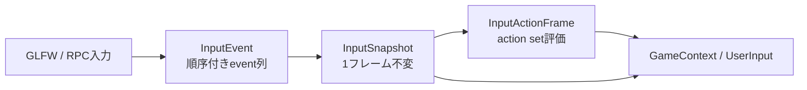

# 第5章 ゲームAPIとサービス

[索引へ戻る](README.md) / [前章](04_ecs_deep_dive.md)

## 5.1 `GameContext`は公開ファサード

ゲームSystemが直接`GET_MODULE()`へ依存しなくて済むよう、[`GameContext`](../../src/core/userpublic/gamecontext.hpp#L20) が主要サービスを薄く包みます。

| API群 | 委譲先 | 実装へジャンプ |
|---|---|---|
| Action入力 | `Actions` / `InputActionsRuntime` | [`gamecontext.cpp#L22`](../../src/core/userpublic/gamecontext.cpp#L22) |
| 時刻 | `EngineTime` | [`#L50`](../../src/core/userpublic/gamecontext.cpp#L50) |
| ログ | quill logger | [`#L62`](../../src/core/userpublic/gamecontext.cpp#L62) |
| object/transform | `GameObjects` | [`#L74`](../../src/core/userpublic/gamecontext.cpp#L74) |
| physics query | `PhysWorld` | [`#L95`](../../src/core/userpublic/gamecontext.cpp#L95) |
| camera | `Camera` | [`#L103`](../../src/core/userpublic/gamecontext.cpp#L103) |
| 乱数 | `DeterministicRng` | [`#L107`](../../src/core/userpublic/gamecontext.cpp#L107) |
| audio | `Audio`またはfeature disabled error | [`#L127`](../../src/core/userpublic/gamecontext.cpp#L127) |
| scene遷移 | `SceneLoader::requestLoad` | [`#L163`](../../src/core/userpublic/gamecontext.cpp#L163) |
| debug text | `DebugText` | [`#L171`](../../src/core/userpublic/gamecontext.cpp#L171) |
| event | event registry | [`gamecontext.hpp#L61`](../../src/core/userpublic/gamecontext.hpp#L61) |
| settings/save | `Persistence` | [`gamecontext.cpp#L175`](../../src/core/userpublic/gamecontext.cpp#L175) |

`GameContext`自体は状態を持ちません。各フレームでstack上に作られ、moduleへ到達する窓口として使われます。そのためSystemが`GameContext*`を保存する意味はありません。

## 5.2 ゲームSystemの形

最小のSystemは次のduck-typed classです。

```cpp
class PlayerSystem {
public:
    void update(Pelican::GameContext& ctx) {
        // 毎フレーム処理
    }
};

PELICAN_REGISTER_SYSTEM(PlayerSystem, 100);
```

実例は [`projects/example/code/playercontrol.cpp`](../../projects/example/code/playercontrol.cpp#L8) です。継承もvirtual関数も不要で、[`HasGameSystemUpdate`](../../src/core/userpublic/details/system/registerer.hpp#L32) Conceptが`void update(GameContext&)`の存在を検出します。

### instanceの寿命

[`gameSystemInstance<System>()`](../../src/core/userpublic/details/system/registerer.hpp#L42) は関数ローカルstaticのSystem instanceを返します。System objectは毎フレーム作り直されず、メンバ状態を保持できます。

これは`FastModuleContainer`管理ではないため、module cleanupでresetされません。通常プロセスでは問題になりませんが、同一プロセス内でruntimeを作り直すテストやtoolではSystemメンバのreset条件を自分で設計する必要があります。組み込みcamera controllerはframe index逆行と設定signature変更を検知してstateをresetします（[`resetIfNeeded()`](../../src/core/userpublic/cameracontrollersystem.cpp#L171)）。

### 実行順

registry実体は [`getGameSystemRegisterer()`](../../src/core/userpublic/details/system/registerer.cpp#L17) のstaticです。毎回copyして、次でsortします（[`sortGameSystemRegistrations()`](../../src/core/userpublic/details/system/registerer.cpp#L22)）。

1. `order`昇順
2. 同じorderなら登録時の型名文字列昇順

従ってtranslation unitの静的初期化順には依存せず、最終実行順は決定的です。組み込み [`BuiltinCameraControllerSystem`](../../src/core/userpublic/cameracontrollersystem.cpp#L324) はorder 10000なので、通常のゲームSystemの後に動きます。

## 5.3 event handlerを持つSystem

Systemはupdateに加え、登録済みevent型ごとに次を実装できます。

```cpp
void onEvent(const MyEvent& event, Pelican::GameContext& ctx);
```

[`HasGameSystemEvent`](../../src/core/userpublic/details/system/registerer.hpp#L37) がcompile時に検出します。updateを持たずevent handlerだけのSystemも登録できます。

どのevent型に対して`onEvent`があるかを列挙する仕組みが、このコードベースで特に「黒魔術」に見える部分です。概要は以下です。

1. `PELICAN_REGISTER_EVENT(Event)`が`__COUNTER__`番号付きのcatalog関数を宣言。
2. `PELICAN_REGISTER_SYSTEM(System, order)`が自分の`__COUNTER__`までの番号を`integer_sequence`で走査。
3. そのtranslation unitから見えるcatalog entryについて、`HasGameSystemEvent<System, Event>`を判定。
4. 該当する型だけtype-erased dispatch関数をregistryへ保存。

マクロ展開の詳細と制約は[第9章](09_black_magic_and_gotchas.md)で扱います。

## 5.4 Event bus

### event型の契約

登録マクロは [`PELICAN_REGISTER_EVENT`](../../src/core/userpublic/details/event/registerer.hpp#L121) です。型は次を満たす必要があります。

- object型
- pointerでない
- copy construct可能

RPCの`inject_event`からpayloadを構築するには、さらにdefault construct可能で、[`ISerializable<Event, JsonArchiveLoader>`](../../src/core/userpublic/serialize/serialize.hpp#L10)、つまり`event.ref(archive)`が必要です。

### runtime表現

[`QueuedEvent`](../../src/core/userpublic/details/event/registerer.hpp#L26) は次を持ちます。

- `std::type_index`
- namespaceを外した表示名
- `shared_ptr<const void>` payload

payloadを値copyしてshared ownershipへ変換するため、emit元のstack objectが消えても次フレームまで安全です。dispatch時に登録済み関数が元のEvent型へcastします。

### 名前と重複

[`__registerEvent()`](../../src/core/userpublic/details/event/registerer.cpp#L25) は最後の`::`以前を除去します。`Game::Damage`はRPC上`Damage`として見えます。

- 同じ名前・同じ型の再登録はno-op
- 同名・別型はerror
- 同型・別名もerror

[`SceneLoaded`](../../src/core/userpublic/events.hpp#L9) はnamespace可視性の都合で二度マクロ登録されていますが、同名・同型なのでidempotentです。

### queue境界

eventは`pending_events`へ入り、フレーム先頭で`deliver_now_events`へswapし、emit順に配送されます（[`freeze/drain`](../../src/core/userpublic/details/event/registerer.cpp#L89)）。System側はorder/name順です。従って配送順は次です。

```text
event emit順
  × 各eventについてSystem order/name順
```

## 5.5 入力の四層



### L1: OS入力

[`Window`](../../src/core/os/window.hpp#L15) がGLFW callbackを`InputEvent`へ変換します。RPCの`inject_input`も同じ`InputState.queueEvents()`へ合流するため、下流は入力源を区別しません。

### L2: 順序付きInputEvent

[`InputStateCore::queueEvent()`](../../src/core/os/inputstate.cpp#L194) がプロセス内単調増加`event_seq`を付けます。記録済みsequenceを注入する場合は単調性を検証し、勝手に番号を付け替えません。

eventはbutton、cursor move、axis deltaの三種です（[`InputEvent`](../../src/core/os/inputstate.hpp#L36)）。

### L3: InputSnapshot

[`beginFrame()`](../../src/core/os/inputstate.cpp#L229) がpending列を一回処理し、down/pushed/released、mouse position、mouse deltaを生成します。

- 同一フレーム内のdown→upもevent順からedgeを導出。
- mouse cursor差分とinjectされたaxis deltaを加算。
- snapshotはtrivially copyable/standard layoutで、記録・再生しやすい値型。

[`FrameInput`](../../src/core/os/inputstate.hpp#L83) はsnapshotに加え、そのフレームのordered event `span`を貸し出します。spanのownerは`InputStateCore`です。次の`beginFrame()`まで保持するとdebug assertになります（[`borrow検査`](../../src/core/os/inputstate.cpp#L229)）。

### L4: Action map

[`parseInputActionsJson()`](../../src/core/os/actionmap.cpp#L527) が`pelican.input_actions` v1を読みます。現対応bindingはkeyboard key、mouse delta axis、WASD/arrows compositeなどです。

[`evaluateInputActions()`](../../src/core/os/actionmap.cpp#L588) はaction set stackを**末尾から先頭へ**評価します。つまり最後にpushしたsetが高優先です。上位setが使ったcontrolを`ConsumedControls`へ記録し、下位setでは同じkey/axisを無視します。

Action結果はbuttonのpressed/released/held、axis1、axis2です。`pose`型はパースできますが、[`InputActionFrame::pose()`](../../src/core/os/actionmap.cpp#L515) は現在「OpenXR pose resolution未実装」をthrowします。

### raw inputとAction消費は別

`InputConsumptionMask`はAction用snapshotのkey/mouseだけをzero化します。公開 [`UserInput`](../../src/core/userpublic/userinput.cpp#L165) が読む元snapshotは変更しません。UIなどがActionだけを抑止しつつ、diagnosticがraw inputを見られる構造です。

## 5.6 Camera

[`Camera`](../../src/core/renderer/camera.hpp#L15) は次を一つのmoduleで管理します。

- 現在のpos/dir/up
- perspective/orthographic projection
- scene内の名前付きcamera定義
- active camera名
- optional orbit/follow/fly controller定義

### scene cameraロード

[`Camera::loadSceneCameras()`](../../src/core/renderer/camera.cpp#L453) はscene JSONを再正規化し、`camera` componentを持つobjectを抽出します。最初のcameraを初期表示へ使い、名前付きcameraはmapへ保存します。

`GameContext::setCamera(name)`は [`Camera::setActiveCamera()`](../../src/core/renderer/camera.cpp#L551) を呼び、以後そのcameraのpose/projectionをactiveにします。active scene cameraがlockされると、旧内部`CameraSystem`の`setPos/setDir`は無視されます。

### controller

[`BuiltinCameraControllerSystem`](../../src/core/userpublic/cameracontrollersystem.cpp#L283) がゲームSystemとして毎フレーム処理します。

- orbit: target周りのyaw/pitch/distance
- follow: target + offsetからlook-at
- fly: `move`/`look` Actionで自由移動
- damping: `1 - exp(-damping * dt)`でframe rateに依存しにくい補間

controllerは名前bindingからtarget transformを毎回resolveし、scene遷移・entity削除を検知できます。

## 5.7 Physics

physicsは外部物理engineではなく、現時点ではCPU幾何クエリです。

### 純粋クエリ層

[`physquery.hpp`](../../src/core/phys/physquery.hpp#L12) はSphere、oriented Box、Capsuleを`std::variant`で表します。[`physquery.cpp`](../../src/core/phys/physquery.cpp#L1) がraycastと全shape組合せのoverlapを実装します。

`raycastClosest`は距離最小を選び、距離がepsilon内で同じなら文字列ID昇順をtie-breakerにします。`overlapAll`もIDをsortして返すため、sceneの内部登録順に結果が左右されません。

### World binding層

[`PhysWorld`](../../src/core/phys/physworld.hpp#L33) はCollider定義とtransform sourceを保存します。sourceは次のvariantです。

- live `GameObjectId`
- static `PhysWorldTransform`

queryのたびに [`collectColliders()`](../../src/core/phys/physworld.cpp#L263) がECS transformをresolveし、local collider offset/rotationとworld scaleを合成して純粋`phys::Collider`列を作ります。削除済みentityのbindingはqueryから自然に除外されます。

現実装はbroad phase spatial indexを持たず、queryごとに全bindingを走査します。大量colliderではO(N)が支配的です。

## 5.8 決定的乱数

[`DeterministicRng`](../../src/core/userpublic/deterministicrng.cpp#L17) はPCG32です。初期seedは`ProjectBasicConfig.seed()`、RPC/GameContextから再設定できます。

- `random()`: 2回の32-bit出力から53-bit精度の`[0,1)` double
- `randomInt(min,max)`: modulo biasを避けるrejection sampling
- `randomFloat(min,max)`: double補間後float化

同じseedと同じ呼び出し順なら同じ列です。ただし並列Systemから同じmoduleを同時利用する同期はありません。ゲームSystemは現在直列ですが、内部jobや別threadから共有しない前提です。

## 5.9 Audio

公開型は [`Audio`](../../src/core/audio/audio.hpp#L22) です。

### backend interface

実装内部の [`Audio::Backend`](../../src/core/audio/audio.cpp#L255) がvirtual interfaceで、二実装があります。

- `MiniaudioBackend`: 実deviceへ再生
- `NullAudioBackend`: headless/RPC、またはdevice初期化失敗時

headlessでもplay/stop/isPlayingの状態遷移は模倣されるため、ゲームロジックとテストを同じAPIで動かせます。

### decodeとvoice

[`Audio::playSound()`](../../src/core/audio/audio.cpp#L435) は`PathResolver`でbytesを読み、WAVをfloat sampleへdecodeし、backend voice IDを型付き`SoundHandle`へ包みます。現公開playは全てSE busです。

busはmaster/bgm/seで、実効音量はmaster×個別busです。設定変更時はlive voice全てへ再適用します。

## 5.10 Persistence

[`Persistence`](../../src/core/persistence/persistence.hpp#L28) は全て`user://`配下へ保存します。

### settings

`user://settings.json`はengine audio設定と任意game JSONを持ちます。ロード失敗は起動失敗にせず、warningと`lastSettingsError`を残してdefaultへ戻します（[`loadSettings()`](../../src/core/persistence/persistence.cpp#L195)）。

### save slot

`saveData(slot, json)`は`user://saves/<slot>.json`へ保存します。slotにはportable filename制約があり、separator、`..`、Windowsで危険な文字などを拒否します（[`validateSlot()`](../../src/core/persistence/persistence.cpp#L168)）。

### 原子的書き換え

[`atomicWrite()`](../../src/core/persistence/persistence.cpp#L136) は同directoryの`.tmp`へflush/close後、Windowsでは`MoveFileExW(REPLACE_EXISTING | WRITE_THROUGH)`、他OSではrenameで置換します。途中失敗ではtempをcleanupします。

## 5.11 Debug text

`GameContext::debugText(x,y,text)`は [`DebugText::text()`](../../src/core/renderer/debugtext.hpp#L69) へglyphをqueueします。描画configで`debug_text` featureが有効なときだけrendererが`DebugText` moduleを生成し、対応passで描画します。APIを呼べることと、passが画面へ出すことは別条件です。

## 5.12 ゲームコードの推奨境界

通常のproject codeは次をincludeし、内部moduleへ直接触れない構成が保守しやすいです。

- [`gamesystem.hpp`](../../src/core/userpublic/gamesystem.hpp#L1)
- [`gamecontext.hpp`](../../src/core/userpublic/gamecontext.hpp#L1)
- [`gameobjects.hpp`](../../src/core/userpublic/gameobjects.hpp#L1)
- [`components/`](../../src/core/userpublic/components)
- [`events.hpp`](../../src/core/userpublic/events.hpp#L1)
- [`phys/physquery.hpp`](../../src/core/phys/physquery.hpp#L1)

内部`GET_MODULE()`を使えば機能へ到達できますが、module生成順・Vulkan型・内部Componentへ依存し、配布API境界を越えます。まず`GameContext`へ必要な薄いファサードを足せないか検討するのが既存設計に合います。
