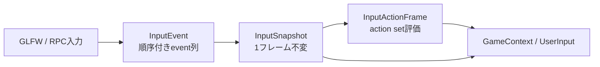

# 第5章 ゲームAPIとサービス

[索引へ戻る](README.md) / [前章](04_ecs_deep_dive.md)

## 5.1 `GameContext`は公開ファサード

ゲームSystemが直接`GET_MODULE()`へ依存しなくて済むよう、[`GameContext`](../../src/core/userpublic/gamecontext.hpp#L22) が主要サービスを薄く包みます。

| API群 | 委譲先 | 実装へジャンプ |
|---|---|---|
| Action入力（`actionPose()`含む） | `Actions` / `InputActionsRuntime` | [`gamecontext.cpp#L25`](../../src/core/userpublic/gamecontext.cpp#L25) |
| 時刻（`frameIndex()`含む） | `EngineTime` | [`#L53`](../../src/core/userpublic/gamecontext.cpp#L53) |
| ログ | quill logger | [`#L65`](../../src/core/userpublic/gamecontext.cpp#L65) |
| object/transform | `GameObjects` | [`#L77`](../../src/core/userpublic/gamecontext.cpp#L77) |
| sprite（`createSpriteObject`/`spriteView`/`setSpriteView`/`setSpriteTexture`） | `GameObjects` / sprite runtime | [`#L86`](../../src/core/userpublic/gamecontext.cpp#L86) |
| light（`setDirectionalLightDirection`/`setDirectionalLightIntensity`/`setPointLightPosition`/`setSpotLightDirection`） | `LightContainer` | [`#L132`](../../src/core/userpublic/gamecontext.cpp#L132) |
| physics query（`raycastAll`/`raycastClosest(filter)`/`overlapAllHits`/`shapeCastAll`/`shapeCastClosest` + [`phys::QueryFilter`](../../src/core/phys/physquery.hpp#L76)） | physics service | [`#L151`](../../src/core/userpublic/gamecontext.cpp#L151) |
| camera | `Camera` | [`#L241`](../../src/core/userpublic/gamecontext.cpp#L241) |
| 乱数（`setSeed`/`seed()`） | `DeterministicRng` | [`#L245`](../../src/core/userpublic/gamecontext.cpp#L245) |
| audio | `Audio`またはfeature disabled error | [`#L265`](../../src/core/userpublic/gamecontext.cpp#L265) |
| scene遷移 | `SceneLoader::requestLoad` | [`#L301`](../../src/core/userpublic/gamecontext.cpp#L301) |
| debug text | `DebugText` | [`#L309`](../../src/core/userpublic/gamecontext.cpp#L309) |
| event | event registry | [`gamecontext.hpp#L89`](../../src/core/userpublic/gamecontext.hpp#L89) |
| settings/save | `Persistence` | [`gamecontext.cpp#L313`](../../src/core/userpublic/gamecontext.cpp#L313) |

class全体が [`PELICAN_API`](../../src/core/userpublic/export.hpp) でexport修飾されています。game DLL境界を越えて使われるためです。

`GameContext`自体は状態を持ちません。各フレームでstack上に作られ、moduleへ到達する窓口として使われます。そのためSystemが`GameContext*`を保存する意味はありません。

### ライト操作API ✅実装済み（WP142 / LIGHT0）

[`gamecontext.hpp#L50-L53`](../../src/core/userpublic/gamecontext.hpp#L50) の4本は、scene定義済みライトを**名前で引いて**更新します。いずれも `[[nodiscard]] bool` を返し、その名前のライトが無ければ`false`です。委譲先は [`LightContainer`](../../src/core/light/lightcontainer.hpp) の同名setterです。

```cpp
[[nodiscard]] bool setDirectionalLightDirection(std::string_view name, vec3 direction) const;
[[nodiscard]] bool setDirectionalLightIntensity(std::string_view name, float intensity) const;
[[nodiscard]] bool setPointLightPosition(std::string_view name, vec3 position) const;
[[nodiscard]] bool setSpotLightDirection(std::string_view name, vec3 direction) const;
```

> **設計決定:** engine側でライト名（`"KeyLight"`など）を特別扱いしてアニメーションさせる旧挙動は撤去されました。`LightContainer::updateAnimation()`と原本ライト配列は削除済みで、ライトの時間変化は**ユーザー空間の責務**です。実例は [`projects/example/code/playercontrol.cpp`](../../projects/example/code/playercontrol.cpp) の`updateLightAnimation()`です。詳細は[第9章](09_black_magic_and_gotchas.md)を参照してください。

## 5.2 ゲームSystemの形

最小のSystemは次のduck-typed classです。

```cpp
class PlayerSystem {
public:
    void update(Pelican::GameContext& ctx) {
        // 毎フレーム処理
    }
};

PELICAN_REGISTER_SYSTEM(PlayerSystem, 100);
```

実例は [`projects/example/code/playercontrol.cpp`](../../projects/example/code/playercontrol.cpp#L8) です。継承もvirtual関数も不要で、[`HasGameSystemUpdate`](../../src/core/userpublic/details/system/registerer.hpp#L38) Conceptが`void update(GameContext&)`の存在を検出します。`PELICAN_REGISTER_SYSTEM`の定義は [registerer.hpp#L173](../../src/core/userpublic/details/system/registerer.hpp#L173)（IMPLは [L155](../../src/core/userpublic/details/system/registerer.hpp#L155)）です。

registryの各登録には [`RegistrationOwner`](../../src/core/userpublic/details/system/registerer.hpp#L33)（engine / game DLL）が付き、game logic reload時にはowner単位で [`unregisterGameSystems()`](../../src/core/userpublic/details/system/registerer.hpp#L142) されます。登録は [`RegistrationToken`](../../src/core/userpublic/details/reload/registrationowner.hpp#L26) を返し、`PELICAN_REGISTER_SYSTEM_IMPL`が生成する静的objectがそれを保持します。個別解除は [`unregisterGameSystem(token)`](../../src/core/userpublic/details/system/registerer.hpp#L141) です。

### instanceの寿命

[`gameSystemInstance<System>()`](../../src/core/userpublic/details/system/registerer.hpp#L53) は関数ローカルstaticのSystem instanceを返します。System objectは毎フレーム作り直されず、メンバ状態を保持できます。

これは`FastModuleContainer`管理ではないため、module cleanupでresetされません。通常プロセスでは問題になりませんが、同一プロセス内でruntimeを作り直すテストやtoolではSystemメンバのreset条件を自分で設計する必要があります。加えて、DLL reloadでは新DLLのfunction-local staticが新規インスタンスになるため、旧状態は引き継がれません。組み込みcamera controllerはframe index逆行と設定signature変更を検知してstateをresetします（[`resetIfNeeded()`](../../src/core/userpublic/cameracontrollersystem.cpp#L171)）。

### 実行順

registry実体は [`getGameSystemRegisterer()`](../../src/core/userpublic/details/system/registerer.cpp#L28) のstaticです。毎回copyして、次でsortします（[`sortGameSystemRegistrations()`](../../src/core/userpublic/details/system/registerer.cpp#L33)）。

1. `order`昇順
2. 同じorderなら登録時の型名文字列昇順

従ってtranslation unitの静的初期化順には依存せず、最終実行順は決定的です。組み込み [`BuiltinCameraControllerSystem`](../../src/core/userpublic/cameracontrollersystem.cpp#L324) はorder 10000なので、通常のゲームSystemの後に動きます。

## 5.3 event handlerを持つSystem

Systemはupdateに加え、登録済みevent型ごとに次を実装できます。

```cpp
void onEvent(const MyEvent& event, Pelican::GameContext& ctx);
```

[`HasGameSystemEvent`](../../src/core/userpublic/details/system/registerer.hpp#L43) がcompile時に検出します。updateを持たずevent handlerだけのSystemも登録できます。

第三のフックとして [`HasGameSystemQueuedEvent`](../../src/core/userpublic/details/system/registerer.hpp#L48)（`void dispatchQueuedEvent(const QueuedEvent&, GameContext&)`）が加わりました。型ごとのcatalogを経由せず`QueuedEvent`をそのまま受け取る口で、engine内では`BehaviorSystem`だけが使います（§5.13）。これにより「updateもevent handlerも無いSystemは登録error」の条件が`!has_queued_event && event_handlers.empty()`へ緩和されています（[registerer.hpp#L106-L110](../../src/core/userpublic/details/system/registerer.hpp#L106)）。

どのevent型に対して`onEvent`があるかを列挙する仕組みが、このコードベースで特に「黒魔術」に見える部分です。概要は以下です。

1. `PELICAN_REGISTER_EVENT(Event)`が`__COUNTER__`番号付きのcatalog関数を宣言。
2. `PELICAN_REGISTER_SYSTEM(System, order)`が自分の`__COUNTER__`までの番号を`integer_sequence`で走査。
3. そのtranslation unitから見えるcatalog entryについて、`HasGameSystemEvent<System, Event>`を判定。
4. 該当する型だけtype-erased dispatch関数をregistryへ保存。

マクロ展開の詳細と制約は[第9章](09_black_magic_and_gotchas.md)で扱います。

## 5.4 Event bus

### event型の契約

登録マクロは [`PELICAN_REGISTER_EVENT`](../../src/core/userpublic/details/event/registerer.hpp#L257)（IMPLは [L242](../../src/core/userpublic/details/event/registerer.hpp#L242)）です。型は次を満たす必要があります。

- object型
- pointerでない
- copy construct可能

RPCの`inject_event`からpayloadを構築するには、さらにdefault construct可能で、[`ISerializable<Event, JsonArchiveLoader>`](../../src/core/userpublic/serialize/serialize.hpp#L10)、つまり`event.ref(archive)`が必要です。

event型は宣言的な **payload schema**（EventPayloadSchema v1、[`payloadschema.hpp`](../../src/core/userpublic/details/event/payloadschema.hpp)、[registerer.hpp#L50](../../src/core/userpublic/details/event/registerer.hpp#L50)）を持てます。compile-time検証のfixtureは [`test/fixtures/event_payload_schema/`](../../test/fixtures/event_payload_schema) です。宣言に`structFields`を使う場合は`eventPayloadPolicy`が必須で、全フィールドが`required(...)`かつ`bool`/enum不可という制約が掛かります（§5.14）。

### runtime表現

[`QueuedEvent`](../../src/core/userpublic/details/event/registerer.hpp#L29) は次を持ちます。

- `std::type_index`
- namespaceを外した表示名
- `shared_ptr<const void>` payload
- 発行元の [`RegistrationOwner`](../../src/core/userpublic/details/event/registerer.hpp#L33)

payloadを値copyしてshared ownershipへ変換するため、emit元のstack objectが消えても次フレームまで安全です。dispatch時に登録済み関数が元のEvent型へcastします。`owner`が付いたことで、game DLL reload時に「消えたownerのqueued event」を選別できます。

teardown経路では [`drainPendingEventsForTeardown()`](../../src/core/userpublic/details/event/registerer.hpp#L221) が [`EventQueueDrainResult{pending, frozen}`](../../src/core/userpublic/details/event/registerer.hpp#L36) を返し、[第2章](02_runtime_lifecycle.md)のteardown段階から呼ばれます。

### 名前と重複

[`__registerEvent()`](../../src/core/userpublic/details/event/registerer.cpp#L238) は [`eventDisplayName()`](../../src/core/userpublic/details/event/registerer.cpp#L20) で最後の`::`以前を除去します（正規化は [registerer.cpp#L241](../../src/core/userpublic/details/event/registerer.cpp#L241)）。`Game::Damage`はRPC上`Damage`として見えます。戻り値は`RegistrationToken`です。

- 同じ名前・同じ型の再登録はno-op
- 同名・別型はerror
- 同型・別名もerror

engine event の [`SceneLoaded`](../../src/core/userpublic/events.hpp#L10)、
[`OverlapEnter` / `OverlapExit`](../../src/core/userpublic/events.hpp#L18) は
namespace可視性の都合で二度マクロ登録されていますが、同名・同型なので
idempotentです。Overlap event は full `EntityId {index,generation}` を
`self` / `other` に保持します。

### queue境界

eventは`pending_events`へ入り、フレーム先頭で`deliver_now_events`へswapし、emit順に配送されます（自由関数 [`freezePendingEventsForFrame()`](../../src/core/userpublic/details/event/registerer.cpp#L444)、メンバは [L405](../../src/core/userpublic/details/event/registerer.cpp#L405)）。System側はorder/name順です。従って配送順は次です。

```text
event emit順
  × 各eventについてSystem order/name順
```

## 5.5 入力の四層



### L1: OS入力

[`Window`](../../src/core/os/window.hpp#L15) がGLFW callbackを`InputEvent`へ変換します。RPCの`inject_input`も同じ`InputState.queueEvents()`へ合流するため、下流は入力源を区別しません。

XRセッション中は **XR action backend** もこの層に入ります。`syncActions()`の結果を`internal::setInputActionBackendFrame()`と`queuePoseSamples()`でInputStateへ流し込みます（[loop.cpp#L501-L503](../../src/core/appflow/loop.cpp#L501)）。また [`InputSequenceRuntime`](../../src/core/os/inputsequence.hpp#L45) によるrecord/replayが、この層のevent queue境界に挿入されます。

### L2: 順序付きInputEvent

[`InputStateCore::queueEvent()`](../../src/core/os/inputstate.cpp#L335) がプロセス内単調増加`event_seq`を付けます。記録済みsequenceを注入する場合は単調性を検証し、勝手に番号を付け替えません。

eventはbutton、cursor move、axis deltaの三種です（[`InputEvent`](../../src/core/os/inputstate.hpp#L86)）。

### L3: InputSnapshot

[`beginFrame()`](../../src/core/os/inputstate.cpp#L373) がpending列を一回処理し、down/pushed/released、mouse position、mouse deltaを生成します。

- 同一フレーム内のdown→upもevent順からedgeを導出。
- mouse cursor差分とinjectされたaxis deltaを加算。
- snapshotはtrivially copyable/standard layoutで、記録・再生しやすい値型。

[`FrameInput`](../../src/core/os/inputstate.hpp#L173) はsnapshotに加え、そのフレームのordered event `span`を貸し出します。spanのownerは`InputStateCore`です。次の`beginFrame()`まで保持するとdebug assertになります（[`FrameInputBorrowState`](../../src/core/os/inputstate.hpp#L162)、コメントは [inputstate.hpp#L172](../../src/core/os/inputstate.hpp#L172)）。

### L4: Action map

[`parseInputActionsJson()`](../../src/core/os/actionmap.cpp#L695) が`pelican.input_actions` v1を読みます。現対応bindingはkeyboard key、mouse delta axis、WASD/arrows composite、gamepad（[`gamepad_button` / `gamepad_axis1` / `gamepad_axis2`](../../src/core/os/actionmap.cpp#L24)）などです。プロファイルは `input/profiles/*.json` から選べます（起動オプション`--input-profile`、RPC `set_input_profile`）。

[`evaluateInputActions()`](../../src/core/os/actionmap.cpp#L836) はaction set stackを**末尾から先頭へ**評価します。つまり最後にpushしたsetが高優先です。上位setが使ったcontrolを`ConsumedControls`へ記録し、下位setでは同じkey/axisを無視します。

Action結果はbuttonのpressed/released/held、axis1、axis2、poseです。`pose`型は実装済みで（WP130/132）、[`InputActionFrame::pose()`](../../src/core/os/actionmap.cpp#L683) は`poses` mapから返し、未サンプルならdefaultの`ActionPose`を返します。XR pose providerがない環境（flat）ではpose sampleが来ないため常にdefaultです。

### raw inputとAction消費は別

`InputConsumptionMask`はAction用snapshotのkey/mouseだけをzero化します。公開 [`UserInput`](../../src/core/userpublic/userinput.cpp#L165) が読む元snapshotは変更しません。UIなどがActionだけを抑止しつつ、diagnosticがraw inputを見られる構造です。

## 5.6 Camera

[`Camera`](../../src/core/renderer/camera.hpp#L16) は次を一つのmoduleで管理します。

- 現在のpos/dir/up
- perspective/orthographic projection
- scene内の名前付きcamera定義
- active camera名
- optional orbit/follow/fly controller定義

加えて [`discontinuityRevision()`](../../src/core/renderer/camera.hpp#L104) と [`getProjectionSpec()`](../../src/core/renderer/camera.hpp#L109) を公開します。前者はrendererのtemporal reset（[renderer.cpp#L1285-L1292](../../src/core/vkcore/renderer.cpp#L1285)）、後者はXR eye projectionの入力（[loop.cpp#L499](../../src/core/appflow/loop.cpp#L499)）です。

### scene cameraロード

[`Camera::loadSceneCameras()`](../../src/core/renderer/camera.cpp#L645) はscene JSONを再正規化し、`camera` componentを持つobjectを抽出します。最初のcameraを初期表示へ使い、名前付きcameraはmapへ保存します。

`GameContext::setCamera(name)`は [`Camera::setActiveCamera()`](../../src/core/renderer/camera.cpp#L716) を呼び、以後そのcameraのpose/projectionをactiveにします。active scene cameraがlockされると、旧内部`CameraSystem`の`setPos/setDir`は無視されます。

### controller

[`BuiltinCameraControllerSystem`](../../src/core/userpublic/cameracontrollersystem.cpp#L283) がゲームSystemとして毎フレーム処理します。

- orbit: target周りのyaw/pitch/distance
- follow: target + offsetからlook-at
- fly: `move`/`look` Actionで自由移動
- damping: `1 - exp(-damping * dt)`でframe rateに依存しにくい補間

controllerは名前bindingからtarget transformを毎回resolveし、scene遷移・entity削除を検知できます。

## 5.7 Physics

physicsはビルドフラグ `PELICAN_WITH_PHYSICS` の配下にあります（OFFではstub実装になり、colliderを含むsceneは明示エラー）。クエリ実装は **provider ABI** で差し替え可能です（WP107系列）。

### provider ABI

ABI面は [`userpublic/physics/abi_v1.hpp`](../../src/core/userpublic/physics/abi_v1.hpp) / [`abi_v2.hpp`](../../src/core/userpublic/physics/abi_v2.hpp)（v2でshapeCastとcapability bitsが追加）です。組み込みの [`BuiltinPhysicsProvider`](../../src/core/phys/builtinphysicsprovider.hpp) と、optionalの [`JoltPhysicsProvider`](../../src/core/phys/joltphysicsprovider.hpp)（`PELICAN_WITH_JOLT_PHYSICS`）があります。[`physicsservice.cpp`](../../src/core/phys/physicsservice.cpp) がABI面を、[`physicsruntime`](../../src/core/phys/physicsruntime.hpp) がprovider選択を担います。DLL providerのfixtureは [`test/fixtures/physics_provider_dll/`](../../test/fixtures/physics_provider_dll) です。

### 純粋クエリ層

[`physquery.hpp`](../../src/core/phys/physquery.hpp#L12) はSphere、oriented Box、Capsuleを`std::variant`で表します（[`Shape`](../../src/core/phys/physquery.hpp#L41)）。クエリは [`QueryFilter`](../../src/core/phys/physquery.hpp#L76) と [`ShapeCastHit`](../../src/core/phys/physquery.hpp#L138) を持ち、実装はaggregate/contract/sweepに分割されています。

`raycastClosest`は距離最小を選び、距離がepsilon内で同じなら文字列ID昇順をtie-breakerにします。`overlapAll`もIDをsortして返すため、sceneの内部登録順に結果が左右されません。

### World binding層

[`PhysWorld`](../../src/core/phys/physworld.hpp#L33) はCollider定義とtransform sourceを保存します。sourceは次のvariantです。

- live `GameObjectId`
- static `PhysWorldTransform`

queryのたびに [`collectColliders()`](../../src/core/phys/physworld.cpp#L415) がECS transformをresolveし、local collider offset/rotationとworld scaleを合成して純粋`phys::Collider`列を作ります。削除済みentityのbindingはqueryから自然に除外されます。

builtin providerはbroad phase spatial indexを持たず、queryごとに全bindingを走査します。大量colliderではO(N)が支配的です。

### trigger event ✅実装済み（WP179 / E2）

呼び出し元は専用のゲームSystem `PhysicsTriggerSystem` です（[physworld.cpp#L30-L45](../../src/core/phys/physworld.cpp#L30)）。orderは `std::numeric_limits<int>::max()` なので、組み込み`BuiltinCameraControllerSystem`（10000）を含む**すべてのゲームSystemの後**に走ります。

[`PhysWorld::updateTriggers()`](../../src/core/phys/physworld.cpp#L548) は、
`trigger=true` collider ごとに provider の overlap query を行い、full
`EntityId` の canonical pair set を前 frame と比較します。pair 全体を sort /
unique してから sorted merge するため、provider の列挙順には依存しません。

- 新 pair: `OverlapEnter` を lower-self、higher-self の順で両視点へ emit
- 継続 pair: event なし(Stay は未採用)
- 消えた pair: 同順の `OverlapExit`
- entity destroy / collider remove: 次 update で Exit
- `PhysWorld::clear()`: scene domain reset として pair table を破棄し Exit なし
- provider unavailable: separation の証拠ではないため前 pair を保持

event は特別な即時 callback ではなく通常のE1 queueへ入り、次フレーム先頭に
typed System/Behavior handlerへ配送されます。trigger query と rigid-body responseは
独立であり、現在も Jolt は query providerだけです。

### 編集transaction用のprepare/publish

[`PhysWorld::PreparedState`](../../src/core/phys/physworld.hpp#L47) と [`snapshotPrepared()`](../../src/core/phys/physworld.hpp#L63) / [`prepareBindings()`](../../src/core/phys/physworld.hpp#L64) / [`publishPrepared()`](../../src/core/phys/physworld.hpp#L68)（`noexcept`）は、編集RPCのcollider投影が使うprepare/publishの三点セットです。[第9章](09_black_magic_and_gotchas.md)の編集transaction節を参照してください。

`PELICAN_WITH_PHYSICS=OFF` 用のstubは [`physworld_stub.cpp`](../../src/core/phys/physworld_stub.cpp) で、binding系APIは `PELICAN_WITH_PHYSICS=OFF: PhysWorld collider binding is unavailable` を投げます。

## 5.8 決定的乱数

[`DeterministicRng`](../../src/core/userpublic/deterministicrng.cpp#L17) はPCG32です。初期seedは`ProjectBasicConfig.seed()`、RPC/GameContextから再設定できます。

- `random()`: 2回の32-bit出力から53-bit精度の`[0,1)` double
- `randomInt(min,max)`: modulo biasを避けるrejection sampling
- `randomFloat(min,max)`: double補間後float化

同じseedと同じ呼び出し順なら同じ列です。ただし並列Systemから同じmoduleを同時利用する同期はありません。ゲームSystemは現在直列ですが、内部jobや別threadから共有しない前提です。

## 5.9 Audio

公開型は [`Audio`](../../src/core/audio/audio.hpp#L22) です。

### backend interface

実装内部の [`Audio::Backend`](../../src/core/audio/audio.cpp#L255) がvirtual interfaceで、二実装があります。

- `MiniaudioBackend`: 実deviceへ再生
- `NullAudioBackend`: headless/RPC、またはdevice初期化失敗時

headlessでもplay/stop/isPlayingの状態遷移は模倣されるため、ゲームロジックとテストを同じAPIで動かせます。

### decodeとvoice

[`Audio::playSound()`](../../src/core/audio/audio.cpp#L435) は`PathResolver`でbytesを読み、WAVをfloat sampleへdecodeし、backend voice IDを型付き`SoundHandle`へ包みます。現公開playは全てSE busです。

busはmaster/bgm/seで、実効音量はmaster×個別busです。設定変更時はlive voice全てへ再適用します。

## 5.10 Persistence

[`Persistence`](../../src/core/persistence/persistence.hpp#L28) は全て`user://`配下へ保存します。

### settings

`user://settings.json`はengine audio設定と任意game JSONを持ちます。ロード失敗は起動失敗にせず、warningと`lastSettingsError`を残してdefaultへ戻します（[`loadSettings()`](../../src/core/persistence/persistence.cpp#L195)）。

### save slot

`saveData(slot, json)`は`user://saves/<slot>.json`へ保存します。slotにはportable filename制約があり、separator、`..`、Windowsで危険な文字などを拒否します（[`validateSlot()`](../../src/core/persistence/persistence.cpp#L168)）。

### 原子的書き換え

[`atomicWrite()`](../../src/core/persistence/persistence.cpp#L136) は同directoryの`.tmp`へflush/close後、Windowsでは`MoveFileExW(REPLACE_EXISTING | WRITE_THROUGH)`、他OSではrenameで置換します。途中失敗ではtempをcleanupします。

## 5.11 Debug text

`GameContext::debugText(x,y,text)`は [`DebugText::text()`](../../src/core/renderer/debugtext.hpp#L69) へglyphをqueueします。描画configで`debug_text` featureが有効なときだけrendererが`DebugText` moduleを生成し、対応passで描画します。APIを呼べることと、passが画面へ出すことは別条件です。

## 5.12 ゲームコードの推奨境界

通常のproject codeは次をincludeし、内部moduleへ直接触れない構成が保守しやすいです。

- [`gamesystem.hpp`](../../src/core/userpublic/gamesystem.hpp#L1)
- [`gamecontext.hpp`](../../src/core/userpublic/gamecontext.hpp#L1)
- [`behavior.hpp`](../../src/core/userpublic/behavior.hpp#L1)（`Behavior` / `BehaviorContext` / `PELICAN_REGISTER_BEHAVIOR`、および`Pelican::structFields`系DSL）
- [`gameobjects.hpp`](../../src/core/userpublic/gameobjects.hpp#L1)
- [`components/`](../../src/core/userpublic/components)
- [`events.hpp`](../../src/core/userpublic/events.hpp#L1)
- [`phys/physquery.hpp`](../../src/core/phys/physquery.hpp#L1)、[`physics/abi_v1.hpp` / `abi_v2.hpp`](../../src/core/userpublic/physics)
- [`sprite/`](../../src/core/userpublic/sprite)（`SpriteWorld`、`FlipbookClip`、pixel policy）
- [`platformer/charactercontroller2d.hpp`](../../src/core/userpublic/platformer/charactercontroller2d.hpp)（WP109）
- [`color.hpp`](../../src/core/userpublic/color.hpp)
- [`animation/vrm_application_v1.hpp`](../../src/core/userpublic/animation/vrm_application_v1.hpp)（VRM expression/application sink、WP123b）
- [`animation/abi_v1.hpp`](../../src/core/userpublic/animation/abi_v1.hpp#L1)（animation provider ABI v1。[`AnimationSourceHandle`](../../src/core/userpublic/animation/abi_v1.hpp#L39) と `claim_source` / `release_source` / `handoff_source` / `sample_animation_source_at`、WP178）
- [`animation/animgraph.hpp`](../../src/core/userpublic/animation/animgraph.hpp#L1)（`pelican.anim_graph` v1 の `DocumentV1` / `EvaluatorV1`）

内部`GET_MODULE()`を使えば機能へ到達できますが、module生成順・Vulkan型・内部Componentへ依存し、配布API境界を越えます。配布API境界は [`PELICAN_API`](../../src/core/userpublic/export.hpp)（export.hpp）でexportされたgame DLL向けSDK面と一致します。まず`GameContext`へ必要な薄いファサードを足せないか検討するのが既存設計に合います。

## 5.13 Object Behavior ✅実装済み（WP155 / BEH0、WP162 / BEH1、WP167 / BEH2）

System が「全entityを横断する処理単位」なのに対し、Behavior は **scene objectに貼り付く処理単位** です。scene JSONの`behavior` componentが実体で、対応する型を game DLL 側で登録します。設計文書は [`docs/design_object_behaviors.md`](../design_object_behaviors.md) です。

### 公開API

[`src/core/userpublic/behavior.hpp`](../../src/core/userpublic/behavior.hpp) が唯一のincludeです。

```cpp
PELICAN_DEFINE_HANDLE(BehaviorAttachmentHandle, std::uint64_t)
inline constexpr BehaviorAttachmentHandle invalidBehaviorAttachmentHandle{};

// BehaviorSystem participates in the same (order, stable name) total order as
// user game systems for both event delivery and update.
inline constexpr int behaviorSystemOrder = 50;
inline constexpr std::string_view behaviorSystemName = "BehaviorSystem";

class PELICAN_API Behavior {
  public:
    virtual ~Behavior() = default;
    virtual void onInit(BehaviorContext &) {}
    virtual void onUpdate(BehaviorContext &) {}
    virtual void onDestroy(BehaviorContext &) noexcept {}
};
```

> **設計決定:** [`Behavior`](../../src/core/userpublic/behavior.hpp#L59) はこのコードベースで数少ない **仮想基底による公開interface** です。他の登録面（System / Component / Event）がduck typing + concept検出なのに対し、Behavior だけは「1オブジェクトにつき1個の多態インスタンスを arena が所有する」形なので継承を選んでいます。[第1章 §1.5](01_architecture_and_build.md) と [第8章 §8.1](08_class_interface_index.md) のinterface分類の例外として読んでください。

[`BehaviorContext`](../../src/core/userpublic/behavior.hpp#L24) は`GameContext`をpublic継承し、attachment固有の情報を足します。

| メンバ | 意味 |
|---|---|
| `self()` | このattachmentが貼られた`GameObjectId` |
| `attachment()` / `attachmentSeq()` | attachment identity（`BehaviorAttachmentHandle` + sequence） |
| `params<Params>()` | 登録時の`Params`型への参照。型不一致は`std::logic_error("behavior params type does not match the registered Params type")` |
| `createObject` / `createSpriteObject` / `removeObject` | 遅延構造変更 |

構造変更APIについてはヘッダのコメントが規範です（[behavior.hpp#L50-L52](../../src/core/userpublic/behavior.hpp#L50)）。

> Structural changes requested by a behavior callback are applied at the
> next behavior boundary. A deferred create has no live EntityId yet and
> therefore returns invalidGameObjectId.

### 登録マクロ

[`PELICAN_REGISTER_BEHAVIOR(Type, stable_name, schema_version)`](../../src/core/userpublic/details/behavior/registerer.hpp#L319)（IMPLは [L298](../../src/core/userpublic/details/behavior/registerer.hpp#L298)）です。展開は`PELICAN_REGISTER_SYSTEM`と同じ`__COUNTER__` + event catalog走査方式で、[`collectBehaviorEventHandlers<Type>()`](../../src/core/userpublic/details/behavior/registerer.hpp#L99) が **そのマクロより前に見えているevent型** についてだけ `onEvent(const Event&, BehaviorContext&)` を検出します。

compile時制約（[registerer.hpp#L201-L211](../../src/core/userpublic/details/behavior/registerer.hpp#L201)）:

- `std::derived_from<Type, Behavior>`
- `Type` / `Params` ともに `std::default_initializable`
- `Params` が `std::is_nothrow_swappable_v`（DLL reload時のparams差し替えがno-throwである必要があるため）

runtime制約（[同#L213-L218](../../src/core/userpublic/details/behavior/registerer.hpp#L213)）:

- `behavior stable name must not be empty`
- `behavior schema version must be positive`（`schema_version >= 1`）

実例（[`test/fixtures/behavior_game_dll/behavior.cpp`](../../test/fixtures/behavior_game_dll/behavior.cpp) 全文相当）:

```cpp
#include <behavior.hpp>
#include <string>

namespace {
struct ProjectBehaviorParams {
    std::string label;
    static constexpr auto schema = Pelican::structFields(
        Pelican::behaviorParamsPolicy,
        Pelican::defaulted(Pelican::field<&ProjectBehaviorParams::label>("label"), "default"));
};

class ProjectBehavior final : public Pelican::Behavior {
  public:
    using Params = ProjectBehaviorParams;
    void onInit(Pelican::BehaviorContext &ctx) override { /* ... */ }
    void onEvent(const Pelican::SceneLoaded &, Pelican::BehaviorContext &ctx) { /* ... */ }
    void onUpdate(Pelican::BehaviorContext &ctx) override { /* ... */ }
    void onDestroy(Pelican::BehaviorContext &ctx) noexcept override { /* ... */ }
};
} // namespace

PELICAN_REGISTER_BEHAVIOR(ProjectBehavior, "wp155_project_behavior", 1);
```

トリガeventを受ける最小例（[`test/fixtures/physics_trigger_behavior/behavior.cpp`](../../test/fixtures/physics_trigger_behavior/behavior.cpp) 全文相当）:

```cpp
class TriggerBehavior final : public Pelican::Behavior {
  public:
    using Params = TriggerBehaviorParams;
    void onEvent(const Pelican::OverlapEnter &event, Pelican::BehaviorContext &ctx) {
        if (event.self != ctx.self()) return;  // 自分視点だけを処理する
        // ...
    }
};
PELICAN_REGISTER_BEHAVIOR(TriggerBehavior, "wp179_trigger_behavior", 1);
```

`OverlapEnter` / `OverlapExit` は正準pairを **両視点から2通ずつ** emitするため、`event.self != ctx.self()` の早期returnが定型です。

### scene側の宣言

`behavior` componentは`type`に**非空文字列**が必須です。scene loaderは`prepareSceneBindings()`とは別系統で [`prepareSceneBehaviorAttachments()`](../../src/core/gamelogic/behaviorarena.cpp#L70) に流します（[第3章](03_project_and_loading.md)）。

```json
{"name": "TriggerZone", "components": [
  {"name": "transform", "pos": [0, 0, 0]},
  {"name": "collider", "shape": "sphere", "radius": 1.0, "trigger": true},
  {"name": "behavior", "type": "wp179_trigger_behavior"}]}
```

- game DLLがロード済みなのに未登録の型名 → `Unknown behavior type '<type>' on object '<name>'` でload失敗
- game DLL不在 → warningを出して **pending** 扱いで進む（[behaviorarena.cpp#L100-L113](../../src/core/gamelogic/behaviorarena.cpp#L100)）

### 実行順

[`BehaviorSystem`](../../src/core/gamelogic/behaviorarena.cpp#L39) は **通常のゲームSystemとして** registryへ登録されます（[behaviorarena.cpp#L49-L52](../../src/core/gamelogic/behaviorarena.cpp#L49)）。orderは`behaviorSystemOrder = 50`、名前は`"BehaviorSystem"`です。

- `update(ctx)` → `BehaviorAttachmentArena::update(ctx)`
- `dispatchQueuedEvent(event, ctx)` → `BehaviorAttachmentArena::dispatchEvent(event, ctx)`

つまり **Behaviorは独自のフェーズを持ちません**。order 50 という1点で(order, 型名)全順序に参加するだけなので、order 50 より小さいゲームSystemはBehaviorより前、大きいものは後に走ります。event配送順も同じ全順序に従います。

### Arena

[`DECLARE_MODULE(BehaviorAttachmentArena)`](../../src/core/gamelogic/behaviorarena.hpp#L109) が生存・初期化・event配送・遅延構造変更・owner解放を持ちます。

| 経路 | 使うAPI |
|---|---|
| scene由来 | `prepareSceneBehaviorAttachments()` → `publishSceneAttachments()` → `activatePublished()` |
| 編集RPC由来 | `prepareEditorEdits(edits)` → [`PreparedBehaviorAttachmentEdits`](../../src/core/gamelogic/behaviorarena.hpp#L85) の `publish()` / `rollback()` / `finish()`（全て`noexcept`） |
| teardown | `deactivateAllForTeardown()` / `drainDeferredMutationsForTeardown()` / `releaseOwner(owner)` |

attachment identityは [`BehaviorAttachmentIdentity{handle, attachment_seq}`](../../src/core/gamelogic/behaviorarena.hpp#L54) です。scene由来のseqは [`sceneBehaviorAttachmentSeq(object_index, component_index)`](../../src/core/gamelogic/behaviorarena.hpp#L104) が上位32bit/下位32bitへpackして作るので、同じsceneからは常に同じseqが出ます。編集の種別は [`BehaviorAttachmentEditKind`](../../src/core/gamelogic/behaviorarena.hpp#L67) の5種（`attach` / `remove` / `set_params` / `insert_component` / `remove_component`）です。

teardownの8段階（[第2章 §2.3](02_runtime_lifecycle.md)）のうち`owner-callbacks`と`deferred-mutations`がこのarenaに対応します。

### DLL reload

[`gamelogicreload.cpp#L180`](../../src/core/gamelogic/gamelogicreload.cpp#L180) が [`internal::validateBehaviorReload(active_owner, candidate_owner, authoring_scenes)`](../../src/core/userpublic/details/behavior/registerer.hpp#L285) を呼び、`schema_version`の差分と型の消滅を候補DLL採用前に検証します。

回帰テストは [`test/run_behavior_dll_reload.ps1`](../../test/run_behavior_dll_reload.ps1) の9ケースです（`test/CMakeLists.txt`の`foreach(wp162_case ...)`）。

`code_only` / `schema_drift` / `version_bump_success` / `version_bump_failure` / `type_removed` / `candidate_lifecycle_zero` / `pending_recovery` / `queued_event_purge` / `oninit_rollback`

### 決定性

[`test/behavior_determinism_probe.cpp`](../../test/behavior_determinism_probe.cpp) と [`test/run_behavior_determinism.cmake`](../../test/run_behavior_determinism.cmake) が、**4プロセス**で同一出力になることをCTest名`behavior_determinism_four_processes`で検査します。

## 5.14 struct field schema と use-site policy ✅実装済み（WP150 / STRUCT-SCHEMA0）

event payload、behavior params、component codecの3か所が、同じ **consteval なフィールド宣言DSL** を共有します。実体は [`src/core/userpublic/details/schema/structfieldschema.hpp`](../../src/core/userpublic/details/schema/structfieldschema.hpp) で、`behavior.hpp`経由で`Pelican::`名前空間から使えます。

[`structFields(policy, fields...)`](../../src/core/userpublic/details/schema/structfieldschema.hpp#L445) は **policy引数が必須** です。省略するとcompile errorになります。

| policy | 取得方法 | 強制されること |
|---|---|---|
| event payload | [`Pelican::eventPayloadPolicy`](../../src/core/userpublic/details/schema/structfieldschema.hpp#L83) | 全フィールドが`required(...)`。`bool`とenumは不可 |
| behavior params | [`Pelican::behaviorParamsPolicy`](../../src/core/userpublic/details/schema/structfieldschema.hpp#L84) | 全フィールドが`defaulted(...)`。enumは`enumValues(...)`必須 |
| component | [`Pelican::componentPolicy("codec_name")`](../../src/core/userpublic/details/schema/structfieldschema.hpp#L86) | codec名が非空。required / defaulted の混在は可 |

各フィールドは [`required(field<&T::m>("name"))`](../../src/core/userpublic/details/schema/structfieldschema.hpp#L345) か [`defaulted(field<&T::m>("name"), default_value)`](../../src/core/userpublic/details/schema/structfieldschema.hpp#L351) のどちらかで包む必要があります。そのほかconsteval検査として、フィールド名の一意性、全フィールドが同一owner型であること、範囲の有限性と順序、`maxStructFieldEnumValues = 8`（[#L44](../../src/core/userpublic/details/schema/structfieldschema.hpp#L44)）があります。

JSON変換は [`structfieldjson.hpp`](../../src/core/userpublic/details/schema/structfieldjson.hpp) です。schema駆動のImGui inspector（[第7章](07_tools_rpc_tests.md)）と component codec（[第3章](03_project_and_loading.md)）がこの情報を消費します。

テストは [`test/structfieldschema_test.cpp`](../../test/structfieldschema_test.cpp) と、`test/CMakeLists.txt`の`pelican_struct_schema_compile_fixture()`が定義するcompile fixture 9本（pass 3 / fail 6）です。
