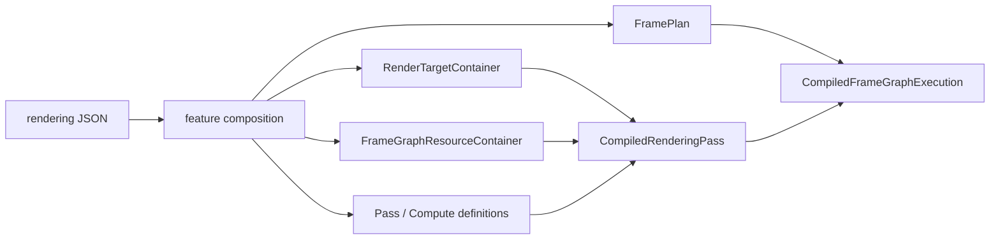
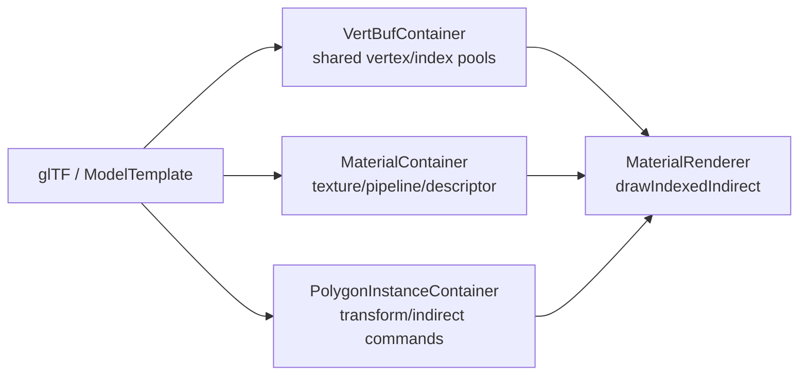

# 第6章 描画・Vulkan・Shader

[索引へ戻る](README.md) / [前章](05_gameplay_and_services.md) / [次章](07_tools_rpc_tests.md)

この章は、設定ファイルに書かれた「この順で、この画像へ描く」が、最終的に Vulkan のコマンドへ変換されるまでを追います。Pelican の描画層は、単純な `Renderer` 1 クラスではありません。次の5層に分けて読むと見通しがよくなります。

| 層 | 主な責務 | 入口 |
|---|---|---|
| 設定合成 | feature、target、pass、compute、graph を一つの定義へまとめる | [`registerRenderingPassConfigData()`](../../src/core/renderingpass/renderingpassconfigregistration.cpp#L133) |
| 計画 | read/write と明示依存から実行順、level、barrier を作る | [`planFrameGraph()`](../../src/core/renderingpass/frameplanner.cpp#L715) |
| runtime binding | 名前をコンパイル済み pass/task ID へ結び付ける | [`FrameGraphRuntimeContainer::registerExecutionPlan()`](../../src/core/renderingpass/framegraphruntime.cpp#L31) |
| pass dispatch | pass 種別を Material、Fullscreen、UI などの renderer へ振り分ける | [`renderDynamicPassDrawCalls()`](../../src/core/vkcore/render_pass_dispatch.cpp#L117) |
| Vulkan backend | device、frame target、image layout、pipeline、GPU resource を扱う | [`VulkanManageCore::VulkanManageCore()`](../../src/core/vkcore/core.cpp#L438) |

## 6.1 設定から1フレームの実行計画ができるまで

起点は [`loadDefaultRenderingPassFromConfig()`](../../src/core/vkcore/renderer_config.cpp#L124) です。`ProjectBasicConfig` が保持する rendering JSON と現在の出力サイズを使い、[`registerRenderingPassConfigData()`](../../src/core/renderingpass/renderingpassconfigregistration.cpp#L133) へ入ります。

### graph variant: flat、`#xr`、preview

現在の実体は [`loadRenderGraphVariantsFromConfig()`](../../src/core/vkcore/renderer_config.cpp#L128) です。flat 用の rendering pass に加え、XR active 時は同じ設定から suffix `#xr` 付きの rendering pass をもう一つ合成します。このとき **XR feature policy**([`openxrfeaturepolicy.hpp`](../../src/core/openxr/openxrfeaturepolicy.hpp))が XR で成立しない feature を除外し、除外名は `xr_excluded_features` として記録されます([renderer_config.cpp#L157](../../src/core/vkcore/renderer_config.cpp#L157))。`Renderer` は [`flat_rendering_pass_id` / `xr_rendering_pass_id`](../../src/core/vkcore/renderer.hpp#L53) を持ち、[`selectGraphVariant()`](../../src/core/vkcore/renderer.hpp#L84) で切り替えます。

WP172 で **第3の variant「preview」** が加わりました。同じ `loadRenderGraphVariantsFromConfig()` が起動時に [`precompilePreviewGraph()`](../../src/core/renderingpass/previewgraph.hpp#L27) も呼びます([renderer_config.cpp#L140](../../src/core/vkcore/renderer_config.cpp#L140))。ただし preview は他の 2 つとは**種類が違います**。ヘッダのコメントが規範です([previewgraph.hpp#L12-L14](../../src/core/renderingpass/previewgraph.hpp#L12))。

> A third, startup-compiled graph program.  Unlike flat/xr RenderingPassId it
> is data-only: render_preview executes it against request-local resources and
> therefore never enters Renderer::renderLogicalFrame.

つまり preview には `RenderingPassId` も `CompiledRenderingPass` もありません。[`PreviewGraphProgram`](../../src/core/renderingpass/previewgraph.hpp#L15) は `name` / `generation` / `pass_names` / `excluded_feature_names` / `composed_config` を持つだけの値です。feature 除外の判定は [`includeFeatureInPreviewGraph()`](../../src/core/renderingpass/previewgraph.hpp#L23)、設定検証は [`validatePreviewGraphConfig()`](../../src/core/renderingpass/previewgraph.hpp#L25) です。`Renderer` は [`preview_graph_program`](../../src/core/vkcore/renderer.hpp#L67) を保持し、[`previewGraphProgram()`](../../src/core/vkcore/renderer.hpp#L90) と [`previewIsolationStateJson()`](../../src/core/vkcore/renderer.cpp#L1060) で公開します。実行側は §6.19 を参照してください。

登録処理の順序には意味があります。

1. feature を基本設定へ合成する。
2. render target 定義を parse して、画像と view を作る。
3. frame graph buffer 定義を parse して、必要な buffer を作る。
4. target 名を ID、format、image view へ解決する resolver を作る。
5. render pass と compute task の純粋な定義を parse する。
6. shader、pipeline、descriptor を作り、runtime 用の `CompiledPass` / `CompiledComputeTask` にする。
7. frame graph を計画し、名前を実際の pass/task index に bind する。

実コードではこの順序が [`renderingpassconfigregistration.cpp` の一続きの処理](../../src/core/renderingpass/renderingpassconfigregistration.cpp#L133) になっています。先に target と buffer を作るのは、pass の format、descriptor image view、compute resource の存在確認に必要だからです。



### 定義と実行物を分ける理由

中心型は [`renderingpass.hpp`](../../src/core/renderingpass/renderingpass.hpp#L16) にまとまっています。

- `PassDefinition` は target、load/store、clear、pass 種別を持つ、Vulkan object を含まない定義です。
- `CompiledPass` は定義と、登録済み renderer object を指す `PassId` の組です。
- `ComputeTaskDefinition` は shader、reads/writes、dispatch、順序制約を持ちます。
- `CompiledComputeTask` は定義と `ComputeTaskId` の組です。
- `CompiledRenderingPass` は render pass 群と compute task 群の実行可能なまとまりです。

これにより JSON parse と Vulkan object 生成が分離され、planner は GPU object を知らずにテストできます。

### ID の3種類を混同しない

[`PELICAN_DEFINE_HANDLE`](../../src/core/handle.hpp#L21) により、整数を別々の型に包んでいます。

| 型 | 指すもの |
|---|---|
| `RenderingPassId` | 複数 node を含む描画設定全体 |
| `PassId` | Material や Fullscreen など、個別 renderer 内の登録物 |
| `GlobalRenderTargetId` | offscreen target。`-1` はなし、`-2` は swapchain |
| `ComputeTaskId` | `ComputeTaskContainer` 内の task |

特殊値の意味は [`renderingpass.hpp`](../../src/core/renderingpass/renderingpass.hpp#L22) に集約されています。整数値が同じでも型が違えば誤って渡せない、軽量な nominal typing です。

## 6.2 PassInfo: 継承ではなく `std::variant` で pass を表す

pass の種類は virtual class 階層ではなく、[`PassInfo`](../../src/core/renderingpass/renderingpass.hpp#L98) という `std::variant` です(全 8 種)。

| variant | 実際の仕事 |
|---|---|
| `MaterialPassInfo` | glTF 由来の material/mesh instance を indirect draw |
| `FullscreenPassInfo` | 全画面三角形で post-process、入力 target/buffer を読む |
| `DebugDrawPassInfo` | line geometry。physics collider の可視化もここへ投入 |
| `DebugTextPassInfo` | debug glyph の描画 |
| `ShadowDepthPassInfo` | depth-only の material draw |
| [`VelocityPassInfo`](../../src/core/renderingpass/renderingpass.hpp#L86) | TAA 用の screen-space velocity 描画。対応 renderer は [`velocitypasscontainer.hpp`](../../src/core/renderer/velocitypasscontainer.hpp) |
| `UiPassInfo` | UI container の内容を描画 |
| [`ImGuiPassInfo`](../../src/core/renderingpass/renderingpass.hpp#L95) | 開発者 UI(ImGui)。executor 内の分岐で処理(`PELICAN_WITH_IMGUI` 時のみ variant に含まれる) |

振り分けは [`renderDynamicPassDrawCalls()`](../../src/core/vkcore/render_pass_dispatch.cpp#L117) にあります。型を追加するときは、JSON parser、runtime compiler、dispatch の3か所を同時に増やす必要があります。variant なので「未知の派生型」が紛れず、compile 時に分岐漏れを見つけやすい一方、機能追加は open class hierarchy より明示的です。

## 6.3 Frame graph planner のアルゴリズム

frame graph node は `render` または `compute` で、名前、宣言順、`reads`、`writes`、`after`、`before` を持ちます。planner は [`planFrameGraph()`](../../src/core/renderingpass/frameplanner.cpp#L715) で次を行います。

1. node 名の一意性を検証する。
2. reads/writes が宣言済み target/buffer かを検証する。
3. 自動 data edge と明示 edge を作る。
4. 推移閉包を作り、複数 writer が順序付け済みか検証する。
5. 安定トポロジカルソートを行う。
6. node の level と、read-after-write barrier 情報を保存する。

### 自動で作られるのは「直前の writer → 後続 reader」

[`buildEdges()`](../../src/core/renderingpass/frameplanner.cpp#L487) は宣言順に node を走査し、resource ごとの `last_writer` を覚えます。reader が現れたら、その時点の直前 writer から reader へ RAW edge を張ります。

```text
A writes color
B reads  color   => A -> B が自動追加
C writes color   => 自動では B -> C や A -> C を追加しない
```

`after` と `before` は別途、明示 edge として追加されます。その後 [`addBarriersForOrderedResourceEdges()`](../../src/core/renderingpass/frameplanner.cpp#L474) が「順序 edge があり、from が書き、to が同じ resource を読む」組を barrier 情報へ変換します。

ここは重要です。現実装は一般的な hazard graph をすべて自動生成するわけではありません。

- RAW（write → read）: 直前 writer から自動 edge。
- WAW（write → write）: 自動 edgeなし。どちら向きか `after` / `before` などで明示しないと [`validateWritesAreOrdered()`](../../src/core/renderingpass/frameplanner.cpp#L545) が例外にします。
- WAR（read → write）: 自動 edgeなし。保存したい古い値がある場合は明示順序が必要です。

### 安定トポロジカルソート

依存がない node の順序はランダムではありません。[`topologicalOrder()`](../../src/core/renderingpass/frameplanner.cpp#L571) は ready set を `(declaration_index, node_index)` で並べ、設定に書いた順を tie-breaker にします。cycle なら全 node を取り出せないため例外になります。

### level は現在「診断情報」

[`computeLevels()`](../../src/core/renderingpass/frameplanner.cpp#L608) は依存段数を計算し、同 level の node を `FramePlan::levels` へ入れます。ただし実行側の [`executePlannedFrameGraph()`](../../src/core/vkcore/renderer.cpp#L574) は `frame_graph.nodes` を一本の loop で順番に実行します。したがって level は現在、plan の説明・検査、および将来の並列化余地を示す値であり、同 level が実際に並列実行されるわけではありません。

### 計画と実行 ID の結合

planner は名前しか知りません。[`FrameGraphRuntimeContainer::registerExecutionPlan()`](../../src/core/renderingpass/framegraphruntime.cpp#L31) が各 plan node の名前を `CompiledRenderingPass::passes` / `compute_tasks` から探し、実配列 index と incoming barrier を持つ `CompiledFrameGraphExecution` を作ります。実行時には plan と実行 node の name/kind がまだ一致しているかも [`executePlannedFrameGraph()` 冒頭](../../src/core/vkcore/renderer.cpp#L594) で再確認します。

なお現在の frame graph 定義には、history 付き render target の前フレーム面を読む入力(`history_read`、fixture は [`fixtures/frameplanner/plans/history_read.json`](../../test/fixtures/frameplanner/plans/history_read.json))と、`snapshot_copy` node(frameplanner.cpp#L160-L164)も入ります。

## 6.4 logical frame: `renderLogicalFrame()` と `render()` の1フレーム

WP128 で描画の中心は **logical frame** になりました。フレームグラフを GPU コマンドへ変換するのは [`Renderer::renderLogicalFrame()`](../../src/core/vkcore/renderer.cpp#L1238) で、flat 画面用の [`Renderer::render()`](../../src/core/vkcore/renderer.cpp#L1417) はその 1-view アダプタです。

```text
Renderer::render()                    … flat 用アダプタ(#L1417)
  -> selectGraphVariant(flat)
  -> FlatLogicalFrameTarget(RenderTarget を包む)
  -> renderLogicalFrame(target, view_count=1, view_provider=active Camera)

Renderer::renderLogicalFrame(target, view_count, view_provider)   (#L1238)
  once: DeletionQueue::beginFrame
  once: view 数変化 / timeSetRevision / camera discontinuityRevision の検知で temporal reset
  once: FrameResources.beginLogicalFrame(view_count)
  once: shader reload publication consume → fullscreen input rebind
  once: updateFrameLights(light_container)         … ライト setter の結果を GPU バッファへ
  target.beginLogicalFrame(view_count)
  for each view:
    target.beginView(view_index)     … FrameRenderContext(in_flight_frame_index 付き)
    view 0 のみ: resize 処理 + instance_container.triggerUpdate()
                 (object/skin/morph/material override の GPU 状態を凍結)
    view_provider(view_index, render_ctx) から view/projection/camera_position を取得
    projection jitter をサンプルし RenderFrameSnapshot を構築
    FrameResources.selectView(in_flight, view)   … FrameUBO slot = in_flight*view_count+view
    executeRenderingPasses(…)                    … frame graph node 実行
    XR variant の view 0 では mirror 中間コピーを記録
    target.endView(view_index)
  target.endLogicalFrame()
  once: RT history flip、instance temporal history advance、snapshot commit
```

view provider は **2 引数** です。実際の呼び出しは [renderer.cpp#L1339](../../src/core/vkcore/renderer.cpp#L1339) の `view_provider(view_index, render_ctx)` で、呼び出し側は [loop.cpp#L514-L517](../../src/core/appflow/loop.cpp#L514) のように第2引数の `const FrameRenderContext &` を無視することもできます。

logical frame には不変条件があり、破ると例外になります([renderer.cpp#L1322-L1337](../../src/core/vkcore/renderer.cpp#L1322))。

| 文言 | 条件 |
|---|---|
| `Renderer logical frame requires at least one view` | `view_count == 0`(#L1241) |
| `Renderer logical frame requires a view provider` | provider が空(#L1244) |
| `Renderer logical-frame views must share one in-flight frame index` | 全 view で in-flight index が同一(#L1324) |
| `Renderer logical-frame v1 requires equal per-view extents` | 全 view で extent が同一(#L1329) |
| `Renderer logical-frame target format does not match the compiled flat graph` | target color format が compile 済み graph と一致(#L1335) |

描画先の抽象は [`ILogicalFrameTarget`](../../src/core/vkcore/renderer.hpp#L33)(`beginLogicalFrame` / `beginView` / `endView` / `endLogicalFrame`)で、view ごとのパラメータは [`RenderViewParameters`](../../src/core/vkcore/renderer.hpp#L24) が運びます。`first_person_view` フラグは XR eye で VRM firstPerson ジオメトリを切り替えるためのものです。実装は flat が `FlatLogicalFrameTarget`(renderer.cpp 内部、`RenderTarget` を包む)、XR が [`OpenXr::XrCompositionTarget`](../../src/core/openxr/openxrcompositiontarget.hpp#L69)(`IXrCompositionTarget`(同 #L59)が `ILogicalFrameTarget` を継承)です。

各 node の実行は [`executePlannedFrameGraph()`](../../src/core/vkcore/renderer.cpp#L574) です。node ごとに以下をします。

1. incoming buffer barrier を発行する。
2. GPU timing が有効なら `barriers` subrange の timestamp を記録する([renderer.cpp#L628](../../src/core/vkcore/renderer.cpp#L628))。
3. render node なら `RenderPassExecutor::execute()`、compute node なら resource transition と `dispatch()` を呼ぶ。
4. `body` subrange の終了 timestamp を記録する([renderer.cpp#L777](../../src/core/vkcore/renderer.cpp#L777))。

`--gpu-labels` 有効時は 1〜4 全体が debug-utils のコマンドラベルで囲まれます(§6.16)。

`currentFramePlanJson()` と testing trace は [`Renderer` の診断用メソッド](../../src/core/vkcore/renderer.cpp#L1148) です。RPC の `get_frame_plan` やテストから、設定がどの順に解釈されたかを GPU debugger なしで確認できます。multi-view 時の execution trace は view ごとの配列形状になります。

## 6.5 Dynamic Rendering と pass 実行

[`RenderPassExecutor::execute()`](../../src/core/vkcore/render_pass_executor.cpp#L8) は次の順で動きます。

1. pass の入力 target を shader-read layout へ遷移する。
2. 出力 target を color/depth attachment layout へ遷移する。
3. attachment 情報を組み立てる。
4. `vkCmdBeginRendering` 相当の `beginRendering()` を呼ぶ。
5. viewport/scissor を動的設定する。
6. variant に応じた draw call を記録する。
7. `endRendering()` を呼ぶ。

つまり旧来の `VkRenderPass` / `VkFramebuffer` object を組み立てる方式ではなく、Vulkan Dynamic Rendering を使います。logical device 生成時にも [`vk::PhysicalDeviceDynamicRenderingFeatures` を有効化](../../src/core/vkcore/core.cpp#L336) しています。

UI pass だけは [`RenderPassExecutor` の特別分岐](../../src/core/vkcore/render_pass_executor.cpp#L20) で早期 return します。UI renderer 自身が rendering scope を管理するため、通常 pass と同じ `beginRendering()` を二重に呼ばないためです。同様に ImGui pass も [専用分岐](../../src/core/vkcore/render_pass_executor.cpp#L25) で処理されます。

### Material 描画のデータ経路

モデル描画は概ね次の所有分担です。



[`MaterialRenderer`](../../src/core/renderer/materialrender.cpp#L42) は material ごとに pipeline と descriptor を bind し、[`drawIndexedIndirect`](../../src/core/renderer/materialrender.cpp#L61) を発行します。GPU へ渡す geometry、material、instance transform を別 container に分けているため、「モデル1個 = Vulkan buffer 一式」にはなっていません。共通 vertex/index pool と material 単位の draw range を使う構成です。

skinning palette、morph weight、per-instance material override の GPU バッファも [`PolygonInstanceContainer`](../../src/core/renderer/polygoninstancecontainer.hpp#L223) が所有します。skin palette / morph weight には前フレーム分(previous バッファ)があり TAA velocity の入力になります。material override は per-frame history を持ちます(WP122/122b。golden: material_instance_override / material_absolute_override)。

## 6.6 Frame target: window と headless の共通インターフェース

[`IFrameTarget`](../../src/core/vkcore/frametarget.hpp#L20) が描画先の抽象インターフェースです。

```cpp
virtual FrameRenderContext render_begin() = 0;
virtual bool try_render_begin(FrameRenderContext &context) = 0;   // zero-wait。falseはフレームドロップ
virtual void recordOutputTransformCopy(vk::CommandBuffer cmd_buf, vk::Image source,
                                       vk::Format source_format, vk::Extent2D source_extent) = 0;
virtual void render_end() = 0;
virtual FrameTargetCaps caps() const = 0;
virtual bool consumeExtentChanged() = 0;
virtual std::vector<uint8_t> readbackLastFrameRGBA8() = 0;
```

`try_render_begin()` と `recordOutputTransformCopy()` は XR mirror sink(optional な描画先)のために追加されました。`try_render_begin()` の false は「今フレームは提出しない」であり、描画失敗として扱ってはいけません([frametarget.hpp#L24-L26](../../src/core/vkcore/frametarget.hpp#L24))。

[`RenderTarget`](../../src/core/vkcore/rendertarget.hpp#L26) がこの interface を所有し、[`createFrameTarget()`](../../src/core/vkcore/rendertarget.cpp#L15) で実装を選びます。

| 実装 | 用途 | 特徴 |
|---|---|---|
| [`SwapchainFrameTarget`](../../src/core/vkcore/swapchainframetarget.hpp#L19) | 通常 window | acquire、submit、present、resize/recreate。surface が TRANSFER_SRC を持てば CPU readback 可 |
| [`OffscreenFrameTarget`](../../src/core/vkcore/offscreenframetarget.hpp#L13) | `--headless` | offscreen color/depth、最後の RGBA8 を readback 可能 |

`FrameRenderContext` は command buffer、color/depth view、extent、待機 semaphore、最後に必要な image layout に加え、[`in_flight_frame_index`](../../src/core/vkcore/rendertarget.hpp#L21) を返します(logical frame の view 間整合チェックと FrameUBO slot 選択に使用)。frames-in-flight は [`in_flight_frames_num = 2`](../../src/core/vkcore/rendertarget.hpp#L24) です。

headless capture は [`RenderTarget::captureLastFrameToPng()`](../../src/core/vkcore/rendertarget.cpp#L66) が BGRA/RGBA を補正して PNG を書きます。swapchain 実装の [`readbackLastFrameRGBA8()`](../../src/core/vkcore/swapchainframetarget.cpp#L448) も、surface が TRANSFER_SRC を持てば windowed で readback を実装済みです。持たない場合のみ `capture unavailable_windowed` 例外になります。

## 6.7 Offscreen render target と layout tracker

frame target の color/depth と、frame graph 設定で宣言する offscreen target は別物です。後者は [`RenderTargetContainer`](../../src/core/renderingpass/rendertargetcontainer.hpp#L15) が、名前、format、固定/相対 extent、image、view を所有します。

window resize が検出されると [`handleFrameTargetResize()`](../../src/core/vkcore/renderer.cpp#L864) が次を行います。

- 相対サイズ target を再作成する。
- fullscreen pass の input descriptor を新しい image view へ rebind する。
- layout tracker を reset する。

画像 layout の現在値は [`RenderTargetLayoutTracker`](../../src/core/vkcore/render_target_layout_tracker.cpp#L65) が追います。キーは target ID 単体ではなく `(rt_id, surface_index)` の組で(#L72-L74)、**history 付き(double-buffered)target** の現/旧 surface を別々に追跡します。初見の surface は target の initial layout、同じ layout への遷移は何もしません。`-2` の swapchain target は特殊 ID なので tracker が無視し、`SwapchainFrameTarget` 側に管理を任せます。

layout transition は単なる状態ラベルではありません。[`makeTransitionInfo()`](../../src/core/vkcore/render_target_layout_tracker.cpp#L8) が old/new layout から pipeline stage と access mask を作ります。

| layout | 主な stage / access |
|---|---|
| shader-read | fragment shader / shader read |
| color attachment | color output / attachment read+write |
| depth attachment | early/late fragment tests / depth read+write |
| general | compute shader / shader read+write |
| transfer src/dst | transfer / transfer read・write(history copy、mirror copy 用。#L30-L37, #L52-L59) |

### 現在の image barrier の注意点

compute target は [`transitionResourcesForDispatch()`](../../src/core/renderingpass/computetask.cpp#L470) で `eGeneral` へ遷移します。しかし tracker は old layout と new layout が同じなら [`transition()` から早期 return](../../src/core/vkcore/render_target_layout_tracker.cpp#L76) します。また frame graph の明示 RAW barrier 実装は [`bufferReadAfterWriteBarrier()`](../../src/core/renderingpass/computetask.cpp#L501) で、buffer でなければ return します。

したがって調査時点では、同じ storage image を `GENERAL` のまま連続 compute task で write → read する場合、graph 上の順序は付きますが、その依存専用の image memory barrier は発行されません。layout が変わる compute → render などとは事情が違います。これは「設定に edge を書けば全 resource の同期も完全」という意味ではない、現在実装上の制約です。

## 6.8 Compute task

compute の JSON は [`parseComputeTaskDefinitionsFromConfigJson()`](../../src/core/renderingpass/computetask.cpp#L248) で次へ変換されます。

- `shader`: extensionless stem
- `reads`, `writes`: buffer または concrete render target の名前
- `after`, `before`: 明示順序
- `dispatch.groups`: x/y/z group 数
- `schedule`: 現在は `per_frame` のみ

descriptor は shader reflection の set 1、すなわち `PELICAN_SET_PASS_INPUT` だけを読み、binding 順に構築します。[`resourceForBinding()`](../../src/core/renderingpass/computetask.cpp#L103) の対応規則は次の優先順です。

1. reflection された binding 名と宣言 resource 名が一致すれば、その resource。
2. resource が1個だけなら、それを使用。
3. それ以外は binding の順番と resource 配列の順番を対応。

buffer は storage buffer、render target は storage image でなければ [`createDescriptorSet()`](../../src/core/renderingpass/computetask.cpp#L340) が例外にします。task 実行は graphics frame の command buffer 上で pipeline と set 1 を bind し、[`dispatch()`](../../src/core/renderingpass/computetask.cpp#L486) を記録します。

### buffer 宣言の実装済み範囲

[`FrameGraphResourceContainer::registerBuffers()`](../../src/core/renderingpass/computetask.cpp#L287) は `size > 0` の buffer を一度だけ device local memory に確保します。

- 文字列だけ、または size 0 の宣言は graph の既知名にはなりますが、実 buffer を確保しません。
- `lifetime: persistent|transient` は [`parseFrameGraphBufferDefinitionsFromJson()`](../../src/core/renderingpass/computetask.cpp#L199) で読みますが、登録側は調査時点で `persistent` を参照していません。transient の frame 単位 recycle は未実装です。
- `groups_from` と `local_size` も parse されますが、[`registerComputeTask()`](../../src/core/renderingpass/computetask.cpp#L407) が保存する group 数は `groups_x/y/z` だけです。自動 group 数導出は現在つながっていません。
- 実行後に group 数を変える API は [`setDispatchGroups()`](../../src/core/renderingpass/computetask.cpp#L449) です。

設定 schema に項目があることと、runtime behavior が完成していることを区別して読む必要があります。

## 6.9 Shader reference、compile、reflection

### extensionless stem

project rendering config では shader を `foo/bar` のような stem で指定します。[`makeShaderReference()`](../../src/core/shader/shaderreference.cpp#L51) は `.vert`、`.frag`、`.comp`、`.spv` などが明記されていると例外にします。

stage に応じた候補は次です。

- vertex: `stem.vert` / `stem.vert.spv`
- fragment: `stem.frag` / `stem.frag.spv`
- compute: `stem.comp` / `stem.comp.spv`

runtime shader compiler が有効なら source を先に、次に SPIR-V を試します。無効なら SPIR-V だけです。候補選択は [`ShaderLibrary::loadFromStemReference()`](../../src/core/shader/shaderlibrary.cpp#L356) で確認できます。

このほか `.surface` ファイルは [`surfacecompiler`](../../src/core/shader/surfacecompiler.hpp) で GLSL/SPIR-V 化されて pipeline へつながり(WP116/117)、オフラインの SPIR-V linking は [`spvlink.hpp`](../../src/core/shader/spvlink.hpp) と `spvlink` CLI が担います。feature の scalar params は shader define へ変換され(WP114)、compile 結果は shader cache に載ります(`shader_cache_test`)。

### `ShaderBundle`

[`ShaderBundle`](../../src/core/shader/shaderlibrary.hpp#L28) は次をひとまとめにします。

- `vk::UniqueShaderModule`
- `ShaderReflection`
- source path
- compile define 群
- version
- 最後の compile log

source compile は [`ShaderCompiler`](../../src/core/shader/shadercompiler.hpp#L27)、SPIR-V 解析は SPIRV-Reflect を使う [`reflect()`](../../src/core/shader/shaderreflection.cpp#L58) が担当します。reflection で取得するものは descriptor set/binding/type/count/name、push constant range、vertex input、compute local size です。

vertex と fragment の reflection は [`merge()`](../../src/core/shader/shaderreflection.cpp#L145) で統合します。同じ set/binding の型または配列数が違う、push constant の offset/size が違う場合は pipeline 作成前に例外になります。

### descriptor set と push constant の契約

エンジンと shader の予約規約は [`pelican_sets.hpp`](../../src/core/shader/pelican_sets.hpp#L7) です。

| set | 定数 | 用途 |
|---:|---|---|
| 0 | `PELICAN_SET_FRAME` | camera/light など frame 共通データ |
| 1 | `PELICAN_SET_PASS_INPUT` | fullscreen 入力、compute resource |
| 2 | `PELICAN_SET_MATERIAL` | material texture/data |
| 3 | `PELICAN_SET_FREE` | 自由枠 |

set の意味は執筆時点から不変ですが、binding 定数は増えています([pelican_sets.hpp#L12-L26](../../src/core/shader/pelican_sets.hpp#L12)): `FRAME_UBO=0` / `OBJECT_BUFFER=1` / `LIGHT_UBO=2` / `PREVIOUS_OBJECT_BUFFER=3`(TAA velocity 用)/ `MATERIAL_BUFFER=6` のほか、skin palette、morph 系、material instance override 系の binding があります。

push constant は engine 64 bytes + shader 64 bytes、合計128 bytesを契約値としています。実際の pipeline layout は reflection された range から [`createPipelineLayout()`](../../src/core/shader/pipelinefactory.cpp#L264) が作ります。

### define と SPIR-V

compile define は source compile 時にしか適用できません。engine resource が SPIR-V なのに define があれば [`loadResolvedReference()`](../../src/core/shader/shaderlibrary.cpp#L325) が拒否します。feature composition が shader define を足す構成では runtime compiler を有効にするか、define ごとの SPIR-V variant を別 resource として用意する必要があります。

## 6.10 PipelineFactory と hot reload

[`PipelineFactory`](../../src/core/shader/pipelinefactory.hpp#L59) は graphics/compute pipeline を作り、handle で保持します。

graphics pipeline 作成は次の順です。

1. shader bundle の reflection を merge。
2. set ごとの descriptor layout key を作る。
3. 同じ binding signature の descriptor set layout を cache から再利用。
4. reflection から pipeline layout を作る。
5. target format を `vk::PipelineRenderingCreateInfo` に入れ、Dynamic Rendering pipeline を作る。

実装は [`buildGraphicsPipeline()`](../../src/core/shader/pipelinefactory.cpp#L379) と [`createGraphicsPipeline()`](../../src/core/shader/pipelinefactory.cpp#L271) です。また driver pipeline cache を executable 隣の `pipeline_cache.bin` から読み書きします。保存は [`PipelineFactory::~PipelineFactory()`](../../src/core/shader/pipelinefactory.cpp#L237) から呼ばれます。

hot reload の流れは次です。

```text
FileWatcher / ContentDigest (frame start)
  -> ReloadService::applyRequests()          // 同フレームの変更をbatch化
  -> ShaderLibrary::prepareReload()
      -> root/include/.surface reverse dependencyを解決
      -> 影響する全variantをcompile/reflectするがlive bundleは未変更
  -> PipelineFactory::rebuildPrepared()
      -> 依存pipelineを全てcandidate構築
      -> 必要なら.surface + .material.jsonのlayout/valuesもprepare
      -> 全成功時だけbundle/pipeline/materialを一括publish
      -> 失敗時はcandidateだけ破棄し旧世代を維持
Renderer::render() (render start)
  -> publish通知をconsumeしfullscreen input descriptorをrebind
```

shader candidate は [`ShaderLibrary::prepareReload()`](../../src/core/shader/shaderlibrary.cpp#L593)、group-wide な pipeline publish は [`PipelineFactory::rebuildPrepared()`](../../src/core/shader/pipelinefactory.cpp#L492) が担当します。material peer の準備は [`MaterialContainer::prepareSurfaceMaterialReload()`](../../src/core/material/materialcontainer.hpp#L190) が担います。compile error、pipeline 作成失敗、material peer の検証失敗のいずれでも、最後に成功した世代を残します。cache hit/miss と追跡中の unit/bundle/dependency 数は `get_status.reload.runtime.pelican.shaders.details` から確認できます。

`engine://` の埋め込み source/SPIR-V は物理 `AssetKey` を持たないため自動 reload 対象外です。project/mounted-store 上の GLSL、SPIR-V、`.surface` は FileWatcher の対象です。

## 6.11 GPU resource の遅延破棄

Vulkan object は C++ の所有権上不要になっても、前の frame の command buffer が GPU 上で参照中かもしれません。即時 destructor は use-after-free になります。

Pelican の [`DeletionQueueCore`](../../src/core/vkcore/deletionqueue.hpp#L16) は、任意の movable resource を型消去した `DeferredResource<T>` に包み、「何 frame 目に defer されたか」とともに保存します。各 frame 冒頭の [`beginFrame()`](../../src/core/vkcore/deletionqueue.cpp#L56) で2 frames-in-flight 分古くなった resource を release します。

hot reload で入れ替えた古い pipeline/layout は [`PipelineFactory::replacePipeline()`](../../src/core/shader/pipelinefactory.cpp#L450) がこの queue へ渡します。終了時に pending が残っていれば、destructor は `device.waitIdle()` 後に safety flush します。

teardown 経路では **受け入れ停止** が入りました。`DeletionQueueCore` は [`accepting` / `draining`](../../src/core/vkcore/deletionqueue.hpp#L40) を持ち、`defer()` の先頭で [`requireAccepting()`](../../src/core/vkcore/deletionqueue.hpp#L44) を呼びます。[`drainForTeardown()`](../../src/core/vkcore/deletionqueue.hpp#L65) 後の `defer()` はエラーです。詳細は [第9章](09_black_magic_and_gotchas.md) を参照してください。

これが描画層で最も重要な寿命ルールです。

```text
CPU:  old pipelineを置換 ---- defer -------- 2 frame経過 ---- destroy
GPU:           frame N が参照 ----- 完了 -----|
```

## 6.12 Vulkan 初期化と resource wrapper

[`VulkanManageCore`](../../src/core/vkcore/core.hpp#L25) が instance、physical device、logical device、queues、command pools、VMA allocator を所有します。constructor は [`core.cpp#L438`](../../src/core/vkcore/core.cpp#L438) です。

- Vulkan API version は [`1.3.283`](../../src/core/vkcore/core.cpp#L21)。
- `_DEBUG` では validation layer と synchronization validation を有効化します。
- window mode のみ surface と swapchain extension を要求します。
- 起動時に [`selectDebugUtilsExtension(launch_config.gpu_labels, supportedInstanceExtensions())`](../../src/core/vkcore/core.cpp#L442) を評価し、有効なときだけ `VK_EXT_debug_utils` を instance extension へ足します(flat: [core.cpp#L52](../../src/core/vkcore/core.cpp#L52)、XR: [#L87](../../src/core/vkcore/core.cpp#L87))。詳細は §6.16。
- physical device は `multiDrawIndirect` が必須です。
- logical device では `multiDrawIndirect`、`shaderDrawParameters`、`dynamicRendering` を有効化します。
- graphics、presentation、compute queue family を [`pickQueues()`](../../src/core/vkcore/core.cpp#L141) で選び、それぞれの queue を取得します。
- graphics と compute command pool を別に作ります。
- device 生成後に [`debug_utils = DebugUtilsDispatch::resolve(instance, device, selection)`](../../src/core/vkcore/core.cpp#L470)。取得は [`getDebugUtils()`](../../src/core/vkcore/core.hpp#L53) です。
- XR active 時は [`bootstrap.hpp`](../../src/core/vkcore/bootstrap.hpp) 経由で、OpenXR runtime の graphics requirements に従って instance/device を生成する経路が加わりました(core.cpp には flat/XR 用の 2 つの app_info があります)。

[`VulkanManageCore::setCurrentFrameIndex(logical_frame)`](../../src/core/vkcore/core.hpp#L55) は毎フレーム `engine_time.advance()` の直後に呼ばれ(第2章 §2.4)、**debug-utils ラベルと GPU timing に共通の論理フレーム軸**を与えます。

buffer/image memory は VMA を使います。[`BufferWrapper`](../../src/core/vkcore/buf.hpp#L7) と [`ImageWrapper`](../../src/core/vkcore/image.hpp#L7) が Vulkan resource と VMA allocation を同じ struct に持ち、RAII で一緒に解放します。

調査時点の compute task は独立 compute submission ではなく、[`FrameRenderContext::cmd_buf`](../../src/core/vkcore/rendertarget.hpp#L16) へ dispatch を記録します。この command buffer は [`allocCmdBufs()`](../../src/core/vkcore/core.cpp#L526) が graphics pool/queue 用に作るものです。したがって frame graph compute は async compute pipeline ではなく、graphics queue 上の直列 compute と理解するのが正確です。

## 6.13 描画を変更するときの実践的な追い方

### 新しい render pass 種別を増やす

1. [`PassInfo`](../../src/core/renderingpass/renderingpass.hpp#L98) に info struct を追加。
2. [`passinfojsonparser.cpp`](../../src/core/renderingpass/passinfojsonparser.cpp) 周辺で JSON を parse。
3. [`renderingpassruntimecompiler.cpp`](../../src/core/renderingpass/renderingpassruntimecompiler.cpp#L330) で shader/pipeline/renderer resource を登録。
4. [`render_pass_dispatch.cpp`](../../src/core/vkcore/render_pass_dispatch.cpp#L117) で draw call を dispatch。
5. pure parser test、runtime registration test、headless render test を追加。

### 新しい compute resource を増やす

1. planner の resource declaration/known-resource 検証を拡張。
2. descriptor reflection type と resource object の対応を [`createDescriptorSet()`](../../src/core/renderingpass/computetask.cpp#L340) へ追加。
3. resource ごとの正しい access/stage barrier を実装。
4. resize、hot reload、teardown 時の寿命を定義。

### 画面が真っ黒なときの読む順

1. [`currentFramePlanJson()`](../../src/core/vkcore/renderer.cpp#L1148) で node 順と reads/writes を確認。
2. [`RenderPassExecutor::execute()`](../../src/core/vkcore/render_pass_executor.cpp#L8) で target layout と attachment を確認。
3. [`renderDynamicPassDrawCalls()`](../../src/core/vkcore/render_pass_dispatch.cpp#L117) で意図した variant に入ったか確認。
4. shader bundle の `log` と reflection を確認。
5. `_DEBUG` の synchronization validation を有効にして barrier/layout error を確認。
6. `--gpu-labels` を付けて RenderDoc の event ツリーを見る、または `get_status.gpu_timing` の node 行を見る(§6.16、§6.17)。
7. headless capture と golden test で出力を固定して比較。

## 6.14 Projection jitter と TAA(WP112〜115)

temporal 系の中心型は [`projectionjitter.hpp`](../../src/core/renderer/projectionjitter.hpp) にあります。

- [`ProjectionJitterSettings`](../../src/core/renderer/projectionjitter.hpp#L10): projection 行列へ加えるサブピクセルジッタの設定。ユーザー定義のジッタ系列も宣言できます(WP115。fixture: [`fixtures/projection_jitter_consumers.json`](../../test/fixtures/projection_jitter_consumers.json))。
- [`RenderFrameSnapshot`](../../src/core/renderer/projectionjitter.hpp#L29) / [`TemporalFrameHistory`](../../src/core/renderer/projectionjitter.hpp#L52): 現フレームの view/projection/jitter と前フレーム値の組。view ごとに 1 history を持ち、`buildRenderFrameSnapshot()` → 描画 → `commitRenderFrameSnapshot()` の順で回します。
- velocity pass(`VelocityPassInfo` + [`velocitypasscontainer.hpp`](../../src/core/renderer/velocitypasscontainer.hpp))が screen-space velocity を書き、previous object buffer(`PELICAN_PREVIOUS_OBJECT_BUFFER_BINDING`)と合わせて TAA resolve の入力になります。

temporal history のリセットは `renderLogicalFrame()` 内で次のトリガから起きます: view 数変化([renderer.cpp#L1268](../../src/core/vkcore/renderer.cpp#L1268))、`set_time` 等による `timeSetRevision` の不連続と camera の `discontinuityRevision`([#L1285-L1292](../../src/core/vkcore/renderer.cpp#L1285))、extent 変化(resize、[#L1313-L1316](../../src/core/vkcore/renderer.cpp#L1313))、graph variant 切替([`selectGraphVariant()`](../../src/core/vkcore/renderer.cpp#L1192))。明示リセット用の公開 API は [`Renderer::resetTemporalHistory()`](../../src/core/vkcore/renderer.cpp#L1184) です。

テスト: [`temporal_test.cpp`](../../test/temporal_test.cpp)、[`taa_resolve_test.cpp`](../../test/taa_resolve_test.cpp)。

## 6.15 XR composition と mirror(WP125〜133)

OpenXR 統合(`src/core/openxr/`、独立 static lib `pelican_openxr`)は描画層へ次の形で接続します。

| 部品 | 役割 |
|---|---|
| [`OpenXr::DiscoveryRuntime`](../../src/core/openxr/openxrdiscovery.hpp#L34) | instance/system の discovery。Vulkan bootstrap(graphics requirements)と連携 |
| [`OpenXr::SessionRuntime`](../../src/core/openxr/openxrsession.hpp#L88) | session 状態機械。`waitFrame`/`beginFrame` と [`XrDisplayTiming`](../../src/core/openxr/openxrsession.hpp#L21)、[`XrLocatedViews`](../../src/core/openxr/openxrsession.hpp#L36) |
| [`OpenXr::XrCompositionTarget`](../../src/core/openxr/openxrcompositiontarget.hpp#L69) | XR swapchain を `ILogicalFrameTarget` として公開(`IXrCompositionTarget` 同 #L59) |
| [`OpenXr::XrMirrorSink`](../../src/core/openxr/openxrmirrorsink.hpp#L24) | window への mirror 表示。`try_render_begin()` による zero-wait で、間に合わなければ drop 可 |
| [`buildRenderViewParameters()`](../../src/core/openxr/openxrviewspace.hpp#L37) | 両 eye の pose/fov を active camera に anchor した `RenderViewParameters` へ変換(WP131) |
| [`openxrfeaturepolicy.hpp`](../../src/core/openxr/openxrfeaturepolicy.hpp) | `#xr` graph variant 合成時の feature 除外。除外名は `xr_excluded_features`([renderer_config.cpp#L157](../../src/core/vkcore/renderer_config.cpp#L157)) |

フレームの流れは第 2 章の「windowed + XR session running」経路のとおりで、`renderLogicalFrame(target, 2 views)` に `XrCompositionTarget` を渡し、view 0 の描画後に mirror 用の中間コピーを記録して、logical frame の外で mirror sink が `tryPresent` します。

テスト: `xractivation_test` / `xrdiscovery_test` / `xrsession_test` / `xraction_test` / `xrviewspace_test` / `xrcompositiontarget_test` / `xrfeaturepolicy_test`(GPU なしで検証するための [`synthetic_stereo_target.hpp`](../../test/synthetic_stereo_target.hpp))、process integration は [`run_vrm_xr_demo_rpc.cmake`](../../test/run_vrm_xr_demo_rpc.cmake)。

## 6.16 Vulkan debug utils ラベル ✅実装済み(WP139 / D-P0a)

`VK_EXT_debug_utils` を使い、Vulkan object へ名前を、command buffer へスコープラベルを付けます。**既定では無効**で、起動オプション `--gpu-labels`([`EngineLaunchConfig::gpu_labels`](../../src/core/launchconfig.hpp#L45))で有効化します。

選択は [`selectDebugUtilsExtension(requested, supported)`](../../src/core/vkcore/debugutils.hpp#L21) が [`DebugUtilsExtensionSelection{requested, available, enabled, reason}`](../../src/core/vkcore/debugutils.hpp#L14) を返す形です。既定の reason は `"disabled_by_launch_option"` なので、`get_status` を見れば「拡張が無いのか、オプションを付け忘れたのか」が区別できます。

[`DebugUtilsDispatch`](../../src/core/vkcore/debugutils.hpp#L41) が実際の関数ポインタを持ちます。すべて `noexcept` で、無効時は何もしません。

| 種別 | メソッド |
|---|---|
| コマンドラベル | `beginCommandLabel` / `endCommandLabel` |
| queue ラベル | `beginQueueLabel` / `endQueueLabel` |
| object 名 | `nameImage` / `nameImageView` / `nameSwapchain` / `nameBuffer` / `nameDescriptorSet` |

RAII ラッパは [`ScopedCommandDebugLabel`](../../src/core/vkcore/debugutils.hpp#L73) です。

### ラベル文字列は仕様

[`makeFrameGraphDebugLabel()`](../../src/core/vkcore/debugutils.hpp#L95)(実装は [debugutils.cpp#L162](../../src/core/vkcore/debugutils.cpp#L162))が次の形を作ります。

```text
frame/<logical_frame>/graph/<variant>/view/<view_index>/node/<ordinal>:<kind>:<name>
```

各 node はさらに `barriers` と `body` の 2 つの子ラベルへ分割されます。これを行うのは [`executePlannedFrameGraph()`](../../src/core/vkcore/renderer.cpp#L574) が node ごとに直接作る 3 つの [`ScopedCommandDebugLabel`](../../src/core/vkcore/debugutils.hpp#L73)(node / `barriers` / `body`。[renderer.cpp#L602-L631](../../src/core/vkcore/renderer.cpp#L602))で、render node と compute node は同じ loop 内のこの 1 か所を共有します。テンプレート [`recordDebugLabeledNode()`](../../src/core/vkcore/debugutils.hpp#L97) は同じ規約をテストから検証するためのもので、`renderer.cpp` からは呼ばれません([test/debugutils_test.cpp#L94](../../test/debugutils_test.cpp#L94))。XR mirror の中間コピーだけは別地点でラベル付けされます([renderer.cpp#L916](../../src/core/vkcore/renderer.cpp#L916))。

> **設計決定:** このラベル文字列は「見やすさのためのおまけ」ではなく **診断識別子の正規形** です。GPU timing のサンプル名も同じ関数から派生するため(§6.17)、RenderDoc の event ツリーと `get_status.gpu_timing` の行を文字列一致で突き合わせられます。ラベル形式を変えるときは両方の契約を同時に変えることになります。

状態は RPC の `get_status.debug_utils` に `{available, enabled, reason, capabilities{object_name, command_label, queue_label}}` として載ります([第7章](07_tools_rpc_tests.md))。テストは [`test/debugutils_test.cpp`](../../test/debugutils_test.cpp) です。

## 6.17 Stereo-safe GPU timing と VRAM 診断 ✅実装済み(WP143 / D-P2a、WP145 / D-P2b)

### GPU timing

[`rendertiming.hpp`](../../src/core/vkcore/rendertiming.hpp) の識別子が **view ごとに分離** されたのが WP143 の要点です。stereo(XR)では同じ node が 2 回記録されますが、`view_index` が識別子に入っているため左右の時間が混ざりません。

| 型 | 内容 |
|---|---|
| [`GpuTimingSubrange`](../../src/core/vkcore/rendertiming.hpp#L25) | `barriers` / `body` |
| [`GpuTimingRangeIdentity`](../../src/core/vkcore/rendertiming.hpp#L33) | `logical_frame` + `graph_variant` + `view_index` |
| [`GpuTimingSampleIdentity`](../../src/core/vkcore/rendertiming.hpp#L42) | 上記 + `node_ordinal` / `node_kind` / `node_name` / `subrange` |
| [`GpuTimingViewRow`](../../src/core/vkcore/rendertiming.hpp#L54) / [`GpuTimingNodeRow`](../../src/core/vkcore/rendertiming.hpp#L64) | 集計出力の行 |

履歴容量は [`gpu_timing_history_capacity = 120`](../../src/core/vkcore/rendertiming.hpp#L17) です。

[`makeGpuTimingSampleLabel()`](../../src/core/vkcore/rendertiming.hpp#L75) は `makeFrameGraphDebugLabel()` の結果へ `/barriers` または `/body` を足すだけです([rendertiming.cpp#L75](../../src/core/vkcore/rendertiming.cpp#L75))。つまり **RenderDoc のラベルと GPU timing のサンプル名は同一命名規約** です。

帰属の規範は [`gpuTimingAttributionContractJson()`](../../src/core/vkcore/rendertiming.hpp#L79)(無効時は [`disabledGpuTimingStatusJson()`](../../src/core/vkcore/rendertiming.hpp#L80))が JSON として出します。`barriers` は「compile 済み incoming barrier」、`body` は「node 自身の image/resource transition と描画・dispatch」です。

fixture は [`test/fixtures/gpu_timing_attribution.json`](../../test/fixtures/gpu_timing_attribution.json)、テストは [`test/rendertiming_test.cpp`](../../test/rendertiming_test.cpp) と [`test/golden_timing_test.cpp`](../../test/golden_timing_test.cpp) です。

### メモリ診断

[`collectMemoryStatus(vulkan, geometry, materials)`](../../src/core/vkcore/memorydiagnostics.hpp#L46) と [`memoryStatusJson(status)`](../../src/core/vkcore/memorydiagnostics.hpp#L49) が2系統を返します。

- [`DriverMemoryStatus`](../../src/core/vkcore/memorydiagnostics.hpp#L24): driver heap ごとの `size` / `usage` / `budget`。取得できない環境では `available=false` と `reason` を返します。
- [`EngineMemoryCategoryStatus`](../../src/core/vkcore/memorydiagnostics.hpp#L30): engine 側カテゴリごとの `allocated` / `logical_used` / `free` / `high_water` / `object_count`。値が無い項目は `std::optional` が空のままで、代わりに `reason` が入ります。

> **設計決定:** 「取れなかった値を 0 で埋めない」のがこの API の要点です。0 と「測定不能」を JSON 上で区別できるので、`get_status.memory` を見る側が誤った回帰判定をしません。

テストは [`test/memorydiagnostics_test.cpp`](../../test/memorydiagnostics_test.cpp) です。

## 6.18 RenderDoc in-app capture 🚧受動統合のみ(WP140 / D-P1a)

[`DECLARE_MODULE(RenderDocCapture)`](../../src/core/renderdoc/renderdoccapture.hpp#L66) が F11 キーと RPC `capture_gpu` の両方から使われるキャプチャ状態機械です。

> **設計決定:** エンジンは **RenderDoc をロードしません**。すでにプロセスへ注入されている API テーブルを [`RenderDocApiTable`](../../src/core/renderdoc/renderdoccapture.hpp#L32) として観測するだけです。したがって「RenderDoc から起動したときにだけ使える」機能で、エンジン単体で capture を始めることはできません。

| 要素 | 内容 |
|---|---|
| 状態 | [`RenderDocCaptureState`](../../src/core/renderdoc/renderdoccapture.hpp#L15): `unavailable` / `idle` / `armed` / `capturing` / `completing` / `failed` |
| 発生源 | [`RenderDocCaptureSource`](../../src/core/renderdoc/renderdoccapture.hpp#L24): `f11` / `rpc` |
| API | `request(source, xr_active)` / `captureArmedFrame(frame_index, device, window, render_once)` / `status()` / `beginShutdown()` |
| エラー | [`RenderDocCaptureError`](../../src/core/renderdoc/renderdoccapture.hpp#L58)(`reason()` 付き) |

ビルドフラグ `PELICAN_WITH_RENDERDOC` が OFF のときは [`renderdoccapture_stub.cpp`](../../src/core/renderdoc/renderdoccapture_stub.cpp) が使われ、状態は常に `unavailable` です。

`renderDocDevicePointerFromVulkanInstance()`([#L98](../../src/core/renderdoc/renderdoccapture.hpp#L98))のコメントが規範です。

> RenderDoc's Vulkan API expects the dispatch-table pointer stored in a
> VkInstance, not the VkInstance handle itself.

### フレームループ側の接続

- モジュール解決は `Renderer` が Vulkan instance を作る**前**です([loop.cpp#L157](../../src/core/appflow/loop.cpp#L157))。
- F11 の arm は [`requestF11CaptureIfNeeded()`](../../src/core/appflow/loop.cpp#L290)、呼び出しは interactive state 更新の末尾([loop.cpp#L465](../../src/core/appflow/loop.cpp#L465))です。
- 実キャプチャは **flat 描画のみ** [`renderFlatFrameWithOptionalCapture()`](../../src/core/appflow/loop.cpp#L300)(呼び出しは [#L550](../../src/core/appflow/loop.cpp#L550))で、`armed` のときだけ `StartFrameCapture` / `EndFrameCapture` を明示発行します。失敗しても **論理フレームは必ず1回だけ描画されます**(二重描画しないガード付き)。
- 終了時は `finishLoopResources()` の先頭で `beginShutdown()`([loop.cpp#L279](../../src/core/appflow/loop.cpp#L279))。

テストは [`test/renderdoccapture_test.cpp`](../../test/renderdoccapture_test.cpp)(`PELICAN_WITH_RENDERDOC` 時のみ)です。

## 6.19 preview 実行系(`PreviewExecutor`) 🚧模式ラスタ(WP172)

§6.1 で触れた第3 variant の実行側が [`PreviewExecutor::execute(program, projection, request, engine_time)`](../../src/core/vkcore/previewexecutor.hpp#L63) です。編集 RPC の `render_preview` から呼ばれます([第7章](07_tools_rpc_tests.md))。

> **設計決定:** 現在の `PreviewExecutor` は **Vulkan を一切使わない CPU 模式ラスタライザ** です([`previewexecutor.cpp`](../../src/core/vkcore/previewexecutor.cpp))。背景のグラデーション+グリッドを描き、投影後の各オブジェクト位置へ小さな円と十字マーカーを置くだけで、色は `light` / `camera` / `collider` component の有無で選びます。material も mesh も shader も評価しません。WP172 が確立したのは「preview がライブ描画状態を汚さない」という**隔離契約**であって、見た目の忠実度ではありません。`render_preview` の出力を最終描画の代用と見なさないでください。

| 要素 | 内容 |
|---|---|
| リクエスト | [`PreviewCaptureRequest`](../../src/core/vkcore/previewexecutor.hpp#L25): `width` / `height` / `pixel_encoding` / `view` / `projection` / `graph_generation` / `max_bytes` / `preview_request_id` |
| 出力形式 | [`PreviewPixelEncoding`](../../src/core/vkcore/previewexecutor.hpp#L14): `rgba8_srgb` または `png`(PNG エンコーダも自前実装、zlib stored ブロック) |
| 結果 | [`PreviewCaptureResult`](../../src/core/vkcore/previewexecutor.hpp#L36): bytes と `timing` 診断 JSON |
| 上限 | [`preview_capture_max_dimension = 2048`](../../src/core/vkcore/previewexecutor.hpp#L54) / [`preview_capture_hard_max_bytes = 16 MiB`](../../src/core/vkcore/previewexecutor.hpp#L55)。超過は [`PreviewCaptureTooLarge`](../../src/core/vkcore/previewexecutor.hpp#L44) |
| 世代検証 | `request.graph_generation != program.generation` なら `std::invalid_argument("preview graph generation mismatch")` |

隔離の証明が [`previewStateInventory()`](../../src/core/vkcore/previewexecutor.hpp#L59) です。コメントが規範です。

> Literal WP172 ownership inventory.  The order is part of the diagnostic
> contract and is deliberately shared by RPC, tests, and the design report.

12 行の各エントリが `request-local` / `explicitly suppressed` / `read-only` のいずれかに分類され、DeletionQueue、RenderTargetContainer history、`PolygonInstanceContainer` の前フレーム状態、`Renderer` の temporal history、swapchain / XR mirror などが **明示的に抑止されている** ことを列挙します。`Renderer` 側の対応は [`previewIsolationStateJson()`](../../src/core/vkcore/renderer.cpp#L1060) です。

---

描画層は object 数が多いですが、境界は一貫しています。JSON は「定義」、planner は「順序」、runtime compiler は「GPU object」、executor は「コマンド記録」、frame target は「提出先と同期」を担当します。
