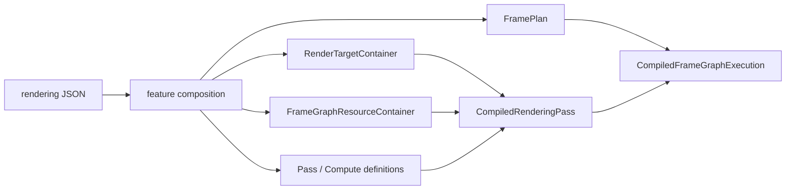
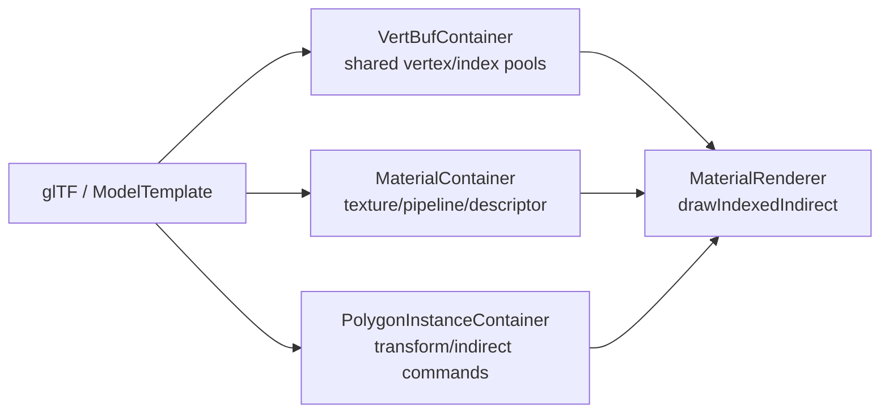

# 第6章 描画・Vulkan・Shader

[索引へ戻る](README.md) / [前章](05_gameplay_and_services.md) / [次章](07_tools_rpc_tests.md)

この章は、設定ファイルに書かれた「この順で、この画像へ描く」が、最終的に Vulkan のコマンドへ変換されるまでを追います。Pelican の描画層は、単純な `Renderer` 1 クラスではありません。次の5層に分けて読むと見通しがよくなります。

| 層 | 主な責務 | 入口 |
|---|---|---|
| 設定合成 | feature、target、pass、compute、graph を一つの定義へまとめる | [`registerRenderingPassConfigData()`](../../src/core/renderingpass/renderingpassconfigregistration.cpp#L133) |
| 計画 | read/write と明示依存から実行順、level、barrier を作る | [`planFrameGraph()`](../../src/core/renderingpass/frameplanner.cpp#L715) |
| runtime binding | 名前をコンパイル済み pass/task ID へ結び付ける | [`FrameGraphRuntimeContainer::registerExecutionPlan()`](../../src/core/renderingpass/framegraphruntime.cpp#L31) |
| pass dispatch | pass 種別を Material、Fullscreen、UI などの renderer へ振り分ける | [`renderDynamicPassDrawCalls()`](../../src/core/vkcore/render_pass_dispatch.cpp#L117) |
| Vulkan backend | device、frame target、image layout、pipeline、GPU resource を扱う | [`VulkanManageCore::VulkanManageCore()`](../../src/core/vkcore/core.cpp#L438) |

## 6.1 設定から1フレームの実行計画ができるまで

起点は [`loadDefaultRenderingPassFromConfig()`](../../src/core/vkcore/renderer_config.cpp#L124) です。`ProjectBasicConfig` が保持する rendering JSON と現在の出力サイズを使い、[`registerRenderingPassConfigData()`](../../src/core/renderingpass/renderingpassconfigregistration.cpp#L133) へ入ります。

### graph variant: flat、`#xr`、preview

現在の実体は [`loadRenderGraphVariantsFromConfig()`](../../src/core/vkcore/renderer_config.cpp#L128) です。flat 用の rendering pass に加え、XR active 時は同じ設定から suffix `#xr` 付きの rendering pass をもう一つ合成します。このとき **XR feature policy**([`openxrfeaturepolicy.hpp`](../../src/core/openxr/openxrfeaturepolicy.hpp))が XR で成立しない feature を除外し、除外名は `xr_excluded_features` として記録されます([renderer_config.cpp#L157](../../src/core/vkcore/renderer_config.cpp#L157))。`Renderer` は [`flat_rendering_pass_id` / `xr_rendering_pass_id`](../../src/core/vkcore/renderer.hpp#L53) を持ち、[`selectGraphVariant()`](../../src/core/vkcore/renderer.hpp#L84) で切り替えます。

WP172 で **第3の variant「preview」** が加わりました。同じ `loadRenderGraphVariantsFromConfig()` が起動時に [`precompilePreviewGraph()`](../../src/core/renderingpass/previewgraph.hpp#L27) も呼びます([renderer_config.cpp#L140](../../src/core/vkcore/renderer_config.cpp#L140))。ただし preview は他の 2 つとは**種類が違います**。ヘッダのコメントが規範です([previewgraph.hpp#L12-L14](../../src/core/renderingpass/previewgraph.hpp#L12))。

> A third, startup-compiled graph program.  Unlike flat/xr RenderingPassId it
> is data-only: render_preview executes it against request-local resources and
> therefore never enters Renderer::renderLogicalFrame.

つまり preview には `RenderingPassId` も `CompiledRenderingPass` もありません。[`PreviewGraphProgram`](../../src/core/renderingpass/previewgraph.hpp#L15) は `name` / `generation` / `pass_names` / `excluded_feature_names` / `composed_config` を持つだけの値です。feature 除外の判定は [`includeFeatureInPreviewGraph()`](../../src/core/renderingpass/previewgraph.hpp#L23)、設定検証は [`validatePreviewGraphConfig()`](../../src/core/renderingpass/previewgraph.hpp#L25) です。`Renderer` は [`preview_graph_program`](../../src/core/vkcore/renderer.hpp#L67) を保持し、[`previewGraphProgram()`](../../src/core/vkcore/renderer.hpp#L90) と [`previewIsolationStateJson()`](../../src/core/vkcore/renderer.cpp#L1060) で公開します。実行側は §6.19 を参照してください。

> 🧩 **難所 — preview 除外は 1 語差**([`unsafeDirectPassSurface()`](../../src/core/renderingpass/previewgraph.cpp#L31) / [`validatePreviewGraphConfig()`](../../src/core/renderingpass/previewgraph.cpp#L136))
>
> **何をする所か**: preview graph から時間依存(TAA / velocity / jitter)・UI・mirror・present を含むものを部分文字列一致で締め出し、base graph の正規終端 pass だけを残します。
>
> **素朴に読むと**: マーカー配列が 2 つあり、**違いは `"present"` の有無だけ**です(8 個 vs 7 個)。[`unsafeName()`](../../src/core/renderingpass/previewgraph.cpp#L21)(8 個)が掛かるのは feature 名・feature の render target 名に加えて **feature が宣言した pass の `name` / `type` / `insert`** で([`declaresUnsafeFeatureSurface()`](../../src/core/renderingpass/previewgraph.cpp#L44) 経由、previewgraph.cpp#L60-L62)、`unsafeDirectPassSurface()`(7 個)が掛かるのは**合成後 config の pass 名/型だけ**です([previewgraph.cpp#L172-L173](../../src/core/renderingpass/previewgraph.cpp#L172))。つまり feature 由来の pass 名は `present` を含む厳しい側で落とされ、緩い側は合成後の pass にしか適用されません。正規パイプラインの終端は慣習的に `present` を含む名前なので、合成後の pass 側だけ緩めてあります。片方に揃えて「重複を整理」すると、preview が終端 pass ごと落ちて何も描かないか、present 系 feature を通してしまうかのどちらかに倒れます。除外が **feature 単位で原子的**なのも意図で、合成後に pass を削ると insert anchor が宙に浮いて composer の依存/anchor 検証が無意味になるからです。副作用として、除外された feature は `hdr_enabled` の判定にも `projection_jitter` provider の登録にも参加しません(`composeRenderFeatureConfig()` の feature ループが判定前に `continue` する)。**feature を 1 つ外すと canonical パイプラインの形ごと変わります**。
>
> **骨子**:
> ```text
> unsafeName              = {taa, velocity, motion_vector, projection_jitter, ui, imgui, mirror, present}
> unsafeDirectPassSurface = {taa, velocity, motion_vector, projection_jitter, ui, imgui, mirror}
>                                                                                  └ present が無い
> retained_terminal = 出力が preview_capture|display && 名前が "present" で終わる
>                     && "mirror" も "ui" も含まない
> ```
>
> **手がかり**: [`precompilePreviewGraph()`](../../src/core/renderingpass/previewgraph.cpp#L184) の 3 行(compose → `redirectSwapchainToRequestLocalCapture()` → validate)は順序が仕様です。先に `swapchain` を `preview_capture` へ書き換えるからこそ `retained_terminal` が成立しえます。`generationOf()` が **FNV-1a**(Fowler–Noll–Vo ハッシュの 1a 版 — 1 バイトごとに「XOR してから固定の素数を掛ける」を繰り返すだけの非暗号学的ハッシュ。依存ライブラリなしで数行で書けるので、設定が変わったかどうかの判定に使われます)を **53 bit にマスクし、0 なら 1 に繰り上げる**のは、JSON の number(double)で正確に表せる上限と「program 無し」の予約値のためで、飾りではありません。テストは [`editorpreview_test.cpp`](../../test/editorpreview_test.cpp)。
>
> **不変条件**: 2 つのマーカー配列の差分は意図的です。片方を編集したらもう片方の意味を明文化してください。除外は `include_feature` コールバック経由で行い(composer の検証を残す)、合成後の削除に置き換えないこと。

登録処理の順序には意味があります。

1. feature を基本設定へ合成する。
2. render target 定義を parse して、画像と view を作る。
3. frame graph buffer 定義を parse して、必要な buffer を作る。
4. target 名を ID、format、image view へ解決する resolver を作る。
5. render pass と compute task の純粋な定義を parse する。
6. shader、pipeline、descriptor を作り、runtime 用の `CompiledPass` / `CompiledComputeTask` にする。
7. frame graph を計画し、名前を実際の pass/task index に bind する。

実コードではこの順序が [`renderingpassconfigregistration.cpp` の一続きの処理](../../src/core/renderingpass/renderingpassconfigregistration.cpp#L133) になっています。先に target と buffer を作るのは、pass の format、descriptor image view、compute resource の存在確認に必要だからです。

> 🧩 **難所 — canonical bucket の番兵**([`canonicalBucket()`](../../src/project/featurecompose.cpp#L252) / [`canonicalizePasses()`](../../src/project/featurecompose.cpp#L402))
>
> **何をする所か**: 手順 1 の中身です。base 設定の pass を 8 つの canonical anchor(`sprite` / `post_main` / `tonemap` / `post_ldr` / `pelican_ui` / `debug_draw` / `debug_text` / `imgui`)の区画へ振り分け、`__anchor_*` node と終端 `output_transform` を実体化した 1 本の配列に組み直します。
>
> **素朴に読むと**: 戻り値が `size_t` で、**`canonical_anchors.size()`(= 8)が「どの anchor にも属さない = scene pass」の番兵**になっています。配列外の値をわざと返す関数だと気づかないと読めません。振り分け規則も「型」「明示 `canonical_anchor` フィールド」「マジックネーム(`lighting_pass` / `HighLuminanceExtraction` / `HorizontalBlur_*` …)」「出力先」の 4 系統混在です。さらに同じ authored pass が **HDR の有無で別区画に落ちます**(`hdr_enabled ? 1 : 3`)。HDR では [`prepareHdrSceneOutput()`](../../src/project/featurecompose.cpp#L304) が先に scene 終端の出力を `swapchain` → `scene_ldr_in` へ書き換えるので、`passWritesSwapchain()` という**同じ述語が違う pass を指す**ようになります。
>
> **骨子**:
> ```text
> 最終配列 = [scene passes...]
>            __anchor_sprite [b0]  __anchor_post_main  [b1]   ← HDR 時の bloom
>            __anchor_tonemap [b2] __anchor_post_ldr   [b3]   ← 非 HDR 時の終端
>            __anchor_pelican_ui [b4] __anchor_debug_draw [b5]
>            __anchor_debug_text [b6] __anchor_imgui [b7]
>            output_transform      ← display を読み swapchain へ書く
> ```
>
> **手がかり**: bucket に掛かるのは **base 設定の pass だけ**です。feature の pass はこの後で `insertPassByAnchor()` が置くので bucket を通りません(「なぜ `hdr_tonemap` が bucket に出てこないのか」で詰まる所)。[`retargetSwapchainAliases()`](../../src/project/featurecompose.cpp#L441) は `output_transform` **以外**の pass の `swapchain` を `display` に置換するので、合成後に `swapchain` を書くのは終端だけになります。テストは [`featurecompose_test.cpp`](../../test/featurecompose_test.cpp) の "canonical color pipeline is composed even without features"。
>
> **不変条件**: pass 名 `output_transform` と `__anchor_` 接頭辞、render target 名 `display` は予約語です(衝突は例外)。

> 🧩 **難所 — anchor 挿入と暗黙 after**([`insertPassByAnchor()`](../../src/project/featurecompose.cpp#L1352) / [`enforceCanonicalOrder()`](../../src/project/featurecompose.cpp#L361))
>
> **何をする所か**: feature が書いた `insert: "before:X" / "after:X" / "end"` を配列上の実位置へ解決し、合成の最後に配列順から `after` edge を機械的に生やして、planner が読む明示依存へ落とします。
>
> **素朴に読むと**: `after:<canonical anchor>` は **anchor node の直後には入りません**。次の `canonical_anchor` か `output_transform` に当たるまで index を進めるので、意味は「その区画の**末尾**」です。素朴に `index + 1` で挿入すると、同じ anchor へ複数の feature が刺さったとき後勝ちで順序が反転します(`before:` 側は前進しない非対称)。しかも付く依存は物理的な前後ではなく **anchor node 名**(`__anchor_tonemap`)なので、位置と依存を別々に追わないと最終順序が読めません。`enforceCanonicalOrder()` の暗黙連鎖には逃げ道があり、直前 pass への `after` を足す前に [`hasExplicitRelation()`](../../src/project/featurecompose.cpp#L356) を**両方向**で確認します。これが無いと `before: X` を書いた feature pass に `after: X` が機械的に足されて閉路になり、planner が "Cycle detected" で落ちます。
>
> **骨子**:
> ```text
> insertPassByAnchor("after:tonemap", pass):
>   index = __anchor_tonemap の位置 + 1
>   canonical_anchor なら: 次の anchor / output_transform まで ++index
>   pass["after"] += "__anchor_tonemap";  passes.insert(index, pass)
> enforceCanonicalOrder(passes):     # 合成の最後に、配列順で 1 パス
>   通常 pass: after += 直前 anchor;  明示関係が無ければ after += 直前 pass
> ```
>
> **手がかり**: [`findAnchorMatches()`](../../src/project/featurecompose.cpp#L1297) は 2 段構えで、第 1 段が `type == "canonical_anchor"` かつ `anchor` フィールド一致、ヒット 0 のときだけ第 2 段で**任意の pass 名**を見ます(`shadow_directional.json` の `before:lighting_pass`、`taa.json` の `after:taa_resolve` が第 2 段)。複数一致は例外です。`last_active_pass` は配列要素への生ポインタで、`appendAfter()` が要素の中身しか変えないから有効です。ここに `passes.insert` を足すと即ダングリングします。
>
> **不変条件**: anchor 解決は「canonical 優先、無ければ pass 名」の順を保つこと(逆にすると feature pass 名が canonical anchor を隠します)。`hasExplicitRelation()` の両方向チェックを削らないこと。

> 🧩 **難所 — format_class が format を上書き**([`resolveRenderTargetFormatClassesV2()`](../../src/core/renderingpass/rendertargetjsonparser.cpp#L52))
>
> **何をする所か**: 手順 1 と 2 のちょうど間で走ります。render target 宣言の `format_class`(`scene` / `display` / `data` / `explicit(...)`)を HDR の有無と frame target の実サイズから実フォーマットへ解決する、カノニカルなカラーパイプラインの唯一の決定点です。
>
> **素朴に読むと**: JSON に `"format": "B8G8R8A8_UNORM"` と書いてあるのに **採用されない**ことがあります。`scene` と `display` では `target["format"]` が**無条件に上書き**され、authored 値は捨てられます(残るのは `data` と `explicit(...)` だけ)。実例として、HDR 有効時に `prepareHdrSceneOutput()` が足す `scene_ldr_in` は `B8G8R8A8_UNORM` と書かれていますが `format_class: "scene"` なので `R16G16B16A16_SFLOAT` に化けます — **名前(`ldr`)も authored format も嘘になります**。もう 1 つの地雷は、この関数が `frame_target_format` を引数に取りながら**本体で一度も参照していない**ことです。呼び出し側は `getSwapchainFormat()` を渡していますが `display` は常に `B8G8R8A8_SRGB` 固定で、swapchain 側が UNORM に落ちた差は終端の shader fallback が吸収します。「引数が使われていないのはバグでは?」で止まらないでください。
>
> **骨子**:
> ```text
> scene pass ──linear──> [display: B8G8R8A8_SRGB]  ← HW が OETF + 8bit 量子化
>                             │ sample = HW が EOTF(→ linear)
>                             v  output_transform.frag
>                     swapchain が SRGB → そのまま / UNORM → shader が linearToSrgb()
> ```
>
> **手がかり**: つまり **linear → 8bit sRGB → linear → 8bit sRGB** の往復が 1 回入ります(骨子の **OETF / EOTF** は opto-electronic / electro-optical transfer function の略で、前者は linear 値を sRGB のガンマ曲線へ載せる符号化、後者は符号化された値を linear へ戻す復号です。sRGB フォーマットの image へ書く / から読むと、どちらもハードウェアが自動で掛けます)。[`color_pipeline_test.cpp`](../../test/color_pipeline_test.cpp) が hardware 経路と shader fallback 経路の差を **±1 LSB**(least significant bit — 最下位ビット 1 つぶん、つまり 8 bit なら 256 階調で 1 段の差)で許容しているのはこのためで、「無駄だから `display` を UNORM に」と最適化すると中間段の量子化が linear 空間になり暗部が壊れます。`format_class` 省略時の推論 [`inferFormatClass()`](../../src/project/featurecompose.cpp#L202) は **名前の部分一致**(`normal` / `depth` / `shadow` / `ssao` / `worldpos` / `material` を含めば `data`)という素朴な規則なので、target 名を変えると色空間が変わりえます。
>
> **不変条件**: `scene` / `display` の実フォーマットを決めるのはこの関数だけです。authored `format` に意味を持たせないこと。中間の `display` は sRGB エンコード済み 8 bit のまま(linear 8 bit にしない)。



### 定義と実行物を分ける理由

中心型は [`renderingpass.hpp`](../../src/core/renderingpass/renderingpass.hpp#L16) にまとまっています。

- `PassDefinition` は target、load/store、clear、pass 種別を持つ、Vulkan object を含まない定義です。
- `CompiledPass` は定義と、登録済み renderer object を指す `PassId` の組です。
- `ComputeTaskDefinition` は shader、reads/writes、dispatch、順序制約を持ちます。
- `CompiledComputeTask` は定義と `ComputeTaskId` の組です。
- `CompiledRenderingPass` は render pass 群と compute task 群の実行可能なまとまりです。

これにより JSON parse と Vulkan object 生成が分離され、planner は GPU object を知らずにテストできます。

### ID の3種類を混同しない

[`PELICAN_DEFINE_HANDLE`](../../src/core/handle.hpp#L21) により、整数を別々の型に包んでいます。

| 型 | 指すもの |
|---|---|
| `RenderingPassId` | 複数 node を含む描画設定全体 |
| `PassId` | Material や Fullscreen など、個別 renderer 内の登録物 |
| `GlobalRenderTargetId` | offscreen target。`-1` はなし、`-2` は swapchain |
| `ComputeTaskId` | `ComputeTaskContainer` 内の task |

特殊値の意味は [`renderingpass.hpp`](../../src/core/renderingpass/renderingpass.hpp#L22) に集約されています。整数値が同じでも型が違えば誤って渡せない、軽量な nominal typing です。

## 6.2 PassInfo: 継承ではなく `std::variant` で pass を表す

pass の種類は virtual class 階層ではなく、[`PassInfo`](../../src/core/renderingpass/renderingpass.hpp#L98) という `std::variant` です(全 8 種)。

| variant | 実際の仕事 |
|---|---|
| `MaterialPassInfo` | glTF 由来の material/mesh instance を indirect draw |
| `FullscreenPassInfo` | 全画面三角形で post-process、入力 target/buffer を読む |
| `DebugDrawPassInfo` | line geometry。physics collider の可視化もここへ投入 |
| `DebugTextPassInfo` | debug glyph の描画 |
| `ShadowDepthPassInfo` | depth-only の material draw |
| [`VelocityPassInfo`](../../src/core/renderingpass/renderingpass.hpp#L86) | TAA 用の screen-space velocity 描画。対応 renderer は [`velocitypasscontainer.hpp`](../../src/core/renderer/velocitypasscontainer.hpp) |
| `UiPassInfo` | UI container の内容を描画 |
| [`ImGuiPassInfo`](../../src/core/renderingpass/renderingpass.hpp#L95) | 開発者 UI(ImGui)。executor 内の分岐で処理(`PELICAN_WITH_IMGUI` 時のみ variant に含まれる) |

振り分けは [`renderDynamicPassDrawCalls()`](../../src/core/vkcore/render_pass_dispatch.cpp#L117) にあります。型を追加するときは、JSON parser、runtime compiler、dispatch の3か所を同時に増やす必要があります。variant なので「未知の派生型」が紛れず、compile 時に分岐漏れを見つけやすい一方、機能追加は open class hierarchy より明示的です。

## 6.3 Frame graph planner のアルゴリズム

frame graph node は `render` または `compute` で、名前、宣言順、`reads`、`writes`、`after`、`before` を持ちます。planner は [`planFrameGraph()`](../../src/core/renderingpass/frameplanner.cpp#L715) で次を行います。

1. node 名の一意性を検証する。
2. reads/writes が宣言済み target/buffer かを検証する。
3. 自動 data edge と明示 edge を作る。
4. 推移閉包を作り、複数 writer が順序付け済みか検証する。
5. 安定トポロジカルソート(**トポロジカルソート** — 有向グラフのすべての辺 a→b について a が b より前に来るように頂点を一列に並べる操作。ここでは「依存先が必ず先に実行される」node 順を作ります。「安定」は、依存関係で順序が決まらない組を宣言順で一意に決めるという意味です)を行う。
6. node の level と、read-after-write barrier 情報を保存する。

### 自動で作られるのは「直前の writer → 後続 reader」

[`buildEdges()`](../../src/core/renderingpass/frameplanner.cpp#L487) は宣言順に node を走査し、resource ごとの `last_writer` を覚えます。reader が現れたら、その時点の直前 writer から reader へ RAW edge を張ります。

```text
A writes color
B reads  color   => A -> B が自動追加
C writes color   => 自動では B -> C や A -> C を追加しない
```

`after` と `before` は別途、明示 edge として追加されます。その後 [`addBarriersForOrderedResourceEdges()`](../../src/core/renderingpass/frameplanner.cpp#L474) が「順序 edge があり、from が書き、to が同じ resource を読む」組を barrier 情報へ変換します。

ここは重要です。現実装は一般的な hazard graph(hazard = 同じ resource に対する読み書きの組のうち、順序が入れ替わると結果が変わってしまうもの。下の 3 種です)をすべて自動生成するわけではありません。

- RAW（write → read）: 直前 writer から自動 edge。
- WAW（write → write）: 自動 edgeなし。どちら向きか `after` / `before` などで明示しないと [`validateWritesAreOrdered()`](../../src/core/renderingpass/frameplanner.cpp#L545) が例外にします。
- WAR（read → write）: 自動 edgeなし。保存したい古い値がある場合は明示順序が必要です。

> 🧩 **難所 — writes-writes の曖昧検出**([`transitiveClosure()`](../../src/core/renderingpass/frameplanner.cpp#L530) / [`validateWritesAreOrdered()`](../../src/core/renderingpass/frameplanner.cpp#L545))
>
> **何をする所か**: 同じ resource に 2 つ以上の node が書くとき、どちらが先か決まっているかを plan 生成時に検査します。
>
> **素朴に読むと**: `transitiveClosure()` は 3 重ループだけの関数で、変数名もコメントもアルゴリズム名を明かしません。実体は **Floyd–Warshall 法**(フロイド・ウォーシャル法 — グラフの全頂点対について「経由してもよい中継点」を 1 つずつ増やしながら到達可否を更新していく古典的な動的計画法。ここでは距離ではなく到達できるか否かだけを求める「推移閉包」版です)で、正しさの根拠は「**中継点 `k` のループが最外であること**」ただ 1 点です。`k` を内側へ動かすと閉包が不完全になりますが、**多くのグラフでは正しい答えが出てしまう**ため、テストをすり抜けた瞬間に「WAW を検出しないまま plan が通る」という静かな壊れ方をします。実害は、同じ RT に書く 2 パスの順序が tie-break(= JSON の記述順)任せになること — 設定を並べ替えただけで絵が変わります。planner は WAW/WAR の edge を自動生成しないので、**この検査だけが最後の砦**です。
>
> **骨子**:
> ```text
> for k in nodes:           # ← 最外が k。ここが命
>   for i, j: reach[i][j] |= reach[i][k] && reach[k][j]
> for 各 resource の writer ペア (a,b):
>   if !reach(a,b) && !reach(b,a): throw "Ambiguous writes-writes dependency"
> ```
>
> **手がかり**: 閉路があると両方向とも到達可能になり、この検査は**通ってしまいます**。閉路は後段の `topologicalOrder()` が "Cycle detected in frame graph" で捕まえるので、エラー文言の優先順位はこの呼び出し順で決まります。テストは [`frameplanner_test.cpp`](../../test/frameplanner_test.cpp) の invalid fixture 一覧。
>
> **不変条件**: `transitiveClosure()` に渡すのは**直接 edge の行列だけ**(barrier 由来のものを混ぜない)。検査は topological sort より前に置く。

> 🧩 **難所 — barrier は後追いで作る**([`buildEdges()`](../../src/core/renderingpass/frameplanner.cpp#L487) / [`addBarriersForOrderedResourceEdges()`](../../src/core/renderingpass/frameplanner.cpp#L474))
>
> **何をする所か**: resource ごとの「直前の writer → 後続 reader」から自動 edge と RAW barrier を作り、そのあとで **すべての順序 edge**(`after` / `before` 由来を含む)を走査して、from が書き to が読む resource に barrier を足します。
>
> **素朴に読むと**: 罠が 3 つ重なっています。第一に `addBarriersForOrderedResourceEdges()` は `for (const auto &edge : planner_edges.edges)` と、**要素を追加しうる関数を呼びながら同じ vector を range-for しています**。安全なのは偶然ではなく、走査対象がすでに `exists[from][to] == true` の edge だけなので `addEdge()` の `push_back` に到達しないからです。ここに「新しい edge を張る」処理を足すと、その場で iterator 無効化 → UB になります。第二に、だからこそ [`addDataEdge()`](../../src/core/renderingpass/frameplanner.cpp#L453) の barrier 重複チェックが要ります(自動 RAW edge は `buildEdges` で 1 度積まれ、同じ組がここでもう 1 度来る)。第三に barrier は plan 上の順序を前提にした index へ落ちるので、登録時([framegraphruntime.cpp#L80](../../src/core/renderingpass/framegraphruntime.cpp#L80))と毎フレーム実行時([renderer.cpp#L618](../../src/core/vkcore/renderer.cpp#L618))で **同じ不変条件を二重チェック**します。
>
> **骨子**:
> ```text
> buildEdges:
>   for node in 宣言順:
>     reads:  last_writer[r] があれば addDataEdge(last_writer[r] → node, r)
>     writes: last_writer[w] = node
>   after / before を addEdge で明示 edge に
>   addBarriersForOrderedResourceEdges:   # after/before 由来の edge もここで barrier 化
> ```
>
> **手がかり**: `last_writer` は **宣言順**の直前 writer であって、topological sort 後の直前 writer ではありません。JSON を並べ替えると自動 edge の張られ方が変わります。テストは [`frameplanner_test.cpp`](../../test/frameplanner_test.cpp) の "frame planner emits barriers for explicit compute to render resource edges"。
>
> **不変条件**: `edges` を走査しながら `addEdge` を呼ぶ経路を増やさないこと(増やすなら index ループへ書き換える)。barrier の `kind` は `"read_after_write"` のみで、他は登録時に例外になります。

### 安定トポロジカルソート

依存がない node の順序はランダムではありません。[`topologicalOrder()`](../../src/core/renderingpass/frameplanner.cpp#L571) は ready set を `(declaration_index, node_index)` で並べ、設定に書いた順を tie-breaker にします。cycle なら全 node を取り出せないため例外になります。

> 🧩 **難所 — 決定性は set のキー**([`topologicalOrder()`](../../src/core/renderingpass/frameplanner.cpp#L571))
>
> **何をする所か**: 入次数 0 の node 集合から実行順を確定させます。
>
> **素朴に読むと**: ready 集合が `std::queue` ではなく **`std::set<std::pair<size_t, size_t>>`** で、first が `declaration_index`、second が node index です。set の順序がそのまま「設定に書いた順」の tie-break になっており、**決定性はこのキー設計そのもの**です。queue や stack に替えると、依存のない node の順序が edge 挿入順に依存し、frame plan JSON・GPU timing の node ordinal・debug label 文字列といった golden が環境ごとにぶれます。動くけれど再現しない、という壊れ方をします。
>
> **骨子**:
> ```text
> ready = {(declaration_index, i) | indegree[i] == 0}   # 決定的な優先度付きキュー
> while ready: 最小を取り出し order へ → 後続の indegree を減らし 0 なら ready へ
> order.size() != count → "Cycle detected in frame graph"
> ```
>
> **手がかり**: `const auto [unused_index, node_index] = *ready.begin(); (void)unused_index;` は、構造化束縛の**個々の名前**には属性を付けられない(宣言全体への `[[maybe_unused]]` は C++17 から可能ですが、名前ごとの属性は C++26 の P0609R3 から)ため、片方だけを未使用と印付けできないことへの回避で、それ以上の意味はありません。
>
> **不変条件**: `declaration_index` は passes と compute_tasks を通した**通し番号**です。pass 単位でリセットすると tie-break が壊れます。

### level は現在「診断情報」

[`computeLevels()`](../../src/core/renderingpass/frameplanner.cpp#L608) は依存段数を計算し、同 level の node を `FramePlan::levels` へ入れます。ただし実行側の [`executePlannedFrameGraph()`](../../src/core/vkcore/renderer.cpp#L574) は `frame_graph.nodes` を一本の loop で順番に実行します。したがって level は現在、plan の説明・検査、および将来の並列化余地を示す値であり、同 level が実際に並列実行されるわけではありません。

> 🧩 **難所 — level は order で回す**([`computeLevels()`](../../src/core/renderingpass/frameplanner.cpp#L608))
>
> **何をする所か**: 各 node の依存段数(= 最長経路長)を求めます。
>
> **素朴に読むと**: 一見「全 edge を走査して max を取るだけ」ですが、**外側を `order`(topological order)で回していることが正しさの条件**です。node index 順に回すと、まだ確定していない前段の level を読んで過小評価します。しかも DAG(directed acyclic graph — 閉路のない有向グラフ。frame graph は必ずこの形です)の形によっては正しい値が出るため、壊しても気づきにくい種類のバグになります。level は BFS の段数ではなく最長経路長で、`levels[to] = max(levels[to], levels[from] + 1)` を全 edge について取ります。計算量は O(V·E)(node ごとに edge 配列を全走査)なので、「なぜ隣接リストを使わないのか」を疑う前に node 数(数十)を確認してください。
>
> **骨子**:
> ```text
> for node in order:                    # ← index 順ではなく order でなければならない
>   for edge where edge.to == node: levels[node] = max(levels[node], levels[edge.from] + 1)
> ```
>
> **手がかり**: `plan.levels` は `plan.nodes` の順、すなわち実行順で詰められるので、同 level 内の並びも決定的です。実行側は level を見ずに一本の loop で回します。
>
> **不変条件**: `computeLevels()` に渡すのは `topologicalOrder()` の戻り値であること。

### 計画と実行 ID の結合

planner は名前しか知りません。[`FrameGraphRuntimeContainer::registerExecutionPlan()`](../../src/core/renderingpass/framegraphruntime.cpp#L31) が各 plan node の名前を `CompiledRenderingPass::passes` / `compute_tasks` から探し、実配列 index と incoming barrier を持つ `CompiledFrameGraphExecution` を作ります。実行時には plan と実行 node の name/kind がまだ一致しているかも [`executePlannedFrameGraph()` 冒頭](../../src/core/vkcore/renderer.cpp#L594) で再確認します。

なお現在の frame graph 定義には、history 付き render target の前フレーム面を読む入力(`history_read`、fixture は [`fixtures/frameplanner/plans/history_read.json`](../../test/fixtures/frameplanner/plans/history_read.json))と、`snapshot_copy` node(frameplanner.cpp#L160-L164)も入ります。

> 🧩 **難所 — `@history` は edge を作らない**([`splitHistoryReads()`](../../src/core/renderingpass/frameplanner.cpp#L91) / [`RenderTargetContainer::surfaceIndex()`](../../src/core/renderingpass/rendertargetcontainer.cpp#L230))
>
> **何をする所か**: 入力名の `@history` サフィックスを剥がし、`reads` ではなく `reads_history` に入れます。`buildEdges()` は `reads_history` を一切見ないので、history 読みは edge も barrier も生みません。
>
> **素朴に読むと**: 「読んでいるのに依存が無い」は planner だけを見ていると不整合にしか見えません。理由は物理層にあります。history 付き target は画像を 2 枚持ち、`surfaceIndex()` が `history_frame_index`(毎フレーム `^= 1`)で現在面と旧面を切り替えます。つまり `X@history` が読むのは、このフレームに書かれる `X` とは **別の VkImage** であり、フレーム内 hazard が存在しません。素朴に「`reads` へ混ぜる」修正をすると、宣言順で**先行する writer がいる**構成で偽の RAW edge が生え、実際には触っていない側の image を指す resource 名ベースの barrier まで付きます(fixture の TAA 構成には `temporal_accum` の先行 writer がいないので edge は 0 本 — 症状が出ないぶん見落としやすい所です)。なお **self dependency にはなりません**: `buildEdges()` は 1 node 分の `reads` を先に処理してから、その node の `writes` を `last_writer` へ記録します([frameplanner.cpp#L493-L505](../../src/core/renderingpass/frameplanner.cpp#L493))。同じ resource を read かつ write しても `last_writer[X] == i` にならないからで、現に `color_load_op: "load"` の pass は自分の output を `reads` と `writes` の両方に持ったまま plan が通ります([frameplanner.cpp#L372-L379](../../src/core/renderingpass/frameplanner.cpp#L372))。
>
> **骨子**:
> ```text
> frame N:                 images[0]      images[1]
>   write X          →  surfaceIndex(false) = h
>   read  X@history  →  surfaceIndex(true)  = h^1    ← 別イメージ。edge 不要
> advanceHistoryFrame(): history_frame_index ^= 1    (logical frame の最後)
> ```
>
> **手がかり**: layout tracker のキーが `(rt_id.value << 1) | surface` で、**論理 target ではなく物理面ごとに layout を持つ**(§6.7)ため、現在面と旧面が別 layout でも矛盾しません。history 付き target の `initialLayout()` が `eShaderReadOnlyOptimal` なのは、初回フレームでも読めるよう作成時にクリア済みという前提です。テストは [`frameplanner_test.cpp`](../../test/frameplanner_test.cpp) の "history reads are serialized without an intra-frame dependency"(barrier に `temporal_accum` が出ないことを明示的に要求)。
>
> **不変条件**: `reads` と `reads_history` は別配列のまま保ち、edge 生成は `reads` のみ。extent 再生成や history reset のあとは `layout_tracker.reset()` が必須です — image を作り直すと実 layout は Undefined に戻るので、古い追跡値を残すと同一 layout の早期 return で barrier が丸ごと省略されます。

## 6.4 logical frame: `renderLogicalFrame()` と `render()` の1フレーム

WP128 で描画の中心は **logical frame** になりました。フレームグラフを GPU コマンドへ変換するのは [`Renderer::renderLogicalFrame()`](../../src/core/vkcore/renderer.cpp#L1238) で、flat 画面用の [`Renderer::render()`](../../src/core/vkcore/renderer.cpp#L1417) はその 1-view アダプタです。

```text
Renderer::render()                    … flat 用アダプタ(#L1417)
  -> selectGraphVariant(flat)
  -> FlatLogicalFrameTarget(RenderTarget を包む)
  -> renderLogicalFrame(target, view_count=1, view_provider=active Camera)

Renderer::renderLogicalFrame(target, view_count, view_provider)   (#L1238)
  once: DeletionQueue::beginFrame
  once: view 数変化 / timeSetRevision / camera discontinuityRevision の検知で temporal reset
  once: FrameResources.beginLogicalFrame(view_count)
  once: shader reload publication consume → fullscreen input rebind
  once: updateFrameLights(light_container)         … ライト setter の結果を GPU バッファへ
  target.beginLogicalFrame(view_count)
  for each view:
    target.beginView(view_index)     … FrameRenderContext(in_flight_frame_index 付き)
    view 0 のみ: resize 処理 + instance_container.triggerUpdate()
                 (object/skin/morph/material override の GPU 状態を凍結)
    view_provider(view_index, render_ctx) から view/projection/camera_position を取得
    projection jitter をサンプルし RenderFrameSnapshot を構築
    FrameResources.selectView(in_flight, view)   … FrameUBO slot = in_flight*view_count+view
    executeRenderingPasses(…)                    … frame graph node 実行
    XR variant の view 0 では mirror 中間コピーを記録
    target.endView(view_index)
  target.endLogicalFrame()
  once: RT history flip、instance temporal history advance、snapshot commit
```

view provider は **2 引数** です。実際の呼び出しは [renderer.cpp#L1339](../../src/core/vkcore/renderer.cpp#L1339) の `view_provider(view_index, render_ctx)` で、呼び出し側は [loop.cpp#L514-L517](../../src/core/appflow/loop.cpp#L514) のように第2引数の `const FrameRenderContext &` を無視することもできます。

logical frame には不変条件があり、破ると例外になります([renderer.cpp#L1322-L1337](../../src/core/vkcore/renderer.cpp#L1322))。

| 文言 | 条件 |
|---|---|
| `Renderer logical frame requires at least one view` | `view_count == 0`(#L1241) |
| `Renderer logical frame requires a view provider` | provider が空(#L1244) |
| `Renderer logical-frame views must share one in-flight frame index` | 全 view で in-flight index が同一(#L1324) |
| `Renderer logical-frame v1 requires equal per-view extents` | 全 view で extent が同一(#L1329) |
| `Renderer logical-frame target format does not match the compiled flat graph` | target color format が compile 済み graph と一致(#L1335) |

描画先の抽象は [`ILogicalFrameTarget`](../../src/core/vkcore/renderer.hpp#L33)(`beginLogicalFrame` / `beginView` / `endView` / `endLogicalFrame`)で、view ごとのパラメータは [`RenderViewParameters`](../../src/core/vkcore/renderer.hpp#L24) が運びます。`first_person_view` フラグは XR eye で VRM firstPerson ジオメトリを切り替えるためのものです。実装は flat が `FlatLogicalFrameTarget`(renderer.cpp 内部、`RenderTarget` を包む)、XR が [`OpenXr::XrCompositionTarget`](../../src/core/openxr/openxrcompositiontarget.hpp#L69)(`IXrCompositionTarget`(同 #L59)が `ILogicalFrameTarget` を継承)です。

各 node の実行は [`executePlannedFrameGraph()`](../../src/core/vkcore/renderer.cpp#L574) です。node ごとに以下をします。

1. incoming buffer barrier を発行する。
2. GPU timing が有効なら `barriers` subrange の timestamp を記録する([renderer.cpp#L628](../../src/core/vkcore/renderer.cpp#L628))。
3. render node なら `RenderPassExecutor::execute()`、compute node なら resource transition と `dispatch()` を呼ぶ。
4. `body` subrange の終了 timestamp を記録する([renderer.cpp#L777](../../src/core/vkcore/renderer.cpp#L777))。

`--gpu-labels` 有効時は 1〜4 全体が debug-utils のコマンドラベルで囲まれます(§6.16)。

> 🧩 **難所 — sprite anchor の逆順スキャン**([`executePlannedFrameGraph()` の anchor 分岐](../../src/core/vkcore/renderer.cpp#L656))
>
> **何をする所か**: `__anchor_sprite` に到達したとき、**それより前に実行済みの render node を後ろから辿って** color / depth の attachment を借り、その場で sprite を描きます。
>
> **素朴に読むと**: ループが `for (std::size_t previous = node_index; previous-- > 0;)` です。後置デクリメントを条件式に置く unsigned 用の降順イディオムで、本体に入る最初の値は `node_index - 1`、最後は `0` です(`previous >= 0` と書くと無限ループになるため、こう書くしかありません)。探索は **color と depth で独立**していて、「まだ見つかっていない」を `!isConcreteRenderTarget(...)` で表すので、2 つは別々の pass から来えます。だから直後の extent 一致検査が必要で、素朴に「同じ pass から両方取れる」と仮定すると extent 違いの組で beginRendering して validation error になります。anchor は compiled pass を持たず `RenderPassExecutor` を通らないので、`PassDefinition` を合成して `transitionPassOutputsToAttachmentLayouts()` を**自分で呼ぶ**責任もこの分岐にあります。
>
> **骨子**:
> ```text
> for previous = node_index-1 downto 0:
>   render node でなければ skip
>   color 未確定 && output_color 非空       → color_id = output_color.front()  # swapchain 可
>   depth 未確定 && output_depth が concrete → depth_id = output_depth          # concrete 必須
>   両方確定で break
> どちらか欠ける → throw / extent 一致検査 → layout 遷移 → SpriteRenderer::render
> ```
>
> **手がかり**: rendering scope は `SpriteRenderer::render()` 側が `beginRendering` / `endRendering` を持つので、ここでは開きません。sprite feature 自体は [`sprite.json`](../../src/core/resources/features/sprite.json) のとおり pass を 1 つも持たない名前だけの feature で、描画の実体はこの分岐にあります。[`plannedTimingNodes()`](../../src/core/vkcore/renderer.cpp#L526) の `anchor_has_work` も `__anchor_sprite` だけ特別扱いで、「anchor は仕事をしない node」という前提の例外が 2 か所に散っています。
>
> **不変条件**: anchor の実行は plan 上その位置であること(plan と実行配列の一致は毎フレーム検査されます)。借りた attachment の layout 遷移を自前で行う責任がこの分岐にあります。

`currentFramePlanJson()` と testing trace は [`Renderer` の診断用メソッド](../../src/core/vkcore/renderer.cpp#L1148) です。RPC の `get_frame_plan` やテストから、設定がどの順に解釈されたかを GPU debugger なしで確認できます。multi-view 時の execution trace は view ごとの配列形状になります。

## 6.5 Dynamic Rendering と pass 実行

[`RenderPassExecutor::execute()`](../../src/core/vkcore/render_pass_executor.cpp#L8) は次の順で動きます。

1. pass の入力 target を shader-read layout へ遷移する。
2. 出力 target を color/depth attachment layout へ遷移する。
3. attachment 情報を組み立てる。
4. `vkCmdBeginRendering` 相当の `beginRendering()` を呼ぶ。
5. viewport/scissor を動的設定する。
6. variant に応じた draw call を記録する。
7. `endRendering()` を呼ぶ。

つまり旧来の `VkRenderPass` / `VkFramebuffer` object を組み立てる方式ではなく、Vulkan Dynamic Rendering を使います。logical device 生成時にも [`vk::PhysicalDeviceDynamicRenderingFeatures` を有効化](../../src/core/vkcore/core.cpp#L336) しています。

UI pass だけは [`RenderPassExecutor` の特別分岐](../../src/core/vkcore/render_pass_executor.cpp#L20) で早期 return します。UI renderer 自身が rendering scope を管理するため、通常 pass と同じ `beginRendering()` を二重に呼ばないためです。同様に ImGui pass も [専用分岐](../../src/core/vkcore/render_pass_executor.cpp#L25) で処理されます。

### Material 描画のデータ経路

モデル描画は概ね次の所有分担です。



[`MaterialRenderer`](../../src/core/renderer/materialrender.cpp#L42) は material ごとに pipeline と descriptor を bind し、[`drawIndexedIndirect`](../../src/core/renderer/materialrender.cpp#L61) を発行します。GPU へ渡す geometry、material、instance transform を別 container に分けているため、「モデル1個 = Vulkan buffer 一式」にはなっていません。共通 vertex/index pool と material 単位の draw range を使う構成です。

skinning palette(スキニング行列パレット — ボーンごとの変換行列を 1 本の配列に並べたもの。頂点側は行列そのものではなく配列の添字と重みだけを持ち、シェーダで合成します)、morph weight、per-instance material override の GPU バッファも [`PolygonInstanceContainer`](../../src/core/renderer/polygoninstancecontainer.hpp#L223) が所有します。skin palette / morph weight には前フレーム分(previous バッファ)があり TAA velocity の入力になります。material override は per-frame history を持ちます(WP122/122b。golden: material_instance_override / material_absolute_override)。

> 🧩 **難所 — 量子化するのはアンカーだけ**([`classifyStrictSprite()`](../../src/core/userpublic/sprite/pixelpolicy.cpp#L98) / [`quantizePixelBoundary()`](../../src/core/userpublic/sprite/pixelpolicy.cpp#L153))
>
> **何をする所か**: material 経路の隣にある 2D スプライト経路の要です。pixel-perfect(strict)の成立条件を CPU で判定し、成立したものだけ頂点シェーダで「アンカー 1 点を framebuffer のピクセル境界へスナップ」します。
>
> **素朴に読むと**: 見た目が単純なのに理由が深い所が 3 つ重なっています。(1) `quantizePixelBoundary()` は 1 行 `std::floor(x + 0.5)` です。`std::round()` は half away from zero(`-0.5 → -1`、`0.5 → 1`)なので、原点をまたぐスプライトで丸め方向が反転します。`floor(x+0.5)` なら画面のどこでも同じ規則になり、カメラを動かしてもスプライトが 1 px 揺れません。(2) スナップするのは**アンカー 1 点だけ**で、得られた差分を `clip.xy += deltaNdc * clip.w` として 4 頂点に同じ量だけ足します(§6.14 のジッタと同じ「w 倍で足すと深度非依存の定数 NDC シフトになる」。**NDC** は normalized device coordinates の略で、透視除算のあとの画面座標系のことです。Vulkan では x/y が -1〜+1、z が 0〜1 に収まります)。頂点ごとに独立してスナップするとクアッドが変形してテクセル比が整数でなくなり、にじみます。(3) `classifyStrictSprite()` の basis 判定は**同じ 1 つの `if` の中で `nearlyZero` の極性が混在**します — 前 2 項は「軸が潰れていないこと」、後 4 項は「軸が漏れていないこと」で、どちらも `rotated_or_tilted` にまとめられます。
>
> **骨子**:
> ```text
> GPU(sprite.vert):
>   anchorFB  = (anchorNDC*0.5 + 0.5) * resolution.xy
>   snappedFB = floor(anchorFB + 0.5)
>   deltaNDC  = (snappedFB - anchorFB) * 2 * resolution.zw   # zw = 1/w, 1/h
>   clip.xy  += deltaNDC * clip.w                            # 4 頂点に同じ量
> ```
>
> **手がかり**: `resolution` は `(w, h, 1/w, 1/h)` で、`.zw` が逆数だと知らないと `deltaNdc` の式が読めません。アンカーは `gpu.snap_anchor = {-pivot.x, -pivot.y}`、つまりスプライトのローカル (0,0) であって中心でも pivot でもありません。GPU に渡るのは `pixel_snap` の 0/1 だけで、判定ロジックは全部 CPU 側です。FrameUBO の `projection` はジッタ済みなので、TAA 有効時のスナップはジッタ込みの NDC で行われます。テストは [`sprite_foundation_test.cpp`](../../test/sprite_foundation_test.cpp)(`quantizePixelBoundary(3.49)==3` / `(3.50)==4` が丸め境界を固定)。
>
> **不変条件**: 丸めは `floor(x+0.5)`(`std::round` に替えない)。スナップ量はスプライト内で一定に保つ。条件を緩めるときは対応する `PixelSnapReason` を残したまま緩めること — 黙って eligible にしないのがこの API の設計です。

## 6.6 Frame target: window と headless の共通インターフェース

[`IFrameTarget`](../../src/core/vkcore/frametarget.hpp#L20) が描画先の抽象インターフェースです。

```cpp
virtual FrameRenderContext render_begin() = 0;
virtual bool try_render_begin(FrameRenderContext &context) = 0;   // zero-wait。falseはフレームドロップ
virtual void recordOutputTransformCopy(vk::CommandBuffer cmd_buf, vk::Image source,
                                       vk::Format source_format, vk::Extent2D source_extent) = 0;
virtual void render_end() = 0;
virtual FrameTargetCaps caps() const = 0;
virtual bool consumeExtentChanged() = 0;
virtual std::vector<uint8_t> readbackLastFrameRGBA8() = 0;
```

`try_render_begin()` と `recordOutputTransformCopy()` は XR mirror sink(optional な描画先)のために追加されました。`try_render_begin()` の false は「今フレームは提出しない」であり、描画失敗として扱ってはいけません([frametarget.hpp#L24-L26](../../src/core/vkcore/frametarget.hpp#L24))。

[`RenderTarget`](../../src/core/vkcore/rendertarget.hpp#L26) がこの interface を所有し、[`createFrameTarget()`](../../src/core/vkcore/rendertarget.cpp#L15) で実装を選びます。

| 実装 | 用途 | 特徴 |
|---|---|---|
| [`SwapchainFrameTarget`](../../src/core/vkcore/swapchainframetarget.hpp#L19) | 通常 window | acquire、submit、present、resize/recreate。surface が TRANSFER_SRC を持てば CPU readback 可 |
| [`OffscreenFrameTarget`](../../src/core/vkcore/offscreenframetarget.hpp#L13) | `--headless` | offscreen color/depth、最後の RGBA8 を readback 可能 |

`FrameRenderContext` は command buffer、color/depth view、extent、待機 semaphore、最後に必要な image layout に加え、[`in_flight_frame_index`](../../src/core/vkcore/rendertarget.hpp#L21) を返します(logical frame の view 間整合チェックと FrameUBO slot 選択に使用)。frames-in-flight は [`in_flight_frames_num = 2`](../../src/core/vkcore/rendertarget.hpp#L24) です。

headless capture は [`RenderTarget::captureLastFrameToPng()`](../../src/core/vkcore/rendertarget.cpp#L66) が BGRA/RGBA を補正して PNG を書きます。swapchain 実装の [`readbackLastFrameRGBA8()`](../../src/core/vkcore/swapchainframetarget.cpp#L448) も、surface が TRANSFER_SRC を持てば windowed で readback を実装済みです。持たない場合のみ `capture unavailable_windowed` 例外になります。

## 6.7 Offscreen render target と layout tracker

frame target の color/depth と、frame graph 設定で宣言する offscreen target は別物です。後者は [`RenderTargetContainer`](../../src/core/renderingpass/rendertargetcontainer.hpp#L15) が、名前、format、固定/相対 extent、image、view を所有します。

window resize が検出されると [`handleFrameTargetResize()`](../../src/core/vkcore/renderer.cpp#L864) が次を行います。

- 相対サイズ target を再作成する。
- fullscreen pass の input descriptor を新しい image view へ rebind する。
- layout tracker を reset する。

画像 layout の現在値は [`RenderTargetLayoutTracker`](../../src/core/vkcore/render_target_layout_tracker.cpp#L65) が追います。キーは target ID 単体ではなく `(rt_id, surface_index)` の組で(#L72-L74)、**history 付き(double-buffered)target** の現/旧 surface を別々に追跡します。初見の surface は target の initial layout、同じ layout への遷移は何もしません。`-2` の swapchain target は特殊 ID なので tracker が無視し、`SwapchainFrameTarget` 側に管理を任せます。

layout transition は単なる状態ラベルではありません。[`makeTransitionInfo()`](../../src/core/vkcore/render_target_layout_tracker.cpp#L8) が old/new layout から pipeline stage と access mask を作ります。

| layout | 主な stage / access |
|---|---|
| shader-read | fragment shader / shader read |
| color attachment | color output / attachment read+write |
| depth attachment | early/late fragment tests / depth read+write |
| general | compute shader / shader read+write |
| transfer src/dst | transfer / transfer read・write(history copy、mirror copy 用。#L30-L37, #L52-L59) |

### 現在の image barrier の注意点

compute target は [`transitionResourcesForDispatch()`](../../src/core/renderingpass/computetask.cpp#L470) で `eGeneral` へ遷移します。しかし tracker は old layout と new layout が同じなら [`transition()` から早期 return](../../src/core/vkcore/render_target_layout_tracker.cpp#L76) します。また frame graph の明示 RAW barrier 実装は [`bufferReadAfterWriteBarrier()`](../../src/core/renderingpass/computetask.cpp#L501) で、buffer でなければ return します。

したがって調査時点では、同じ storage image を `GENERAL` のまま連続 compute task で write → read する場合、graph 上の順序は付きますが、その依存専用の image memory barrier は発行されません。layout が変わる compute → render などとは事情が違います。これは「設定に edge を書けば全 resource の同期も完全」という意味ではない、現在実装上の制約です。

## 6.8 Compute task

compute の JSON は [`parseComputeTaskDefinitionsFromConfigJson()`](../../src/core/renderingpass/computetask.cpp#L248) で次へ変換されます。

- `shader`: extensionless stem
- `reads`, `writes`: buffer または concrete render target の名前
- `after`, `before`: 明示順序
- `dispatch.groups`: x/y/z group 数
- `schedule`: 現在は `per_frame` のみ

descriptor は shader reflection の set 1、すなわち `PELICAN_SET_PASS_INPUT` だけを読み、binding 順に構築します。[`resourceForBinding()`](../../src/core/renderingpass/computetask.cpp#L103) の対応規則は次の優先順です。

1. reflection された binding 名と宣言 resource 名が一致すれば、その resource。
2. resource が1個だけなら、それを使用。
3. それ以外は binding の順番と resource 配列の順番を対応。

buffer は storage buffer、render target は storage image でなければ [`createDescriptorSet()`](../../src/core/renderingpass/computetask.cpp#L340) が例外にします。task 実行は graphics frame の command buffer 上で pipeline と set 1 を bind し、[`dispatch()`](../../src/core/renderingpass/computetask.cpp#L486) を記録します。

### buffer 宣言の実装済み範囲

[`FrameGraphResourceContainer::registerBuffers()`](../../src/core/renderingpass/computetask.cpp#L287) は `size > 0` の buffer を一度だけ device local memory に確保します。

- 文字列だけ、または size 0 の宣言は graph の既知名にはなりますが、実 buffer を確保しません。
- `lifetime: persistent|transient` は [`parseFrameGraphBufferDefinitionsFromJson()`](../../src/core/renderingpass/computetask.cpp#L199) で読みますが、登録側は調査時点で `persistent` を参照していません。transient の frame 単位 recycle は未実装です。
- `groups_from` と `local_size` も parse されますが、[`registerComputeTask()`](../../src/core/renderingpass/computetask.cpp#L407) が保存する group 数は `groups_x/y/z` だけです。自動 group 数導出は現在つながっていません。
- 実行後に group 数を変える API は [`setDispatchGroups()`](../../src/core/renderingpass/computetask.cpp#L449) です。

設定 schema に項目があることと、runtime behavior が完成していることを区別して読む必要があります。

## 6.9 Shader reference、compile、reflection

### extensionless stem

project rendering config では shader を `foo/bar` のような stem で指定します。[`makeShaderReference()`](../../src/core/shader/shaderreference.cpp#L51) は `.vert`、`.frag`、`.comp`、`.spv` などが明記されていると例外にします。

stage に応じた候補は次です。

- vertex: `stem.vert` / `stem.vert.spv`
- fragment: `stem.frag` / `stem.frag.spv`
- compute: `stem.comp` / `stem.comp.spv`

runtime shader compiler が有効なら source を先に、次に SPIR-V を試します。無効なら SPIR-V だけです。候補選択は [`ShaderLibrary::loadFromStemReference()`](../../src/core/shader/shaderlibrary.cpp#L356) で確認できます。

このほか `.surface` ファイルは [`surfacecompiler`](../../src/core/shader/surfacecompiler.hpp) で GLSL/SPIR-V 化されて pipeline へつながり(WP116/117)、オフラインの SPIR-V linking は [`spvlink.hpp`](../../src/core/shader/spvlink.hpp) と `spvlink` CLI が担います。feature の scalar params は shader define へ変換され(WP114)、compile 結果は shader cache に載ります(`shader_cache_test`)。

> 🧩 **難所 — 消さないための空呼び出し**([`makeTemplateHookStubs()`](../../src/core/shader/surfacecompiler.cpp#L129) / [`makeUserLibrarySource()`](../../src/core/shader/surfacecompiler.cpp#L204))
>
> **何をする所か**: spvlink 経路で、**同じ仮想 include 名 `__pelican_user_surface.glsl` に中身の違う 2 つのソースを差し込んで 2 回コンパイル**する所です。template 側にはフックの空実装(stub)、user 側には本物の `.surface` コードを入れます。
>
> **素朴に読むと**: 両方の生成コードに現れる `keep_alive` — `pelican_param_foo(); pelican_sample_bar(vec2(0.0)); pelican_light_count(); …` という**戻り値を捨てるだけの呼び出しの羅列**の意図が分からないと読めません。正体は DCE(dead code elimination)よけです。template 側はフック本体が空だと `pelican_param_*` / `pelican_sample_*` の定義ごと消され、**それにぶら下がる descriptor 宣言(material UBO・texture binding)まで消えます**。user 側は、**Export 対象(= 実際に書かれたフック)と全アクセサ**を `main()` から呼んでおかないとその関数が消えます。呼ぶのが「全フック」でないのが要点で、生成される `main()` は `if (surface.hooks.surface_v1)` のようにフックごとガードされています([surfacecompiler.cpp#L232-L248](../../src/core/shader/surfacecompiler.cpp#L232))— 書かれていないフックは定義自体が無く、呼べば compile error になるからです(アクセサ側の呼び出しは無条件、#L249-L259)。その `main()` は link 前に捨てられるので、**生成された `main` は最初から捨てるために書かれています**。
>
> **骨子**:
> ```text
> compileExperimentalStage(stage):
>   hooks 空(depth pass 等) → template を 1 本コンパイルして終わり(link しない)
>   A) template compile: user include の中身だけ stub(全アクセサの空呼び出し)へ差し替え
>   B) user compile:     アクセサは 0 を返すダミー定義 + 本物のユーザーコードを #include
>                        main() から authored フック(hooks でガード)と全アクセサを呼ぶ(後で削除)
>   C) linkSpirvModules(A, B)
> ```
>
> **手がかり**: `template_options.virtual_includes` を走査して**同じ名前の中身だけを差し替える** 3 行が「逆 include」の実体です。[`makeUserInclude()`](../../src/core/shader/surfacecompiler.cpp#L24) は生成ソースの先頭に `#line <code_line> "<元ファイル名>"` を置き、glslang のエラー行番号を `.surface` の実際の行へ翻訳します([`diagnosticSourceName()`](../../src/core/shader/surfacecompiler.cpp#L17) が `\` → `/`、`"` → `'` に置換するのは `#line` のファイル名がダブルクォート文字列だから)。この経路は環境変数 `PELICAN_SPV_LINK=experimental` のときだけで、既定は従来の source composition です。**読み始める前にどちらの経路かを確定させてください**。テストは [`surfacecompiler_test.cpp`](../../test/surfacecompiler_test.cpp)。
>
> **不変条件**: stub 側と user 側でフックの**シグネチャが完全一致**していること。`keep_alive` の呼び出しは 1 つでも削ると対応する descriptor が消えます(「使っていないから消す」は成立しません)。

> 🧩 **難所 — リンクの向きは二方向**([`prepareTemplate()`](../../src/core/shader/spvlink.cpp#L480) / [`prepareUser()`](../../src/core/shader/spvlink.cpp#L496))
>
> **何をする所か**: 上で割った 2 本の SPIR-V を SPIRV-Tools の linker で 1 本に繋ぐための下ごしらえです。`OpDecorate … LinkageAttributes` を貼り、import 側の関数本体を剥がします。
>
> **素朴に読むと**: 「ユーザー関数を template に注入する」片方向だと思って読むと、2 つの関数がほぼ鏡像になっている理由が分かりません。実際は **2 方向**で、`user_exports`(`pelican_surface_v1` などのフック)は user 側で Export・template 側で Import、`template_exports`(`pelican_light` / `pelican_shadow` / `pelican_param_*` などエンジンが提供するアクセサ)は template 側で Export・user 側で Import です。片方向だけにすると、ユーザーコードが `pelican_light()` を呼んだ瞬間に「未定義シンボル」ではなく **user 側の 0 を返す stub がそのまま残る**ので、compile も link も validation も通り、**絵だけが黒くなります**。
>
> **骨子**:
> ```text
> prepareTemplate: user_exports     → Import + 本体を宣言だけに剥がす
>                  template_exports → Export
> prepareUser:     user_exports     → Export
>                  template_exports → Import + 本体剥がし
>                  entry point "main" とその関数本体を削除(残すと entry point が 2 つ)
> ```
>
> **手がかり**: [`symbolMatches()`](../../src/core/shader/spvlink.cpp#L148) は、glslang が `pelican_surface_v1(struct-PelicanSurfaceInputV1…;` のようにマングルして吐く `OpName` を、前方一致 + 直後の 1 文字が `( @ $ .` のいずれか、で判定します(複数一致は "is ambiguous" で例外)。[`addLinkageDecoration()`](../../src/core/shader/spvlink.cpp#L195) の挿入位置が `opcode >= SpvOpTypeVoid && opcode <= SpvOpTypeForwardPointer` という **opcode の数値レンジ**なのは、SPIR-V の logical layout が「全 decoration → 型セクション」の順を要求し、型 op が連番だからです。[`normalizeAbiDecorations()`](../../src/core/shader/spvlink.cpp#L367) を外すと、同じ GLSL struct から出た型なのに「型が違う」と言われて link が落ちます。テストは [`spvlink_test.cpp`](../../test/spvlink_test.cpp)。
>
> **不変条件**: Import 側の関数は本体を持たず、Export 側は定義を 1 つだけ持つこと。ABI に出せる型は scalar / vec2-4 / 単純 struct / Function ポインタのみで、array・matrix・Block 装飾された struct・リソースハンドルは意図的に禁止です(2 モジュール間で layout の一致が保証できないため)。`cache_key` は toolchain revision まで含むので、SPIRV-Tools を上げると全再リンクになるのが正しい挙動です。

### `ShaderBundle`

[`ShaderBundle`](../../src/core/shader/shaderlibrary.hpp#L28) は次をひとまとめにします。

- `vk::UniqueShaderModule`
- `ShaderReflection`
- source path
- compile define 群
- version
- 最後の compile log

source compile は [`ShaderCompiler`](../../src/core/shader/shadercompiler.hpp#L27)、SPIR-V 解析は SPIRV-Reflect を使う [`reflect()`](../../src/core/shader/shaderreflection.cpp#L58) が担当します。reflection で取得するものは descriptor set/binding/type/count/name、push constant range、vertex input、compute local size です。

vertex と fragment の reflection は [`merge()`](../../src/core/shader/shaderreflection.cpp#L145) で統合します。同じ set/binding の型または配列数が違う、push constant の offset/size が違う場合は pipeline 作成前に例外になります。

### descriptor set と push constant の契約

エンジンと shader の予約規約は [`pelican_sets.hpp`](../../src/core/shader/pelican_sets.hpp#L7) です。

| set | 定数 | 用途 |
|---:|---|---|
| 0 | `PELICAN_SET_FRAME` | camera/light など frame 共通データ |
| 1 | `PELICAN_SET_PASS_INPUT` | fullscreen 入力、compute resource |
| 2 | `PELICAN_SET_MATERIAL` | material texture/data |
| 3 | `PELICAN_SET_FREE` | 自由枠 |

set の意味は執筆時点から不変ですが、binding 定数は増えています([pelican_sets.hpp#L12-L26](../../src/core/shader/pelican_sets.hpp#L12)): `FRAME_UBO=0` / `OBJECT_BUFFER=1` / `LIGHT_UBO=2` / `PREVIOUS_OBJECT_BUFFER=3`(TAA velocity 用)/ `MATERIAL_BUFFER=6` のほか、skin palette、morph 系、material instance override 系の binding があります。

push constant は engine 64 bytes + shader 64 bytes、合計128 bytesを契約値としています。実際の pipeline layout は reflection された range から [`createPipelineLayout()`](../../src/core/shader/pipelinefactory.cpp#L264) が作ります。

> 🧩 **難所 — push の先頭 64 byte**([`makePushConstantRanges()`](../../src/core/shader/shaderreflection.cpp#L207))
>
> **何をする所か**: merge 済み reflection の push constant range 群を検証し、`VkPipelineLayoutCreateInfo::pPushConstantRanges` へ渡せる形 —「stage ごとにちょうど 1 本の区間」— へ畳み込みます。
>
> **素朴に読むと**: 非自明が 2 つ同居しています。第一に、[`merge()`](../../src/core/shader/shaderreflection.cpp#L145) は push constant を**検証も重複排除もせず単に連結するだけ**です(`merge()` 自身が投げるのは binding の type/count 不一致と compute local size 不一致のみで、push constant の契約検査はここではなく `makePushConstantRanges()` が行います)。したがって vert と frag が 1 本ずつ持ったまま到着し、そのまま Vulkan へ渡すと「同じ stage を 2 つの range に含めてはならない」に触れます。だから stage 単位で min(offset) と max(offset+size) を取り、**区間を 1 本に潰す**必要があります。第二に engine 領域の条件で、`offset < 64` なら `offset == 0 && end >= 64` でなければ弾く、という書き方です。意味は「先頭 64 byte の MVP に少しでも掛かるなら `[0,64)` を丸ごと覆え」。部分的な上書きを静かに通すと `engineMvp` の一部だけが shader の値で潰れます。
>
> **骨子**:
> ```text
> 1. 各 range を単体検証: size>0 / 4 byte 倍数 / offset+size <= 128 /
>    engine 領域に掛かるなら [0,64) を完全被覆
> 2. stage_bit = 1,2,4,… と 32 bit 全部を舐める(stage_bit != 0 が終了条件)
> 3. その stage を含む range 全部から begin=min(offset), end=max(offset+size)
> 4. grouped_ranges[{begin,end}] |= stage → map を走査して 1 本ずつ吐く
> ```
>
> **手がかり**: `begin` の初期値 `numeric_limits<uint32_t>::max()` は「この stage を使う range が 1 本も無かった」の番兵で、`begin != max` が存在判定です。キーが `pair<begin,end>` なので、たまたま同じ区間になった vertex と fragment は 1 本の range に stage フラグ 2 つで出ます。定数は [`pelican_sets.hpp`](../../src/core/shader/pelican_sets.hpp#L28)(engine 64 + shader 64 = 128)。検証だけしたいとき用の薄いラッパが [`validatePushConstantContract()`](../../src/core/shader/shaderreflection.cpp#L252) です。
>
> **不変条件**: 出力の range 群は、**どの stage bit も高々 1 本にしか現れない**こと(崩すと pipeline layout 作成が validation error になります)。合計 128 byte・engine 先頭 64 byte は shader 側 GLSL と対の仕様で、片側だけ動かせません。

### define と SPIR-V

compile define は source compile 時にしか適用できません。engine resource が SPIR-V なのに define があれば [`loadResolvedReference()`](../../src/core/shader/shaderlibrary.cpp#L325) が拒否します。feature composition が shader define を足す構成では runtime compiler を有効にするか、define ごとの SPIR-V variant を別 resource として用意する必要があります。

## 6.10 PipelineFactory と hot reload

[`PipelineFactory`](../../src/core/shader/pipelinefactory.hpp#L59) は graphics/compute pipeline を作り、handle で保持します。

graphics pipeline 作成は次の順です。

1. shader bundle の reflection を merge。
2. set ごとの descriptor layout key を作る。
3. 同じ binding signature の descriptor set layout を cache から再利用。
4. reflection から pipeline layout を作る。
5. target format を `vk::PipelineRenderingCreateInfo` に入れ、Dynamic Rendering pipeline を作る。

実装は [`buildGraphicsPipeline()`](../../src/core/shader/pipelinefactory.cpp#L379) と [`createGraphicsPipeline()`](../../src/core/shader/pipelinefactory.cpp#L271) です。また driver pipeline cache を executable 隣の `pipeline_cache.bin` から読み書きします。保存は [`PipelineFactory::~PipelineFactory()`](../../src/core/shader/pipelinefactory.cpp#L237) から呼ばれます。

hot reload の流れは次です。

```text
FileWatcher / ContentDigest (frame start)
  -> ReloadService::applyRequests()          // 同フレームの変更をbatch化
  -> ShaderLibrary::prepareReload()
      -> root/include/.surface reverse dependencyを解決
      -> 影響する全variantをcompile/reflectするがlive bundleは未変更
  -> PipelineFactory::rebuildPrepared()
      -> 依存pipelineを全てcandidate構築
      -> 必要なら.surface + .material.jsonのlayout/valuesもprepare
      -> 全成功時だけbundle/pipeline/materialを一括publish
      -> 失敗時はcandidateだけ破棄し旧世代を維持
Renderer::render() (render start)
  -> publish通知をconsumeしfullscreen input descriptorをrebind
```

shader candidate は [`ShaderLibrary::prepareReload()`](../../src/core/shader/shaderlibrary.cpp#L593)、group-wide な pipeline publish は [`PipelineFactory::rebuildPrepared()`](../../src/core/shader/pipelinefactory.cpp#L492) が担当します。material peer の準備は [`MaterialContainer::prepareSurfaceMaterialReload()`](../../src/core/material/materialcontainer.hpp#L190) が担います。compile error、pipeline 作成失敗、material peer の検証失敗のいずれでも、最後に成功した世代を残します。cache hit/miss と追跡中の unit/bundle/dependency 数は `get_status.reload.runtime.pelican.shaders.details` から確認できます。

> 🧩 **難所 — reload の swap は 3 回**([`rebuildPrepared()`](../../src/core/shader/pipelinefactory.cpp#L492) / [`ShaderLibrary::activatePrepared()`](../../src/core/shader/shaderlibrary.cpp#L613))
>
> **何をする所か**: 上の疑似コードの「全成功時だけ一括 publish」を、shader bundle・pipeline・cross-domain な material candidate をまたいだ 1 トランザクションとして実現します。
>
> **素朴に読むと**: `activatePrepared()` が **idempotent な「有効化」ではなく `std::swap` の反復適用(= 対合)**(idempotent は「何回呼んでも 1 回呼んだのと同じ」、対合(involution)は「2 回呼ぶと元に戻る」で、ここでは対照的な性質です)だと気づかないと、この関数は読めません。実装は `swap(bundles.get(id), candidate.replacement)` の 1 行だけで、呼ぶたびに live 側と candidate 側が入れ替わります。したがって意味は「呼んだ回数の偶奇」で決まり、成功経路では **3 回**呼ばれます。1 回足したり消したりすると、旧 SPIR-V を指したまま publish する / 新世代を捨てたつもりが live に残る、という**例外も log も出ない静かな**破壊になります。
>
> **骨子**:
> ```text
>        swap#1        swap#2            swap#3
> live:  old --> new --> old ---------> new
>              ^候補構築  ^before_publish  ^publish(以降 throw しない)
> 失敗時: catch 内で swap して旧世代へ戻し、discard_new_layouts() で
>         「トランザクション開始時に無かった」layout cache キーだけを消す
> ```
>
> **手がかり**: 「Restore the live shader table while the cross-domain material candidate commits.」というコメントが swap#2 の理由そのものです。読み飛ばさないでください。対になる非トランザクション版が `rebuildDirty()` で、こちらは pipeline ごとに try/catch していて「一部だけ更新される」— 両者の差を意識して読みます。公開後の旧 pipeline/layout は即破棄せず [`replacePipeline()`](../../src/core/shader/pipelinefactory.cpp#L450) が DeletionQueue へ回します(§6.11)。境界の全体像は [第9章](09_black_magic_and_gotchas.md)。
>
> **不変条件**: 成功経路の `activatePrepared()` 呼び出しは奇数回で終わること。publish フェーズは **絶対に throw しない**(throw しうる処理はすべて `before_publish` までに済ませる)。失敗経路は必ず `discard_new_layouts()` を通すこと — 通らないと live でない descriptor set layout が cache に居座ります。

`engine://` の埋め込み source/SPIR-V は物理 `AssetKey` を持たないため自動 reload 対象外です。project/mounted-store 上の GLSL、SPIR-V、`.surface` は FileWatcher の対象です。

## 6.11 GPU resource の遅延破棄

Vulkan object は C++ の所有権上不要になっても、前の frame の command buffer が GPU 上で参照中かもしれません。即時 destructor は use-after-free になります。

Pelican の [`DeletionQueueCore`](../../src/core/vkcore/deletionqueue.hpp#L16) は、任意の movable resource を型消去(type erasure — 型ごとの違いを仮想関数の裏へ隠し、`std::unique_ptr<基底クラス>` として種類の違う object を同じ配列に並べられるようにする手法。ここで共通の口として残すのは「解放できる」ことだけです)した `DeferredResource<T>` に包み、「何 frame 目に defer されたか」とともに保存します。各 frame 冒頭の [`beginFrame()`](../../src/core/vkcore/deletionqueue.cpp#L56) で2 frames-in-flight 分古くなった resource を release します。

hot reload で入れ替えた古い pipeline/layout は [`PipelineFactory::replacePipeline()`](../../src/core/shader/pipelinefactory.cpp#L450) がこの queue へ渡します。終了時に pending が残っていれば、destructor は `device.waitIdle()` 後に safety flush します。

teardown 経路では **受け入れ停止** が入りました。`DeletionQueueCore` は [`accepting` / `draining`](../../src/core/vkcore/deletionqueue.hpp#L40) を持ち、`defer()` の先頭で [`requireAccepting()`](../../src/core/vkcore/deletionqueue.hpp#L44) を呼びます。[`drainForTeardown()`](../../src/core/vkcore/deletionqueue.hpp#L65) 後の `defer()` はエラーです。詳細は [第9章](09_black_magic_and_gotchas.md) を参照してください。

これが描画層で最も重要な寿命ルールです。

```text
CPU:  old pipelineを置換 ---- defer -------- 2 frame経過 ---- destroy
GPU:           frame N が参照 ----- 完了 -----|
```

## 6.12 Vulkan 初期化と resource wrapper

[`VulkanManageCore`](../../src/core/vkcore/core.hpp#L25) が instance、physical device、logical device、queues、command pools、VMA allocator(VMA = Vulkan Memory Allocator — GPU メモリを大きくまとめて確保し、buffer/image へ小分けに配る定番ライブラリ。`vk::DeviceMemory` を自前で管理せずに済みます)を所有します。constructor は [`core.cpp#L438`](../../src/core/vkcore/core.cpp#L438) です。

- Vulkan API version は [`1.3.283`](../../src/core/vkcore/core.cpp#L21)。
- `_DEBUG` では validation layer と synchronization validation を有効化します。
- window mode のみ surface と swapchain extension を要求します。
- 起動時に [`selectDebugUtilsExtension(launch_config.gpu_labels, supportedInstanceExtensions())`](../../src/core/vkcore/core.cpp#L442) を評価し、有効なときだけ `VK_EXT_debug_utils` を instance extension へ足します(flat: [core.cpp#L52](../../src/core/vkcore/core.cpp#L52)、XR: [#L87](../../src/core/vkcore/core.cpp#L87))。詳細は §6.16。
- physical device は `multiDrawIndirect` が必須です。
- logical device では `multiDrawIndirect`、`shaderDrawParameters`、`dynamicRendering` を有効化します。
- graphics、presentation、compute queue family を [`pickQueues()`](../../src/core/vkcore/core.cpp#L141) で選び、それぞれの queue を取得します。
- graphics と compute command pool を別に作ります。
- device 生成後に [`debug_utils = DebugUtilsDispatch::resolve(instance, device, selection)`](../../src/core/vkcore/core.cpp#L470)。取得は [`getDebugUtils()`](../../src/core/vkcore/core.hpp#L53) です。
- XR active 時は [`bootstrap.hpp`](../../src/core/vkcore/bootstrap.hpp) 経由で、OpenXR runtime の graphics requirements に従って instance/device を生成する経路が加わりました(core.cpp には flat/XR 用の 2 つの app_info があります)。

[`VulkanManageCore::setCurrentFrameIndex(logical_frame)`](../../src/core/vkcore/core.hpp#L55) は毎フレーム `engine_time.advance()` の直後に呼ばれ(第2章 §2.4)、**debug-utils ラベルと GPU timing に共通の論理フレーム軸**を与えます。

buffer/image memory は VMA を使います。[`BufferWrapper`](../../src/core/vkcore/buf.hpp#L7) と [`ImageWrapper`](../../src/core/vkcore/image.hpp#L7) が Vulkan resource と VMA allocation を同じ struct に持ち、RAII で一緒に解放します。

調査時点の compute task は独立 compute submission ではなく、[`FrameRenderContext::cmd_buf`](../../src/core/vkcore/rendertarget.hpp#L16) へ dispatch を記録します。この command buffer は [`allocCmdBufs()`](../../src/core/vkcore/core.cpp#L526) が graphics pool/queue 用に作るものです。したがって frame graph compute は async compute pipeline ではなく、graphics queue 上の直列 compute と理解するのが正確です。

## 6.13 描画を変更するときの実践的な追い方

### 新しい render pass 種別を増やす

1. [`PassInfo`](../../src/core/renderingpass/renderingpass.hpp#L98) に info struct を追加。
2. [`passinfojsonparser.cpp`](../../src/core/renderingpass/passinfojsonparser.cpp) 周辺で JSON を parse。
3. [`renderingpassruntimecompiler.cpp`](../../src/core/renderingpass/renderingpassruntimecompiler.cpp#L330) で shader/pipeline/renderer resource を登録。
4. [`render_pass_dispatch.cpp`](../../src/core/vkcore/render_pass_dispatch.cpp#L117) で draw call を dispatch。
5. pure parser test、runtime registration test、headless render test を追加。

### 新しい compute resource を増やす

1. planner の resource declaration/known-resource 検証を拡張。
2. descriptor reflection type と resource object の対応を [`createDescriptorSet()`](../../src/core/renderingpass/computetask.cpp#L340) へ追加。
3. resource ごとの正しい access/stage barrier を実装。
4. resize、hot reload、teardown 時の寿命を定義。

### 画面が真っ黒なときの読む順

1. [`currentFramePlanJson()`](../../src/core/vkcore/renderer.cpp#L1148) で node 順と reads/writes を確認。
2. [`RenderPassExecutor::execute()`](../../src/core/vkcore/render_pass_executor.cpp#L8) で target layout と attachment を確認。
3. [`renderDynamicPassDrawCalls()`](../../src/core/vkcore/render_pass_dispatch.cpp#L117) で意図した variant に入ったか確認。
4. shader bundle の `log` と reflection を確認。
5. `_DEBUG` の synchronization validation を有効にして barrier/layout error を確認。
6. `--gpu-labels` を付けて RenderDoc の event ツリーを見る、または `get_status.gpu_timing` の node 行を見る(§6.16、§6.17)。
7. headless capture と golden test で出力を固定して比較。

## 6.14 Projection jitter と TAA(WP112〜115)

temporal 系の中心型は [`projectionjitter.hpp`](../../src/core/renderer/projectionjitter.hpp) にあります。

- [`ProjectionJitterSettings`](../../src/core/renderer/projectionjitter.hpp#L10): projection 行列へ加えるサブピクセルジッタの設定。ユーザー定義のジッタ系列も宣言できます(WP115。fixture: [`fixtures/projection_jitter_consumers.json`](../../test/fixtures/projection_jitter_consumers.json))。
- [`RenderFrameSnapshot`](../../src/core/renderer/projectionjitter.hpp#L29) / [`TemporalFrameHistory`](../../src/core/renderer/projectionjitter.hpp#L52): 現フレームの view/projection/jitter と前フレーム値の組。view ごとに 1 history を持ち、`buildRenderFrameSnapshot()` → 描画 → `commitRenderFrameSnapshot()` の順で回します。
- velocity pass(`VelocityPassInfo` + [`velocitypasscontainer.hpp`](../../src/core/renderer/velocitypasscontainer.hpp))が screen-space velocity を書き、previous object buffer(`PELICAN_PREVIOUS_OBJECT_BUFFER_BINDING`)と合わせて TAA resolve の入力になります。

> 🧩 **難所 — ジッタは w 倍で足す**([`applyProjectionJitter()`](../../src/core/renderer/projectionjitter.cpp#L75)、打ち消しは [`velocity.frag`](../../src/core/resources/velocity.frag))
>
> **何をする所か**: サブピクセルのジッタを projection 行列へ埋め込み、velocity 側で同じ量を引き戻します。
>
> **素朴に読むと**: `applyProjectionJitter()` は 4 行しかありませんが、なぜ w 行 `P[c][3]` を `P[c][0]` / `P[c][1]` に足すのかが分からないと読めません。これは `clip.x += dx * clip.w` と等価で、**透視除算のあとで定数 NDC シフトになる**唯一の書き方です。素朴に「平行移動列 `P[3][0]` に足す」とやると view 空間での平行移動になり、**深度によってずれ量が変わって**遠景ほどジッタが効かなくなります(= TAA が遠景で解像しない)。glm が column-major(`P[column][row]`)なので全列に対するループになる点も読み間違えやすい所です。打ち消し側も同じくらい非自明で、`velocity.frag` は現在・前フレームの clip をそれぞれ NDC に落としてから **各フレームのジッタを引き**、差分に `0.5`(NDC 幅 2 → UV 幅 1 の換算)を掛けます。引かないと velocity にフレームごとのジッタ振動がそのまま乗り、TAA の再投影が毎フレーム半ピクセル暴れます。
>
> **骨子**:
> ```text
> CPU: offset_px  = halton23(sample_index) - 0.5        # [-0.5, 0.5)
>      jitter_ndc = (2*ox/width, 2*oy/height)
>      for c in 0..3: P[c][0] += dx*P[c][3];  P[c][1] += dy*P[c][3]
> GPU: cur = clip.xy/clip.w - jitter_ndc
>      prv = pclip.xy/pclip.w - previous_jitter_ndc
>      velocity_uv = (cur - prv) * 0.5
> ```
>
> **手がかり**: y の符号反転が**無い**のは意図的で、Pelican は正 height の Vulkan viewport を使うため NDC +y と framebuffer +y が同方向です(該当コメントが規範)。骨子の `halton23` は **Halton 列**(ハルトン列 — 添字を基数 2 や 3 で表記し、その桁を小数点以下へ折り返して作る準乱数列。ふつうの乱数と違って点どうしが固まらず一様に散るので、少ないサンプル数でもサブピクセル位置が偏りません)の基底 2 / 3 版で、`pattern` の既定値です(もう一方は `table`)。系列側は `sample_index = ((frame_index - 1) % phases) + 1` と **1 始まり**に正規化し、`frame_index == 0` は明示 error にします(unsigned のアンダーフローに任せない、という判断)。FrameUBO の `projection` に入るのは**ジッタ済み**行列で、`jitter_ndc` / `previous_jitter_ndc` のオフセットは [`frameresources.hpp`](../../src/core/renderer/frameresources.hpp#L37) の `static_assert` で固定されています。テストは [`projectionjitter_test.cpp`](../../test/projectionjitter_test.cpp)。
>
> **不変条件**: ジッタは projection にのみ入れ、view / world には入れないこと。CPU の `offset_px`・`jitter_ndc`・shader サンプリングの y 符号は同一。系列は `frame_index` の純関数(状態を持たない)で、ここを崩すと replay 不能になります。

temporal history のリセットは `renderLogicalFrame()` 内で次のトリガから起きます: view 数変化([renderer.cpp#L1268](../../src/core/vkcore/renderer.cpp#L1268))、`set_time` 等による `timeSetRevision` の不連続と camera の `discontinuityRevision`([#L1285-L1292](../../src/core/vkcore/renderer.cpp#L1285))、extent 変化(resize、[#L1313-L1316](../../src/core/vkcore/renderer.cpp#L1313))、graph variant 切替([`selectGraphVariant()`](../../src/core/vkcore/renderer.cpp#L1192))。明示リセット用の公開 API は [`Renderer::resetTemporalHistory()`](../../src/core/vkcore/renderer.cpp#L1184) です。

> 🧩 **難所 — epoch ペアが reset 信号**([`buildRenderFrameSnapshot()`](../../src/core/renderer/projectionjitter.cpp#L84) / [`RenderFrameSnapshot::historyValid()`](../../src/core/renderer/projectionjitter.hpp#L47))
>
> **何をする所か**: 上のトリガを GPU へどう伝えるかの答えです。history が使えるかどうかを bool ではなく **2 つの uint32 の一致**で表し、shader は `==` で判定します。
>
> **素朴に読むと**: `historyValid()` の実装が `temporal_reset_epoch == previous_temporal_reset_epoch` だけなので、「epoch は何かのカウンタで、値そのものに意味がある」と誤読しがちです。実際は**値に意味は無く、一致/不一致だけが意味を持ちます**。reset フレームでは `previous = 旧 epoch`、`current = 旧 epoch + 1` を書き込んで**わざと食い違わせ**、翌フレームは `commitRenderFrameSnapshot()` が新 epoch を history に載せるので両方が一致し、自然に valid へ戻ります。つまり**不一致はちょうど 1 フレームだけ続く**のが設計です。素朴に `bool history_valid` を FrameUBO へ置くと、reset の原因が複数箇所から立つためフラグを誰が下ろすか曖昧になり、「2 フレーム無効」や「下ろし忘れで永久無効」が起きます。epoch ペアなら下ろす処理が存在しません。
>
> **骨子**:
> ```text
> reset = reset_requested || !history.valid
> if reset: previous_* ← current_*         # 差分ゼロ = velocity 0
>           previous_epoch ← history.epoch;  epoch ← history.epoch + 1
> else:     previous_* ← history.*;         epoch = previous_epoch = history.epoch
> commit:   history.* ← snapshot.*         → 次フレームは自動的に一致(valid)へ
> ```
>
> **手がかり**: reset フレームでも `previous_*` 行列に**現在値を入れる**ので velocity は 0 になり、履歴を読まなければ絵は正しくなります(フラグ方式で `previous_*` を前フレームのゴミのまま渡すと、reset フレームだけ巨大な velocity が出て TAA が飛びます)。shader 側は [`taa_resolve.frag`](../../src/core/resources/taa_resolve.frag) の `main()` 冒頭でこの一致から `valid` を始め、再投影 UV の範囲外判定・深度不連続判定と `&&` で畳んでいきます。真理値表テストが [`projectionjitter_test.cpp`](../../test/projectionjitter_test.cpp) の "temporal reset epoch truth table is invalid for one frame for every reset cause" で、名前が仕様そのものです。
>
> **不変条件**: 不一致は 1 フレームだけ(2 フレーム以上続く実装にすると TAA が収束しません)。reset フレームの `previous_*` は現在値と等しいこと。epoch は単調増加し、ラップは error です(`nextEpoch()` が `UINT32_MAX` で throw するのは、ラップして偶然一致し「reset したのに valid」になるのを静かに起こさないため)。

テスト: [`temporal_test.cpp`](../../test/temporal_test.cpp)、[`taa_resolve_test.cpp`](../../test/taa_resolve_test.cpp)。

## 6.15 XR composition と mirror(WP125〜133)

OpenXR 統合(`src/core/openxr/`、独立 static lib `pelican_openxr`)は描画層へ次の形で接続します。

| 部品 | 役割 |
|---|---|
| [`OpenXr::DiscoveryRuntime`](../../src/core/openxr/openxrdiscovery.hpp#L34) | instance/system の discovery。Vulkan bootstrap(graphics requirements)と連携 |
| [`OpenXr::SessionRuntime`](../../src/core/openxr/openxrsession.hpp#L88) | session 状態機械。`waitFrame`/`beginFrame` と [`XrDisplayTiming`](../../src/core/openxr/openxrsession.hpp#L21)、[`XrLocatedViews`](../../src/core/openxr/openxrsession.hpp#L36) |
| [`OpenXr::XrCompositionTarget`](../../src/core/openxr/openxrcompositiontarget.hpp#L69) | XR swapchain を `ILogicalFrameTarget` として公開(`IXrCompositionTarget` 同 #L59) |
| [`OpenXr::XrMirrorSink`](../../src/core/openxr/openxrmirrorsink.hpp#L24) | window への mirror 表示。`try_render_begin()` による zero-wait で、間に合わなければ drop 可 |
| [`buildRenderViewParameters()`](../../src/core/openxr/openxrviewspace.hpp#L37) | 両 eye の pose/fov を active camera に anchor した `RenderViewParameters` へ変換(WP131) |
| [`openxrfeaturepolicy.hpp`](../../src/core/openxr/openxrfeaturepolicy.hpp) | `#xr` graph variant 合成時の feature 除外。除外名は `xr_excluded_features`([renderer_config.cpp#L157](../../src/core/vkcore/renderer_config.cpp#L157)) |

フレームの流れは第 2 章の「windowed + XR session running」経路のとおりで、`renderLogicalFrame(target, 2 views)` に `XrCompositionTarget` を渡し、view 0 の描画後に mirror 用の中間コピーを記録して、logical frame の外で mirror sink が `tryPresent` します。

テスト: `xractivation_test` / `xrdiscovery_test` / `xrsession_test` / `xraction_test` / `xrviewspace_test` / `xrcompositiontarget_test` / `xrfeaturepolicy_test`(GPU なしで検証するための [`synthetic_stereo_target.hpp`](../../test/synthetic_stereo_target.hpp))、process integration は [`run_vrm_xr_demo_rpc.cmake`](../../test/run_vrm_xr_demo_rpc.cmake)。

## 6.16 Vulkan debug utils ラベル ✅実装済み(WP139 / D-P0a)

`VK_EXT_debug_utils` を使い、Vulkan object へ名前を、command buffer へスコープラベルを付けます。**既定では無効**で、起動オプション `--gpu-labels`([`EngineLaunchConfig::gpu_labels`](../../src/core/launchconfig.hpp#L45))で有効化します。

選択は [`selectDebugUtilsExtension(requested, supported)`](../../src/core/vkcore/debugutils.hpp#L21) が [`DebugUtilsExtensionSelection{requested, available, enabled, reason}`](../../src/core/vkcore/debugutils.hpp#L14) を返す形です。既定の reason は `"disabled_by_launch_option"` なので、`get_status` を見れば「拡張が無いのか、オプションを付け忘れたのか」が区別できます。

[`DebugUtilsDispatch`](../../src/core/vkcore/debugutils.hpp#L41) が実際の関数ポインタを持ちます。すべて `noexcept` で、無効時は何もしません。

| 種別 | メソッド |
|---|---|
| コマンドラベル | `beginCommandLabel` / `endCommandLabel` |
| queue ラベル | `beginQueueLabel` / `endQueueLabel` |
| object 名 | `nameImage` / `nameImageView` / `nameSwapchain` / `nameBuffer` / `nameDescriptorSet` |

RAII ラッパは [`ScopedCommandDebugLabel`](../../src/core/vkcore/debugutils.hpp#L73) です。

### ラベル文字列は仕様

[`makeFrameGraphDebugLabel()`](../../src/core/vkcore/debugutils.hpp#L95)(実装は [debugutils.cpp#L162](../../src/core/vkcore/debugutils.cpp#L162))が次の形を作ります。

```text
frame/<logical_frame>/graph/<variant>/view/<view_index>/node/<ordinal>:<kind>:<name>
```

各 node はさらに `barriers` と `body` の 2 つの子ラベルへ分割されます。これを行うのは [`executePlannedFrameGraph()`](../../src/core/vkcore/renderer.cpp#L574) が node ごとに直接作る 3 つの [`ScopedCommandDebugLabel`](../../src/core/vkcore/debugutils.hpp#L73)(node / `barriers` / `body`。[renderer.cpp#L602-L631](../../src/core/vkcore/renderer.cpp#L602))で、render node と compute node は同じ loop 内のこの 1 か所を共有します。テンプレート [`recordDebugLabeledNode()`](../../src/core/vkcore/debugutils.hpp#L97) は同じ規約をテストから検証するためのもので、`renderer.cpp` からは呼ばれません([test/debugutils_test.cpp#L94](../../test/debugutils_test.cpp#L94))。XR mirror の中間コピーだけは別地点でラベル付けされます([renderer.cpp#L916](../../src/core/vkcore/renderer.cpp#L916))。

> **設計決定:** このラベル文字列は「見やすさのためのおまけ」ではなく **診断識別子の正規形** です。GPU timing のサンプル名も同じ関数から派生するため(§6.17)、RenderDoc の event ツリーと `get_status.gpu_timing` の行を文字列一致で突き合わせられます。ラベル形式を変えるときは両方の契約を同時に変えることになります。

状態は RPC の `get_status.debug_utils` に `{available, enabled, reason, capabilities{object_name, command_label, queue_label}}` として載ります([第7章](07_tools_rpc_tests.md))。テストは [`test/debugutils_test.cpp`](../../test/debugutils_test.cpp) です。

## 6.17 Stereo-safe GPU timing と VRAM 診断 ✅実装済み(WP143 / D-P2a、WP145 / D-P2b)

### GPU timing

[`rendertiming.hpp`](../../src/core/vkcore/rendertiming.hpp) の識別子が **view ごとに分離** されたのが WP143 の要点です。stereo(XR)では同じ node が 2 回記録されますが、`view_index` が識別子に入っているため左右の時間が混ざりません。

| 型 | 内容 |
|---|---|
| [`GpuTimingSubrange`](../../src/core/vkcore/rendertiming.hpp#L25) | `barriers` / `body` |
| [`GpuTimingRangeIdentity`](../../src/core/vkcore/rendertiming.hpp#L33) | `logical_frame` + `graph_variant` + `view_index` |
| [`GpuTimingSampleIdentity`](../../src/core/vkcore/rendertiming.hpp#L42) | 上記 + `node_ordinal` / `node_kind` / `node_name` / `subrange` |
| [`GpuTimingViewRow`](../../src/core/vkcore/rendertiming.hpp#L54) / [`GpuTimingNodeRow`](../../src/core/vkcore/rendertiming.hpp#L64) | 集計出力の行 |

履歴容量は [`gpu_timing_history_capacity = 120`](../../src/core/vkcore/rendertiming.hpp#L17) です。

[`makeGpuTimingSampleLabel()`](../../src/core/vkcore/rendertiming.hpp#L75) は `makeFrameGraphDebugLabel()` の結果へ `/barriers` または `/body` を足すだけです([rendertiming.cpp#L75](../../src/core/vkcore/rendertiming.cpp#L75))。つまり **RenderDoc のラベルと GPU timing のサンプル名は同一命名規約** です。

帰属の規範は [`gpuTimingAttributionContractJson()`](../../src/core/vkcore/rendertiming.hpp#L79)(無効時は [`disabledGpuTimingStatusJson()`](../../src/core/vkcore/rendertiming.hpp#L80))が JSON として出します。`barriers` は「compile 済み incoming barrier」、`body` は「node 自身の image/resource transition と描画・dispatch」です。

fixture は [`test/fixtures/gpu_timing_attribution.json`](../../test/fixtures/gpu_timing_attribution.json)、テストは [`test/rendertiming_test.cpp`](../../test/rendertiming_test.cpp) と [`test/golden_timing_test.cpp`](../../test/golden_timing_test.cpp) です。

### メモリ診断

[`collectMemoryStatus(vulkan, geometry, materials)`](../../src/core/vkcore/memorydiagnostics.hpp#L46) と [`memoryStatusJson(status)`](../../src/core/vkcore/memorydiagnostics.hpp#L49) が2系統を返します。

- [`DriverMemoryStatus`](../../src/core/vkcore/memorydiagnostics.hpp#L24): driver heap ごとの `size` / `usage` / `budget`。取得できない環境では `available=false` と `reason` を返します。
- [`EngineMemoryCategoryStatus`](../../src/core/vkcore/memorydiagnostics.hpp#L30): engine 側カテゴリごとの `allocated` / `logical_used` / `free` / `high_water` / `object_count`。値が無い項目は `std::optional` が空のままで、代わりに `reason` が入ります。

> **設計決定:** 「取れなかった値を 0 で埋めない」のがこの API の要点です。0 と「測定不能」を JSON 上で区別できるので、`get_status.memory` を見る側が誤った回帰判定をしません。

テストは [`test/memorydiagnostics_test.cpp`](../../test/memorydiagnostics_test.cpp) です。

## 6.18 RenderDoc in-app capture 🚧受動統合のみ(WP140 / D-P1a)

[`DECLARE_MODULE(RenderDocCapture)`](../../src/core/renderdoc/renderdoccapture.hpp#L66) が F11 キーと RPC `capture_gpu` の両方から使われるキャプチャ状態機械です。

> **設計決定:** エンジンは **RenderDoc をロードしません**。すでにプロセスへ注入されている API テーブルを [`RenderDocApiTable`](../../src/core/renderdoc/renderdoccapture.hpp#L32) として観測するだけです。したがって「RenderDoc から起動したときにだけ使える」機能で、エンジン単体で capture を始めることはできません。

| 要素 | 内容 |
|---|---|
| 状態 | [`RenderDocCaptureState`](../../src/core/renderdoc/renderdoccapture.hpp#L15): `unavailable` / `idle` / `armed` / `capturing` / `completing` / `failed` |
| 発生源 | [`RenderDocCaptureSource`](../../src/core/renderdoc/renderdoccapture.hpp#L24): `f11` / `rpc` |
| API | `request(source, xr_active)` / `captureArmedFrame(frame_index, device, window, render_once)` / `status()` / `beginShutdown()` |
| エラー | [`RenderDocCaptureError`](../../src/core/renderdoc/renderdoccapture.hpp#L58)(`reason()` 付き) |

ビルドフラグ `PELICAN_WITH_RENDERDOC` が OFF のときは [`renderdoccapture_stub.cpp`](../../src/core/renderdoc/renderdoccapture_stub.cpp) が使われ、状態は常に `unavailable` です。

`renderDocDevicePointerFromVulkanInstance()`([#L98](../../src/core/renderdoc/renderdoccapture.hpp#L98))のコメントが規範です。

> RenderDoc's Vulkan API expects the dispatch-table pointer stored in a
> VkInstance, not the VkInstance handle itself.

### フレームループ側の接続

- モジュール解決は `Renderer` が Vulkan instance を作る**前**です([loop.cpp#L157](../../src/core/appflow/loop.cpp#L157))。
- F11 の arm は [`requestF11CaptureIfNeeded()`](../../src/core/appflow/loop.cpp#L290)、呼び出しは interactive state 更新の末尾([loop.cpp#L465](../../src/core/appflow/loop.cpp#L465))です。
- 実キャプチャは **flat 描画のみ** [`renderFlatFrameWithOptionalCapture()`](../../src/core/appflow/loop.cpp#L300)(呼び出しは [#L550](../../src/core/appflow/loop.cpp#L550))で、`armed` のときだけ `StartFrameCapture` / `EndFrameCapture` を明示発行します。失敗しても **論理フレームは必ず1回だけ描画されます**(二重描画しないガード付き)。
- 終了時は `finishLoopResources()` の先頭で `beginShutdown()`([loop.cpp#L279](../../src/core/appflow/loop.cpp#L279))。

テストは [`test/renderdoccapture_test.cpp`](../../test/renderdoccapture_test.cpp)(`PELICAN_WITH_RENDERDOC` 時のみ)です。

## 6.19 preview 実行系(`PreviewExecutor`) 🚧模式ラスタ(WP172)

§6.1 で触れた第3 variant の実行側が [`PreviewExecutor::execute(program, projection, request, engine_time)`](../../src/core/vkcore/previewexecutor.hpp#L63) です。編集 RPC の `render_preview` から呼ばれます([第7章](07_tools_rpc_tests.md))。

> **設計決定:** 現在の `PreviewExecutor` は **Vulkan を一切使わない CPU 模式ラスタライザ** です([`previewexecutor.cpp`](../../src/core/vkcore/previewexecutor.cpp))。背景のグラデーション+グリッドを描き、投影後の各オブジェクト位置へ小さな円と十字マーカーを置くだけで、色は `light` / `camera` / `collider` component の有無で選びます。material も mesh も shader も評価しません。WP172 が確立したのは「preview がライブ描画状態を汚さない」という**隔離契約**であって、見た目の忠実度ではありません。`render_preview` の出力を最終描画の代用と見なさないでください。

| 要素 | 内容 |
|---|---|
| リクエスト | [`PreviewCaptureRequest`](../../src/core/vkcore/previewexecutor.hpp#L25): `width` / `height` / `pixel_encoding` / `view` / `projection` / `graph_generation` / `max_bytes` / `preview_request_id` |
| 出力形式 | [`PreviewPixelEncoding`](../../src/core/vkcore/previewexecutor.hpp#L14): `rgba8_srgb` または `png`(PNG エンコーダも自前実装、zlib stored ブロック — deflate の「無圧縮」ブロック形式で、65535 byte 以下ずつ長さヘッダを付けて生データを並べるだけ。圧縮ライブラリなしで PNG が要求する zlib 形式を満たせます) |
| 結果 | [`PreviewCaptureResult`](../../src/core/vkcore/previewexecutor.hpp#L36): bytes と `timing` 診断 JSON |
| 上限 | [`preview_capture_max_dimension = 2048`](../../src/core/vkcore/previewexecutor.hpp#L54) / [`preview_capture_hard_max_bytes = 16 MiB`](../../src/core/vkcore/previewexecutor.hpp#L55)。超過は [`PreviewCaptureTooLarge`](../../src/core/vkcore/previewexecutor.hpp#L44) |
| 世代検証 | `request.graph_generation != program.generation` なら `std::invalid_argument("preview graph generation mismatch")` |

隔離の証明が [`previewStateInventory()`](../../src/core/vkcore/previewexecutor.hpp#L59) です。コメントが規範です。

> Literal WP172 ownership inventory.  The order is part of the diagnostic
> contract and is deliberately shared by RPC, tests, and the design report.

12 行の各エントリが `request-local` / `explicitly suppressed` / `read-only` のいずれかに分類され、DeletionQueue、RenderTargetContainer history、`PolygonInstanceContainer` の前フレーム状態、`Renderer` の temporal history、swapchain / XR mirror などが **明示的に抑止されている** ことを列挙します。`Renderer` 側の対応は [`previewIsolationStateJson()`](../../src/core/vkcore/renderer.cpp#L1060) です。

---

描画層は object 数が多いですが、境界は一貫しています。JSON は「定義」、planner は「順序」、runtime compiler は「GPU object」、executor は「コマンド記録」、frame target は「提出先と同期」を担当します。
