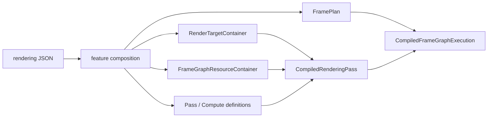
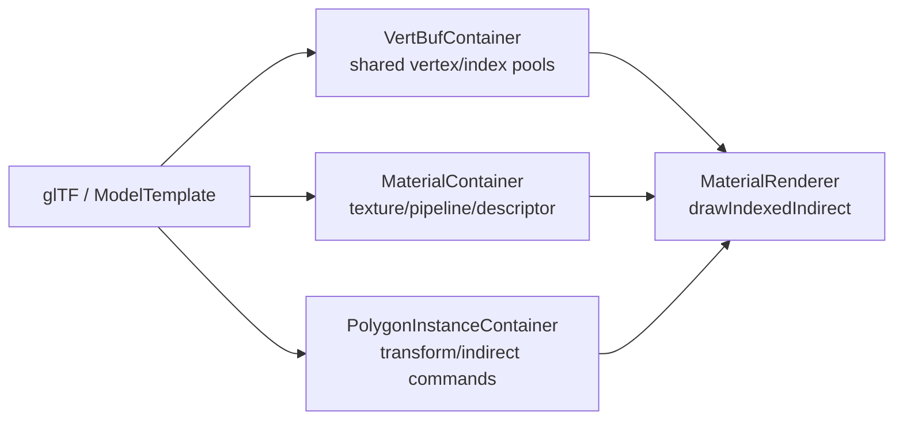

# 第6章 描画・Vulkan・Shader

[索引へ戻る](README.md) / [前章](05_gameplay_and_services.md) / [次章](07_tools_rpc_tests.md)

この章は、設定ファイルに書かれた「この順で、この画像へ描く」が、最終的に Vulkan のコマンドへ変換されるまでを追います。Pelican の描画層は、単純な `Renderer` 1 クラスではありません。次の5層に分けて読むと見通しがよくなります。

| 層 | 主な責務 | 入口 |
|---|---|---|
| 設定合成 | feature、target、pass、compute、graph を一つの定義へまとめる | [`registerRenderingPassConfigData()`](../../src/core/renderingpass/renderingpassconfigregistration.cpp#L92) |
| 計画 | read/write と明示依存から実行順、level、barrier を作る | [`planFrameGraph()`](../../src/core/renderingpass/frameplanner.cpp#L600) |
| runtime binding | 名前をコンパイル済み pass/task ID へ結び付ける | [`FrameGraphRuntimeContainer::registerExecutionPlan()`](../../src/core/renderingpass/framegraphruntime.cpp#L30) |
| pass dispatch | pass 種別を Material、Fullscreen、UI などの renderer へ振り分ける | [`renderDynamicPassDrawCalls()`](../../src/core/vkcore/render_pass_dispatch.cpp#L97) |
| Vulkan backend | device、frame target、image layout、pipeline、GPU resource を扱う | [`VulkanManageCore::VulkanManageCore()`](../../src/core/vkcore/core.cpp#L241) |

## 6.1 設定から1フレームの実行計画ができるまで

起点は [`loadDefaultRenderingPassFromConfig()`](../../src/core/vkcore/renderer_config.cpp#L86) です。`ProjectBasicConfig` が保持する rendering JSON と現在の出力サイズを使い、[`registerRenderingPassConfigData()`](../../src/core/renderingpass/renderingpassconfigregistration.cpp#L92) へ入ります。

登録処理の順序には意味があります。

1. feature を基本設定へ合成する。
2. render target 定義を parse して、画像と view を作る。
3. frame graph buffer 定義を parse して、必要な buffer を作る。
4. target 名を ID、format、image view へ解決する resolver を作る。
5. render pass と compute task の純粋な定義を parse する。
6. shader、pipeline、descriptor を作り、runtime 用の `CompiledPass` / `CompiledComputeTask` にする。
7. frame graph を計画し、名前を実際の pass/task index に bind する。

実コードではこの順序が [`renderingpassconfigregistration.cpp` の一続きの処理](../../src/core/renderingpass/renderingpassconfigregistration.cpp#L94) になっています。先に target と buffer を作るのは、pass の format、descriptor image view、compute resource の存在確認に必要だからです。



### 定義と実行物を分ける理由

中心型は [`renderingpass.hpp`](../../src/core/renderingpass/renderingpass.hpp#L16) にまとまっています。

- `PassDefinition` は target、load/store、clear、pass 種別を持つ、Vulkan object を含まない定義です。
- `CompiledPass` は定義と、登録済み renderer object を指す `PassId` の組です。
- `ComputeTaskDefinition` は shader、reads/writes、dispatch、順序制約を持ちます。
- `CompiledComputeTask` は定義と `ComputeTaskId` の組です。
- `CompiledRenderingPass` は render pass 群と compute task 群の実行可能なまとまりです。

これにより JSON parse と Vulkan object 生成が分離され、planner は GPU object を知らずにテストできます。

### ID の3種類を混同しない

[`PELICAN_DEFINE_HANDLE`](../../src/core/handle.hpp#L7) により、整数を別々の型に包んでいます。

| 型 | 指すもの |
|---|---|
| `RenderingPassId` | 複数 node を含む描画設定全体 |
| `PassId` | Material や Fullscreen など、個別 renderer 内の登録物 |
| `GlobalRenderTargetId` | offscreen target。`-1` はなし、`-2` は swapchain |
| `ComputeTaskId` | `ComputeTaskContainer` 内の task |

特殊値の意味は [`renderingpass.hpp`](../../src/core/renderingpass/renderingpass.hpp#L22) に集約されています。整数値が同じでも型が違えば誤って渡せない、軽量な nominal typing です。

## 6.2 PassInfo: 継承ではなく `std::variant` で pass を表す

pass の種類は virtual class 階層ではなく、[`PassInfo`](../../src/core/renderingpass/renderingpass.hpp#L54) という `std::variant` です。

| variant | 実際の仕事 |
|---|---|
| `MaterialPassInfo` | glTF 由来の material/mesh instance を indirect draw |
| `FullscreenPassInfo` | 全画面三角形で post-process、入力 target/buffer を読む |
| `DebugDrawPassInfo` | line geometry。physics collider の可視化もここへ投入 |
| `DebugTextPassInfo` | debug glyph の描画 |
| `ShadowDepthPassInfo` | depth-only の material draw |
| `UiPassInfo` | UI container の内容を描画 |

振り分けは [`renderDynamicPassDrawCalls()`](../../src/core/vkcore/render_pass_dispatch.cpp#L97) にあります。型を追加するときは、JSON parser、runtime compiler、dispatch の3か所を同時に増やす必要があります。variant なので「未知の派生型」が紛れず、compile 時に分岐漏れを見つけやすい一方、機能追加は open class hierarchy より明示的です。

## 6.3 Frame graph planner のアルゴリズム

frame graph node は `render` または `compute` で、名前、宣言順、`reads`、`writes`、`after`、`before` を持ちます。planner は [`planFrameGraph()`](../../src/core/renderingpass/frameplanner.cpp#L600) で次を行います。

1. node 名の一意性を検証する。
2. reads/writes が宣言済み target/buffer かを検証する。
3. 自動 data edge と明示 edge を作る。
4. 推移閉包を作り、複数 writer が順序付け済みか検証する。
5. 安定トポロジカルソートを行う。
6. node の level と、read-after-write barrier 情報を保存する。

### 自動で作られるのは「直前の writer → 後続 reader」

[`buildEdges()`](../../src/core/renderingpass/frameplanner.cpp#L386) は宣言順に node を走査し、resource ごとの `last_writer` を覚えます。reader が現れたら、その時点の直前 writer から reader へ RAW edge を張ります。

```text
A writes color
B reads  color   => A -> B が自動追加
C writes color   => 自動では B -> C や A -> C を追加しない
```

`after` と `before` は別途、明示 edge として追加されます。その後 [`addBarriersForOrderedResourceEdges()`](../../src/core/renderingpass/frameplanner.cpp#L373) が「順序 edge があり、from が書き、to が同じ resource を読む」組を barrier 情報へ変換します。

ここは重要です。現実装は一般的な hazard graph をすべて自動生成するわけではありません。

- RAW（write → read）: 直前 writer から自動 edge。
- WAW（write → write）: 自動 edgeなし。どちら向きか `after` / `before` などで明示しないと [`validateWritesAreOrdered()`](../../src/core/renderingpass/frameplanner.cpp#L444) が例外にします。
- WAR（read → write）: 自動 edgeなし。保存したい古い値がある場合は明示順序が必要です。

### 安定トポロジカルソート

依存がない node の順序はランダムではありません。[`topologicalOrder()`](../../src/core/renderingpass/frameplanner.cpp#L470) は ready set を `(declaration_index, node_index)` で並べ、設定に書いた順を tie-breaker にします。cycle なら全 node を取り出せないため例外になります。

### level は現在「診断情報」

[`computeLevels()`](../../src/core/renderingpass/frameplanner.cpp#L507) は依存段数を計算し、同 level の node を `FramePlan::levels` へ入れます。ただし実行側の [`executePlannedFrameGraph()`](../../src/core/vkcore/renderer.cpp#L306) は `frame_graph.nodes` を一本の loop で順番に実行します。したがって level は現在、plan の説明・検査、および将来の並列化余地を示す値であり、同 level が実際に並列実行されるわけではありません。

### 計画と実行 ID の結合

planner は名前しか知りません。[`FrameGraphRuntimeContainer::registerExecutionPlan()`](../../src/core/renderingpass/framegraphruntime.cpp#L30) が各 plan node の名前を `CompiledRenderingPass::passes` / `compute_tasks` から探し、実配列 index と incoming barrier を持つ `CompiledFrameGraphExecution` を作ります。実行時には plan と実行 node の name/kind がまだ一致しているかも [`executePlannedFrameGraph()` 冒頭](../../src/core/vkcore/renderer.cpp#L317) で再確認します。

## 6.4 `Renderer::render()` の1フレーム

[`Renderer::render()`](../../src/core/vkcore/renderer.cpp#L472) は短いですが、呼び先が多い orchestrator です。

```text
DeletionQueue::beginFrame()
  -> module参照を集める
  -> shader hot reload
  -> light animation更新
  -> FrameTarget::render_begin()       // fence待機、image取得、command begin
  -> resizeを処理
  -> frame graph nodeを順に実行
  -> FrameTarget::render_end()         // command end、submit、present/readback準備
  -> 必要ならtesting traceを保存
```

各 node の実行は [`executePlannedFrameGraph()`](../../src/core/vkcore/renderer.cpp#L306) です。node ごとに以下をします。

1. incoming buffer barrier を発行する。
2. GPU timing が有効なら開始 timestamp を記録する。
3. render node なら `RenderPassExecutor::execute()`、compute node なら resource transition と `dispatch()` を呼ぶ。
4. GPU timing の終了 timestamp を記録する。

`currentFramePlanJson()` と testing trace は [`Renderer` の診断用メソッド](../../src/core/vkcore/renderer.cpp#L449) です。RPC の `get_frame_plan` やテストから、設定がどの順に解釈されたかを GPU debugger なしで確認できます。

## 6.5 Dynamic Rendering と pass 実行

[`RenderPassExecutor::execute()`](../../src/core/vkcore/render_pass_executor.cpp#L8) は次の順で動きます。

1. pass の入力 target を shader-read layout へ遷移する。
2. 出力 target を color/depth attachment layout へ遷移する。
3. attachment 情報を組み立てる。
4. `vkCmdBeginRendering` 相当の `beginRendering()` を呼ぶ。
5. viewport/scissor を動的設定する。
6. variant に応じた draw call を記録する。
7. `endRendering()` を呼ぶ。

つまり旧来の `VkRenderPass` / `VkFramebuffer` object を組み立てる方式ではなく、Vulkan Dynamic Rendering を使います。logical device 生成時にも [`dynamicRendering` feature を有効化](../../src/core/vkcore/core.cpp#L207) しています。

UI pass だけは [`RenderPassExecutor` の特別分岐](../../src/core/vkcore/render_pass_executor.cpp#L20) で早期 return します。UI renderer 自身が rendering scope を管理するため、通常 pass と同じ `beginRendering()` を二重に呼ばないためです。

### Material 描画のデータ経路

モデル描画は概ね次の所有分担です。



[`MaterialRenderer`](../../src/core/renderer/materialrender.cpp#L42) は material ごとに pipeline と descriptor を bind し、[`drawIndexedIndirect`](../../src/core/renderer/materialrender.cpp#L61) を発行します。GPU へ渡す geometry、material、instance transform を別 container に分けているため、「モデル1個 = Vulkan buffer 一式」にはなっていません。共通 vertex/index pool と material 単位の draw range を使う構成です。

## 6.6 Frame target: window と headless の共通インターフェース

[`IFrameTarget`](../../src/core/vkcore/frametarget.hpp#L17) が描画先の抽象インターフェースです。

```cpp
virtual FrameRenderContext render_begin() = 0;
virtual void render_end() = 0;
virtual FrameTargetCaps caps() const = 0;
virtual bool consumeExtentChanged() = 0;
virtual std::vector<uint8_t> readbackLastFrameRGBA8() = 0;
```

[`RenderTarget`](../../src/core/vkcore/rendertarget.hpp#L24) がこの interface を所有し、[`createFrameTarget()`](../../src/core/vkcore/rendertarget.cpp#L15) で実装を選びます。

| 実装 | 用途 | 特徴 |
|---|---|---|
| [`SwapchainFrameTarget`](../../src/core/vkcore/swapchainframetarget.hpp#L19) | 通常 window | acquire、submit、present、resize/recreate。CPU readback は未対応 |
| [`OffscreenFrameTarget`](../../src/core/vkcore/offscreenframetarget.hpp#L13) | `--headless` | offscreen color/depth、最後の RGBA8 を readback 可能 |

`FrameRenderContext` は command buffer、color/depth view、extent、待機 semaphore、最後に必要な image layout を返します。frames-in-flight は [`in_flight_frames_num = 2`](../../src/core/vkcore/rendertarget.hpp#L22) です。

headless capture は [`RenderTarget::captureLastFrameToPng()`](../../src/core/vkcore/rendertarget.cpp#L40) が BGRA/RGBA を補正して PNG を書きます。対して swapchain 実装の [`readbackLastFrameRGBA8()`](../../src/core/vkcore/swapchainframetarget.cpp#L316) は明示的に例外を投げます。

## 6.7 Offscreen render target と layout tracker

frame target の color/depth と、frame graph 設定で宣言する offscreen target は別物です。後者は [`RenderTargetContainer`](../../src/core/renderingpass/rendertargetcontainer.hpp#L21) が、名前、format、固定/相対 extent、image、view を所有します。

window resize が検出されると [`handleFrameTargetResize()`](../../src/core/vkcore/renderer.cpp#L431) が次を行います。

- 相対サイズ target を再作成する。
- fullscreen pass の input descriptor を新しい image view へ rebind する。
- layout tracker を reset する。

画像 layout の現在値は [`RenderTargetLayoutTracker`](../../src/core/vkcore/render_target_layout_tracker.cpp#L53) が target ID ごとに追います。初見の target は `eUndefined`、同じ layout への遷移は何もしません。`-2` の swapchain target は特殊 ID なので tracker が無視し、`SwapchainFrameTarget` 側に管理を任せます。

layout transition は単なる状態ラベルではありません。[`makeTransitionInfo()`](../../src/core/vkcore/render_target_layout_tracker.cpp#L8) が old/new layout から pipeline stage と access mask を作ります。

| layout | 主な stage / access |
|---|---|
| shader-read | fragment shader / shader read |
| color attachment | color output / attachment read+write |
| depth attachment | early/late fragment tests / depth read+write |
| general | compute shader / shader read+write |

### 現在の image barrier の注意点

compute target は [`transitionResourcesForDispatch()`](../../src/core/renderingpass/computetask.cpp#L470) で `eGeneral` へ遷移します。しかし tracker は old layout と new layout が同じなら [`transition()` から早期 return](../../src/core/vkcore/render_target_layout_tracker.cpp#L60) します。また frame graph の明示 RAW barrier 実装は [`bufferReadAfterWriteBarrier()`](../../src/core/renderingpass/computetask.cpp#L501) で、buffer でなければ return します。

したがって調査時点では、同じ storage image を `GENERAL` のまま連続 compute task で write → read する場合、graph 上の順序は付きますが、その依存専用の image memory barrier は発行されません。layout が変わる compute → render などとは事情が違います。これは「設定に edge を書けば全 resource の同期も完全」という意味ではない、現在実装上の制約です。

## 6.8 Compute task

compute の JSON は [`parseComputeTaskDefinitionsFromConfigJson()`](../../src/core/renderingpass/computetask.cpp#L248) で次へ変換されます。

- `shader`: extensionless stem
- `reads`, `writes`: buffer または concrete render target の名前
- `after`, `before`: 明示順序
- `dispatch.groups`: x/y/z group 数
- `schedule`: 現在は `per_frame` のみ

descriptor は shader reflection の set 1、すなわち `PELICAN_SET_PASS_INPUT` だけを読み、binding 順に構築します。[`resourceForBinding()`](../../src/core/renderingpass/computetask.cpp#L103) の対応規則は次の優先順です。

1. reflection された binding 名と宣言 resource 名が一致すれば、その resource。
2. resource が1個だけなら、それを使用。
3. それ以外は binding の順番と resource 配列の順番を対応。

buffer は storage buffer、render target は storage image でなければ [`createDescriptorSet()`](../../src/core/renderingpass/computetask.cpp#L340) が例外にします。task 実行は graphics frame の command buffer 上で pipeline と set 1 を bind し、[`dispatch()`](../../src/core/renderingpass/computetask.cpp#L486) を記録します。

### buffer 宣言の実装済み範囲

[`FrameGraphResourceContainer::registerBuffers()`](../../src/core/renderingpass/computetask.cpp#L287) は `size > 0` の buffer を一度だけ device local memory に確保します。

- 文字列だけ、または size 0 の宣言は graph の既知名にはなりますが、実 buffer を確保しません。
- `lifetime: persistent|transient` は [`parseFrameGraphBufferDefinitionsFromJson()`](../../src/core/renderingpass/computetask.cpp#L199) で読みますが、登録側は調査時点で `persistent` を参照していません。transient の frame 単位 recycle は未実装です。
- `groups_from` と `local_size` も parse されますが、[`registerComputeTask()`](../../src/core/renderingpass/computetask.cpp#L407) が保存する group 数は `groups_x/y/z` だけです。自動 group 数導出は現在つながっていません。
- 実行後に group 数を変える API は [`setDispatchGroups()`](../../src/core/renderingpass/computetask.cpp#L449) です。

設定 schema に項目があることと、runtime behavior が完成していることを区別して読む必要があります。

## 6.9 Shader reference、compile、reflection

### extensionless stem

project rendering config では shader を `foo/bar` のような stem で指定します。[`makeShaderReference()`](../../src/core/shader/shaderreference.cpp#L51) は `.vert`、`.frag`、`.comp`、`.spv` などが明記されていると例外にします。

stage に応じた候補は次です。

- vertex: `stem.vert` / `stem.vert.spv`
- fragment: `stem.frag` / `stem.frag.spv`
- compute: `stem.comp` / `stem.comp.spv`

runtime shader compiler が有効なら source を先に、次に SPIR-V を試します。無効なら SPIR-V だけです。候補選択は [`ShaderLibrary::loadFromStemReference()`](../../src/core/shader/shaderlibrary.cpp#L215) で確認できます。

### `ShaderBundle`

[`ShaderBundle`](../../src/core/shader/shaderlibrary.hpp#L22) は次をひとまとめにします。

- `vk::UniqueShaderModule`
- `ShaderReflection`
- source path
- compile define 群
- version
- 最後の compile log

source compile は [`ShaderCompiler`](../../src/core/shader/shadercompiler.hpp#L27)、SPIR-V 解析は SPIRV-Reflect を使う [`reflect()`](../../src/core/shader/shaderreflection.cpp#L58) が担当します。reflection で取得するものは descriptor set/binding/type/count/name、push constant range、vertex input、compute local size です。

vertex と fragment の reflection は [`merge()`](../../src/core/shader/shaderreflection.cpp#L145) で統合します。同じ set/binding の型または配列数が違う、push constant の offset/size が違う場合は pipeline 作成前に例外になります。

### descriptor set と push constant の契約

エンジンと shader の予約規約は [`pelican_sets.hpp`](../../src/core/shader/pelican_sets.hpp#L7) です。

| set | 定数 | 用途 |
|---:|---|---|
| 0 | `PELICAN_SET_FRAME` | camera/light など frame 共通データ |
| 1 | `PELICAN_SET_PASS_INPUT` | fullscreen 入力、compute resource |
| 2 | `PELICAN_SET_MATERIAL` | material texture/data |
| 3 | `PELICAN_SET_FREE` | 自由枠 |

push constant は engine 64 bytes + shader 64 bytes、合計128 bytesを契約値としています。実際の pipeline layout は reflection された range から [`createPipelineLayout()`](../../src/core/shader/pipelinefactory.cpp#L212) が作ります。

### define と SPIR-V

compile define は source compile 時にしか適用できません。engine resource が SPIR-V なのに define があれば [`loadResolvedReference()`](../../src/core/shader/shaderlibrary.cpp#L184) が拒否します。feature composition が shader define を足す構成では runtime compiler を有効にするか、define ごとの SPIR-V variant を別 resource として用意する必要があります。

## 6.10 PipelineFactory と hot reload

[`PipelineFactory`](../../src/core/shader/pipelinefactory.hpp#L47) は graphics/compute pipeline を作り、handle で保持します。

graphics pipeline 作成は次の順です。

1. shader bundle の reflection を merge。
2. set ごとの descriptor layout key を作る。
3. 同じ binding signature の descriptor set layout を cache から再利用。
4. reflection から pipeline layout を作る。
5. target format を `vk::PipelineRenderingCreateInfo` に入れ、Dynamic Rendering pipeline を作る。

実装は [`buildGraphicsPipeline()`](../../src/core/shader/pipelinefactory.cpp#L323) と [`createGraphicsPipeline()`](../../src/core/shader/pipelinefactory.cpp#L219) です。また driver pipeline cache を executable 隣の `pipeline_cache.bin` から読み書きします。保存は [`PipelineFactory::~PipelineFactory()`](../../src/core/shader/pipelinefactory.cpp#L177) から呼ばれます。

hot reload の流れは次です。

```text
Renderer::render()
  -> ShaderLibrary::reloadModifiedSources()  // 最大1秒に1回poll
      -> 新bundleを一時構築
      -> 成功したときだけ現bundleを置換しdirty化
      -> 失敗なら旧bundleを維持しlogを保存
  -> PipelineFactory::rebuildDirty()
      -> dirty shaderを参照するpipelineだけ再構築
      -> 成功時だけhandleの中身を置換
      -> fullscreen input descriptorをrebind
```

shader の transactional な置換は [`ShaderLibrary::reload()`](../../src/core/shader/shaderlibrary.cpp#L293)、pipeline の transactional な再構築は [`PipelineFactory::rebuildDirty()`](../../src/core/shader/pipelinefactory.cpp#L424) です。compile error で画面を即座に壊さず、最後に成功した object を残す設計です。

埋め込み source/SPIR-V は `source_path` が空なので file timestamp を追えず、hot reload 対象外です。

## 6.11 GPU resource の遅延破棄

Vulkan object は C++ の所有権上不要になっても、前の frame の command buffer が GPU 上で参照中かもしれません。即時 destructor は use-after-free になります。

Pelican の [`DeletionQueueCore`](../../src/core/vkcore/deletionqueue.hpp#L16) は、任意の movable resource を型消去した `DeferredResource<T>` に包み、「何 frame 目に defer されたか」とともに保存します。各 frame 冒頭の [`beginFrame()`](../../src/core/vkcore/deletionqueue.cpp#L56) で2 frames-in-flight 分古くなった resource を release します。

hot reload で入れ替えた古い pipeline/layout は [`PipelineFactory::replacePipeline()`](../../src/core/shader/pipelinefactory.cpp#L392) がこの queue へ渡します。終了時に pending が残っていれば、destructor は `device.waitIdle()` 後に safety flush します。

これが描画層で最も重要な寿命ルールです。

```text
CPU:  old pipelineを置換 ---- defer -------- 2 frame経過 ---- destroy
GPU:           frame N が参照 ----- 完了 -----|
```

## 6.12 Vulkan 初期化と resource wrapper

[`VulkanManageCore`](../../src/core/vkcore/core.hpp#L17) が instance、physical device、logical device、queues、command pools、VMA allocator を所有します。constructor は [`core.cpp`](../../src/core/vkcore/core.cpp#L241) です。

- Vulkan API version は [`1.3.283`](../../src/core/vkcore/core.cpp#L13)。
- `_DEBUG` では validation layer と synchronization validation を有効化します。
- window mode のみ surface と swapchain extension を要求します。
- physical device は `multiDrawIndirect` が必須です。
- logical device では `multiDrawIndirect`、`shaderDrawParameters`、`dynamicRendering` を有効化します。
- graphics、presentation、compute queue family を選び、それぞれの queue を取得します。
- graphics と compute command pool を別に作ります。

buffer/image memory は VMA を使います。[`BufferWrapper`](../../src/core/vkcore/buf.hpp#L7) と [`ImageWrapper`](../../src/core/vkcore/image.hpp#L7) が Vulkan resource と VMA allocation を同じ struct に持ち、RAII で一緒に解放します。

調査時点の compute task は独立 compute submission ではなく、[`FrameRenderContext::cmd_buf`](../../src/core/vkcore/rendertarget.hpp#L14) へ dispatch を記録します。この command buffer は [`allocCmdBufs()`](../../src/core/vkcore/core.cpp#L273) が graphics pool/queue 用に作るものです。したがって frame graph compute は async compute pipeline ではなく、graphics queue 上の直列 compute と理解するのが正確です。

## 6.13 描画を変更するときの実践的な追い方

### 新しい render pass 種別を増やす

1. [`PassInfo`](../../src/core/renderingpass/renderingpass.hpp#L54) に info struct を追加。
2. [`passinfojsonparser.cpp`](../../src/core/renderingpass/passinfojsonparser.cpp#L22) 周辺で JSON を parse。
3. [`renderingpassruntimecompiler.cpp`](../../src/core/renderingpass/renderingpassruntimecompiler.cpp#L191) で shader/pipeline/renderer resource を登録。
4. [`render_pass_dispatch.cpp`](../../src/core/vkcore/render_pass_dispatch.cpp#L97) で draw call を dispatch。
5. pure parser test、runtime registration test、headless render test を追加。

### 新しい compute resource を増やす

1. planner の resource declaration/known-resource 検証を拡張。
2. descriptor reflection type と resource object の対応を [`createDescriptorSet()`](../../src/core/renderingpass/computetask.cpp#L340) へ追加。
3. resource ごとの正しい access/stage barrier を実装。
4. resize、hot reload、teardown 時の寿命を定義。

### 画面が真っ黒なときの読む順

1. [`currentFramePlanJson()`](../../src/core/vkcore/renderer.cpp#L449) で node 順と reads/writes を確認。
2. [`RenderPassExecutor::execute()`](../../src/core/vkcore/render_pass_executor.cpp#L8) で target layout と attachment を確認。
3. [`renderDynamicPassDrawCalls()`](../../src/core/vkcore/render_pass_dispatch.cpp#L97) で意図した variant に入ったか確認。
4. shader bundle の `log` と reflection を確認。
5. `_DEBUG` の synchronization validation を有効にして barrier/layout error を確認。
6. headless capture と golden test で出力を固定して比較。

描画層は object 数が多いですが、境界は一貫しています。JSON は「定義」、planner は「順序」、runtime compiler は「GPU object」、executor は「コマンド記録」、frame target は「提出先と同期」を担当します。
