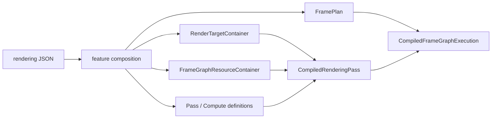
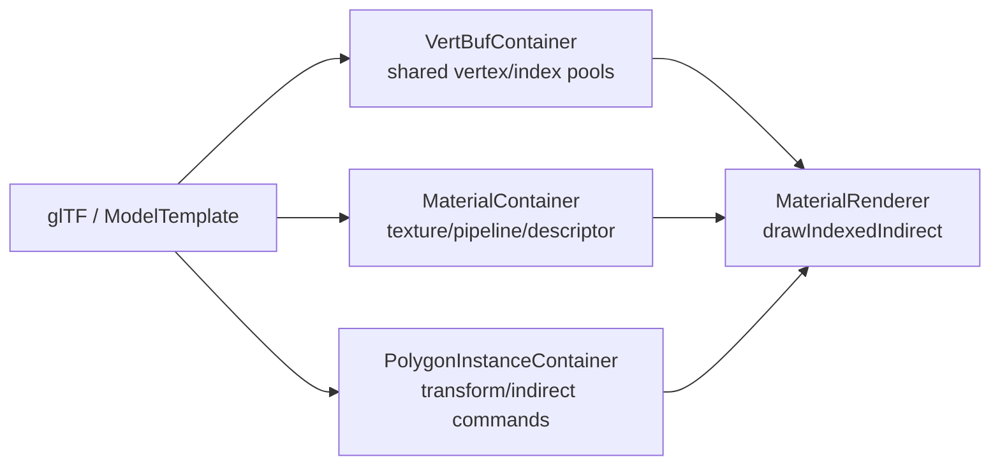

# 第6章 描画・Vulkan・Shader

[索引へ戻る](README.md) / [前章](05_gameplay_and_services.md) / [次章](07_tools_rpc_tests.md)

この章は、設定ファイルに書かれた「この順で、この画像へ描く」が、最終的に Vulkan のコマンドへ変換されるまでを追います。Pelican の描画層は、単純な `Renderer` 1 クラスではありません。次の5層に分けて読むと見通しがよくなります。

| 層 | 主な責務 | 入口 |
|---|---|---|
| コンパイラ program | rendering JSON を variant family ごとまとめて受け、feature 合成・変換 registry・型付き定義への parse・計画までを **GPU に触らずに** 済ませる | [`registerRenderingPassConfigVariantsData()`](../../src/core/renderingpass/renderingpassconfigregistration.cpp#L648) → [`runRenderCompilerProgram()`](../../src/core/renderingpass/rendercompilerprogram.cpp#L218) |
| 計画(3系統が並行) | 論理グラフ+物理ターゲットプラン / FramePlan / FrameExecutionPlan | [`compileDefaultVulkanVariant()`](../../src/core/renderingpass/vulkanrendercompilerprogram.cpp#L422) |
| GPU 登録と世代 publish | 画像実体・buffer・shader・pipeline・descriptor を作り、不変な publication root を差し替える | [`registerPreparedRenderingPassConfigVariant()`](../../src/core/renderingpass/renderingpassconfigregistration.cpp#L372) / [`prepareGeneration()`](../../src/core/renderingpass/framegraphruntime.cpp#L246) |
| pass dispatch | pass 種別を Material、Fullscreen、UI などの renderer へ振り分ける | [`renderDynamicPassDrawCalls()`](../../src/core/vkcore/render_pass_dispatch.cpp#L156) |
| Vulkan backend | device、frame target、image layout、pipeline、GPU resource を扱う | [`VulkanManageCore::VulkanManageCore()`](../../src/core/vkcore/core.cpp#L650) |

**ただし、この 5 層は一本道ではありません。**「JSON → 論理グラフ → 変換 → 物理プラン → Vulkan」という直線で読むと必ず外します。実際は [`FrameGraphDefinition`](../../src/core/renderingpass/frameplanner.hpp#L116) が **ハブ** で、そこから 3 本が **並行に** 枝分かれします。

```text
 rendering JSON (ProjectBasicConfig)
   │  registerRenderingPassConfigVariantsData()   renderingpassconfigregistration.cpp:648
   │    flat / #xr / preview を 1 つの program へまとめて渡す
   v
 ┌ RenderCompilerProgram ── GPU に一切触らない CPU 相 ─────────────────────────┐
 │ (1) authoring 解決  resolveRenderPipeline() → compileRenderPipeline()      │
 │       ⇒ CompiledRenderPipeline(feature / route / sample / target policy)   │
 │ (2) 変換 registry   render strategy / graph transform / subgraph replace   │
 │       いずれも config JSON → config JSON(論理グラフは書き換えない)        │
 │ (3) 型付き定義へ parse  ⇒ ★ FrameGraphDefinition ★  frameplanner.hpp:116  │
 │              ┌───────────────────┼───────────────────┐                     │
 │          (4a)│               (4b)│               (4c)│                     │
 │   compileRenderingTargetPlans-  framePlansByName()  frameExecutionPlans-   │
 │     ForVulkanDevice()             = planFrameGraph()  ByName()             │
 │              v                     v                   v                   │
 │   CompiledLogicalRenderGraph     FramePlan           FrameExecutionPlan    │
 │     (SSA 値・型・read footprint)   nodes/levels/       endpoints/nodes/    │
 │              │                     barriers            dependencies 🚧     │
 │              v                  ★実行順の権威★                            │
 │   VulkanTargetPlan(scope / format / sample 数 / view execution / alias)    │
 └────────────────────────────────────────────────────────────────────────────┘
   │  physical_package->validate(frame_graph_names) を GPU 変更前に必ず通す
   v
 GPU 登録トランザクション(gpuRegistrationMutex で直列化)
   │  prepareGeneration → validate → before_publish → publish(単一 CAS)
   v
 RendererRuntimeGeneration(不変な publication root)  framegraphruntime.hpp:89
   │
   v
 Renderer::renderLogicalFrame()   view family 解決 → scope schedule 構築 → node 記録
```

3 本の関係で、先に知っておくべきことが 4 つあります。

- **実行順・level・barrier の権威は今も [`planFrameGraph()`](../../src/core/renderingpass/frameplanner.cpp#L1654) です**。論理グラフ経路は planner を置き換えていません。論理/物理プランが決めるのは「その順序に載る**形・フォーマット・scope・view 実行**」の側です(§6.3 と併読)。
- **論理グラフは runtime に保存されません**。`compileLogicalFrameGraphShadow()` の呼び出し元は [`compileRenderingLogicalGraphs()`](../../src/core/renderingpass/renderingsamplecount.cpp#L1611)(変換 registry の契約検証用)と [物理ターゲット計画の入力](../../src/core/renderingpass/renderingsamplecount.cpp#L1806) の 2 か所だけで、`CompiledFrameGraphExecution`([`CompiledFrameGraphExecution`](../../src/core/renderingpass/framegraphruntime.hpp#L51))が持つのは `plan`(FramePlan)/ `execution_plan` / `target_plan` / `native_scopes` といった物理側のほうで、論理グラフは入っていません。ただし WP238e 以降、論理グラフは**コンパイル成果物の中では**生き残ります — `RenderingTargetPlanVerificationContext::logical_graph` が `shared_ptr` で保持し、完全物理プランの検証入力になります(§6.1 の難所「物理プランは『置換可能な完全パッケージ』」)。runtime 世代へ publish されない、という意味は変わりません。
- **`FrameExecutionPlan` は 🚧 部分実装**です。生成・fingerprint・`FramePlan` との一致検証([`rendercompilerprogram.cpp` 内](../../src/core/renderingpass/rendercompilerprogram.cpp#L172))・診断 JSON への出力までは完成していますが、**コマンド記録を駆動していません**。現状は「FramePlan の別表現 + 将来の異種エンドポイント用の場所取り」です。
- **backend は enum ではなく文字列**です。`RenderCompilerBackendPhysicalPackage::backend()` は `std::string_view` を返し、[`rendercompilerprogram.hpp` 内](../../src/core/renderingpass/rendercompilerprogram.hpp#L34) のコメントが理由を明示しています。

> Physical packages are an open backend boundary. A future Metal package can
> derive from this class without adding a fake Metal alternative to a central
> RHI variant.

## 6.1 設定から1フレームの実行計画ができるまで

起点は [`loadDefaultRenderingPassFromConfig()`](../../src/core/vkcore/renderer_config.cpp#L213) です。`ProjectBasicConfig` が保持する rendering JSON と現在の出力サイズを使い、[`registerRenderingPassConfigVariantsData()`](../../src/core/renderingpass/renderingpassconfigregistration.cpp#L648) へ入ります。ここから先の合成・変換・計画は、この関数が自分で行うのではなく **1 つの compiler program へ委譲されます**(冒頭の層表)。

### graph variant: flat、`#xr`、preview

現在の実体は [`loadRenderGraphVariantsFromConfig()`](../../src/core/vkcore/renderer_config.cpp) です。flat 用の rendering pass に加え、XR active 時は同じ設定から suffix `#xr` 付きの rendering pass をもう一つ合成します。WP192 以降、XR/preview の feature 除外と検証は callback ではなく、project compiler の [`CompiledGraphVariantPolicy`](../../src/project/graphvariantpolicy.hpp) が所有します。`compileGraphVariantPolicy()` は history/jitter、view family/execution、resource layout、terminal、mirror、suffix を一つの値へ解決し、除外には typed reason を残します。除外名は引き続き `xr_excluded_features` として記録されます。`Renderer` は [`flat_rendering_pass_id` / `xr_rendering_pass_id`](../../src/core/vkcore/renderer.hpp) を持ち、[`selectGraphVariant()`](../../src/core/vkcore/renderer.hpp) で切り替えます。

WP172 で **第3の variant「preview」** が加わりました。同じ `loadRenderGraphVariantsFromConfig()` が起動時に [`precompilePreviewGraph()`](../../src/core/renderingpass/previewgraph.hpp#L42) も呼びます([`renderer_config.cpp` 内](../../src/core/vkcore/renderer_config.cpp#L140))。ただし preview は他の 2 つとは**種類が違います**。ヘッダのコメントが規範です([`previewgraph.hpp` 内](../../src/core/renderingpass/previewgraph.hpp#L17))。

> A third, startup-compiled graph program.  Unlike flat/xr RenderingPassId it
> is data-only: render_preview executes it against request-local resources and
> therefore never enters Renderer::renderLogicalFrame.

つまり preview には `RenderingPassId` も `CompiledRenderingPass` もありません。flat / `#xr` が「GPU object まで compile し終えた実行物」なのに対し、preview は**合成と検証だけを終えた設定データ**で止まります(shader も pipeline も descriptor も作りません)。[`PreviewGraphProgram`](../../src/core/renderingpass/previewgraph.hpp) は `name` / `generation` / `pass_names` / `excluded_feature_names` / `graph_variant_policy` / `composed_config` を持つ値です。feature decision、swapchain→request-local capture の変換、設定検証は [`graphvariantpolicy.cpp`](../../src/project/graphvariantpolicy.cpp) の同じ builtin policy 経路を通ります。`Renderer` は [`preview_graph_program`](../../src/core/vkcore/renderer.hpp) を保持し、[`previewGraphProgram()`](../../src/core/vkcore/renderer.hpp) と [`previewIsolationStateJson()`](../../src/core/vkcore/renderer.cpp) で公開します。実行側は §6.19 を参照してください。

> 🧩 **難所 — preview 除外は 1 語差**([`unsafePreviewDirectPassSurface()`](../../src/project/graphvariantpolicy.cpp) / [`validatePreviewConfig()`](../../src/project/graphvariantpolicy.cpp))
>
> **何をする所か**: preview graph から時間依存(TAA / velocity / jitter)・UI・mirror・present を含むものを部分文字列一致で締め出し、base graph の正規終端 pass だけを残します。
>
> **素朴に読むと**: マーカー配列が 2 つあり、**違いは `"present"` の有無だけ**です(8 個 vs 7 個)。[`unsafePreviewName()`](../../src/project/graphvariantpolicy.cpp)(8 個)が掛かるのは feature 名・feature の render target 名に加えて **feature が宣言した pass の `name` / `type` / `insert`** で、`unsafePreviewDirectPassSurface()`(7 個)が掛かるのは**合成後 config の pass 名/型だけ**です。つまり feature 由来の pass 名は `present` を含む厳しい側(8 個)で落とされ、緩い側(7 個)は合成後 config の pass にしか掛かりません。正規パイプラインの終端は慣習的に `present` を含む名前なので、合成後の pass 側だけ緩めてあります。片方に揃えて「重複を整理」すると、preview が終端 pass ごと落ちて何も描かないか、present 系 feature を通してしまうかのどちらかに倒れます。除外が **feature 単位で原子的**なのも意図で、合成後に pass を削ると insert anchor が宙に浮いて composer の依存/anchor 検証が無意味になるからです。副作用として、除外された feature は `hdr_enabled` の判定にも `projection_jitter` provider の登録にも参加しません(`composeRenderFeatureConfig()` の feature ループが判定前に `continue` する)。**feature を 1 つ外すと canonical パイプラインの形そのものが変わります**。
>
> **骨子**:
> ```text
> unsafePreviewName              = {taa, velocity, motion_vector, projection_jitter, ui, imgui, mirror, present}
> unsafePreviewDirectPassSurface = {taa, velocity, motion_vector, projection_jitter, ui, imgui, mirror}
>                                                                                  └ present が無い
> retained_terminal = 出力が preview_capture|display && 名前が "present" で終わる
>                     && "mirror" も "ui" も含まない
> ```
>
> **手がかり**: [`resolveRenderPipeline()`](../../src/project/renderpipeline.cpp) の compose → `transformGraphVariantConfig()` → `validateGraphVariantConfig()` は順序が仕様です。先に `swapchain` を `preview_capture` へ書き換えるからこそ `retained_terminal` が成立しえます。`precompilePreviewGraph()` の `generationOf()` が **FNV-1a**(Fowler–Noll–Vo ハッシュの 1a 版 — 1 バイトごとに「XOR してから固定の素数を掛ける」を繰り返すだけの非暗号学的ハッシュ。依存ライブラリなしで数行で書けるので、設定が変わったかどうかの判定に使われます)を **53 bit にマスクし、0 なら 1 に繰り上げる**のは、JSON の number(double)で正確に表せる上限と「program 無し」の予約値のためで、飾りではありません。テストは [`editorpreview_test.cpp`](../../test/editorpreview_test.cpp)。
>
> **不変条件**: 2 つのマーカー配列の差分は意図的です。片方を編集したら、もう片方の意味を明文化すること。除外は typed policy decision を composer の feature-envelope 境界へ適用し(composer の検証を残す)、合成後の削除に置き換えないこと。

### preset envelope: 既定の rendering config は 4 行(WP240a)

`pelican_cli project init` が書き出す rendering config は、**`pipeline.preset` と `features` だけの 4 行**になりました([`projectinit.cpp`](../../src/devcli/projectinit.cpp#L193) の `rendering_config_json`)。参照先は engine 同梱の [`render_pipelines/hybrid_v1.json`](../../src/core/resources/render_pipelines/hybrid_v1.json) です。`projects/animgraph_demo` の [`passes/main.json`](../../projects/animgraph_demo/passes/main.json) も同じ 4 行へ移りました。これは略記の導入ではなく **既定の描画経路そのものの入れ替え**です — 旧テンプレートは手書き 111 行で、pass は gbuffer / ssao / ssao_blur / present の 4 本、`present` が `uses_light_data: true` でライティングと present を兼ねており、forward 経路も半透明も snapshot も持っていませんでした。既定プロジェクトが踏むコードが変わっているので、「既定は deferred 4 pass だけ」という前提で読むと外します。

展開の実体は [`resolveRenderPipelinePreset()`](../../src/project/renderpipeline.cpp#L589) で、呼び出し元は [`composeRenderFeatureConfig()`](../../src/project/featurecompose.cpp#L2559) の**冒頭 1 箇所だけ**です([`featurecompose.cpp` 内](../../src/project/featurecompose.cpp#L2566))。つまり preset 展開は下の手順 1(feature 合成)の直前に、同じ関数の中で起きます。ソースファイルは書き換えません。

読むうえでの要点は 2 つです。

- **preset と `render_targets` / `rendering_passes` は排他**です。`pipeline` を書いた config で許されるトップレベルキーは `pipeline` / `features` / `snapshots` / `shader_defines` / `draw_sort` / `graph_transforms` / `render_strategy` / `target_planning` / `vulkan_plan_pins` / `vulkan_physical_fragments` / `xr` だけで、それ以外は例外です([`resolveRenderPipelinePreset()`](../../src/project/renderpipeline.cpp#L589) 内の `requireOnlyKeys`)。理由はコメントが規範で、「preset の更新が deep merge 越しに意味を変えてしまう」ことを避けるためです。構造を変えたいときは preset を copy/eject して verbose config にします。preset 側が既に持つ `render_strategy` / `snapshots` / `target_planning` / `vulkan_plan_pins` / `vulkan_physical_fragments` を上書きしようとした場合も、merge ではなく例外になります。
- hybrid_v1 が持つ pass は `deferred_geometry` / `ssao_pass` / `ssao_blur_pass` / `deferred_lighting` / `forward_opaque` / `__snapshot_opaque_color` / `__snapshot_opaque_depth` / `forward_transparent` / `scene_present` の 9 本で、`material_routing.policy` は `hybrid_auto_v1`、`draw_sort` は opaque が `state_batched_v1`、transparent が `back_to_front_v1` です(§6.5 の難所「draw queue は provider に鍵だけ作らせる」の provider 名はここから来ます)。deferred と forward が同じ `lit_color` / `scene_depth` へ `load` で重ねて描き、半透明は `snapshot_copy` node(§6.3)で退避した `opaque_color` / `opaque_depth` を screen input として読みます。

登録処理の順序には意味があります。

1. feature を基本設定へ合成する(preset を選んでいれば、その展開はこの直前で済んでいます)。
2. render target 定義を parse して、画像と view を作る。
3. frame graph buffer 定義を parse して、必要な buffer を作る。
4. target 名を ID、format、image view へ解決する resolver を作る。
5. render pass と compute task の純粋な定義を parse する。
6. shader、pipeline、descriptor を作り、runtime 用の `CompiledPass` / `CompiledComputeTask` にする。
7. frame graph を計画し、名前を実際の pass/task index に bind する。

実コードではこの順序が [`renderingpassconfigregistration.cpp` の一続きの処理](../../src/core/renderingpass/renderingpassconfigregistration.cpp#L133) になっています。先に target と buffer を作るのは、pass の format、descriptor image view、compute resource の存在確認に必要だからです。

> 🧩 **難所 — canonical bucket の番兵**([`canonicalBucket()`](../../src/project/featurecompose.cpp#L255) / [`canonicalizePasses()`](../../src/project/featurecompose.cpp#L405))
>
> **何をする所か**: 手順 1 の中身です。base 設定の pass を 8 つの canonical anchor(`sprite` / `post_main` / `tonemap` / `post_ldr` / `pelican_ui` / `debug_draw` / `debug_text` / `imgui`)の区画へ振り分け、`__anchor_*` node と終端 `output_transform` を実体化した 1 本の配列に組み直します。
>
> **素朴に読むと**: 戻り値が `size_t` で、**`canonical_anchors.size()`(= 8)が「どの anchor にも属さない = scene pass」の番兵**になっています。配列外の値をわざと返す関数だと気づかないと読めません(index として危険なわけではありません。呼び出し側の `canonicalizePasses()` が `bucket == canonical_anchors.size()` を先に判定して `scene_passes` へ回すので、この値が `buckets[bucket]` の添字に使われる経路はありません)。振り分け規則も「型」「明示 `canonical_anchor` フィールド」「マジックネーム(`lighting_pass` / `HighLuminanceExtraction` / `HorizontalBlur_*` …)」「出力先」の 4 系統混在です。さらに bloom 系の名前を持つ pass は **HDR の有無で別区画に落ちます**(`hdr_enabled ? 1 : 3`)。scene 終端はもう一段ややこしく、HDR では [`prepareHdrSceneOutput()`](../../src/project/featurecompose.cpp#L307) が `canonicalizePasses()` より**前に**その出力を `swapchain` → `scene_ldr_in` へ書き換えるため、`passWritesSwapchain()` がもう当たらず、bucket 3 ではなく **scene 区画にそのまま残ります**(swapchain へ書く役目は、後から `after:tonemap` で挿し込まれる feature 側の `hdr_tonemap` が引き継ぎます)。「HDR にすると終端 pass が bucket 3 から bucket 1 へ移る」ではない、というのがここの読みどころです。
>
> **骨子**:
> ```text
> 最終配列 = [scene passes...]
>            __anchor_sprite [b0]  __anchor_post_main  [b1]   ← HDR 時の bloom
>            __anchor_tonemap [b2] __anchor_post_ldr   [b3]   ← 非 HDR 時の終端
>            __anchor_pelican_ui [b4] __anchor_debug_draw [b5]
>            __anchor_debug_text [b6] __anchor_imgui [b7]
>            output_transform      ← display を読み swapchain へ書く
> ```
>
> **手がかり**: bucket に掛かるのは **base 設定の pass だけ**です。feature の pass はこの後で `insertPassByAnchor()` が置くので bucket を通りません(「なぜ `hdr_tonemap` が bucket に出てこないのか」で詰まる所)。[`retargetSwapchainAliases()`](../../src/project/featurecompose.cpp#L444) は `output_transform` **以外**の pass の `swapchain` を `display` に置換するので、合成後に `swapchain` を書くのは終端だけになります。テストは [`featurecompose_test.cpp`](../../test/featurecompose_test.cpp) の "canonical color pipeline is composed even without features"。
>
> **不変条件**: pass 名 `output_transform` と `__anchor_` 接頭辞、render target 名 `display` は予約語です(衝突は例外)。

> 🧩 **難所 — anchor 挿入と暗黙 after**([`insertPassByAnchor()`](../../src/project/featurecompose.cpp#L1742) / [`enforceCanonicalOrder()`](../../src/project/featurecompose.cpp#L364))
>
> **何をする所か**: feature が書いた `insert: "before:X" / "after:X" / "end"` を配列上の実位置へ解決し、合成の最後に配列順から `after` edge を機械的に生やして、planner が読む明示依存へ落とします。
>
> **素朴に読むと**: `after:<canonical anchor>` は **anchor node の直後には入りません**。**最初に出会った**次の `canonical_anchor` か `output_transform` の手前まで index を進める(そこで止まるので、区画を跨いで走り続けることはありません)ので、意味は「その区画の**末尾**」です。素朴に `index + 1` で挿入すると、同じ anchor へ複数の feature が刺さったとき後勝ちで順序が反転します(`before:` 側は前進しない非対称)。しかも付く依存は物理的な前後ではなく **anchor node 名**(`__anchor_tonemap`)なので、位置と依存を別々に追わないと最終順序が読めません。`enforceCanonicalOrder()` の暗黙連鎖には逃げ道があり、直前 pass への `after` を足す前に [`hasExplicitRelation()`](../../src/project/featurecompose.cpp#L359) を**両方向**で確認します。これが無いと `before: X` を書いた feature pass に `after: X` が機械的に足されて閉路になり、planner が "Cycle detected" で落ちます。
>
> **骨子**:
> ```text
> insertPassByAnchor("after:tonemap", pass):
>   index = __anchor_tonemap の位置 + 1
>   canonical_anchor なら: 最初に出会う次の anchor / output_transform の手前まで ++index  # = 区画の末尾
>   pass["after"] += "__anchor_tonemap";  passes.insert(index, pass)
> enforceCanonicalOrder(passes):     # 合成の最後に、配列順で 1 パス
>   通常 pass: after += 直前 anchor;  明示関係が無ければ after += 直前 pass
> ```
>
> **手がかり**: [`findAnchorMatches()`](../../src/project/featurecompose.cpp#L1673) は 2 段構えで、第 1 段が `type == "canonical_anchor"` かつ `anchor` フィールド一致、ヒット 0 のときだけ第 2 段で**任意の pass 名**を見ます(`shadow_directional.json` の `before:lighting_pass`、`taa.json` の `after:taa_resolve` が第 2 段)。複数一致は例外です。`last_active_pass` は配列要素への生ポインタで、`appendAfter()` が要素の中身しか変えないから有効です。ここに `passes.insert` を足すと即ダングリングします。
>
> **不変条件**: anchor 解決は「canonical 優先、無ければ pass 名」の順を保つこと(逆にすると feature pass 名が canonical anchor を隠します)。`hasExplicitRelation()` の両方向チェックを削らないこと。

> 🧩 **難所 — format_class が format を上書き**([`resolveRenderTargetFormatClassesV2()`](../../src/core/renderingpass/rendertargetjsonparser.cpp#L190))
>
> **何をする所か**: 手順 1 と 2 のちょうど間で走ります。render target 宣言の `format_class`(`scene` / `display` / `data` / `explicit(...)`)を HDR の有無と frame target の実サイズから実フォーマットへ解決する、カノニカルなカラーパイプラインの唯一の決定点です。
>
> **素朴に読むと**: JSON に `"format": "B8G8R8A8_UNORM"` と書いてあるのに **採用されない**ことがあります。`scene` と `display` では `target["format"]` が**無条件に上書き**され、authored 値は捨てられます(残るのは `data` と `explicit(...)` だけ)。実例として、HDR 有効時に `prepareHdrSceneOutput()` が足す `scene_ldr_in` は `B8G8R8A8_UNORM` と書かれていますが `format_class: "scene"` なので `R16G16B16A16_SFLOAT` に化けます — **`ldr` を含む名前なのに float16** です。名前のほうは嘘ではなく「LDR 化(= tonemap)の**入力**」の意で、中身は HDR の scene です(`hdr_tonemap` がこれを読んで `display` へ書きます)。嘘になるのは authored format だけです。もう 1 つの地雷は、この関数が `frame_target_format` を引数に取りながら**本体で一度も参照していない**ことです。呼び出し側は `getSwapchainFormat()` を渡していますが `display` は常に `B8G8R8A8_SRGB` 固定で、swapchain 側が UNORM に落ちた差は終端の shader fallback が吸収します。「引数が使われていないのはバグでは?」で止まらないでください。
>
> **骨子**:
> ```text
> scene pass ──linear──> [display: B8G8R8A8_SRGB]  ← HW が OETF + 8bit 量子化
>                             │ sample = HW が EOTF(→ linear)
>                             v  output_transform.frag
>                     swapchain が SRGB → そのまま / UNORM → shader が linearToSrgb()
> ```
>
> **手がかり**: つまり **linear → 8bit sRGB → linear → 8bit sRGB** の往復が 1 回入ります(骨子の **OETF / EOTF** は opto-electronic / electro-optical transfer function の略で、前者は linear 値を sRGB のガンマ曲線へ載せる符号化、後者は符号化された値を linear へ戻す復号です。sRGB フォーマットの image へ書く / から読むと、どちらもハードウェアが自動で掛けます)。[`color_pipeline_test.cpp`](../../test/color_pipeline_test.cpp) が hardware 経路と shader fallback 経路の差を **±1 LSB**(least significant bit — 最下位ビット 1 つぶん、つまり 8 bit なら 256 階調で 1 段の差)で許容しているのはこのためで、「無駄だから `display` を UNORM に」と最適化すると中間段の量子化が linear 空間になり暗部が壊れます。`format_class` 省略時の推論 [`inferFormatClass()`](../../src/project/featurecompose.cpp#L205) は **名前の部分一致**(`normal` / `depth` / `shadow` / `ssao` / `worldpos` / `material` を含めば `data`)という素朴な規則なので、target 名を変えると色空間が変わりえます。
>
> **不変条件**: `scene` / `display` の実フォーマットを決めるのはこの関数だけです。authored `format` に意味を持たせないこと。中間の `display` は sRGB エンコード済み 8 bit のまま(linear 8 bit にしない)。



### 定義と実行物を分ける理由

中心型は [`renderingpass.hpp`](../../src/core/renderingpass/renderingpass.hpp#L16) にまとまっています。

- `PassDefinition` は target、load/store、clear、pass 種別を持つ、Vulkan object を含まない定義です。
- `CompiledPass` は定義と、登録済み renderer object を指す `PassId` の組です。
- `ComputeTaskDefinition` は shader、reads/writes、dispatch、順序制約を持ちます。
- `CompiledComputeTask` は定義と `ComputeTaskId` の組です。
- `CompiledRenderingPass` は render pass 群と compute task 群の実行可能なまとまりです。

これにより JSON parse と Vulkan object 生成が分離され、planner は GPU object を知らずにテストできます。

### ID の3種類を混同しない

[`PELICAN_DEFINE_HANDLE`](../../src/core/handle.hpp#L21) により、整数を別々の型に包んでいます。

| 型 | 指すもの |
|---|---|
| `RenderingPassId` | 複数 node を含む描画設定全体 |
| `PassId` | Material や Fullscreen など、個別 renderer 内の登録物 |
| `GlobalRenderTargetId` | offscreen target。`-1` はなし、`-2` は swapchain |
| `ComputeTaskId` | `ComputeTaskContainer` 内の task |

特殊値の意味は [`renderingpass.hpp`](../../src/core/renderingpass/renderingpass.hpp#L22) に集約されています。整数値が同じでも型が違えば誤って渡せない、軽量な nominal typing です。

### コンパイラ program の内側

冒頭の層表の 1〜2 段目、つまり「GPU に触らない CPU 相」で何が決まるかを、読みにくい順に 4 つ挙げます。ここは設計意図が [`docs/design_render_graph_compiler.md`](../design_render_graph_compiler.md) に、拡張点の契約が [`docs/design_render_pipeline_extensibility.md`](../design_render_pipeline_extensibility.md) にあるので、以下は **なぜコードが読みにくいか** に絞ります。

> 🧩 **難所 — 型付きプランと config JSON は最後まで並走する**([`compileDefaultLogicalVariant()`](../../src/core/renderingpass/vulkanrendercompilerprogram.cpp#L296) / [`compileRenderPipeline()`](../../src/project/renderpipeline.hpp#L345))
>
> **何をする所か**: authoring JSON を 1 回だけ解決して、**2 つの成果物**を同時に持ち回ります。型付きの [`CompiledRenderPipeline`](../../src/project/renderpipeline.hpp#L309)(runtime が読む)と、normalized な config JSON(このあと定義 parse へ流れる)です。
>
> **素朴に読むと**: `compileRenderPipeline()` を「JSON を型へ変換して終わり」と読むと外します。罠が 3 つあります。第一に、その入力である [`ResolvedRenderPipeline`](../../src/project/renderpipeline.hpp#L163) は **半分が JSON のまま**で(`projection_jitter` / `feature_instances` / `material_routing` / `draw_sort` が `nlohmann::json`)、型になるのは `compileRenderPipeline()` を通った後だけです。第二に、その `compileRenderPipeline()` は **変換 registry より前に呼ばれます**([呼び出し位置](../../src/core/renderingpass/vulkanrendercompilerprogram.cpp#L364))。graph transform / subgraph replacement はそのあとで **config JSON だけを書き換え**、選ばれた provider の provenance は `compiled_pipeline_value.graph_transforms` / `.render_strategy` として型側へ **後から差し戻されます**([provenance を刻む所](../../src/core/renderingpass/vulkanrendercompilerprogram.cpp#L402))。つまり「型を見れば config が分かる」も「config を見れば型が分かる」も成立しません。片側にだけフィールドを足すと、runtime の挙動と dump JSON が静かに食い違います。第三に、型から JSON へ戻す口は [`serializeCompiledRenderPipelineMetadata()`](../../src/project/renderpipeline.hpp#L350) **1 本だけ**で、そのコメントが規範です。
>
> > Dump-only compatibility serializer.  Runtime code must consume the typed
> > fields above rather than reading keys from this representation.
>
> **骨子**:
> ```text
> resolveRenderPipeline(authored)  → ResolvedRenderPipeline{ normalized_config(JSON)
>                                                          + 一部は型、一部は JSON }
> compileRenderPipeline(resolved)  → CompiledRenderPipeline(全部型)   ← ここで確定
> preview(data_only) はここで早期 return                              (#L367-L381)
> compose_runtime_config → graph transform → subgraph replacement      ← JSON だけ変わる
> 選択結果(provenance)を CompiledRenderPipeline へ後追いで刻む       (#L402-L405)
> ```
>
> **手がかり**: preview variant が「合成と検証だけを終えた設定データ」で止まるのは、この関数の `data_only` 早期 return がその位置にあるからです(コメントが規範: 「resolve feature and strategy policy here, but do not apply runtime host additions or enter transform/subgraph/device planning that assumes concrete target storage」)。`normalize_config` フックが差さるのも `runtime_package` のときだけで([フックを差す分岐](../../src/core/renderingpass/vulkanrendercompilerprogram.cpp#L336))、`format_class` の解決(§6.1)が preview に掛からない理由がここにあります。
>
> **不変条件**: runtime は型付きフィールドだけを読むこと(dump JSON をパースし直さない)。型と JSON の両方に意味を持つ値を足すときは、変換 registry の**後**に provenance を刻む側へ寄せること。

> 🧩 **難所 — 論理グラフは値に版を打つ(SSA)**([`compileLogicalFrameGraphShadow()`](../../src/core/renderingpass/logicalframegraphadapter.cpp#L37) / [`LogicalValueId`](../../src/project/logicalrendergraph.hpp#L67))
>
> **何をする所か**: `FrameGraphDefinition` の `reads` / `writes`(**リソース名**)を、`{resource, version}` という **値 ID** へ変換します。同じ `scene_color` でも書かれるたびに別の値になり、edge は名前ではなく値で張られます。
>
> **素朴に読むと**: planner(名前ベース)と物理計画(値ベース)の間に **二重の名前空間**が挟まっていることに気づかないと、「同じ RT なのになぜ別ライフタイムと判定できるのか」が読めません。version は write のたびに `current_versions` を ++ して進み([write ポートの版付け](../../src/core/renderingpass/logicalframegraphadapter.cpp#L460))、`load` 付き attachment の read+write は **`input_output` ポート 1 本に融合**されて 1 回のインクリメントになります([read+write の融合判定](../../src/core/renderingpass/logicalframegraphadapter.cpp#L347))。import は 4 分類([`LogicalValueImportKind`](../../src/project/logicalrendergraph.hpp#L80))で、`previous_epoch` が `@history`(§6.3 の難所「`@history` は edge を作らない」と同じ事実を論理層から見たもの)、`external` が swapchain、`legacy_implicit` は「旧 JSON が版を書いていない」ことの記録です。そして **read footprint は最適化ヒントではなく物理表現の決定入力**です。宣言があればそれを、`load` 付き attachment なら `same_pixel`、無ければ保守的に `arbitrary` を採り([footprint の既定選択](../../src/core/renderingpass/logicalframegraphadapter.cpp#L375))、`arbitrary` が 1 つでも出ると `legacy_read_footprint_conservative` decision が付きます。`same_pixel` でなければ tile-local にも scope 融合にも落ちません([第10章](10_background_knowledge.md) §10.1「LAZILY_ALLOCATED メモリと TRANSIENT_ATTACHMENT」)。
>
> **骨子**:
> ```text
> FrameGraphDefinition(名前)          CompiledLogicalRenderGraph(値)
>   writes: scene_color            →  出力値 {scene_color, v1}
>   reads:  scene_color            →  入力値 {scene_color, v1}   ← 版が一致した組だけ edge
>   reads:  scene_color@history    →  import{{scene_color, v0}, previous_epoch}
>   load 付き attachment の read+write → inout ポート 1 本(v1 → v2)
> ```
>
> **手がかり**: グラフ末尾に必ず積まれる decision `"shadow_graph_only"` / `"logical graph is diagnostic-only and does not own runtime execution"`([その decision の生成](../../src/core/renderingpass/logicalframegraphadapter.cpp#L478))を **そのまま信じないでください**。この論理グラフは現在 [`compileVulkanTargetPlan()`](../../src/project/targetrenderplanning.hpp#L497) の唯一の入力で([`renderingsamplecount.cpp` 内](../../src/core/renderingpass/renderingsamplecount.cpp#L1806))、そこで決まった format / representation / sample 数 / scope が実際の画像割り当てに反映されます。文字列のほうが実態に追いついていない箇所です。
>
> **不変条件**: `reads_history` は必ず import になり、フレーム内 edge を作らないこと。footprint を「分からないから `same_pixel`」で埋めないこと — 保守的な既定は `arbitrary` の側です。

> 🧩 **難所 — 物理プランは「置換可能な完全パッケージ」**([`verifyVulkanCompletePhysicalPlanPackage()`](../../src/project/vulkancompletephysicalplan.hpp#L128) / [`applyVerifiedVulkanCompletePhysicalPlanPackage()`](../../src/project/vulkancompletephysicalplan.hpp#L140))
>
> **何をする所か**: 「コンパイラが自動で計画した `VulkanTargetPlan`」と「外から差し込まれた完全パッケージ」を、**同じ型に着地させます**。
>
> **素朴に読むと**: `VulkanTargetPlan` が唯一の真実に見えますが、実際には `automatic_plan`(コンパイラ由来の provenance と環境判断を保持)+ `verified`(検証済みの物理フィールドだけ差し替え)の**合成物になりえます**。しかも検証に通った証拠は**別の型** [`VerifiedVulkanCompletePhysicalPlanPackage`](../../src/project/vulkancompletephysicalplan.hpp#L101) が持ち、**型そのものが marker** になっています。これに気づかないと、なぜ検証関数の戻り値をわざわざ持ち回るのかが読めません。コメントが規範です。
>
> > Produces a marker type only after graph coverage, dependency order,
> > lifetime/alias legality, attachment contracts, device capabilities,
> > environment freshness, and NativeScope boundaries have all closed.
>
> **骨子**:
> ```text
> 論理グラフ + topology snapshot + 自動 VulkanTargetPlan + 候補 package
>   → verify(..., format_capabilities, enabled_device_extensions)
>                 ─┬→ 例外(境界が閉じない)
>                  └→ VerifiedPackage(marker + fingerprint + diagnostics)
>   → apply(automatic, verified) → 実行される VulkanTargetPlan
>   → GPU 登録の直前に validateVulkanTargetPlanMatchesCompletePhysicalPackage() で drift 再検査
>   → verified がある graph だけ prepareVulkanNativeScopeExecutors() が走る
> ```
>
> **手がかり**: `verify()` は論理グラフ・topology・自動プラン・format capability・**その device で実際に有効化された extension 名**という「private な device facts」を全部要求します。外部 compiler にそれを再構成させないため、WP238e で [`RenderingTargetPlanVerificationContext`](../../src/core/renderingpass/renderingsamplecount.hpp#L106) が導入されました。[`compileRenderingTargetPlans()`](../../src/core/renderingpass/renderingsamplecount.cpp#L1639) が plan を作るのと同じループで、その plan を作った**正確な入力**を `RenderingTargetPlanCompilation::verification_contexts` に並べて残します([`renderingsamplecount.cpp` 内](../../src/core/renderingpass/renderingsamplecount.cpp#L2036))。`enabled_device_extensions` だけは target planner ではなく Vulkan compiler 層が後から埋め([`compileDefaultVulkanVariant()`](../../src/core/renderingpass/vulkanrendercompilerprogram.cpp#L422) の #L507 のループ)、その値は [`getEnabledDeviceExtensions()`](../../src/core/vkcore/core.hpp#L96) が返す実際の enable 済み配列です。差し替える側は [`requireVulkanTargetPlanVerificationContext()`](../../src/core/renderingpass/vulkanrendercompilerpackage.hpp#L90) で graph 名から引き、[`installVerifiedVulkanCompletePhysicalPlanPackage()`](../../src/core/renderingpass/vulkanrendercompilerpackage.hpp#L97) に候補 package を渡すだけで、verify → apply → index 更新が 1 回の package 変更として行われます。
>
> 判定は 🚧 のままです。**既定の Vulkan compiler program はこの経路を使いません**。`verified_complete_physical_plans` を埋める `installVerifiedVulkanCompletePhysicalPlanPackage()` を呼ぶのは現状テストだけで([`headless_native_scope_test.cpp` 内](../../test/headless_native_scope_test.cpp#L406))、engine 同梱の provider は [`builtinVulkanNoopMarkerNativeScope`](../../src/core/renderingpass/vulkannativescopeexecutor.hpp#L32)(`builtin.vulkan.noop_marker@1`)という空 marker だけです。本番で NativeScope 実行が発火するのは **独自の `RenderCompilerProgram` を差した時だけ**で、「Vulkan コマンドが provider に差し替え可能になった」と無条件に読むと過大評価になります。ただし WP238e で「差せば実 Vulkan コマンドが出る」ことまでは実測で閉じました。唯一の TEST_CASE が [`headless_native_scope_test.cpp`](../../test/headless_native_scope_test.cpp) の `"WP238e NativeScope records Vulkan commands and rebuilds through renderer generations"` で、テスト所有 provider `pelican.test.vulkan.clear_attachment@1` が `beginRendering` の `loadOp = eClear` で実際に塗り、16x16 headless の中心画素を readback して色を確認し、compiler を差し替えた 2 世代目で色が変わること・in-flight lease が退役してから旧 executor が破棄されることまで同じ TEST_CASE で見ています。NativeScope の `implementation_config` は宣言境界の外から不透明で、engine 側はそれを解釈しません([`vulkancompletephysicalplan.hpp` 内](../../src/project/vulkancompletephysicalplan.hpp#L16))。
>
> **不変条件**: `verify` を通していない package を `apply` しないこと。`automatic_plan` 側の provenance(compiler program 名・環境事実)を verified 側で上書きしないこと。verification context は plan を作った当のループで積むこと — 後から作り直すと、次の難所の fingerprint 検査が通らなくなります。

> 🧩 **難所 — automatic plan と compiled plan は別物**([`compileRenderingTargetPlans()`](../../src/core/renderingpass/renderingsamplecount.cpp#L1639) / [`linkVulkanPhysicalFragment()`](../../src/project/vulkanphysicalfragment.cpp#L2377))
>
> **何をする所か**: 上の verification context が持つ 2 本のプラン、`automatic_plan` と `compiled_plan` の役割分担です。WP239a は、この区別が無かったために rendering pipeline の reload が全面的に拒否された回帰の修正です。
>
> **素朴に読むと**: 「compile されたプランは 1 本」と読むと外します。rendering config が `vulkan_physical_fragments` を持つと、まず**自動プランを丸ごと 1 本作ってから**、[`linkVulkanPhysicalFragment()`](../../src/project/vulkanphysicalfragment.cpp#L2377) が fragment を載せた別のプランを作ります。ここで効くのが `VulkanTargetPlan::automatic_plan_fingerprint` の意味で、これは**「自分自身の指紋」ではなく「土台になった自動プランの指紋」**です。`linkVulkanPhysicalFragment()` は package 側の `automatic_plan_fingerprint` が土台の指紋と一致することを要求し、リンク後もその値をそのまま持ち越します。したがって **fragment-linked plan に対して `vulkanAutomaticTargetPlanFingerprint()` を再計算すると必ず食い違います**(resources / attachments が書き換わっているため)。WP238e が足した検証は当初この 1 本しか持たず、linked plan を `automatic_plan` として保存していたので、fragment を持つ config は必ず落ちました。
>
> **なぜ初回ロードは通り reload だけ落ちたのか**は、この 1 本問題の系です。`vulkan_physical_fragments` は rendering config 由来です。落ちた 2 件の GPU テストは、初回を fragment 無しの config で登録し、`pipeline.json` を **fragment 入りに書き換えてから** `ReloadKind::modified` を適用します。fragment が無い間は `automatic_plan` と `compiled_plan` が同一オブジェクトなので指紋検査が自明に成立し、fragment が入った瞬間だけ壊れる、という形でした。「reload 固有のバグ」ではなく「fragment を持つ config 固有のバグが、reload 経路でしか踏まれていなかった」が正確な読みです。CPU 側の verifier テスト群が緑のままだったのも同じ理由です。
>
> **骨子**:
> ```text
> plan_value = compileVulkanTargetPlan(...)      # fragment_package は渡さない(nullopt)
> if fragment あり:
>   automatic_plan = copy(plan_value)            # ← 指紋の土台。verify() の入力はこちら
>   plan_value     = linkVulkanPhysicalFragment(logical, topology, plan_value, fragment)
> compiled_plan = shared_ptr(plan_value)         # ← target_plans に載る実行プラン
> automatic_plan が未設定なら automatic_plan = compiled_plan
> ```
>
> **手がかり**: 修正の前段として、9 個の述語を 1 つの `if` に OR で並べて同じ 1 文を投げていた検証が、**条件ごとの別メッセージへ分割**されました([`validateVulkanPhysicalPackage()`](../../src/core/renderingpass/vulkanrendercompilerprogram.cpp#L589))。「どの不変条件が破れたか名指しする」ためのもので、短くまとめ直さないでください。分割後は、`logical_graph_fingerprint` と `automatic_plan_fingerprint` を `automatic_plan` 側で、「indexed な target plan と一致するか」を `compiled_plan` 側で検査します。CPU 回帰は [`renderingsamplecount_test.cpp`](../../test/renderingsamplecount_test.cpp) の "rendering target bridge links attachment operations into the physical plan" が担当し、`automatic_plan != compiled_plan`・`automatic_plan` が `applied_fragment_package` を持たないこと・両者の `automatic_plan_fingerprint` が一致することを固定しています。
>
> **不変条件**: `verify()` へ渡すのは `automatic_plan` のみで、`compiled_plan` を土台にしないこと。`automatic_plan` は `applied_fragment_package` を持たないこと。両者が同一オブジェクトになるのは fragment が無い場合だけであること。

> 🧩 **難所 — スケジュールは scope-execution-major**([`buildLogicalFrameViewFamilySchedule()`](../../src/core/renderingpass/viewexecutionscheduler.hpp#L111) / [`selectLogicalFrameSequentialViewSchedule()`](../../src/core/renderingpass/viewexecutionscheduler.hpp#L393))
>
> **何をする所か**: 物理プランの scope 列と、実行時に確定する view family の view 数から、コマンド記録の単位([`LogicalFrameNodeInvocation`](../../src/core/renderingpass/viewexecutionscheduler.hpp#L22))の列を作ります。plan と実行の境目にあたる header-only の関数です。
>
> **素朴に読むと**: ループの入れ子順が **直感と逆**です。「view ごとに全 node」ではなく **「scope ごとに、execution(= view)ごとに、その scope の node 全部」**。ヘッダ冒頭のコメントが規範です。
>
> > Scheduling is scope-execution-major: every node in a fused scope records for
> > one view before the next sequential view begins. This is required to keep a
> > native dynamic-rendering scope open across all of its nodes.
>
> もう 1 つが **main と secondary の検査の非対称**です。`$main` の scope は plan 側の `view_execution` / `view_count` / `execution_count` / `view_mask` が**すべて整合していないと例外**([`$main` 側の検査](../../src/core/renderingpass/viewexecutionscheduler.hpp#L232))。対して secondary family の scope は **必ず single-view のテンプレート 1 個**でなければならず、実 view 数は runtime の family cardinality が `sequential` へ展開します([secondary 側の検査](../../src/core/renderingpass/viewexecutionscheduler.hpp#L255))。したがって「shadow cascade 4 枚が物理プランに焼かれている」は誤りで、物理プランは shadow が何カスケードかを**知りません**。この非対称(main は plan が決める / secondary は runtime が決める)を知らないと「同じ scope なのに検査が違う」が読めません。
>
> **骨子**:
> ```text
> for scope in target_plan.scopes:              # ← 最外は scope
>   family = scope の全 node が属する唯一の view family(混在は例外)
>   main か?      → execution_count = (sequential ? view_count : 1) / plan 値と一致検査
>   secondary か? → plan は single_view テンプレート必須
>                   runtime cardinality > 1 なら sequential へ展開
>   for execution_index in 0..execution_count:
>     for node in scope.nodes:                  # ← scope 内 node は schedule 上で連続
>       emit LogicalFrameNodeInvocation{node, scope, scope_node_index, execution, view, family}
> どの scope にも属さない node が残っていれば例外
> ```
>
> **手がかり**: per-view target(flat / 従来の swapchain)は `selectLogicalFrameSequentialViewSchedule()` が 1 view 分を抜き出しますが、**multiview scope が混ざっていたら即例外**です(`"per-view target cannot execute a multiview scope"`、[その throw](../../src/core/renderingpass/viewexecutionscheduler.hpp#L432))。view family 自体は「論理関係であって Vulkan の実行モードではない」と型側が明言しており([`logicalrendergraph.hpp` 内](../../src/project/logicalrendergraph.hpp#L173))、sequential / multiview / shared のどれになるかは物理 lowering が決めます。実行側の消費は §6.4 です。
>
> **不変条件**: 1 node は 1 scope にしか属さないこと(二重登録も未登録も例外)。1 つの scope に複数の view family を混ぜないこと。scope 内 invocation は schedule 上で連続していること — 実行側はこの連続性と physical scope の node 並びの一致を毎フレーム再検査します。

## 6.2 PassInfo: 継承ではなく `std::variant` で pass を表す

pass の種類は virtual class 階層ではなく、[`PassInfo`](../../src/core/renderingpass/renderingpass.hpp#L291) という `std::variant` です(全 8 種)。

| variant | 実際の仕事 |
|---|---|
| `MaterialPassInfo` | glTF 由来の material/mesh instance を indirect draw |
| `FullscreenPassInfo` | 全画面三角形で post-process、入力 target/buffer を読む |
| `DebugDrawPassInfo` | line geometry。physics collider の可視化もここへ投入 |
| `DebugTextPassInfo` | debug glyph の描画 |
| `ShadowDepthPassInfo` | depth-only の material draw |
| [`VelocityPassInfo`](../../src/core/renderingpass/renderingpass.hpp#L279) | TAA 用の screen-space velocity 描画。対応 renderer は [`velocitypasscontainer.hpp`](../../src/core/renderer/velocitypasscontainer.hpp) |
| `UiPassInfo` | UI container の内容を描画 |
| [`ImGuiPassInfo`](../../src/core/renderingpass/renderingpass.hpp#L288) | 開発者 UI(ImGui)。executor 内の分岐で処理(`PELICAN_WITH_IMGUI` 時のみ variant に含まれる) |

振り分けは [`renderDynamicPassDrawCalls()`](../../src/core/vkcore/render_pass_dispatch.cpp#L156) にあります。型を追加するときは、JSON parser、runtime compiler、dispatch の3か所を同時に増やす必要があります。variant なので「未知の派生型」が紛れず、compile 時に分岐漏れを見つけやすい一方、機能追加は open class hierarchy より明示的です。

## 6.3 Frame graph planner のアルゴリズム

frame graph node は `render` または `compute` で、名前、宣言順、`reads`、`writes`、`after`、`before` を持ちます。planner は [`planFrameGraph()`](../../src/core/renderingpass/frameplanner.cpp#L1654) で次を行います。

1. node 名の一意性を検証する。
2. reads/writes が宣言済み target/buffer かを検証する。
3. 自動 data edge と明示 edge を作る。
4. 推移閉包を作り、複数 writer が順序付け済みか検証する。
5. 安定トポロジカルソート(**トポロジカルソート** — 有向グラフのすべての辺 a→b について a が b より前に来るように頂点を一列に並べる操作。ここでは「依存先が必ず先に実行される」node 順を作ります。「安定」は、依存関係で順序が決まらない組を宣言順で一意に決めるという意味です)を行う。
6. node の level と、read-after-write barrier 情報を保存する。

### 自動で作られるのは「直前の writer → 後続 reader」

[`buildEdges()`](../../src/core/renderingpass/frameplanner.cpp#L1403) は宣言順に node を走査し、resource ごとの `last_writer` を覚えます。reader が現れたら、その時点の直前 writer から reader へ RAW edge を張ります。

```text
A writes color
B reads  color   => A -> B が自動追加
C writes color   => 自動では B -> C や A -> C を追加しない
```

`after` と `before` は別途、明示 edge として追加されます。その後 [`addBarriersForOrderedResourceEdges()`](../../src/core/renderingpass/frameplanner.cpp#L1390) が「順序 edge があり、from が書き、to が同じ resource を読む」組を barrier 情報へ変換します。

ここは重要です。現実装は一般的な hazard graph(hazard = 同じ resource に対する読み書きの組のうち、順序が入れ替わると結果が変わってしまうもの。下の 3 種です)をすべて自動生成するわけではありません。

- RAW（write → read）: 直前 writer から自動 edge。
- WAW（write → write）: 自動 edgeなし。どちら向きか `after` / `before` などで明示しないと [`validateWritesAreOrdered()`](../../src/core/renderingpass/frameplanner.cpp#L1461) が例外にします。
- WAR（read → write）: 自動 edgeなし。保存したい古い値がある場合は明示順序が必要です。

> 🧩 **難所 — writes-writes の曖昧検出**([`transitiveClosure()`](../../src/core/renderingpass/frameplanner.cpp#L1446) / [`validateWritesAreOrdered()`](../../src/core/renderingpass/frameplanner.cpp#L1461))
>
> **何をする所か**: 同じ resource に 2 つ以上の node が書くとき、どちらが先か決まっているかを plan 生成時に検査します。
>
> **素朴に読むと**: `transitiveClosure()` は 3 重ループだけの関数で、変数名もコメントもアルゴリズム名を明かしません。実体は **Floyd–Warshall 法**(フロイド・ウォーシャル法 — グラフの全頂点対について「経由してもよい中継点」を 1 つずつ増やしながら到達可否を更新していく古典的な動的計画法。ここでは距離ではなく到達できるか否かだけを求める「推移閉包」版です)で、正しさの根拠は「**中継点 `k` のループが最外であること**」ただ 1 点です。理由は不変条件で、`k` の反復を 1 つ終えるたびに「中継点として 0..k だけを使う到達関係」が完成している状態を保てるからです。`k` を内側へ動かすとこの不変条件が作れず、まだ更新されていない `reach[i][k]` を読むため閉包が不完全になりますが、**多くのグラフでは正しい答えが出てしまう**ため、テストをすり抜けた瞬間に「WAW を検出しないまま plan が通る」という静かな壊れ方をします。実害は、同じ RT に書く 2 パスの順序が tie-break(= JSON の記述順)任せになること — 設定を並べ替えただけで絵が変わります。planner は WAW/WAR の edge を自動生成しないので、**この検査だけが最後の砦**です。
>
> **骨子**:
> ```text
> for k in nodes:           # ← 最外が k。ここが命
>   for i, j: reach[i][j] |= reach[i][k] && reach[k][j]
> for 各 resource の writer ペア (a,b):
>   if !reach(a,b) && !reach(b,a): throw "Ambiguous writes-writes dependency"
> ```
>
> **手がかり**: 閉路があると両方向とも到達可能になり、この検査は**通ってしまいます**。閉路は後段の `topologicalOrder()` が "Cycle detected in frame graph" で捕まえるので、エラー文言の優先順位はこの呼び出し順で決まります。テストは [`frameplanner_test.cpp`](../../test/frameplanner_test.cpp) の invalid fixture 一覧。
>
> **不変条件**: `transitiveClosure()` に渡すのは**直接 edge の行列だけ**(barrier 由来のものを混ぜない)。検査は topological sort より前に置く。

> 🧩 **難所 — barrier は後追いで作る**([`buildEdges()`](../../src/core/renderingpass/frameplanner.cpp#L1403) / [`addBarriersForOrderedResourceEdges()`](../../src/core/renderingpass/frameplanner.cpp#L1390))
>
> **何をする所か**: resource ごとの「直前の writer → 後続 reader」から自動 edge と RAW barrier を作り、そのあとで **すべての順序 edge**(`after` / `before` 由来を含む)を走査して、from が書き to が読む resource に barrier を足します。
>
> **素朴に読むと**: 罠が 3 つ重なっています。第一に `addBarriersForOrderedResourceEdges()` は `for (const auto &edge : planner_edges.edges)` と、**要素を追加しうる関数を呼びながら同じ vector を range-for しています**。安全なのは偶然ではなく、走査対象がすでに `exists[from][to] == true` の edge だけなので `addEdge()` の `push_back` に到達しないからです。ここに「新しい edge を張る」処理を足すと、その場で iterator 無効化 → UB になります。第二に、だからこそ [`addDataEdge()`](../../src/core/renderingpass/frameplanner.cpp#L1383) の barrier 重複チェックが要ります(自動 RAW edge は `buildEdges` で 1 度積まれ、同じ組がここでもう 1 度来る)。第三に barrier は plan 上の順序を前提にした index へ落ちるので、登録時([`framegraphruntime.cpp` 内](../../src/core/renderingpass/framegraphruntime.cpp#L186))と毎フレーム実行時([`renderer.cpp` 内](../../src/core/vkcore/renderer.cpp#L651))で **同じ不変条件を二重チェック**します。
>
> **骨子**:
> ```text
> buildEdges:
>   for node in 宣言順:
>     reads:  last_writer[r] があれば addDataEdge(last_writer[r] → node, r)
>     writes: last_writer[w] = node
>   after / before を addEdge で明示 edge に
>   addBarriersForOrderedResourceEdges:   # after/before 由来の edge もここで barrier 化
> ```
>
> **手がかり**: `last_writer` は **宣言順**の直前 writer であって、topological sort 後の直前 writer ではありません。JSON を並べ替えると自動 edge の張られ方が変わります。テストは [`frameplanner_test.cpp`](../../test/frameplanner_test.cpp) の "frame planner emits barriers for explicit compute to render resource edges"。
>
> **不変条件**: `edges` を走査しながら `addEdge` を呼ぶ経路を増やさないこと(増やすなら index ループへ書き換える)。barrier の `kind` は `"read_after_write"` のみで、他は登録時に例外になります。

### 安定トポロジカルソート

依存がない node の順序はランダムではありません。[`topologicalOrder()`](../../src/core/renderingpass/frameplanner.cpp#L1510) は ready set を `(declaration_index, node_index)` で並べ、設定に書いた順を tie-breaker にします。cycle なら全 node を取り出せないため例外になります。

> 🧩 **難所 — 決定性は set のキー**([`topologicalOrder()`](../../src/core/renderingpass/frameplanner.cpp#L1510))
>
> **何をする所か**: 入次数 0 の node 集合から実行順を確定させます。
>
> **素朴に読むと**: ready 集合が `std::queue` ではなく **`std::set<std::pair<size_t, size_t>>`** で、first が `declaration_index`、second が node index です。set の順序がそのまま「設定に書いた順」の tie-break になっており、**決定性はこのキー設計そのもの**です。queue や stack に替えると、依存のない node の順序が edge 挿入順に依存し、frame plan JSON・GPU timing の node ordinal・debug label 文字列といった golden が環境ごとにぶれます。動くけれど再現しない、という壊れ方をします。
>
> **骨子**:
> ```text
> ready = {(declaration_index, i) | indegree[i] == 0}   # 決定的な優先度付きキュー
> while ready: 最小を取り出し order へ → 後続の indegree を減らし 0 なら ready へ
> order.size() != count → "Cycle detected in frame graph"
> ```
>
> **手がかり**: `const auto [unused_index, node_index] = *ready.begin(); (void)unused_index;` は、構造化束縛の**個々の名前**には属性を付けられない(宣言全体への `[[maybe_unused]]` は C++17 から可能ですが、名前ごとの属性は C++26 の P0609R3 から)ため、片方だけを未使用と印付けできないことへの回避で、それ以上の意味はありません。
>
> **不変条件**: `declaration_index` は passes と compute_tasks を通した**通し番号**です。pass 単位でリセットすると tie-break が壊れます。

### level は現在「診断情報」

[`computeLevels()`](../../src/core/renderingpass/frameplanner.cpp#L1547) は依存段数を計算し、同 level の node を `FramePlan::levels` へ入れます。ただし実行側の [`executePlannedFrameGraph()`](../../src/core/vkcore/renderer.cpp#L1332) は `frame_graph.nodes` を一本の loop で順番に実行します。したがって level は現在、plan の説明・検査、および将来の並列化余地を示す値であり、同 level が実際に並列実行されるわけではありません。

> 🧩 **難所 — level は order で回す**([`computeLevels()`](../../src/core/renderingpass/frameplanner.cpp#L1547))
>
> **何をする所か**: 各 node の依存段数(= 最長経路長)を求めます。
>
> **素朴に読むと**: 一見「全 edge を走査して max を取るだけ」ですが、**外側を `order`(topological order)で回していることが正しさの条件**です。node index 順に回すと、まだ確定していない前段の level を読んで過小評価します。しかも DAG(directed acyclic graph — 閉路のない有向グラフ。frame graph は必ずこの形です)の形によっては正しい値が出るため、壊しても気づきにくい種類のバグになります。level は BFS の段数ではなく最長経路長で、`levels[to] = max(levels[to], levels[from] + 1)` を全 edge について取ります。計算量は O(V·E)(node ごとに edge 配列を全走査)なので、「なぜ隣接リストを使わないのか」を疑う前に node 数(数十)を確認してください。
>
> **骨子**:
> ```text
> for node in order:                    # ← index 順ではなく order でなければならない
>   for edge where edge.to == node: levels[node] = max(levels[node], levels[edge.from] + 1)
> ```
>
> **手がかり**: `plan.levels` は `plan.nodes` の順、すなわち実行順で詰められるので、同 level 内の並びも決定的です。実行側は level を見ずに一本の loop で回します。
>
> **不変条件**: `computeLevels()` に渡すのは `topologicalOrder()` の戻り値であること。

### 計画と実行 ID の結合

planner は名前しか知りません。[`FrameGraphRuntimeContainer::registerExecutionPlan()`](../../src/core/renderingpass/framegraphruntime.cpp#L577) が各 plan node の名前を `CompiledRenderingPass::passes` / `compute_tasks` から探し、実配列 index と incoming barrier を持つ `CompiledFrameGraphExecution` を作ります。実行時には plan と実行 node の name/kind がまだ一致しているかも [`executePlannedFrameGraph()` 冒頭](../../src/core/vkcore/renderer.cpp#L1486) で再確認します。

なお現在の frame graph 定義には、history 付き render target の前フレーム面を読む入力(`history_read`、fixture は [`fixtures/frameplanner/plans/history_read.json`](../../test/fixtures/frameplanner/plans/history_read.json))と、`snapshot_copy` node(frameplanner.cpp#L160-L164)も入ります。

> 🧩 **難所 — `@history` は edge を作らない**([`splitHistoryReads()`](../../src/core/renderingpass/frameplanner.cpp#L495) / [`RenderTargetContainer::surfaceIndex()`](../../src/core/renderingpass/rendertargetcontainer.cpp#L1071))
>
> **何をする所か**: 入力名の `@history` サフィックスを剥がし、`reads` ではなく `reads_history` に入れます。`buildEdges()` は `reads_history` を一切見ないので、history 読みは edge も barrier も生みません。
>
> **素朴に読むと**: 「読んでいるのに依存が無い」は planner だけを見ていると不整合にしか見えません。理由は物理層にあります。history 付き target は画像を 2 枚持ち、`surfaceIndex()` が `history_frame_index`(毎フレーム `^= 1`)で現在面と旧面を切り替えます。つまり `X@history` が読むのは、このフレームに書かれる `X` とは **別の VkImage** であり、フレーム内 hazard が存在しません。素朴に「`reads` へ混ぜる」修正をすると、宣言順で**先行する writer がいる**構成で偽の RAW edge が生え、実際には触っていない側の image を指す resource 名ベースの barrier まで付きます(fixture の TAA 構成には `temporal_accum` の先行 writer がいないので edge は 0 本 — 症状が出ないぶん見落としやすい所です)。なお **self dependency にはなりません**: `buildEdges()` は 1 node 分の `reads` を先に処理してから、その node の `writes` を `last_writer` へ記録します([`frameplanner.cpp` 内](../../src/core/renderingpass/frameplanner.cpp#L1411))。同じ resource を read かつ write しても `last_writer[X] == i` にならないからで、現に `color_load_op: "load"` の pass は自分の output を `reads` と `writes` の両方に持ったまま plan が通ります([`frameplanner.cpp` 内](../../src/core/renderingpass/frameplanner.cpp#L372))。
>
> **骨子**:
> ```text
> frame N:                 images[0]      images[1]
>   write X          →  surfaceIndex(false) = h
>   read  X@history  →  surfaceIndex(true)  = h^1    ← 別イメージ。edge 不要
> advanceHistoryFrame(): history_frame_index ^= 1    (logical frame の最後)
> ```
>
> **手がかり**: layout tracker のキーが `(rt_id.value << 1) | surface` で、**論理 target ではなく物理面ごとに layout を持つ**(§6.7)ため、現在面と旧面が別 layout でも矛盾しません。history 付き target の `initialLayout()` が `eShaderReadOnlyOptimal` なのは、初回フレームでも読めるよう作成時にクリア済みという前提です。テストは [`frameplanner_test.cpp`](../../test/frameplanner_test.cpp) の "history reads are serialized without an intra-frame dependency"(barrier に `temporal_accum` が出ないことを明示的に要求)。
>
> **不変条件**: `reads` と `reads_history` は別配列のまま保ち、edge 生成は `reads` のみ。extent 再生成や history reset のあとは `layout_tracker.reset()` が必須です — image を作り直すと実 layout は Undefined に戻るので、古い追跡値を残すと同一 layout の早期 return で barrier が丸ごと省略されます。

## 6.4 logical frame: `renderLogicalFrame()` と `render()` の1フレーム

WP128 で描画の中心は **logical frame** になりました。フレームグラフを GPU コマンドへ変換するのは [`Renderer::renderLogicalFrame()`](../../src/core/vkcore/renderer.cpp#L3710) で、flat 画面用の [`Renderer::render()`](../../src/core/vkcore/renderer.cpp#L4522) はその 1-view アダプタです。

```text
Renderer::render()                    … flat 用アダプタ(#L1417)
  -> selectGraphVariant(flat)
  -> FlatLogicalFrameTarget(RenderTarget を包む)
  -> Cameraから RenderViewFamily($main/$mono) を生成
  -> renderLogicalFrame(target, view_family)

Renderer::renderLogicalFrame(target, view_families)   (#L1238)
  once: DeletionQueue::beginFrame
  once: compiled nodeが要求するnamed familyを解決
        (標準 $shadow/directional はLightContainer providerを補完)
  once: family/view identity・実行順変化 / timeSetRevision /
        camera discontinuityRevision の検知で temporal reset
  once: FrameResources.beginLogicalFrame(main_view_count, all_family_view_count)
  once: shader reload publication consume → fullscreen input rebind
  once: updateFrameLights(light_container, resolved families)
        … shadow drawとLightUBOへ同じfamily-selected行列を渡す
  target.beginLogicalFrame(view_count)
  once: family-level projection modifierを適用して全familyのsnapshot/UBO slotを構築
  for each $main view:
    target.beginView(view_index)     … FrameRenderContext(in_flight_frame_index 付き)
    view 0 のみ: resize 処理 + instance_container.triggerUpdate()
                 (object/skin/morph/material override の GPU 状態を凍結)
    executeRenderingPasses(…)
      … invocationの view_family + view_index でFrameUBO/matrixを選択
      … secondary single-view scopeはmain view 0で一回だけ実行
    XR variant の view 0 では mirror 中間コピーを記録
    target.endView(view_index)
  target.endLogicalFrame()
  once: RT history flip、instance temporal history advance、family別snapshot commit
```

providerはtarget acquisitionより前にnon-jitteredな
[`RenderViewFamilies`](../../src/core/renderer/viewfamily.hpp)を完成させます。最低限
`$main`が必要で、従来の単一`RenderViewFamily` overloadはこれを自動で包みます。
CameraとOpenXRは別providerですが、Rendererへ入った後のcardinality検証、
projection modifier、temporal snapshot処理は共通です。compiled graphが
`$shadow/directional`を要求し、callerが同名familyを渡さなかった場合だけ標準
LightContainer providerを補完します。callerが同名familyを渡せば行列を置換できます。
`view_id`はframe間のidentityで、配列位置は当該frameの実行順にすぎません。

logical frame には不変条件があり、破ると例外になります。**検査は `renderer.cpp` に集まっているわけではありません** — view family の形は `src/core/renderer/` 側、scope の形は物理プラン側で見ています。

| 文言 | 条件 | 投げる場所 |
|---|---|---|
| `Renderer logical frame requires a compiled render pipeline` | 現在の `RenderingPassId` に compile 済み pipeline が無い | [`Renderer::renderLogicalFrame()`](../../src/core/vkcore/renderer.cpp#L3710) |
| `render view family ... requires at least one view` | family の `views` が空 | [`viewfamily.cpp` 内](../../src/core/renderer/viewfamily.cpp#L21) |
| `render view family ... contains a view without a stable view_id` | provider が view identity を供給しない | [`viewfamily.cpp` 内](../../src/core/renderer/viewfamily.cpp#L35) |
| `render view family ... contains duplicate view_id` | 同じ family 内の identity が重複 | [`viewfamily.cpp` 内](../../src/core/renderer/viewfamily.cpp#L40) |
| `compiled frame graph node ... requires unavailable view family` | pass/task の `view_family` に対応する provider が無い | [`viewfamilyproviderregistry.cpp` 内](../../src/core/renderer/viewfamilyproviderregistry.cpp#L116) |
| `secondary view-family physical scope must be a single-view template` | secondary family の scope が single-view テンプレートでない | [`buildLogicalFrameViewFamilySchedule()`](../../src/core/renderingpass/viewexecutionscheduler.hpp#L111) |
| `Renderer logical-frame views must share one in-flight frame index` | 全 view で in-flight index が同一 | [in-flight index の検査](../../src/core/vkcore/renderer.cpp#L4380) |
| `Renderer logical-frame v1 requires equal per-view extents` | 全 view で extent が同一 | [per-view extent の検査](../../src/core/vkcore/renderer.cpp#L4384) |
| `Renderer logical-frame target format does not match the compiled flat graph` | target color format が compile 済み graph と一致 | [flat graph との format 一致検査](../../src/core/vkcore/renderer.cpp#L4391) |

描画先の抽象は [`ILogicalFrameTarget`](../../src/core/vkcore/renderer.hpp)(`beginLogicalFrame` / `beginView` / `endView` / `endLogicalFrame`)です。view入力は
[`RenderViewParameters` / `RenderViewFamily` / `RenderViewFamilies`](../../src/core/renderer/viewfamily.hpp)が運びます。
`first_person_view`フラグはXR eyeでVRM firstPersonジオメトリを切り替えるためのものです。
実装はflatが`FlatLogicalFrameTarget`(renderer.cpp内部、`RenderTarget`を包む)、XRが
[`OpenXr::XrCompositionTarget`](../../src/core/openxr/openxrcompositiontarget.hpp)です。

各 node の実行は [`executePlannedFrameGraph()`](../../src/core/vkcore/renderer.cpp#L1332) です。node ごとに以下をします。

1. incoming buffer barrier を発行する。
2. GPU timing が有効なら `barriers` subrange の timestamp を記録する([barriers subrange の記録](../../src/core/vkcore/renderer.cpp#L1695))。
3. render node なら `RenderPassExecutor::execute()`、compute node なら resource transition と `dispatch()` を呼ぶ。
4. `body` subrange の終了 timestamp を記録する([flat graph との format 一致検査](../../src/core/vkcore/renderer.cpp#L4391))。

`--gpu-labels` 有効時は 1〜4 全体が debug-utils のコマンドラベルで囲まれます(§6.16)。

> 🧩 **難所 — sprite anchor の逆順スキャン**([`executePlannedFrameGraph()` の anchor 分岐](../../src/core/vkcore/renderer.cpp#L2011))
>
> **何をする所か**: `__anchor_sprite` に到達したとき、**それより前に実行済みの render node を後ろから辿って** color / depth の attachment を借り、その場で sprite を描きます。
>
> **素朴に読むと**: ループが `for (std::size_t previous = node_index; previous-- > 0;)` です。後置デクリメントを条件式に置く unsigned 用の降順イディオムで、本体に入る最初の値は `node_index - 1`、最後は `0` です(`previous >= 0` と書くと無限ループになるため、こう書くしかありません)。探索は **color と depth で独立**していて、「まだ見つかっていない」を `!isConcreteRenderTarget(...)` で表すので、2 つは別々の pass から来えます。だから直後の extent 一致検査が必要で、素朴に「同じ pass から両方取れる」と仮定すると extent 違いの組で beginRendering して validation error になります。anchor は compiled pass を持たず `RenderPassExecutor` を通らないので、`PassDefinition` を合成して `transitionPassOutputsToAttachmentLayouts()` を**自分で呼ぶ**責任もこの分岐にあります。
>
> **骨子**:
> ```text
> for previous = node_index-1 downto 0:
>   render node でなければ skip
>   color 未確定 && output_color 非空       → color_id = output_color.front()  # swapchain 可
>   depth 未確定 && output_depth が concrete → depth_id = output_depth          # concrete 必須
>   両方確定で break
> どちらか欠ける → throw / extent 一致検査 → layout 遷移 → SpriteRenderer::render
> ```
>
> **手がかり**: rendering scope は `SpriteRenderer::render()` 側が `beginRendering` / `endRendering` を持つので、ここでは開きません。sprite feature 自体は [`sprite.json`](../../src/core/resources/features/sprite.json) のとおり pass を 1 つも持たない名前だけの feature で、描画の実体はこの分岐にあります。[`plannedTimingNodes()`](../../src/core/vkcore/renderer.cpp#L1138) の `anchor_has_work` も `__anchor_sprite` だけ特別扱いで、「anchor は仕事をしない node」という前提の例外が 2 か所に散っています。
>
> **不変条件**: anchor は plan が定めた位置で実行されること(plan と実行配列の一致は毎フレーム検査されます)。借りた attachment の layout 遷移を自前で行う責任がこの分岐にあります。

`currentFramePlanJson()` と testing trace は [`Renderer` の診断用メソッド](../../src/core/vkcore/renderer.hpp#L120) です。RPC の `get_frame_plan` やテストから、設定がどの順に解釈されたかを GPU debugger なしで確認できます。multi-view 時の execution trace は view ごとの配列形状になります。

## 6.5 Dynamic Rendering と pass 実行

[`RenderPassExecutor::execute()`](../../src/core/vkcore/render_pass_executor.cpp#L314) は次の順で動きます。

1. pass の入力 target を shader-read layout へ遷移する。
2. 出力 target を color/depth attachment layout へ遷移する。
3. attachment 情報を組み立てる。
4. `vkCmdBeginRendering` 相当の `beginRendering()` を呼ぶ。
5. viewport/scissor を動的設定する。
6. variant に応じた draw call を記録する。
7. `endRendering()` を呼ぶ。

つまり旧来の `VkRenderPass` / `VkFramebuffer` object を組み立てる方式ではなく、Vulkan Dynamic Rendering を使います。logical device 生成時にも [`vk::PhysicalDeviceDynamicRenderingFeatures` を有効化](../../src/core/vkcore/core.cpp#L504) しています。

UI pass だけは [`RenderPassExecutor` の特別分岐](../../src/core/vkcore/render_pass_executor.cpp#L329) で早期 return します。UI renderer 自身が rendering scope を管理するため、通常 pass と同じ `beginRendering()` を二重に呼ばないためです。同様に ImGui pass も [専用分岐](../../src/core/vkcore/render_pass_executor.cpp#L25) で処理されます。

> 🧩 **難所 — uint16 の天井が 16384**([`buildDrawBatch()`](../../src/core/ui/drawcommands.cpp#L10))
>
> **何をする所か**: UI pass が投げる quad コマンド列を塗り順に並べ、隣接する同一 `DrawKey` を 1 本の [`DrawRun`](../../src/core/ui/drawcommands.hpp#L54) にまとめ、頂点と 16 bit 索引を展開します。
>
> **素朴に読むと**: 並べ替えの基準は `(layer, decl_seq)` = **塗り順**であって key ではありません([`std::stable_sort()`](../../src/core/ui/drawcommands.cpp#L11))。run を切る条件は [この 1 行](../../src/core/ui/drawcommands.cpp#L32) の `runs.back().key != quad.key` **だけ**なので、ソート後でも同じ key の run が複数できます。「無駄だからまとめよう」と非隣接の同一 key を束ねると重なり順が入れ替わり、バッチ最適化のつもりで Z 順を壊します(`DrawKey::operator==` は pipeline / texture_page / sampler / clip_id しか見ないので、`texture` 文字列や scissor が違っても同一 key になりえます — [`drawcommands.hpp` 内](../../src/core/ui/drawcommands.hpp#L38))。もう 1 つが [`static_assert(maxQuads * 4 == 65536)`](../../src/core/ui/drawcommands.hpp#L29) です。索引は `std::uint16_t`、quad は 4 頂点なので、16384 quad が**ちょうど**表現限界(最後の `base` は 65532)。上限検査([`maxQuads` 超過の throw](../../src/core/ui/drawcommands.cpp#L14))が頂点構築より**前**に置いてあるのはこのためで、順序を入れ替えると [`base` を作る行](../../src/core/ui/drawcommands.cpp#L36) の `static_cast<std::uint16_t>` が黙って巻き、画面外の三角形やゴミが出ます。
>
> **骨子**:
> ```text
> stable_sort(layer, decl_seq)                  # 塗り順。key は見ない
> if (commands.size() > maxQuads) throw         # ← 必ず頂点構築より前
> for quad in quads:
>   runs.back().key != quad.key なら run を追加  # 隣接のみ併合
>   base = uint16(vertices.size())              # 最大 16383*4 = 65532
> ```
>
> **手がかり**: 上限超過の例外が報告する widget 名は `commands.back().widget_id`、つまり**ソート後の末尾** = 最前面の widget であって、quad を増やした原因の widget とは限りません。スプライト側の [`maxQuadsPerChunk = 16384`](../../src/core/userpublic/sprite/spriteworld.hpp#L18) が同じ値で切り、超過を例外ではなく chunk 分割で処理するのも同じ 16 bit 索引の制約です([`buildQuadIndices()`](../../src/core/userpublic/sprite/spriteworld.cpp#L107)、[chunk 分割ループ](../../src/core/userpublic/sprite/spriteworld.cpp#L140))。テストは [`ui_foundation_test.cpp`](../../test/ui_foundation_test.cpp) の "Draw commands are stably sorted and only adjacent equal keys merge" と、A/B/A が 3 run に割れることを固定する U1 の正規テストです。
>
> **不変条件**: `maxQuads * 4` が uint16 の表現域を超えないこと(`maxQuads` を増やすなら索引を 32 bit にする)。run の併合は隣接のみ。上限検査は頂点構築より前。

### Material 描画のデータ経路

モデル描画は概ね次の所有分担です。



[`MaterialRenderer`](../../src/core/renderer/materialrender.cpp#L472) は material ごとに pipeline と descriptor を bind し、[`drawIndexedIndirect`](../../src/core/renderer/materialrender.cpp#L347) を発行します。GPU へ渡す geometry、material、instance transform を別 container に分けているため、「モデル1個 = Vulkan buffer 一式」にはなっていません。共通 vertex/index pool と material 単位の draw range を使う構成です。

skinning palette(スキニング行列パレット — ボーンごとの変換行列を 1 本の配列に並べたもの。頂点側は行列そのものではなく配列の添字と重みだけを持ち、シェーダで合成します)、morph weight、per-instance material override の GPU バッファも [`PolygonInstanceContainer`](../../src/core/renderer/polygoninstancecontainer.hpp#L250) が所有します。skin palette / morph weight には前フレーム分(previous バッファ)があり TAA velocity の入力になります。material override は per-frame history を持ちます(WP122/122b。golden: material_instance_override / material_absolute_override)。

> 🧩 **難所 — 量子化するのはアンカーだけ**([`classifyStrictSprite()`](../../src/core/userpublic/sprite/pixelpolicy.cpp#L98) / [`quantizePixelBoundary()`](../../src/core/userpublic/sprite/pixelpolicy.cpp#L153))
>
> **何をする所か**: material 経路の隣にある 2D スプライト経路の要です。pixel-perfect(strict)の成立条件を CPU で判定し、成立したものだけ頂点シェーダで「アンカー 1 点を framebuffer のピクセル境界へスナップ」します。
>
> **素朴に読むと**: 見た目が単純なのに理由が深い所が 3 つ重なっています。(1) `quantizePixelBoundary()` は 1 行 `std::floor(x + 0.5)` です。`std::round()` は half away from zero(`-0.5 → -1`、`0.5 → 1`)なので、原点をまたぐスプライトで丸め方向が反転します。`floor(x+0.5)` なら画面のどこでも同じ規則になり、カメラを動かしてもスプライトが 1 px 揺れません。(2) スナップするのは**アンカー 1 点だけ**で、得られた差分を `clip.xy += deltaNdc * clip.w` として 4 頂点に同じ量だけ足します(§6.14 のジッタと同じ「w 倍で足すと深度非依存の定数 NDC シフトになる」。**NDC** は normalized device coordinates の略で、透視除算のあとの画面座標系のことです。Vulkan では x/y が -1〜+1、z が 0〜1 に収まります)。頂点ごとに独立してスナップするとクアッドが変形してテクセル比が整数でなくなり、にじみます。(3) `classifyStrictSprite()` の basis 判定は**同じ 1 つの `if` の中で `nearlyZero` の極性が混在**します — 前 2 項は「軸が潰れていないこと」、後 4 項は「軸が漏れていないこと」で、どちらも `rotated_or_tilted` にまとめられます。
>
> **骨子**:
> ```text
> GPU(sprite.vert):
>   anchorFB  = (anchorNDC*0.5 + 0.5) * resolution.xy
>   snappedFB = floor(anchorFB + 0.5)
>   deltaNDC  = (snappedFB - anchorFB) * 2 * resolution.zw   # zw = 1/w, 1/h
>   clip.xy  += deltaNDC * clip.w                            # 4 頂点に同じ量
> ```
>
> **手がかり**: `resolution` は `(w, h, 1/w, 1/h)` で、`.zw` が逆数だと知らないと `deltaNdc` の式が読めません。アンカーは `gpu.snap_anchor = {-pivot.x, -pivot.y}`、つまりスプライトのローカル (0,0) であって中心でも pivot でもありません。GPU に渡るのは `pixel_snap` の 0/1 だけで、判定ロジックは全部 CPU 側です。FrameUBO の `projection` はジッタ済みなので、TAA 有効時のスナップはジッタ込みの NDC で行われます。テストは [`sprite_foundation_test.cpp`](../../test/sprite_foundation_test.cpp)(`quantizePixelBoundary(3.49)==3` / `(3.50)==4` が丸め境界を固定)。
>
> **不変条件**: 丸めは `floor(x+0.5)`(`std::round` に替えない)。スナップ量はスプライト内で一定に保つ。条件を緩めるときは対応する `PixelSnapReason` を残したまま緩めること — 黙って eligible にしないのがこの API の設計です。

> 🧩 **難所 — firstInstance は索引**([`stageModelInstance()` の `DrawIndexedIndirectCommand`](../../src/core/renderer/polygoninstancecontainer.cpp#L335))
>
> **何をする所か**: モデル 1 個を staging するとき、primitive ごとに indirect 描画コマンド(GPU が読むバッファへ描画引数を並べておき、CPU からは「このバッファのここから N 個」とだけ指示する方式)を 1 つずつ積む所です。
>
> **素朴に読むと**: `instanceCount` は常に `1` で、`firstInstance` には `staged->id.index` が入ります([snapshot の組み立て](../../src/core/renderer/polygoninstancecontainer.cpp#L347))。Vulkan の意味での firstInstance は「インスタンス番号の開始値」ですが、ここは 1 個しか描かないので開始値としては何の意味もありません。実際にはこのフィールドは、**GPU 側 SSBO**(shader storage buffer object — シェーダから添字で自由に読める大きなバッファ)**の行番号**を渡す唯一の無料チャネルとして使われています。頂点シェーダは `gl_BaseInstance` から model 行列([`default.vert` 内](../../src/core/resources/default.vert#L29))、material instance の行([`pelican_material_instance.glsl` 内](../../src/core/resources/shaders/include/pelican_material_instance.glsl#L63))、skin palette の基底(`gl_BaseInstance * PELICAN_MAX_SKIN_JOINTS`、[`pelican_skinning.glsl` 内](../../src/core/resources/shaders/include/pelican_skinning.glsl#L17))、morph weight の instance([`pelican_morph.glsl` 内](../../src/core/resources/shaders/include/pelican_morph.glsl#L63))を一斉に引きます。つまり `ModelInstanceId.index` は CPU 側のスロット番号であると同時に、これら複数バッファの行番号でもあります。この一致が不変条件で、instance を詰め直す(compaction する)なら全バッファを同じ順で並べ替えなければならず、片方だけ動かすとメッシュは正しいのに別インスタンスの姿勢で描かれます。
>
> **骨子**:
> ```text
> CPU: cmd.instanceCount = 1;  cmd.firstInstance = id.index
> GPU: gl_BaseInstance = i → objects[i].model
>                        → material instance[i]
>                        → skinPalette[i * 128 + joint]
>                        → morphInstances[i]
> ```
>
> **手がかり**: push constant は engine 用の先頭 64 byte と material index で埋まっており(§6.9)、instance ごとの値を載せる余地がありません。material グループごとに 1 回の [`drawIndexedIndirect`](../../src/core/renderer/materialrender.cpp) で回す以上、「今どのインスタンスか」を伝える経路が firstInstance しか残っていない、というのがこの使い方の理由です。CPU 側の live inventory は [`DrawItemSnapshot`](../../src/core/renderer/drawqueuebuilder.hpp) の stable `ModelInstanceId` で instance を同定し、同じ index を `DrawIndexedArguments::first_instance` に保存します。バッファ書き込みの行番号も同じ index です。
>
> **不変条件**: `ModelInstanceId.index` = model / previous-model / skin palette / morph weight / material override 各バッファの行番号。スロットは retire して再利用しますが、生きている instance を詰め直しません([`modelinstance_slotmap_test.cpp`](../../test/modelinstance_slotmap_test.cpp))。indirect command の `firstInstance` を 0 以外にするため `drawIndirectFirstInstance`、shader で `gl_BaseInstance` を読むため `shaderDrawParameters` がそれぞれ必要で、device 選択時に両方を検査し logical device 生成時に明示的に有効化します。

> 🧩 **難所 — draw queue は provider に鍵だけ作らせる**([`DrawQueueBuilder::build()`](../../src/core/renderer/drawqueuebuilder.cpp#L461) / [`stateBatchedSort()`](../../src/core/renderer/renderpolicyregistry.cpp#L101) / [`CompiledDrawQueueSet::combine()`](../../src/core/renderer/drawqueuebuilder.cpp#L743))
>
> **何をする所か**: `PolygonInstanceContainer` は全 primitive の declaration-order inventory を `DrawItemSnapshot` として保持します。`triggerUpdate()` は pure CPU の `DrawQueueBuilder` を呼び、並べ替えた indirect record と view/フィルタごとの描画区間を immutable な `CompiledDrawQueue` として一度だけ発行します。ビルダは「モジュール・device・material container・render graph state を触らない」と明記されています([`drawqueuebuilder.hpp` 内](../../src/core/renderer/drawqueuebuilder.hpp#L227))。
>
> **素朴に読むと**: 並べ替えの主体が **ビルダの外**へ出ました。`state_batched_v1` はビルダ内の固定 policy ではなく **provider レジストリの名前**です([`renderpolicyregistry.hpp` 内](../../src/core/renderer/renderpolicyregistry.hpp#L14))。しかも provider(C ABI、[`draw_sort_abi_v1.hpp`](../../src/core/userpublic/render/draw_sort_abi_v1.hpp))が返すのは **`(primary, secondary)` の 64bit×2 の鍵だけ**で、実際の `std::sort` と tie-break はビルダが持ちます([`std::sort()`](../../src/core/renderer/drawqueuebuilder.cpp#L566))。したがって「provider が順序を決める」は半分間違いで、**同点時の最終順序を決めるのはビルダの [`stableOrderKey()`](../../src/core/renderer/drawqueuebuilder.cpp#L215)**(scene epoch / instance index / generation / mesh / primitive / node / declaration ordinal)です。ここを provider 側へ寄せると決定性が失われます。組み込み provider が持っている互換順は鍵の中に畳み込まれていて、`primary = (material << 32) | source_material_index`、`secondary = (skinned << 32) | visibility`、`visibility` は third(0) / both(1) / first(2) です([`renderpolicyregistry.cpp` 内](../../src/core/renderer/renderpolicyregistry.cpp#L129))。この順なら三人称ビューは末尾の first だけを、一人称ビューは先頭の third だけを外すので、material group ごとの可視 item が連続します。さらに旧「三人称 / 一人称」の 2 レンジは、いまや **phase(opaque / transparent)× sort view × visibility × material filter** の 4 軸に増え、`CompiledDrawQueueSet::combine()` が複数の queue を **1 本の indirect バッファへ平坦化してから offset を rebase** します(コメントが規範: 「The GPU still sees one indirect buffer; CPU consumers select a phase/view range whose offsets have already been rebased into that flattened storage.」)。
>
> **骨子**:
> ```text
> build(request, provider):
>   selected = items のうち target_phase に合うもの
>   provider.sort(input, keys)                          # 鍵だけ。順序ではない
>   sort(order, [primary, secondary, stableOrderKey])   # ← 決定性はこの 3 段目
>   materialize → indirect_records_
>   build_ranges(view, filter):
>     不可視 / フィルタ不一致 / material・source_material_index・skinned の変化で range を閉じる
>     → splitIndirectDrawRange(maxDrawIndirectCount) で device 上限へ分割
> combine(variants): view-major → opaque/transparent の順に平坦化して offset を rebase
>                    + SceneDrawSegmentV1 を発行(GPU 書き込み draw 用)
> ```
>
> **手がかり**: 区間を切る state 条件は material / source_material_index / skinned の変化と、可視性・material filter です([range を閉じる走査](../../src/core/renderer/drawqueuebuilder.cpp#L613))。穴のある順序を許す policy を足すなら、不可視位置で range を閉じるぶん同じ material の draw call 数が増えることを受け入れることになります。secondary view family は `locally_sorted_families` に名前があれば per-view の queue を別に compile し、それ以外の family は main の canonical 順を保ったまま culling 落ちを **zero-instance draw** に変えます([`polygoninstancecontainer.hpp` 内](../../src/core/renderer/polygoninstancecontainer.hpp#L384))。CPU-only fixture は [`drawqueuebuilder_test.cpp`](../../test/drawqueuebuilder_test.cpp)、VRM 一人称の実例は [`morph_gltf_test.cpp`](../../test/morph_gltf_test.cpp) にあります。
>
> **不変条件**: 鍵が同点なら `stableOrderKey()` 順(provider を替えても再現性が変わらない)。組み込み `state_batched_v1` の visibility 順 third(0) → both(1) → first(2) を変えないこと — 変えると「三人称は末尾を落とすだけ / 一人称は先頭を落とすだけ」で範囲が連続する、という性質が壊れます。新しい view / sort 規則は別の versioned policy として追加します。

## 6.6 Frame target: window と headless の共通インターフェース

[`IFrameTarget`](../../src/core/vkcore/frametarget.hpp#L254) が描画先の抽象インターフェースです。

```cpp
// frametarget.hpp:290-302
virtual FrameBeginResult beginFrame(
    std::shared_ptr<const RendererRuntimeGeneration> runtime_generation,
    GpuSubmissionLease submission_lease, FrameBeginMode mode) = 0;
virtual void recordOutputTransformCopy(vk::CommandBuffer cmd_buf, vk::Image source,
                                       vk::Format source_format, vk::Extent2D source_extent) = 0;
virtual FrameSubmitResult submit(FrameTargetFrame frame) = 0;
virtual void abandon(FrameTargetFrame frame) noexcept = 0;
virtual FrameTargetCaps caps() const = 0;
virtual FrameTargetStatus status() const;
virtual std::vector<uint8_t> readbackLastFrameRGBA8() = 0;
```

かつての `render_begin()` / `try_render_begin()` / `render_end()` / `consumeExtentChanged()` は **もうありません**。取得は `beginFrame()` 1 本に畳まれ、blocking と zero-wait は引数 [`FrameBeginMode`](../../src/core/vkcore/frametarget.hpp#L138) で選びます。戻り値は bool ではなく [`FrameBeginResult`](../../src/core/vkcore/frametarget.hpp#L203) で、`disposition`(`ready` / `unavailable` / `device_rebuild_required` / `fatal`)と `reason`([`FrameUnavailableReason`](../../src/core/vkcore/frametarget.hpp#L150))を分けて返します。「今フレームは描かない」は `unavailable` であって描画失敗ではありません。取得したフレームは `submit()` か `abandon()` のどちらかで必ず手放し、`beginFrame()` に渡す `GpuSubmissionLease` が GPU resource の寿命を握ります(§6.11)。`FrameTargetCaps` も [`OutputCompileFacts compile_facts` 1 個だけ](../../src/core/vkcore/frametarget.hpp#L46)になりました。

このうち `consumeExtentChanged()` だけは **1 対 1 の後継がありません**。「前回から extent が変わったか」を frame target に尋ねてフラグを消費する口そのものが消え、extent は毎フレーム `FrameRenderContext` の値として無条件に返るだけになりました([extent を返すフィールド](../../src/core/vkcore/frametarget.hpp#L40))。変化したかどうかを決めるのは Renderer 側で、[自分が覚えている前フレームの extent](../../src/core/vkcore/renderer.hpp#L100) と取得したフレームの extent を毎回比べます([view 0 での比較](../../src/core/vkcore/renderer.cpp#L4353))。frame target 側に「変わった」という状態は残らないので、判定は毎フレーム作り直されます。変わっていた場合の処置は §6.7 です。

[`RenderTarget`](../../src/core/vkcore/rendertarget.hpp#L18) がこの interface を所有し、[`createFrameTarget()`](../../src/core/vkcore/rendertarget.cpp#L15) で実装を選びます。

| 実装 | 用途 | 特徴 |
|---|---|---|
| [`SwapchainFrameTarget`](../../src/core/vkcore/swapchainframetarget.hpp#L9) | 通常 window | acquire、submit、present、resize/recreate。surface が TRANSFER_SRC を持てば CPU readback 可 |
| [`OffscreenFrameTarget`](../../src/core/vkcore/offscreenframetarget.hpp#L14) | `--headless` | offscreen color/depth、最後の RGBA8 を readback 可能 |

`FrameRenderContext` は command buffer、color/depth view、extent、待機 semaphore、最後に必要な image layout に加え、[`in_flight_frame_index`](../../src/core/vkcore/frametarget.hpp#L43) を返します(logical frame の view 間整合チェックと FrameUBO slot 選択に使用)。frames-in-flight は [`in_flight_frames_num = 2`](../../src/core/vkcore/rendertarget.hpp#L16) です。

headless capture は [`RenderTarget::captureLastFrameToPng()`](../../src/core/vkcore/rendertarget.cpp#L83) が BGRA/RGBA を補正して PNG を書きます。swapchain 実装の [`readbackLastFrameRGBA8()`](../../src/core/vkcore/swapchainframetarget.cpp#L2756) も、surface が TRANSFER_SRC を持てば windowed で readback を実装済みです。持たない場合のみ `capture unavailable_windowed` 例外になります。

> 🧩 **難所 — WSI の回復は「どこで返ったか」で意味が変わる**([`decideWindowWsiRecovery()`](../../src/core/vkcore/swapchainrecovery.hpp#L86) / [`classifyWsiResult()`](../../src/core/vkcore/swapchainrecovery.hpp#L51) / [`BasePresentRetirementTracker`](../../src/core/vkcore/swapchainrecovery.hpp#L18))
>
> **何をする所か**: `VkResult` を「今フレームを落とす / swapchain を作り直す / surface を作り直す / device ごと作り直す / 後で再試行する」のどれかへ翻訳します。かつて `SwapchainFrameTarget::beginFrame(bool nonblocking)` の中に `nonblocking` の分岐として散っていた判断が、**純粋な決定表**として [`swapchainrecovery.hpp`](../../src/core/vkcore/swapchainrecovery.hpp) へ外出しされました(`SwapchainFrameTarget` 自体は pimpl 化しています)。
>
> **素朴に読むと**: 同じ `VkResult` が **観測地点によって別の処置**になる、という一点を掴まないと読めません。コメントが規範です。
>
> > The same VkResult has different recovery meaning depending on where it was
> > observed. For example, NOT_READY is a routine frame drop at acquire, while a
> > failed preparation call must enter bounded retry. Keep this policy pure so
> > the real WSI path and protocol-fake tests share one decision table.
>
> だから引数が `(WindowWsiCallSite, vk::Result)` の 2 つあり、`acquire` での `eNotReady` は日常的なフレームドロップ、`swapchain_create` での同じ結果は bounded retry になります。もう 1 つの非自明が退役(retirement)側で、**base Vulkan には「提示が完了した」を知るプリミティブが無い**ため、「後継 epoch が提示したイメージを再取得できた」ことを代用の完了信号にしています。
>
> > Base Vulkan has no presentation-complete primitive. After an image that was
> > presented by a successor epoch is reacquired, every earlier swapchain can be
> > retired without guessing about presentation-engine progress.
>
> そのうえ [`surfaceLossRequiresDeviceRebuild(exact_present_retirement, has_unproven_present)`](../../src/core/vkcore/swapchainrecovery.hpp#L36) が示すとおり、surface 喪失時に device ごと作り直すかどうかまで「厳密な完了が取れるか」に依存します。「同じエラーなのに扱いが違う」の理由がここに全部あります。
>
> **骨子**:
> ```text
> classifyWsiResult(result) → {ready, refresh_advisory, not_ready, swapchain_unavailable,
>                              surface_unavailable, device_lost, retryable_failure, fatal}
> decideWindowWsiRecovery(site, result) → action
>   site   ∈ {acquire, present, surface_create, surface_support_query,
>             swapchain_create, dependent_resources}
>   action ∈ {proceed, proceed_and_refresh, drop_frame, replace_swapchain,
>             replace_surface, rebuild_device, retry_later, fatal}
> retire: 後継 epoch の image を再取得できた ⇒ それ以前の epoch を退役してよい
> ```
>
> **手がかり**: zero-wait 経路(XR ミラー)は今も「落としてよい optional sink」で、`beginFrame(..., FrameBeginMode::nonblocking)` として渡されます([`openxrmirrorsink.cpp` 内](../../src/core/openxr/openxrmirrorsink.cpp#L203))。「今回は描かない」は例外ではなく `FrameBeginDisposition::unavailable` + `FrameUnavailableReason` です。[`FrameTargetStatus`](../../src/core/vkcore/frametarget.hpp#L176) の `surface_epoch` / `swapchain_epoch` / `recovery_attempt` / `exact_present_retirement` は**診断ではなく契約**で、テストはこの値を読みます([`swapchainrecovery_test.cpp`](../../test/swapchainrecovery_test.cpp)、プロトコル fake の窓は [`run_wsi_fault_window.cmake`](../../test/run_wsi_fault_window.cmake))。エポック回復プロトコルの全体像は [`docs/design_wsi_epoch_recovery.md`](../design_wsi_epoch_recovery.md) にあります。
>
> **不変条件**: 決定表は純粋関数のまま保つこと(実 WSI 経路とプロトコル fake テストが同じ表を共有するのが目的です)。call site を増やしたら決定表側も同時に増やし、呼び出し元で `vk::Result` を直接分岐しないこと。

## 6.7 Offscreen render target と layout tracker

frame target の color/depth と、frame graph 設定で宣言する offscreen target は別物です。後者は [`RenderTargetContainer`](../../src/core/renderingpass/rendertargetcontainer.hpp#L24) が、名前、format、固定/相対 extent、image、view を所有します。

### view accessor は 2 本ある — scalar と layered

同じ target から image view を取る口が 2 つあり、**どちらを使うかは消費側 shader の ABI が決めます**。WP239b で両者の契約が公開ヘッダのコメントとして明記されました。

- [`getImageView()`](../../src/core/renderingpass/rendertargetcontainer.hpp#L164) は **scalar 互換アクセサ**です。array target であっても **layer 0 の `e2D` view** を返します(実体は `getImageLayerView(id, 0, ...)`)。
- [`getLayeredImageView()`](../../src/core/renderingpass/rendertargetcontainer.hpp#L206) は **全 layer を張る `e2DArray` view を 1 本**返します。**layer 数が 1 でも同じ**です。

後者の「1 layer でも layered」が WP239b の変更点です。それまでは layer 数 1 の family array に対してだけ `layer_count = 1` の `e2DArray` subresource view を別途生成していました。descriptor の shape(`e2DArray`)は変わらないので、これは束縛の意味を変える修正ではなく、同じ範囲の view を二重に作るのをやめる整理です。実際に落ちていたのは期待値の側でした — `hybrid_v1` の GPU テストが producer view-family array 導入前の scalar 契約のまま `getImageView()`(array target でも layer 0 の `e2D`)と比較しており、shader ABI が要求する layered view と一致しませんでした。WP239b はこの期待値を `getLayeredImageView()` へ直しています。現在は 1 layer でも canonical layered view へ統一され、同じ範囲の subresource view を重複生成しません。

> 🧩 **難所 — `family_array` は物理 layout をまたいで 1 つの descriptor に正規化する**([`ensureScreenInputDescriptor()`](../../src/core/material/materialcontainer.cpp#L4180) / [`buildScreenInputDescriptor()`](../../src/core/material/materialcontainer.cpp#L3845))
>
> **何をする所か**: material が読む pass input(screen input)について、`.surface` の resource port が宣言した view 種別([`ShaderResourcePortView`](../../src/project/shaderresourceport.hpp#L24))と、pass 側の物理 view 種別([`PassInputViewDimension`](../../src/core/renderingpass/renderingpass.hpp#L317))を突き合わせ、実際に束縛する `vk::ImageView` と descriptor の次元を決めます。
>
> **素朴に読むと**: 名前の似た enum が 2 つあり、**同じ綴り(`shared_2d`)が両方にあって意味が違います**。宣言側 `ShaderResourcePortView`(`shared_2d` / `per_view` / `family_array` / `cube`)は **shader ABI**、つまり `sampler2D` か `sampler2DArray` かを決めます。pass 側 `PassInputViewDimension`(`shared_2d` / `sequential_2d` / `layered_2d_array` / `family_2d_array`)は **producer が view family をどう物理化したか**です。ここで効くのは、**1 本の material pipeline が複数の compatible pass variant で共有される**ことです。同じ transparent material が main view family でも planar reflection の secondary family でも使われるので、shader ABI を物理 layout ごとに変えるわけにいきません。そこで `family_array` を宣言した sampled resource に限り、`shared_2d`(1 view の scalar 表現)と `sequential_2d`(view を順次実行するが保存先は array-backed)を descriptor 境界で `family_2d_array` へ**正規化**します。`sequential_2d` が抜けていたのが WP239c の回帰で、planar reflection の capture target が `sampler2D` と判定され ABI mismatch を報告していました。物理 scheduler 側の `sequential_2d` lowering は変えていません。
>
> **骨子**:
> ```text
> descriptor_view_dimension = view_dimension
> if 非 input_attachment && port.view == family_array &&
>    view_dimension ∈ {shared_2d, sequential_2d}:
>      descriptor_view_dimension = family_2d_array          # ABI を variant 間で固定
> descriptor_dimension = descriptor_view_dimension ∈ {layered_2d_array, family_2d_array}
>                        ? e2DArray : e2D
> 束縛時: array_view なら getLayeredImageViewForFrame()      # 全 layer の canonical view
> ```
>
> **手がかり**: 正規化は `descriptor_dimension` だけでなく、descriptor に**保存する `view_dimension` そのもの**も `family_2d_array` へ書き換えます。これが `buildScreenInputDescriptor()` 側の分岐を array 経路へ振り向け、`getLayeredImageViewForFrame()` が選ばれる理由です(片方だけ直すと descriptor 型と束縛 view が食い違います)。緩めたのは sampled resource だけで、input attachment・通常の `shared_2d` / `per_view`・`cube`・layered multiview の検証規則はそのままです。ABI mismatch の例外文には shader 側・解決後 descriptor・宣言 port の 3 つの dimension が並ぶようになったので、次の不一致はメッセージだけで切り分けられます。directional shadow の入力契約が `family_array` であることは [`makeBuiltinMaterialPassInputContract()`](../../src/project/materialscreeninput.cpp#L54) にあり、対応する shader 側は `sampler2DArray` です([`pelican_lighting_v1.glsl` 内](../../src/core/resources/shaders/include/pelican_lighting_v1.glsl#L17))。テストは [`headless_render_test.cpp`](../../test/headless_render_test.cpp) の "hybrid_v1 preset registers and renders a headless frame"(shadow の束縛を `getLayeredImageView()` と比較)、[`golden_cases_test.cpp`](../../test/golden_cases_test.cpp) の "planar reflection executes a clipped secondary view family on the GPU"、CPU 側は [`targetplanning_test.cpp`](../../test/targetplanning_test.cpp)(`directional_shadow` の view policy が `family_array` であることを固定)です。
>
> **不変条件**: 1 layer の family array も canonical layered view を使うこと(同じ範囲の subresource view を重複生成しない)。`family_array` を宣言していない port view を array 化しないこと。descriptor の `view_dimension` と `descriptor_dimension` を同時に決めること。

extent が変わったフレームでは [`handleFrameTargetResize()`](../../src/core/vkcore/renderer.cpp#L2495) が呼ばれます。**ただし window 出力はここで resize されません。** この関数が最初にするのは [`windowOutputFactsChanged()`](../../src/core/vkcore/renderer.cpp#L2471) の判定で、window target の `OutputCompileFacts` が publish 済み世代のものとずれていれば `OutputRelowerRequired` を投げます([その throw](../../src/core/vkcore/renderer.cpp#L2509))。[`OutputCompileFacts`](../../src/core/vkcore/outputcompilefacts.hpp#L20) は `extent` を含むので、**window では「extent だけ変わった」も必ずこちらへ倒れます**。コメントが規範です。

> Window output resources, descriptors, pipelines, and compile facts are
> one renderer generation. Even an extent-only change is re-lowered
> through the normal all-or-nothing configuration transaction instead of
> mutating live targets beneath the frame's immutable generation.

例外を受けるのは [`Renderer::render()`](../../src/core/vkcore/renderer.cpp#L4522) のリトライループです([再 lower して retry する所](../../src/core/vkcore/renderer.cpp#L4549))。[`relowerRenderPipelineForCurrentOutput()`](../../src/core/vkcore/renderer.cpp#L2922) が rendering config から graph variant を lower し直して新しい世代を publish し、`internal_render_extent` を現在の出力サイズへ入れ直してからフレームを再試行します。試行は **2 回まで**(`attempt < 2`)で、2 周目でも facts がずれていれば `"window output compile facts changed during re-lowering"` で止まります — 黙って古い世代のまま描き続けません。

したがって `handleFrameTargetResize()` の本体が走るのは **window でない logical target(現状は OpenXR とテスト用 target)だけ**で、内容は次の 4 つです。

- [`prepareForExtent()`](../../src/core/renderingpass/rendertargetcontainer.cpp#L751) が新しい base extent 一式の**候補を丸ごと 1 個**作る(現物の image / view はまだ差し替えない)。
- [`publishPreparedExtent()`](../../src/core/renderingpass/rendertargetcontainer.cpp#L981) がその候補を **1 回の publish** で反映する。候補を作った時点から registry が動いていれば `"render target extent candidate is stale"` で弾かれます。
- [`rebindFullscreenInputs()`](../../src/core/vkcore/renderer.cpp#L2421) が fullscreen pass の input descriptor を新しい image view へ rebind する。
- layout tracker を reset する。

戻り値 `true` は「in-place の resize を実際に行った」の意味で、受けた呼び出し元が temporal history を落として `internal_render_extent` を更新します。この 2 段構え(候補作成と publish を分ける / stale なら例外)は [`headless_render_test.cpp`](../../test/headless_render_test.cpp) の "typed image subresources execute a two-stage depth pyramid and rebind after resize" が固定しています。

画像 layout の現在値は [`RenderTargetLayoutTracker`](../../src/core/vkcore/render_target_layout_tracker.cpp#L130) が追います。キーは target ID 単体ではなく `(rt_id, surface_index)` の組で(#L72-L74)、**history 付き(double-buffered)target** の現/旧 surface を別々に追跡します。初見の surface は target の initial layout、同じ layout への遷移は何もしません。`-2` の swapchain target は特殊 ID なので tracker が無視し、`SwapchainFrameTarget` 側に管理を任せます。

layout transition は単なる状態ラベルではありません。[`makeTransitionInfo()`](../../src/core/vkcore/render_target_layout_tracker.cpp#L9) が old/new layout から pipeline stage と access mask を作ります。

| layout | 主な stage / access |
|---|---|
| shader-read | fragment shader / shader read |
| color attachment | color output / attachment read+write |
| depth attachment | early/late fragment tests / depth read+write |
| general | compute shader / shader read+write |
| transfer src/dst | transfer / transfer read・write(history copy、mirror copy 用。#L30-L37, #L52-L59) |

### 現在の image barrier の注意点

compute target は [`transitionResourcesForDispatch()`](../../src/core/renderingpass/computetask.cpp#L2567) で `eGeneral` へ遷移します。しかし tracker は old layout と new layout が同じなら [`transition()` から早期 return](../../src/core/vkcore/render_target_layout_tracker.cpp#L180) します。また frame graph の明示 RAW barrier 実装は [`bufferReadAfterWriteBarrier()`](../../src/core/renderingpass/computetask.cpp#L2676) で、buffer でなければ return します。

したがって調査時点では、同じ storage image を `GENERAL` のまま連続 compute task で write → read する場合、graph 上の順序は付きますが、その依存専用の image memory barrier は発行されません。layout が変わる compute → render などとは事情が違います。これは「設定に edge を書けば全 resource の同期も完全」という意味ではない、現在実装上の制約です。

> 🧩 **難所 — 色の経路は型で申告し、文字列は RPC の端だけ**([`OffscreenFrameTarget::OffscreenFrameTarget()`](../../src/core/vkcore/offscreenframetarget.cpp#L98) / [`caps()`](../../src/core/vkcore/offscreenframetarget.cpp#L376))
>
> **何をする所か**: frame target 側(headless)の color attachment のフォーマットを決め、選んだ結果を [`OutputCompileFacts::encoding_path`](../../src/core/vkcore/outputcompilefacts.hpp#L26)(`srgb_hardware` / `srgb_shader_unorm`)として外へ申告します。
>
> **素朴に読むと**: 第一候補は `R8G8B8A8Srgb` ですが、`COLOR_ATTACHMENT` と `TRANSFER_SRC` を optimalTiling で両方満たさない実装があるため `R8G8B8A8Unorm` へ落ちます(UNORM でも満たさなければ throw して黙って進みません、[format 選択の分岐](../../src/core/vkcore/offscreenframetarget.cpp#L113))。読みにくいのは、その判定式に**テスト専用フラグが `||` で混ざっている**ことです([`force_unorm_color_path_for_testing`](../../src/core/launchconfig.hpp#L46) / [その判定式](../../src/core/vkcore/offscreenframetarget.cpp#L113))。この分岐は大抵の開発機では絶対に通らないので、放っておくとテストが一度も踏まない到達不能経路になります。フラグはそれを CI で踏むための唯一の入口で、[`rpc_color_contract_test.cpp` 内](../../test/rpc_color_contract_test.cpp#L143) が `GENERATE(false, true)` で両方を回します。そして肝心なのは、**フォールバックしても出力バイトの意味は変わらない**ことです。選んだ format は終端 pass のフォーマットになり、UNORM なら [`renderingpassruntimecompiler.cpp` 内](../../src/core/renderingpass/renderingpassruntimecompiler.cpp#L2031) が `PELICAN_OUTPUT_UNORM_FALLBACK` を define して [`output_transform.frag`](../../src/core/resources/output_transform.frag) が `linearToSrgb()` を自分で掛けるからです(§6.1 の「HW が OETF」の代替)。違うのは**手段と丸め誤差**だけで、同じテストが許容差を `fallback ? 1 : 0` に切り替えているのがその現れです。
>
> **骨子**:
> ```text
> Srgb が COLOR_ATTACHMENT|TRANSFER_SRC を満たす → Srgb 、 encoding_path = srgb_hardware
> 満たさない or force_unorm_..._for_testing      → Unorm、encoding_path = srgb_shader_unorm
>                                                  → 終端 frag に PELICAN_OUTPUT_UNORM_FALLBACK
> Unorm でも満たさない                            → throw
> RPC 表示アダプタだけが srgb_hardware → "srgb" / srgb_shader_unorm → "unorm_fallback"
> ```
>
> **手がかり**: つまり `encoding_path` は「絵が違う」の申告ではなく、**どちらの経路で sRGB になったか**の申告です。かつて `FrameTargetCaps::color_path` という文字列だったものは型になり、`"srgb"` / `"unorm_fallback"` という簡潔な綴りは [`outputEncodingPathRpcName()`](../../src/core/vkcore/outputcompilefacts.hpp#L65) という**表示アダプタ 1 箇所だけ**に閉じました。コメントが規範です(「The RPC color contract predates the typed compiler vocabulary. Keep its concise wire spelling in this display adapter only.」)。RPC の `get_status` は `color.path` として返し([`rpcserver.cpp` 内](../../src/core/communication/rpcserver.cpp#L933))、`readback_encoding` は経路によらず常に `"srgb"` です。golden 比較はこの値を見て許容差(0 か ±1 LSB か)を選ぶ必要があります。同じ判定は windowed 側にもあり、[`outputFacts()`](../../src/core/vkcore/swapchainframetarget.cpp#L432) が surface format `R8G8B8A8_SRGB` / `B8G8R8A8_SRGB` のときだけ `srgb_hardware` を返します。
>
> **不変条件**: フォールバックしても readback の意味(sRGB エンコード済み 8 bit)を変えないこと。経路を増やしたら `OutputEncodingPath` の値を増やし、テスト用フラグで到達できるようにすること。文字列表現を RPC アダプタの外へ持ち出さないこと。候補が尽きたら例外にして黙って進まないこと。

## 6.8 Compute task

compute の JSON は [`parseComputeTaskDefinitionsFromConfigJson()`](../../src/core/renderingpass/computetask.cpp#L1475) で次へ変換されます。

- `shader`: extensionless stem
- `reads`, `writes`: buffer または concrete render target の名前
- `after`, `before`: 明示順序
- `dispatch.groups`: x/y/z group 数
- `schedule`: 現在は `per_frame` のみ

descriptor は shader reflection の set 1、すなわち `PELICAN_SET_PASS_INPUT` だけを読み、binding 順に構築します。[`resourceForBinding()`](../../src/core/renderingpass/computetask.cpp#L805) の対応規則は次の優先順です。

1. reflection された binding 名と宣言 resource 名が一致すれば、その resource。
2. resource が1個だけなら、それを使用。
3. それ以外は binding の順番と resource 配列の順番を対応。

buffer は storage buffer、render target は storage image でなければ [`createDescriptorSet()`](../../src/core/renderingpass/computetask.cpp#L1869) が例外にします。task 実行は graphics frame の command buffer 上で pipeline と set 1 を bind し、[`dispatch()`](../../src/core/renderingpass/computetask.cpp#L2622) を記録します。

### buffer 宣言の実装済み範囲

[`FrameGraphResourceContainer::registerBuffers()`](../../src/core/renderingpass/computetask.cpp#L1631) は `size > 0` の buffer を一度だけ device local memory に確保します。

- 文字列だけ、または size 0 の宣言は graph の既知名にはなりますが、実 buffer を確保しません。
- `lifetime: persistent|transient` は [`parseFrameGraphBufferDefinitionsFromJson()`](../../src/core/renderingpass/computetask.cpp#L1284) で読みますが、登録側は調査時点で `persistent` を参照していません。transient の frame 単位 recycle は未実装です。
- `dispatch.groups_from: {"port": "..."}` は typed image resource port の選択 mip extent と shader reflection の `local_size` から `ceil(extent / local_size)` を導出します。render target resize と compute shader reload の rebind 時にも再計算されます。
- `dispatch.local_size` は受理しません。workgroup size の authority は compute shader の `layout(local_size_*=...)` と SPIR-V reflection です。
- 実行後に group 数を変える API は [`setDispatchGroups()`](../../src/core/renderingpass/computetask.cpp#L2536) です。

設定 schema に項目があることと、runtime behavior が完成していることを区別して読む必要があります。

## 6.9 Shader reference、compile、reflection

### extensionless stem

project rendering config では shader を `foo/bar` のような stem で指定します。[`makeShaderReference()`](../../src/core/shader/shaderreference.cpp#L51) は `.vert`、`.frag`、`.comp`、`.spv` などが明記されていると例外にします。

stage に応じた候補は次です。

- vertex: `stem.vert` / `stem.vert.spv`
- fragment: `stem.frag` / `stem.frag.spv`
- compute: `stem.comp` / `stem.comp.spv`

runtime shader compiler が有効なら source を先に、次に SPIR-V を試します。無効なら SPIR-V だけです。候補選択は [`ShaderLibrary::loadFromStemReference()`](../../src/core/shader/shaderlibrary.cpp#L430) で確認できます。

このほか `.surface` ファイルは [`surfacecompiler`](../../src/core/shader/surfacecompiler.hpp) で GLSL/SPIR-V 化されて pipeline へつながり(WP116/117)、`PELICAN_WITH_SPIRV_LINK=ON`時のオフライン SPIR-V linking は [`spvlink.hpp`](../../src/core/shader/spvlink.hpp) と `spvlink` CLI が担います。feature の scalar params は shader define へ変換され(WP114)、compile 結果は shader cache に保存されます(`shader_cache_test`)。

> 🧩 **難所 — 消さないための空呼び出し**([`makeTemplateHookStubs()`](../../src/core/shader/surfacecompiler.cpp#L891) / [`makeUserLibrarySource()`](../../src/core/shader/surfacecompiler.cpp#L1051))
>
> **何をする所か**: spvlink 経路で、**同じ仮想 include 名 `__pelican_user_surface.glsl` に中身の違う 2 つのソースを差し込んで 2 回コンパイル**する所です。template 側にはフックの空実装(stub)、user 側には本物の `.surface` コードを入れます。
>
> **素朴に読むと**: 両方の生成コードに現れる `keep_alive` — `pelican_param_foo(); pelican_sample_bar(vec2(0.0)); pelican_light_count(); …` という**戻り値を捨てるだけの呼び出しの羅列**の意図が分からないと読めません。正体は DCE(dead code elimination)よけです。template 側はフック本体が空だと `pelican_param_*` / `pelican_sample_*` の定義ごと消され、**それにぶら下がる descriptor 宣言(material UBO・texture binding)まで消えます**。user 側は、**Export 対象(= 実際に書かれたフック)と全アクセサ**を `main()` から呼んでおかないとその関数が消えます。呼ぶのが「全フック」でないのが要点で、生成される `main()` は `if (surface.hooks.surface_v1)` のようにフックごとガードされています([`surfacecompiler.cpp` 内](../../src/core/shader/surfacecompiler.cpp#L232))— 書かれていないフックは定義自体が無く、呼べば compile error になるからです(アクセサ側の呼び出しは無条件、#L249-L259)。その `main()` は link 前に捨てられるので、**生成された `main` は最初から捨てるために書かれています**。
>
> **骨子**:
> ```text
> compileExperimentalStage(stage):
>   hooks 空(depth pass 等) → template を 1 本コンパイルして終わり(link しない)
>   A) template compile: user include の中身だけ stub へ差し替え
>                        (param/texture は常に、resource port は **その stage の分だけ** 空呼び出し)
>   B) user compile:     アクセサは 0 を返すダミー定義 + 本物のユーザーコードを #include
>                        main() から authored フック(hooks でガード)と全アクセサを呼ぶ(後で削除)
>   C) linkSpirvModules(A, B)
> ```
>
> **手がかり**: `template_options.virtual_includes` を走査して**同じ名前の中身だけを差し替える** 3 行が「逆 include」の実体です。[`makeUserInclude()`](../../src/core/shader/surfacecompiler.cpp#L159) は生成ソースの先頭に `#line <code_line> "<元ファイル名>"` を置き、glslang のエラー行番号を `.surface` の実際の行へ翻訳します([`diagnosticSourceName()`](../../src/core/shader/surfacecompiler.cpp#L152) が `\` → `/`、`"` → `'` に置換するのは `#line` のファイル名がダブルクォート文字列だから)。この経路はbuild時の`PELICAN_WITH_SPIRV_LINK=ON`と実行時の`PELICAN_SPV_LINK=experimental`が揃ったときだけで、既定は従来の source composition です。**読み始める前にどちらの経路かを確定させてください**。テストは [`surfacecompiler_test.cpp`](../../test/surfacecompiler_test.cpp)。
>
> **不変条件**: stub 側と user 側でフックの**シグネチャが完全一致**していること。`keep_alive` の呼び出しは 1 つでも削ると対応する descriptor が消えます(「使っていないから消す」は成立しません)。

> 🧩 **難所 — リンクの向きは二方向**([`prepareTemplate()`](../../src/core/shader/spvlink.cpp#L480) / [`prepareUser()`](../../src/core/shader/spvlink.cpp#L496))
>
> **何をする所か**: 上で割った 2 本の SPIR-V を SPIRV-Tools の linker で 1 本に繋ぐための下ごしらえです。`OpDecorate … LinkageAttributes` を貼り、import 側の関数本体を剥がします。
>
> **素朴に読むと**: 「ユーザー関数を template に注入する」片方向だと思って読むと、2 つの関数がほぼ鏡像になっている理由が分かりません。実際は **2 方向**で、`user_exports`(`pelican_surface_v1` などのフック)は user 側で Export・template 側で Import、`template_exports`(`pelican_light` / `pelican_shadow` / `pelican_param_*` などエンジンが提供するアクセサ)は template 側で Export・user 側で Import です。片方向だけにすると、ユーザーコードが `pelican_light()` を呼んだ瞬間に「未定義シンボル」ではなく **user 側の 0 を返す stub がそのまま残る**ので、compile も link も validation も通り、**絵だけが黒くなります**。
>
> **骨子**:
> ```text
> prepareTemplate: user_exports     → Import + 本体を宣言だけに剥がす
>                  template_exports → Export
> prepareUser:     user_exports     → Export
>                  template_exports → Import + 本体剥がし
>                  entry point "main" とその関数本体を削除(残すと entry point が 2 つ)
> ```
>
> **export 集合は stage ごとに違う**: `template_exports` を組む [`engineExports()`](../../src/core/shader/surfacecompiler.cpp#L1166) は、resource port 由来のアクセサ(`pelican_sample_*` / `pelican_size_*` / `pelican_load_*` / `pelican_count_*`)を **port が宣言した stage で絞ります**([`generatedAccessorNames()`](../../src/core/shader/surfacecompiler.cpp#L1019) の `resourceStages(resource.stage) & stage`)。絞りが無いと、たとえば vertex 専用 port のアクセサ名が fragment の export 集合に残ります。テンプレート側の stub が同じ stage 条件で `keep_alive` の呼び出しを省く以上、その関数は生き残らないので、[`findNamedId()`](../../src/core/shader/spvlink.cpp#L155) が `"SPIR-V symbol '…' was not found"` を投げてリンクが落ちます。**resource port については、[`makeTemplateHookStubs()`](../../src/core/shader/surfacecompiler.cpp#L891) が `keep_alive` を出す条件と `engineExports()` が名前を出す条件が同じ式でなければなりません**(片方だけ触ると壊れます)。なお `params` / `textures` / `screen_inputs` は `generatedAccessorNames()` 側では絞られず、user 側の [`makeUserLibrarySource()`](../../src/core/shader/surfacecompiler.cpp#L1051) も resource port のダミー定義と `main()` からの呼び出しを stage で絞りません — 絞っているのは template 側の 2 か所だけです。
>
> **手がかり**: [`symbolMatches()`](../../src/core/shader/spvlink.cpp#L148) は、glslang が `pelican_surface_v1(struct-PelicanSurfaceInputV1…;` のようにマングルして吐く `OpName` を、前方一致 + 直後の 1 文字が `( @ $ .` のいずれか、で判定します(複数一致は "is ambiguous" で例外)。[`addLinkageDecoration()`](../../src/core/shader/spvlink.cpp#L195) の挿入位置が `opcode >= SpvOpTypeVoid && opcode <= SpvOpTypeForwardPointer` という **opcode の数値レンジ**なのは、SPIR-V の logical layout が「全 decoration → 型セクション」の順を要求し、型 op が連番だからです。[`normalizeAbiDecorations()`](../../src/core/shader/spvlink.cpp#L367) を外すと、同じ GLSL struct から出た型なのに「型が違う」と言われて link が落ちます。テストは [`spvlink_test.cpp`](../../test/spvlink_test.cpp)。
>
> **不変条件**: Import 側の関数は本体を持たず、Export 側は定義を 1 つだけ持つこと。ABI に出せる型は scalar / vec2-4 / 単純 struct / Function ポインタのみで、array・matrix・Block 装飾された struct・リソースハンドルは意図的に禁止です(2 モジュール間で layout の一致が保証できないため)。`cache_key` は toolchain revision まで含むので、SPIRV-Tools を上げると全再リンクになるのが正しい挙動です。

### `ShaderBundle`

[`ShaderBundle`](../../src/core/shader/shaderlibrary.hpp#L30) は次をひとまとめにします。

- `vk::UniqueShaderModule`
- `ShaderReflection`
- source path
- compile define 群
- version
- 最後の compile log

source compile は [`ShaderCompiler`](../../src/core/shader/shadercompiler.hpp#L39)、SPIR-V 解析は SPIRV-Reflect を使う [`reflect()`](../../src/core/shader/shaderreflection.cpp#L152) が担当します。reflection で取得するものは descriptor set/binding/type/count/name、push constant range、vertex input、compute local size です。

vertex と fragment の reflection は [`merge()`](../../src/core/shader/shaderreflection.cpp#L280) で統合します。同じ set/binding の型または配列数が違う、push constant の offset/size が違う場合は pipeline 作成前に例外になります。

### descriptor set と push constant の契約

エンジンと shader の予約規約は [`pelican_sets.hpp`](../../src/core/shader/pelican_sets.hpp#L7) です。

| set | 定数 | 用途 |
|---:|---|---|
| 0 | `PELICAN_SET_FRAME` | camera/light など frame 共通データ |
| 1 | `PELICAN_SET_PASS_INPUT` | fullscreen 入力、compute resource |
| 2 | `PELICAN_SET_MATERIAL` | material texture/data |
| 3 | `PELICAN_SET_FREE` | 自由枠 |

set の意味は執筆時点から不変ですが、binding 定数は増えています([`pelican_sets.hpp` 内](../../src/core/shader/pelican_sets.hpp#L12)): `FRAME_UBO=0` / `OBJECT_BUFFER=1` / `LIGHT_UBO=2` / `PREVIOUS_OBJECT_BUFFER=3`(TAA velocity 用)/ `MATERIAL_BUFFER=6` のほか、skin palette、morph 系、material instance override 系の binding があります。

push constant は engine 64 bytes + shader 64 bytes、合計128 bytesを契約値としています。実際の pipeline layout は reflection された range から [`createPipelineLayout()`](../../src/core/shader/pipelinefactory.cpp#L342) が作ります。

> 🧩 **難所 — push の先頭 64 byte**([`makePushConstantRanges()`](../../src/core/shader/shaderreflection.cpp#L406))
>
> **何をする所か**: merge 済み reflection の push constant range 群を検証し、`VkPipelineLayoutCreateInfo::pPushConstantRanges` へ渡せる形 —「stage ごとにちょうど 1 本の区間」— へ畳み込みます。
>
> **素朴に読むと**: 非自明が 2 つ同居しています。第一に、[`merge()`](../../src/core/shader/shaderreflection.cpp#L280) は push constant を**検証も重複排除もせず単に連結するだけ**です(`merge()` 自身が投げるのは binding の type/count 不一致と compute local size 不一致のみで、push constant の契約検査はここではなく `makePushConstantRanges()` が行います)。したがって vert と frag が 1 本ずつ持ったまま到着し、そのまま Vulkan へ渡すと「同じ stage を 2 つの range に含めてはならない」に触れます。だから stage 単位で min(offset) と max(offset+size) を取り、**区間を 1 本に潰す**必要があります。第二に engine 領域の条件で、`offset < 64` なら `offset == 0 && end >= 64` でなければ弾く、という書き方です。意味は「先頭 64 byte の MVP に少しでも掛かるなら `[0,64)` を丸ごと覆え」。部分的な上書きを静かに通すと `engineMvp` の一部だけが shader の値で潰れます。
>
> **骨子**:
> ```text
> 1. 各 range を単体検証: size>0 / 4 byte 倍数 / offset+size <= 128 /
>    engine 領域に掛かるなら [0,64) を完全被覆
> 2. stage_bit = 1,2,4,… と 32 bit 全部を舐める(stage_bit != 0 が終了条件)
> 3. その stage を含む range 全部から begin=min(offset), end=max(offset+size)
> 4. grouped_ranges[{begin,end}] |= stage → map を走査して 1 本ずつ吐く
> ```
>
> **手がかり**: `begin` の初期値 `numeric_limits<uint32_t>::max()` は「この stage を使う range が 1 本も無かった」の番兵で、`begin != max` が存在判定です。キーが `pair<begin,end>` なので、たまたま同じ区間になった vertex と fragment は 1 本の range に stage フラグ 2 つで出ます。定数は [`pelican_sets.hpp`](../../src/core/shader/pelican_sets.hpp#L32)(engine 64 + shader 64 = 128)。検証だけしたいとき用の薄いラッパが [`validatePushConstantContract()`](../../src/core/shader/shaderreflection.cpp#L451) です。
>
> **不変条件**: 出力の range 群は、**どの stage bit も高々 1 本にしか現れない**こと(崩すと pipeline layout 作成が validation error になります)。合計 128 byte・engine 先頭 64 byte は shader 側 GLSL と対の仕様で、片側だけ動かせません。

### define と SPIR-V

compile define は source compile 時にしか適用できません。engine resource が SPIR-V なのに define があれば [`loadResolvedReference()`](../../src/core/shader/shaderlibrary.cpp#L392) が拒否します。feature composition が shader define を足す構成では runtime compiler を有効にするか、define ごとの SPIR-V variant を別 resource として用意する必要があります。

## 6.10 PipelineFactory と hot reload

[`PipelineFactory`](../../src/core/shader/pipelinefactory.hpp#L135) は graphics/compute pipeline を作り、handle で保持します。

graphics pipeline 作成は次の順です。

1. shader bundle の reflection を merge。
2. set ごとの descriptor layout key を作る。
3. 同じ binding signature の descriptor set layout を cache から再利用。
4. reflection から pipeline layout を作る。
5. target format を `vk::PipelineRenderingCreateInfo` に入れ、Dynamic Rendering pipeline を作る。

実装は [`buildGraphicsPipeline()`](../../src/core/shader/pipelinefactory.cpp#L499) と [`createGraphicsPipeline()`](../../src/core/shader/pipelinefactory.cpp#L349) です。また driver pipeline cache を executable 隣の `pipeline_cache.bin` から読み書きします。保存は [`PipelineFactory::~PipelineFactory()`](../../src/core/shader/pipelinefactory.cpp#L315) から呼ばれます。

hot reload の流れは次です。

```text
FileWatcher / ContentDigest (frame start)
  -> ReloadService::applyRequests()          // 同フレームの変更をbatch化
  -> ShaderLibrary::prepareReload()
      -> root/include/.surface reverse dependencyを解決
      -> 影響する全variantをcompile/reflectするがlive bundleは未変更
  -> PipelineFactory::rebuildPrepared()
      -> 依存pipelineを全てcandidate構築
      -> 必要なら.surface + .material.jsonのlayout/valuesもprepare
      -> 全成功時だけbundle/pipeline/materialを一括publish
      -> 失敗時はcandidateだけ破棄し旧世代を維持
Renderer::render() (render start)
  -> publish通知をconsumeしfullscreen input descriptorをrebind
```

shader candidate は [`ShaderLibrary::prepareReload()`](../../src/core/shader/shaderlibrary.cpp#L899)、group-wide な pipeline publish は [`PipelineFactory::rebuildPrepared()`](../../src/core/shader/pipelinefactory.cpp#L671) が担当します。material peer の準備は [`MaterialContainer::prepareSurfaceMaterialReload()`](../../src/core/material/materialcontainer.hpp#L370) が担います。compile error、pipeline 作成失敗、material peer の検証失敗のいずれでも、最後に成功した世代を残します。cache hit/miss と追跡中の unit/bundle/dependency 数は `get_status.reload.runtime.pelican.shaders.details` から確認できます。

> 🧩 **難所 — reload の swap は 3 回**([`rebuildPrepared()`](../../src/core/shader/pipelinefactory.cpp#L671) / [`ShaderLibrary::activatePrepared()`](../../src/core/shader/shaderlibrary.cpp#L960))
>
> **何をする所か**: 上の疑似コードの「全成功時だけ一括 publish」を、shader bundle・pipeline・cross-domain な material candidate をまたいだ 1 トランザクションとして実現します。
>
> **素朴に読むと**: `activatePrepared()` が **idempotent な「有効化」ではなく `std::swap` の反復適用(= 対合)**(idempotent は「何回呼んでも 1 回呼んだのと同じ」、対合(involution)は「2 回呼ぶと元に戻る」で、ここでは対照的な性質です)だと気づかないと、この関数は読めません。実装は `swap(bundles.get(candidate.id), candidate.replacement)` の 1 行だけで、呼ぶたびに live 側と candidate 側が入れ替わります。したがって意味は「呼んだ回数の偶奇」で決まり、成功経路では **3 回**呼ばれます([1 回目は候補構築の直前](../../src/core/shader/pipelinefactory.cpp#L719) / [2 回目はその復帰コメントの直後](../../src/core/shader/pipelinefactory.cpp#L808) / [3 回目は finalize の直前](../../src/core/shader/pipelinefactory.cpp#L829))。1 回足したり消したりすると、旧 SPIR-V を指したまま publish する / 新世代を捨てたつもりが live に残る、という**例外も log も出ない静かな**破壊になります。
>
> **骨子**:
> ```text
>        swap#1        swap#2            swap#3
> live:  old --> new --> old ---------> new
>              ^候補構築  ^before_publish  ^publish(以降 throw しない)
> 失敗経路が 2 系統ある:
>   (a) 候補構築が throw     → catch 内で swap して旧世代へ戻す + discard_new_layouts()
>   (b) before_publish が失敗 → swap#2 済みなので live はすでに旧世代。
>                              swap を呼ばずに discard_new_layouts() だけして return
> ```
>
> **手がかり**: 「Restore the live shader table while the cross-domain material candidate commits.」というコメント([該当行](../../src/core/shader/pipelinefactory.cpp#L808))が swap#2 の理由そのものです。読み飛ばさないでください。上の (a) と (b) の**非対称**も同じくらい重要で、(b) の経路([`before_publish` の失敗処理](../../src/core/shader/pipelinefactory.cpp#L813))は `activatePrepared()` を**呼びません** — 呼ぶと偶奇が狂って新世代が live に残ります。対になる非トランザクション版が `rebuildDirty()` で、こちらは pipeline ごとに try/catch していて「一部だけ更新される」— 両者の差を意識して読みます。現在は `graphics_overrides`([`GraphicsPipelineReloadOverride`](../../src/core/shader/pipelinefactory.hpp#L121))と `before_publish` コールバックが引数に加わり、graph 再コンパイルと shader reload が同じトランザクションに束ねられています。公開後の旧 pipeline/layout は即破棄せず [`replacePipeline()`](../../src/core/shader/pipelinefactory.cpp#L616) が DeletionQueue へ回します(§6.11)。境界の全体像は [第9章](09_black_magic_and_gotchas.md)。
>
> **不変条件**: 成功経路の `activatePrepared()` 呼び出しは奇数回で終わること。publish フェーズは **絶対に throw しない**(throw しうる処理はすべて `before_publish` までに済ませる)。失敗経路は必ず `discard_new_layouts()` を通すこと — 通らないと live でない descriptor set layout が cache に居座ります。

`engine://` の埋め込み source/SPIR-V は物理 `AssetKey` を持たないため自動 reload 対象外です。project/mounted-store 上の GLSL、SPIR-V、`.surface` は FileWatcher の対象です。

## 6.11 GPU resource の遅延破棄

Vulkan object は C++ の所有権上不要になっても、前の frame の command buffer が GPU 上で参照中かもしれません。即時 destructor は use-after-free になります。

Pelican の [`DeletionQueueCore`](../../src/core/vkcore/deletionqueue.hpp#L17) は、任意の movable resource を型消去(type erasure — 型ごとの違いを仮想関数の裏へ隠し、`std::unique_ptr<基底クラス>` として種類の違う object を同じ配列に並べられるようにする手法。ここで共通の口として残すのは「解放できる」ことだけです)した `DeferredResource<T>` に包み、**現在の retirement batch** へ積みます。解放の契機は frame 数ではありません。submission が [`DeletionQueueCore::leaseForNextSubmission()`](../../src/core/vkcore/deletionqueue.cpp#L63) でその batch を掴む lease を受け取り、[`DeletionQueueCore::confirmSubmission()`](../../src/core/vkcore/deletionqueue.cpp#L73) が次の batch へ切り替えます。batch は `shared_ptr` で、**それを掴んでいた lease が全て落ちた時点で破棄され**、包んだ resource がそこで解放されます。つまり寿命は「対応する GPU submission が完了したか」に直結しており、「何 frame 前か」を数えません。

hot reload で入れ替えた古い pipeline/layout は [`PipelineFactory::replacePipeline()`](../../src/core/shader/pipelinefactory.cpp#L616) がこの queue へ渡します。終了時に pending が残っていれば、destructor は `device.waitIdle()` 後に safety flush します。

teardown 経路では **受け入れ停止** が入りました。`DeletionQueueCore` は [`accepting` / `draining`](../../src/core/vkcore/deletionqueue.hpp#L77) を持ち、`defer()` の先頭で [`requireAccepting()`](../../src/core/vkcore/deletionqueue.hpp#L80) を呼びます。[`drainForTeardown()`](../../src/core/vkcore/deletionqueue.hpp#L102) 後の `defer()` はエラーです。詳細は [第9章](09_black_magic_and_gotchas.md) を参照してください。

これが描画層で最も重要な寿命ルールです。

```text
CPU:  old pipelineを置換 ---- defer -------- 2 frame経過 ---- destroy
GPU:           frame N が参照 ----- 完了 -----|
```

## 6.12 Vulkan 初期化と resource wrapper

[`VulkanManageCore`](../../src/core/vkcore/core.hpp#L45) が instance、physical device、logical device、queues、command pools、VMA allocator(VMA = Vulkan Memory Allocator — GPU メモリを大きくまとめて確保し、buffer/image へ小分けに配る定番ライブラリ。`vk::DeviceMemory` を自前で管理せずに済みます)を所有します。constructor は [`core.cpp` 内](../../src/core/vkcore/core.cpp#L650) です。

- Vulkan API version は [`1.3.283`](../../src/core/vkcore/core.cpp#L24)。
- `_DEBUG` では validation layer と synchronization validation を有効化します。
- window mode のみ surface と swapchain extension を要求します。
- 起動時に [`selectDebugUtilsExtension(launch_config.gpu_labels, supportedInstanceExtensions())`](../../src/core/vkcore/core.cpp#L442) を評価し、有効なときだけ `VK_EXT_debug_utils` を instance extension へ足します(flat: [`core.cpp` 内](../../src/core/vkcore/core.cpp#L52)、XR: [もう 1 箇所](../../src/core/vkcore/core.cpp#L87))。詳細は §6.16。
- physical device は window mode の swapchain extension と、`multiDrawIndirect`、`drawIndirectFirstInstance`、`shaderDrawParameters`、`dynamicRendering` の全 feature を満たす候補だけを選びます。OpenXR runtime が device を選ぶ経路でも同じ検査を行います。
- logical device では上記 4 feature を明示的に有効化します。
- graphics、presentation、compute queue family を [`pickQueues()`](../../src/core/vkcore/core.cpp#L189) で選び、それぞれの queue を取得します。
- graphics と compute command pool を別に作ります。
- device 生成後に [`debug_utils = DebugUtilsDispatch::resolve(instance, device, selection)`](../../src/core/vkcore/core.cpp#L470)。取得は [`getDebugUtils()`](../../src/core/vkcore/core.hpp#L91) です。
- XR active 時は [`bootstrap.hpp`](../../src/core/vkcore/bootstrap.hpp) 経由で、OpenXR runtime の graphics requirements に従って instance/device を生成する経路が加わりました(core.cpp には flat/XR 用の 2 つの app_info があります)。

[`VulkanManageCore::setCurrentFrameIndex(logical_frame)`](../../src/core/vkcore/core.hpp#L111) は毎フレーム `engine_time.advance()` の直後に呼ばれ(第2章 §2.4)、**debug-utils ラベルと GPU timing に共通の論理フレーム軸**を与えます。

buffer/image memory は VMA を使います。[`BufferWrapper`](../../src/core/vkcore/buf.hpp#L7) と [`ImageWrapper`](../../src/core/vkcore/image.hpp#L8) が Vulkan resource と VMA allocation を同じ struct に持ち、RAII で一緒に解放します。

調査時点の compute task は独立 compute submission ではなく、[`FrameRenderContext::cmd_buf`](../../src/core/vkcore/frametarget.hpp#L23) へ dispatch を記録します。この command buffer は [`allocCmdBufs()`](../../src/core/vkcore/core.cpp#L897) が graphics pool/queue 用に作るものです。したがって frame graph compute は async compute pipeline ではなく、graphics queue 上の直列 compute と理解するのが正確です。

## 6.13 描画を変更するときの実践的な追い方

### 新しい render pass 種別を増やす

1. [`PassInfo`](../../src/core/renderingpass/renderingpass.hpp#L291) に info struct を追加。
2. [`passinfojsonparser.cpp`](../../src/core/renderingpass/passinfojsonparser.cpp) 周辺で JSON を parse。
3. [`renderingpassruntimecompiler.cpp`](../../src/core/renderingpass/renderingpassruntimecompiler.cpp#L330) で shader/pipeline/renderer resource を登録。
4. [`render_pass_dispatch.cpp`](../../src/core/vkcore/render_pass_dispatch.cpp#L117) で draw call を dispatch。
5. pure parser test、runtime registration test、headless render test を追加。

### 新しい compute resource を増やす

1. planner の resource declaration/known-resource 検証を拡張。
2. descriptor reflection type と resource object の対応を [`createDescriptorSet()`](../../src/core/renderingpass/computetask.cpp#L1869) へ追加。
3. resource ごとの正しい access/stage barrier を実装。
4. resize、hot reload、teardown 時の寿命を定義。

### 画面が真っ黒なときの読む順

1. [`currentFramePlanJson()`](../../src/core/vkcore/renderer.cpp#L3183) で node 順と reads/writes を確認。
2. [`RenderPassExecutor::execute()`](../../src/core/vkcore/render_pass_executor.cpp#L314) で target layout と attachment を確認。
3. [`renderDynamicPassDrawCalls()`](../../src/core/vkcore/render_pass_dispatch.cpp#L156) で意図した variant に入ったか確認。
4. shader bundle の `log` と reflection を確認。
5. `_DEBUG` の synchronization validation を有効にして barrier/layout error を確認。
6. `--gpu-labels` を付けて RenderDoc の event ツリーを見る、または `get_status.gpu_timing` の node 行を見る(§6.16、§6.17)。
7. headless capture と golden test で出力を固定して比較。

## 6.14 Projection jitter と TAA(WP112〜115)

temporal 系の中心型は [`projectionjitter.hpp`](../../src/core/renderer/projectionjitter.hpp) にあります。

- [`ProjectionJitterSettings`](../../src/core/renderer/projectionjitter.hpp#L12): projection 行列へ加えるサブピクセルジッタの設定。ユーザー定義のジッタ系列も宣言できます(WP115。fixture: [`fixtures/projection_jitter_consumers.json`](../../test/fixtures/projection_jitter_consumers.json))。
- [`RenderFrameSnapshot`](../../src/core/renderer/projectionjitter.hpp#L31) / [`TemporalFrameHistory`](../../src/core/renderer/projectionjitter.hpp#L54): 現フレームの view/projection/jitter と前フレーム値の組。view ごとに 1 history を持ち、`buildRenderFrameSnapshot()` → 描画 → `commitRenderFrameSnapshot()` の順で回します。
- velocity pass(`VelocityPassInfo` + [`velocitypasscontainer.hpp`](../../src/core/renderer/velocitypasscontainer.hpp))が screen-space velocity を書き、previous object buffer(`PELICAN_PREVIOUS_OBJECT_BUFFER_BINDING`)と合わせて TAA resolve の入力になります。

> 🧩 **難所 — ジッタは w 倍で足す**([`applyProjectionJitter()`](../../src/core/renderer/projectionjitter.cpp#L76)、打ち消しは [`velocity.frag`](../../src/core/resources/velocity.frag))
>
> **何をする所か**: サブピクセルのジッタを projection 行列へ埋め込み、velocity 側で同じ量を引き戻します。
>
> **素朴に読むと**: `applyProjectionJitter()` は 4 行しかありませんが、なぜ w 行 `P[c][3]` を `P[c][0]` / `P[c][1]` に足すのかが分からないと読めません。これは `clip.x += dx * clip.w` と等価で、**透視除算のあとで定数 NDC シフトになる**唯一の書き方です(NDC は `clip.x / clip.w` なので、`(clip.x + dx*clip.w) / clip.w = ndc.x + dx`。奥行きに比例する `clip.w` が約分で消えるため、ずれ量が深度に依存しません)。素朴に「平行移動列 `P[3][0]` に足す」とやると view 空間での平行移動になり、**深度によってずれ量が変わって**遠景ほどジッタが効かなくなります(= TAA が遠景で解像しない)。glm が column-major(`P[column][row]`)なので全列に対するループになる点も読み間違えやすい所です。打ち消し側も同じくらい非自明で、`velocity.frag` は現在・前フレームの clip をそれぞれ NDC に落としてから **各フレームのジッタを引き**、差分に `0.5`(NDC 幅 2 → UV 幅 1 の換算)を掛けます。引かないと velocity にフレームごとのジッタ振動がそのまま乗り、TAA の再投影が毎フレーム半ピクセル暴れます。
>
> **骨子**:
> ```text
> CPU: offset_px  = halton23(sample_index) - 0.5        # [-0.5, 0.5)
>      jitter_ndc = (2*ox/width, 2*oy/height)
>      for c in 0..3: P[c][0] += dx*P[c][3];  P[c][1] += dy*P[c][3]
> GPU: cur = clip.xy/clip.w - jitter_ndc
>      prv = pclip.xy/pclip.w - previous_jitter_ndc
>      velocity_uv = (cur - prv) * 0.5
> ```
>
> **手がかり**: y の符号反転が**無い**のは意図的で、Pelican は正 height の Vulkan viewport を使うため NDC +y と framebuffer +y が同方向です(該当コメントが規範)。骨子の `halton23` は **Halton 列**(ハルトン列 — 添字を基数 2 や 3 で表記し、その桁を小数点以下へ折り返して作る準乱数列。ふつうの乱数と違って点どうしが固まらず一様に散るので、少ないサンプル数でもサブピクセル位置が偏りません)の基底 2 / 3 版で、`pattern` の既定値です(もう一方は `table`)。系列側は `sample_index = ((frame_index - 1) % phases) + 1` と **1 始まり**に正規化し、`frame_index == 0` は明示 error にします(unsigned のアンダーフローに任せない、という判断)。FrameUBO の `projection` に入るのは**ジッタ済み**行列で、`jitter_ndc` / `previous_jitter_ndc` のオフセットは [`frameresources.hpp`](../../src/core/renderer/frameresources.hpp#L37) の `static_assert` で固定されています。テストは [`projectionjitter_test.cpp`](../../test/projectionjitter_test.cpp)。
>
> **不変条件**: ジッタは projection にのみ入れ、view / world には入れないこと。CPU の `offset_px`・`jitter_ndc`・shader サンプリングの y 符号は同一。系列は `frame_index` の純関数(状態を持たない)で、ここを崩すと replay 不能になります。

temporal history のリセットは `renderLogicalFrame()` 内で次のトリガから起きます:
family/view membershipまたは実行順の変化、`set_time`等による`timeSetRevision`の不連続と
cameraの`discontinuityRevision`、extent変化、graph variant切替。matrix履歴自体は
`family_id + view_id`で引きますが、history imageは現状実行添字所有なので順序変更でも
resource historyをresetします。明示リセット用の公開APIは
[`Renderer::resetTemporalHistory()`](../../src/core/vkcore/renderer.cpp)です。

> 🧩 **難所 — epoch ペアが reset 信号**([`buildRenderFrameSnapshot()`](../../src/core/renderer/projectionjitter.cpp#L85) / [`RenderFrameSnapshot::historyValid()`](../../src/core/renderer/projectionjitter.hpp#L49))
>
> **何をする所か**: 上のトリガを GPU へどう伝えるかの答えです。history が使えるかどうかを bool ではなく **2 つの uint32 の一致**で表し、shader は `==` で判定します。
>
> **素朴に読むと**: `historyValid()` の実装が `temporal_reset_epoch == previous_temporal_reset_epoch` だけなので、「epoch は何かのカウンタで、値そのものに意味がある」と誤読しがちです。実際は**値に意味は無く、一致/不一致だけが意味を持ちます**。reset フレームでは `previous = 旧 epoch`、`current = 旧 epoch + 1` を書き込んで**わざと食い違わせ**、翌フレームは `commitRenderFrameSnapshot()` が新 epoch を history に載せるので両方が一致し、自然に valid へ戻ります。つまり**不一致はちょうど 1 フレームだけ続く**のが設計です。素朴に `bool history_valid` を FrameUBO へ置くと、reset の原因が複数箇所から立つためフラグを誰が下ろすか曖昧になり、「2 フレーム無効」や「下ろし忘れで永久無効」が起きます。epoch ペアなら下ろす処理が存在しません。
>
> **骨子**:
> ```text
> reset = reset_requested || !history.valid
> if reset: previous_* ← current_*         # 差分ゼロ = velocity 0
>           previous_epoch ← history.epoch;  epoch ← history.epoch + 1
> else:     previous_* ← history.*;         epoch = previous_epoch = history.epoch
> commit:   history.* ← snapshot.*         → 次フレームは自動的に一致(valid)へ
> ```
>
> **手がかり**: reset フレームでも `previous_*` 行列に**現在値を入れる**ので velocity は 0 になり、履歴を読まなければ絵は正しくなります(フラグ方式で `previous_*` を前フレームのゴミのまま渡すと、reset フレームだけ巨大な velocity が出て TAA が飛びます)。shader 側は [`taa_resolve.frag`](../../src/core/resources/taa_resolve.frag) の `main()` 冒頭でこの一致から `valid` を始め、再投影 UV の範囲外判定・深度不連続判定と `&&` で畳んでいきます。真理値表テストが [`projectionjitter_test.cpp`](../../test/projectionjitter_test.cpp) の "temporal reset epoch truth table is invalid for one frame for every reset cause" で、名前が仕様そのものです。
>
> **不変条件**: 不一致は 1 フレームだけ(2 フレーム以上続く実装にすると TAA が収束しません)。reset フレームの `previous_*` は現在値と等しいこと。epoch は単調増加し、ラップは error です(`nextEpoch()` が `UINT32_MAX` で throw するのは、ラップして偶然一致し「reset したのに valid」になるのを静かに起こさないため)。

テスト: [`temporal_test.cpp`](../../test/temporal_test.cpp)、[`taa_resolve_test.cpp`](../../test/taa_resolve_test.cpp)。

## 6.15 XR composition と mirror(WP125〜133)

OpenXR 統合(`src/core/openxr/`、独立 static lib `pelican_openxr`)は描画層へ次の形で接続します。

| 部品 | 役割 |
|---|---|
| [`OpenXr::DiscoveryRuntime`](../../src/core/openxr/openxrdiscovery.hpp#L43) | instance/system の discovery。Vulkan bootstrap(graphics requirements)と連携 |
| [`OpenXr::SessionRuntime`](../../src/core/openxr/openxrsession.hpp#L134) | session 状態機械。`waitFrame`/`beginFrame` と [`XrDisplayTiming`](../../src/core/openxr/openxrsession.hpp#L24)、[`XrLocatedViews`](../../src/core/openxr/openxrsession.hpp#L39) |
| [`OpenXr::XrCompositionTarget`](../../src/core/openxr/openxrcompositiontarget.hpp#L101) | XR swapchain を `ILogicalFrameTarget` として公開(`IXrCompositionTarget` 同 #L59) |
| [`OpenXr::XrMirrorSink`](../../src/core/openxr/openxrmirrorsink.hpp#L39) | window への mirror 表示。`beginFrame(..., FrameBeginMode::nonblocking)` の zero-wait で desktop swapchain を取り、[`classifyMirrorBeginResult()`](../../src/core/openxr/openxrmirrorsink.hpp#L26) が `FrameBeginResult` を present / drop / disable の 3 択へ翻訳する(§6.6)。`unavailable` は drop、`device_rebuild_required` / `fatal` は以後 mirror を無効化 |
| [`buildMainRenderViewFamily()`](../../src/core/openxr/openxrviewspace.hpp) | 両eyeのpose/fovをactive cameraへanchorし、stable eye ID付き`$main` familyへ変換(WP131/WP223) |
| [`CompiledGraphVariantPolicy`](../../src/project/graphvariantpolicy.hpp) | `#xr` graph variant の typed feature decision、exact 2-view sequential、history/jitter、mirror、suffix 契約。OpenXR session lifecycle は所有しない |

フレームの流れは第2章の「windowed + XR session running」経路のとおりで、
`renderLogicalFrame(target, $main stereo family)`に`XrCompositionTarget`を渡し、view 0の
描画後にmirror用の中間コピーを記録して、logical frameの外でmirror sinkが`tryPresent`します。

テスト: `xractivation_test` / `xrdiscovery_test` / `xrsession_test` / `xraction_test` / `xrviewspace_test` / `xrcompositiontarget_test` / `xrfeaturepolicy_test`(GPU なしで検証するための [`synthetic_stereo_target.hpp`](../../test/synthetic_stereo_target.hpp))、process integration は [`run_vrm_xr_demo_rpc.cmake`](../../test/run_vrm_xr_demo_rpc.cmake)。

## 6.16 Vulkan debug utils ラベル ✅実装済み(WP139 / D-P0a)

`VK_EXT_debug_utils` を使い、Vulkan object へ名前を、command buffer へスコープラベルを付けます。**既定では無効**で、起動オプション `--gpu-labels`([`EngineLaunchConfig::gpu_labels`](../../src/core/launchconfig.hpp#L45))で有効化します。

選択は [`selectDebugUtilsExtension(requested, supported)`](../../src/core/vkcore/debugutils.hpp#L21) が [`DebugUtilsExtensionSelection{requested, available, enabled, reason}`](../../src/core/vkcore/debugutils.hpp#L14) を返す形です。既定の reason は `"disabled_by_launch_option"` なので、`get_status` を見れば「拡張が無いのか、オプションを付け忘れたのか」が区別できます。

[`DebugUtilsDispatch`](../../src/core/vkcore/debugutils.hpp#L41) が実際の関数ポインタを持ちます。すべて `noexcept` で、無効時は何もしません。

| 種別 | メソッド |
|---|---|
| コマンドラベル | `beginCommandLabel` / `endCommandLabel` |
| queue ラベル | `beginQueueLabel` / `endQueueLabel` |
| object 名 | `nameImage` / `nameImageView` / `nameSwapchain` / `nameBuffer` / `nameDescriptorSet` |

RAII ラッパは [`ScopedCommandDebugLabel`](../../src/core/vkcore/debugutils.hpp#L73) です。

### ラベル文字列は仕様

[`makeFrameGraphDebugLabel()`](../../src/core/vkcore/debugutils.hpp#L95)(実装は [`makeFrameGraphDebugLabel()`](../../src/core/vkcore/debugutils.cpp#L162))が次の形を作ります。

```text
frame/<logical_frame>/graph/<variant>/view/<view_index>/node/<ordinal>:<kind>:<name>
```

各 node はさらに `barriers` と `body` の 2 つの子ラベルへ分割されます。これを行うのは [`executePlannedFrameGraph()`](../../src/core/vkcore/renderer.cpp#L1332) が node ごとに直接作る 3 つの [`ScopedCommandDebugLabel`](../../src/core/vkcore/debugutils.hpp#L73)(node / `barriers` / `body`。[barriers subrange の記録](../../src/core/vkcore/renderer.cpp#L1695))で、render node と compute node は同じ loop 内のこの 1 か所を共有します。テンプレート [`recordDebugLabeledNode()`](../../src/core/vkcore/debugutils.hpp#L98) は同じ規約をテストから検証するためのもので、`renderer.cpp` からは呼ばれません([test/debugutils_test.cpp](../../test/debugutils_test.cpp#L94))。XR mirror の中間コピーだけは別地点でラベル付けされます([`recordXrMirrorIntermediate()`](../../src/core/vkcore/renderer.cpp#L2530))。

> **設計決定:** このラベル文字列は「見やすさのためのおまけ」ではなく **診断識別子の正規形** です。GPU timing のサンプル名も同じ関数から派生するため(§6.17)、RenderDoc の event ツリーと `get_status.gpu_timing` の行を文字列一致で突き合わせられます。ラベル形式を変えるときは両方の契約を同時に変えることになります。

状態は RPC の `get_status.debug_utils` に `{available, enabled, reason, capabilities{object_name, command_label, queue_label}}` として載ります([第7章](07_tools_rpc_tests.md))。テストは [`test/debugutils_test.cpp`](../../test/debugutils_test.cpp) です。

## 6.17 Stereo-safe GPU timing と VRAM 診断 ✅実装済み(WP143 / D-P2a、WP145 / D-P2b)

### GPU timing

[`rendertiming.hpp`](../../src/core/vkcore/rendertiming.hpp) の識別子が **view ごとに分離** されたのが WP143 の要点です。stereo(XR)では同じ node が 2 回記録されますが、`view_index` が識別子に入っているため左右の時間が混ざりません。

| 型 | 内容 |
|---|---|
| [`GpuTimingSubrange`](../../src/core/vkcore/rendertiming.hpp#L25) | `barriers` / `body` |
| [`GpuTimingRangeIdentity`](../../src/core/vkcore/rendertiming.hpp#L32) | `logical_frame` + `graph_variant` + `view_index` |
| [`GpuTimingSampleIdentity`](../../src/core/vkcore/rendertiming.hpp#L45) | 上記 + `node_ordinal` / `node_kind` / `node_name` / `subrange` |
| [`GpuTimingViewRow`](../../src/core/vkcore/rendertiming.hpp#L55) / [`GpuTimingNodeRow`](../../src/core/vkcore/rendertiming.hpp#L65) | 集計出力の行 |

履歴容量は [`gpu_timing_history_capacity = 120`](../../src/core/vkcore/rendertiming.hpp#L17) です。

[`makeGpuTimingSampleLabel()`](../../src/core/vkcore/rendertiming.hpp#L77) は `makeFrameGraphDebugLabel()` の結果へ `/barriers` または `/body` を足すだけです([`makeGpuTimingSampleLabel()`](../../src/core/vkcore/rendertiming.cpp#L75))。つまり **RenderDoc のラベルと GPU timing のサンプル名は同一命名規約** です。

帰属の規範は [`gpuTimingAttributionContractJson()`](../../src/core/vkcore/rendertiming.hpp#L78)(無効時は [`disabledGpuTimingStatusJson()`](../../src/core/vkcore/rendertiming.hpp#L79))が JSON として出します。`barriers` は「compile 済み incoming barrier」、`body` は「node 自身の image/resource transition と描画・dispatch」です。

fixture は [`test/fixtures/gpu_timing_attribution.json`](../../test/fixtures/gpu_timing_attribution.json)、テストは [`test/rendertiming_test.cpp`](../../test/rendertiming_test.cpp) と [`test/golden_timing_test.cpp`](../../test/golden_timing_test.cpp) です。

### メモリ診断

[`collectMemoryStatus(vulkan, geometry, materials)`](../../src/core/vkcore/memorydiagnostics.hpp#L46) と [`memoryStatusJson(status)`](../../src/core/vkcore/memorydiagnostics.hpp#L49) が2系統を返します。

- [`DriverMemoryStatus`](../../src/core/vkcore/memorydiagnostics.hpp#L24): driver heap ごとの `size` / `usage` / `budget`。取得できない環境では `available=false` と `reason` を返します。
- [`EngineMemoryCategoryStatus`](../../src/core/vkcore/memorydiagnostics.hpp#L30): engine 側カテゴリごとの `allocated` / `logical_used` / `free` / `high_water` / `object_count`。値が無い項目は `std::optional` が空のままで、代わりに `reason` が入ります。

> **設計決定:** 「取れなかった値を 0 で埋めない」のがこの API の要点です。0 と「測定不能」を JSON 上で区別できるので、`get_status.memory` を見る側が誤った回帰判定をしません。

テストは [`test/memorydiagnostics_test.cpp`](../../test/memorydiagnostics_test.cpp) です。

## 6.18 RenderDoc in-app capture 🚧受動統合のみ(WP140 / D-P1a)

[`DECLARE_MODULE(RenderDocCapture)`](../../src/core/renderdoc/renderdoccapture.hpp#L66) が F11 キーと RPC `capture_gpu` の両方から使われるキャプチャ状態機械です。

> **設計決定:** エンジンは **RenderDoc をロードしません**。すでにプロセスへ注入されている API テーブルを [`RenderDocApiTable`](../../src/core/renderdoc/renderdoccapture.hpp#L32) として観測するだけです。したがって「RenderDoc から起動したときにだけ使える」機能で、エンジン単体で capture を始めることはできません。

| 要素 | 内容 |
|---|---|
| 状態 | [`RenderDocCaptureState`](../../src/core/renderdoc/renderdoccapture.hpp#L15): `unavailable` / `idle` / `armed` / `capturing` / `completing` / `failed` |
| 発生源 | [`RenderDocCaptureSource`](../../src/core/renderdoc/renderdoccapture.hpp#L24): `f11` / `rpc` |
| API | `request(source, xr_active)` / `captureArmedFrame(frame_index, device, window, render_once)` / `status()` / `beginShutdown()` |
| エラー | [`RenderDocCaptureError`](../../src/core/renderdoc/renderdoccapture.hpp#L58)(`reason()` 付き) |

ビルドフラグ `PELICAN_WITH_RENDERDOC` が OFF のときは [`renderdoccapture_stub.cpp`](../../src/core/renderdoc/renderdoccapture_stub.cpp) が使われ、状態は常に `unavailable` です。

`renderDocDevicePointerFromVulkanInstance()`([`renderDocDevicePointerFromVulkanInstance()`](../../src/core/renderdoc/renderdoccapture.hpp#L98))のコメントが規範です。

> RenderDoc's Vulkan API expects the dispatch-table pointer stored in a
> VkInstance, not the VkInstance handle itself.

### フレームループ側の接続

- モジュール解決は `Renderer` が Vulkan instance を作る**前**です([`loop.cpp` 内](../../src/core/appflow/loop.cpp#L157))。
- F11 の arm は [`requestF11CaptureIfNeeded()`](../../src/core/appflow/loop.cpp#L296)、呼び出しは interactive state 更新の末尾([`loop.cpp` 内](../../src/core/appflow/loop.cpp#L465))です。
- 実キャプチャは **flat 描画のみ** [`renderFlatFrameWithOptionalCapture()`](../../src/core/appflow/loop.cpp#L306)(呼び出しは [`loop.cpp` 内](../../src/core/appflow/loop.cpp#L550))で、`armed` のときだけ `StartFrameCapture` / `EndFrameCapture` を明示発行します。失敗しても **論理フレームは必ず1回だけ描画されます**(二重描画しないガード付き)。
- 終了時は `finishLoopResources()` の先頭で `beginShutdown()`([`loop.cpp` 内](../../src/core/appflow/loop.cpp#L285))。

テストは [`test/renderdoccapture_test.cpp`](../../test/renderdoccapture_test.cpp)(`PELICAN_WITH_RENDERDOC` 時のみ)です。

## 6.19 preview 実行系(`PreviewExecutor`) 🚧模式ラスタ(WP172)

§6.1 で触れた第3 variant の実行側が [`PreviewExecutor::execute(program, projection, request, engine_time)`](../../src/core/vkcore/previewexecutor.hpp#L63) です。編集 RPC の `render_preview` から呼ばれます([第7章](07_tools_rpc_tests.md))。

> **設計決定:** 現在の `PreviewExecutor` は **Vulkan を一切使わない CPU 模式ラスタライザ** です([`previewexecutor.cpp`](../../src/core/vkcore/previewexecutor.cpp))。背景のグラデーション+グリッドを描き、投影後の各オブジェクト位置へ小さな円と十字マーカーを置くだけで、色は `light` / `camera` / `collider` component の有無で選びます。material も mesh も shader も評価しません。WP172 が確立したのは「preview がライブ描画状態を汚さない」という**隔離契約**であって、見た目の忠実度ではありません。`render_preview` の出力を最終描画の代用と見なさないでください。

| 要素 | 内容 |
|---|---|
| リクエスト | [`PreviewCaptureRequest`](../../src/core/vkcore/previewexecutor.hpp#L25): `width` / `height` / `pixel_encoding` / `view` / `projection` / `graph_generation` / `max_bytes` / `preview_request_id` |
| 出力形式 | [`PreviewPixelEncoding`](../../src/core/vkcore/previewexecutor.hpp#L14): `rgba8_srgb` または `png`(PNG エンコーダも自前実装、zlib stored ブロック — deflate の「無圧縮」ブロック形式で、65535 byte 以下ずつ長さヘッダを付けて生データを並べるだけ。圧縮ライブラリなしで PNG が要求する zlib 形式を満たせます) |
| 結果 | [`PreviewCaptureResult`](../../src/core/vkcore/previewexecutor.hpp#L36): bytes と `timing` 診断 JSON |
| 上限 | [`preview_capture_max_dimension = 2048`](../../src/core/vkcore/previewexecutor.hpp#L54) / [`preview_capture_hard_max_bytes = 16 MiB`](../../src/core/vkcore/previewexecutor.hpp#L55)。超過は [`PreviewCaptureTooLarge`](../../src/core/vkcore/previewexecutor.hpp#L44) |
| 世代検証 | `request.graph_generation != program.generation` なら `std::invalid_argument("preview graph generation mismatch")` |

隔離の証明が [`previewStateInventory()`](../../src/core/vkcore/previewexecutor.hpp#L59) です。コメントが規範です。

> Literal WP172 ownership inventory.  The order is part of the diagnostic
> contract and is deliberately shared by RPC, tests, and the design report.

12 行の各エントリが `request-local` / `explicitly suppressed` / `read-only` のいずれかに分類され、DeletionQueue、RenderTargetContainer history、`PolygonInstanceContainer` の前フレーム状態、`Renderer` の temporal history、swapchain / XR mirror などが **明示的に抑止されている** ことを列挙します。`Renderer` 側の対応は [`previewIsolationStateJson()`](../../src/core/vkcore/renderer.cpp#L3089) です。

> 🧩 **難所 — 圧縮しない zlib を書く**([`zlibStored()`](../../src/core/vkcore/previewexecutor.cpp#L42) / [`crc32()`](../../src/core/vkcore/previewexecutor.cpp#L22) / [`appendChunk()`](../../src/core/vkcore/previewexecutor.cpp#L33))
>
> **何をする所か**: preview の RGBA8 バッファを、zlib も libpng も使わずに PNG バイト列へ変換します([`encodePng()`](../../src/core/vkcore/previewexecutor.cpp#L69))。
>
> **素朴に読むと**: `0x78 0x01` の 2 バイト、`LEN` とその 1 の補数 `NLEN`、テーブル無しのビット単位 CRC32、手書きの adler32 が並んでいて、「圧縮ライブラリを避けた」だけではなぜこれが PNG として正当なのかが分かりません。理屈はこうです。PNG の `IDAT` は生の deflate ではなく **zlib ストリーム**でなければなりませんが、deflate には**無圧縮ブロック(type 00)**があり、「最終ブロックフラグ 1 bit + LEN + NLEN + 生バイト」という並びだけで完全に合法です。だから「圧縮しないが正しい zlib」が数十行で書けます。`0x78 0x01` は CM=8 / CINFO=7 で、FCHECK 条件(2 バイトを big-endian で見て 31 の倍数、`0x7801 = 31 × 991`)を満たす既定ヘッダです。65535 で切りながらループするのは `LEN` が uint16 だからで、`IHDR` の `{8, 6, 0, 0, 0}` は 8 bit / truecolor+alpha / 非インタレースを意味します。
>
> **骨子**:
> ```text
> [78 01] { [BFINAL][LEN][~LEN][raw ≤65535] }*  [adler32(圧縮前バイト列)]
> chunk = [len][type][data][crc32(type + data)]     ← len は CRC の対象外
> ```
>
> **手がかり**: 2 つのチェックサムは**対象が違います**。adler32 は zlib ストリームの中身、つまり**圧縮前**のスキャンライン列に対して取り([adler32 の計算](../../src/core/vkcore/previewexecutor.cpp#L59))、CRC32 は各チャンクの `type + data` に対して取ります(長さフィールドは含めません、[CRC の対象範囲](../../src/core/vkcore/previewexecutor.cpp#L39))。取り違えると「多くのビューアは開けるのに一部が壊れていると言う」という追いにくい形で出ます。各スキャンラインの先頭に付く `0` は PNG の filter type(None)で、これも省けません([filter byte を積む行](../../src/core/vkcore/previewexecutor.cpp#L74))。`crc32()` の `0xedb88320u & (0u - (crc & 1u))` は分岐無しの条件付き XOR です。
>
> **不変条件**: adler32 は圧縮前、CRC32 は `type + data`、無圧縮ブロックは 65535 byte 以下。エンコーダが入力だけで決まる純粋関数であること — 外部の圧縮器に置き換えると同じ入力から同じバイト列が出る保証が消えます(テストは [`editorpreview_test.cpp`](../../test/editorpreview_test.cpp)、base64 が `iVBORw0KGgo` で始まる = PNG シグネチャ一致を固定)。

---

描画層は object 数が多いですが、境界は一貫しています。JSON は「定義」、planner は「順序」、runtime compiler は「GPU object」、executor は「コマンド記録」、frame target は「提出先と同期」を担当します。
