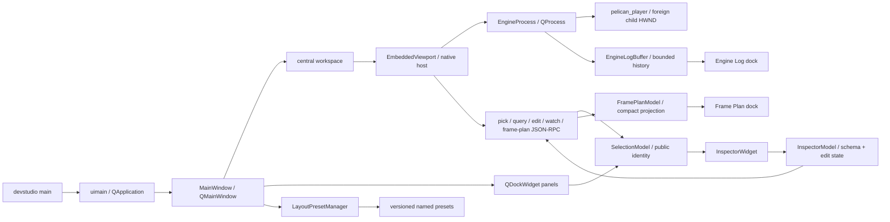

# 第7章 ツール・RPC・テスト

[索引へ戻る](README.md) / [前章](06_rendering_vulkan_shader.md) / [次章](08_class_interface_index.md)

この章では、engine 本体の周辺にある3つの入口を扱います。

- `pelican_cli`: project 作成、asset manifest、外部納品物 import、配布 feature 導出。
- `pelican_studio`: Qt/QML 製の開発 UI。ただし現状は小さな prototype。
- RPC と test: headless engine を外から決定論的に操作し、仕様を固定する仕組み。

## 7.1 `pelican_cli` の全体像

[`src/devcli/main.cpp`](../../src/devcli/main.cpp#L13) は第1引数を見て7系統へそのまま dispatch します。

```text
pelican_cli
├─ assets <manifest|verify|status>
├─ bake-camera ...                       # replayからcameraパスをbake
├─ import <delivery_dir> --project <dir|project.json>   # --rulesサブモード付き
├─ dist-config <project> [--with rpc,seqplayer] [--out file]
├─ project init <directory>
├─ dump-lowered-material ...             # material lowering結果のダンプ
└─ vrm ...                               # VRM semanticのダンプ/検査
```

執筆時点から3系統増えました。

- `bake-camera`([`bakecameracommand.cpp`](../../src/devcli/bakecameracommand.cpp))は入力 replay から camera パスを bake します(player の `--bake-camera-output` と対。テスト: [`run_devcli_bake_camera.cmake`](../../test/run_devcli_bake_camera.cmake))。
- `dump-lowered-material`([`materialcommand.cpp`](../../src/devcli/materialcommand.cpp))は material lowering 結果をダンプします(テスト: [`run_dump_lowered_material.cmake`](../../test/run_dump_lowered_material.cmake))。
- `vrm`([`vrmcommand.cpp`](../../src/devcli/vrmcommand.cpp))は VRM semantic のダンプ/検査です(テスト: [`run_devcli_vrm_dump.cmake`](../../test/run_devcli_vrm_dump.cmake))。
- 既存の `import` には `--rules` サブモード(ルールベース import、[`rulesimport.cpp`](../../src/devcli/rulesimport.cpp) + [`importrules.hpp`](../../src/project/importrules.hpp)、テスト: [`run_devcli_rules_import.cmake`](../../test/run_devcli_rules_import.cmake))と glTF scene 抽出([`gltfsceneextract.cpp`](../../src/devcli/gltfsceneextract.cpp)、テスト: [`run_devcli_gltf_extract.cmake`](../../test/run_devcli_gltf_extract.cmake))が加わりました。

`--rules` から外部ツールを起動する経路のために [`DevCli::runProcess(ProcessOptions)`](../../src/devcli/processrunner.hpp#L34) が追加されました。ヘッダのコメントが規範です。

> Runs one child in its own process group, captures stdout/stderr, and kills the
> complete group on timeout or cancellation. Arguments are filesystem::path so
> Windows callers retain their native UTF-16 representation through CreateProcessW.

`ProcessOptions{executable, arguments, timeout, cancelled, log_path, name}` と `ProcessResult{exit_code, timed_out, cancelled, process_id, stdout_text, stderr_text}` の組で、テストは [`processrunner_test.cpp`](../../test/processrunner_test.cpp) + [`process_fixture_child.cpp`](../../test/process_fixture_child.cpp)、結合は [`run_devcli_import_process.cmake`](../../test/run_devcli_import_process.cmake) です。

command ごとに独立した `run...Command(argc, argv)` を持つ構成で、巨大な application class はありません。argument parse には `argparse`、JSON には `nlohmann::json` を使います。[`src/devcli/CMakeLists.txt`](../../src/devcli/CMakeLists.txt#L1) を見ると、CLI は `pelican_project` へ依存しますが、Vulkan renderer 全体へは依存していません。

## 7.2 `project init`: 実行可能な最小 project の生成器

[`runProjectInitCommand()`](../../src/devcli/projectinit.cpp#L290) は、空であることを確認した directory に template file 群を書きます。template の一覧は [`templateFiles()`](../../src/devcli/projectinit.cpp#L268) にあります。

主な生成物は次です。

| 生成物 | 役割 |
|---|---|
| `project.json` | project schema、basic config、default scene、input actions |
| `scenes/main.scene.json` | 最初の scene |
| `assets/asset_data.json` | model/audio などの asset catalog |
| `input/actions.json` | action map |
| `input/profiles/keyboard.json` | input profile |
| `passes/main_rendering_config.json` | 描画 pipeline preset と feature の選択(次項) |
| `ui/ui_overlay.json` | 2D UI overlay |
| `code/CMakeLists.txt`, `code/game.cpp` | game system を組み込む project code。生成される CMakeLists.txt は `pelican_game_sources()` を呼ぶため、game code は **DLL**(`pelican_game_logic`)としてビルドされます |
| `.gitattributes`, `.gitignore`, `README.md` | asset/LFS と利用案内 |

template は外部 resource file ではなく、[`projectinit.cpp` 内の raw string](../../src/devcli/projectinit.cpp#L88) です。schema を変更した場合、example project だけでなくここも更新しないと、新規 project が古い形式で生成されます。

この command の end-to-end 仕様は [`run_devcli_project_init.cmake`](../../test/run_devcli_project_init.cmake) です。file が揃っているかの確認だけでなく、生成した project directory を **prebuilt の `pelican_player`** に `--headless --frames 2 --render-out` で食わせ、exit 0・出力に `Validation Error` / `VUID-` が出ないこと・PNG が空でないことまで見ます(生成された `code/game.cpp` を build する経路ではありません)。空でない directory を拒否し、そのエラーが directory 名を含むことも同じ script が固定しています。実 device を要するので CTest では `gpu` label 付きです([`test/CMakeLists.txt`](../../test/CMakeLists.txt) の `devcli_project_init_command`)。

### 生成される rendering config は preset 参照になった(WP240a)

`passes/main_rendering_config.json` の template は 111 行の手書き設定から **4 行** になりました([`rendering_config_json`](../../src/devcli/projectinit.cpp#L193))。全文です。

```json
{
  "pipeline": { "preset": "engine://render_pipelines/hybrid_v1.json" },
  "features": ["engine://features/shadow_directional.json"]
}
```

旧 template は `render_targets` 8 本(gbuffer 5 枚 + depth + ssao 2 枚)と `rendering_passes` を自分で書き下し、pass は gbuffer_pass / ssao_pass / ssao_blur_pass / present の 4 つでした。末尾の `present` が `uses_light_data: true` を持ち、ライティングと present を兼ねていました。新 template はこの 2 つの member を **持ちません**。

読む位置が一段動いたのがこの変更の要点です。

- `project init` が **何を書くか** → [`rendering_config_json`](../../src/devcli/projectinit.cpp#L193)(上の 4 行がすべて)
- 生成された project が **実際にどの pass を回すか** → [`src/core/resources/render_pipelines/hybrid_v1.json`](../../src/core/resources/render_pipelines/hybrid_v1.json) と [`src/core/resources/features/shadow_directional.json`](../../src/core/resources/features/shadow_directional.json)

preset 側の `main_render` グラフは deferred_geometry / ssao_pass / ssao_blur_pass / deferred_lighting / forward_opaque / `__snapshot_opaque_color` / `__snapshot_opaque_depth` / forward_transparent / scene_present で、`shadow_depth` は preset ではなく feature 側が足します。つまり新規 project は最初から forward・半透明・opaque snapshot・directional shadow を持ちます。preset と feature をどう解決して 1 本のグラフにするかは[第6章](06_rendering_vulkan_shader.md)の担当です。

テスト側は既存 1 本の拡張と新規 1 本です。どちらも `gpu` label です。

| テスト | 見ているもの |
|---|---|
| `devcli_project_init_command`(既存を拡張。[`run_devcli_project_init.cmake`](../../test/run_devcli_project_init.cmake)) | 生成された config が hybrid_v1 と shadow_directional をちょうど 1 つずつ選び、`render_targets` / `rendering_passes` を **持たない**こと |
| `animgraph_demo_preset_headless_player`(新規。[`run_preset_project_headless.cmake`](../../test/run_preset_project_headless.cmake)) | 同じ preset へ移行した `projects/animgraph_demo` を `--dump-frame-plan` 付きで 3 frame 回し、frame plan に `"graph": "main_render"` と 8 個の node 名が現れること |

後者が数える 8 node は shadow_depth / deferred_geometry / deferred_lighting / forward_opaque / `__snapshot_opaque_color` / `__snapshot_opaque_depth` / forward_transparent / scene_present です(ssao の 2 本は検査に入れていません)。「preset を参照するだけの config が本当に完全なグラフへ展開されるか」を、生成物ではなく実在の project で押さえる位置にいます。禁止 member の検査(`render_targets` / `rendering_passes` が **無い**こと)が両方に入っているのは、preset へ移したはずの記述が config 側へ再び生えてくるのを防ぐためです。

## 7.3 `assets`: store と manifest の保守

入口は [`runAssetsCommand()`](../../src/devcli/assetscommand.cpp#L363) です。project の `asset_stores` と `.pelican/local.json` を読み、store ごとの実 directory と manifest を解決します。

| subcommand | 実装 | 動作 |
|---|---|---|
| `manifest` | [`runManifestCommand()`](../../src/devcli/assetscommand.cpp#L274) | store を走査して manifest と hash cache を更新 |
| `verify` | [`runVerifyCommand()`](../../src/devcli/assetscommand.cpp#L294) | manifest と filesystem を比較。`--full` なら内容も再 hash |
| `status` | [`runStatusCommand()`](../../src/devcli/assetscommand.cpp#L323) | store/manifest/asset の missing と大小文字不一致を軽量確認 |

hash と path の純粋ロジックは [`src/project/assetsmanifest.cpp`](../../src/project/assetsmanifest.cpp#L1)、起動時の runtime 検証は [`src/core/loader/assetsverification.cpp`](../../src/core/loader/assetsverification.cpp#L1) に分かれます。CLI は manifest を「作る・事前確認する」側、core は project 起動時に「利用可能か確認する」側です。

`--full` でない manifest/verify は `.pelican/assets-hash-cache.json` を利用します。file metadata で cache hit できる場合は内容全体を読み直さず、大規模 store の反復確認を軽くします。厳密な配布前確認では `--full` を使う前提です。

仕様テストは [`assetsmanifest_test.cpp`](../../test/assetsmanifest_test.cpp#L1)、[`assetsverification_test.cpp`](../../test/assetsverification_test.cpp#L1)、CLI 結合テストは [`run_devcli_assets.cmake`](../../test/run_devcli_assets.cmake#L1) です。

## 7.4 `import`: 外部 delivery を安全に project catalog へ登録

[`importDelivery()`](../../src/devcli/importcommand.cpp#L337) は、project 内に置かれた delivery directory の `manifest.json` を読みます。大まかな transaction は次です。

```text
project / delivery pathをcanonicalize
  -> deliveryがproject root内か確認
  -> manifest schemaをparse
  -> output pathがdelivery外へescapeしないか確認
  -> 全outputのSHA-256を確認
  -> gltf schemaかつ.glbだけを抽出
  -> asset_data.modelsへ未登録分を追加
  -> asset_data JSONを書き戻す
```

安全性の要点は3つあります。

1. [`resolveProjectFile()`](../../src/devcli/importcommand.cpp#L165) は absolute path、backslash、未知 scheme、`..` による project root escape を拒否します。
2. [`verifyManifestOutputs()`](../../src/devcli/importcommand.cpp#L273) は登録前に全 output の SHA-256 を検証します。途中まで catalog を変更しません。
3. [`registerImportedModels()`](../../src/devcli/importcommand.cpp#L288) は既存の model 名または path と重複すれば skip するため、同じ delivery を再実行しても重複登録しません。

なお「transaction」は catalog 書き換え前の検証順という意味です。file write 自体は [`writeTextFile()`](../../src/devcli/importcommand.cpp#L148) の truncate write であり、temp file + rename の atomic replace ではありません。

manifest の純粋 parser は [`src/project/importmanifest.cpp`](../../src/project/importmanifest.cpp#L1)、fixture 仕様は [`importmanifest_test.cpp`](../../test/importmanifest_test.cpp#L1)、CLI の実 filesystem 動作は [`run_devcli_import.cmake`](../../test/run_devcli_import.cmake#L1) が固定しています。

## 7.5 `dist-config`: project 内容から配布用 feature を導出

[`deriveDistConfig()`](../../src/devcli/distconfig.cpp#L833) は project を静的走査し、配布 build に必要な optional feature を決めます。

| feature | 導出方法 |
|---|---|
| `PELICAN_WITH_VAT` | asset data と import manifest にある GLB の JSON chunk を読み、VAT(Vertex Animation Texture — 頂点ごとの動きをテクスチャへ焼き込んで再生する方式)metadata を検査 |
| `PELICAN_WITH_EXR` | asset/UI JSON 内の `path` / `file` に `.exr` reference があるか走査 |
| `PELICAN_WITH_RPC` | 自動推測せず `--with rpc` で明示 |
| `PELICAN_WITH_SEQPLAYER` | 自動推測せず `--with seqplayer` で明示 |

GLB 候補は asset catalog と project 以下の import manifest の両方から集めます。入口は [`collectAssetDataGlbs()`](../../src/devcli/distconfig.cpp#L370) と [`collectImportManifestGlbs()`](../../src/devcli/distconfig.cpp#L403) です。単に拡張子を見るだけでなく、GLB JSON chunk と VAT primitive metadata を読み、壊れた VAT declaration を「feature なし」として黙殺しない設計です。

結果は [`renderDistConfigPreset()`](../../src/devcli/distconfig.cpp#L867) が `set(PELICAN_WITH_... CACHE BOOL ... FORCE)` 形式の CMake include file にします。各判定の理由も comment へ出るため、「なぜこの依存が配布物に入ったか」を追跡できます。

command line は [`runDistConfigCommand()`](../../src/devcli/distconfig.cpp#L900)、結合仕様は [`run_devcli_dist_config.cmake`](../../test/run_devcli_dist_config.cmake#L1) です。

> 🧩 **難所 — 前方一致では判定しない**([`isWithinRoot()`](../../src/devcli/distconfig.cpp#L121) / [`pathComponents()`](../../src/devcli/distconfig.cpp#L113))
>
> **何をする所か**: 走査中に見つけた参照先が本当に project root の下にあるかを判定します。外れていれば `escapes project root` を投げて `dist-config` ごと失敗させます。
>
> **素朴に読むと**: 見た目は「Windows の大小無視のためにパスをコンポーネント分解している」だけに見えます。しかし本体はサンドボックス判定(外部由来の参照が指定ディレクトリの外を指していないかの検査)で、[`pathString()`](../../src/devcli/distconfig.cpp#L59) の文字列比較にしなかった理由は大小無視ではありません。前方一致だと root `C:/Foo` の下に `C:/Foobar/model.glb` が入っていると判定してしまいます — 一致の境界がたまたま区切り文字と一致しないからです。コンポーネント単位なら `"foo" != "foobar"` で確実に落ちます。Windows で各コンポーネントを小文字化する [`comparableComponent()`](../../src/devcli/distconfig.cpp#L98) は、この比較に付随する処理にすぎません。もう一つの前提は呼び出し側にあります。この関数は `..` を畳まないので、正規化前のパスを渡すと `root/../secret` の先頭コンポーネント列が root と一致し、「root の下」と判定されます。
>
> **骨子**:
> ```text
> isWithinRoot(root, candidate):
>   candidate のコンポーネント数 < root のコンポーネント数 -> false
>   先頭から root のコンポーネント数ぶんだけ 1 対 1 で比較(Windows は小文字化して比較)
>   1つでも不一致 -> false / 全一致 -> true
> ```
>
> **手がかり**: 呼び出しは2箇所だけで、どちらも直前に [`weaklyCanonicalOrThrow()`](../../src/devcli/distconfig.cpp#L70) を通した絶対パスを渡しています — [`resolveProjectRef()`](../../src/devcli/distconfig.cpp#L205) と [`addMaybeExistingGlbCandidate()`](../../src/devcli/distconfig.cpp#L354)。root 側も [`loadProjectFiles()`](../../src/devcli/distconfig.cpp#L270) が `canonicalDirectoryOrThrow()` で正規化済みにしています。つまり `..` を実際に潰しているのは `weakly_canonical` であって `isWithinRoot()` ではありません。
>
> **不変条件**: 両引数は正規化済みの絶対パスであること。これはコード上どこにも明文化されていない暗黙の前提で、新しい呼び出し箇所を足すときの最大の落とし穴です。パスの包含判定に `pathString()` の前方一致を使わない。

## 7.6 Pelican Studio の現在位置

Studio の起点は [`src/devstudio/main.cpp`](../../src/devstudio/main.cpp#L5) です。Qt application を作る [`uimain()`](../../src/devstudio/view/uimain.cpp#L8) から [`MainWindow`](../../src/devstudio/view/mainwindow.hpp#L31) を表示します。

現実装は full editor ではありませんが、Widgets の editor shell として起動します。



[`MainWindow::MainWindow()`](../../src/devstudio/view/mainwindow.cpp#L100) は Project / Outliner /
Inspector / Output / Engine Log / Frame Plan の6パネルを stable object name を持つ dock として作ります。パネルは
移動、float、タブ化でき、`View > Panels` から再表示できます。シェル責務は Widgets に固定し、QML を
追加する場合も `QQuickWidget` に載せた葉パネルの内部だけに限定します。

中央の [`EmbeddedViewport`](../../src/devstudio/viewport/embeddedviewport.hpp#L21) は
`pelican_player` を [`EngineProcess`](../../src/devstudio/viewport/engineprocess.hpp#L24) で別 process
として起動・監視し、実 render window を Qt の native host HWND へ再親付けします。
[`NativeWindowHost`](../../src/devstudio/viewport/nativewindowhost.hpp#L32) が Windows style、parent、
focus、physical-pixel resize だけを扱い、renderer や swapchain を直接再生成しません。したがって
resize は player の通常の GLFW framebuffer callback から既存の Surface/Swapchain epoch 経路へ
入ります。通常の resize は最後の寸法イベントから 50 ms 静止するまで native child を凍結し、
最終 physical extent だけを 1 回適用します。DPR 変更だけは物理画素寸法を壊さないよう即時適用です。
凍結中に child が覆わない部分は native host が黒で自動消去するため、過去の画素は残りません。

player が終了しても Studio は残り、viewport から再起動できます。逆方向は Windows の
kill-on-close Job Object で固定し、player を process 作成時点から所属させます。そのため Studio の
通常終了だけでなく強制終了でも player は残りません。

child の stdout は行単位で JSON-RPC 応答と通常出力に分け、stderr は別 channel のまま読みます。
対応する request id の応答だけを RPC signal へ送り、通常 stdout と stderr は一つの未切り詰め
output signal として viewport 経由で Engine Log dock へ送ります。RPC は 5 秒で明示 timeout し、
process 終了時も pending request を失敗にするため、入力 pipe や feature の問題を黙殺しません。
[`EngineLogBuffer`](../../src/devstudio/viewport/enginelogbuffer.hpp#L7)
は UTF-8 換算 1 MiB の末尾だけを保持し、通常は最古の途中行も捨てます。この大きさは診断用の長い
履歴を残しながら、model と `QPlainTextEdit` に複製される text の常駐量を長時間起動でも制限するため
です。単一の巨大行だけでも末尾を残し、UTF-8 の途中 byte から復号しません。上限規則と両 stream の
到達は [`devstudio_viewport_test.cpp`](../../test/devstudio_viewport_test.cpp#L99) が view 表示なしで検査します。

[`FramePlanModel`](../../src/devstudio/model/frameplanmodel.hpp) は `get_frame_plan` の
`pelican.frame_plan` v1 応答を、順序付き pass / compute task、入出力と履歴入力、resource、barrier、
attachment load/store、material route、backend 非依存 execution facts へ縮約する Qt 非依存 model です。
6,000 行級になる raw 応答や `physical_target_plan` 全体は保持せず、ImGui Plan Viewer と同じ調査の
入口になる項目だけを値型へ写します。attachment ops と resource format は公開応答内の
`physical_target_plan.attachments/resources` から昇格しますが、native scope、alias、physical decision
など Compiled Plan Viewer 相当の低レベル情報は UI へ出しません。

[`FramePlanWidget`](../../src/devstudio/view/frameplanwidget.hpp) はその model を Passes / Resources /
Barriers / Materials の tree に投影します。初期状態は順序、名前、種別、入力、出力の pass 行だけで、
attachment ops、resource use、material filter、前後 barrier は折りたたみ配下です。filter も全 tree の
要約と子項目に掛かるため、raw JSON を全部展開しなくても流れを追えます。取得契機は **player の RPC が
利用可能になった直後の1回と Refresh ボタンだけ**です。毎 frame の取得は大きな JSON の pipe 転送、
二度の parse、tree 再構築を描画周期ごとに行うため採りません。hot reload 後など変化を確認したい時は
明示 refresh します。player 未起動・停止・RPC 失敗は空表示にせず、理由と再開方法を status 行へ出し、
停止時には古い snapshot も消します。応答からの構造化と current-version-only 検証は
[`devstudio_frameplan_test.cpp`](../../test/devstudio_frameplan_test.cpp) が GUI なしで固定します。

[`LayoutPresetManager`](../../src/devstudio/layoutpreset.hpp#L26) は view から独立した Qt Core の
ライブラリです。ファイル版と `QMainWindow` state 版をともに現行値へ固定し、版違い、破損、Qt に
よる state 拒否のどれでも saved state を適用せず既定配置 callback へ落とします。全体 preset は
`QStandardPaths::AppConfigLocation/layouts` に置き、project 単位の `user://` resolver には触れません。
保存・復元・fallback と WP249 の4 dock state、WP263 の5 dock state を6 dock 構成で読めることは
[`Saved devstudio layouts remain restorable as later docks are added`](../../test/devstudio_layoutpreset_test.cpp#L88)
が画面表示なしで検査します。新 dock 追加のたびに state 版を上げないため、保存時に存在しなかった
stable object name は Qt が既存 dock の復元とは独立に扱い、既定配置に残ります。

リンク面では [`pelican_assert_link_boundary()`](../../cmake/devstudio_link_boundary.cmake#L72) が
`pelican_project` の直接リンクを必須にし、`src/core` 配下 target への推移 link path を configure
時に拒否します。[`devstudio_d0_boundary_negative`](../../test/run_devstudio_boundary_negative.cmake#L1)
は wrapper target 経由の `pelican_core` も拒否されることを固定します。これは「Studio だけが使える
engine 内部面」を偶然持ち込めないようにする D0 の build-level gate です。

[`ProjectOutlinerModel`](../../src/devstudio/model/project.hpp#L34) は view と Qt から独立した読み取り専用
model です。`pelican_project` の project envelope、純粋 path resolver、sceneformat 検証を使って
project と scene 文書を開き、scene と object の木を作ります。object の同一性は名前ではなく
`(scene_id, declaration_index)` で、無名 object の表示名だけを engine と共有する
`pelican://scene/<id>/authoring-object/<n>` 規則から作ります。

[`MainWindow::populateOutliner()`](../../src/devstudio/view/mainwindow.cpp#L250) は model の索引を Qt item の
data role に保持して Outliner dock へ写すだけです。project 読み込みと 2 scene・46/2 object、無名
object の非圧縮、親子投影は [`devstudio_outliner_test.cpp`](../../test/devstudio_outliner_test.cpp#L62) が
GUI なしで検査します。RPC の `scene_tree` / `get_components` も 0 始まりの
`declaration_index` を返すため、直リンク木と RPC 木は `(scene_id, declaration_index)` で
対応付けられます。

[`SelectionModel`](../../src/devstudio/model/selection.hpp) は view/Qt から独立し、選択をこの公開
identity 1 個だけで保持します。viewport pick と Outliner のどちらも同じ instance を更新し、
`EmbeddedViewport` もコピーせず非所有参照します。遅い pick が新しい Outliner 選択を巻き戻さない
revision、背景での解除、feature/RPC 失敗時の選択維持を純粋 model で決めています。選択は engine の
共有 game state ではなく client-session の focus なので、Studio 専用 API は作りません。別ツールも
`pick_object` と同じ identity だけで同じ意味論を実装できます。

[`InspectorModel`](../../src/devstudio/model/inspectormodel.hpp) も view/Qt から独立した公開 RPC client
です。選択の `(scene_id, declaration_index)` を `scene_tree` の `authoring_object_id` へ解決してから
`get_components` を読み、component 応答の `schema.fields` だけから整数、浮動小数、真偽、列挙、文字列、
vector、quaternion の [`InspectorWidgetDescriptor`](../../src/devstudio/model/inspectormodel.hpp) を作ります。
component 名や transform の field 名を view 側で型判定しません。

数値操作は `open_preview` / `update_preview` / `commit_preview`、通常の確定操作は `edit` を使い、
`get_preview_result` / `get_edit_result` が terminal success を返すまで accepted を成功表示しません。
`undo` / `redo` も同じ actor と scene revision で送ります。watch token は idle 時だけ 500 ms ごとに
問い合わせ、preview 保持中、widget 編集中、または直接編集の terminal result 待ちでは refresh を保留します。既に飛んでいた
`get_components` 応答が編集中に戻った場合も捨て、解除後に取り直します。一方、idle 時の token 変更は
通常どおり再取得するため、巻き戻り防止と外部変更反映を分けています。これらの状態遷移は
[`devstudio_inspector_test.cpp`](../../test/devstudio_inspector_test.cpp) が GUI なしで検査します。

[`InspectorWidget`](../../src/devstudio/view/inspectorwidget.hpp) は descriptor の `kind` を Qt control へ
投影するだけで、engine 内部 symbol を使いません。同じ child process の RPC transport を
`EmbeddedViewport` から借りるため、別 editor runtime は作られません。windowed player は通常 loop で
毎 frame `updateFrameState()` を通るので、RPC queue に accepted された編集は次の player frame で適用され、
viewport の描画へ到達します。

project を開くと viewport は同じ root を `--rpc --project` で再起動します。native child 上の
左クリックを物理 client 座標へ変換し、`EngineProcess` の stdio JSON-RPC から `pick_object` を
呼びます。成功は Outliner と Inspector に反映し、背景なら解除します。picking feature が無い場合は
選択を維持し、viewport/status/log に有効化方法を明示します。property 編集は Inspector から同じ
child の編集 RPC へ接続済みで、枠線と gizmo は後続です。
同期、無名 object、stale 応答、背景、feature 無効の意味論は
[`devstudio_outliner_test.cpp`](../../test/devstudio_outliner_test.cpp) が headless に固定し、stdio の
応答/通常 log 分離は [`devstudio_viewport_test.cpp`](../../test/devstudio_viewport_test.cpp) が検査します。

> **設計決定:** **エンジン側の編集面 — 編集 RPC 23 メソッド(§7.7)と ImGui inspector / asset browser(§7.12) — が正準です**。Qt Inspector も別の編集実装を持たず、その RPC を呼ぶ公開 client です。ImGui は同じ [`EditorCommandService`](../../src/core/communication/editorcommandservice.hpp#L222) を process 内 adapter から呼びますが、Studio は `pelican_project` と JSON-RPC だけへリンクする D0 境界を保ちます。

## 7.7 JSON-RPC を2層に分けて読む

RPC は build option `PELICAN_WITH_RPC` で切り替わります。無効時は stub が「未対応」を明示します。

有効時の起動形態は **2 つ**になりました(WP156 / E-HOST0)。`--rpc` はもう `--headless` を要求しません。

| 形態 | 起動 | 動作 |
|---|---|---|
| headless RPC | `--rpc --headless` | `Loop` が通常 loop の代わりに [`runEngineRpcServer(std::cin, std::cout)`](../../src/core/communication/rpcserver.hpp#L101) を実行し、EOF までブロックする |
| windowed RPC | `--rpc`(headless なし) | 通常の描画 loop を回しつつ、[`WindowedRpcHost`](../../src/core/communication/rpcserver.hpp#L78) が **フレーム境界でのみ** リクエストを処理する |

詳細な frame 境界の位置は [第2章](02_runtime_lifecycle.md)を参照してください。windowed RPC では ImGui UI が無効になる点は §7.12 と [第9章](09_black_magic_and_gotchas.md)で扱います。

### protocol 層: `pelican_project`

[`jsonrpc.hpp`](../../src/project/jsonrpc.hpp#L13) と [`jsonrpc.cpp`](../../src/project/jsonrpc.cpp#L148) は engine module を知りません。

- JSON-RPC 2.0 request の parse。
- `-32700` parse error、`-32600` invalid request、`-32601` method not found、`-32602` invalid params、`-32000` application error、`-32010` RenderDoc capture error。
- success/error response の serialize。
- injected input/event parameter の純粋 parse。

この層は Vulkan なしで [`jsonrpc_test.cpp`](../../test/jsonrpc_test.cpp#L33) から直接テストできます。

### engine binding 層: `pelican_core`

[`RpcServer`](../../src/core/communication/rpcserver.hpp#L39) は `istream` / `ostream` と method handler map を持ちます。1行を1 request とし、[`handleLine()`](../../src/core/communication/rpcserver.cpp#L795) で parse → handler → response serialize を行います。[`run()`](../../src/core/communication/rpcserver.cpp#L831) は EOF まで1行ずつ読み、必ず1行の response を flush します。1行だけを処理する [`processLine()`](../../src/core/communication/rpcserver.cpp#L791) が公開されているのが windowed 経路の土台です。

transport が socket ではなく stream interface なのがポイントです。production 起動では stdin/stdout、unit test では stringstream を差し替えられます。

その上に 2 つの class が乗ります。

| class | 役割 |
|---|---|
| [`EngineRpcEndpoint`](../../src/core/communication/rpcserver.hpp#L60) | 「1 個の状態付きエンジン RPC ディスパッチャを所有」。headless は `run()`、windowed host は frame 境界でだけ `processLine()` を呼ぶ |
| [`WindowedRpcHost`](../../src/core/communication/rpcserver.hpp#L78) | `processFrameBoundary()` / `queuedRequestCount()` / `readerFinished()`。reader スレッドは行を **queue へ積むだけ**で、dispatch は engine スレッドが行う |

キュー容量は [`defaultWindowedRpcQueueCapacity = 64`](../../src/core/communication/rpcserver.hpp#L99) です。溢れたリクエストには reader スレッドが即座に `-32000` を返します(`data.reason == "busy"`)。

[`JsonRpcHandlerError`](../../src/core/communication/rpcserver.hpp#L28) には構造化 `data` が付きました([3 引数コンストラクタ](../../src/core/communication/rpcserver.hpp#L34)、取得は [`data()`](../../src/core/communication/rpcserver.hpp#L36))。`capture_gpu` 失敗時の実例です([`EngineRpcEndpoint::EngineRpcEndpoint()`](../../src/core/communication/rpcserver.cpp#L1295))。

```cpp
throw JsonRpcHandlerError{
    JsonRpcErrorCodes::renderDocCaptureError,
    "capture_gpu failed: " + std::string{error.what()},
    {{"reason", error.reason()},
     {"state", renderDocCaptureStateName(state.state)},
     {"source", "rpc"}}};
```

engine method の登録は [`runEngineRpcServer()`](../../src/core/communication/rpcserver.cpp) に集約されています。現在 **44 メソッド**で、うち 23 が編集系です。

#### 実行制御・診断系(21)

| method | 実装行 | 状態変更 |
|---|---|---|
| `reload_game_logic` | [再ロード](../../src/core/communication/rpcserver.cpp#L870) | game DLL(`pelican_game_logic`)を再ロード |
| `get_status` | [状態取得](../../src/core/communication/rpcserver.cpp#L897) | instance、project、scene、frame/time、seed、store 状態と各種診断を返す |
| `set_seed` | [seed 設定](../../src/core/communication/rpcserver.cpp#L1067) | deterministic RNG を reseed |
| `set_input_profile` | [profile 切替](../../src/core/communication/rpcserver.cpp#L1075) | input profile を切替 |
| `inject_input` | [入力注入](../../src/core/communication/rpcserver.cpp) | canonical input queue へ key/mouse/axis event を積む |
| `start_input_record` / `stop_input_record` | [記録開始](../../src/core/communication/rpcserver.cpp#L1099) / [記録終了](../../src/core/communication/rpcserver.cpp#L1111) | 入力記録の開始/終了 |
| `start_input_replay` / `stop_input_replay` | [再生開始](../../src/core/communication/rpcserver.cpp#L1123) / [再生終了](../../src/core/communication/rpcserver.cpp#L1147) | 入力再生の開始/終了。開始側は再生だけでなく `EngineTime` を記録時 fps の fixed step へ切り替え、reload gate を閉じ、preview lease を強制 abort します |
| `inject_event` | [event 注入](../../src/core/communication/rpcserver.cpp) | 名前から登録済み event layer へ JSON payload を積む |
| `set_time` | [時刻設定](../../src/core/communication/rpcserver.cpp#L1174) | time を直接設定。frame index は進めない |
| `update_transforms` | [pending 積み](../../src/core/communication/rpcserver.cpp#L1181) | update を pending queue へ積む |
| `load_gltf` | [glTF 追加](../../src/core/communication/rpcserver.cpp) | transient glTF を scene に追加 |
| `load_scene` | [scene 差替](../../src/core/communication/rpcserver.cpp#L1201) | scene を clear/load、pending transforms を破棄 |
| `set_camera` | [camera 指定](../../src/core/communication/rpcserver.cpp#L1195) | 名前付き object を active camera にする |
| `step_frame` | [1 tick 進行](../../src/core/communication/rpcserver.cpp#L1180) | pending flush → time advance → 5 phase update → render |
| `render_frame` | [再描画](../../src/core/communication/rpcserver.cpp#L1231) | time/frame を進めず、pending flush → seq update → render |
| `capture_gpu` | [GPU 捕捉](../../src/core/communication/rpcserver.cpp) | `render_frame` と同型の1回描画を明示 Start/End で capture し、新規 index の `.rdc` path を返す |
| `get_frame_plan` | [plan 取得](../../src/core/communication/rpcserver.cpp#L1231) | planner の JSON を返す |
| `pick_object` | [ID 読み出し](../../src/core/communication/rpcserver.cpp) | feature が作った `picking_id` の左上原点座標を同期読み出しし、同一フレーム token を WP258 の宣言 identity へ解決 |
| `capture` | [`EngineRpcEndpoint::run()`](../../src/core/communication/rpcserver.cpp#L1305) | 最後の frame を PNG 保存 |

`set_seed` と replay は役割が別です。`set_seed` は `DeterministicRng` の種を撒き直すだけで、時間の刻みも入力も固定しません。再現可能な実行は「seed」「fixed step の時間」「記録済み入力」の3つが揃って初めて成立し、後ろ2つを与えるのが `start_input_replay` です。

#### 編集系(23) ✅実装済み(WP153〜WP172)

すべて [`EditorCommandRpcAdapter`](../../src/core/communication/editorcommandservice.hpp#L291) へ委譲され、実体は [`EditorCommandService`](../../src/core/communication/editorcommandservice.hpp#L222) です。

| method | 実装行 | 概要 |
|---|---|---|
| `scene_tree` | [木の取得](../../src/core/communication/rpcserver.cpp#L984) | オブジェクト木(`authoring_object_id` + 0 始まりの `declaration_index`)と component メタデータ |
| `get_scene_revision` | [revision 取得](../../src/core/communication/rpcserver.cpp#L987) | `EditorWatchToken{scene_revision, preview_epoch}` + 最終トランザクション + preview lease |
| `get_components` | [component 取得](../../src/core/communication/rpcserver.cpp#L990) | 1 オブジェクトの `declaration_index` + authored / runtime JSON + schema |
| `list_assets` | [asset 一覧](../../src/core/communication/rpcserver.cpp#L993) | asset カタログ(`id` / `kind` / `path` / `store` / `status`) |
| `export_scene_snapshot` | [書き出し](../../src/core/communication/rpcserver.cpp#L996) | semantic scene bytes + sha256 digest |
| `import_scene_snapshot` | [取り込み](../../src/core/communication/rpcserver.cpp#L999) | digest 検証つき置換 |
| `save_scene` | [原子的保存](../../src/core/communication/rpcserver.cpp#L1007) | 原子的な全文書保存 |
| `open_editor_session` / `resume_editor_session` | [session 開始](../../src/core/communication/rpcserver.cpp#L1018) / [session 再開](../../src/core/communication/rpcserver.cpp#L1021) | actor 登録・再接続 |
| `can_edit` / `can_preview` | [編集可否](../../src/core/communication/rpcserver.cpp#L1024) / [preview 可否](../../src/core/communication/editorrpchandlers.cpp#L99) | 編集ゲート判定 |
| `eval_preview` | [局所評価](../../src/core/communication/rpcserver.cpp#L1030) | 公開せずリクエストローカルに評価 |
| `render_preview` | [preview 描画](../../src/core/communication/editorrpchandlers.cpp#L105) | preview グラフでキャプチャ(第6章 §6.19) |
| `edit` | [コマンド適用](../../src/core/communication/rpcserver.cpp#L1036) | 正準コマンド列の適用(`base_revision` による CAS。ズレていれば `stale_revision` で弾きます) |
| `undo` / `redo` | [`internal::selectInputProfile()`](../../src/core/communication/rpcserver.cpp#L1039) / [redo の登録](../../src/core/communication/rpcserver.cpp#L1042) | actor 単位 |
| `open_preview` / `update_preview` / `commit_preview` / `abort_preview` | [lease 発行](../../src/core/communication/editorrpchandlers.cpp#L117) 〜 [lease 破棄](../../src/core/communication/editorrpchandlers.cpp#L126) | preview ticket(lease)の発行・更新・確定・破棄 |
| `get_edit_result` / `get_preview_result` | [edit 結果](../../src/core/communication/editorrpchandlers.cpp#L129) / [preview 結果](../../src/core/communication/rpcserver.cpp#L1060) | 非同期結果取得 |
| `query_journal` | [journal 照会](../../src/core/communication/rpcserver.cpp#L1063) | ジャーナル照会 |

> 🧩 **難所 — 曖昧な重なり判定**([`stablePathsOverlap()`](../../src/core/communication/editorjournal.cpp#L1581) / [`structuralDomainsOverlap()`](../../src/core/communication/editorjournal.cpp#L1652) / [`recordOverlaps()`](../../src/core/communication/editorjournal.cpp#L1676))
>
> **何をする所か**: 上の表のうち `edit` / `undo` / `redo` / `*_preview` が共通で踏む土台です。2つの編集(あるいは編集とpreview lease)が同じ対象を触っているかを、安定パス集合(`write_set`)と構造ドメイン(`structural_domain`)の2系統で判定します。
>
> **素朴に読むと**: 「同じ `object_id` なら衝突」で済みそうに見えます。しかし編集の影響範囲は3種類あって表現が違います — 値編集はパス(`/authoring_objects/7/components/transform/pos`)、構造編集は集合(部分木のobject群・宣言index群・名前予約)、親子付け替えは辺(child / old_parent / new_parent / descendants)。`stablePathsOverlap` が**接頭辞一致**を取り、しかも境界が `/` であることを明示的に確かめているのはこのためです。単なる `starts_with` にすると `/a/b` と `/a/bc` が衝突扱いになってundoが通らなくなり、逆に完全一致だけにすると `.../transform` の付け替えと `.../transform/pos` の値編集がすり抜けて静かにロストアップデート(lost update — 2つの更新が重なったとき、片方の変更が気づかれないまま上書きされて消えること)します。`structuralDomainsOverlap` が名前と宣言indexを**同一scene内でのみ**比較するのも同様で、sceneが違えば同名でも別物です。判定は意図的に保守側(疑わしきは衝突)に倒してあります。
>
> **骨子**:
> ```text
> recordOverlaps(record, writes, domains):
>   record.write_set × writes         で stablePathsOverlap が真 -> 衝突
>   record.structural_domain × domains で structuralDomainsOverlap が真 -> 衝突
> structuralDomainsOverlap(l, r):
>   object集合(object/root/child/old_parent/new_parent/objects/descendants)が交差 -> 真
>   同一 scene_id なら name_reservation と declaration_index の交差も見る
>   両方が component_slot|value_field で object と slot が同じ -> 真
> ```
>
> **手がかり**: [`domainObjects()`](../../src/core/communication/editorjournal.cpp#L1590) が拾うキー名の一覧は、**op の `kind` ごとに違うフィールド名の総和**です — `value_field` / `component_slot` は `object`、`object_existence`(spawn)はプリフライト後に埋め戻される `object`、`object_subtree`(destroy)は `root` と配列 `objects`、`parent_edge`(reparent)は `child` / `old_parent` / `new_parent` と配列 `descendants`。単数フィールドと配列フィールドを別扱いで読むので、新しいopを足すときにここへ追記するのは、**そのopが既存にない名前でobject IDを持つ場合だけ**です。粒度が意図的に不揃いな例として、spawnの `write_set` は `/scenes/<id>/objects` という**粗い**パス、`read_set` は `/scenes/<id>/name_reservations/<name>` という細かいパスです。behaviorは [`stableBehaviorTarget()`](../../src/core/communication/editorjournal.cpp#L486) がhandleがあれば `handles/<h>`、無ければ `indices/<i>` を使い分けます(indexは他の編集でずれるのでhandle優先)。テストは [`WP161 writer history supports multi-level undo and redo on one path`](../../test/editorjournal_test.cpp#L558) / [二アクター重なりの事例](../../test/editorjournal_test.cpp#L662)。
>
> **不変条件**: 判定は保守側へ倒す(検出漏れは静かなロストアップデート、過検出は明示的な `undo_conflict` / `preview_lease_conflict` で済む)。パス比較は必ず `/` 境界を見る。

> **設計決定:** 編集セッションを production で組み立てるのは [`makeEditorRuntimeService()`](../../src/core/communication/editorruntimefactory.hpp#L25) の 1 箇所だけです。RPC endpoint と interactive ImGui runtime の **どちらか一方** が使い、決定的ドライバ(golden / replay)は interactive runtime を作らないため編集面自体が存在しません。ticket・CAS・ゲートの落とし穴は [第9章](09_black_magic_and_gotchas.md)を参照してください。

> 🧩 **難所 — `edit` の逐次プリフライト**([`prepareBatch()`](../../src/core/communication/editorjournal.cpp#L1241))
>
> **何をする所か**: `edit` の生 operation 配列を、正準forward / inverse・安定ターゲット・read/write set を持つ `PreparedOperation` 列へ変換します。その過程で各 operation を**使い捨ての文書**へ本物の `EditorProjectionTransaction` で実際に適用してみます。
>
> **素朴に読むと**: 「なぜ同じコマンドを二度実行するのか」が最大の壁です。理由は3つあります。(1) N番目のoperationは 0..N-1 適用後の文書を見なければ正しく準備できません(spawnした直後に同じobjectへsetする、など)。(2) [`makeReplaceComponentCommand()`](../../src/core/communication/editorjournal.cpp#L283) のようなコマンドのラムダは準備時の `object_index` / `component_index` を**値でキャプチャ**していて、実行時にその位置が別物なら `"stable component location disappeared"` を投げます — プリフライトはこの整合を受理前に確かめる場です。(3) spawnの `AuthoringObjectId` は文書側の割り当て器が決めるので、**プリフライトを通すまで確定しません**。だから `structural_changes` から `Insert` を探して `forward["object_id"]` と inverse の `object_ids` を後から埋め戻します。live文書を汚さないのは [`LocalDocumentTarget`](../../src/core/communication/editorjournal.cpp#L435) が `source.stage(source.rawJson(), revision+1)` でコピーを作るからで、adapter配列が空のままcommitしているのが「文書だけの試行」の印です。
>
> **骨子**:
> ```text
> local = LocalDocumentTarget(source)          # revision+1 の使い捨てコピー
> for raw in operations:
>     prepared = prepareRpcOperation(raw, local.projectionDocument(), scene)
>     result   = EditorProjectionTransaction(local, ...).commit(prepared.commands, {})
>     未commit -> projectionFailure(受理前に型付き失敗へ変換)
>     spawn   -> Insert から object_id を確定して埋め戻す
>     destroy -> removed_objects を declaration_index 昇順に並べて inverse.closures へ
> batch.inverse = reverse(各 prepared.inverse)
> ```
>
> **手がかり**: 並び順が2つ出てきますが、向きが違うのは**対象が forward と inverse で別だから**です。[`subtreeObjects()`](../../src/core/communication/editorjournal.cpp#L916) が並べるのは forward の削除命令列で、`object_index`(scene内の宣言index)の**降順** — 後ろから消さないと残りのindexがずれます。closuresが並ぶのは inverse(`restore_objects`)の再生順で、`declaration_index` の**昇順** — 前から挿し戻さないと同じ理由でずれます。「indexで位置を指すリストは末尾から消し、先頭から挿す」という一つの規則の表と裏で、逆向きに見えるのはそのためです。`normalizeBehaviorAttachmentIdentities()` は `prepareBatch` の**前**に走り、`base_revision+1` とcommand index / attachment index の三つ組からhandleとseqを採番します(同じ入力なら同じidentity)。テストは [`editorjournal_test.cpp` 内](../../test/editorjournal_test.cpp#L451)「JOURNAL0 is complete and mechanical replay is three-way equivalent」。
>
> **不変条件**: プリフライトはlive文書とliveランタイムに副作用を持たない。inverseは必ずforwardの逆順。spawnの `object_id` は必ずプリフライト結果から取る(自前で採番しない)。

> 🧩 **難所 — undo前提の三段検証**([`requireRevertPreconditions()`](../../src/core/communication/editorjournal.cpp#L2007))
>
> **何をする所か**: `undo` / `redo` を「逆命令の普通のトランザクション」として実行してよいかを、実行前に3つの独立した条件で検査します。
>
> **素朴に読むと**: undoは「巻き戻し」ではなく**前向きの新規トランザクション**です。対象のjournal recordを書いた後に誰かが同じ領域を触っていたら、逆命令を流すと他人の編集を消します。ところが検査が3つあり、それぞれ別のすり抜けを塞いでいるのが読みにくい箇所です。(1) journal走査 — `source` より後のrevisionで、かつ**別actor**のrecordが重なっていたら衝突(同一actorをスキップするのは、自分の連続編集を自分でundoできなくしないため)。(2) `last_writers` — write pathごとの最終書き手が、いま巻き戻そうとしている record の**トランザクションそのもの**(actorではなく `transaction_id` 一致)でなければ衝突。(1)がrecord単位なのに対しこちらは**パス単位の最終書き手**なので、同一actorが別ticketで上書きした場合も拾えます。(3) `postconditionsHold` — 実行時に採取した `forward_postcondition` と、いまの文書から再計算した `targetState` の厳密比較。ここだけが「journalに現れない経路(reload・import・save後)で文書が変わった」を検出できます。どれか一つでも落とすと、undoが他人の編集を静かに巻き戻します。
>
> **骨子**:
> ```text
> for candidate in journal:
>     candidate.revision <= source.revision または actor が同じ -> skip
>     recordOverlaps(candidate, source.write_set, source.structural_domain) -> undo_conflict
> for write in 各 command.write_set:
>     last_writers[write].transaction_id != source.transaction_id -> undo_conflict
> postconditionsHold(source, document()) が偽 -> undo_conflict
> ```
>
> **手がかり**: `throwUndoConflict()` のpayloadは `{domain, owner_txn, revision}` で、`domain` は「衝突した領域」を人が読める形で示すための欄です。渡す値は呼び出し側ごとに違い、(1)(3)は record 全体を代表させて `structural_domain` の**先頭要素**(空なら `write_set` 全体)、(2)は落ちた command 自身の `structural_domain` です。どれも「誰が何を触ったせいでundoできないか」をクライアントが出すための材料です。undo / redo スタックの先頭が対象トランザクションと一致するかの検査は別にあり、受理時([`enqueueRevert`](../../src/core/communication/editorjournal.cpp#L2846))と実行時([`commitPending`](../../src/core/communication/editorjournal.cpp#L2500))の**二重**になっています。テストは [`WP161 actor undo and redo are ordinary atomic transactions`](../../test/editorjournal_test.cpp#L519) / [`WP161 writer history supports multi-level undo and redo on one path`](../../test/editorjournal_test.cpp#L558) / [二アクター重なりの事例](../../test/editorjournal_test.cpp#L662)。
>
> **不変条件**: 3検査はAND。順番は変えてよいが、どれも消してはいけない。undoが成功したら `undo_stack.pop_back()` と `redo_stack.push_back()` は必ず対で動かす(片方だけだとredoが別トランザクションを指します)。

> 🧩 **難所 — preview leaseの状態機械**([`commitPendingPreview()`](../../src/core/communication/editorjournal.cpp#L2259) / [`forceAbort()`](../../src/core/communication/editorjournal.cpp#L2229))
>
> **何をする所か**: `open_preview` / `update_preview` / `commit_preview` / `abort_preview` をフレーム境界でまとめて処理し、lease(排他権)の取得・維持・破棄と、外部要因による強制破棄を行います。
>
> **素朴に読むと**: 状態が `preview_reservation`(受理済み・未開通) / `preview_lease`(開通中) / `preview_tombstones`(終了済み)の3つに分かれ、遷移が「受理時」と「フレーム境界」の2箇所にまたがっています。予約が要るのは、`open_preview` を受理してから実際に開くまでの間に別actorの `open_preview` や重なる `edit` を通してはいけないからで、`conflictingLease()` はleaseとreservationの**両方**を見ます。失敗経路で予約を消し忘れるとpreviewが永久に開けなくなるため、明示的な `reset()` が各失敗経路に置かれています。tombstone(実体を消しても「このticketは確かに存在して終了した」という痕跡だけを残すレコード)は `abort_preview` の冪等性 — 同じ操作を何度行っても結果が変わらない性質 — のためで、既に終了したticketへのabortは「成功 + `final_status`」を返します。`forceAbort()` が `noexcept` で、leaseが無いときも失敗したときも `false` を返すだけなのは、ゲート閉鎖・シーン遷移・base revision陳腐化のいずれからも呼ばれるからです。呼び出し元の [`commitPending()`](../../src/core/communication/editorjournal.cpp#L2500) 自体が `noexcept` のフレーム境界フックとして登録されていて、ここから例外が漏れれば `std::terminate` でプロセスごと落ちます(「フレームの一部だけ失敗する」ではありません)。だから `forceAbort()` の唯一の逃げ道は `false` を返して次のフレーム境界に委ねることです。
>
> **骨子**:
> ```text
> commitPending():                                   # フレーム境界フック
>   commitPendingPreview()
>   lease あり かつ (ゲート閉 or scene が変わった) -> forceAbort(理由)
>   ticket ごとにゲートepoch / scene id / base revision を受理時の値と再照合
>   edit 成功後に lease が残っていれば forceAbort("base_revision_stale")
> commitPendingPreview():
>   open   : lease 占有中なら preview_lease_busy、成功で reservation -> lease、epoch++
>   update : 所有者一致 + write_set が完全一致(sameStableSet)でなければ拒否
>   commit : base revision 不一致なら reject して即 forceAbort("stale_revision")
>            一致すれば journal へ確定し、tombstone を置いて lease を落とす
>   abort  : ライブ状態を committed へ復元し、tombstone を置いて lease を落とす
> ```
>
> **手がかり**: [`gateSnapshot()`](../../src/core/communication/editorjournal.cpp#L1885) は観測値が変わったときだけ `gate_epoch` を進めます。つまりepochは「ゲートの状態が変わった回数」であって時刻ではなく、受理時epochと実行時epochの比較が「閉じて開き直した」ケースも捕まえます。[`sameStableSet()`](../../src/core/communication/editorjournal.cpp#L1719) が完全一致を要求するのでupdateでleaseの範囲を広げられません(広げられると、受理時に通した衝突判定の結論が後から嘘になります)。[`requireLivePreviewCapability()`](../../src/core/communication/editorjournal.cpp#L1704) は transform / light の `set_component_value` 以外を全部弾きます。テストは [`editorjournal_test.cpp` 内](../../test/editorjournal_test.cpp#L691)(lease matrix)と [開通後の runtime 検証](../../test/editorjournal_test.cpp#L766)。
>
> **不変条件**: `forceAbort()` の内部でthrowさせない。予約は成功でも失敗でも必ず落とす。leaseの `write_set` はopenで確定しupdateで変えない。editがcommitしたらpreview leaseは必ず落とす。

> 🧩 **難所 — previewの状態不変性検証**([`isolated()`](../../src/core/communication/editorpreviewservice.cpp#L144) / [`requireStateUnchanged()`](../../src/core/communication/editorpreviewservice.cpp#L131))
>
> **何をする所か**: `eval_preview` / `render_preview` の前後で共有エンジン状態のスナップショットを取り、**厳密一致**しなければ `state_changed` を投げます。成功時も例外時も検査します。
>
> **素朴に読むと**: `before != after` の一行に見えますが、二点が効いています。第一に、catch側でも検査してから元の例外を再送出します。検査が落ちれば元の例外は**捨てられ** `state_changed` に置き換わります。これは意図的で、「リクエストが失敗した」より「エンジン状態を汚した」の方が重い障害だからです。ここを「元の例外を優先」に直すと、状態漏れが失敗の陰に隠れます。第二に、比較が寛容な近似ではなく `OrderedJson` の完全一致であることです。previewは [`prepareEditorPreviewProjection()`](../../src/core/loader/editorpreviewprojection.cpp#L676) が `stage()` した文書を**公開しない**ことで成立していて、浮動小数1ビットの差でも「どこかで公開してしまった」の証拠になります。
>
> **骨子**:
> ```text
> isolated(method, snapshot, invoke):
>     before = snapshot()
>     try:   result = invoke(); requireStateUnchanged(before, snapshot()); return result
>     catch: failure = current_exception()
>            requireStateUnchanged(before, snapshot())   # ここで throw したら元例外は失われる
>            rethrow(failure)
> ```
>
> **手がかり**: 両メソッドはゲートを**2回**消費します(受理時のepochを実行直前に照合するので、prepare中に閉じて開き直したゲートも捕まります)。`prepareEditorPreviewProjection()` のコメント「候補revisionを使うが決してpublishしない」が、この検査が守っている性質そのものです。`projection_fault_hook` / `execution_fault_hook` はprepareやqueryの途中で任意にthrowさせる注入点で、テストはこれで「途中で失敗しても状態が動かない」を叩きます([`editorpreview_test.cpp` 内](../../test/editorpreview_test.cpp#L178) / [`editorpreviewprojection_test.cpp` 内](../../test/editorpreviewprojection_test.cpp#L131))。
>
> **不変条件**: preview経路は `SceneRevision` を進めない。例外経路でも状態検査を通す(状態漏れの報告が元エラーより優先)。

### `get_status` の応答

[`get_status`](../../src/core/communication/rpcserver.cpp#L873) は診断のハブです。既存の `reload.runtime.pelican.shaders.details`(第6章 6.10)に加え、次が載ります。

| キー | 内容 |
|---|---|
| `scene_source` | `{"hot_reload": false, "save_method": "save_scene"}` |
| `renderdoc` / `diagnostics.renderdoc` | 状態文字列と `{state, reason, api_version, source}`(第6章 §6.18) |
| `debug_utils` | `{available, enabled, reason, capabilities{object_name, command_label, queue_label}}`(第6章 §6.16) |
| `gpu_timing` / `memory` | GPU timing 集計と VRAM 診断(第6章 §6.17) |
| `modules` | `{phase, creation_frozen, initialized, dependencies, initialized_after_runtime_start}` |
| `color` | `{contract: 2, swapchain_format, path, readback_encoding, capture}` |
| `startup` | 起動フェーズごとの所要 ms と shader cache hit 率 |

### `step_frame` と `render_frame` の違い

これは RPC 利用時に最も間違えやすい点です。

- `step_frame` は simulation の1 tick です。`EngineTime::advance()` と通常の5 phase executor を通るため、input、game system、physics、ECS が更新されます。
- `render_frame` は現在時刻の再描画です。通常 game/ECS update は行わず、sequence player を現在時刻へ sample して描画します。
- `set_time` → `render_frame` は、任意時刻を sampling/capture する用途です。
- `inject_input` → `step_frame` は、入力がその frame の game system へ届く標準経路です。

transform update も即適用ではなく pending です。複数 update をまとめてから `step_frame` / `render_frame` の境界で [`flushPendingTransforms()`](../../src/core/communication/rpcserver.cpp#L474) します。

### protocol 上の注意

- stdout は JSON-RPC 専用です。通常 log を stdout へ混ぜると client の1行 protocol を壊します。
- `capture` は headless の `OffscreenFrameTarget` に加え、windowed でも surface が TRANSFER_SRC を持てば readback 可能です([`swapchainframetarget.cpp` 内](../../src/core/vkcore/swapchainframetarget.cpp#L448))。不可の場合は `capture unavailable_windowed` エラーになります。
- `inject_event` は名前で登録された event type にだけ届きます。payload は登録型の binder が解釈します。
- method handler の通常例外は application error `-32000` に正規化されます。[`handleLine()` の catch](../../src/core/communication/rpcserver.cpp#L825) を参照してください。`JsonRpcHandlerError` を投げれば code と構造化 `data` を指定できます。
- windowed RPC ではリクエストが **フレーム境界でしか処理されません**。queue 容量 64 を超えた分は reader スレッドが `-32000` / `data.reason == "busy"` で即答します。落とし穴は [第9章](09_black_magic_and_gotchas.md)にまとめてあります。

## 7.8 テスト構成: test を実装の仕様書として読む

[`test/CMakeLists.txt`](../../test/CMakeLists.txt#L1) は Catch2 executable と subprocess test を一か所で登録します。`pelican_define_test(name [GOLDEN] [GPU] libs...)` は `test/<name>.cpp` を executable にし、`catch_discover_tests()` で各 `TEST_CASE` を CTest へ公開します。

signature にフラグが入りました([test/CMakeLists.txt](../../test/CMakeLists.txt#L12))。

```cmake
cmake_parse_arguments(PELICAN_TEST "GOLDEN;GPU" "" "" ${ARGN})
```

`GOLDEN` を付けたテスト(および `debugtext_ui_compat_test`)は `RESOURCE_LOCK pelican_golden_gpu` を持ちます([付与箇所](../../test/CMakeLists.txt#L47))。コメントが理由です。

> Serialize byte-comparison fixtures so deterministic GPU captures do not contend for the device.

登録経路は 3 本あり、label が違います。

| 経路 | 登録するもの | label |
|---|---|---|
| `pelican_define_test()` | Catch2 executable。`GPU` フラグで `gpu` | 任意で `gpu` |
| `add_test()` 直書き | cmake / ps1 script による process integration | 個別に `set_tests_properties` |
| [`pelican_define_python_test()`](../../test/CMakeLists.txt#L1530) | Python gate(contract / golden inventory / skip policy / rpc smoke) | 常に `python`(+ 必要なら `gpu`) |

3 本目は `PELICAN_PYTHON_TESTS`(既定 **OFF**、他に `AUTO` / `ON`)が有効なときだけ登録されます。CPU gate の workflow が configure に `-DPELICAN_PYTHON_TESTS=ON` を渡しているのはこのためで、手元の既定 configure では **これらのテストは CTest に存在しません**。`pelican_rpc_smoke` だけは `LABELS "gpu;python"` なので、CPU gate ではなく GPU gate の側に入ります。

テストは4段階に分類すると読みやすくなります。

| 段階 | 例 | 何を保証するか |
|---|---|---|
| pure parser/value | [`sceneformat_test.cpp`](../../test/sceneformat_test.cpp#L105)、[`materialformat_test.cpp`](../../test/materialformat_test.cpp#L104)、[`jsonrpc_test.cpp`](../../test/jsonrpc_test.cpp#L33) | schema、型変換、error 文言。GPU 不要 |
| subsystem unit | [`ecs_lifecycle_test.cpp`](../../test/ecs_lifecycle_test.cpp#L202)、[`inputstate_test.cpp`](../../test/inputstate_test.cpp#L9)、[`deletionqueue_test.cpp`](../../test/deletionqueue_test.cpp#L30) | lifecycle、generation、frame 境界、遅延破棄 |
| headless runtime | [`headless_render_test.cpp`](../../test/headless_render_test.cpp#L71)、[`vulkan_headless_test.cpp`](../../test/vulkan_headless_test.cpp#L12) | window なし Vulkan、render/readback |
| process integration | [`run_rpc_headless.cmake`](../../test/run_rpc_headless.cmake#L1)、[`run_compute_headless.cmake`](../../test/run_compute_headless.cmake#L1)、devcli scripts | 実 executable、stdin/stdout、filesystem、終了 code |

### 執筆時点以降に増えた主なテスト群

| 領域 | テスト |
|---|---|
| XR unit | `xractivation_test` / `xrdiscovery_test` / `xrsession_test` / `xraction_test` / `xrviewspace_test` / `xrcompositiontarget_test` / `xrfeaturepolicy_test`(GPU なしの検証は [`synthetic_stereo_target.hpp`](../../test/synthetic_stereo_target.hpp)) |
| VRM | `vrmsemantic_test` / `vrmapplication_test` / `vrmfirstperson_test` / `vrm_xr_demo_test` |
| animation | `animgraph_test` / `skeletalanimation_test` / `animation_abi_dll_test`(DLL ABI fixture) |
| temporal / 描画 | `temporal_test` / `taa_resolve_test` / `color_pipeline_test` / `shader_cache_test` / `texturereload_test` / `surfacecompiler_test` / `spvlink_test` |
| render target / plan | `targetplanning_test` / `renderingsamplecount_test`(いずれも GPU 不要)。WP238e の実 Vulkan command 記録は [`headless_native_scope_test.cpp`](../../test/headless_native_scope_test.cpp) だが、実行体は `headless_render_test` に混ざる(CTest 名は TEST_CASE 名 `WP238e NativeScope records Vulkan commands and rebuilds through renderer generations`。下記) |
| 2D / UI | `sprite_foundation_test` / `ui_foundation_test` |
| event | `eventpayloadschema_test` + compile-time fixture([`run_event_schema_compile.cmake`](../../test/run_event_schema_compile.cmake)) |
| process integration | [`run_game_logic_reload.ps1`](../../test/run_game_logic_reload.ps1) / [`run_input_record_replay_headless.cmake`](../../test/run_input_record_replay_headless.cmake) / [`run_vrm_xr_demo_rpc.cmake`](../../test/run_vrm_xr_demo_rpc.cmake) / [`run_spvlink_golden.cmake`](../../test/run_spvlink_golden.cmake) / run_devcli_{bake_camera, vrm_dump, rules_import, gltf_extract}.cmake |
| editor RPC | `editorcommandservice_test` / `editorjournal_test` / `editorpreview_test` / `editorpreviewprojection_test` / `editorprojectiontransaction_test` / `componentcodec_test` / `windowedrpchost_test` |
| ImGui panel | `assetbrowser_test` / `inspector_test`(`PELICAN_WITH_IMGUI` 時のみ) |
| behavior | `behaviorarena_test` / `behavior_determinism_four_processes`(4 プロセス) / [`run_behavior_dll_reload.ps1`](../../test/run_behavior_dll_reload.ps1)(9 ケース) / [`run_behavior_project.ps1`](../../test/run_behavior_project.ps1) |
| ECS | `ecs_migration_test` / `ecs_scheduler_test` / `registration_lifetime_test` |
| schema | `structfieldschema_test` + `struct_schema_compile_*`(pass 3 / fail 6 のコンパイル fixture) |
| lifetime | `lifetime_teardown_test` |
| VRMA | `vrmadecoder_test` / `vrmaretarget_test` / `vrmasource_test`(GPU) |
| 診断 | `debugutils_test` / `rendertiming_test` / `memorydiagnostics_test` / `renderdoccapture_test` |
| 描画 / instance | `modelinstance_slotmap_test`(GPU) / `atlas_descriptor_pool_test`(GPU) / `lightpolicy_test` / `debugtext_ui_compat_test` |
| 物理 | [`run_physics_trigger_behavior.ps1`](../../test/run_physics_trigger_behavior.ps1)(`physics_trigger_behavior_e2e`、GPU ラベル) |
| CLI | `processrunner_test` / [`run_devcli_import_process.cmake`](../../test/run_devcli_import_process.cmake) / [`run_preset_project_headless.cmake`](../../test/run_preset_project_headless.cmake)(§7.2) |
| RPC | [`test/pelican_rpc_smoke.py`](../../test/pelican_rpc_smoke.py) / [`run_rpc_scene_flow_normalization_fixtures.cmake`](../../test/run_rpc_scene_flow_normalization_fixtures.cmake) + `test/fixtures/rpc_scene_flow/*.ndjson` |
| 契約 gate | [`test/contract_boundary_gate.py`](../../test/contract_boundary_gate.py) + [`test/ci/test_contract_boundary_gate.py`](../../test/ci/test_contract_boundary_gate.py)(fixture: `test/fixtures/contract0/*.json`) |
| CI gate 自体 | [`test/ci/test_skip_policy.py`](../../test/ci/test_skip_policy.py)(CTest 名 `ci_skip_policy_unit`)/ [`test/ci/test_golden_inventory.py`](../../test/ci/test_golden_inventory.py)(同 `golden_inventory_negative_fixtures`)。§7.9 の gate 自身を検査する |
| golden | `golden_cases_test` / `golden_temporal_test` / `golden_timing_test` / `golden_framegraph_test` |

なお [`gltf_scene_extract_test`](../../test/gltf_scene_extract_test.cpp) は `SceneLoader` roundtrip case が Vulkan instance を要求するため **GPU ラベル** に変わりました。`xrsession_test` は `get_status` 投影を検証するので `PELICAN_WITH_RPC` でも囲まれています。

**executable 名とファイル名は 1 対 1 ではありません。** `pelican_define_test()` は `<name>.cpp` 1 本で executable を作りますが、その後 `target_sources()` で `TEST_CASE` を足している箇所があります。WP238e の [`headless_native_scope_test.cpp`](../../test/headless_native_scope_test.cpp) がそれで、`headless_render_test` の実行体へ混ぜられています(したがって `gpu` label もそちらの discovery properties から継承します)。ただし CTest 名まで消えるわけではありません。[`pelican_define_test()`](../../test/CMakeLists.txt#L27) は `catch_discover_tests()` で登録するので **CTest 名は常に TEST_CASE の文字列**で、この case は `WP238e NativeScope records Vulkan commands and rebuilds through renderer generations` という独立した名前を持ちます。逆に `headless_render_test` という CTest 名は存在しないため、`ctest -R headless_native_scope` も `ctest -R headless_render_test` も 1 件も引っかかりません。ファイル名でも実行体名でもテストを引けないのがここの落とし穴です。なお `gltf_scene_extract_test` / `processrunner_test` の `target_sources()` は `src/devcli/*.cpp`(TEST_CASE を持たない実装コード)を link するだけで、これとは別の形です。

### subsystem ごとの「最初に読むテスト」

| 調べたいもの | 推奨テスト |
|---|---|
| ECS の生成・削除・rollback・世代 | [`ecs_lifecycle_test.cpp`](../../test/ecs_lifecycle_test.cpp#L202) |
| game system 順序と GameContext | [`gamesystem_test.cpp`](../../test/gamesystem_test.cpp#L109) |
| event の frame boundary | [`eventlayer_test.cpp`](../../test/eventlayer_test.cpp#L48) |
| input queue、edge、borrow lifetime | [`inputstate_test.cpp`](../../test/inputstate_test.cpp#L14) |
| action map と layer consumption | [`inputactions_test.cpp`](../../test/inputactions_test.cpp#L104) |
| project/path/security | [`projectconfig_test.cpp`](../../test/projectconfig_test.cpp#L168)、[`pathresolver_test.cpp`](../../test/pathresolver_test.cpp#L155) |
| physics の幾何と world binding | [`physquery_test.cpp`](../../test/physquery_test.cpp#L112)、[`physworld_test.cpp`](../../test/physworld_test.cpp#L49) |
| frame graph の順序/異常系 | [`frameplanner_test.cpp`](../../test/frameplanner_test.cpp#L190) |
| rendering JSON | [`renderingpass_helpers_test.cpp`](../../test/renderingpass_helpers_test.cpp#L20) |
| shader compile/reflection/reload | [`shader_compiler_reflection_test.cpp`](../../test/shader_compiler_reflection_test.cpp#L29)、[`shader_library_test.cpp`](../../test/shader_library_test.cpp#L84) |
| feature composition | [`featurecompose_test.cpp`](../../test/featurecompose_test.cpp#L167) |
| persistence の atomic save/path | [`persistence_test.cpp`](../../test/persistence_test.cpp#L81) |

### Golden image test

WP174 / TEST0 で `golden_image_test.cpp` は **分割・廃止** されました。現在は共有ハーネス [`golden_harness.cpp`](../../test/golden_harness.cpp)(4,500 行超)+ [`golden_harness.hpp`](../../test/golden_harness.hpp)(16 個の `runXxx()` 宣言)と、それを呼ぶだけの薄い実行体 4 本という構成です。

| 実行体 | 主な内容 |
|---|---|
| [`golden_cases_test`](../../test/golden_cases_test.cpp) | 画像比較本体(`runGoldenImages()` / `runRgba8Hashes()` ほか) |
| [`golden_temporal_test`](../../test/golden_temporal_test.cpp) | jitter / TAA / stereo / velocity 系 |
| [`golden_timing_test`](../../test/golden_timing_test.cpp) | GPU timing の identity / ring / compute / sprite |
| [`golden_framegraph_test`](../../test/golden_framegraph_test.cpp) | [`runRendererTrace()`](../../test/golden_harness.hpp#L29) で planner の node 順と実行 trace が一致すること、[`runFullscreenRebind()`](../../test/golden_harness.hpp#L30) で hot reload / resize 後の descriptor 再結合 |

`test/CMakeLists.txt` の `pelican_golden_test_sources` がこの 4 本を列挙し、全て `pelican_define_test(... GOLDEN GPU pelican_golden_harness)` で登録されるため `RESOURCE_LOCK pelican_golden_gpu` が付きます。

### golden inventory は manifest が正

case の一覧は **テストコードのハードコード件数ではなく** [`test/golden/inventory.json`](../../test/golden/inventory.json)(`"schema": "pelican.golden_inventory"`, `"version": 1`)が正になりました(WP141 / GOLDEN0)。現在 **52 case** です。各 case は次の形です(先頭 case、実物引用)。

```json
{
  "name": "clear",
  "mode": "clear",
  "files": ["case.json", "expected.png", "tolerance.json"],
  "expected_png_sha256": "2d6f3715483b91e4444c11085fd13444ac343803574403008ade21672a299e78",
  "tolerance": true,
  "vat": "on_and_off",
  "traces": ["rgba8"]
}
```

trace のソースも inventory が宣言します。

| trace 名 | ファイル |
|---|---|
| `canonical_frame_plan` | [`test/fixtures/canonical_frame_plan_trace.txt`](../../test/fixtures/canonical_frame_plan_trace.txt) |
| `renderer_execution` | [`test/fixtures/renderer_execution_traces.json`](../../test/fixtures/renderer_execution_traces.json) |
| `rgba8` | [`test/fixtures/wp73_rgba8_hashes.json`](../../test/fixtures/wp73_rgba8_hashes.json) |

> **設計決定:** inventory の整合は **GPU なしで** [`python -B test/golden_inventory.py --repo-root .`](../../test/golden_inventory.py) が検査し、CPU gate に組み込まれています。さらに [`test/ci/test_golden_inventory.py`](../../test/ci/test_golden_inventory.py) がそのチェッカー自体を単体テストします。「golden ファイルを足したがテストに登録し忘れた」を GPU ランナーを待たずに検出するのが目的です。

golden 更新は見た目が変わったから機械的に受け入れるのではなく、frame plan、layout trace、pixel 差の理由を確認してから行うべきです。

## 7.9 テストの実行方法

repository の基本手順は [`README.md`](../../README.md#L10) にあります。

```powershell
cmake . -B build -DCMAKE_PREFIX_PATH=<Qtの場所>
cmake --build build
ctest --test-dir build --output-on-failure
```

Qt Studio が不要なら configure option は repository README の `SKIP_DEVSTUDIO` を使えます。特定テストだけなら CTest の正規表現 filter が便利です。

```powershell
ctest --test-dir build -R ecs --output-on-failure
ctest --test-dir build -R frameplanner --output-on-failure
ctest --test-dir build -R rpc_ --output-on-failure
```

Visual Studio など multi-config generator では `cmake --build build --config Debug` と `ctest --test-dir build -C Debug ...` のように config をそろえます。

headless test でも Vulkan loader と対応 device/driver は必要です。runtime shader compiler、VAT、EXR、RPC、SeqPlayer は build option によって test 自体が conditional になるため、「CTest が緑」だけでなく configure 時にどの option が ON だったかも確認してください。

CI は現在 **2 段**です。gate の駆動 script は [`run_cpu_gate.py`](../../test/ci/run_cpu_gate.py) と [`run_gpu_gate.py`](../../test/ci/run_gpu_gate.py) の 2 本で、**workflow から呼ばれているのは CPU gate だけ**です(CI1 の `clean-clone` ジョブも専用 script を持たず `run_cpu_gate.py` を再利用します)。GPU gate は今のところ workflow を持たない「名前の付いた手元コマンド」です。

### CI0: CPU gate(毎 PR)

GitHub Actions の Windows CPU gate([`.github/workflows/cpu-gate.yml`](../../.github/workflows/cpu-gate.yml)、WP137)があり、GPU を要するテストを `gpu` label で除外した CTest を PR ごとに実行します。skip の判定は [`test/ci/run_cpu_gate.py`](../../test/ci/run_cpu_gate.py) 自身ではなく、両 gate 共通の [`test/ci/skip_policy.py`](../../test/ci/skip_policy.py) にあります(下記)。`run_cpu_gate.py` は 17 行しかなく、[`run_gate()`](../../test/ci/skip_policy.py#L142) に label 選択と allowlist を渡すだけです。

その後 2 ステップが追加されました。

- `python -B -m unittest discover -s test/ci -p "test_*.py"`(policy checker 自体のテスト。[`test_skip_policy.py`](../../test/ci/test_skip_policy.py) / [`test_golden_inventory.py`](../../test/ci/test_golden_inventory.py) / [`test_contract_boundary_gate.py`](../../test/ci/test_contract_boundary_gate.py))
- `python -B test/golden_inventory.py --repo-root .`(golden inventory の整合)

### CI1: 構成・clean-clone smoke(週次) ✅追加(WP165)

[`.github/workflows/configuration-smoke.yml`](../../.github/workflows/configuration-smoke.yml) は **PR には繋がりません**。`workflow_dispatch` と週次 cron(`17 16 * * 6`)だけで動きます。

- matrix: `PELICAN_WITH_AUDIO` / `VAT` / `EXR` / `RPC` / `SEQPLAYER` / `IMGUI` / `PHYSICS` / `OPENXR` / `RENDERDOC` を個別に OFF にした build-unit ジョブ 9 本 + `PELICAN_PROJECT` の project-code smoke。
- `fail-fast: false`、自動 retry なし。
- 別ジョブ `clean-clone` が「新規 clone から golden inventory → CI policy checker → configure → build → `test/ci/run_cpu_gate.py`」を順に走らせます。

> **設計決定:** 「optional feature を OFF にすると壊れる」は毎 PR で検出する必要がない代わりに、検出が遅れると原因コミットの特定が難しくなる種類の回帰です。週次かつ `fail-fast: false` で **どの構成が壊れたかを一度に全部出す** のがこの workflow の狙いです。運用の正は [`docs/ci.md`](../ci.md) です。

### exact SKIP policy: 3 つ目の結果を塞ぐ

両 gate が共有する判定は [`test/ci/skip_policy.py`](../../test/ci/skip_policy.py) にあります(`71d8d44` で `run_cpu_gate.py` から切り出されました)。module docstring が規範です。

> A test has three outcomes, and the dangerous one is the third: a failing test is
> red and gets looked at, but a skipped test stays green while not existing.

テストの結果は「通る / 落ちる / 飛ばされる」の3つで、危険なのは3つ目です。落ちたテストは赤くなって人が見にきますが、**飛ばされたテストは緑のまま、存在しないのと同じ**になります。CTest の summary は skip を失敗として数えないので、`ctest` が「0 failed」と言っている実行の中でテストが丸ごと消えていることがありえます。

そこで gate は「飛ばしてよいものを名指しする」方式を取ります。allowlist は完全一致の CTest 名だけで、ワイルドカードは書けません。そして **列挙したのに一度も現れなかった名前もエラー**にします — こうしないと、テストが消えたり改名されたりしたときに allowlist だけが残り、「かつて skip を許した何か」を無期限に許し続けます。

> 🧩 **難所 — 許可リストが両方向に効く**([`validate_skip_policy()`](../../test/ci/skip_policy.py#L74))
>
> **何をする所か**: CTest が出した JUnit report と allowlist を突き合わせ、policy 違反があれば [`SkipPolicyError`](../../test/ci/skip_policy.py#L23) を投げます。`run_cpu_gate.py` / `run_gpu_gate.py` はこの関数を直接呼ばず、[`run_gate()`](../../test/ci/skip_policy.py#L142) へ label 選択と allowlist を渡すだけの薄い駆動部です(この関数自身が受け取るのは JUnit の path / allowlist の path / gate 名 / bulk hint の 4 つで、label は渡りません)。
>
> **素朴に読むと**: 「allowlist に無い skip を弾く」だけの関数に見えます。実際には集合の差を **2 方向** に取っており、後ろ側(`allowed - reported`)が読み飛ばされやすい所です。前者は「許していない skip が起きた」、後者は「許した名前が実行のどこにも現れなかった」で、後者もエラーにするのは allowlist の腐敗(stale — 元のテストが消えたり改名されたりして、その行が何も指さなくなった状態)を防ぐためです。名指しの許可は、名指しの対象が実在し続けることを確認できて初めて意味を持ちます。もう一つ読み落としやすいのが「report が空なら成功ではなくエラー」で、これも同じ性格 — 何も走らなかった実行を緑にしないためです。
>
> **骨子**:
> ```text
> validate_skip_policy(junit, allowlist, gate_name, bulk_skip_hint):
>   allowed           = load_allowlist(allowlist)   # 完全一致のみ。* ? [ を含む行は即エラー
>   reported, skipped = read_junit(junit)           # testcase 全数 / skip した名前
>   allowed - reported が空でない -> エラー(allowlist が腐っている)
>   skipped - allowed  が空でない -> エラー(許可していない skip)
>       その件数 * 2 >= reported の件数 なら bulk_skip_hint を先頭行に付ける
>   return skipped
> ```
>
> **手がかり**: [`read_junit()`](../../test/ci/skip_policy.py#L47) は `<skipped>` 子要素と `status` 属性(`notrun` / `skipped`)の **どちらか**で skip と見なします — CTest は "Not Run" を `status="notrun"` で書くので両方見る必要があります。testcase が 1 件も無い report は `SkipPolicyError` です。bulk hint の閾値が「過半数」なのは、1 件が skip したのと全部が一斉に skip したのは**別の診断**だからで、後者を 100 件の名前の羅列に埋もれさせないためだけの分岐です(テスト: [`test/ci/test_skip_policy.py`](../../test/ci/test_skip_policy.py))。[`run_gate()`](../../test/ci/skip_policy.py#L142) は `ctest` を回した**後**に policy を見て、違反なら ctest 自身の exit code に関係なく **2** を返します。逆に言えば policy が通った場合だけ ctest の exit code がそのまま gate の exit code です。成果物は `--artifacts-dir` 配下の `ctest-junit.xml` / `ctest.log` / `skip-policy.txt` の3つで、最後のものに PASS/FAIL と観測した skip 名が残ります。[`run_ctest()`](../../test/ci/skip_policy.py#L104) が `--no-tests=error` を渡しているので、label 選択が 1 件も選ばなかった場合もそこで落ちます。
>
> **不変条件**: allowlist は完全一致の CTest 名のみ(重複行もエラー)。列挙した名前は必ず一度は現れること。**gate は `ctest` が緑でも落としうる**。

### GPU gate(`run_gpu_gate.py`)✅追加(`71d8d44`)

CI0 は `ctest -LE gpu` なので、`gpu` label の側 — golden 画像比較、validation layer、player の process integration — は **これまで常設の回帰網の外**にありました。[`test/ci/run_gpu_gate.py`](../../test/ci/run_gpu_gate.py) はその反対側を回す gate です。**workflow はまだありません**(`.github/workflows/` は CPU gate と configuration smoke の2本だけ)。Vulkan device のある機械で手で叩きます。運用の正は [`docs/ci.md`](../ci.md) です。

```powershell
python -B test/ci/run_gpu_gate.py --build-dir build --config Debug --artifacts-dir build/ci-artifacts-gpu
```

CPU gate との差は次の 3 点(とエラー文中に出る gate 名)だけで、判定本体は完全に共通です。

| | CPU gate | GPU gate |
|---|---|---|
| label 選択 | `-LE gpu` | `-L gpu` |
| allowlist | [`cpu_skip_allowlist.txt`](../../test/ci/cpu_skip_allowlist.txt)(1 件。directory symlink を作れない runner のための `PathResolver` テスト) | [`gpu_skip_allowlist.txt`](../../test/ci/gpu_skip_allowlist.txt)(**意図的に空**) |
| 一斉 skip の診断 | なし | [`NO_DEVICE_HINT`](../../test/ci/run_gpu_gate.py#L18) |

GPU の無い機械で走らせると大半が skip して gate は落ちます。これは意図どおりで、`docs/ci.md` が言う「fail-on-no-GPU」の実体です。skip が過半数のときだけ「no Vulkan device」の診断行が先頭に出ます。

#### 2026-07-31 の初回実行: `ctest` は緑、gate は FAIL

この gate を最初に回した日の結果を事実として記録します。**同じ実行で `ctest` 自身は「122 件中 0 失敗、100% tests passed」と報告し、gate は 4 件の非許可 skip を検出して FAIL しました。** 同じ検証で回した CPU gate は 942/942、allowlist 済みの skip 1 件で通っています。

4 件はいずれも **テスト本体全体**を `try { ... } catch (const std::exception &error) { SKIP(...) }` で囲んでおり、engine 自身の fail-fast エラーを "unavailable" と報告していました。このエンジンは異常時に `throw` して止まる設計なので、この idiom は **検出すべき回帰をそのまま silent skip に変換します**。握り潰されていたのは 2 系統です。

| skip していた CTest 名 | 実装 | 握り潰されていたエラー |
|---|---|---|
| RPC load_gltf publishes once and preserves inventory on preflight and GPU failure | [`rpc_color_contract_test.cpp`](../../test/rpc_color_contract_test.cpp) | `render-pipeline candidate has no compatible pass for live material 0 (route 'deferred_geometry', shader contract 'gbuffer_v1')` |
| HR1-M updates one same-layout material and rolls back invalid candidates | [`materialvaluesreload_test.cpp`](../../test/materialvaluesreload_test.cpp) | `material texture 'albedo_detail' is absent from shader reflection at binding 7` |
| HR1-M watcher gate and 1000 reloads keep resources bounded | 同上 | 同上 |
| WP206b named variant owns its GPU record and reloads atomically with its base | 同上 | 同上 |

GPU 不在による skip ではありません。**同じ実行で他の 118 件は実 device 上で通っています。** 最後の 1 件は名前に WP206b を冠しますが、[`render_evidence_ledger.md`](../render_evidence_ledger.md) が WP206b を **E3 +E5** と判定した根拠に挙げているのは `headless_render_test` の "project-owned material variant renders a second opaque pass" の方で、そちらは同じ実行で通っています。skip していたのは material reload 側の別 TEST_CASE です。

`gpu_skip_allowlist.txt` が **意図的に空**なのはここに繋がります。この4件を列挙すれば gate は緑になりますが、それは **gate が捕まえるために存在するものを祝福する**ことになります。WP241([`docs/implementation_plan.md`](../implementation_plan.md))は allowlist を増やさず4件を修正し、2026-08-01 の再実行は GPU 125/125、skip 0 で通過しました。

**では capability 不足の skip はどう書くか。** WP241 は [`vulkan_test_support.hpp`](../../test/vulkan_test_support.hpp) に判定を集約しました。テスト開始時の `requireVulkanDevice()` は `No suitable Vulkan physical device found` だけを skip し、それ以外を再送出します。後始末のため本体を `try` で囲む既存テストも `skipIfVulkanDeviceUnavailable()` の厳密な判定後に必ず `throw;` します。「device を用意できなかった」と「用意できた上で落ちた」を分けるのが契約です。

## 7.10 変更時のテスト選択

最小単位だけで終わらせず、変更が越えた境界まで一段ずつ広げます。

```text
pure parser変更
  -> 対応fixture test
  -> config/runtime binding test
  -> 必要ならheadless/golden

ECS lifecycle変更
  -> ecs_lifecycle
  -> sceneformat / gamesystem
  -> headless player integration

frame graph / shader変更
  -> frameplanner / shader tests
  -> golden_image
  -> compute/RPC headless subprocess

CLI変更
  -> project libraryのpure test
  -> 対応run_devcli_*.cmake
```

Pelican の test suite は単なる関数単体確認ではありません。pure data format と runtime binding を分け、最後に headless executable を実際に動かす構造が、production code の層分けそのものを映しています。

## 7.11 Python RPC クライアント `tools/pelican_rpc.py` ✅実装済み(WP160)

エディタ側や実験スクリプトから engine を叩くための薄いクライアントです。置き場所は `src/` でも `test/` でもなく [`tools/pelican_rpc.py`](../../tools/pelican_rpc.py) です。

```python
from pelican_rpc import PelicanRpc

with PelicanRpc("projects/example") as rpc:
    print(rpc.get_status()["frame"])
    rpc.step_frame()
    tree = rpc.scene_tree()
```

- [`PelicanRpc(project_dir, exe_path=None)`](../../tools/pelican_rpc.py#L23) が `pelican_player` を `--rpc --headless --project <dir>` で起動します。
- 実行体の既定探索は `build/src/player/Debug/pelican_player.exe` を、リポジトリルート → cwd → cwd の各祖先の順に探します([`_resolve_executable()` 全体](../../tools/pelican_rpc.py#L54))。見つからなければ探索した全 path を並べた `FileNotFoundError` になります。
- [`call(method, params)`](../../tools/pelican_rpc.py#L78) は 1 行 1 リクエストの NDJSON を書き、1 行読み、`id` 一致と `jsonrpc == "2.0"` を検証してから `result` を **そのまま** 返します。エラーは [`PelicanRpcError(code, message, data)`](../../tools/pelican_rpc.py#L13) です。
- 薄いショートカットが `get_status` / `step_frame` / `set_time` / `render_frame` / `capture` / `load_scene` / `scene_tree` / `get_components` / `pick_object` / `list_assets` / `export_scene_snapshot` / `import_scene_snapshot` / `eval_preview` / `render_preview` に用意されています。
- `terminate()`(別名 `close`)と `with` 文をサポートします。

スモークテストは [`test/pelican_rpc_smoke.py`](../../test/pelican_rpc_smoke.py) です。

## 7.12 ImGui の inspector / asset browser ✅実装済み(WP159 / WP164 / WP167 / WP245)

engine 内蔵の開発者 UI に、読み取り専用の [`AssetBrowserPanel`](../../src/core/imgui/assetbrowser.hpp#L36) と schema 駆動の [`InspectorPanel`](../../src/core/imgui/inspector.hpp#L111) が加わりました。表示は `ImGuiSystem` のメニュー `Asset Browser` / `Inspector` から切り替えます([`imguisystem.cpp` 内](../../src/core/imgui/imguisystem.cpp#L373))。

> **設計決定:** **両パネルとも `EditorCommandService` を経由します。** RPC とまったく同じ typed サービスを呼ぶのが設計上の要点で、そのために [`EditorCommandImGuiFakeAdapter`](../../src/core/communication/editorcommandservice.hpp#L329) が用意されています。コメントが規範です。
>
> The ImGui WP consumes the same typed service. This fake is deliberately kept
> free of ImGui headers so equivalence is testable in the CPU-only suite.

inspector のウィジェットは component schema から決まります。[`makeInspectorWidgetPlan(const EditorComponentQueryResult &)`](../../src/core/imgui/inspector.hpp#L76) が [`InspectorWidgetKind`](../../src/core/imgui/inspector.hpp#L53) の 8 種(`SignedIntegerDrag` / `UnsignedIntegerDrag` / `FloatingPointDrag` / `BooleanCheckbox` / `EnumCombo` / `StringInput` / `VectorDrag` / `QuaternionDrag`)を割り当て、編集対象の位置は [`inspectorJsonPointer(schema_field_name)`](../../src/core/imgui/inspector.hpp#L74) が JSON pointer(RFC 6901 の標準記法 — `/a/b/0` のようにスラッシュ区切りで JSON 文書内の 1 箇所を指す書き方)で表します。schema 側の宣言は [第5章 §5.14](05_gameplay_and_services.md) です。

外部からの変更検知は watch token のポーリングです。[`inspectorWatchPollFrameInterval = 30`](../../src/core/imgui/inspector.hpp#L25) フレームごとに [`pollInspectorWatch(state, refresh_blocked, query, refresh)`](../../src/core/imgui/inspector.hpp#L42) が [`InspectorWatchState`](../../src/core/imgui/inspector.hpp#L32) を更新します。ただし preview lease の保持中または schema widget の編集中は [`inspectorRefreshBlocked()`](../../src/core/imgui/inspector.hpp#L27) がポーリングと snapshot refresh を止め、編集中の `authored_json` を保持します。保留した refresh は編集終了後に実行し、自分の commit / abort / save 後は同時に新しい watch token を観測します。非編集中の外部変更は従来どおり refresh されます。この2経路は [`WP245 active inspector edits suppress watch refresh and retain the dragged value`](../../test/inspector_test.cpp#L711) と [`WP245 idle inspector watch still refreshes external scene changes`](../../test/inspector_test.cpp#L765) で別々に固定しています。

### ゲート: `--rpc` を付けると ImGui は動かない

両パネルの呼び出しは `invokeAssetBrowserPanelCallback` / `invokeInspectorPanelCallback` を通り、いずれも [`isImGuiRuntimeEnabled(config)`](../../src/core/imgui/imguiruntime.cpp#L9) を見ます。

```cpp
return !config.headless && !config.rpc && !config.input_replay && !config.golden_mode &&
       !config.xr_active;
```

つまり **`--rpc` を付けた windowed セッションでは ImGui UI(したがって inspector)は動きません**。排他の実体は「リクエストを処理する間だけ UI を止める」「stdin 読み取りでブロックする」といった実行時の調停ではなく、**config を見るだけの一枚のゲート**です。同じ述語は frame graph の合成時にも通るため([`renderingpassconfigregistration.cpp` 内](../../src/core/renderingpass/renderingpassconfigregistration.cpp#L153))、`--rpc` のセッションには `imgui_pass` がそもそも合成グラフに入りません。実行時も [`resolveFrameStateModules()`](../../src/core/appflow/framephase.cpp#L57) が毎フレーム同じ述語を評価し、偽なら `ImGuiSystem` を frame state に載せないので、パネルの callback は一度も呼ばれません。ヘッダのコメント「Deterministic drivers therefore skip callbacks, instead of running an invisible ImGui frame.」がこの並び(headless / rpc / replay / golden)の意図です。ゲートが**実行中に**閉じうるのは XR activation と replay 開始で、そのとき開始済みの ImGui フレームは `endFrameIfStarted()` で閉じられます。XR を除外している理由だけは別で、実装側のコメントにあるとおり「XR グラフに ImGui pass が無いので、開始した ImGui フレームに対応する Render/EndFrame が無くなる」ためです。

テストは [`test/assetbrowser_test.cpp`](../../test/assetbrowser_test.cpp) と [`test/inspector_test.cpp`](../../test/inspector_test.cpp) です。

> 🧩 **難所 — dirty を先に吐き切る**([`drivePreview()`](../../src/core/imgui/inspector.cpp#L777) / [`pollPreview()`](../../src/core/imgui/inspector.cpp#L788))
>
> **何をする所か**: ドラッグ中のフィールド編集を preview lease(§7.7)へ流す、クライアント側の1本キューです。[`PreviewState`](../../src/core/imgui/inspector.cpp#L477) の旗を見て、次に送るのが `update` / `commit` / `abort` のどれかを決めます。
>
> **素朴に読むと**: `PreviewState` には `outstanding_request` / `dirty` / `release_requested` / `abort_requested` と旗が4つあり、`drivePreview()` の if-else 3段が優先順位を決めています。この順序に意味があるようには見えませんが、入れ替えると編集値が失われます。ImGui のドラッグは毎フレーム新しい値を作るのに対し、サービスへ投げられるリクエストは同時に1本だけです(`outstanding_request` が空でなければ何も送りません)。そこで `latest_operation` と `sent_operation` の差を `dirty` として畳み、送れるようになった時点で最新値だけを1回送ります — これがコアレッシング(coalescing — 連続して届く更新をまとめ、中間値を捨てて最新の1件だけを送る手法)です。マウスを離すと `release_requested` が立ちますが、そのとき未送信の `dirty` が残っていることは普通にあります。`abort > dirty > release` という順序は「中断は最優先」「確定の前に必ず最新値を送り切る」を意味し、`dirty` より `release` を先にすると `commit_preview` がサーバ側の**古い値**で確定し、最後のドラッグ分が黙って消えます。
>
> **骨子**:
> ```text
> draw(): pollPreview() -> ウィジェット描画(latest_operation と dirty を更新) -> drivePreview()
> drivePreview():
>   outstanding_request が空でない -> 何も送らない
>   abort_requested -> Abort / dirty -> Update / release_requested -> Commit
> pollPreview():
>   accepted のまま -> 待つ
>   open|updated   -> outstanding_request を空にして drivePreview() を呼び直す(ポンプ)
>   committed|abort成功 -> preview.reset() して refresh()
> ```
>
> **手がかり**: `dirty` は立てっぱなしの旗ではなく [`latest_operation != sent_operation`](../../src/core/imgui/inspector.cpp#L873) の再評価です(値を元へ戻せば消えます)。応答受領後に `drivePreview()` を呼び直しているのがポンプで、これで dirty→Update→dirty→…→Commit と自然に並びます。`open_preview` が `method_unavailable` で落ちたときだけ preview を諦め、`field_key` を `preview_unavailable` に記録して通常の編集キュー([`enqueueEdit()`](../../src/core/imgui/inspector.cpp#L659))へ流す退避経路があり、preview 非対応のフィールドでも編集自体は通ります。サーバ側 lease の状態機械(§7.7 の難所)とは別物で、こちらは in-flight を1本に保つクライアント側の話です。テストは [`WP164 UI and RPC adapters preserve query edit undo and preview results`](../../test/inspector_test.cpp#L371)。
>
> **不変条件**: in-flight は常に高々1本。`commit` の前に `dirty` を必ず吐き切る。失敗応答では `preview` を必ず `reset()` する(lease を握ったまま旗だけ残さない)。
