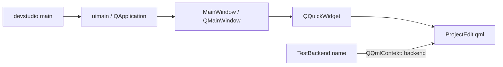

# 第7章 ツール・RPC・テスト

[索引へ戻る](README.md) / [前章](06_rendering_vulkan_shader.md) / [次章](08_class_interface_index.md)

この章では、engine 本体の周辺にある3つの入口を扱います。

- `pelican_cli`: project 作成、asset manifest、外部納品物 import、配布 feature 導出。
- `pelican_studio`: Qt/QML 製の開発 UI。ただし現状は小さな prototype。
- RPC と test: headless engine を外から決定論的に操作し、仕様を固定する仕組み。

## 7.1 `pelican_cli` の全体像

[`src/devcli/main.cpp`](../../src/devcli/main.cpp#L12) は第1引数を見て7系統へそのまま dispatch します。

```text
pelican_cli
├─ assets <manifest|verify|status>
├─ bake-camera ...                       # replayからcameraパスをbake
├─ import <delivery_dir> --project <dir|project.json>   # --rulesサブモード付き
├─ dist-config <project> [--with rpc,seqplayer] [--out file]
├─ project init <directory>
├─ dump-lowered-material ...             # material lowering結果のダンプ
└─ vrm ...                               # VRM semanticのダンプ/検査
```

執筆時点から3系統増えました。

- `bake-camera`([`bakecameracommand.cpp`](../../src/devcli/bakecameracommand.cpp))は入力 replay から camera パスを bake します(player の `--bake-camera-output` と対。テスト: [`run_devcli_bake_camera.cmake`](../../test/run_devcli_bake_camera.cmake))。
- `dump-lowered-material`([`materialcommand.cpp`](../../src/devcli/materialcommand.cpp))は material lowering 結果をダンプします(テスト: [`run_dump_lowered_material.cmake`](../../test/run_dump_lowered_material.cmake))。
- `vrm`([`vrmcommand.cpp`](../../src/devcli/vrmcommand.cpp))は VRM semantic のダンプ/検査です(テスト: [`run_devcli_vrm_dump.cmake`](../../test/run_devcli_vrm_dump.cmake))。
- 既存の `import` には `--rules` サブモード(ルールベース import、[`rulesimport.cpp`](../../src/devcli/rulesimport.cpp) + [`importrules.hpp`](../../src/project/importrules.hpp)、テスト: [`run_devcli_rules_import.cmake`](../../test/run_devcli_rules_import.cmake))と glTF scene 抽出([`gltfsceneextract.cpp`](../../src/devcli/gltfsceneextract.cpp)、テスト: [`run_devcli_gltf_extract.cmake`](../../test/run_devcli_gltf_extract.cmake))が加わりました。

command ごとに独立した `run...Command(argc, argv)` を持つ構成で、巨大な application class はありません。argument parse には `argparse`、JSON には `nlohmann::json` を使います。[`src/devcli/CMakeLists.txt`](../../src/devcli/CMakeLists.txt#L1) を見ると、CLI は `pelican_project` へ依存しますが、Vulkan renderer 全体へは依存していません。

## 7.2 `project init`: 実行可能な最小 project の生成器

[`runProjectInitCommand()`](../../src/devcli/projectinit.cpp#L392) は、空であることを確認した directory に template file 群を書きます。template の一覧は [`templateFiles()`](../../src/devcli/projectinit.cpp#L370) にあります。

主な生成物は次です。

| 生成物 | 役割 |
|---|---|
| `project.json` | project schema、basic config、default scene、input actions |
| `scenes/main.scene.json` | 最初の scene |
| `assets/asset_data.json` | model/audio などの asset catalog |
| `input/actions.json` | action map |
| `input/profiles/keyboard.json` | input profile |
| `passes/main_rendering_config.json` | target、pass、frame graph の初期設定 |
| `ui/ui_overlay.json` | 2D UI overlay |
| `code/CMakeLists.txt`, `code/game.cpp` | game system を組み込む project code。生成される CMakeLists.txt は `pelican_game_sources()` を呼ぶため、game code は **DLL**(`pelican_game_logic`)としてビルドされます |
| `.gitattributes`, `.gitignore`, `README.md` | asset/LFS と利用案内 |

template は外部 resource file ではなく、[`projectinit.cpp` 内の raw string](../../src/devcli/projectinit.cpp#L88) です。schema を変更した場合、example project だけでなくここも更新しないと、新規 project が古い形式で生成されます。

この command の end-to-end 仕様は [`run_devcli_project_init.cmake`](../../test/run_devcli_project_init.cmake#L1) です。生成だけでなく、生成した project code が player として build/run できるかまで確認します。

## 7.3 `assets`: store と manifest の保守

入口は [`runAssetsCommand()`](../../src/devcli/assetscommand.cpp#L363) です。project の `asset_stores` と `.pelican/local.json` を読み、store ごとの実 directory と manifest を解決します。

| subcommand | 実装 | 動作 |
|---|---|---|
| `manifest` | [`runManifestCommand()`](../../src/devcli/assetscommand.cpp#L274) | store を走査して manifest と hash cache を更新 |
| `verify` | [`runVerifyCommand()`](../../src/devcli/assetscommand.cpp#L294) | manifest と filesystem を比較。`--full` なら内容も再 hash |
| `status` | [`runStatusCommand()`](../../src/devcli/assetscommand.cpp#L323) | store/manifest/asset の missing と大小文字不一致を軽量確認 |

hash と path の純粋ロジックは [`src/project/assetsmanifest.cpp`](../../src/project/assetsmanifest.cpp#L1)、起動時の runtime 検証は [`src/core/loader/assetsverification.cpp`](../../src/core/loader/assetsverification.cpp#L1) に分かれます。CLI は manifest を「作る・事前確認する」側、core は project 起動時に「利用可能か確認する」側です。

`--full` でない manifest/verify は `.pelican/assets-hash-cache.json` を利用します。file metadata で cache hit できる場合は内容全体を読み直さず、大規模 store の反復確認を軽くします。厳密な配布前確認では `--full` を使う前提です。

仕様テストは [`assetsmanifest_test.cpp`](../../test/assetsmanifest_test.cpp#L1)、[`assetsverification_test.cpp`](../../test/assetsverification_test.cpp#L1)、CLI 結合テストは [`run_devcli_assets.cmake`](../../test/run_devcli_assets.cmake#L1) です。

## 7.4 `import`: 外部 delivery を安全に project catalog へ登録

[`importDelivery()`](../../src/devcli/importcommand.cpp#L341) は、project 内に置かれた delivery directory の `manifest.json` を読みます。大まかな transaction は次です。

```text
project / delivery pathをcanonicalize
  -> deliveryがproject root内か確認
  -> manifest schemaをparse
  -> output pathがdelivery外へescapeしないか確認
  -> 全outputのSHA-256を確認
  -> gltf schemaかつ.glbだけを抽出
  -> asset_data.modelsへ未登録分を追加
  -> asset_data JSONを書き戻す
```

安全性の要点は3つあります。

1. [`resolveProjectFile()`](../../src/devcli/importcommand.cpp#L161) は absolute path、backslash、未知 scheme、`..` による project root escape を拒否します。
2. [`verifyManifestOutputs()`](../../src/devcli/importcommand.cpp#L269) は登録前に全 output の SHA-256 を検証します。途中まで catalog を変更しません。
3. [`registerImportedModels()`](../../src/devcli/importcommand.cpp#L284) は既存の model 名または path と重複すれば skip するため、同じ delivery を再実行しても重複登録しません。

なお「transaction」は catalog 書き換え前の検証順という意味です。file write 自体は [`writeTextFile()`](../../src/devcli/importcommand.cpp#L144) の truncate write であり、temp file + rename の atomic replace ではありません。

manifest の純粋 parser は [`src/project/importmanifest.cpp`](../../src/project/importmanifest.cpp#L1)、fixture 仕様は [`importmanifest_test.cpp`](../../test/importmanifest_test.cpp#L1)、CLI の実 filesystem 動作は [`run_devcli_import.cmake`](../../test/run_devcli_import.cmake#L1) が固定しています。

## 7.5 `dist-config`: project 内容から配布用 feature を導出

[`deriveDistConfig()`](../../src/devcli/distconfig.cpp#L848) は project を静的走査し、配布 build に必要な optional feature を決めます。

| feature | 導出方法 |
|---|---|
| `PELICAN_WITH_VAT` | asset data と import manifest にある GLB の JSON chunk を読み、VAT metadata を検査 |
| `PELICAN_WITH_EXR` | asset/UI JSON 内の `path` / `file` に `.exr` reference があるか走査 |
| `PELICAN_WITH_RPC` | 自動推測せず `--with rpc` で明示 |
| `PELICAN_WITH_SEQPLAYER` | 自動推測せず `--with seqplayer` で明示 |

GLB 候補は asset catalog と project 以下の import manifest の両方から集めます。入口は [`collectAssetDataGlbs()`](../../src/devcli/distconfig.cpp#L385) と [`collectImportManifestGlbs()`](../../src/devcli/distconfig.cpp#L420) です。単に拡張子を見るだけでなく、GLB JSON chunk と VAT primitive metadata を読み、壊れた VAT declaration を「feature なし」として黙殺しない設計です。

結果は [`renderDistConfigPreset()`](../../src/devcli/distconfig.cpp#L879) が `set(PELICAN_WITH_... CACHE BOOL ... FORCE)` 形式の CMake include file にします。各判定の理由も comment へ出るため、「なぜこの依存が配布物に入ったか」を追跡できます。

command line は [`runDistConfigCommand()`](../../src/devcli/distconfig.cpp#L901)、結合仕様は [`run_devcli_dist_config.cmake`](../../test/run_devcli_dist_config.cmake#L1) です。

## 7.6 Pelican Studio の現在位置

Studio の起点は [`src/devstudio/main.cpp`](../../src/devstudio/main.cpp#L5) です。Qt application を作る [`uimain()`](../../src/devstudio/view/uimain.cpp#L8) から [`MainWindow`](../../src/devstudio/view/mainwindow.hpp#L8) を表示します。

現実装は full editor ではなく prototype です。



[`MainWindow::MainWindow()`](../../src/devstudio/view/mainwindow.cpp#L10) は `QQmlEngine` を作り、`TestBackend` を context property `backend` として渡し、[`ProjectEdit.qml`](../../src/devstudio/view/ProjectEdit.qml#L1) を中央 widget にします。QML は project name と title の2 field だけです。

[`ProjectInfo`](../../src/devstudio/model/project.hpp#L15) という model skeleton もありますが、現在の window/backend 経路には接続されていません。したがって `src/devstudio` を読んで asset browser、scene editor、engine IPC が既にあると解釈してはいけません。拡張するなら、まず `TestBackend` を実 model/view-model に置き換え、project load/save の ownership と error surface を定義する段階です。

## 7.7 JSON-RPC を2層に分けて読む

RPC は build option `PELICAN_WITH_RPC` で切り替わります。有効時は `Loop` が通常 loop ではなく stdin/stdout server を実行します。無効時は stub が「未対応」を明示します。

### protocol 層: `pelican_project`

[`jsonrpc.hpp`](../../src/project/jsonrpc.hpp#L12) と [`jsonrpc.cpp`](../../src/project/jsonrpc.cpp#L148) は engine module を知りません。

- JSON-RPC 2.0 request の parse。
- `-32700` parse error、`-32600` invalid request、`-32601` method not found、`-32602` invalid params、`-32000` application error。
- success/error response の serialize。
- injected input/event parameter の純粋 parse。

この層は Vulkan なしで [`jsonrpc_test.cpp`](../../test/jsonrpc_test.cpp#L33) から直接テストできます。

### engine binding 層: `pelican_core`

[`RpcServer`](../../src/core/communication/rpcserver.hpp#L18) は `istream` / `ostream` と method handler map を持ちます。1行を1 request とし、[`handleLine()`](../../src/core/communication/rpcserver.cpp#L596) で parse → handler → response serialize を行います。[`run()`](../../src/core/communication/rpcserver.cpp#L627) は EOF まで1行ずつ読み、必ず1行の response を flush します。

transport が socket ではなく stream interface なのがポイントです。production 起動では stdin/stdout、unit test では stringstream を差し替えられます。

engine method の登録は [`runEngineRpcServer()`](../../src/core/communication/rpcserver.cpp#L638) に集約されています。

| method | 実装行 | 状態変更 |
|---|---|---|
| `reload_game_logic` | [`rpcserver.cpp`](../../src/core/communication/rpcserver.cpp#L644) | game DLL(`pelican_game_logic`)を再ロード |
| `get_status` | [`rpcserver.cpp`](../../src/core/communication/rpcserver.cpp#L670) | instance、project、scene、frame/time、seed、store 状態を返す |
| `set_seed` | [`rpcserver.cpp`](../../src/core/communication/rpcserver.cpp#L724) | deterministic RNG を reseed |
| `set_input_profile` | [`rpcserver.cpp`](../../src/core/communication/rpcserver.cpp#L732) | input profile を切替 |
| `inject_input` | [`rpcserver.cpp`](../../src/core/communication/rpcserver.cpp#L743) | canonical input queue へ key/mouse/axis event を積む |
| `start_input_record` / `stop_input_record` | [`rpcserver.cpp`](../../src/core/communication/rpcserver.cpp#L756) | 入力記録の開始/終了(#L756 / #L768) |
| `start_input_replay` / `stop_input_replay` | [`rpcserver.cpp`](../../src/core/communication/rpcserver.cpp#L780) | 入力再生の開始/終了(#L780 / #L803) |
| `inject_event` | [`rpcserver.cpp`](../../src/core/communication/rpcserver.cpp#L816) | 名前から登録済み event layer へ JSON payload を積む |
| `set_time` | [`rpcserver.cpp`](../../src/core/communication/rpcserver.cpp#L830) | time を直接設定。frame index は進めない |
| `update_transforms` | [`rpcserver.cpp`](../../src/core/communication/rpcserver.cpp#L837) | update を pending queue へ積む |
| `load_gltf` | [`rpcserver.cpp`](../../src/core/communication/rpcserver.cpp#L846) | transient glTF を scene に追加 |
| `load_scene` | [`rpcserver.cpp`](../../src/core/communication/rpcserver.cpp#L857) | scene を clear/load、pending transforms を破棄 |
| `set_camera` | [`rpcserver.cpp`](../../src/core/communication/rpcserver.cpp#L866) | 名前付き object を active camera にする |
| `step_frame` | [`rpcserver.cpp`](../../src/core/communication/rpcserver.cpp#L874) | pending flush → time advance → 5 phase update → render |
| `render_frame` | [`rpcserver.cpp`](../../src/core/communication/rpcserver.cpp#L883) | time/frame を進めず、pending flush → seq update → render |
| `get_frame_plan` | [`rpcserver.cpp`](../../src/core/communication/rpcserver.cpp#L891) | planner の JSON を返す |
| `capture` | [`rpcserver.cpp`](../../src/core/communication/rpcserver.cpp#L896) | 最後の frame を PNG 保存 |

`get_status` には shader hot reload の詳細(`reload.runtime.pelican.shaders.details`)も載ります(第6章 6.10 参照)。

### `step_frame` と `render_frame` の違い

これは RPC 利用時に最も間違えやすい点です。

- `step_frame` は simulation の1 tick です。`EngineTime::advance()` と通常の5 phase executor を通るため、input、game system、physics、ECS が更新されます。
- `render_frame` は現在時刻の再描画です。通常 game/ECS update は行わず、sequence player を現在時刻へ sample して描画します。
- `set_time` → `render_frame` は、任意時刻を sampling/capture する用途です。
- `inject_input` → `step_frame` は、入力がその frame の game system へ届く標準経路です。

transform update も即適用ではなく pending です。複数 update をまとめてから `step_frame` / `render_frame` の境界で [`flushPendingTransforms()`](../../src/core/communication/rpcserver.cpp#L289) します。

### protocol 上の注意

- stdout は JSON-RPC 専用です。通常 log を stdout へ混ぜると client の1行 protocol を壊します。
- `capture` は headless の `OffscreenFrameTarget` に加え、windowed でも surface が TRANSFER_SRC を持てば readback 可能です([`swapchainframetarget.cpp#L435`](../../src/core/vkcore/swapchainframetarget.cpp#L435))。不可の場合は `capture unavailable_windowed` エラーになります。
- `inject_event` は名前で登録された event type にだけ届きます。payload は登録型の binder が解釈します。
- method handler の通常例外は application error `-32000` に正規化されます。[`handleLine()` の catch](../../src/core/communication/rpcserver.cpp#L596) を参照してください。

## 7.8 テスト構成: test を実装の仕様書として読む

[`test/CMakeLists.txt`](../../test/CMakeLists.txt#L1) は Catch2 executable と subprocess test を一か所で登録します。`pelican_define_test(name, libs...)` は `test/<name>.cpp` を executable にし、`catch_discover_tests()` で各 `TEST_CASE` を CTest へ公開します。

テストは4段階に分類すると読みやすくなります。

| 段階 | 例 | 何を保証するか |
|---|---|---|
| pure parser/value | [`sceneformat_test.cpp`](../../test/sceneformat_test.cpp#L105)、[`materialformat_test.cpp`](../../test/materialformat_test.cpp#L100)、[`jsonrpc_test.cpp`](../../test/jsonrpc_test.cpp#L33) | schema、型変換、error 文言。GPU 不要 |
| subsystem unit | [`ecs_lifecycle_test.cpp`](../../test/ecs_lifecycle_test.cpp#L160)、[`inputstate_test.cpp`](../../test/inputstate_test.cpp#L9)、[`deletionqueue_test.cpp`](../../test/deletionqueue_test.cpp#L30) | lifecycle、generation、frame 境界、遅延破棄 |
| headless runtime | [`headless_render_test.cpp`](../../test/headless_render_test.cpp#L67)、[`vulkan_headless_test.cpp`](../../test/vulkan_headless_test.cpp#L10) | window なし Vulkan、render/readback |
| process integration | [`run_rpc_headless.cmake`](../../test/run_rpc_headless.cmake#L1)、[`run_compute_headless.cmake`](../../test/run_compute_headless.cmake#L1)、devcli scripts | 実 executable、stdin/stdout、filesystem、終了 code |

### 執筆時点以降に増えた主なテスト群

| 領域 | テスト |
|---|---|
| XR unit | `xractivation_test` / `xrdiscovery_test` / `xrsession_test` / `xraction_test` / `xrviewspace_test` / `xrcompositiontarget_test` / `xrfeaturepolicy_test`(GPU なしの検証は [`synthetic_stereo_target.hpp`](../../test/synthetic_stereo_target.hpp)) |
| VRM | `vrmsemantic_test` / `vrmapplication_test` / `vrmfirstperson_test` / `vrm_xr_demo_test` |
| animation | `animgraph_test` / `skeletalanimation_test` / `animation_abi_dll_test`(DLL ABI fixture) |
| temporal / 描画 | `temporal_test` / `taa_resolve_test` / `color_pipeline_test` / `shader_cache_test` / `texturereload_test` / `surfacecompiler_test` / `spvlink_test` |
| 2D / UI | `sprite_foundation_test` / `ui_foundation_test` |
| event | `eventpayloadschema_test` + compile-time fixture([`run_event_schema_compile.cmake`](../../test/run_event_schema_compile.cmake)) |
| process integration | [`run_game_logic_reload.ps1`](../../test/run_game_logic_reload.ps1) / [`run_input_record_replay_headless.cmake`](../../test/run_input_record_replay_headless.cmake) / [`run_vrm_xr_demo_rpc.cmake`](../../test/run_vrm_xr_demo_rpc.cmake) / [`run_spvlink_golden.cmake`](../../test/run_spvlink_golden.cmake) / run_devcli_{bake_camera, vrm_dump, rules_import, gltf_extract}.cmake |

### subsystem ごとの「最初に読むテスト」

| 調べたいもの | 推奨テスト |
|---|---|
| ECS の生成・削除・rollback・世代 | [`ecs_lifecycle_test.cpp`](../../test/ecs_lifecycle_test.cpp#L160) |
| game system 順序と GameContext | [`gamesystem_test.cpp`](../../test/gamesystem_test.cpp#L109) |
| event の frame boundary | [`eventlayer_test.cpp`](../../test/eventlayer_test.cpp#L48) |
| input queue、edge、borrow lifetime | [`inputstate_test.cpp`](../../test/inputstate_test.cpp#L14) |
| action map と layer consumption | [`inputactions_test.cpp`](../../test/inputactions_test.cpp#L103) |
| project/path/security | [`projectconfig_test.cpp`](../../test/projectconfig_test.cpp#L166)、[`pathresolver_test.cpp`](../../test/pathresolver_test.cpp#L148) |
| physics の幾何と world binding | [`physquery_test.cpp`](../../test/physquery_test.cpp#L25)、[`physworld_test.cpp`](../../test/physworld_test.cpp#L49) |
| frame graph の順序/異常系 | [`frameplanner_test.cpp`](../../test/frameplanner_test.cpp#L190) |
| rendering JSON | [`renderingpass_helpers_test.cpp`](../../test/renderingpass_helpers_test.cpp#L20) |
| shader compile/reflection/reload | [`shader_compiler_reflection_test.cpp`](../../test/shader_compiler_reflection_test.cpp#L25)、[`shader_library_test.cpp`](../../test/shader_library_test.cpp#L84) |
| feature composition | [`featurecompose_test.cpp`](../../test/featurecompose_test.cpp#L119) |
| persistence の atomic save/path | [`persistence_test.cpp`](../../test/persistence_test.cpp#L81) |

### Golden image test

[`golden_image_test.cpp`](../../test/golden_image_test.cpp) は headless render 結果を [`test/golden/`](../../test/golden) の `expected.png` と比較します。case は現在 40 超で、fullscreen、HDR on/off、shadow、debug draw/text、compute buffer、camera に加え、sprite_*(pixel policy / atlas / parent)、taa_*(camera/object motion、disocclusion、resize、set_time)、material_instance_override / material_absolute_override、morph_skinned_shadow、openpbr_coat_sphere、skeletal_toon、parent_transform、snapshot_refraction、orbit_camera_controller などが独立 case です。

この test は画像一致だけでなく、[`Renderer execution matches plan order`](../../test/golden_image_test.cpp#L4073) で planner の node 順と実行 trace が同じこと、[`fullscreen inputs rebind...`](../../test/golden_image_test.cpp#L4123) で hot reload/resize 後の descriptor 再結合も確認します。描画 refactor 時の最も強い回帰防止線です。

golden 更新は見た目が変わったから機械的に受け入れるのではなく、frame plan、layout trace、pixel 差の理由を確認してから行うべきです。

## 7.9 テストの実行方法

repository の基本手順は [`README.md`](../../README.md#L10) にあります。

```powershell
cmake . -B build -DCMAKE_PREFIX_PATH=<Qtの場所>
cmake --build build
ctest --test-dir build --output-on-failure
```

Qt Studio が不要なら configure option は repository README の `SKIP_DEVSTUDIO` を使えます。特定テストだけなら CTest の正規表現 filter が便利です。

```powershell
ctest --test-dir build -R ecs --output-on-failure
ctest --test-dir build -R frameplanner --output-on-failure
ctest --test-dir build -R rpc_ --output-on-failure
```

Visual Studio など multi-config generator では `cmake --build build --config Debug` と `ctest --test-dir build -C Debug ...` のように config をそろえます。

headless test でも Vulkan loader と対応 device/driver は必要です。runtime shader compiler、VAT、EXR、RPC、SeqPlayer は build option によって test 自体が conditional になるため、「CTest が緑」だけでなく configure 時にどの option が ON だったかも確認してください。

CI としては GitHub Actions の Windows CPU gate([`.github/workflows/cpu-gate.yml`](../../.github/workflows/cpu-gate.yml)、WP137)があり、GPU を要するテストを `gpu` label で除外した CTest を PR ごとに実行します。skip は [`test/ci/run_cpu_gate.py`](../../test/ci/run_cpu_gate.py) が exact allowlist と照合し、想定外の skip を fail にします。

## 7.10 変更時のテスト選択

最小単位だけで終わらせず、変更が越えた境界まで一段ずつ広げます。

```text
pure parser変更
  -> 対応fixture test
  -> config/runtime binding test
  -> 必要ならheadless/golden

ECS lifecycle変更
  -> ecs_lifecycle
  -> sceneformat / gamesystem
  -> headless player integration

frame graph / shader変更
  -> frameplanner / shader tests
  -> golden_image
  -> compute/RPC headless subprocess

CLI変更
  -> project libraryのpure test
  -> 対応run_devcli_*.cmake
```

Pelican の test suite は単なる関数単体確認ではありません。pure data format と runtime binding を分け、最後に headless executable を実際に動かす構造が、production code の層分けそのものを映しています。
