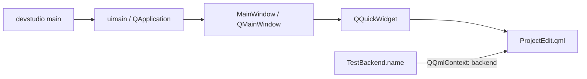

# 第7章 ツール・RPC・テスト

[索引へ戻る](README.md) / [前章](06_rendering_vulkan_shader.md) / [次章](08_class_interface_index.md)

この章では、engine 本体の周辺にある3つの入口を扱います。

- `pelican_cli`: project 作成、asset manifest、外部納品物 import、配布 feature 導出。
- `pelican_studio`: Qt/QML 製の開発 UI。ただし現状は小さな prototype。
- RPC と test: headless engine を外から決定論的に操作し、仕様を固定する仕組み。

## 7.1 `pelican_cli` の全体像

[`src/devcli/main.cpp`](../../src/devcli/main.cpp#L13) は第1引数を見て7系統へそのまま dispatch します。

```text
pelican_cli
├─ assets <manifest|verify|status>
├─ bake-camera ...                       # replayからcameraパスをbake
├─ import <delivery_dir> --project <dir|project.json>   # --rulesサブモード付き
├─ dist-config <project> [--with rpc,seqplayer] [--out file]
├─ project init <directory>
├─ dump-lowered-material ...             # material lowering結果のダンプ
└─ vrm ...                               # VRM semanticのダンプ/検査
```

執筆時点から3系統増えました。

- `bake-camera`([`bakecameracommand.cpp`](../../src/devcli/bakecameracommand.cpp))は入力 replay から camera パスを bake します(player の `--bake-camera-output` と対。テスト: [`run_devcli_bake_camera.cmake`](../../test/run_devcli_bake_camera.cmake))。
- `dump-lowered-material`([`materialcommand.cpp`](../../src/devcli/materialcommand.cpp))は material lowering 結果をダンプします(テスト: [`run_dump_lowered_material.cmake`](../../test/run_dump_lowered_material.cmake))。
- `vrm`([`vrmcommand.cpp`](../../src/devcli/vrmcommand.cpp))は VRM semantic のダンプ/検査です(テスト: [`run_devcli_vrm_dump.cmake`](../../test/run_devcli_vrm_dump.cmake))。
- 既存の `import` には `--rules` サブモード(ルールベース import、[`rulesimport.cpp`](../../src/devcli/rulesimport.cpp) + [`importrules.hpp`](../../src/project/importrules.hpp)、テスト: [`run_devcli_rules_import.cmake`](../../test/run_devcli_rules_import.cmake))と glTF scene 抽出([`gltfsceneextract.cpp`](../../src/devcli/gltfsceneextract.cpp)、テスト: [`run_devcli_gltf_extract.cmake`](../../test/run_devcli_gltf_extract.cmake))が加わりました。

`--rules` から外部ツールを起動する経路のために [`DevCli::runProcess(ProcessOptions)`](../../src/devcli/processrunner.hpp#L37) が追加されました。ヘッダのコメントが規範です。

> Runs one child in its own process group, captures stdout/stderr, and kills the
> complete group on timeout or cancellation. Arguments are filesystem::path so
> Windows callers retain their native UTF-16 representation through CreateProcessW.

`ProcessOptions{executable, arguments, timeout, cancelled, log_path, name}` と `ProcessResult{exit_code, timed_out, cancelled, process_id, stdout_text, stderr_text}` の組で、テストは [`processrunner_test.cpp`](../../test/processrunner_test.cpp) + [`process_fixture_child.cpp`](../../test/process_fixture_child.cpp)、結合は [`run_devcli_import_process.cmake`](../../test/run_devcli_import_process.cmake) です。

command ごとに独立した `run...Command(argc, argv)` を持つ構成で、巨大な application class はありません。argument parse には `argparse`、JSON には `nlohmann::json` を使います。[`src/devcli/CMakeLists.txt`](../../src/devcli/CMakeLists.txt#L1) を見ると、CLI は `pelican_project` へ依存しますが、Vulkan renderer 全体へは依存していません。

## 7.2 `project init`: 実行可能な最小 project の生成器

[`runProjectInitCommand()`](../../src/devcli/projectinit.cpp#L392) は、空であることを確認した directory に template file 群を書きます。template の一覧は [`templateFiles()`](../../src/devcli/projectinit.cpp#L370) にあります。

主な生成物は次です。

| 生成物 | 役割 |
|---|---|
| `project.json` | project schema、basic config、default scene、input actions |
| `scenes/main.scene.json` | 最初の scene |
| `assets/asset_data.json` | model/audio などの asset catalog |
| `input/actions.json` | action map |
| `input/profiles/keyboard.json` | input profile |
| `passes/main_rendering_config.json` | target、pass、frame graph の初期設定 |
| `ui/ui_overlay.json` | 2D UI overlay |
| `code/CMakeLists.txt`, `code/game.cpp` | game system を組み込む project code。生成される CMakeLists.txt は `pelican_game_sources()` を呼ぶため、game code は **DLL**(`pelican_game_logic`)としてビルドされます |
| `.gitattributes`, `.gitignore`, `README.md` | asset/LFS と利用案内 |

template は外部 resource file ではなく、[`projectinit.cpp` 内の raw string](../../src/devcli/projectinit.cpp#L88) です。schema を変更した場合、example project だけでなくここも更新しないと、新規 project が古い形式で生成されます。

この command の end-to-end 仕様は [`run_devcli_project_init.cmake`](../../test/run_devcli_project_init.cmake#L1) です。生成だけでなく、生成した project code が player として build/run できるかまで確認します。

## 7.3 `assets`: store と manifest の保守

入口は [`runAssetsCommand()`](../../src/devcli/assetscommand.cpp#L363) です。project の `asset_stores` と `.pelican/local.json` を読み、store ごとの実 directory と manifest を解決します。

| subcommand | 実装 | 動作 |
|---|---|---|
| `manifest` | [`runManifestCommand()`](../../src/devcli/assetscommand.cpp#L274) | store を走査して manifest と hash cache を更新 |
| `verify` | [`runVerifyCommand()`](../../src/devcli/assetscommand.cpp#L294) | manifest と filesystem を比較。`--full` なら内容も再 hash |
| `status` | [`runStatusCommand()`](../../src/devcli/assetscommand.cpp#L323) | store/manifest/asset の missing と大小文字不一致を軽量確認 |

hash と path の純粋ロジックは [`src/project/assetsmanifest.cpp`](../../src/project/assetsmanifest.cpp#L1)、起動時の runtime 検証は [`src/core/loader/assetsverification.cpp`](../../src/core/loader/assetsverification.cpp#L1) に分かれます。CLI は manifest を「作る・事前確認する」側、core は project 起動時に「利用可能か確認する」側です。

`--full` でない manifest/verify は `.pelican/assets-hash-cache.json` を利用します。file metadata で cache hit できる場合は内容全体を読み直さず、大規模 store の反復確認を軽くします。厳密な配布前確認では `--full` を使う前提です。

仕様テストは [`assetsmanifest_test.cpp`](../../test/assetsmanifest_test.cpp#L1)、[`assetsverification_test.cpp`](../../test/assetsverification_test.cpp#L1)、CLI 結合テストは [`run_devcli_assets.cmake`](../../test/run_devcli_assets.cmake#L1) です。

## 7.4 `import`: 外部 delivery を安全に project catalog へ登録

[`importDelivery()`](../../src/devcli/importcommand.cpp#L344) は、project 内に置かれた delivery directory の `manifest.json` を読みます。大まかな transaction は次です。

```text
project / delivery pathをcanonicalize
  -> deliveryがproject root内か確認
  -> manifest schemaをparse
  -> output pathがdelivery外へescapeしないか確認
  -> 全outputのSHA-256を確認
  -> gltf schemaかつ.glbだけを抽出
  -> asset_data.modelsへ未登録分を追加
  -> asset_data JSONを書き戻す
```

安全性の要点は3つあります。

1. [`resolveProjectFile()`](../../src/devcli/importcommand.cpp#L164) は absolute path、backslash、未知 scheme、`..` による project root escape を拒否します。
2. [`verifyManifestOutputs()`](../../src/devcli/importcommand.cpp#L272) は登録前に全 output の SHA-256 を検証します。途中まで catalog を変更しません。
3. [`registerImportedModels()`](../../src/devcli/importcommand.cpp#L287) は既存の model 名または path と重複すれば skip するため、同じ delivery を再実行しても重複登録しません。

なお「transaction」は catalog 書き換え前の検証順という意味です。file write 自体は [`writeTextFile()`](../../src/devcli/importcommand.cpp#L147) の truncate write であり、temp file + rename の atomic replace ではありません。

manifest の純粋 parser は [`src/project/importmanifest.cpp`](../../src/project/importmanifest.cpp#L1)、fixture 仕様は [`importmanifest_test.cpp`](../../test/importmanifest_test.cpp#L1)、CLI の実 filesystem 動作は [`run_devcli_import.cmake`](../../test/run_devcli_import.cmake#L1) が固定しています。

## 7.5 `dist-config`: project 内容から配布用 feature を導出

[`deriveDistConfig()`](../../src/devcli/distconfig.cpp#L850) は project を静的走査し、配布 build に必要な optional feature を決めます。

| feature | 導出方法 |
|---|---|
| `PELICAN_WITH_VAT` | asset data と import manifest にある GLB の JSON chunk を読み、VAT metadata を検査 |
| `PELICAN_WITH_EXR` | asset/UI JSON 内の `path` / `file` に `.exr` reference があるか走査 |
| `PELICAN_WITH_RPC` | 自動推測せず `--with rpc` で明示 |
| `PELICAN_WITH_SEQPLAYER` | 自動推測せず `--with seqplayer` で明示 |

GLB 候補は asset catalog と project 以下の import manifest の両方から集めます。入口は [`collectAssetDataGlbs()`](../../src/devcli/distconfig.cpp#L385) と [`collectImportManifestGlbs()`](../../src/devcli/distconfig.cpp#L420) です。単に拡張子を見るだけでなく、GLB JSON chunk と VAT primitive metadata を読み、壊れた VAT declaration を「feature なし」として黙殺しない設計です。

結果は [`renderDistConfigPreset()`](../../src/devcli/distconfig.cpp#L884) が `set(PELICAN_WITH_... CACHE BOOL ... FORCE)` 形式の CMake include file にします。各判定の理由も comment へ出るため、「なぜこの依存が配布物に入ったか」を追跡できます。

command line は [`runDistConfigCommand()`](../../src/devcli/distconfig.cpp#L913)、結合仕様は [`run_devcli_dist_config.cmake`](../../test/run_devcli_dist_config.cmake#L1) です。

## 7.6 Pelican Studio の現在位置

Studio の起点は [`src/devstudio/main.cpp`](../../src/devstudio/main.cpp#L5) です。Qt application を作る [`uimain()`](../../src/devstudio/view/uimain.cpp#L8) から [`MainWindow`](../../src/devstudio/view/mainwindow.hpp#L8) を表示します。

現実装は full editor ではなく prototype です。



[`MainWindow::MainWindow()`](../../src/devstudio/view/mainwindow.cpp#L10) は `QQmlEngine` を作り、`TestBackend` を context property `backend` として渡し、[`ProjectEdit.qml`](../../src/devstudio/view/ProjectEdit.qml#L1) を中央 widget にします。QML は project name と title の2 field だけです。

[`ProjectInfo`](../../src/devstudio/model/project.hpp#L15) という model skeleton もありますが、現在の window/backend 経路には接続されていません。したがって `src/devstudio` を読んで asset browser、scene editor、engine IPC が既にあると解釈してはいけません。拡張するなら、まず `TestBackend` を実 model/view-model に置き換え、project load/save の ownership と error surface を定義する段階です。

> **設計決定:** Studio が prototype のままなのに対し、**エンジン側の編集面は先に実装されました**。編集 RPC 23 メソッド(§7.7)と ImGui inspector / asset browser(§7.12)が同じ [`EditorCommandService`](../../src/core/communication/editorcommandservice.hpp#L221) を呼ぶ構成です。Studio を進めるときは、独自の編集ロジックを書くのではなくこの typed サービスへ接続する側になります。

## 7.7 JSON-RPC を2層に分けて読む

RPC は build option `PELICAN_WITH_RPC` で切り替わります。無効時は stub が「未対応」を明示します。

有効時の起動形態は **2 つ**になりました(WP156 / E-HOST0)。`--rpc` はもう `--headless` を要求しません。

| 形態 | 起動 | 動作 |
|---|---|---|
| headless RPC | `--rpc --headless` | `Loop` が通常 loop の代わりに [`runEngineRpcServer(std::cin, std::cout)`](../../src/core/communication/rpcserver.hpp#L101) を実行し、EOF までブロックする |
| windowed RPC | `--rpc`(headless なし) | 通常の描画 loop を回しつつ、[`WindowedRpcHost`](../../src/core/communication/rpcserver.hpp#L78) が **フレーム境界でのみ** リクエストを処理する |

詳細な frame 境界の位置は [第2章](02_runtime_lifecycle.md)を参照してください。windowed RPC では ImGui UI が無効になる点は §7.12 と [第9章](09_black_magic_and_gotchas.md)で扱います。

### protocol 層: `pelican_project`

[`jsonrpc.hpp`](../../src/project/jsonrpc.hpp#L12) と [`jsonrpc.cpp`](../../src/project/jsonrpc.cpp#L148) は engine module を知りません。

- JSON-RPC 2.0 request の parse。
- `-32700` parse error、`-32600` invalid request、`-32601` method not found、`-32602` invalid params、`-32000` application error、`-32010` RenderDoc capture error。
- success/error response の serialize。
- injected input/event parameter の純粋 parse。

この層は Vulkan なしで [`jsonrpc_test.cpp`](../../test/jsonrpc_test.cpp#L33) から直接テストできます。

### engine binding 層: `pelican_core`

[`RpcServer`](../../src/core/communication/rpcserver.hpp#L39) は `istream` / `ostream` と method handler map を持ちます。1行を1 request とし、[`handleLine()`](../../src/core/communication/rpcserver.cpp#L743) で parse → handler → response serialize を行います。[`run()`](../../src/core/communication/rpcserver.cpp#L779) は EOF まで1行ずつ読み、必ず1行の response を flush します。1行だけを処理する [`processLine()`](../../src/core/communication/rpcserver.cpp#L739) が公開されているのが windowed 経路の土台です。

transport が socket ではなく stream interface なのがポイントです。production 起動では stdin/stdout、unit test では stringstream を差し替えられます。

その上に 2 つの class が乗ります。

| class | 役割 |
|---|---|
| [`EngineRpcEndpoint`](../../src/core/communication/rpcserver.hpp#L60) | 「1 個の状態付きエンジン RPC ディスパッチャを所有」。headless は `run()`、windowed host は frame 境界でだけ `processLine()` を呼ぶ |
| [`WindowedRpcHost`](../../src/core/communication/rpcserver.hpp#L78) | `processFrameBoundary()` / `queuedRequestCount()` / `readerFinished()`。reader スレッドは行を **queue へ積むだけ**で、dispatch は engine スレッドが行う |

キュー容量は [`defaultWindowedRpcQueueCapacity = 64`](../../src/core/communication/rpcserver.hpp#L99) です。溢れたリクエストには reader スレッドが即座に `-32000` を返します(`data.reason == "busy"`)。

[`JsonRpcHandlerError`](../../src/core/communication/rpcserver.hpp#L28) には構造化 `data` が付きました([#L34](../../src/core/communication/rpcserver.hpp#L34)、取得は [`data()`](../../src/core/communication/rpcserver.hpp#L36))。`capture_gpu` 失敗時の実例です([rpcserver.cpp#L1189-L1191](../../src/core/communication/rpcserver.cpp#L1189))。

```cpp
throw JsonRpcHandlerError{
    JsonRpcErrorCodes::renderDocCaptureError,
    "capture_gpu failed: " + std::string{error.what()},
    {{"reason", error.reason()},
     {"state", renderDocCaptureStateName(state.state)},
     {"source", "rpc"}}};
```

engine method の登録は [`runEngineRpcServer()`](../../src/core/communication/rpcserver.cpp#L1242) に集約されています。現在 **43 メソッド**で、うち 23 が編集系です。

#### 実行制御・診断系(20)

| method | 実装行 | 状態変更 |
|---|---|---|
| `reload_game_logic` | [#L794](../../src/core/communication/rpcserver.cpp#L794) | game DLL(`pelican_game_logic`)を再ロード |
| `get_status` | [#L821](../../src/core/communication/rpcserver.cpp#L821) | instance、project、scene、frame/time、seed、store 状態と各種診断を返す |
| `set_seed` | [#L991](../../src/core/communication/rpcserver.cpp#L991) | deterministic RNG を reseed |
| `set_input_profile` | [#L999](../../src/core/communication/rpcserver.cpp#L999) | input profile を切替 |
| `inject_input` | [#L1010](../../src/core/communication/rpcserver.cpp#L1010) | canonical input queue へ key/mouse/axis event を積む |
| `start_input_record` / `stop_input_record` | [#L1023](../../src/core/communication/rpcserver.cpp#L1023) / [#L1035](../../src/core/communication/rpcserver.cpp#L1035) | 入力記録の開始/終了 |
| `start_input_replay` / `stop_input_replay` | [#L1047](../../src/core/communication/rpcserver.cpp#L1047) / [#L1071](../../src/core/communication/rpcserver.cpp#L1071) | 入力再生の開始/終了 |
| `inject_event` | [#L1084](../../src/core/communication/rpcserver.cpp#L1084) | 名前から登録済み event layer へ JSON payload を積む |
| `set_time` | [#L1098](../../src/core/communication/rpcserver.cpp#L1098) | time を直接設定。frame index は進めない |
| `update_transforms` | [#L1105](../../src/core/communication/rpcserver.cpp#L1105) | update を pending queue へ積む |
| `load_gltf` | [#L1114](../../src/core/communication/rpcserver.cpp#L1114) | transient glTF を scene に追加 |
| `load_scene` | [#L1125](../../src/core/communication/rpcserver.cpp#L1125) | scene を clear/load、pending transforms を破棄 |
| `set_camera` | [#L1135](../../src/core/communication/rpcserver.cpp#L1135) | 名前付き object を active camera にする |
| `step_frame` | [#L1143](../../src/core/communication/rpcserver.cpp#L1143) | pending flush → time advance → 5 phase update → render |
| `render_frame` | [#L1155](../../src/core/communication/rpcserver.cpp#L1155) | time/frame を進めず、pending flush → seq update → render |
| `capture_gpu` | [#L1163](../../src/core/communication/rpcserver.cpp#L1163) | `render_frame` と同型の1回描画を明示 Start/End で capture し、新規 index の `.rdc` path を返す |
| `get_frame_plan` | [#L1194](../../src/core/communication/rpcserver.cpp#L1194) | planner の JSON を返す |
| `capture` | [#L1199](../../src/core/communication/rpcserver.cpp#L1199) | 最後の frame を PNG 保存 |

#### 編集系(23) ✅実装済み(WP153〜WP172)

すべて [`EditorCommandRpcAdapter`](../../src/core/communication/editorcommandservice.hpp#L290) へ委譲され、実体は [`EditorCommandService`](../../src/core/communication/editorcommandservice.hpp#L221) です。

| method | 実装行 | 概要 |
|---|---|---|
| `scene_tree` | [#L908](../../src/core/communication/rpcserver.cpp#L908) | オブジェクト木と component メタデータ |
| `get_scene_revision` | [#L911](../../src/core/communication/rpcserver.cpp#L911) | `EditorWatchToken{scene_revision, preview_epoch}` + 最終トランザクション + preview lease |
| `get_components` | [#L914](../../src/core/communication/rpcserver.cpp#L914) | 1 オブジェクトの authored / runtime JSON + schema |
| `list_assets` | [#L917](../../src/core/communication/rpcserver.cpp#L917) | asset カタログ(`id` / `kind` / `path` / `store` / `status`) |
| `export_scene_snapshot` | [#L920](../../src/core/communication/rpcserver.cpp#L920) | semantic scene bytes + sha256 digest |
| `import_scene_snapshot` | [#L923](../../src/core/communication/rpcserver.cpp#L923) | digest 検証つき置換 |
| `save_scene` | [#L931](../../src/core/communication/rpcserver.cpp#L931) | 原子的な全文書保存 |
| `open_editor_session` / `resume_editor_session` | [#L942](../../src/core/communication/rpcserver.cpp#L942) / [#L945](../../src/core/communication/rpcserver.cpp#L945) | actor 登録・再接続 |
| `can_edit` / `can_preview` | [#L948](../../src/core/communication/rpcserver.cpp#L948) / [#L951](../../src/core/communication/rpcserver.cpp#L951) | 編集ゲート判定 |
| `eval_preview` | [#L954](../../src/core/communication/rpcserver.cpp#L954) | 公開せずリクエストローカルに評価 |
| `render_preview` | [#L957](../../src/core/communication/rpcserver.cpp#L957) | preview グラフでキャプチャ(第6章 §6.19) |
| `edit` | [#L960](../../src/core/communication/rpcserver.cpp#L960) | 正準コマンド列の適用(`base_revision` による CAS) |
| `undo` / `redo` | [#L963](../../src/core/communication/rpcserver.cpp#L963) / [#L966](../../src/core/communication/rpcserver.cpp#L966) | actor 単位 |
| `open_preview` / `update_preview` / `commit_preview` / `abort_preview` | [#L969](../../src/core/communication/rpcserver.cpp#L969) 〜 [#L978](../../src/core/communication/rpcserver.cpp#L978) | preview ticket(lease)の発行・更新・確定・破棄 |
| `get_edit_result` / `get_preview_result` | [#L981](../../src/core/communication/rpcserver.cpp#L981) / [#L984](../../src/core/communication/rpcserver.cpp#L984) | 非同期結果取得 |
| `query_journal` | [#L987](../../src/core/communication/rpcserver.cpp#L987) | ジャーナル照会 |

> **設計決定:** 編集セッションを production で組み立てるのは [`makeEditorRuntimeService()`](../../src/core/communication/editorruntimefactory.hpp#L25) の 1 箇所だけです。RPC endpoint と interactive ImGui runtime の **どちらか一方** が使い、決定的ドライバ(golden / replay)は interactive runtime を作らないため編集面自体が存在しません。ticket・CAS・ゲートの落とし穴は [第9章](09_black_magic_and_gotchas.md)を参照してください。

### `get_status` の応答

[`get_status`](../../src/core/communication/rpcserver.cpp#L821) は診断のハブです。既存の `reload.runtime.pelican.shaders.details`(第6章 6.10)に加え、次が載ります。

| キー | 内容 |
|---|---|
| `scene_source` | `{"hot_reload": false, "save_method": "save_scene"}` |
| `renderdoc` / `diagnostics.renderdoc` | 状態文字列と `{state, reason, api_version, source}`(第6章 §6.18) |
| `debug_utils` | `{available, enabled, reason, capabilities{object_name, command_label, queue_label}}`(第6章 §6.16) |
| `gpu_timing` / `memory` | GPU timing 集計と VRAM 診断(第6章 §6.17) |
| `modules` | `{phase, creation_frozen, initialized, dependencies, initialized_after_runtime_start}` |
| `color` | `{contract: 2, swapchain_format, path, readback_encoding, capture}` |
| `startup` | 起動フェーズごとの所要 ms と shader cache hit 率 |

### `step_frame` と `render_frame` の違い

これは RPC 利用時に最も間違えやすい点です。

- `step_frame` は simulation の1 tick です。`EngineTime::advance()` と通常の5 phase executor を通るため、input、game system、physics、ECS が更新されます。
- `render_frame` は現在時刻の再描画です。通常 game/ECS update は行わず、sequence player を現在時刻へ sample して描画します。
- `set_time` → `render_frame` は、任意時刻を sampling/capture する用途です。
- `inject_input` → `step_frame` は、入力がその frame の game system へ届く標準経路です。

transform update も即適用ではなく pending です。複数 update をまとめてから `step_frame` / `render_frame` の境界で [`flushPendingTransforms()`](../../src/core/communication/rpcserver.cpp#L422) します。

### protocol 上の注意

- stdout は JSON-RPC 専用です。通常 log を stdout へ混ぜると client の1行 protocol を壊します。
- `capture` は headless の `OffscreenFrameTarget` に加え、windowed でも surface が TRANSFER_SRC を持てば readback 可能です([`swapchainframetarget.cpp#L448`](../../src/core/vkcore/swapchainframetarget.cpp#L448))。不可の場合は `capture unavailable_windowed` エラーになります。
- `inject_event` は名前で登録された event type にだけ届きます。payload は登録型の binder が解釈します。
- method handler の通常例外は application error `-32000` に正規化されます。[`handleLine()` の catch](../../src/core/communication/rpcserver.cpp#L743) を参照してください。`JsonRpcHandlerError` を投げれば code と構造化 `data` を指定できます。
- windowed RPC ではリクエストが **フレーム境界でしか処理されません**。queue 容量 64 を超えた分は reader スレッドが `-32000` / `data.reason == "busy"` で即答します。落とし穴は [第9章](09_black_magic_and_gotchas.md)にまとめてあります。

## 7.8 テスト構成: test を実装の仕様書として読む

[`test/CMakeLists.txt`](../../test/CMakeLists.txt#L1) は Catch2 executable と subprocess test を一か所で登録します。`pelican_define_test(name [GOLDEN] [GPU] libs...)` は `test/<name>.cpp` を executable にし、`catch_discover_tests()` で各 `TEST_CASE` を CTest へ公開します。

signature にフラグが入りました([test/CMakeLists.txt#L12](../../test/CMakeLists.txt#L12))。

```cmake
cmake_parse_arguments(PELICAN_TEST "GOLDEN;GPU" "" "" ${ARGN})
```

`GOLDEN` を付けたテスト(および `debugtext_ui_compat_test`)は `RESOURCE_LOCK pelican_golden_gpu` を持ちます([#L26](../../test/CMakeLists.txt#L26))。コメントが理由です。

> Serialize byte-comparison fixtures so deterministic GPU captures do not contend for the device.

テストは4段階に分類すると読みやすくなります。

| 段階 | 例 | 何を保証するか |
|---|---|---|
| pure parser/value | [`sceneformat_test.cpp`](../../test/sceneformat_test.cpp#L105)、[`materialformat_test.cpp`](../../test/materialformat_test.cpp#L100)、[`jsonrpc_test.cpp`](../../test/jsonrpc_test.cpp#L33) | schema、型変換、error 文言。GPU 不要 |
| subsystem unit | [`ecs_lifecycle_test.cpp`](../../test/ecs_lifecycle_test.cpp#L160)、[`inputstate_test.cpp`](../../test/inputstate_test.cpp#L9)、[`deletionqueue_test.cpp`](../../test/deletionqueue_test.cpp#L30) | lifecycle、generation、frame 境界、遅延破棄 |
| headless runtime | [`headless_render_test.cpp`](../../test/headless_render_test.cpp#L67)、[`vulkan_headless_test.cpp`](../../test/vulkan_headless_test.cpp#L10) | window なし Vulkan、render/readback |
| process integration | [`run_rpc_headless.cmake`](../../test/run_rpc_headless.cmake#L1)、[`run_compute_headless.cmake`](../../test/run_compute_headless.cmake#L1)、devcli scripts | 実 executable、stdin/stdout、filesystem、終了 code |

### 執筆時点以降に増えた主なテスト群

| 領域 | テスト |
|---|---|
| XR unit | `xractivation_test` / `xrdiscovery_test` / `xrsession_test` / `xraction_test` / `xrviewspace_test` / `xrcompositiontarget_test` / `xrfeaturepolicy_test`(GPU なしの検証は [`synthetic_stereo_target.hpp`](../../test/synthetic_stereo_target.hpp)) |
| VRM | `vrmsemantic_test` / `vrmapplication_test` / `vrmfirstperson_test` / `vrm_xr_demo_test` |
| animation | `animgraph_test` / `skeletalanimation_test` / `animation_abi_dll_test`(DLL ABI fixture) |
| temporal / 描画 | `temporal_test` / `taa_resolve_test` / `color_pipeline_test` / `shader_cache_test` / `texturereload_test` / `surfacecompiler_test` / `spvlink_test` |
| 2D / UI | `sprite_foundation_test` / `ui_foundation_test` |
| event | `eventpayloadschema_test` + compile-time fixture([`run_event_schema_compile.cmake`](../../test/run_event_schema_compile.cmake)) |
| process integration | [`run_game_logic_reload.ps1`](../../test/run_game_logic_reload.ps1) / [`run_input_record_replay_headless.cmake`](../../test/run_input_record_replay_headless.cmake) / [`run_vrm_xr_demo_rpc.cmake`](../../test/run_vrm_xr_demo_rpc.cmake) / [`run_spvlink_golden.cmake`](../../test/run_spvlink_golden.cmake) / run_devcli_{bake_camera, vrm_dump, rules_import, gltf_extract}.cmake |
| editor RPC | `editorcommandservice_test` / `editorjournal_test` / `editorpreview_test` / `editorpreviewprojection_test` / `editorprojectiontransaction_test` / `componentcodec_test` / `windowedrpchost_test` |
| ImGui panel | `assetbrowser_test` / `inspector_test`(`PELICAN_WITH_IMGUI` 時のみ) |
| behavior | `behaviorarena_test` / `behavior_determinism_four_processes`(4 プロセス) / [`run_behavior_dll_reload.ps1`](../../test/run_behavior_dll_reload.ps1)(9 ケース) / [`run_behavior_project.ps1`](../../test/run_behavior_project.ps1) |
| ECS | `ecs_migration_test` / `ecs_scheduler_test` / `registration_lifetime_test` |
| schema | `structfieldschema_test` + `struct_schema_compile_*`(pass 3 / fail 6 のコンパイル fixture) |
| lifetime | `lifetime_teardown_test` |
| VRMA | `vrmadecoder_test` / `vrmaretarget_test` / `vrmasource_test`(GPU) |
| 診断 | `debugutils_test` / `rendertiming_test` / `memorydiagnostics_test` / `renderdoccapture_test` |
| 描画 / instance | `modelinstance_slotmap_test`(GPU) / `atlas_descriptor_pool_test`(GPU) / `lightpolicy_test` / `debugtext_ui_compat_test` |
| 物理 | [`run_physics_trigger_behavior.ps1`](../../test/run_physics_trigger_behavior.ps1)(`physics_trigger_behavior_e2e`、GPU ラベル) |
| CLI | `processrunner_test` / [`run_devcli_import_process.cmake`](../../test/run_devcli_import_process.cmake) |
| RPC | [`test/pelican_rpc_smoke.py`](../../test/pelican_rpc_smoke.py) / [`run_rpc_scene_flow_normalization_fixtures.cmake`](../../test/run_rpc_scene_flow_normalization_fixtures.cmake) + `test/fixtures/rpc_scene_flow/*.ndjson` |
| 契約 gate | [`test/contract_boundary_gate.py`](../../test/contract_boundary_gate.py) + [`test/ci/test_contract_boundary_gate.py`](../../test/ci/test_contract_boundary_gate.py)(fixture: `test/fixtures/contract0/*.json`) |
| golden | `golden_cases_test` / `golden_temporal_test` / `golden_timing_test` / `golden_framegraph_test` |

なお [`gltf_scene_extract_test`](../../test/gltf_scene_extract_test.cpp) は `SceneLoader` roundtrip case が Vulkan instance を要求するため **GPU ラベル** に変わりました。`xrsession_test` は `get_status` 投影を検証するので `PELICAN_WITH_RPC` でも囲まれています。

### subsystem ごとの「最初に読むテスト」

| 調べたいもの | 推奨テスト |
|---|---|
| ECS の生成・削除・rollback・世代 | [`ecs_lifecycle_test.cpp`](../../test/ecs_lifecycle_test.cpp#L160) |
| game system 順序と GameContext | [`gamesystem_test.cpp`](../../test/gamesystem_test.cpp#L109) |
| event の frame boundary | [`eventlayer_test.cpp`](../../test/eventlayer_test.cpp#L48) |
| input queue、edge、borrow lifetime | [`inputstate_test.cpp`](../../test/inputstate_test.cpp#L14) |
| action map と layer consumption | [`inputactions_test.cpp`](../../test/inputactions_test.cpp#L103) |
| project/path/security | [`projectconfig_test.cpp`](../../test/projectconfig_test.cpp#L166)、[`pathresolver_test.cpp`](../../test/pathresolver_test.cpp#L148) |
| physics の幾何と world binding | [`physquery_test.cpp`](../../test/physquery_test.cpp#L25)、[`physworld_test.cpp`](../../test/physworld_test.cpp#L49) |
| frame graph の順序/異常系 | [`frameplanner_test.cpp`](../../test/frameplanner_test.cpp#L190) |
| rendering JSON | [`renderingpass_helpers_test.cpp`](../../test/renderingpass_helpers_test.cpp#L20) |
| shader compile/reflection/reload | [`shader_compiler_reflection_test.cpp`](../../test/shader_compiler_reflection_test.cpp#L25)、[`shader_library_test.cpp`](../../test/shader_library_test.cpp#L84) |
| feature composition | [`featurecompose_test.cpp`](../../test/featurecompose_test.cpp#L119) |
| persistence の atomic save/path | [`persistence_test.cpp`](../../test/persistence_test.cpp#L81) |

### Golden image test

WP174 / TEST0 で `golden_image_test.cpp` は **分割・廃止** されました。現在は共有ハーネス [`golden_harness.cpp`](../../test/golden_harness.cpp)(4,500 行超)+ [`golden_harness.hpp`](../../test/golden_harness.hpp)(16 個の `runXxx()` 宣言)と、それを呼ぶだけの薄い実行体 4 本という構成です。

| 実行体 | 主な内容 |
|---|---|
| [`golden_cases_test`](../../test/golden_cases_test.cpp) | 画像比較本体(`runGoldenImages()` / `runRgba8Hashes()` ほか) |
| [`golden_temporal_test`](../../test/golden_temporal_test.cpp) | jitter / TAA / stereo / velocity 系 |
| [`golden_timing_test`](../../test/golden_timing_test.cpp) | GPU timing の identity / ring / compute / sprite |
| [`golden_framegraph_test`](../../test/golden_framegraph_test.cpp) | [`runRendererTrace()`](../../test/golden_harness.hpp#L19) で planner の node 順と実行 trace が一致すること、[`runFullscreenRebind()`](../../test/golden_harness.hpp#L20) で hot reload / resize 後の descriptor 再結合 |

`test/CMakeLists.txt` の `pelican_golden_test_sources` がこの 4 本を列挙し、全て `pelican_define_test(... GOLDEN GPU pelican_golden_harness)` で登録されるため `RESOURCE_LOCK pelican_golden_gpu` が付きます。

### golden inventory は manifest が正

case の一覧は **テストコードのハードコード件数ではなく** [`test/golden/inventory.json`](../../test/golden/inventory.json)(`"schema": "pelican.golden_inventory"`, `"version": 1`)が正になりました(WP141 / GOLDEN0)。現在 **49 case** です。各 case は次の形です(先頭 case、実物引用)。

```json
{
  "name": "clear",
  "mode": "clear",
  "files": ["case.json", "expected.png", "tolerance.json"],
  "expected_png_sha256": "2d6f3715483b91e4444c11085fd13444ac343803574403008ade21672a299e78",
  "tolerance": true,
  "vat": "on_and_off",
  "traces": ["rgba8"]
}
```

trace のソースも inventory が宣言します。

| trace 名 | ファイル |
|---|---|
| `canonical_frame_plan` | [`test/fixtures/canonical_frame_plan_trace.txt`](../../test/fixtures/canonical_frame_plan_trace.txt) |
| `renderer_execution` | [`test/fixtures/renderer_execution_traces.json`](../../test/fixtures/renderer_execution_traces.json) |
| `rgba8` | [`test/fixtures/wp73_rgba8_hashes.json`](../../test/fixtures/wp73_rgba8_hashes.json) |

> **設計決定:** inventory の整合は **GPU なしで** [`python test/golden_inventory.py --repo-root .`](../../test/golden_inventory.py) が検査し、CPU gate に組み込まれています。さらに [`test/ci/test_golden_inventory.py`](../../test/ci/test_golden_inventory.py) がそのチェッカー自体を単体テストします。「golden ファイルを足したがテストに登録し忘れた」を GPU ランナーを待たずに検出するのが目的です。

golden 更新は見た目が変わったから機械的に受け入れるのではなく、frame plan、layout trace、pixel 差の理由を確認してから行うべきです。

## 7.9 テストの実行方法

repository の基本手順は [`README.md`](../../README.md#L10) にあります。

```powershell
cmake . -B build -DCMAKE_PREFIX_PATH=<Qtの場所>
cmake --build build
ctest --test-dir build --output-on-failure
```

Qt Studio が不要なら configure option は repository README の `SKIP_DEVSTUDIO` を使えます。特定テストだけなら CTest の正規表現 filter が便利です。

```powershell
ctest --test-dir build -R ecs --output-on-failure
ctest --test-dir build -R frameplanner --output-on-failure
ctest --test-dir build -R rpc_ --output-on-failure
```

Visual Studio など multi-config generator では `cmake --build build --config Debug` と `ctest --test-dir build -C Debug ...` のように config をそろえます。

headless test でも Vulkan loader と対応 device/driver は必要です。runtime shader compiler、VAT、EXR、RPC、SeqPlayer は build option によって test 自体が conditional になるため、「CTest が緑」だけでなく configure 時にどの option が ON だったかも確認してください。

CI は現在 **2 段**です。

### CI0: CPU gate(毎 PR)

GitHub Actions の Windows CPU gate([`.github/workflows/cpu-gate.yml`](../../.github/workflows/cpu-gate.yml)、WP137)があり、GPU を要するテストを `gpu` label で除外した CTest を PR ごとに実行します。skip は [`test/ci/run_cpu_gate.py`](../../test/ci/run_cpu_gate.py) が exact allowlist と照合し、想定外の skip を fail にします。

その後 2 ステップが追加されました。

- `python -m unittest discover -s test/ci -p "test_*.py"`(policy checker 自体のテスト。[`test_skip_policy.py`](../../test/ci/test_skip_policy.py) / [`test_golden_inventory.py`](../../test/ci/test_golden_inventory.py) / [`test_contract_boundary_gate.py`](../../test/ci/test_contract_boundary_gate.py))
- `python test/golden_inventory.py --repo-root .`(golden inventory の整合)

### CI1: 構成・clean-clone smoke(週次) ✅追加(WP165)

[`.github/workflows/configuration-smoke.yml`](../../.github/workflows/configuration-smoke.yml) は **PR には繋がりません**。`workflow_dispatch` と週次 cron(`17 16 * * 6`)だけで動きます。

- matrix: `PELICAN_WITH_AUDIO` / `VAT` / `EXR` / `RPC` / `SEQPLAYER` / `IMGUI` / `PHYSICS` / `OPENXR` / `RENDERDOC` を個別に OFF にした build-unit ジョブ 9 本 + `PELICAN_PROJECT` の project-code smoke。
- `fail-fast: false`、自動 retry なし。
- 別ジョブ `clean-clone` が「新規 clone から golden inventory → CI policy checker → configure → build → `test/ci/run_cpu_gate.py`」を順に走らせます。

> **設計決定:** 「optional feature を OFF にすると壊れる」は毎 PR で検出する必要がない代わりに、検出が遅れると原因コミットの特定が難しくなる種類の回帰です。週次かつ `fail-fast: false` で **どの構成が壊れたかを一度に全部出す** のがこの workflow の狙いです。運用の正は [`docs/ci.md`](../ci.md) です。

## 7.10 変更時のテスト選択

最小単位だけで終わらせず、変更が越えた境界まで一段ずつ広げます。

```text
pure parser変更
  -> 対応fixture test
  -> config/runtime binding test
  -> 必要ならheadless/golden

ECS lifecycle変更
  -> ecs_lifecycle
  -> sceneformat / gamesystem
  -> headless player integration

frame graph / shader変更
  -> frameplanner / shader tests
  -> golden_image
  -> compute/RPC headless subprocess

CLI変更
  -> project libraryのpure test
  -> 対応run_devcli_*.cmake
```

Pelican の test suite は単なる関数単体確認ではありません。pure data format と runtime binding を分け、最後に headless executable を実際に動かす構造が、production code の層分けそのものを映しています。

## 7.11 Python RPC クライアント `tools/pelican_rpc.py` ✅実装済み(WP160)

エディタ側や実験スクリプトから engine を叩くための薄いクライアントです。置き場所は `src/` でも `test/` でもなく [`tools/pelican_rpc.py`](../../tools/pelican_rpc.py) です。

```python
from pelican_rpc import PelicanRpc

with PelicanRpc("projects/example") as rpc:
    print(rpc.get_status()["frame"])
    rpc.step_frame()
    tree = rpc.scene_tree()
```

- [`PelicanRpc(project_dir, exe_path=None)`](../../tools/pelican_rpc.py#L28) が `pelican_player` を `--rpc --headless --project <dir>` で起動します。
- 実行体の既定探索は `build/src/player/Debug/pelican_player.exe` を、リポジトリルート → cwd → cwd の各祖先の順に探します([#L54-L76](../../tools/pelican_rpc.py#L54))。見つからなければ探索した全 path を並べた `FileNotFoundError` になります。
- [`call(method, params)`](../../tools/pelican_rpc.py#L78) は 1 行 1 リクエストの NDJSON を書き、1 行読み、`id` 一致と `jsonrpc == "2.0"` を検証してから `result` を **そのまま** 返します。エラーは [`PelicanRpcError(code, message, data)`](../../tools/pelican_rpc.py#L13) です。
- 薄いショートカットが `get_status` / `step_frame` / `set_time` / `render_frame` / `capture` / `load_scene` / `scene_tree` / `get_components` / `list_assets` / `export_scene_snapshot` / `import_scene_snapshot` / `eval_preview` / `render_preview` に用意されています。
- `terminate()`(別名 `close`)と `with` 文をサポートします。

スモークテストは [`test/pelican_rpc_smoke.py`](../../test/pelican_rpc_smoke.py) です。

## 7.12 ImGui の inspector / asset browser ✅実装済み(WP159 / WP164 / WP167)

engine 内蔵の開発者 UI に、読み取り専用の [`AssetBrowserPanel`](../../src/core/imgui/assetbrowser.hpp#L36) と schema 駆動の [`InspectorPanel`](../../src/core/imgui/inspector.hpp#L105) が加わりました。表示は `ImGuiSystem` のメニュー `Asset Browser` / `Inspector` から切り替えます([imguisystem.cpp#L373](../../src/core/imgui/imguisystem.cpp#L373))。

> **設計決定:** **両パネルとも `EditorCommandService` を経由します。** RPC とまったく同じ typed サービスを呼ぶのが設計上の要点で、そのために [`EditorCommandImGuiFakeAdapter`](../../src/core/communication/editorcommandservice.hpp#L328) が用意されています。コメントが規範です。
>
> The ImGui WP consumes the same typed service. This fake is deliberately kept
> free of ImGui headers so equivalence is testable in the CPU-only suite.

inspector のウィジェットは component schema から決まります。[`makeInspectorWidgetPlan(const EditorComponentQueryResult &)`](../../src/core/imgui/inspector.hpp#L70) が [`InspectorWidgetKind`](../../src/core/imgui/inspector.hpp#L47) の 8 種(`SignedIntegerDrag` / `UnsignedIntegerDrag` / `FloatingPointDrag` / `BooleanCheckbox` / `EnumCombo` / `StringInput` / `VectorDrag` / `QuaternionDrag`)を割り当て、編集対象の位置は [`inspectorJsonPointer(schema_field_name)`](../../src/core/imgui/inspector.hpp#L68) が JSON pointer で表します。schema 側の宣言は [第5章 §5.14](05_gameplay_and_services.md) です。

外部からの変更検知は watch token のポーリングです。[`inspectorWatchPollFrameInterval = 30`](../../src/core/imgui/inspector.hpp#L25) フレームごとに [`pollInspectorWatch(state, query, refresh)`](../../src/core/imgui/inspector.hpp#L37) が [`InspectorWatchState`](../../src/core/imgui/inspector.hpp#L27) を更新します。

### ゲート: `--rpc` を付けると ImGui は動かない

両パネルの呼び出しは `invokeAssetBrowserPanelCallback` / `invokeInspectorPanelCallback` を通り、いずれも [`isImGuiRuntimeEnabled(config)`](../../src/core/imgui/imguiruntime.cpp#L9) を見ます。

```cpp
return !config.headless && !config.rpc && !config.input_replay && !config.golden_mode &&
       !config.xr_active;
```

つまり **`--rpc` を付けた windowed セッションでは ImGui UI(したがって inspector)は動きません**。windowed RPC ホストと ImGui inspector は排他です。ヘッダ側のコメントにあるとおり、XR を除外しているのは「XR グラフに ImGui pass が無いので、開始した ImGui フレームに対応する Render/EndFrame が無くなる」ためです。

テストは [`test/assetbrowser_test.cpp`](../../test/assetbrowser_test.cpp) と [`test/inspector_test.cpp`](../../test/inspector_test.cpp) です。
