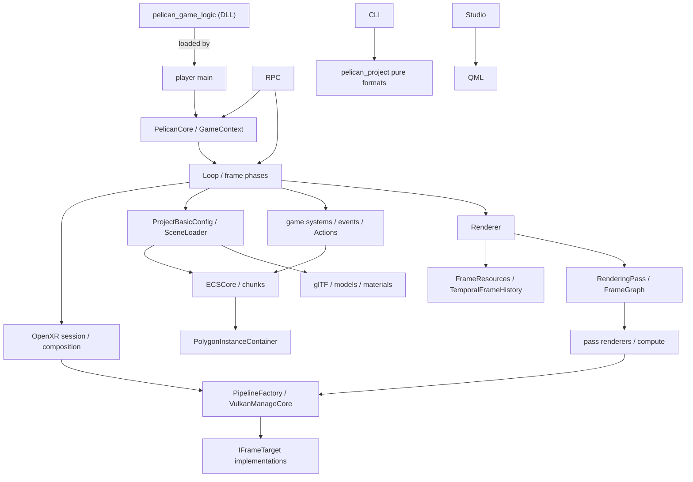

# 第8章 クラス・インターフェース索引

[索引へ戻る](README.md) / [前章](07_tools_rpc_tests.md) / [次章](09_black_magic_and_gotchas.md)

この章は「名前は分かったので宣言と本体へすぐ飛びたい」ときの索引です。全 private helper を列挙するのではなく、所有権または subsystem 境界を持つ主要型を収録しています。

## 8.1 Pelican で使われる6種類のインターフェース

Pelican の「interface」は pure virtual class だけではありません。実装は用途ごとに次の形を使い分けています。

| 形 | 代表 | 意味 |
|---|---|---|
| process module | [`DECLARE_MODULE`](../../src/core/container.hpp#L15) | process 中に遅延生成される実質 singleton。`GET_MODULE(T)` で取得 |
| public façade | [`GameContext`](../../src/core/userpublic/gamecontext.hpp#L22) | game code に内部 module を直接見せない、状態を持たない/薄い value façade |
| abstract interface | [`IFrameTarget`](../../src/core/vkcore/frametarget.hpp#L254)、[`ILogicalFrameTarget`](../../src/core/vkcore/renderer.hpp#L56) | window swapchain と headless target、flat と XR composition を virtual dispatch で交換 |
| tagged union | [`PassInfo`](../../src/core/renderingpass/renderingpass.hpp#L297) | 閉じた種類集合を `std::variant` と `visit`/type test で dispatch |
| type-erased callback table | [`ComponentInfo`](../../src/core/ecs/componentinfo.hpp#L21) | 任意 Component の construct/destroy/relocate/JSON 操作を function pointer 化 |
| resolver/adaptor | [`RenderTargetNameResolver`](../../src/core/renderingpass/rendertargetnameresolver.hpp#L11) | parser に巨大 container を渡さず、必要な名前解決だけを公開 |

この違いを無視して全部を「継承関係」として探すとコードを見失います。特に `DECLARE_MODULE` は base class ではなく、型ごとの `static std::optional<T>` を生む macro です。

> **設計決定:** 公開 game API で **継承ベースの interface を使うのは [`Behavior`](../../src/core/userpublic/behavior.hpp#L59) だけ** です(WP155 / BEH0)。System / Component / Event は duck typing(ダックタイピング — 「共通の基底を継承しているか」ではなく「必要なメンバや関数が実際に生えているか」だけで適合を判断する方式) + concept 検出ですが、Behavior は「1 オブジェクトにつき 1 個の多態インスタンスを arena が所有する」形なので仮想基底を選んでいます。上表の分類に当てはまらない唯一の例外として覚えてください。詳細は [第5章 §5.13](05_gameplay_and_services.md)。

## 8.2 名前の読み方

| suffix/prefix | だいたいの意味 | 例外・注意 |
|---|---|---|
| `...Definition` | parse 後、runtime object 作成前の value | Vulkan handle を持たないことが多い |
| `Compiled...` | name/definition が runtime ID や GPU object と結合済み | 必ずしも machine code の compile ではない |
| `...Container` | handle registry、GPU resource owner、state collection | 同じ base interface を持つわけではない |
| `...Core` | public wrapper から分離した testable implementation | `VulkanManageCore` は低レベル device owner という別の意味 |
| `...Resolver` | ID/name/path/view 変換の小さな read interface | ownership は持たない |
| `...Registerer` | template 型を runtime catalog へ型消去して登録 | static registration macro から呼ばれる |
| `...Loader` | file/JSON から runtime object への入口 | pure parser と runtime binding が別 file の場合あり |
| `...Renderer` | command buffer へ draw/dispatch を記録 | `Renderer` はそれらを束ねる orchestrator |
| `...Codec` | authored ↔ canonical ↔ runtime の双方向変換関数表 | [`ComponentCodec`](../../src/core/loader/componentcodec.hpp#L96) は 5 点セットが必須 |
| `...Adapter` | 既存サービスを別の呼び出し面へ橋渡し | `EditorCommandRpcAdapter` / `EditorCommandImGuiFakeAdapter` のように **同じサービス**を複数面へ出すために使う |
| `...Token` | 世代付きの取り消し可能な引換券 | `RegistrationToken` / `ECSArchetypeMigrationToken`。保持しているだけで有効とは限らない |
| `Prepared...` | throw しうる準備が済んだ **未公開**の候補 | `publish()` は no-fail、`rollback()` は `noexcept` |
| `Staged...` | 全割り当てが済み、公開が単一 no-fail 操作になった候補 | `StagedModelInstance` |

`Prepared...` / `Staged...` / `...Token` の 3 つは、[第9章](09_black_magic_and_gotchas.md)で扱う **prepare / publish(noexcept) / rollback(noexcept) の三点セット** という共通プロトコルの現れです。ECS、レンダラ、behavior、シーン保存、編集投影のすべてで同じ形が使われます。

## 8.3 起動・module・frame lifecycle

| 名前 | 形 | 宣言 | 主実装 | 責務 |
|---|---|---|---|---|
| `PelicanCore` | public façade | [`pelican_core.hpp`](../../src/core/userpublic/pelican_core.hpp#L8) | [`run()`](../../src/core/userpublic/pelican_core.cpp#L46) | settings から runtime 全体を起動し、loop と teardown を囲む |
| `EngineLaunchConfig` | module | [`launchconfig.hpp`](../../src/core/launchconfig.hpp#L19) | [`player main` で設定](../../src/player/main.cpp#L457) | headless、RPC、XR mode、game logic DLL、record/replay など起動時値 |
| `StartupMetrics` | module | [`startup.hpp`](../../src/core/startup.hpp#L21) | [`startup.cpp`](../../src/core/startup.cpp) | 起動段階の計測 |
| `XrActivationDecision` / `resolveXrActivation()` | pure decision | [`xractivation.hpp`](../../src/core/xractivation.hpp#L31) | [同 header](../../src/core/xractivation.hpp#L89) | headless/RPC/replay の forced-off と discovery hook から XR 起動可否を決定 |
| `gameLogicAbiVersion` / `initializeConfiguredGameLogic()` | game DLL 境界 | [`gamelogic.hpp`](../../src/core/userpublic/gamelogic.hpp#L8) | [`gamelogicreload.cpp`](../../src/core/gamelogic/gamelogicreload.cpp#L371) | game DLL(`pelican_game_logic`)の ABI 契約とロード・ホットリロード |
| `RegistrationOwner` | 登録所有者 ID | [`registrationowner.hpp`](../../src/core/userpublic/details/reload/registrationowner.hpp#L11) | 同左 | engine/game DLL 単位で static 登録を unregister 可能にする |
| `watch::ReloadService` | module | [`reloadservice.hpp`](../../src/core/watch/reloadservice.hpp#L75) | [`reloadservice.cpp`](../../src/core/watch/reloadservice.cpp) | FileWatcher 変更をフレーム境界で reload transaction として適用 |
| `CameraBakeRecorder` | module | [`camerabake.hpp`](../../src/core/playback/camerabake.hpp#L17) | [`camerabake.cpp`](../../src/core/playback/camerabake.cpp) | replay 実行から camera パスを記録(`--bake-camera-output`) |
| `parallelPrepareOrdered()` | free function | [`parallel_prepare.hpp`](../../src/core/parallel_prepare.hpp#L20) | header only | 順序保証付き並列 prepare(model ロード等) |
| `FastModuleContainer` | module 基盤 | [`container.hpp`](../../src/core/container.hpp#L53) | [`get()`](../../src/core/container.hpp#L149) | 型ごとの static `optional<T>` を lazy construct し、local container 終了時に登録の逆順で reset |
| `Loop` | module/orchestrator | [`loop.hpp`](../../src/core/appflow/loop.hpp#L7) | [`Loop::run()`](../../src/core/appflow/loop.cpp#L338) | windowed、windowed+XR、windowed+RPC、headless 固定フレーム、headless RPC の 5 経路を選び frame を進める |
| `EngineTime` | module | [`enginetime.hpp`](../../src/core/appflow/enginetime.hpp#L10) | [`setup/advance`](../../src/core/appflow/enginetime.cpp#L16) | realtime/fixed-step の time、dt、frame index |
| `FramerateAdjust` | module | [`framerate.hpp`](../../src/core/appflow/framerate.hpp#L7) | [`framerate.cpp`](../../src/core/appflow/framerate.cpp#L1) | window mode の frame pacing |
| `RuntimeTeardownGuard` | RAII guard | [`teardown.hpp`](../../src/core/appflow/teardown.hpp#L68) | [`teardown.cpp`](../../src/core/appflow/teardown.cpp) | ECS、physics、GPU instance、deletion queue を依存順に明示解放 |
| `RuntimeTeardownStep` / `runtime_teardown_order` / `RuntimeTeardownActions` | 規範順序の値 | [`teardown.hpp` 内](../../src/core/appflow/teardown.hpp#L12) / [`runtime_teardown_order`](../../src/core/appflow/teardown.hpp#L23) / [規範順序のコメント](../../src/core/appflow/teardown.hpp#L49) | 同左 | 8 段階の teardown 順序を型で固定。空 action は「起動前に落ちた module」 |
| `RuntimeTeardownMode` | enum | [`teardown.hpp` 内](../../src/core/appflow/teardown.hpp#L62) | 同左 | `runtime_reset` / `terminal_shutdown` |
| `EditorCommitQueueHook` / `installEditorCommitQueueHook()` | 単一所有フック | [`EditorCommitQueueHook()`](../../src/core/appflow/framephase.hpp#L39) / [`installEditorCommitQueueHook()`](../../src/core/appflow/framephase.hpp#L40) | [`invokeEditorCommitQueueHook()`](../../src/core/appflow/framephase.cpp#L122) | reload 公開後・`freeze_events` 直前に走る編集コミット点。未設置なら zero-state no-op |
| `RenderDocCapture` | module | [`renderdoccapture.hpp`](../../src/core/renderdoc/renderdoccapture.hpp#L66) | [`renderdoccapture.cpp`](../../src/core/renderdoc/renderdoccapture.cpp) / OFF 時は [`_stub.cpp`](../../src/core/renderdoc/renderdoccapture_stub.cpp) | F11 / `capture_gpu` の受動キャプチャ状態機械。RenderDoc をロードはしない |
| `DeferredCallbackLifetime` | lease + closeAndWait | [`deferredcallback.hpp`](../../src/core/vkcore/deferredcallback.hpp#L15) | header only | 遅延コールバックが module オーナへの生ポインタを持てる期間を閉じる |
| `JobSystem` | singleton service | [`job_system.hpp`](../../src/core/job_system.hpp#L15) | [`job_system.cpp`](../../src/core/job_system.cpp#L1) | ECS system job の worker 実行と synchronization |
| `Profiler` / `ScopedLogTimer` | helper | [`profiler.hpp`](../../src/core/profiler.hpp#L9) | [`profiler.cpp`](../../src/core/profiler.cpp#L1) | scope duration を log へ記録 |

`watch::ReloadService` の下には hot reload 基盤の部品として [`FileWatcher`](../../src/core/watch/filewatcher.hpp#L48)、[`ContentDigestState`](../../src/core/watch/contentdigest.hpp#L57)、[`AssetKey`](../../src/core/watch/assetkey.hpp#L12)、[`ReloadGate`](../../src/core/watch/reloadgate.hpp)、[`ReloadQueue`](../../src/core/watch/reloadqueue.hpp#L26)、[`ReloadCoordinator`](../../src/core/watch/reloadtransaction.hpp#L136) があります。

1 frame の共有関数は class ではなく [`updateFrameState()`](../../src/core/appflow/framephase.cpp#L128) です。入力、pre-update、game、post-update、scene transition の5 phase を通常 loop と RPC が共用します。

## 8.4 Project、path、data format、loading

| 名前 | 形 | 宣言 | 主実装 | 責務 |
|---|---|---|---|---|
| `ProjectSource` | module | [`projectsrc.hpp`](../../src/core/loader/projectsrc.hpp#L7) | [`projectsrc.cpp`](../../src/core/loader/projectsrc.cpp#L1) | 起動 settings と project root/source text を保持 |
| `ProjectBasicConfig` | module/value binding | [`basicconfig.hpp`](../../src/core/loader/basicconfig.hpp#L11) | [`constructor`](../../src/core/loader/basicconfig.cpp#L460) | engine default と project JSON を merge し型付き accessor を提供 |
| `ProjectPathResolver` | pure resolver | [`projectpathresolver.hpp`](../../src/project/projectpathresolver.hpp#L68) | [`resolveRef()`](../../src/project/projectpathresolver.cpp#L524) | `project://`、`user://`、asset store、fragment、escape防止。診断は戻り値 |
| `PathResolver` | engine module adapter | [`pathresolver.hpp`](../../src/core/loader/pathresolver.hpp#L8) | [`pathresolver.cpp`](../../src/core/loader/pathresolver.cpp#L1) | `ProjectPathResolver`へ委譲し、quillログと`engine://`埋め込みloaderだけを接続 |
| `ResolvedRef` | variant value | [`projectpathresolver.hpp`](../../src/project/projectpathresolver.hpp#L46) | [`ProjectPathResolver::resolveRef()`](../../src/project/projectpathresolver.cpp#L524) | filesystem path、engine resource、project/engine fragment の和型 |
| `SceneFormatDocument` | pure document | [`sceneformat.hpp`](../../src/project/sceneformat.hpp#L12) | [`sceneformat.cpp`](../../src/project/sceneformat.cpp#L1) | scene v1 schema の validate/normalize 結果 |
| `SceneLoader` | module/runtime binder | [`scene.hpp`](../../src/core/loader/scene.hpp#L32) | [`load()`](../../src/core/loader/scene.cpp#L271) | scene clear/load、object name↔Entity、camera/light/model/collider/behavior binding、transient glTF |
| `AuthoringSceneDocument` | 版付きドキュメント | [`authoringscenedocument.hpp`](../../src/core/loader/authoringscenedocument.hpp#L88) | [`authoringscenedocument.cpp`](../../src/core/loader/authoringscenedocument.cpp) | scene v1 の権威表現。`SceneRevision` とセッション安定な `AuthoringObjectId` を発行 |
| `AuthoringSceneDocumentStage` | 未公開の構造編集 | [`AuthoringSceneDocumentStage`](../../src/core/loader/authoringscenedocument.hpp#L137) | 同左 | insert / remove / restore / rename / reorder のみ。`finish(revision) &&` で確定 |
| `AuthoringObjectClosure` | 復元用クロージャ | [`AuthoringObjectClosure`](../../src/core/loader/authoringscenedocument.hpp#L61) | 同左 | `removeObject` の可逆情報(同じ `AuthoringObjectId` を同じ宣言区間へ戻す) |
| `ComponentCodec` | 5 点セットの関数表 | [`componentcodec.hpp`](../../src/core/loader/componentcodec.hpp#L96) | [`componentcodec.cpp`](../../src/core/loader/componentcodec.cpp) | authored ↔ canonical ↔ runtime。`ComponentCodecRuntimeKind`([`ComponentCodecRuntimeKind`](../../src/core/loader/componentcodec.hpp#L19))が runtime target 型を決める |
| `SceneSaveErrorCode` / `SceneSaveError` / `SceneSaveResult` | 保存契約 | [`SceneSaveErrorCode`](../../src/core/loader/basicconfig.hpp#L19) / [`SceneSaveError`](../../src/core/loader/basicconfig.hpp#L25) / [`SceneSaveResult`](../../src/core/loader/basicconfig.hpp#L48) | [`saveSceneDocument()`](../../src/core/loader/basicconfig.cpp#L623) | `ExternalModification` / `Unavailable` / `IoFailure` の型付き保存エラー |
| `EditorProjectionAdapterKind` / `EditorProjectionErrorCode` | 投影 transaction | [`EditorProjectionAdapterKind`](../../src/core/loader/editorprojectiontransaction.hpp#L20) / [`EditorProjectionErrorCode`](../../src/core/loader/editorprojectiontransaction.hpp#L39) | [`editorprojectiontransaction.cpp`](../../src/core/loader/editorprojectiontransaction.cpp) | 8 種の adapter と 11 種のエラー。公開方式は `EditorProjectionPublicationMode`([`EditorProjectionPublicationMode`](../../src/core/loader/editorprojectiontransaction.hpp#L34)) |
| `VrmaClip` 群 | pure document | [`vrmaanimation.hpp`](../../src/core/model/vrmaanimation.hpp#L87) | header + decoder | `.vrma` decode 結果(body / expression / gaze チャンネル + provenance) |
| `decodeVrmaAnimation()` / `loadVrmaAnimation()` | free function | [`vrmadecoder.hpp` 内](../../src/core/loader/vrmadecoder.hpp#L25) / [`loadVrmaAnimation()`](../../src/core/loader/vrmadecoder.hpp#L32) | [`vrmadecoder.cpp`](../../src/core/loader/vrmadecoder.cpp) | `.vrma` GLB decode。拡張子ゲートと content hash |
| `VrmaRetargetProfile` / `retargetVrmaClip()`(retarget = ある骨格向けに作られたアニメーションを、骨構成や rest 姿勢が違う別の骨格で再生できるよう変換すること) | 版付き profile | [`VrmaRetargetProfile`](../../src/core/animation/vrmaretarget.hpp#L67) / [`retargetVrmaClip()`](../../src/core/animation/vrmaretarget.hpp#L124) | [`vrmaretarget.cpp`](../../src/core/animation/vrmaretarget.cpp) | target-rig-local な不変中間クリップ。**`AnimationSource` ではない** |
| `ModelAssetContainer` | module/catalog | [`asset/model.hpp`](../../src/core/asset/model.hpp#L21) | [`model.cpp`](../../src/core/asset/model.cpp#L1) | asset data の model name と `ModelTemplate` を管理 |
| `GltfLoader` | module/loader | [`gltf.hpp`](../../src/core/model/gltf.hpp#L8) | [`gltf.cpp`](../../src/core/model/gltf.cpp#L1) | tinygltf Model を geometry/material/model template へ変換。`.vrm` も受理 |
| `ModelTemplate` | value graph | [`ModelTemplate`](../../src/core/model/modeltemplate.hpp#L103) | [`gltf load`](../../src/core/model/gltf.cpp#L1) | primitive range、material、skin/VAT metadata を持つ再配置可能 model 定義 |
| `LoadedImage` | value | [`imageloader.hpp`](../../src/core/loader/imageloader.hpp#L18) | [`imageloader.cpp`](../../src/core/loader/imageloader.cpp#L1) | stb/TinyEXR decode 後の pixels、extent、format |
| `AssetsManifest` 群 | pure document | [`assetsmanifest.hpp`](../../src/project/assetsmanifest.hpp#L26) | [`assetsmanifest.cpp`](../../src/project/assetsmanifest.cpp#L1) | file hash manifest の生成・検証・issue classification |
| `ImportManifest` 群 | pure document | [`importmanifest.hpp`](../../src/project/importmanifest.hpp#L11) | [`importmanifest.cpp`](../../src/project/importmanifest.cpp#L1) | 外部 tool delivery の source/output/SHA schema |
| `SurfaceFormatDocument` | pure document | [`surfaceformat.hpp`](../../src/project/surfaceformat.hpp#L193) | [`surfaceformat.cpp`](../../src/project/surfaceformat.cpp#L1) | `.surface` header と shader code の解析結果 |
| `MaterialFormatDocument` | pure document | [`materialformat.hpp`](../../src/project/materialformat.hpp#L41) | [`materialformat.cpp`](../../src/project/materialformat.cpp#L1) | material base、surface、parameter、texture の型付き定義 |
| `RenderFeatureComposeResult` | pure transformation result | [`featurecompose.hpp`](../../src/project/featurecompose.hpp#L16) | [`composeRenderFeatureConfig()`](../../src/project/featurecompose.cpp#L2559) | base rendering JSON に feature fragment を順序付き合成 |
| VRM semantic 型群 | pure document | [`vrmsemantic.hpp`](../../src/core/model/vrmsemantic.hpp#L21) | [`vrmsemantic.cpp`](../../src/core/model/vrmsemantic.cpp) | VRM の humanoid bone / expression / lookAt / firstPerson デコード(WP111) |
| `VrmAutoTriangleSplit` | pure algorithm | [`vrmfirstperson.hpp`](../../src/core/model/vrmfirstperson.hpp#L22) | [`vrmfirstperson.cpp`](../../src/core/model/vrmfirstperson.cpp) | VRM firstPerson の MeshAnnotation.Auto 三角形分割(WP134) |
| `MorphTargetLayout` | value | [`morphtarget.hpp`](../../src/core/model/morphtarget.hpp#L43) | header only | morph target delta の GPU layout(WP121) |
| `SkeletalAnimationClip` | value | [`skeletalanimation.hpp`](../../src/core/model/skeletalanimation.hpp#L39) | [`skeletalanimation.cpp`](../../src/core/model/skeletalanimation.cpp) | glTF skeletal animation channel/clip |
| KTX2 loader | free functions | [`ktx2.hpp`](../../src/core/loader/ktx2.hpp) | [`ktx2.cpp`](../../src/core/loader/ktx2.cpp) | KTX2(BC5/BC7)テクスチャの decode |
| `AtlasAsset` | pure document | [`atlasasset.hpp`](../../src/core/asset/atlasasset.hpp#L45) | [`atlasasset.cpp`](../../src/core/asset/atlasasset.cpp) | sprite atlas の asset 定義(runtime 側は `AtlasAssetResource`) |
| `lowerMaterial()` / OpenPBR mapping | pure transformation | [`materiallowering.hpp`](../../src/project/materiallowering.hpp#L140) | [`openpbrmapping.hpp`](../../src/project/openpbrmapping.hpp) | material 定義を surface parameter へ lowering(高レベルな宣言を、より実行に近い低レベルの表現へ落とす変換を指すコンパイラ用語)(WP116/117) |
| `ImportRules` | pure document | [`importrules.hpp`](../../src/project/importrules.hpp) | [`importrules.cpp`](../../src/project/importrules.cpp) | match/recipe/defaults の 3 層優先を持つルールベース import(`pelican_cli import --rules`) |

`ImageLoader` は class ではなく [`loadImageFile()` / `loadImageMemory()`](../../src/core/loader/imageloader.hpp#L56) という free function です。純粋変換に ownership object を無理に作らない方針がこの周辺に多く見られます。

## 8.5 公開 game API とサービス

project game code が最優先で参照する層です。内部の `GET_MODULE` を game 側へ漏らさない境界になっています。

| 名前 | 形 | 宣言 | 主実装 | 責務 |
|---|---|---|---|---|
| `GameContext` | public value façade | [`gamecontext.hpp`](../../src/core/userpublic/gamecontext.hpp#L20) | [`gamecontext.cpp`](../../src/core/userpublic/gamecontext.cpp#L1) | time、input、entity、camera、physics(raycast/overlap/shapeCast + `QueryFilter`)、sprite、**light**([`setDirectionalLightDirection()`](../../src/core/userpublic/gamecontext.hpp#L50))、pose action、audio、save、RNG を統一 API で公開 |
| `Behavior` | **仮想基底**(唯一の例外) | [`behavior.hpp`](../../src/core/userpublic/behavior.hpp#L59) | [`behaviorarena.cpp`](../../src/core/gamelogic/behaviorarena.cpp) | `onInit` / `onUpdate` / `onDestroy(noexcept)` |
| `BehaviorContext` | `GameContext` 派生 | [`BehaviorContext`](../../src/core/userpublic/behavior.hpp#L24) | 同左 | `self()` / `attachment()` / `attachmentSeq()` / `params<T>()` と遅延 create/remove |
| `BehaviorAttachmentHandle` | typed handle | [`BehaviorAttachmentHandle()`](../../src/core/userpublic/behavior.hpp#L13) | 同左 | attachment identity(`attachment_seq` と対) |
| `PELICAN_REGISTER_BEHAVIOR` | 自動登録 macro | [`behavior/registerer.hpp`](../../src/core/userpublic/details/behavior/registerer.hpp#L319) | 同 header | stable name + schema version + event handler 収集 |
| `BehaviorAttachmentArena` | module | [`behaviorarena.hpp`](../../src/core/gamelogic/behaviorarena.hpp#L109) | [`behaviorarena.cpp`](../../src/core/gamelogic/behaviorarena.cpp) | 生存・初期化・イベント配送・遅延構造変更・owner 解放 |
| `structFields` / `field` / `required` / `defaulted` / `enumValues` | consteval DSL(consteval = 必ずコンパイル時に評価される関数につける指定で、実行時には呼べません。DSL = 用途を絞った小さな記述言語) | [`structfieldschema.hpp`](../../src/core/userpublic/details/schema/structfieldschema.hpp#L445) | header only | use-site policy 強制つきフィールド schema |
| `eventPayloadPolicy` / `behaviorParamsPolicy` / `componentPolicy()` | policy | [同](../../src/core/userpublic/details/schema/structfieldschema.hpp#L83) / [`behaviorParamsPolicy` の定義](../../src/core/userpublic/details/schema/structfieldschema.hpp#L84) / [`componentPolicy()`](../../src/core/userpublic/details/schema/structfieldschema.hpp#L86) | 同左 | 3 種の use-site 制約 |
| `OverlapEnter` / `OverlapExit` | engine event | [`OverlapEnter`](../../src/core/userpublic/events.hpp#L18) / [`OverlapExit`](../../src/core/userpublic/events.hpp#L23) | [`PhysWorld::updateTriggers()`](../../src/core/phys/physworld.cpp#L548) | 物理トリガの決定的 Enter/Exit(`self` / `other` は full `EntityId`) |
| `RegistrationToken` / `RegistrationKind` | 世代付き登録トークン | [`RegistrationToken`](../../src/core/userpublic/details/reload/registrationowner.hpp#L30) / [`RegistrationKind`](../../src/core/userpublic/details/reload/registrationowner.hpp#L14) | [`registrationowner.cpp`](../../src/core/userpublic/details/reload/registrationowner.cpp) | system / component / event / behavior の個別解除。`RegistrationOwner` は上位 32bit=generation、下位 32bit=identity |
| `GameObjects` | typestate builder façade(typestate — 「今どの段階か」を実行時フラグではなく戻り値の型そのもので表す設計。`addComponent()` のたびに別の型が返り、Component が 0 個の状態には `finish()` が存在しないなど、段階に合わない呼び出しがコンパイル時に弾かれます) | [`gameobjects.hpp`](../../src/core/userpublic/gameobjects.hpp#L20) | [`gameobjects.cpp`](../../src/core/userpublic/gameobjects.cpp#L1) | Component 集合を template chain で指定して entity を create |
| `UserInput` | legacy/raw façade | [`userinput.hpp`](../../src/core/userpublic/userinput.hpp#L94) | [`userinput.cpp`](../../src/core/userpublic/userinput.cpp#L1) | key/mouse の frame snapshot を公開 |
| `Actions` | named action façade | [`userinput.hpp`](../../src/core/userpublic/userinput.hpp#L108) | [`userinput.cpp`](../../src/core/userpublic/userinput.cpp#L1) | action set stack、button/axis2 evaluation、consumption |
| `DeterministicRng` | module/service | [`deterministicrng.hpp`](../../src/core/userpublic/deterministicrng.hpp#L9) | [`deterministicrng.cpp`](../../src/core/userpublic/deterministicrng.cpp#L1) | PCG32(permuted congruential generator の 32bit 出力版 — 線形合同法で進めた 64bit 内部状態に xorshift と回転を掛けて出力する、状態が小さく再現しやすい擬似乱数生成器) state と inclusive integer/float API |
| `Audio` | module + backend interface | [`audio.hpp`](../../src/core/audio/audio.hpp#L23) | [`audio.cpp`](../../src/core/audio/audio.cpp#L255) | sound handle、bus volume。miniaudio/Null backend を pimpl 的(pointer to implementation — 実装クラスを header では前方宣言だけにして `unique_ptr` で持ち、定義を .cpp 側へ隠す書き方。header に miniaudio が漏れません)に選択 |
| `Persistence` | module/service | [`persistence.hpp`](../../src/core/persistence/persistence.hpp#L28) | [`saveData()`](../../src/core/persistence/persistence.cpp#L272) | settings、audio settings、slot save の検証と atomic replace |
| `PhysWorld` | module/runtime index | [`physworld.hpp`](../../src/core/phys/physworld.hpp#L33) | [`bindCollider()`](../../src/core/phys/physworld.cpp#L356) | object 名、transform、shape を bind し query/debug draw/trigger event へ供給。`PreparedState` による prepare/publish あり([`PreparedState`](../../src/core/phys/physworld.hpp#L47)) |
| `phys::Shape` | variant geometry | [`physquery.hpp`](../../src/core/phys/physquery.hpp#L38) | [`physquery.cpp`](../../src/core/phys/physquery.cpp#L1) | sphere/box/capsule の raycast/overlap pure algorithm |
| `phys::QueryFilter` / `ShapeCastHit` | query values | [`physquery.hpp`](../../src/core/phys/physquery.hpp#L76) | [同 header](../../src/core/phys/physquery.hpp#L138) | クエリの include/exclude filter と shapeCast 結果 |
| physics provider ABI | C ABI struct | [`abi_v2.hpp`](../../src/core/userpublic/physics/abi_v2.hpp) / [`query_types.hpp`](../../src/core/userpublic/physics/query_types.hpp) | [`builtinProviderV2()`](../../src/core/phys/builtinphysicsprovider.hpp#L7) / [`joltProviderV2()`](../../src/core/phys/joltphysicsprovider.hpp#L7) | provider の差し替え境界(v2 で shapeCast、capability bits)。選択は [`physicsruntime.hpp`](../../src/core/phys/physicsruntime.hpp) |
| `Camera` | module/state | [`camera.hpp`](../../src/core/renderer/camera.hpp#L17) | [`Camera::Camera()`](../../src/core/renderer/camera.cpp#L539) | projection/view、scene camera、orbit/follow/fly controller、[`discontinuityRevision()`](../../src/core/renderer/camera.hpp#L104) |
| `SpriteWorld` / `FlipbookClip` | public 2D API | [`spriteworld.hpp`](../../src/core/userpublic/sprite/spriteworld.hpp) / [`flipbook.hpp`](../../src/core/userpublic/sprite/flipbook.hpp#L30) | [`spriteworld.cpp`](../../src/core/userpublic/sprite/spriteworld.cpp) | sprite command ABI、flipbook 再生、pixel policy([`pixelpolicy.hpp`](../../src/core/userpublic/sprite/pixelpolicy.hpp)) |
| `CharacterContact2D` / `moveAndSlide2D` 系 | public 2D helper | [`charactercontroller2d.hpp`](../../src/core/userpublic/platformer/charactercontroller2d.hpp#L22) | [`charactercontroller2d.cpp`](../../src/core/userpublic/platformer/charactercontroller2d.cpp) | 2D platformer の move-and-slide(WP109) |
| `Vrm::ApplicationServiceV1` | versioned service struct | [`vrm_application_v1.hpp`](../../src/core/userpublic/animation/vrm_application_v1.hpp#L180) | [`vrmapplication.hpp`](../../src/core/animation/vrmapplication.hpp) | VRM expression/application sink の公開 ABI(WP123b) |
| `Animation::AnimationServiceV1` / `AnimationSourceHandle` | C ABI struct + typed handle | [animation/abi_v1.hpp](../../src/core/userpublic/animation/abi_v1.hpp#L596) / [`PELICAN_ANIM_HANDLE(InstanceHandle)`](../../src/core/userpublic/animation/abi_v1.hpp#L39) | [`animationservice.cpp`](../../src/core/animation/animationservice.cpp) | animation provider ABI v1。source 面は [`claim_source`](../../src/core/userpublic/animation/abi_v1.hpp#L622) / `release_source` / [`handoff_source`](../../src/core/userpublic/animation/abi_v1.hpp#L624) / [`sample_animation_source_at`](../../src/core/userpublic/animation/abi_v1.hpp#L628)(WP178。VRMA 由来 source の占有・委譲・サンプル) |
| `AnimationGraph::DocumentV1` / `EvaluatorV1` | 公開 anim graph | [animation/animgraph.hpp](../../src/core/userpublic/animation/animgraph.hpp#L54) / [`EvaluatorV1`](../../src/core/userpublic/animation/animgraph.hpp#L94) | [`animgraph.cpp`](../../src/core/userpublic/animation/animgraph.cpp) | `pelican.anim_graph` v1 の [`parseDocumentV1()`](../../src/core/userpublic/animation/animgraph.hpp#L64) と、`bind()` / `prepareTick()` / `setParameter()` による決定的評価。テストは `animgraph_test` / `vrmasource_test` |
| `SeqPlayer` | optional module | [`seqplayer.hpp`](../../src/core/playback/seqplayer.hpp#L50) | [`seqplayer.cpp`](../../src/core/playback/seqplayer.cpp#L1) | JSONL transform sequence を時刻 sample して scene object へ適用 |
| `VatPlayer` | optional module | [`vatplayer.hpp`](../../src/core/playback/vatplayer.hpp#L11) | [`vatplayer.cpp`](../../src/core/playback/vatplayer.cpp#L1) | VAT clip の選択・再生状態を GPU instance へ反映 |

game system の interface は base class ではなく macro + function signature です。[`PELICAN_REGISTER_SYSTEM`](../../src/core/userpublic/details/system/registerer.hpp#L173) が `void(GameContext&)` callback と phase/order/name を catalog へ登録します。event も [`PELICAN_REGISTER_EVENT`](../../src/core/userpublic/details/event/registerer.hpp#L257) が型と handler を登録します。registry には `RegistrationOwner` が付き、game DLL reload 時に owner 単位で unregister されます。公開 API の関数/型には [`PELICAN_API`](../../src/core/userpublic/export.hpp)(DLL export 修飾)が必要です。

上表の `Animation::AnimationServiceV1` のような C ABI struct は、`struct_size` による版交渉で DLL とエンジンをつなぎます。この交渉には **3 種類の異なる下限ルール**が混在していて(交渉エントリは 16 バイト、加算的テールを持つ descriptor は手書きの凍結プレフィクス、それ以外は既定の `sizeof(T)`)、しかも [`validateDescriptor()`](../../src/core/animation/animationserviceabi.hpp#L15) は同名の別実装が [`ProbeRuntime` 側](../../src/core/animation/animationprobe.cpp#L38)にもあって既定値が違います。この落とし穴の分解は [第9章 §9.2](09_black_magic_and_gotchas.md) の難所ブロック「`struct_size` の 3 段ルール」を参照してください。

## 8.6 ECS

| 名前 | 形 | 宣言 | 主実装 | 責務 |
|---|---|---|---|---|
| `ECSCore` | module façade | [`ecs/core.hpp`](../../src/core/ecs/core.hpp#L13) | header inline | 内部 `ECSCoreTemplatePublic` を所有し core/scene code へ narrow API を出す |
| `ECSCoreTemplatePublic` | world implementation | [`coretemplate.hpp`](../../src/core/userpublic/details/ecs/coretemplate.hpp#L97) | [`coretemplate.cpp`](../../src/core/userpublic/details/ecs/coretemplate.cpp#L25) | ID table、generation、archetype/chunk、system query cache、transaction mutation |
| `ECSComponentChunk` | SoA storage(SoA = structure of arrays) | [`chunk.hpp`](../../src/core/userpublic/details/ecs/chunk.hpp#L19) | [`chunk.cpp`](../../src/core/userpublic/details/ecs/chunk.cpp#L95) | archetype 固有の component arrays、versions、swap-delete(削除した位置へ末尾の要素を移してから縮める方式。並び順は保たれませんが穴が開かず O(1) です)、[`CHUNK_CAPACITY = 4096`](../../src/core/userpublic/details/ecs/chunk.hpp#L69) |
| `ECSComponentChunk::VariedArray` | aligned type-erased array | [`chunk.hpp`](../../src/core/userpublic/details/ecs/chunk.hpp#L25) | [`chunk.cpp`](../../src/core/userpublic/details/ecs/chunk.cpp#L17) | size/alignment/callback だけで任意 component を格納 |
| `ECSArchetypeMigration` / `ECSArchetypeMigrationToken` | transaction | [`ECSArchetypeMigration`](../../src/core/ecs/archetypemigration.hpp#L118) / [`ECSArchetypeMigrationToken`](../../src/core/ecs/archetypemigration.hpp#L52) | [`archetypemigration.cpp`](../../src/core/ecs/archetypemigration.cpp) | component 追加/削除の失敗原子性 |
| `ECSArchetypeMigrationAdapter` | 抽象 | [`ECSArchetypeMigrationAdapter`](../../src/core/ecs/archetypemigration.hpp#L44) | 実装は各投影 WP | `prepare()`(throw 可) / `rollback()`(noexcept) / `publish()`(no-fail) |
| `ECSEntityMutation` / `ECSEntityMutationToken` | transaction | [`ECSEntityMutation`](../../src/core/ecs/archetypemigration.hpp#L106) / [`ECSEntityMutationToken`](../../src/core/ecs/archetypemigration.hpp#L82) | 同左 | entity 生成/破棄の prepare/publish |
| `PreparedComponentValue<T>` / `PreparedComponentSwap<T>` | 値の prepare/publish | [`coretemplate.hpp` 内](../../src/core/userpublic/details/ecs/coretemplate.hpp#L217) / [`PreparedComponentSwap`](../../src/core/userpublic/details/ecs/coretemplate.hpp#L228) | 同 header | 投げうるコピーを公開前に済ませ、publish/rollback は no-throw 代入 + version 交換だけ |
| `internal::ECSHazardPolicy`(hazard = 同じ Component に触る 2 つの System のうち少なくとも一方が書き、かつ順序が決まっていない状態。実行順しだいで結果が変わります) / `buildECSExecutionPlan()` | scheduler | [`ECSHazardPolicy`](../../src/core/userpublic/details/ecs/coretemplate.hpp#L35) / [`buildECSExecutionPlan()`](../../src/core/userpublic/details/ecs/coretemplate.hpp#L66) | [`buildECSExecutionPlan()`](../../src/core/userpublic/details/ecs/coretemplate.cpp#L206) | read/write からの競合検出、自動直列化 or strict 拒否、cycle 検出 |
| `ECSCoreTemplatePublic::IsolationSnapshot` | 診断値 | [`IsolationSnapshot`](../../src/core/userpublic/details/ecs/coretemplate.hpp#L162) | [`isolationSnapshot()`](../../src/core/userpublic/details/ecs/coretemplate.hpp#L183) | global tick / free indices / entity slot / chunk mask+version を隔離テストへ露出 |
| `EntityId` | public value handle | [`entity.hpp`](../../src/core/userpublic/details/ecs/entity.hpp#L12) | value type | `index + generation`。stale handle を generation で拒否 |
| `ComponentRef` | untyped span view | [`component.hpp`](../../src/core/userpublic/details/ecs/component.hpp#L9) | value type | chunk 内の component base pointer、stride、count |
| `ChunkView` | system query view | [`coretemplate.hpp`](../../src/core/userpublic/details/ecs/coretemplate.hpp#L71) | [`update()` で組立](../../src/core/userpublic/details/ecs/coretemplate.hpp#L513) | required component ごとの pointer array と entity count |
| `ComponentInfo` | type-erased metadata | [`componentinfo.hpp`](../../src/core/ecs/componentinfo.hpp#L21) | registration callbacks | size/alignment/name/construct/destroy/relocate/init/deinit/JSON ref |
| `ComponentInfoManager` | module/catalog | [`componentinfo.hpp`](../../src/core/ecs/componentinfo.hpp#L34) | [`componentinfo.cpp`](../../src/core/ecs/componentinfo.cpp#L7) | Component ID→metadata、scene name→ID、JSON population |
| `UserComponentRegistererTemplatePublic` | template adapter | [`registerer.hpp`](../../src/core/userpublic/details/component/registerer.hpp#L20) | [`registerComponent<T>()`](../../src/core/userpublic/details/component/registerer.hpp#L36) | C++ type traits と member 有無を callback table へ変換。戻り値は `RegistrationToken`。解除は [`unregisterComponent()`](../../src/core/userpublic/details/component/registerer.hpp#L90) / [`unregisterComponents(owner)`](../../src/core/userpublic/details/component/registerer.hpp#L91) |
| `UserGameSystemRegistererTemplatePublic` | template adapter | [`system/registerer.hpp`](../../src/core/userpublic/details/system/registerer.hpp#L92) | [`system/registerer.cpp`](../../src/core/userpublic/details/system/registerer.cpp#L1) | static game system registration と deterministic sort |
| `UserEventRegistererTemplatePublic` | template adapter | [`event/registerer.hpp`](../../src/core/userpublic/details/event/registerer.hpp#L40) | [`event/registerer.cpp`](../../src/core/userpublic/details/event/registerer.cpp#L1) | event 型 catalog、JSON binder、frame queue、handler delivery |
| `ECSPredefinedRegistration` | module/bootstrap | [`predefined.hpp`](../../src/core/ecs/predefined.hpp#L10) | [`predefined.cpp`](../../src/core/ecs/predefined.cpp#L1) | built-in component と internal ECS system を登録 |
| `LocalTransformSystem` | ECS system module | [`localtransformsystem.hpp`](../../src/core/ecs/predefined/localtransformsystem.hpp#L13) | [`localtransformsystem.cpp`](../../src/core/ecs/predefined/localtransformsystem.cpp#L1) | public local transform を engine transform へ同期 |
| `SimpleModelViewTransformSystem` | ECS system module | [`modelviewtransoformsystem.hpp`](../../src/core/ecs/predefined/modelviewtransoformsystem.hpp#L12) | [`modelviewtransformsystem.cpp`](../../src/core/ecs/predefined/modelviewtransformsystem.cpp#L1) | ECS transform を GPU instance transform へ反映 |
| `SimpleModelViewUpdateSystem` | ECS system module | [`modelviewupdatesystem.hpp`](../../src/core/ecs/predefined/modelviewupdatesystem.hpp#L11) | [`modelviewupdatesystem.cpp`](../../src/core/ecs/predefined/modelviewupdatesystem.cpp#L1) | modelview change を GPU resource/update へ伝える |
| `AnimationSystem` | ECS system module | [`animationsystem.hpp`](../../src/core/ecs/predefined/animationsystem.hpp#L17) | [`animationsystem.cpp`](../../src/core/ecs/predefined/animationsystem.cpp) | `AnimationComponent` の再生状態を model instance へ反映 |
| `SpriteViewRenderSystem` | ECS system module | [`spriteviewsystem.hpp`](../../src/core/ecs/predefined/spriteviewsystem.hpp#L15) | [`spriteviewsystem.cpp`](../../src/core/ecs/predefined/spriteviewsystem.cpp) | `SpriteViewComponent` を sprite scene へ反映 |
| `AnimationServiceRuntime` | module/service | [`animationservice.hpp`](../../src/core/animation/animationservice.hpp#L19) | [`animationservice.cpp`](../../src/core/animation/animationservice.cpp) | アニメーション評価フェーズと VRM application service の実行 |
| `EventPayloadSchema` | pure schema | [`payloadschema.hpp`](../../src/core/userpublic/details/event/payloadschema.hpp#L53) | header only | event 型の宣言的 payload schema v1(compile-time 検証 fixture あり) |

Component value は [`LocalTransformComponent`](../../src/core/userpublic/components/localtransform.hpp#L10)、[`SimpleModelViewComponent`](../../src/core/userpublic/components/modelview.hpp#L10)、[`AnimationComponent`](../../src/core/userpublic/components/animation.hpp#L8)、[`SpriteViewComponent`](../../src/core/userpublic/components/spriteview.hpp#L16)、内部 [`TransformComponent`](../../src/core/ecs/predefined/transform.hpp#L9) などです。`ColliderComponent` は scene/public component 型ですが、archetype chunk に入る通常 ECS component ではなく `SceneLoader` から `PhysWorld` へ直接 bind される特別経路です。scene の `behavior` component も ECS へは入らず `BehaviorAttachmentArena` へ流れます([第9章](09_black_magic_and_gotchas.md))。

## 8.7 入力と frame boundary

| 名前 | 形 | 宣言 | 主実装 | 責務 |
|---|---|---|---|---|
| `InputStateCore` | testable core | [`inputstate.hpp`](../../src/core/os/inputstate.hpp#L206) | [`inputstate.cpp`](../../src/core/os/inputstate.cpp) | ordered event queue から snapshot、edge、mouse delta を構築 |
| `InputState` | module wrapper | [`inputstate.hpp`](../../src/core/os/inputstate.hpp#L259) | [`inputstate.cpp`](../../src/core/os/inputstate.cpp) | `InputStateCore` を module interface として転送 |
| `InputSnapshot` | immutable-ish frame value | [`inputstate.hpp`](../../src/core/os/inputstate.hpp#L61) | [`inputstate.cpp`](../../src/core/os/inputstate.cpp) | down/pushed/released、cursor、delta、axis |
| `FrameInput` | scoped borrow | [`inputstate.hpp`](../../src/core/os/inputstate.hpp#L173) | [`inputstate.cpp`](../../src/core/os/inputstate.cpp) | frame generation と borrow state を持ち、次 frame への持ち越しを検出 |
| `InputSequenceRuntime` | module | [`inputsequence.hpp`](../../src/core/os/inputsequence.hpp#L45) | [`inputsequence.cpp`](../../src/core/os/inputsequence.cpp) | 入力の record/replay を event queue 境界へ挿入(`--record-input` / `--replay`、RPC からも制御) |
| `InputActionMap` | pure-ish parsed catalog | [`actionmap.hpp`](../../src/core/os/actionmap.hpp#L49) | [`actionmap.cpp`](../../src/core/os/actionmap.cpp#L1) | action set、binding、lookup を保持 |
| `InputActionFrame` | frame evaluator | [`actionmap.hpp`](../../src/core/os/actionmap.hpp#L71) | [`actionmap.cpp`](../../src/core/os/actionmap.cpp#L836) | frozen snapshot と set stack から action 値/consumption を評価 |
| `Window` | module/event source | [`window.hpp`](../../src/core/os/window.hpp#L15) | [`window.cpp`](../../src/core/os/window.cpp#L1) | GLFW window、Vulkan surface、native input callback |

## 8.8 Rendering: 定義、計画、runtime binding

| 名前 | 形 | 宣言 | 主実装 | 責務 |
|---|---|---|---|---|
| `Renderer` | module/orchestrator | [`renderer.hpp`](../../src/core/vkcore/renderer.hpp#L63) | [`renderLogicalFrame()`](../../src/core/vkcore/renderer.cpp#L3827) / [`render()`](../../src/core/vkcore/renderer.cpp#L4708) | hot reload、graph variant、logical frame(multi-view)、trace を束ねる |
| `ILogicalFrameTarget` / `RenderGraphVariant` | abstract interface / value | [`renderer.hpp`](../../src/core/vkcore/renderer.hpp) | flat=`FlatLogicalFrameTarget`(renderer.cpp内部)、XR=`XrCompositionTarget` | logical frameの描画先とflat/`#xr` graph切替 |
| `RenderViewParameters` / `RenderViewFamily` / `RenderViewFamilies` / `TemporalViewFamilyHistory` | pure values | [`viewfamily.hpp`](../../src/core/renderer/viewfamily.hpp) | [`viewfamily.cpp`](../../src/core/renderer/viewfamily.cpp) | provider-owned non-jittered view、`$main`+named secondary family集合、stable identity、family projection modifier、ID-keyed temporal matrix |
| `PreviewGraphProgram` / `precompilePreviewGraph()` | data-only graph | [`CompiledRenderPipeline`](../../src/core/renderingpass/previewgraph.hpp#L15) / [coordinated family 側の注記](../../src/core/renderingpass/previewgraph.hpp#L27) | [`previewgraph.cpp`](../../src/core/renderingpass/previewgraph.cpp) | 第3の graph variant。`RenderingPassId` を持たず `renderLogicalFrame` を通らない |
| `PreviewExecutor` / `PreviewCaptureRequest` / `PreviewCaptureResult` | 隔離実行 | [`PreviewExecutor`](../../src/core/vkcore/previewexecutor.hpp#L61) / [`PreviewCaptureRequest`](../../src/core/vkcore/previewexecutor.hpp#L25) / [`PreviewCaptureResult`](../../src/core/vkcore/previewexecutor.hpp#L36) | [`previewexecutor.cpp`](../../src/core/vkcore/previewexecutor.cpp) | request-local な資源で preview を描いて返す(現状は CPU 模式ラスタ) |
| `previewStateInventory()` | 診断 | [`previewStateInventory()`](../../src/core/vkcore/previewexecutor.hpp#L59) | 同左 | WP172 の所有権インベントリ。**並び順も診断契約の一部** |
| `FrameResources` | module/GPU owner | [`frameresources.hpp`](../../src/core/renderer/frameresources.hpp#L43) | [`frameresources.cpp`](../../src/core/renderer/frameresources.cpp) | FrameUBO の in_flight×全family view slotとmain multiview slot管理(`beginLogicalFrame`/`selectSequentialView`/`selectMultiview`) |
| `ProjectionJitterSettings` / `RenderFrameSnapshot` / `TemporalFrameHistory` | pure values | [`projectionjitter.hpp`](../../src/core/renderer/projectionjitter.hpp#L10) | [`projectionjitter.cpp`](../../src/core/renderer/projectionjitter.cpp) | projection jitter(投影行列を毎フレームサブピクセル単位でずらすこと。TAA = temporal anti-aliasing が複数フレームの結果を混ぜて解像感を上げるために、サンプル点を時間方向へ散らします) 設定と view ごとの temporal history(WP112〜115) |
| `VelocityPassContainer` | module/pass registry | [`velocitypasscontainer.hpp`](../../src/core/renderer/velocitypasscontainer.hpp#L12) | [`velocitypasscontainer.cpp`](../../src/core/renderer/velocitypasscontainer.cpp) | TAA velocity pass の pipeline/描画 |
| `ShadowDepthPassContainer` | module/pass registry | [`shadowdepthpasscontainer.hpp`](../../src/core/renderer/shadowdepthpasscontainer.hpp#L12) | [`shadowdepthpasscontainer.cpp`](../../src/core/renderer/shadowdepthpasscontainer.cpp) | depth-only shadow pass |
| `SpriteRenderer` / `SpriteScene` | module | [`spriterenderer.hpp`](../../src/core/renderer/spriterenderer.hpp#L38) / [`spritescene.hpp`](../../src/core/renderer/spritescene.hpp#L20) | [`spriterenderer.cpp`](../../src/core/renderer/spriterenderer.cpp) | 2D sprite の batch/描画と scene 状態 |
| `AtlasAssetResource` | module/GPU owner | [`atlasassetresource.hpp`](../../src/core/renderer/atlasassetresource.hpp#L33) | [`atlasassetresource.cpp`](../../src/core/renderer/atlasassetresource.cpp) | atlas asset の GPU texture 化 |
| `PassDefinition` | pure definition | [`renderingpass.hpp`](../../src/core/renderingpass/renderingpass.hpp#L105) | JSON parser 群 | target、input、load/store、clear、`PassInfo` variant |
| `CompiledRenderingPass` | bound value | [`renderingpass.hpp`](../../src/core/renderingpass/renderingpass.hpp#L183) | [`compileRenderingPassRuntime()`](../../src/core/renderingpass/renderingpassruntimecompiler.cpp#L2347) | pass/task definition と登録済み runtime ID の集合 |
| `RenderingPassContainer` | module/registry | [`renderingpasscontainer.hpp`](../../src/core/renderingpass/renderingpasscontainer.hpp#L13) | [`registerCompiledRenderingPass()`](../../src/core/renderingpass/renderingpasscontainer.cpp#L34) | rendering pass name/ID、enabled feature を保持 |
| `FrameGraphDefinition` | pure graph | [`frameplanner.hpp`](../../src/core/renderingpass/frameplanner.hpp#L116) | [`parseFrameGraphDefinitionsFromConfigJson()`](../../src/core/renderingpass/frameplanner.cpp#L1609) | node declarations と既知 resource |
| `FramePlan` | planner output | [`frameplanner.hpp`](../../src/core/renderingpass/frameplanner.hpp#L59) | [`planFrameGraph()`](../../src/core/renderingpass/frameplanner.cpp#L1655) | stable order、levels、RAW barriers |
| `FrameGraphRuntimeContainer` | module/binder | [`framegraphruntime.hpp`](../../src/core/renderingpass/framegraphruntime.hpp#L172) | [`registerExecutionPlan()`](../../src/core/renderingpass/framegraphruntime.cpp#L577) | plan の node 名を compiled pass/task index へ bind |
| `RenderTargetContainer` | module/GPU owner | [`rendertargetcontainer.hpp`](../../src/core/renderingpass/rendertargetcontainer.hpp#L14) | [`registerRenderTarget()`](../../src/core/renderingpass/rendertargetcontainer.cpp#L395) | named offscreen image/view、extent metadata、resize recreate |
| `RenderTargetNameResolver` | adaptor | [`rendertargetnameresolver.hpp`](../../src/core/renderingpass/rendertargetnameresolver.hpp#L11) | [`rendertargetnameresolver.cpp`](../../src/core/renderingpass/rendertargetnameresolver.cpp#L1) | JSON target 名→typed ID |
| `RenderTargetMetadataResolver` | adaptor | [`rendertargetmetadataresolver.hpp`](../../src/core/renderingpass/rendertargetmetadataresolver.hpp#L11) | [`rendertargetmetadataresolver.cpp`](../../src/core/renderingpass/rendertargetmetadataresolver.cpp#L1) | target ID→format/extent/usage |
| `RenderTargetImageViewResolver` | adaptor | [`rendertargetimageviewresolver.hpp`](../../src/core/renderingpass/rendertargetimageviewresolver.hpp#L10) | [`rendertargetimageviewresolver.cpp`](../../src/core/renderingpass/rendertargetimageviewresolver.cpp#L1) | target ID→current image view |
| `FrameGraphResourceContainer` | module/GPU owner | [`computetask.hpp`](../../src/core/renderingpass/computetask.hpp#L74) | [`registerBuffers()`](../../src/core/renderingpass/computetask.cpp#L1622) | named storage buffers と descriptor info |
| `ComputeTaskContainer` | module/runtime registry | [`computetask.hpp`](../../src/core/renderingpass/computetask.hpp#L93) | [`registerComputeTask()`](../../src/core/renderingpass/computetask.cpp#L2167) | compute pipeline、descriptor、dispatch group、barrier |
| `RenderPassExecutor` | module/executor | [`render_pass_executor.hpp`](../../src/core/vkcore/render_pass_executor.hpp#L22) | [`execute()`](../../src/core/vkcore/render_pass_executor.cpp#L314) | layout transition、Dynamic Rendering scope、variant dispatch |
| `RenderTargetLayoutTracker` | state helper | [`render_target_layout_tracker.hpp`](../../src/core/vkcore/render_target_layout_tracker.hpp#L12) | [`transition()`](../../src/core/vkcore/render_target_layout_tracker.cpp#L130) | concrete offscreen image の現在 layout を `(rt_id, surface)` 単位で frame 間追跡 |

## 8.9 Rendering: shader、Vulkan、resource owner

| 名前 | 形 | 宣言 | 主実装 | 責務 |
|---|---|---|---|---|
| `VulkanManageCore` | module/low-level owner | [`core.hpp`](../../src/core/vkcore/core.hpp#L45) | [`constructor`](../../src/core/vkcore/core.cpp#L650) | instance、device、queues、command pools、VMA(Vulkan Memory Allocator — GPU メモリの確保と suballocation を肩代わりする外部ライブラリ) allocation、[`getDebugUtils()`](../../src/core/vkcore/core.hpp#L91) / [`setCurrentFrameIndex()`](../../src/core/vkcore/core.hpp#L111)。XR 時は bootstrap 経由 |
| `IFrameTarget` | abstract interface | [`IFrameTarget`](../../src/core/vkcore/frametarget.hpp#L254) | implementations below | [`beginFrame()`](../../src/core/vkcore/frametarget.hpp#L290) は成否を bool で返さず [`FrameBeginResult`](../../src/core/vkcore/frametarget.hpp#L203)(disposition + reason + 取れたときだけ入る `FrameTargetFrame`)を返す。取れた frame は `submit()` か `abandon()` のどちらかで必ず手放す。ほかに caps、[`status()`](../../src/core/vkcore/frametarget.hpp#L301)(lifecycle state、reason、surface/swapchain epoch、extent revision)、readback、`recordOutputTransformCopy()`。zero-wait は専用関数ではなく [`FrameBeginMode`](../../src/core/vkcore/frametarget.hpp#L138) の `nonblocking` 指定 |
| `RenderTarget` | module/bridge | [`rendertarget.hpp`](../../src/core/vkcore/rendertarget.hpp#L26) | [`rendertarget.cpp`](../../src/core/vkcore/rendertarget.cpp#L15) | headless flag で `IFrameTarget` 実装を選び委譲 |
| `SwapchainFrameTarget` | interface implementation | [`SwapchainFrameTarget`](../../src/core/vkcore/swapchainframetarget.hpp#L9) | [`SwapchainFrameTarget::beginFrame()`](../../src/core/vkcore/swapchainframetarget.cpp#L2863) | acquire、submit、present と epoch 単位の swapchain 再構築(準備は worker thread、退役した epoch は fence 完了後に回収) |
| `OffscreenFrameTarget` | interface implementation | [`OffscreenFrameTarget`](../../src/core/vkcore/offscreenframetarget.hpp#L14) | [`OffscreenFrameTarget::beginFrame()`](../../src/core/vkcore/offscreenframetarget.cpp#L149) | headless image、submit、RGBA8 readback |
| `CommandBufWrapper` | RAII/sync wrapper | [`cmdbuf.hpp`](../../src/core/vkcore/cmdbuf.hpp#L8) | [`cmdbuf.cpp`](../../src/core/vkcore/cmdbuf.cpp#L1) | command buffer、queue、fence を一組で begin/submit/wait |
| `BufferWrapper` / `ImageWrapper` | RAII value | [`buf.hpp`](../../src/core/vkcore/buf.hpp#L7) / [`image.hpp`](../../src/core/vkcore/image.hpp#L8) | [`VulkanManageCore::allocBuf()`](../../src/core/vkcore/core.cpp#L930) | Vulkan object と VMA allocation を同居させる |
| `VulkanUtils` | module/helper | [`util.hpp`](../../src/core/vkcore/util.hpp#L10) | [`util.cpp`](../../src/core/vkcore/util.cpp#L1) | staging copy と image layout transition command |
| `DeletionQueueCore` | type-erased deferred owner | [`deletionqueue.hpp`](../../src/core/vkcore/deletionqueue.hpp#L17) | [`DeletionQueueCore::leaseForNextSubmission()`](../../src/core/vkcore/deletionqueue.cpp#L63) / [`DeletionQueueCore::confirmSubmission()`](../../src/core/vkcore/deletionqueue.cpp#L73) | `defer()` した旧 GPU object を submission 単位の retirement batch に積み、その batch を [`GpuSubmissionLease`](../../src/core/vkcore/frametarget.hpp#L53) として frame target に渡す。破棄の時期は frame 番号ではなく lease の寿命で決まり、fence 完了で target が lease を落として最後の参照が消えたときに destructor が走る。teardown 後は [`requireAccepting()`](../../src/core/vkcore/deletionqueue.hpp#L80) が `defer()` を拒否 |
| `ShaderCompiler` | module/service | [`shadercompiler.hpp`](../../src/core/shader/shadercompiler.hpp#L27) | [`compileFile()`](../../src/core/shader/shadercompiler.cpp#L583) | GLSL source + define/include を SPIR-V へ compile |
| `ShaderReflection` | value | [`shaderreflection.hpp`](../../src/core/shader/shaderreflection.hpp#L21) | [`reflect()`](../../src/core/shader/shaderreflection.cpp#L152) | descriptor、push constant、vertex input、local size |
| `ShaderLibrary` | module/registry | [`shaderlibrary.hpp`](../../src/core/shader/shaderlibrary.hpp#L74) | [`load/reload`](../../src/core/shader/shaderlibrary.cpp#L356) | module + reflection + source/version/log の [`ShaderBundle`](../../src/core/shader/shaderlibrary.hpp#L30) 管理 |
| `PipelineFactory` | module/factory+registry | [`pipelinefactory.hpp`](../../src/core/shader/pipelinefactory.hpp#L59) | [`buildGraphicsPipeline()`](../../src/core/shader/pipelinefactory.cpp#L499) | reflection-driven layout、graphics/compute pipeline、cache、hot rebuild |
| `compileSurfaceShaders()` | free function | [`surfacecompiler.hpp`](../../src/core/shader/surfacecompiler.hpp#L42) | [`surfacecompiler.cpp`](../../src/core/shader/surfacecompiler.cpp) | `.surface` を GLSL/SPIR-V 化して pipeline へつなぐ |
| spvlink | free functions | [`spvlink.hpp`](../../src/core/shader/spvlink.hpp) | [`spvlink.cpp`](../../src/core/shader/spvlink.cpp) | SPIR-V linking(`spvlink` CLI からも使用) |
| `MaterialValuesReloadHandler` / `TextureReloadHandler` | reload handler | [`materialvaluesreloadhandler.hpp`](../../src/core/material/materialvaluesreloadhandler.hpp) / [`texturereloadhandler.hpp`](../../src/core/material/texturereloadhandler.hpp) | 同名 .cpp | `.material.json` values / texture の hot reload |
| `VertBufContainer` | module/GPU owner | [`vertbufcontainer.hpp`](../../src/core/model/vertbufcontainer.hpp#L40) | [`addPrimitiveEntry()`](../../src/core/model/vertbufcontainer.cpp#L460) | shared vertex/index/skinning buffers と primitive ranges |
| `MaterialContainer` | module/GPU owner | [`materialcontainer.hpp`](../../src/core/material/materialcontainer.hpp#L34) | [`registerMaterial()`](../../src/core/material/materialcontainer.cpp#L1802) | texture、material descriptor/pipeline、push constants |
| `PolygonInstanceContainer` | module/GPU owner | [`polygoninstancecontainer.hpp`](../../src/core/renderer/polygoninstancecontainer.hpp#L223) | [`preflightModelInstance()`](../../src/core/renderer/polygoninstancecontainer.hpp#L334) → [`stageModelInstance()`](../../src/core/renderer/polygoninstancecontainer.hpp#L335) → [`publishModelInstance()`](../../src/core/renderer/polygoninstancecontainer.hpp#L338) | SlotMap 化(slot map — 添字で直接引ける配列に「空き枠リスト」と枠ごとの世代番号を添えたコンテナ。削除した枠は再利用し、古いハンドルは世代の不一致で弾きます)された instance lifecycle、model matrix buffer、indirect draw command。`removeModelInstance()` は `bool` を返す |
| `ModelInstanceId` | 世代付き値 | [`modelinstance.hpp`](../../src/core/renderer/modelinstance.hpp#L11) | header only | `index + generation + scene_epoch`。[`toString()`](../../src/core/renderer/modelinstance.hpp#L21) は `"index:generation@scene_epoch"` |
| `StagedModelInstance` | 未公開候補 | [`polygoninstancecontainer.hpp`](../../src/core/renderer/polygoninstancecontainer.hpp#L205) | 同左 | 全割り当て済みの CPU 候補。`publishModelInstance()` が唯一の no-fail 公開点 |
| `DebugUtilsDispatch` / `ScopedCommandDebugLabel` / `makeFrameGraphDebugLabel()` | debug utils | [`DebugUtilsDispatch`](../../src/core/vkcore/debugutils.hpp#L41) / [`ScopedCommandDebugLabel`](../../src/core/vkcore/debugutils.hpp#L73) / [`makeFrameGraphDebugLabel()`](../../src/core/vkcore/debugutils.hpp#L95) | [`debugutils.cpp`](../../src/core/vkcore/debugutils.cpp) | object 名・コマンドラベルと `frame/…/node/…` 命名規約(`--gpu-labels`) |
| `GpuTimingSubrange` / `GpuTimingSampleIdentity` / `makeGpuTimingSampleLabel()` | GPU timing | [`GpuTimingSubrange`](../../src/core/vkcore/rendertiming.hpp#L25) / [`body_supported` メンバ](../../src/core/vkcore/rendertiming.hpp#L42) / [`makeGpuTimingSampleLabel()`](../../src/core/vkcore/rendertiming.hpp#L77) | [`rendertiming.cpp`](../../src/core/vkcore/rendertiming.cpp) | view 分離 + `barriers`/`body` 分割。ラベルは debug utils と同一命名 |
| `GpuDrawTimingObservation` / `evaluateGpuDrawBreakEven()` | offline timing value/evaluator | [`gpudrawtiming.hpp`](../../src/project/gpudrawtiming.hpp) | [`gpudrawtiming.cpp`](../../src/project/gpudrawtiming.cpp) | GPU culling / CPU DrawQueue のworkload別観測とminimum sample/gain評価。live policy feedbackはしない |
| `collectMemoryStatus()` / `memoryStatusJson()` | 診断 | [`collectMemoryStatus()`](../../src/core/vkcore/memorydiagnostics.hpp#L46) / [`memoryStatusJson()`](../../src/core/vkcore/memorydiagnostics.hpp#L49) | [`memorydiagnostics.cpp`](../../src/core/vkcore/memorydiagnostics.cpp) | driver heap と engine category。測れない値は `optional` が空のまま |
| `LightContainer` | module/GPU owner | [`lightcontainer.hpp`](../../src/core/light/lightcontainer.hpp#L26) | [`load()`](../../src/core/light/lightcontainer.cpp#L319) | directional/point/spot light、shadow VP、GPU light buffer |
| `MaterialRenderer` | module/command recorder | [`materialrender.hpp`](../../src/core/renderer/materialrender.hpp#L25) | [`materialrender.cpp`](../../src/core/renderer/materialrender.cpp#L42) | geometry/material/instance を bind して indirect draw |
| `FullscreenPassContainer` | module/pass registry | [`fullscreenpasscontainer.hpp`](../../src/core/fullscreenpass/fullscreenpasscontainer.hpp#L16) | [`registerFullscreenPass()`](../../src/core/fullscreenpass/fullscreenpasscontainer.cpp#L187) | fullscreen pipeline と input descriptors |
| `FullscreenPassRenderer` | module/command recorder | [`fullscreenpassrenderer.hpp`](../../src/core/renderer/fullscreenpassrenderer.hpp#L19) | [`fullscreenpassrenderer.cpp`](../../src/core/renderer/fullscreenpassrenderer.cpp#L1) | fullscreen triangle と camera/light push/bind |
| `DebugDraw` | module/queue+renderer | [`debugdraw.hpp`](../../src/core/renderer/debugdraw.hpp#L21) | [`line/render`](../../src/core/renderer/debugdraw.cpp#L125) | frame 内 line vertex queue と pipeline |
| `DebugText` | module/queue+renderer | [`debugtext.hpp`](../../src/core/renderer/debugtext.hpp#L27) | [`text()`](../../src/core/renderer/debugtext.cpp#L317) / [`render()`](../../src/core/renderer/debugtext.cpp#L334) | glyph geometry、font texture、frame 内 text queue |
| `UIContainer` / `UiRenderer` | data owner / recorder | [`uicontainer.hpp`](../../src/core/renderer/uicontainer.hpp#L13) / [`uirenderer.hpp`](../../src/core/renderer/uirenderer.hpp#L32) | [`uicontainer.cpp`](../../src/core/renderer/uicontainer.cpp#L1) / [`uirenderer.cpp`](../../src/core/renderer/uirenderer.cpp#L1) | UI draw request/texture と Dynamic Rendering の UI pass |
| `RenderTiming` | optional module | [`rendertiming.hpp`](../../src/core/vkcore/rendertiming.hpp#L81) | [`rendertiming.cpp`](../../src/core/vkcore/rendertiming.cpp#L1) | timestamp query と node/view ごとの GPU timing |
| `ui::UiModule` | module | [`ui/module.hpp`](../../src/core/ui/module.hpp#L30) | [`ui/module.cpp`](../../src/core/ui/module.cpp) | 2D UI(document/layout/atlas/bitmapfont/input routing)の入口 |
| `ImGuiSystem` | optional module | [`imguisystem.hpp`](../../src/core/imgui/imguisystem.hpp#L13) | [`imguisystem.cpp`](../../src/core/imgui/imguisystem.cpp) | 開発者 UI(ImGui runtime、frame plan viewer は [`planviewer.hpp`](../../src/core/imgui/planviewer.hpp))。`PELICAN_WITH_IMGUI` |
| `InspectorPanel` / `AssetBrowserPanel` | ImGui panel | [`inspector.hpp`](../../src/core/imgui/inspector.hpp#L111) / [`assetbrowser.hpp`](../../src/core/imgui/assetbrowser.hpp#L36) | 同名 .cpp | schema 駆動 inspector と読み取り専用 asset browser。どちらも `EditorCommandService` 経由 |

### OpenXR(`src/core/openxr/`、独立 static lib `pelican_openxr`)

| 名前 | 形 | 宣言 | 責務 |
|---|---|---|---|
| `OpenXr::DiscoveryRuntime` | module | [`openxrdiscovery.hpp`](../../src/core/openxr/openxrdiscovery.hpp#L43) | instance/system discovery。Vulkan bootstrap と連携 |
| `OpenXr::SessionRuntime` | module | [`openxrsession.hpp`](../../src/core/openxr/openxrsession.hpp#L88) | session 状態機械、waitFrame/beginFrame |
| `XrDisplayTiming` / `XrLocatedViews` | values | [`openxrsession.hpp`](../../src/core/openxr/openxrsession.hpp#L21) | display timing と located views(同 #L36) |
| `XrActionRuntime` | runtime | [`openxraction.hpp`](../../src/core/openxr/openxraction.hpp#L40) | XR action/pose の sync と input backend への注入 |
| `IXrCompositionTarget` / `XrCompositionTarget` | interface/impl | [`openxrcompositiontarget.hpp`](../../src/core/openxr/openxrcompositiontarget.hpp#L59) | XR swapchain を `ILogicalFrameTarget` として公開(impl は同 #L69) |
| `XrMirrorSink` | optional sink | [`openxrmirrorsink.hpp`](../../src/core/openxr/openxrmirrorsink.hpp#L39) | window への zero-wait mirror(drop 可) |
| `buildMainRenderViewFamily()` | free function | [`openxrviewspace.hpp`](../../src/core/openxr/openxrviewspace.hpp) | 両eye poseをactive cameraへanchorしstable ID付き`$main` familyを生成(WP131/WP223) |
| `CompiledGraphVariantPolicy` | pure compiled value | [`graphvariantpolicy.hpp`](../../src/project/graphvariantpolicy.hpp) | flat / preview / `#xr` の feature decision、view execution、resource layout、terminal、mirror、suffix |

## 8.10 RPC、CLI、Studio

| 名前 | 形 | 宣言 | 主実装 | 責務 |
|---|---|---|---|---|
| `JsonRpcRequest/Error/ParseResult` | pure protocol values | [`jsonrpc.hpp`](../../src/project/jsonrpc.hpp#L22) | [`parseJsonRpcRequest()`](../../src/project/jsonrpc.cpp#L148) | engine 非依存の JSON-RPC parse/serialize |
| `RpcServer` | stream dispatcher | [`rpcserver.hpp`](../../src/core/communication/rpcserver.hpp#L39) | [`handleLine()`](../../src/core/communication/rpcserver.cpp#L795) | 1行1 request、method handler map、error normalization |
| `EngineRpcEndpoint` | 状態付きディスパッチャ | [`rpcserver.hpp`](../../src/core/communication/rpcserver.hpp#L60) | [`rpcserver.cpp`](../../src/core/communication/rpcserver.cpp) | headless は `run()`、windowed は frame 境界で `processLine()` |
| `WindowedRpcHost` | frame-boundary transport | [`rpcserver.hpp`](../../src/core/communication/rpcserver.hpp#L78) | [`windowedrpchost.cpp`](../../src/core/communication/windowedrpchost.cpp) | reader スレッドは enqueue のみ。dispatch は engine スレッド。容量は [`defaultWindowedRpcQueueCapacity = 64`](../../src/core/communication/rpcserver.hpp#L99) |
| `JsonRpcHandlerError` | 構造化エラー | [`rpcserver.hpp`](../../src/core/communication/rpcserver.hpp#L28) | 同左 | code に加えて任意の `data` JSON を運ぶ |
| engine RPC handlers | free registration function | [`runEngineRpcServer()`](../../src/core/communication/rpcserver.cpp#L1309) | 同左 | 43 の protocol method を module/GameContext/編集サービスへ bind |
| `EditorCommandService` | typed 編集サービス | [`editorcommandservice.hpp`](../../src/core/communication/editorcommandservice.hpp#L222) | [`editorcommandservice.cpp`](../../src/core/communication/editorcommandservice.cpp) | 全編集 RPC の実体 |
| `EditorCommandRpcAdapter` / `EditorCommandImGuiFakeAdapter` | adapter | [`EditorCommandRpcAdapter`](../../src/core/communication/editorcommandservice.hpp#L291) / [`EditorCommandImGuiFakeAdapter`](../../src/core/communication/editorcommandservice.hpp#L329) | 同左 | RPC と ImGui が **同じサービス**を呼ぶことの担保 |
| `EditorCommandErrorCode` | 正準エラーカタログ | [`EditorCommandErrorCode`](../../src/core/communication/editorcommandservice.hpp#L24) | 同左 | 13 種(`RuntimeOnlyData` / `ExternalModification` など) |
| `EditorEditErrorCode` | 編集エラーカタログ | [`EditorEditErrorCode`](../../src/core/communication/editorjournal.hpp#L46) | [`editorjournal.cpp`](../../src/core/communication/editorjournal.cpp) | 21 種(`stale_revision` / `preview_lease_conflict` など) |
| `EditorGateReason` / `EditorGateSnapshot` / `EditorGateObservation` | 編集ゲート | [`EditorGateReason`](../../src/core/communication/editorjournal.hpp#L20) / [`EditorGateSnapshot`](../../src/core/communication/editorjournal.hpp#L39) / [`EditorGateObservation`](../../src/core/communication/editorjournal.hpp#L32) | 同左 | `replay` / `golden` / `strict` / `reload_scene_transition` / `preview_lease_conflict` の 5 ビット |
| `EditorActorId` / `EditorWatchToken` / `EditorJournalRecord` | 同時編集の値 | [`EditorActorId()`](../../src/core/communication/editorjournal.hpp#L18) / [`EditorWatchToken`](../../src/core/communication/editorcommandservice.hpp#L178) / [`EditorJournalRecord`](../../src/core/communication/editorjournal.hpp#L89) | 同左 | actor 単位 undo と `SceneRevision` による CAS(compare-and-swap — 「自分が見た版が今も最新か」を確かめ、一致するときだけ書き換える方式。ずれていれば `stale_revision` で弾きます) |
| `makeEditorRuntimeService()` | factory | [`editorruntimefactory.hpp`](../../src/core/communication/editorruntimefactory.hpp#L25) | [`editorruntimefactory.cpp`](../../src/core/communication/editorruntimefactory.cpp) | production で編集面を組み立てる唯一の composition |
| CLI main | free dispatcher | [`devcli/main.cpp`](../../src/devcli/main.cpp#L13) | command files | `assets/bake-camera/import/dist-config/project/dump-lowered-material/vrm` の7系統を dispatch |
| devcli 追加コマンド | free command functions | [`bakecameracommand.cpp`](../../src/devcli/bakecameracommand.cpp) / [`materialcommand.cpp`](../../src/devcli/materialcommand.cpp) / [`vrmcommand.cpp`](../../src/devcli/vrmcommand.cpp) / [`rulesimport.cpp`](../../src/devcli/rulesimport.cpp) | 同左 | camera bake、lowered material dump、VRM dump、ルールベース import |
| `DevCli::runProcess()` | free function | [`processrunner.hpp`](../../src/devcli/processrunner.hpp#L37) | [`processrunner.cpp`](../../src/devcli/processrunner.cpp) | プロセスグループ単位の外部ツール実行(timeout / cancel で group kill) |
| `DistConfigResult` | pure-ish result value | [`distconfig.hpp`](../../src/devcli/distconfig.hpp#L14) | [`deriveDistConfig()`](../../src/devcli/distconfig.cpp#L833) | project scan から build option と理由を保持 |
| `MainWindow` | Qt Widgets shell | [`mainwindow.hpp`](../../src/devstudio/view/mainwindow.hpp#L30) | [`MainWindow::MainWindow()`](../../src/devstudio/view/mainwindow.cpp#L99) | central workspace、embedded viewport、5 dock、選択 model と Outliner / Inspector 投影、bounded engine log 表示を所有 |
| `EmbeddedViewport` | Qt viewport panel | [`embeddedviewport.hpp`](../../src/devstudio/viewport/embeddedviewport.hpp#L21) | [`embeddedviewport.cpp`](../../src/devstudio/viewport/embeddedviewport.cpp) | project と player lifecycle、window discovery、physical-pixel click、pick/editor RPC transport、resize/focus/crash UI を所有。選択は中央 model を非所有参照 |
| `EngineProcess` | Qt child-process / RPC transport owner | [`EngineProcess`](../../src/devstudio/viewport/engineprocess.hpp#L24) | [`engineprocess.cpp`](../../src/devstudio/viewport/engineprocess.cpp) | `pelican_player` の非同期起動、stdout JSON-RPC demux、通常出力、timeout、終了監視と Windows kill-on-close job を所有。renderer へはリンクしない |
| `EngineLogBuffer` | bounded log model | [`enginelogbuffer.hpp`](../../src/devstudio/viewport/enginelogbuffer.hpp#L7) | [`enginelogbuffer.cpp`](../../src/devstudio/viewport/enginelogbuffer.cpp) | stdout / stderr の UTF-8 換算 1 MiB tail を行境界優先で保持 |
| `NativeWindowHost` | Win32 foreign-window adapter | [`NativeWindowHost`](../../src/devstudio/viewport/nativewindowhost.hpp#L32) | [`nativewindowhost.cpp`](../../src/devstudio/viewport/nativewindowhost.cpp) | HWND の style/parent/physical extent/focus/diagnostics だけを担当 |
| `LayoutPresetManager` | versioned layout store | [`layoutpreset.hpp`](../../src/devstudio/layoutpreset.hpp#L26) | [`layoutpreset.cpp`](../../src/devstudio/layoutpreset.cpp#L128) | 名前付き state の atomic 保存、現行版だけの復元、既定配置 fallback |
| `ProjectOutlinerModel` | 読み取り専用 project/scene model | [`ProjectOutlinerModel`](../../src/devstudio/model/project.hpp#L34) | [`project.cpp`](../../src/devstudio/model/project.cpp) | `pelican_project` だけで project を開き、`(scene_id, declaration_index)` identity の scene/object 木を構築 |
| `SelectionModel` | view-independent client selection | [`SelectionModel`](../../src/devstudio/model/selection.hpp) | [`selection.cpp`](../../src/devstudio/model/selection.cpp) | 公開 declaration identity 1 個を保持し、viewport / Outliner 同期、stale pick 排除、背景解除、失敗時維持を決定 |
| `InspectorModel` | view-independent editor RPC client | [`InspectorModel`](../../src/devstudio/model/inspectormodel.hpp) | [`inspectormodel.cpp`](../../src/devstudio/model/inspectormodel.cpp) | declaration identity 解決、schema-driven widget plan、watch/refresh guard、edit/preview/undo/redo の terminal result を管理 |
| `InspectorWidget` | Qt schema projection | [`InspectorWidget`](../../src/devstudio/view/inspectorwidget.hpp) | [`inspectorwidget.cpp`](../../src/devstudio/view/inspectorwidget.cpp) | descriptor kind を Qt control へ投影し、同じ embedded player の公開 RPC へ model request を運ぶ |

## 8.11 依存方向を一枚で見る

強い設計境界は `src/project` が GPU/module に依存しないこと、game code が `GameContext` を通ること、frame graph の純粋計画と GPU runtime binding が別であることです。逆に `src/core` 内の module 同士は `GET_MODULE` で密につながるため、constructor 時の依存と teardown 順には注意が必要です。

編集面(`EditorCommandService` とその adapter 群)はこの図の右側に **RPC と ImGui の両方から同じ 1 本** としてぶら下がります。決定的ドライバ(headless / replay / golden)では interactive runtime が作られないため、編集面そのものが存在しません。

識別子の設計も揃ってきました。`EntityId`(index + generation)、`ModelInstanceId`(index + generation + scene_epoch)、`RegistrationToken`(identity + generation)、`RegistrationOwner`(identity + generation)、`BehaviorAttachmentIdentity`(handle + seq)、`SceneRevision` + `preview_epoch` はいずれも世代付きです。**`ResourceContainer` 系の GPU ハンドルだけが依然として世代なし**である点は [第9章 §9.2](09_black_magic_and_gotchas.md) のとおりです。
