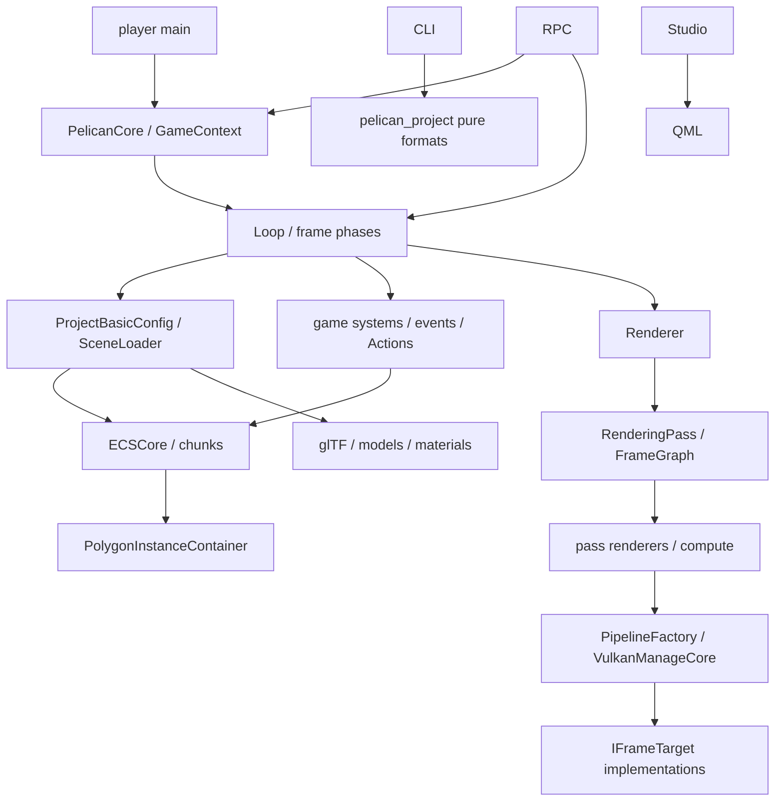

# 第8章 クラス・インターフェース索引

[索引へ戻る](README.md) / [前章](07_tools_rpc_tests.md) / [次章](09_black_magic_and_gotchas.md)

この章は「名前は分かったので宣言と本体へすぐ飛びたい」ときの索引です。全 private helper を列挙するのではなく、所有権または subsystem 境界を持つ主要型を収録しています。

## 8.1 Pelican で使われる6種類のインターフェース

Pelican の「interface」は pure virtual class だけではありません。実装は用途ごとに次の形を使い分けています。

| 形 | 代表 | 意味 |
|---|---|---|
| process module | [`DECLARE_MODULE`](../../src/core/container.hpp#L8) | process 中に遅延生成される実質 singleton。`GET_MODULE(T)` で取得 |
| public façade | [`GameContext`](../../src/core/userpublic/gamecontext.hpp#L20) | game code に内部 module を直接見せない、状態を持たない/薄い value façade |
| abstract interface | [`IFrameTarget`](../../src/core/vkcore/frametarget.hpp#L17) | window swapchain と headless target を virtual dispatch で交換 |
| tagged union | [`PassInfo`](../../src/core/renderingpass/renderingpass.hpp#L88) | 閉じた種類集合を `std::variant` と `visit`/type test で dispatch |
| type-erased callback table | [`ComponentInfo`](../../src/core/ecs/componentinfo.hpp#L20) | 任意 Component の construct/destroy/relocate/JSON 操作を function pointer 化 |
| resolver/adaptor | [`RenderTargetNameResolver`](../../src/core/renderingpass/rendertargetnameresolver.hpp#L11) | parser に巨大 container を渡さず、必要な名前解決だけを公開 |

この違いを無視して全部を「継承関係」として探すとコードを見失います。特に `DECLARE_MODULE` は base class ではなく、型ごとの `static std::optional<T>` を生む macro です。

## 8.2 名前の読み方

| suffix/prefix | だいたいの意味 | 例外・注意 |
|---|---|---|
| `...Definition` | parse 後、runtime object 作成前の value | Vulkan handle を持たないことが多い |
| `Compiled...` | name/definition が runtime ID や GPU object と結合済み | 必ずしも machine code の compile ではない |
| `...Container` | handle registry、GPU resource owner、state collection | 同じ base interface を持つわけではない |
| `...Core` | public wrapper から分離した testable implementation | `VulkanManageCore` は低レベル device owner という別の意味 |
| `...Resolver` | ID/name/path/view 変換の小さな read interface | ownership は持たない |
| `...Registerer` | template 型を runtime catalog へ型消去して登録 | static registration macro から呼ばれる |
| `...Loader` | file/JSON から runtime object への入口 | pure parser と runtime binding が別 file の場合あり |
| `...Renderer` | command buffer へ draw/dispatch を記録 | `Renderer` はそれらを束ねる orchestrator |

## 8.3 起動・module・frame lifecycle

| 名前 | 形 | 宣言 | 主実装 | 責務 |
|---|---|---|---|---|
| `PelicanCore` | public façade | [`pelican_core.hpp`](../../src/core/userpublic/pelican_core.hpp#L7) | [`run()`](../../src/core/userpublic/pelican_core.cpp#L32) | settings から runtime 全体を起動し、loop と teardown を囲む |
| `EngineLaunchConfig` | module | [`launchconfig.hpp`](../../src/core/launchconfig.hpp#L19) | [`player main` で設定](../../src/player/main.cpp#L353) | headless、RPC、project root、camera override、shader reload など起動時値 |
| `FastModuleContainer` | module 基盤 | [`container.hpp`](../../src/core/container.hpp#L20) | [`container.hpp`](../../src/core/container.hpp#L25) | 型ごとの static `optional<T>` を lazy construct し、local container 終了時に登録の逆順で reset |
| `Loop` | module/orchestrator | [`loop.hpp`](../../src/core/appflow/loop.hpp#L7) | [`Loop::run()`](../../src/core/appflow/loop.cpp#L118) | window、headless、RPC の loop mode を選び frame を進める |
| `EngineTime` | module | [`enginetime.hpp`](../../src/core/appflow/enginetime.hpp#L10) | [`setup/advance`](../../src/core/appflow/enginetime.cpp#L16) | realtime/fixed-step の time、dt、frame index |
| `FramerateAdjust` | module | [`framerate.hpp`](../../src/core/appflow/framerate.hpp#L7) | [`framerate.cpp`](../../src/core/appflow/framerate.cpp#L1) | window mode の frame pacing |
| `RuntimeTeardownGuard` | RAII guard | [`teardown.hpp`](../../src/core/appflow/teardown.hpp#L7) | [`teardown.cpp`](../../src/core/appflow/teardown.cpp#L25) | ECS、physics、GPU instance、deletion queue を依存順に明示解放 |
| `JobSystem` | singleton service | [`job_system.hpp`](../../src/core/job_system.hpp#L15) | [`job_system.cpp`](../../src/core/job_system.cpp#L1) | ECS system job の worker 実行と synchronization |
| `Profiler` / `ScopedLogTimer` | helper | [`profiler.hpp`](../../src/core/profiler.hpp#L9) | [`profiler.cpp`](../../src/core/profiler.cpp#L1) | scope duration を log へ記録 |

1 frame の共有関数は class ではなく [`updateFrameState()`](../../src/core/appflow/framephase.cpp#L17) です。入力、pre-update、game、post-update、scene transition の5 phase を通常 loop と RPC が共用します。

## 8.4 Project、path、data format、loading

| 名前 | 形 | 宣言 | 主実装 | 責務 |
|---|---|---|---|---|
| `ProjectSource` | module | [`projectsrc.hpp`](../../src/core/loader/projectsrc.hpp#L7) | [`projectsrc.cpp`](../../src/core/loader/projectsrc.cpp#L1) | 起動 settings と project root/source text を保持 |
| `ProjectBasicConfig` | module/value binding | [`basicconfig.hpp`](../../src/core/loader/basicconfig.hpp#L11) | [`constructor`](../../src/core/loader/basicconfig.cpp#L308) | engine default と project JSON を merge し型付き accessor を提供 |
| `PathResolver` | module | [`pathresolver.hpp`](../../src/core/loader/pathresolver.hpp#L58) | [`resolveRef()`](../../src/core/loader/pathresolver.cpp#L514) | `project://`、`engine://`、asset store、fragment、escape 防止 |
| `ResolvedRef` | variant value | [`pathresolver.hpp`](../../src/core/loader/pathresolver.hpp#L45) | [`resolveRef()`](../../src/core/loader/pathresolver.cpp#L514) | filesystem path、engine resource、project/engine fragment の和型 |
| `SceneFormatDocument` | pure document | [`sceneformat.hpp`](../../src/project/sceneformat.hpp#L11) | [`sceneformat.cpp`](../../src/project/sceneformat.cpp#L1) | scene v1 schema の validate/normalize 結果 |
| `SceneLoader` | module/runtime binder | [`scene.hpp`](../../src/core/loader/scene.hpp#L24) | [`load()`](../../src/core/loader/scene.cpp#L147) | scene clear/load、object name↔Entity、camera/light/model/collider binding |
| `ModelAssetContainer` | module/catalog | [`asset/model.hpp`](../../src/core/asset/model.hpp#L9) | [`model.cpp`](../../src/core/asset/model.cpp#L1) | asset data の model name と `ModelTemplate` を管理 |
| `GltfLoader` | module/loader | [`gltf.hpp`](../../src/core/model/gltf.hpp#L8) | [`gltf.cpp`](../../src/core/model/gltf.cpp#L1) | fastgltf data を geometry/material/model template へ変換 |
| `ModelTemplate` | value graph | [`modeltemplate.hpp`](../../src/core/model/modeltemplate.hpp#L9) | [`gltf load`](../../src/core/model/gltf.cpp#L1) | primitive range、material、skin/VAT metadata を持つ再配置可能 model 定義 |
| `LoadedImage` | value | [`imageloader.hpp`](../../src/core/loader/imageloader.hpp#L18) | [`imageloader.cpp`](../../src/core/loader/imageloader.cpp#L1) | stb/TinyEXR decode 後の pixels、extent、format |
| `AssetsManifest` 群 | pure document | [`assetsmanifest.hpp`](../../src/project/assetsmanifest.hpp#L26) | [`assetsmanifest.cpp`](../../src/project/assetsmanifest.cpp#L1) | file hash manifest の生成・検証・issue classification |
| `ImportManifest` 群 | pure document | [`importmanifest.hpp`](../../src/project/importmanifest.hpp#L11) | [`importmanifest.cpp`](../../src/project/importmanifest.cpp#L1) | 外部 tool delivery の source/output/SHA schema |
| `SurfaceFormatDocument` | pure document | [`surfaceformat.hpp`](../../src/project/surfaceformat.hpp#L48) | [`surfaceformat.cpp`](../../src/project/surfaceformat.cpp#L1) | `.surface` header と shader code の解析結果 |
| `MaterialFormatDocument` | pure document | [`materialformat.hpp`](../../src/project/materialformat.hpp#L41) | [`materialformat.cpp`](../../src/project/materialformat.cpp#L1) | material base、surface、parameter、texture の型付き定義 |
| `RenderFeatureComposeResult` | pure transformation result | [`featurecompose.hpp`](../../src/project/featurecompose.hpp#L16) | [`composeRenderFeatureConfig()`](../../src/project/featurecompose.cpp#L1) | base rendering JSON に feature fragment を順序付き合成 |

`ImageLoader` は class ではなく [`loadImageFile()` / `loadImageMemory()`](../../src/core/loader/imageloader.hpp#L27) という free function です。純粋変換に ownership object を無理に作らない方針がこの周辺に多く見られます。

## 8.5 公開 game API とサービス

project game code が最優先で参照する層です。内部の `GET_MODULE` を game 側へ漏らさない境界になっています。

| 名前 | 形 | 宣言 | 主実装 | 責務 |
|---|---|---|---|---|
| `GameContext` | public value façade | [`gamecontext.hpp`](../../src/core/userpublic/gamecontext.hpp#L20) | [`gamecontext.cpp`](../../src/core/userpublic/gamecontext.cpp#L1) | time、input、entity、camera、physics、audio、save、RNG を統一 API で公開 |
| `GameObjects` | typestate builder façade | [`gameobjects.hpp`](../../src/core/userpublic/gameobjects.hpp#L19) | [`gameobjects.cpp`](../../src/core/userpublic/gameobjects.cpp#L1) | Component 集合を template chain で指定して entity を create |
| `UserInput` | legacy/raw façade | [`userinput.hpp`](../../src/core/userpublic/userinput.hpp#L90) | [`userinput.cpp`](../../src/core/userpublic/userinput.cpp#L1) | key/mouse の frame snapshot を公開 |
| `Actions` | named action façade | [`userinput.hpp`](../../src/core/userpublic/userinput.hpp#L108) | [`userinput.cpp`](../../src/core/userpublic/userinput.cpp#L1) | action set stack、button/axis2 evaluation、consumption |
| `DeterministicRng` | module/service | [`deterministicrng.hpp`](../../src/core/userpublic/deterministicrng.hpp#L9) | [`deterministicrng.cpp`](../../src/core/userpublic/deterministicrng.cpp#L1) | PCG32 state と inclusive integer/float API |
| `Audio` | module + backend interface | [`audio.hpp`](../../src/core/audio/audio.hpp#L22) | [`audio.cpp`](../../src/core/audio/audio.cpp#L255) | sound handle、bus volume。miniaudio/Null backend を pimpl 的に選択 |
| `Persistence` | module/service | [`persistence.hpp`](../../src/core/persistence/persistence.hpp#L28) | [`saveData()`](../../src/core/persistence/persistence.cpp#L272) | settings、audio settings、slot save の検証と atomic replace |
| `PhysWorld` | module/runtime index | [`physworld.hpp`](../../src/core/phys/physworld.hpp#L33) | [`bindCollider()`](../../src/core/phys/physworld.cpp#L217) | object 名、transform、shape を bind し query/debug draw へ供給 |
| `phys::Shape` | variant geometry | [`physquery.hpp`](../../src/core/phys/physquery.hpp#L38) | [`physquery.cpp`](../../src/core/phys/physquery.cpp#L1) | sphere/box/capsule の raycast/overlap pure algorithm |
| `Camera` | module/state | [`camera.hpp`](../../src/core/renderer/camera.hpp#L15) | [`Camera::Camera()`](../../src/core/renderer/camera.cpp#L419) | projection/view、scene camera、orbit/follow/fly controller |
| `SeqPlayer` | optional module | [`seqplayer.hpp`](../../src/core/playback/seqplayer.hpp#L50) | [`seqplayer.cpp`](../../src/core/playback/seqplayer.cpp#L1) | JSONL transform sequence を時刻 sample して scene object へ適用 |
| `VatPlayer` | optional module | [`vatplayer.hpp`](../../src/core/playback/vatplayer.hpp#L11) | [`vatplayer.cpp`](../../src/core/playback/vatplayer.cpp#L1) | VAT clip の選択・再生状態を GPU instance へ反映 |

game system の interface は base class ではなく macro + function signature です。[`PELICAN_REGISTER_SYSTEM`](../../src/core/userpublic/details/system/registerer.hpp#L128) が `void(GameContext&)` callback と phase/order/name を catalog へ登録します。event も [`PELICAN_REGISTER_EVENT`](../../src/core/userpublic/details/event/registerer.hpp#L121) が型と handler を登録します。

## 8.6 ECS

| 名前 | 形 | 宣言 | 主実装 | 責務 |
|---|---|---|---|---|
| `ECSCore` | module façade | [`ecs/core.hpp`](../../src/core/ecs/core.hpp#L12) | header inline | 内部 `ECSCoreTemplatePublic` を所有し core/scene code へ narrow API を出す |
| `ECSCoreTemplatePublic` | world implementation | [`coretemplate.hpp`](../../src/core/userpublic/details/ecs/coretemplate.hpp#L40) | [`coretemplate.cpp`](../../src/core/userpublic/details/ecs/coretemplate.cpp#L25) | ID table、generation、archetype/chunk、system query cache、transaction mutation |
| `ECSComponentChunk` | SoA storage | [`chunk.hpp`](../../src/core/userpublic/details/ecs/chunk.hpp#L15) | [`chunk.cpp`](../../src/core/userpublic/details/ecs/chunk.cpp#L95) | archetype 固有の component arrays、versions、swap-delete、capacity 4096 |
| `ECSComponentChunk::VariedArray` | aligned type-erased array | [`chunk.hpp`](../../src/core/userpublic/details/ecs/chunk.hpp#L17) | [`chunk.cpp`](../../src/core/userpublic/details/ecs/chunk.cpp#L17) | size/alignment/callback だけで任意 component を格納 |
| `EntityId` | public value handle | [`entity.hpp`](../../src/core/userpublic/details/ecs/entity.hpp#L12) | value type | `index + generation`。stale handle を generation で拒否 |
| `ComponentRef` | untyped span view | [`component.hpp`](../../src/core/userpublic/details/ecs/component.hpp#L9) | value type | chunk 内の component base pointer、stride、count |
| `ChunkView` | system query view | [`coretemplate.hpp`](../../src/core/userpublic/details/ecs/coretemplate.hpp#L25) | [`update()` で組立](../../src/core/userpublic/details/ecs/coretemplate.hpp#L150) | required component ごとの pointer array と entity count |
| `ComponentInfo` | type-erased metadata | [`componentinfo.hpp`](../../src/core/ecs/componentinfo.hpp#L20) | registration callbacks | size/alignment/name/construct/destroy/relocate/init/deinit/JSON ref |
| `ComponentInfoManager` | module/catalog | [`componentinfo.hpp`](../../src/core/ecs/componentinfo.hpp#L34) | [`componentinfo.cpp`](../../src/core/ecs/componentinfo.cpp#L7) | Component ID→metadata、scene name→ID、JSON population |
| `UserComponentRegistererTemplatePublic` | template adapter | [`registerer.hpp`](../../src/core/userpublic/details/component/registerer.hpp#L19) | [`registerComponent<T>()`](../../src/core/userpublic/details/component/registerer.hpp#L34) | C++ type traits と member 有無を callback table へ変換 |
| `UserGameSystemRegistererTemplatePublic` | template adapter | [`system/registerer.hpp`](../../src/core/userpublic/details/system/registerer.hpp#L81) | [`system/registerer.cpp`](../../src/core/userpublic/details/system/registerer.cpp#L1) | static game system registration と deterministic sort |
| `UserEventRegistererTemplatePublic` | template adapter | [`event/registerer.hpp`](../../src/core/userpublic/details/event/registerer.hpp#L40) | [`event/registerer.cpp`](../../src/core/userpublic/details/event/registerer.cpp#L1) | event 型 catalog、JSON binder、frame queue、handler delivery |
| `ECSPredefinedRegistration` | module/bootstrap | [`predefined.hpp`](../../src/core/ecs/predefined.hpp#L10) | [`predefined.cpp`](../../src/core/ecs/predefined.cpp#L1) | built-in component と internal ECS system を登録 |
| `LocalTransformSystem` | ECS system module | [`localtransformsystem.hpp`](../../src/core/ecs/predefined/localtransformsystem.hpp#L12) | [`localtransformsystem.cpp`](../../src/core/ecs/predefined/localtransformsystem.cpp#L1) | public local transform を engine transform へ同期 |
| `SimpleModelViewTransformSystem` | ECS system module | [`modelviewtransoformsystem.hpp`](../../src/core/ecs/predefined/modelviewtransoformsystem.hpp#L12) | [`modelviewtransformsystem.cpp`](../../src/core/ecs/predefined/modelviewtransformsystem.cpp#L1) | ECS transform を GPU instance transform へ反映 |
| `SimpleModelViewUpdateSystem` | ECS system module | [`modelviewupdatesystem.hpp`](../../src/core/ecs/predefined/modelviewupdatesystem.hpp#L11) | [`modelviewupdatesystem.cpp`](../../src/core/ecs/predefined/modelviewupdatesystem.cpp#L1) | modelview change を GPU resource/update へ伝える |

Component value は [`LocalTransformComponent`](../../src/core/userpublic/components/localtransform.hpp#L10)、[`SimpleModelViewComponent`](../../src/core/userpublic/components/modelview.hpp#L10)、内部 [`TransformComponent`](../../src/core/ecs/predefined/transform.hpp#L9) などです。`ColliderComponent` は scene/public component 型ですが、調査時点では archetype chunk に入る通常 ECS component ではなく `SceneLoader` から `PhysWorld` へ直接 bind される特別経路です。

## 8.7 入力と frame boundary

| 名前 | 形 | 宣言 | 主実装 | 責務 |
|---|---|---|---|---|
| `InputStateCore` | testable core | [`inputstate.hpp`](../../src/core/os/inputstate.hpp#L114) | [`beginFrame()`](../../src/core/os/inputstate.cpp#L229) | ordered event queue から snapshot、edge、mouse delta を構築 |
| `InputState` | module wrapper | [`inputstate.hpp`](../../src/core/os/inputstate.hpp#L160) | [`inputstate.cpp`](../../src/core/os/inputstate.cpp#L355) | `InputStateCore` を module interface として転送 |
| `InputSnapshot` | immutable-ish frame value | [`inputstate.hpp`](../../src/core/os/inputstate.hpp#L19) | [`beginFrame()`](../../src/core/os/inputstate.cpp#L229) | down/pushed/released、cursor、delta、axis |
| `FrameInput` | scoped borrow | [`inputstate.hpp`](../../src/core/os/inputstate.hpp#L83) | [`currentFrameInput()`](../../src/core/os/inputstate.cpp#L314) | frame generation と borrow state を持ち、次 frame への持ち越しを検出 |
| `InputActionMap` | pure-ish parsed catalog | [`actionmap.hpp`](../../src/core/os/actionmap.hpp#L49) | [`actionmap.cpp`](../../src/core/os/actionmap.cpp#L1) | action set、binding、lookup を保持 |
| `InputActionFrame` | frame evaluator | [`actionmap.hpp`](../../src/core/os/actionmap.hpp#L71) | [`actionmap.cpp`](../../src/core/os/actionmap.cpp#L499) | frozen snapshot と set stack から action 値/consumption を評価 |
| `Window` | module/event source | [`window.hpp`](../../src/core/os/window.hpp#L15) | [`window.cpp`](../../src/core/os/window.cpp#L1) | GLFW window、Vulkan surface、native input callback |

## 8.8 Rendering: 定義、計画、runtime binding

| 名前 | 形 | 宣言 | 主実装 | 責務 |
|---|---|---|---|---|
| `Renderer` | module/orchestrator | [`renderer.hpp`](../../src/core/vkcore/renderer.hpp#L12) | [`render()`](../../src/core/vkcore/renderer.cpp#L472) | hot reload、frame target、frame graph execution、trace を束ねる |
| `PassDefinition` | pure definition | [`renderingpass.hpp`](../../src/core/renderingpass/renderingpass.hpp#L90) | JSON parser 群 | target、input、load/store、clear、`PassInfo` variant |
| `CompiledRenderingPass` | bound value | [`renderingpass.hpp`](../../src/core/renderingpass/renderingpass.hpp#L161) | [`compileRenderingPassRuntime()`](../../src/core/renderingpass/renderingpassruntimecompiler.cpp#L277) | pass/task definition と登録済み runtime ID の集合 |
| `RenderingPassContainer` | module/registry | [`renderingpasscontainer.hpp`](../../src/core/renderingpass/renderingpasscontainer.hpp#L13) | [`registerCompiledRenderingPass()`](../../src/core/renderingpass/renderingpasscontainer.cpp#L11) | rendering pass name/ID、enabled feature を保持 |
| `FrameGraphDefinition` | pure graph | [`frameplanner.hpp`](../../src/core/renderingpass/frameplanner.hpp#L26) | [`parseFrameGraphDefinitionsFromConfigJson()`](../../src/core/renderingpass/frameplanner.cpp#L558) | node declarations と既知 resource |
| `FramePlan` | planner output | [`frameplanner.hpp`](../../src/core/renderingpass/frameplanner.hpp#L49) | [`planFrameGraph()`](../../src/core/renderingpass/frameplanner.cpp#L600) | stable order、levels、RAW barriers |
| `FrameGraphRuntimeContainer` | module/binder | [`framegraphruntime.hpp`](../../src/core/renderingpass/framegraphruntime.hpp#L32) | [`registerExecutionPlan()`](../../src/core/renderingpass/framegraphruntime.cpp#L30) | plan の node 名を compiled pass/task index へ bind |
| `RenderTargetContainer` | module/GPU owner | [`rendertargetcontainer.hpp`](../../src/core/renderingpass/rendertargetcontainer.hpp#L14) | [`registerRenderTarget()`](../../src/core/renderingpass/rendertargetcontainer.cpp#L75) | named offscreen image/view、extent metadata、resize recreate |
| `RenderTargetNameResolver` | adaptor | [`rendertargetnameresolver.hpp`](../../src/core/renderingpass/rendertargetnameresolver.hpp#L11) | [`rendertargetnameresolver.cpp`](../../src/core/renderingpass/rendertargetnameresolver.cpp#L1) | JSON target 名→typed ID |
| `RenderTargetMetadataResolver` | adaptor | [`rendertargetmetadataresolver.hpp`](../../src/core/renderingpass/rendertargetmetadataresolver.hpp#L11) | [`rendertargetmetadataresolver.cpp`](../../src/core/renderingpass/rendertargetmetadataresolver.cpp#L1) | target ID→format/extent/usage |
| `RenderTargetImageViewResolver` | adaptor | [`rendertargetimageviewresolver.hpp`](../../src/core/renderingpass/rendertargetimageviewresolver.hpp#L10) | [`rendertargetimageviewresolver.cpp`](../../src/core/renderingpass/rendertargetimageviewresolver.cpp#L1) | target ID→current image view |
| `FrameGraphResourceContainer` | module/GPU owner | [`computetask.hpp`](../../src/core/renderingpass/computetask.hpp#L40) | [`registerBuffers()`](../../src/core/renderingpass/computetask.cpp#L287) | named storage buffers と descriptor info |
| `ComputeTaskContainer` | module/runtime registry | [`computetask.hpp`](../../src/core/renderingpass/computetask.hpp#L59) | [`registerComputeTask()`](../../src/core/renderingpass/computetask.cpp#L407) | compute pipeline、descriptor、dispatch group、barrier |
| `RenderPassExecutor` | module/executor | [`render_pass_executor.hpp`](../../src/core/vkcore/render_pass_executor.hpp#L20) | [`execute()`](../../src/core/vkcore/render_pass_executor.cpp#L8) | layout transition、Dynamic Rendering scope、variant dispatch |
| `RenderTargetLayoutTracker` | state helper | [`render_target_layout_tracker.hpp`](../../src/core/vkcore/render_target_layout_tracker.hpp#L12) | [`transition()`](../../src/core/vkcore/render_target_layout_tracker.cpp#L53) | concrete offscreen image の現在 layout を frame 間で追跡 |

## 8.9 Rendering: shader、Vulkan、resource owner

| 名前 | 形 | 宣言 | 主実装 | 責務 |
|---|---|---|---|---|
| `VulkanManageCore` | module/low-level owner | [`core.hpp`](../../src/core/vkcore/core.hpp#L24) | [`constructor`](../../src/core/vkcore/core.cpp#L241) | instance、device、queues、command pools、VMA allocation |
| `IFrameTarget` | abstract interface | [`frametarget.hpp`](../../src/core/vkcore/frametarget.hpp#L17) | implementations below | begin/end、caps、resize event、readback を抽象化 |
| `RenderTarget` | module/bridge | [`rendertarget.hpp`](../../src/core/vkcore/rendertarget.hpp#L24) | [`rendertarget.cpp`](../../src/core/vkcore/rendertarget.cpp#L15) | headless flag で `IFrameTarget` 実装を選び委譲 |
| `SwapchainFrameTarget` | interface implementation | [`swapchainframetarget.hpp`](../../src/core/vkcore/swapchainframetarget.hpp#L19) | [`render_begin()`](../../src/core/vkcore/swapchainframetarget.cpp#L195) | acquire、submit、present、surface-dependent recreate |
| `OffscreenFrameTarget` | interface implementation | [`offscreenframetarget.hpp`](../../src/core/vkcore/offscreenframetarget.hpp#L13) | [`render_begin()`](../../src/core/vkcore/offscreenframetarget.cpp#L118) | headless image、submit、RGBA8 readback |
| `CommandBufWrapper` | RAII/sync wrapper | [`cmdbuf.hpp`](../../src/core/vkcore/cmdbuf.hpp#L8) | [`cmdbuf.cpp`](../../src/core/vkcore/cmdbuf.cpp#L1) | command buffer、queue、fence を一組で begin/submit/wait |
| `BufferWrapper` / `ImageWrapper` | RAII value | [`buf.hpp`](../../src/core/vkcore/buf.hpp#L7) / [`image.hpp`](../../src/core/vkcore/image.hpp#L7) | [`VulkanManageCore::allocBuf()`](../../src/core/vkcore/core.cpp#L306) | Vulkan object と VMA allocation を同居させる |
| `VulkanUtils` | module/helper | [`util.hpp`](../../src/core/vkcore/util.hpp#L10) | [`util.cpp`](../../src/core/vkcore/util.cpp#L1) | staging copy と image layout transition command |
| `DeletionQueueCore` | type-erased deferred owner | [`deletionqueue.hpp`](../../src/core/vkcore/deletionqueue.hpp#L16) | [`beginFrame()`](../../src/core/vkcore/deletionqueue.cpp#L56) | frames-in-flight 後まで旧 GPU object の destructor を遅延 |
| `ShaderCompiler` | module/service | [`shadercompiler.hpp`](../../src/core/shader/shadercompiler.hpp#L27) | [`compileFile()`](../../src/core/shader/shadercompiler.cpp#L191) | GLSL source + define/include を SPIR-V へ compile |
| `ShaderReflection` | value | [`shaderreflection.hpp`](../../src/core/shader/shaderreflection.hpp#L21) | [`reflect()`](../../src/core/shader/shaderreflection.cpp#L58) | descriptor、push constant、vertex input、local size |
| `ShaderLibrary` | module/registry | [`shaderlibrary.hpp`](../../src/core/shader/shaderlibrary.hpp#L36) | [`load/reload`](../../src/core/shader/shaderlibrary.cpp#L175) | module + reflection + source/version/log の `ShaderBundle` 管理 |
| `PipelineFactory` | module/factory+registry | [`pipelinefactory.hpp`](../../src/core/shader/pipelinefactory.hpp#L46) | [`buildGraphicsPipeline()`](../../src/core/shader/pipelinefactory.cpp#L323) | reflection-driven layout、graphics/compute pipeline、cache、hot rebuild |
| `VertBufContainer` | module/GPU owner | [`vertbufcontainer.hpp`](../../src/core/model/vertbufcontainer.hpp#L40) | [`addPrimitiveEntry()`](../../src/core/model/vertbufcontainer.cpp#L32) | shared vertex/index/skinning buffers と primitive ranges |
| `MaterialContainer` | module/GPU owner | [`materialcontainer.hpp`](../../src/core/material/materialcontainer.hpp#L34) | [`registerMaterial()`](../../src/core/material/materialcontainer.cpp#L158) | texture、material descriptor/pipeline、push constants |
| `PolygonInstanceContainer` | module/GPU owner | [`polygoninstancecontainer.hpp`](../../src/core/renderer/polygoninstancecontainer.hpp#L25) | [`placeModelInstance()`](../../src/core/renderer/polygoninstancecontainer.cpp#L51) | model matrix buffer と indirect draw command、instance lifecycle |
| `LightContainer` | module/GPU owner | [`lightcontainer.hpp`](../../src/core/light/lightcontainer.hpp#L21) | [`load()`](../../src/core/light/lightcontainer.cpp#L149) | directional/point/spot light、shadow VP、GPU light buffer |
| `MaterialRenderer` | module/command recorder | [`materialrender.hpp`](../../src/core/renderer/materialrender.hpp#L25) | [`materialrender.cpp`](../../src/core/renderer/materialrender.cpp#L42) | geometry/material/instance を bind して indirect draw |
| `FullscreenPassContainer` | module/pass registry | [`fullscreenpasscontainer.hpp`](../../src/core/fullscreenpass/fullscreenpasscontainer.hpp#L16) | [`registerFullscreenPass()`](../../src/core/fullscreenpass/fullscreenpasscontainer.cpp#L115) | fullscreen pipeline と input descriptors |
| `FullscreenPassRenderer` | module/command recorder | [`fullscreenpassrenderer.hpp`](../../src/core/renderer/fullscreenpassrenderer.hpp#L25) | [`fullscreenpassrenderer.cpp`](../../src/core/renderer/fullscreenpassrenderer.cpp#L1) | fullscreen triangle と camera/light push/bind |
| `DebugDraw` | module/queue+renderer | [`debugdraw.hpp`](../../src/core/renderer/debugdraw.hpp#L19) | [`line/render`](../../src/core/renderer/debugdraw.cpp#L125) | frame 内 line vertex queue と pipeline |
| `DebugText` | module/queue+renderer | [`debugtext.hpp`](../../src/core/renderer/debugtext.hpp#L24) | [`text/render`](../../src/core/renderer/debugtext.cpp#L360) | glyph geometry、font texture、frame 内 text queue |
| `UIContainer` / `UiRenderer` | data owner / recorder | [`uicontainer.hpp`](../../src/core/renderer/uicontainer.hpp#L23) / [`uirenderer.hpp`](../../src/core/renderer/uirenderer.hpp#L25) | [`uicontainer.cpp`](../../src/core/renderer/uicontainer.cpp#L1) / [`uirenderer.cpp`](../../src/core/renderer/uirenderer.cpp#L1) | UI draw request/texture と Dynamic Rendering の UI pass |
| `RenderTiming` | optional module | [`rendertiming.hpp`](../../src/core/vkcore/rendertiming.hpp#L20) | [`rendertiming.cpp`](../../src/core/vkcore/rendertiming.cpp#L1) | timestamp query と pass ごとの GPU timing |

## 8.10 RPC、CLI、Studio

| 名前 | 形 | 宣言 | 主実装 | 責務 |
|---|---|---|---|---|
| `JsonRpcRequest/Error/ParseResult` | pure protocol values | [`jsonrpc.hpp`](../../src/project/jsonrpc.hpp#L21) | [`parseJsonRpcRequest()`](../../src/project/jsonrpc.cpp#L121) | engine 非依存の JSON-RPC parse/serialize |
| `RpcServer` | stream dispatcher | [`rpcserver.hpp`](../../src/core/communication/rpcserver.hpp#L22) | [`handleLine()`](../../src/core/communication/rpcserver.cpp#L484) | 1行1 request、method handler map、error normalization |
| engine RPC handlers | free registration function | [`runEngineRpcServer()`](../../src/core/communication/rpcserver.cpp#L521) | 同左 | protocol method を module/GameContext operation へ bind |
| CLI main | free dispatcher | [`devcli/main.cpp`](../../src/devcli/main.cpp#L9) | command files | `assets/import/dist-config/project` を dispatch |
| `DistConfigResult` | pure-ish result value | [`distconfig.hpp`](../../src/devcli/distconfig.hpp#L13) | [`deriveDistConfig()`](../../src/devcli/distconfig.cpp#L848) | project scan から build option と理由を保持 |
| `MainWindow` | Qt widget | [`mainwindow.hpp`](../../src/devstudio/view/mainwindow.hpp#L8) | [`mainwindow.cpp`](../../src/devstudio/view/mainwindow.cpp#L10) | `QQuickWidget` と QML engine を所有 |
| `TestBackend` | QObject prototype | [`testbackend.hpp`](../../src/devstudio/view/viewmodel/testbackend.hpp#L8) | [`testbackend.cpp`](../../src/devstudio/view/viewmodel/testbackend.cpp#L5) | QML へ仮の `name` property を公開 |
| `ProjectInfo` |未接続 model skeleton | [`project.hpp`](../../src/devstudio/model/project.hpp#L15) | header only | project name property。現 window flow では未使用 |

## 8.11 依存方向を一枚で見る

強い設計境界は `src/project` が GPU/module に依存しないこと、game code が `GameContext` を通ること、frame graph の純粋計画と GPU runtime binding が別であることです。逆に `src/core` 内の module 同士は `GET_MODULE` で密につながるため、constructor 時の依存と teardown 順には注意が必要です。
