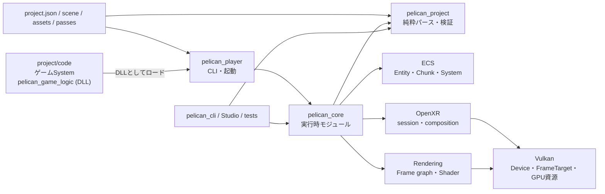

# Pelican2 ソースコード読解ガイド

調査時点: 2026-07-31

対象ブランチ: `codex/render-target-runtime-slice`

基準コミット: `dbbf82a`

章によっては冒頭に自前の調査時点を書いています(第10章)。その章についてはそちらの日付とコミットが正です。

この文書群は、Pelican2を「利用する方法」ではなく、**ソースコードがどう分割され、起動後に何がどの順で動き、複雑な実装がなぜその形になっているか**を理解するための読解ガイドです。

既存の利用マニュアルや設計文書とは目的を分けるため、[`docs/manual/`](../manual/00_index.md) には追加せず、独立した `docs/source-code-guide/` にまとめています。既存文書を正として言い換えたものではなく、調査時点の実装をソースから逆引きした資料です。

## このガイドの特徴

- 主要な説明には、実装へ直接ジャンプできる `ファイル#L行番号` リンクがあります。
- 公開API、エンジン内部モジュール、純粋なデータ変換層、Vulkan層を区別します。
- ECSは利用法だけでなく、世代付きID、アーキタイプ（archetype — 「同じComponentの組み合わせを持つentityの集まり」を1つの単位として扱うECSの分類）、SoAチャンク（SoA = structure of arrays。1 entity分をまとめた構造体を並べるのではなく、Componentごとに別々の連続配列へ分けて置く格納方式で、それを一定個数ずつ区切った箱がchunkです）、型消去（type erasure — 具体的な型ごとの情報をsize/alignmentと関数ポインタの表へ潰し、どんな型でも同じ経路で扱えるようにする手法）、ライフサイクル、変更検知、並列スケジューリングまで追います。
- マクロ、自動登録、`__COUNTER__`（展開されるたびに0, 1, 2…と増える整数へ置き換わるプリプロセッサ組み込みマクロ。展開ごとに重複しない番号を作るのに使います）、型消去コールバックなどの「黒魔術」は、展開後に何が起きるかを段階的に説明します。
- 完成済みの機能と、骨組みだけの箇所・現在の制約を分けて記載します。

## 読む順番

| 章 | 内容 | 最初に読むべき人 |
|---|---|---|
| [第1章 全体構造とビルド](01_architecture_and_build.md) | ターゲット、ディレクトリ、依存方向、外部ライブラリ、ビルド機能フラグ | 全員 |
| [第2章 起動・モジュール・1フレーム](02_runtime_lifecycle.md) | `main()` から初期化、5フェーズ更新、通常/headless/RPC、終了処理 | 実行経路を掴みたい人 |
| [第3章 プロジェクトデータとロード](03_project_and_loading.md) | `project.json`、パス解決、scene、asset、純粋パーサと実行時バインド | データ形式を追加する人 |
| [第4章 ECS徹底解剖](04_ecs_deep_dive.md) | Entity、Component、Chunk、System、登録、更新、削除、ロールバック | ECSを理解・変更する人 |
| [第5章 ゲームAPIとサービス](05_gameplay_and_services.md) | GameContext、ゲームSystem、Event、入力、Camera、Physics、Audio、保存 | ゲームコードを書く人 |
| [第6章 描画・Vulkan・Shader](06_rendering_vulkan_shader.md) | Rendering config、Frame graph、Dynamic Rendering、Shader反射、hot reload | レンダラを変更する人 |
| [第7章 ツール・RPC・テスト](07_tools_rpc_tests.md) | devcli、Studio、JSON-RPC、テストの種類と読み方 | ツール/CIを触る人 |
| [第8章 クラス・インターフェース索引](08_class_interface_index.md) | 主要型を責務別に引ける宣言/実装/テスト索引 | 名前から探したい人 |
| [第9章 黒魔術・制約・変更時の注意](09_black_magic_and_gotchas.md) | マクロ展開、型消去、静的初期化、寿命、現在の未実装点 | 深い改修をする人 |
| [第10章 前提知識の補足](10_background_knowledge.md) | このコードが当然としている一般知識(Vulkan / glTF / C++ / OS / アルゴリズム / 座標と数値) | コードは素直なのに読めないとき |

## 難所インデックス(詰まったときの逆引き)

各章には、**「初見ではまず読めない」実装**に `🧩 難所 — …` という解説ブロックがぶら下げてあります。何をする所か / なぜ素朴に読むと壊すのか / 骨子 / 読むときの手がかり / 触るときの不変条件、の順で書いてあります。読み飛ばしても本文は繋がるので、**詰まったときだけ開いてください**。

| 章 | 難所 |
|---|---|
| [第2章](02_runtime_lifecycle.md) | 「生成の逆順」が成立する条件 / 一本の順序が二つのモードを兼ねる / 名前は「解決」、中身は副作用 |
| [第3章](03_project_and_loading.md) | 保存の TOCTOU 窓 / preserve-world の逆算 / 128 枚の結合 palette / closure が identity を運ぶ / 二段公開と巻き戻し順 / rest 差分の回転移送 |
| [第4章](04_ecs_deep_dive.md) | 生成 transaction の三段構え / deinit を呼ぶ経路と呼ばない経路 / 型パックと indices の位置対応 / hazard 検出と計画の決定性 / generation 0 を跨がない台帳 / 移行 publish の relocate 舞踏 / publish を落とさない reserve |
| [第5章](05_gameplay_and_services.md) | provider 索引の再マップ / ε クラスタの全順序 / GJK 最近点の全列挙 / 保守的前進で TOI を出す / EPA の四面体と面選択 / 差分は 1 パスのマージ / 滑りと skin の引き算 / one-way 足場の進入側 / N-way ブレンドの符号正準化 / 親 index < 子 index / publish しない publish / 割り込みとスナップショット / schema の指紋を採る / 不完全型のまま consteval / 3 回舐めてから swap |
| [第6章](06_rendering_vulkan_shader.md) | preview 除外は 1 語差 / canonical bucket の番兵 / anchor 挿入と暗黙 after / format_class が format を上書き / writes-writes の曖昧検出 / barrier は後追いで作る / 決定性は set のキー / level は order で回す / `@history` は edge を作らない / sprite anchor の逆順スキャン / 量子化するのはアンカーだけ / 消さないための空呼び出し / リンクの向きは二方向 / push の先頭 64 byte / reload の swap は 3 回 / ジッタは w 倍で足す / epoch ペアが reset 信号 |
| [第7章](07_tools_rpc_tests.md) | 曖昧な重なり判定 / `edit` の逐次プリフライト / undo 前提の三段検証 / preview lease の状態機械 / preview の状態不変性検証 |
| [第9章](09_black_magic_and_gotchas.md) | 遅延生成の 49 行 / handle の CRTP と穴 / generation は 0 を跨がない / `struct_size` の 3 段ルール / `decltype` で catalog を掃く / void payload の消し方 |

この表は各章の代表を拾ったものです。表に載っていない難所ブロックもあるので、その章の全件が要るときは
`難所 —` で検索してください。

一般的でない専門用語(Floyd–Warshall・SFINAE・ADL・TOI・MTD・GJK/EPA・CAS・TOCTOU・ABA・Halton 列など)は、**各章の初出箇所で 1〜2 文の説明を添えてあります**。

難所ブロックが「このコードベース固有の難しさ」を扱うのに対して、**コード自体は素直なのに仕様や定番イディオムを知らなくて読めない**ときは [第10章 前提知識の補足](10_background_knowledge.md) を引いてください(Vulkan・glTF・C++・OS・アルゴリズム・座標と数値の 67 項目)。

## 最短の読解ルート

エンジン全体を最短で追うなら、次のリンクを順に開いてください。

1. [`main()`](../../src/player/main.cpp#L438) — CLIで起動条件を確定する。
2. [`PelicanCore::run()`](../../src/core/userpublic/pelican_core.cpp#L46) — 設定、ECS、scene、loopを組み立てる。
3. [`Loop::run()`](../../src/core/appflow/loop.cpp#L338) — 通常/XR/headless/RPCの実行方式を分ける（windowed + RPCを含む5経路）。
4. [`updateFrameState()`](../../src/core/appflow/framephase.cpp#L128) — 1フレームのゲーム状態更新を5フェーズで実行する。
5. [`ECSCoreTemplatePublic::update()`](../../src/core/userpublic/details/ecs/coretemplate.cpp#L663) — 内部ECS Systemを依存順に実行する（実行計画は [`buildECSExecutionPlan()`](../../src/core/userpublic/details/ecs/coretemplate.cpp#L206) が作る）。
6. [`Renderer::renderLogicalFrame()`](../../src/core/vkcore/renderer.cpp#L3710) — フレームグラフをGPUコマンドへ変換する。ここは view family を 1 つ受ける薄い overload で、本体は view families を取る [`Renderer::renderLogicalFrame()`](../../src/core/vkcore/renderer.cpp#L3710)。flat画面では [`Renderer::render()`](../../src/core/vkcore/renderer.cpp#L4522) がflat variantの選択と再lowering再試行を被せ、cameraから1 viewを組むのは引数なしの [`Renderer::render()`](../../src/core/vkcore/renderer.cpp#L4522)。
7. [`RuntimeTeardownGuard::run()`](../../src/core/appflow/teardown.cpp#L149) — 例外時もGPU/ECS/queue資源を規範順で解放する（実体は [`teardownRuntimeNoThrow()`](../../src/core/appflow/teardown.cpp#L119)）。

## リンクの見方

- `型名 → file.hpp#L10` の形式のリンクは宣言へ飛びます。
- `型名::関数 → file.cpp#L100` の形式のリンクは主要実装へ飛びます。
- 「仕様として読む」リンクは対応する [`test/`](../../test) のテストへ飛びます。

行番号はリファクタで必ずずれます。ずれたリンクは「無いリンク」より悪い(黙って無関係な
コードを指すため)ので、[`tools/doclink.py`](../../tools/doclink.py) が追従させます。

```bash
uv run tools/doclink.py check
```

インタプリタは uv がスクリプト冒頭の宣言から自前で用意するので、システムに Python を
入れる必要はありません。依存も無いので素の `python tools/doclink.py` でも動きます。

`check` は現状を報告するだけ、`update` が行番号を書き直します。追従の鍵は行番号ではなく
**アンカー**で、二通りあります。

- **シンボル** — リンク文字列が `` `Renderer::render()` `` のような識別子なら、対象ファイル中の
  **定義**を探し直します。`DECLARE_MODULE(Foo)` や `class PELICAN_API Foo` といった
  このリポジトリ固有の宣言の形も知っています。
- **台帳** — リンク文字列が識別子でないとき(ファイル名、日本語、`#L123` 自体)は、
  [`docs/link_anchors.json`](../link_anchors.json) が**その行の本文を憶えて**おり、
  次回はその本文を探し直します。

どちらでも決められないときは書き換えず、名指しで報告して終わります。候補が等距離に
2 つあるようなときに勘で選ばないための設計です。

### 追従では拾えない 2 種

`check` が見るのは「リンクがアンカーの上に居るか」だけです。アンカーを離れないまま
参照が嘘になる道が 2 つあり、そちらは `audit` が見ます。

```bash
uv run tools/doclink.py audit
```

- **最初から違う行にアンカーを取ってしまったもの** — 追従は健全に働き続けるのに、
  着地点がずっと間違っています。空行や閉じ括弧を指しているもの、ラベルが名指しした
  識別子が対象の前後 3 行に無いものを報告します。
- **消えた関数を説明している本文** — リンクが正しいファイルの正しい行を指していても、
  説明している関数が改名・削除されていれば無意味です。`` `foo()` `` 形式の記述を
  ソース全体の識別子と突き合わせます。

**第10章だけは行番号が追従されません。** あの章は markdown リンクではなく
`` `symbol()`(175 行) `` の形で 227 箇所を引用しており、9 割はファイルを文脈に依存します。
全部リンクにすると解説が読めなくなるため、追従の代わりに章の冒頭で基準コミットを宣言する
方を採っています。ただし `audit` の識別子検査は書式に依存しないので、**消えた関数の説明は
第10章でも検出されます**。

どちらも**人が判断して直すもの**なので、`update` のような自動修正はありません。
外部 API や「かつて存在した」という意図的な言及は
[`docs/doc_audit_allowlist.txt`](../doc_audit_allowlist.txt) に理由付きで登録します。
**登録した名前がソースへ復活すると audit が落ちます** — 免除が腐って溜まらないようにするためです。

commit 時に自動で走らせるには:

```bash
git config core.hooksPath tools/hooks
```

フックは**ステージ済みで、かつ未ステージの変更を持たない**文書だけを書き換えます
(`git add` が無関係な編集を巻き込まないため)。`--no-verify` で迂回できます。

## 一枚で見た全体像



大切なのは、`src/project` がGPUやモジュールコンテナに依存しない**形式ロジック**、`src/core` がそれを実行時オブジェクトへ結び付ける**エンジン本体**、`src/player` がプロセスの入口、という分担です。
