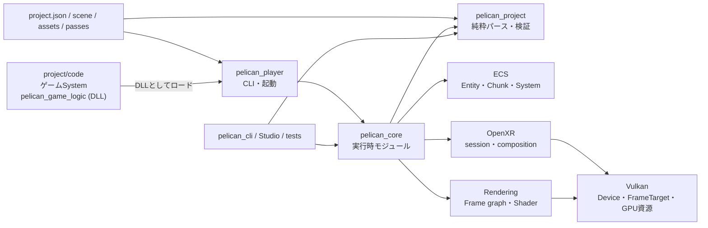

# Pelican2 ソースコード読解ガイド

調査時点: 2026-07-17

対象ブランチ: `codex/rendering-phase1-refactor`

基準コミット: `6326cfa`

この文書群は、Pelican2を「利用する方法」ではなく、**ソースコードがどう分割され、起動後に何がどの順で動き、複雑な実装がなぜその形になっているか**を理解するための読解ガイドです。

既存の利用マニュアルや設計文書とは目的を分けるため、[`docs/manual/`](../manual/00_index.md) には追加せず、独立した `docs/source-code-guide/` にまとめています。既存文書を正として言い換えたものではなく、調査時点の実装をソースから逆引きした資料です。

## このガイドの特徴

- 主要な説明には、実装へ直接ジャンプできる `ファイル#L行番号` リンクがあります。
- 公開API、エンジン内部モジュール、純粋なデータ変換層、Vulkan層を区別します。
- ECSは利用法だけでなく、世代付きID、アーキタイプ、SoAチャンク、型消去、ライフサイクル、変更検知、並列スケジューリングまで追います。
- マクロ、自動登録、`__COUNTER__`、型消去コールバックなどの「黒魔術」は、展開後に何が起きるかを段階的に説明します。
- 完成済みの機能と、骨組みだけの箇所・現在の制約を分けて記載します。

## 読む順番

| 章 | 内容 | 最初に読むべき人 |
|---|---|---|
| [第1章 全体構造とビルド](01_architecture_and_build.md) | ターゲット、ディレクトリ、依存方向、外部ライブラリ、ビルド機能フラグ | 全員 |
| [第2章 起動・モジュール・1フレーム](02_runtime_lifecycle.md) | `main()` から初期化、5フェーズ更新、通常/headless/RPC、終了処理 | 実行経路を掴みたい人 |
| [第3章 プロジェクトデータとロード](03_project_and_loading.md) | `project.json`、パス解決、scene、asset、純粋パーサと実行時バインド | データ形式を追加する人 |
| [第4章 ECS徹底解剖](04_ecs_deep_dive.md) | Entity、Component、Chunk、System、登録、更新、削除、ロールバック | ECSを理解・変更する人 |
| [第5章 ゲームAPIとサービス](05_gameplay_and_services.md) | GameContext、ゲームSystem、Event、入力、Camera、Physics、Audio、保存 | ゲームコードを書く人 |
| [第6章 描画・Vulkan・Shader](06_rendering_vulkan_shader.md) | Rendering config、Frame graph、Dynamic Rendering、Shader反射、hot reload | レンダラを変更する人 |
| [第7章 ツール・RPC・テスト](07_tools_rpc_tests.md) | devcli、Studio、JSON-RPC、テストの種類と読み方 | ツール/CIを触る人 |
| [第8章 クラス・インターフェース索引](08_class_interface_index.md) | 主要型を責務別に引ける宣言/実装/テスト索引 | 名前から探したい人 |
| [第9章 黒魔術・制約・変更時の注意](09_black_magic_and_gotchas.md) | マクロ展開、型消去、静的初期化、寿命、現在の未実装点 | 深い改修をする人 |

## 最短の読解ルート

エンジン全体を最短で追うなら、次のリンクを順に開いてください。

1. [`main()`](../../src/player/main.cpp#L433) — CLIで起動条件を確定する。
2. [`PelicanCore::run()`](../../src/core/userpublic/pelican_core.cpp#L44) — 設定、ECS、scene、loopを組み立てる。
3. [`Loop::run()`](../../src/core/appflow/loop.cpp#L283) — 通常/XR/headless/RPCの実行方式を分ける。
4. [`updateFrameState()`](../../src/core/appflow/framephase.cpp#L81) — 1フレームのゲーム状態更新を5フェーズで実行する。
5. [`ECSCoreTemplatePublic::update()`](../../src/core/userpublic/details/ecs/coretemplate.cpp#L386) — 内部ECS Systemを依存順に実行する。
6. [`Renderer::renderLogicalFrame()`](../../src/core/vkcore/renderer.cpp#L1082) — フレームグラフをGPUコマンドへ変換する。flat画面は [`render()`](../../src/core/vkcore/renderer.cpp#L1244) がその1-viewラッパ。
7. [`RuntimeTeardownGuard::run()`](../../src/core/appflow/teardown.cpp) — 例外時もGPU/ECS/queue資源を規範順で解放する（実体は [`teardownRuntimeNoThrow()`](../../src/core/appflow/teardown.cpp)）。

## リンクの見方

- `型名 → file.hpp#L10` の形式のリンクは宣言へ飛びます。
- `型名::関数 → file.cpp#L100` の形式のリンクは主要実装へ飛びます。
- 「仕様として読む」リンクは対応する [`test/`](../../test) のテストへ飛びます。
- 行番号は調査時点のものです。大きな編集後もファイルリンク自体は利用できます。

## 一枚で見た全体像

大切なのは、`src/project` がGPUやモジュールコンテナに依存しない**形式ロジック**、`src/core` がそれを実行時オブジェクトへ結び付ける**エンジン本体**、`src/player` がプロセスの入口、という分担です。
