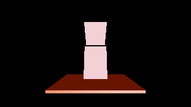

# WP135 VRM XR Demo

This self-contained project uses a deterministic synthetic VRM 1.0 character.
It contains all required humanoid bones, Idle/Walk/Run/Jump clips, four preset
expressions, expression lookAt, and a firstPerson `auto` mesh annotation. The
render graph deliberately has no TAA, projection jitter, velocity, history, or
UI feature, so the same project can activate the XR graph safely.



## Build and run (flat)

```powershell
cmake -S . -B build-vrm-xr-demo -DSKIP_DEVSTUDIO=ON `
  -DPELICAN_PROJECT=projects/vrm_xr_demo `
  -DPython3_EXECUTABLE=C:\Users\enjoy\AppData\Roaming\uv\python\cpython-3.12.13-windows-x86_64-none\python.exe
cmake --build build-vrm-xr-demo --config Debug
build-vrm-xr-demo\src\player\Debug\pelican_player.exe --project projects/vrm_xr_demo
```

- `W/A/S/D` (or the left gamepad stick) blends Idle to Walk/Run locomotion.
- `Space` (gamepad A) interrupts the current pose with Jump.
- `E` (gamepad B) cycles `happy`, `angry`, `sad`, and `relaxed`.
- Arrow keys (right stick) offset lookAt; without an offset the gaze follows
  the authored flat camera.

## Quest 3 / OpenXR activation

Make Meta Quest Link the active OpenXR runtime, connect Link or Air Link, then:

```powershell
build-vrm-xr-demo\src\player\Debug\pelican_player.exe `
  --project projects/vrm_xr_demo --xr on --input-profile touch
```

The Touch bindings are left thumbstick = locomotion, A = Jump, B = expression
cycle, right thumbstick = look offset, plus the public `aim_left/right` and
`grip_left/right` pose names. `head` is intentionally unbound: it is the
synthetic pose supplied by `xrLocateViews`. Both XR eyes use first-person
visibility, so the head-weighted triangles are omitted in the HMD while the
desktop flat view remains third-person.

## Replace the synthetic character

1. Copy a VRM **1.0** file into `assets/`.
2. Change the `vrm_xr_character` path in `assets/asset_data.json`.
3. Keep the scene object name `VrmXrHero`.
4. The replacement must provide clips named `Idle`, `Walk`, `Run`, and `Jump`.
   If its names differ, update both `movement.anim_graph.json` and the embedded
   graph in `code/vrmxrdemo.cpp`.
5. Presets `happy`, `angry`, `sad`, and `relaxed` are used when present. Update
   `expression_names` in the game code for a different expression set.

The committed `assets/vrm_xr_character.vrm` is generated with:

```powershell
build\test\Debug\pelican_test_vrm_fixture_writer.exe xr-demo `
  projects\vrm_xr_demo\assets\vrm_xr_character.vrm
```
